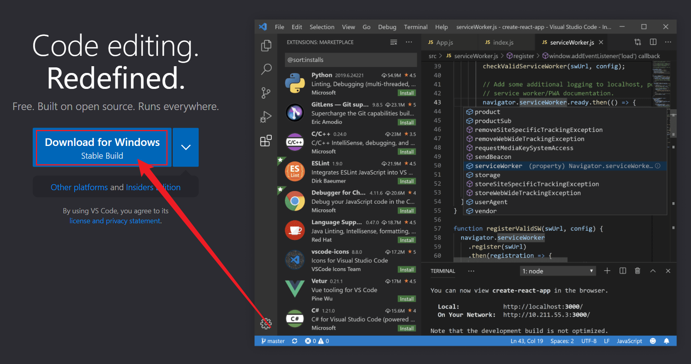
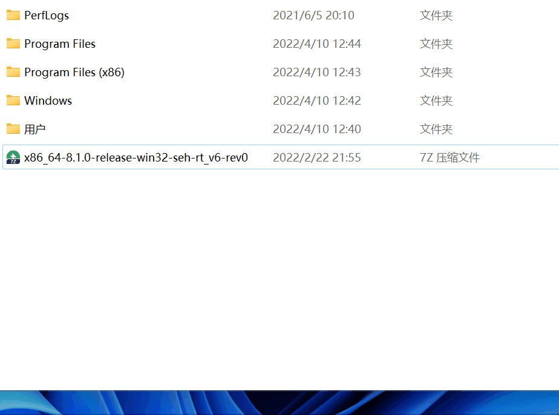
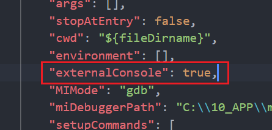
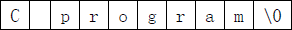

# IDE配置

## VS code配置

### Windows环境下快速配置

1. **下载编辑器VScode**

- 官网：https://code.visualstudio.com/（点链接时按下Ctrl，不会覆盖当前页面哦`^-^`）
<table style="border:none;text-align:center;width:auto;margin: 0 auto;">
  	<tbody>
  		<tr>
  			<td style="padding: 6px"></td>
  		</tr>
      <tr><td><strong>VS code下载</strong></td></tr>
  	</tbody>
  </table>

- 安装VScode（建议附加任务全部勾选）
<table style="border:none;text-align:center;width:auto;margin: 0 auto;">
	<tbody>
		<tr>
			<td style="padding: 6px"></td>
		</tr>
    <tr><td><strong>VS code安装示例（GIF文件，导出PDF可能无法正常播放）</strong></td></tr>
	</tbody>
</table>


2. **下载编译器MinGW并解压**
- 官网页面：https://www.mingw-w64.org/

- 下载页面：https://sourceforge.net/projects/mingw-w64/files/


  > 你可以进入官网自行寻找
  >
  > 你也可以直接点击为你找好的下载页面

- 下载页面中选择 `x86_64-win32-seh` 下载
<table style="border:none;text-align:center;width:auto;margin: 0 auto;">
	<tbody>
		<tr>
			<td style="padding: 6px"></td>
		</tr>
    <tr><td><strong>MinGW下载说明</strong></td></tr>
	</tbody>
</table>


  > 如果你因为网络环境限制无法下载
  >
  > 不限速下载，请笑纳^-^：https://wwn.lanzouh.com/iLOip031ku6b 密码:1234


- 在C盘中解压文件
<table style="border:none;text-align:center;width:auto;margin: 0 auto;">
	<tbody>
		<tr>
			<td style="padding: 6px"></td>
		</tr>
    <tr><td><strong>MinGW安装示例01（GIF文件，导出PDF可能无法正常播放）</strong></td></tr>
	</tbody>
</table>

  > 理论上你可以在任何地方解压，但注意路径不能包含中文，至于特殊字符请自行测试

3. **将MinGW添加至环境变量**
- 进入mingw64下的bin文件夹，复制当前路径，Win + i唤起系统设置，输入高级系统设置并进入，点击环境变量，选择path，编辑，新建，粘贴路径，按下三个确定
<table style="border:none;text-align:center;width:auto;margin: 0 auto;">
	<tbody>
		<tr>
			<td style="padding: 6px"></td>
		</tr>
    <tr><td><strong>MinGW安装示例02（GIF文件，导出PDF可能无法正常播放）</strong></td></tr>
	</tbody>
</table>

4. **配置VScode插件**
- 打开VScode安装插件 `Chinese` 和 `C/C++` ，等待安装完毕后重启VScode
<table style="border:none;text-align:center;width:auto;margin: 0 auto;">
	<tbody>
		<tr>
			<td style="padding: 6px"></td>
		</tr>
    <tr><td><strong>VS code安装插件示例01（GIF文件，导出PDF可能无法正常播放）</strong></td></tr>
	</tbody>
</table>

- 切换C/C++插件至 `1.8.4` 版本
<table style="border:none;text-align:center;width:auto;margin: 0 auto;">
	<tbody>
		<tr>
			<td style="padding: 6px"></td>
		</tr>
    <tr><td><strong>VS code安装插件示例02</strong></td></tr>
	</tbody>
</table>

  > 因最新版本不会自动生成launch.json文件，给后续优化带来不便，故退回旧版本。

5. **运行代码**
- 新建文件夹，修改为英文名称并进入，右键 `通过Code打开` 若在安装时未勾选相关选项，可能没有这个选项，请自行在VScode内操作打开文件夹

- 新建一个文件，英文命名且扩展名为 `.c` 

- 编写相关代码
  ```c
  #include <stdio.h>
  #include <stdlib.h>
  
  int main(void)
  {
      printf("Hello World!\n");
  
      system("pause");
  
      return 0;
  }
  ```

- VScode菜单栏，点击运行，启动调试，稍等程序运行，输出结果在下方终端，上方调试面板，点击最右边的 `橙色方框` 停止程序运行
<table style="border:none;text-align:center;width:auto;margin: 0 auto;">
	<tbody>
		<tr>
			<td style="padding: 6px"></td>
		</tr>
    <tr><td><strong>VS code运行代码示例（GIF文件，导出PDF可能无法正常播放）</strong></td></tr>
	</tbody>
</table>

6. **调整和优化**
> 请根据自己的需要进行优化
>
> 代码运行后 `.vscode` 文件夹会自动生成在你的源文件目录下
>
> `.vscode` 文件夹下的 `task.json` 和 `launch.json` 用来控制程序的运行和调试

- 将程序运行在外部控制台【推荐】

  - 打开`.vscode` 文件夹下的 `launch.json` 文件，找到 `"externalConsole": false,` 将 `false` 改为 `true` 并保存

<table style="border:none;text-align:center;width:auto;margin: 0 auto;">
	<tbody>
		<tr>
			<td style="padding: 6px"></td>
		</tr>
    <tr><td><strong>launch.json配置说明</strong></td></tr>
	</tbody>
</table>

- 解决中文乱码问题【推荐】

  - 打开`.vscode` 文件夹下的 `task.json` 文件，找到 `"${fileDirname}\\${fileBasenameNoExtension}.exe"` 在后面加上英文 `逗号` 然后回车到下一行，粘贴下面文本 `"-fexec-charset=GBK"` 并保存

<table style="border:none;text-align:center;width:auto;margin: 0 auto;">
<tbody>
<tr>
<td style="padding: 6px"></td>
</tr>
<tr><td><strong>task.json配置说明</strong></td></tr>
</tbody>
</table>


- 收纳生成的 `exe` 可执行文件【可选】

  - 打开`.vscode` 文件夹下的 `task.json` 文件，找到 `"${fileDirname}\\${fileBasenameNoExtension}.exe"` 

  - 修改成 `"${fileDirname}\\coin\\${fileBasenameNoExtension}.exe"` 并保存，同理，`launch.json` 下也有相同的字段，需要你修改

  - 在源文件同目录下新建 `coin` 文件夹，程序运行后，可执行文件将会生成在里面（其中 `coin` 可修改成你喜欢的英文名字）

    > 这样 `.c` 文件一多起来的时候，就不会出现 `.exe` 和 `.c` 相互穿插在目录中^-^
<table style="border:none;text-align:center;width:auto;margin: 0 auto;">
	<tbody>
		<tr>
			<td style="padding: 6px"></td>
		</tr>
    <tr><td><strong>文件归档示例</strong></td></tr>
	</tbody>
</table>

7. **提示**
- 若源代码文件夹含有中文路径，将会无法编译程序。
- 若Windows用户名使用了中文，可能无法运行。

### Mac环境下快速配置
1. **安装Command_Line_Tools_for_Xcode**

打开终端输入gcc，如果没有出现如下页面（clang error提示）就需要安装Command_Line_Tools_for_Xcode；如果有该提示表明系统内已经存在可用的gcc编译器无需重装，此时可以输入gcc -v查看gcc的版本
<table style="border:none;text-align:center;width:auto;margin: 0 auto;">
	<tbody>
		<tr>
			<td style="padding: 6px"></td>
		</tr>
    <tr><td><strong>测试gcc是否安装成功</strong></td></tr>
	</tbody>
</table>


注意下载的时间版本要对应系统版本，不要下载错了 

或者可以先安装HomeBrew，安装后安装lux、FFmpeg，过程中会自动安装Command_Line_Tools_for_Xcode

2. **安装VS Code（最好add code to path）**

首先去官网下载VS Code  https://code.visualstudio.com/?wt.mc_id=vscom_downloads

下载时间网速过慢的话可以将下载地址中的`az764295.vo.msecnd.net`更换为`vscode.cdn.azure.cn`使用国内的镜像服务器加速。

下载完成后打开Finder，进入Downloads文件夹内将下载的VS Code拖动到Applications 文件夹内就完成了安装
add code to path操作需要打开安装好的VS Code使用快捷键shift+command+P打开VS Code命令窗口   --->    输入shell    --->    选择Shell Command：install ‘code’ command in path

<table style="border:none;text-align:center;width:auto;margin: 0 auto;">
	<tbody>
		<tr>
			<td style="padding: 6px"></td>
		</tr>
    <tr><td><strong>设置code to path</strong></td></tr>
	</tbody>
</table>

进行完add code to path后在终端内直接输入code .就可以使用VS Code打开当前路径
<table style="border:none;text-align:center;width:auto;margin: 0 auto;">
	<tbody>
		<tr>
			<td style="padding: 6px"></td>
		</tr>
    <tr><td><strong>测试code to path_01</strong></td></tr>
	</tbody>
</table>

右下角提示安装成功，现在已经暂时可以使用code快捷指令了，但要在重启之后任然可以使用，需要做进一步配置。在终端运行：
```shell
where code
```

终端显示一个文件位置，类似：
```shell
/usr/local/bin/code
```

进入finder，前往刚终端得到的路径的上一级目录，如：``/usr/local/bin/``；找到code文件并双击运行:
<table style="border:none;text-align:center;width:auto;margin: 0 auto;">
	<tbody>
		<tr>
			<td style="padding: 6px"></td>
		</tr>
    <tr><td><strong>code路径</strong></td></tr>
	</tbody>
</table>

得到一个路径，如同：
```shell
/var/folders/xp/1t_w47qx1gn09v60xnw6zsbw0000gn/T/AppTranslocation/9A4FBD64-8EB8-471A-BD59-4407D9BCDFE5/d/Visual\ Studio\ Code.app/Contents/Resources/app/bin/code
```

终端运行下列指令
```shell
vim ~/.zshrc
```

按i进入插入模式，在文件尾部插入：
```text
alias code='/var/folders/xp/1t_w47qx1gn09v60xnw6zsbw0000gn/T/AppTranslocation/9A4FBD64-8EB8-471A-BD59-4407D9BCDFE5/d/Visual\ Studio\ Code.app/Contents/Resources/app/bin/code'
```

其中引号内为路径，换为自己刚运行code得到的路径，编辑完毕按ESC退出编辑模式，再输入：wq保存并关闭文件。

设置完成，重启以验证可用性。
<table style="border:none;text-align:center;width:auto;margin: 0 auto;">
	<tbody>
		<tr>
			<td style="padding: 6px"></td>
		</tr>
    <tr><td><strong>测试code to path_02</strong></td></tr>
	</tbody>
</table>

使用VS Code第一次打开一个目录时都会有一个询问是否信任的选项，直接打钩信任即可

3. **安装VS Code插件（配置C/C++环境）**
- C/C++
- C/C++ Extension Pack
- Code Runner

插件安装完配置Code Runner插件：打开Run in Terminal、Save All Files Before Run两个选项
<table style="border:none;text-align:center;width:auto;margin: 0 auto;">
	<tbody>
		<tr>
			<td style="padding: 6px"></td>
		</tr>
    <tr><td><strong>设置Code Runner</strong></td></tr>
	</tbody>
</table>

编写test.c测试IDE配置是否正确有效
<table style="border:none;text-align:center;width:auto;margin: 0 auto;">
	<tbody>
		<tr>
			<td style="padding: 6px"></td>
		</tr>
    <tr><td><strong>测试IDE配置是否成功</strong></td></tr>
	</tbody>
</table>


### 解决VS code下载速度过慢的问题

如果在[VS code官网](https://code.visualstudio.com)下载安装包时下载速度特别慢，可以复制下载地址，将域名替换为以下CDN链接（域名之后的其他路径保持不变）`http://vscode.cdn.azure.cn`

Mac系统可以直接点击这个链接进行下载[VSCode-darwin-universal.zip](http://vscode.cdn.azure.cn/stable/6261075646f055b99068d3688932416f2346dd3b/VSCode-darwin-universal.zip)

### Clangd+CMake+VS code环境配置

**安装WSL2前的shell设置**

[微软官方Win10 下 WSL 的安装方法](https://docs.microsoft.com/zh-cn/windows/wsl/install-win10)

简单来说Win 11 22H2以上版本的系统直接使用管理员权限在power shell中运行下面这一条指令

```shell
wsl --install
```

等到显示`正在安装: 适用于 Linux 的 Windows 子系统`的时候就可以Ctrl C取消运行了，然后去商店或者其他地方安装WSL版本的Linux就可以了【Windows旧版本需要使用旧版本的安装教程，具体步骤参阅 [官方文档](https://learn.microsoft.com/zh-cn/windows/wsl/install-manual)】

**安装WSL Linux**

到Windows商店下载Ubuntu并安装，安装完毕后安装以下软件

- llvm
- clang
- clangd
- lldb（VS Code调试器插件有带，也可以不用装）

​	接下来安装VS Code插件

- [中文语言包](https://marketplace.visualstudio.com/items?itemName=MS-CEINTL.vscode-language-pack-zh-hans)
- [WSL](https://marketplace.visualstudio.com/items?itemName=ms-vscode-remote.remote-wsl)
- [clangd](https://marketplace.visualstudio.com/items?itemName=llvm-vs-code-extensions.vscode-clangd)安装在WSL: Ubuntu中
- [CodeLLDB](https://marketplace.visualstudio.com/items?itemName=vadimcn.vscode-lldb)安装在WSL: Ubuntu中

以上插件安装完成后就可以新建文件测试了，在测试过程中会配置`launch.json`和`tasks.json`配置文件

测试文件代码如下

```c
#include <stdio.h>

int main(void){
    printf("Hello World!\n");

    return 0;
}
```

launch.json配置如下

```json
{
    // 使用 IntelliSense 了解相关属性。 
    // 悬停以查看现有属性的描述。
    // 欲了解更多信息，请访问: https://go.microsoft.com/fwlink/?linkid=830387
    "version": "0.2.0",
    "configurations": [
        {
            "type": "lldb",
            "request": "launch",
            "name": "Debug",
            "program": "${workspaceFolder}/buildfiles/${fileBasenameNoExtension}",  // 需要在当前工作区目录下新建buildfiles文件夹
            "args": [],
            "cwd": "${workspaceFolder}",
            "preLaunchTask": "Build C++",
            "internalConsoleOptions": "neverOpen",
            "console": "integratedTerminal"
        }
    ]
}
```

然后使用快捷键`Ctrl+Shift+p`打开命令窗口输入task选择`配置任务 Tasks:Configure Task`然后选择`使用模板创建`再选择`Others`就成功创建了`tasks.json`配置文件

tasks.json配置如下

```json
{
    // See https://go.microsoft.com/fwlink/?LinkId=733558
    // for the documentation about the tasks.json format
    "version": "2.0.0",
    "tasks": [
        {
            "label": "Build C++",   // 与launch.json中的preLaunchTask的值对应
            "type": "shell",
            "command": "clang",  // 编译器就是clang
            "args": [
                // "--std=c++20",  // 使用C++20的语言标准 C语言程序不需要打开
                "-g",   // 打开调试模式
                "-Wall",    // 打开所有警告
                "-o",   // 生成可执行文件
                "${workspaceFolder}/buildfiles/${fileBasenameNoExtension}",     // 代码路径，与launch.json中的program的值对应
                "${file}"
            ],
            "group": {
                "kind": "build",
                "isDefault": true
            }
        }
    ]
}
```

以上就完成了单文件使用clang编译执行的环境，如果需要多文件编译，需要配置CMake环境

在WSL中安装以下软件

- cmake
- make或者ninja（推荐ninja，比较快）

然后在VS Code中安装插件

- [CMake](https://marketplace.visualstudio.com/items?itemName=twxs.cmake)安装在WSL: Ubuntu中
- [CMake Tools](https://marketplace.visualstudio.com/items?itemName=ms-vscode.cmake-tools)安装在WSL: Ubuntu中

然后编写CMakeLists.txt以及测试文件

目录结构

```bash
.
├── CMakeLists.txt
├── head.h
├── hello.c
└── test.c
```

CMakeLists.txt文件内容

```text
PROJECT(Hello)

add_executable(
    Hello
    head.h
    hello.c
    test.c    
)
```

head.h文件内容

```c
#ifndef __HEAD_H__
#define __HEAD_H__

#include <stdio.h>

void test(void);

#endif
```

hello.c文件内容

```c
#include "head.h"

int main(void){
    test();

    return 0;
}
```

test.c文件内容

```c
#include "head.h"

void test(void){
    printf("Hello World!\n");
}
```

然后使用快捷键`Ctrl+Shift+p`打开命令窗口输入cmake选择`CMake:Configure`然后选择`Clang xxxx`

然后cd到buil文件夹下运行Hello文件测试输出是否正常，正常的情况下就可以重新配置launch.json文件了，此时已经不需要task.json文件了，可以把它删除掉

新配置的launch.json文件内容如下

```json
{
    // 使用 IntelliSense 了解相关属性。 
    // 悬停以查看现有属性的描述。
    // 欲了解更多信息，请访问: https://go.microsoft.com/fwlink/?linkid=830387
    "version": "0.2.0",
    "configurations": [
        {
            "type": "lldb",
            "request": "launch",
            "name": "Debug",
            "program": "${command:cmake.launchTargetPath}",  // cmake启动命令
            "args": [],
            "cwd": "${workspaceFolder}",
            "internalConsoleOptions": "neverOpen",
            "console": "integratedTerminal"
        }
    ]
}
```

然后配置clangd，打开VS Code的设置搜索clangd在Clangd:Arguments中添加以下选项

```txt
--compile-commands-dir=${workspaceFolder}/build
--header-insertion=never
```

然后配置clang-format代码格式化文件（在工作区目录下新建`.clang-format`文件）

```yaml
BasedOnStyle: LLVM
UseTab: Never
IndentWidth: 4
DerivePointerAlignment: false
PointerAlignment: true
AlwaysBreakAfterReturnType: None
AlwaysBreakTemplateDeclarations: true
AlwaysBreakBeforeMultilineStrings: true
AlignOperands: true
AlignAfterOpenBracket: true
AlignConsecutiveBitFields: true
AlignConsecutiveMacros: true
ConstructorInitializerAllOnOneLineOrOnePerLine: true
AllowAllConstructorInitializersOnNextLine: false
BinPackArguments: false
BinPackParameters: false
IncludeBlocks: Regroup
```

还可以配置一些自定义的Code Snippets

C语言的

```json
{
	// Place your snippets for c here. Each snippet is defined under a snippet name and has a prefix, body and 
	// description. The prefix is what is used to trigger the snippet and the body will be expanded and inserted. Possible variables are:
	// $1, $2 for tab stops, $0 for the final cursor position, and ${1:label}, ${2:another} for placeholders. Placeholders with the 
	// same ids are connected.
	// Example:
	// "Print to console": {
	// 	"prefix": "log",
	// 	"body": [
	// 		"console.log('$1');",
	// 		"$2"
	// 	],
	// 	"description": "Log output to console"
	// }

	"cmain": {
		"prefix": "cmain",
		"body": [
			"#include <stdio.h>",
			"\r",
			"int main(void){",
			// "\t${1:/* code */}",
			"\t$1",
			"\r",
			"\treturn 0;",
			"}"
		],
		"description": "新建文件时快速输入C语言main函数"
	}
}
```


### VS code优化使用体验篇（设置 | 插件）

> VS code是一个非常好用的文本编辑器，通过各式各样的插件几乎是万能的，也可以作为好用的IDE，但vscode有很多默认不开启的、以下是推荐开启的一些配置选项和一些好用的插件。

vscode官网：https://code.visualstudio.com/

**推荐设置**
settings.json中的一些基础配置

```json
{
  "files.autoSave": "afterDelay",
  "files.autoGuessEncoding": true,
  "workbench.list.smoothScrolling": true,
  "editor.cursorSmoothCaretAnimation": true,
  "editor.smoothScrolling": true,
  "editor.cursorBlinking": "smooth",
  "editor.mouseWheelZoom": true,
  "editor.formatOnPaste": true,
  "editor.formatOnType": true,
  "editor.formatOnSave": true,
  "editor.wordWrap": "on",
  "editor.guides.bracketPairs": true,
  //"editor.bracketPairColorization.enabled": true, (此设置vscode在较新版本已默认开启)
  "editor.suggest.snippetsPreventQuickSuggestions": false,
  "editor.acceptSuggestionOnEnter": "smart",
  "editor.suggestSelection": "recentlyUsed",
  "window.dialogStyle": "custom",
  "debug.showBreakpointsInOverviewRuler": true,
}
```


**插件**

> 插件种类繁多，对于各式各样的插件，我将我推荐的插件分成了四类，其中基础功能类是我认为在各种地方都很有帮助的插件，几乎可以是必备，其余的插件在很多情况下也很有用，可以按需安装

> **外观类**
>
> **主题**
>
> `One Dark Pro`
> 一款非常推荐的暗色调主题，好看又护眼。
>
> <table style="border:none;text-align:center;width:auto;margin: 0 auto;">
> <tbody>
> 	<tr>
> 		<td style="padding: 6px"></td>
> 	</tr>
> <tr><td><strong>One Dark Pro</strong></td></tr>
> </tbody>
> </table>
>
>
> **图标主题**
>
> `Material Icon Theme`
> 个人正在用的图标主题，好看，类型大而全
>
> <table style="border:none;text-align:center;width:auto;margin: 0 auto;">
> <tbody>
> 	<tr>
> 		<td style="padding: 6px"></td>
> 	</tr>
> <tr><td><strong>Material Icon Theme</strong></td></tr>
> </tbody>
> </table>
>
> `vscode-icons`
> 也是一款不错的图标主题
>
> <table style="border:none;text-align:center;width:auto;margin: 0 auto;">
> <tbody>
> 	<tr>
> 		<td style="padding: 6px"></td>
> 	</tr>
> <tr><td><strong>vscode-icons</strong></td></tr>
> </tbody>
> </table>

> **基础功能类**
>
> `Chinese (Simplified) (简体中文)`
> 【中文语言包】这应该不用多介绍，是vscode的官方中文语言包
>
> <table style="border:none;text-align:center;width:auto;margin: 0 auto;">
	<tbody>
		<tr>
			<td style="padding: 6px"></td>
		</tr>
    <tr><td><strong>Chinese (Simplified) (简体中文)</strong></td></tr>
	</tbody>
</table>
>
> `Error Lens`
> 【错误提示】可以将原先显示的问题显示在对应行右侧并高亮
>
> <table style="border:none;text-align:center;width:auto;margin: 0 auto;">
	<tbody>
		<tr>
			<td style="padding: 6px"></td>
		</tr>
    <tr><td><strong>Error Lens</strong></td></tr>
	</tbody>
</table>
>
> `Path Intellisense`
> 【路径补全】在输入路径时，有智能提示补全
>
> <table style="border:none;text-align:center;width:auto;margin: 0 auto;">
	<tbody>
		<tr>
			<td style="padding: 6px"></td>
		</tr>
    <tr><td><strong>Path Intellisense</strong></td></tr>
	</tbody>
</table>
>
> `Image preview`
> 【图像预览】可以预览引入的图像
>
> <table style="border:none;text-align:center;width:auto;margin: 0 auto;">
	<tbody>
		<tr>
			<td style="padding: 6px"></td>
		</tr>
    <tr><td><strong>Image preview</strong></td></tr>
	</tbody>
</table>
>`Markdown Preview Github Styling`
> markdown文件以GitHub的风格预览
> 
><table style="border:none;text-align:center;width:280px;margin: 0 auto;">
> <tbody>
		<tr>
			<td style="padding: 6px"></td>
		</tr>
	<tr><td><strong>Markdown Preview Github Styling</strong></td></tr>
    </tbody>
	</table>

> **拓展功能类**
>
> `CodeSnap`
> 【代码截图】一款非常好用的代码截图插件
>
> <table style="border:none;text-align:center;width:auto;margin: 0 auto;">
	<tbody>
		<tr>
			<td style="padding: 6px"></td>
		</tr>
    <tr><td><strong>CodeSnap</strong></td></tr>
	</tbody>
</table>
>
> `Prettier - Code formatter`
> 【代码格式化工具】支持超多语言，一键格式化，美化代码格式
>
> <table style="border:none;text-align:center;width:auto;margin: 0 auto;">
	<tbody>
		<tr>
			<td style="padding: 6px"></td>
		</tr>
    <tr><td><strong>Prettier - Code formatter</strong></td></tr>
	</tbody>
</table>
>`GBK to UTF8 for vscode`
> 【文件编码转化】可以将文件在GBK与UTF8编码之间无瑕转换
> 
><table style="border:none;text-align:center;width:auto;margin: 0 auto;">
> <tbody>
		<tr>
			<td style="padding: 6px"></td>
		</tr>
	<tr><td><strong>GBK to UTF8 for vscode</strong></td></tr>
    </tbody>
	</table>

>
> `Hex Editor`
> 用来查看文件的hex或UTF-8编码
>
> <table style="border:none;text-align:center;width:auto;margin: 0 auto;">
	<tbody>
		<tr>
			<td style="padding: 6px"></td>
		</tr>
    <tr><td><strong>Hex Editor</strong></td></tr>
	</tbody>
</table>
>
> `Remote - SSH`
> 【ssh连接】连接远程服务器或虚拟机
>
> <table style="border:none;text-align:center;width:auto;margin: 0 auto;">
	<tbody>
		<tr>
			<td style="padding: 6px"></td>
		</tr>
    <tr><td><strong>Remote - SSH</strong></td></tr>
	</tbody>
</table>
>`Vscode Google Translate`
> 使用谷歌翻译对代码进行翻译
<table style="border:none;text-align:center;width:300px;margin: 0 auto;">
	<tbody>
		<tr>
			<td style="padding: 6px"></td>
		</tr>
    <tr><td><strong>Vscode Google Translate</strong></td></tr>
	</tbody>
</table>

> 
> 修改配置：
>
> ```json
> "vscodeGoogleTranslate.host": "120.0.0.1",       // 如果为空 代理关闭
> "vscodeGoogleTranslate.port": "7890",       // 代理端口
> "vscodeGoogleTranslate.preferredLanguage": "English",       // 翻译默认目标语言
> ```

> **算法练习类**
>
> `Code Runner`
> 【代码运行工具】支持多种语言，语言运行环境需自己配置
> 推荐修改配置：
>
> ```json
> {
> "code-runner.runInTerminal": true,
> "code-runner.saveAllFilesBeforeRun": true,
> "code-runner.saveFileBeforeRun": true
> }
> ```
> <table style="border:none;text-align:center;width:auto;margin: 0 auto;">
	<tbody>
		<tr>
			<td style="padding: 6px"></td>
		</tr>
    <tr><td><strong>Code Runner</strong></td></tr>
	</tbody>
</table>
>`Competitive Programming Helper (cph)`
> 刷算法题时很好用，可以自己设置样例，一键全部运行
<table style="border:none;text-align:center;width:auto;margin: 0 auto;">
	<tbody>
		<tr>
			<td style="padding: 6px"></td>
		</tr>
    <tr><td><strong>Competitive Programming Helper (cph)</strong></td></tr>
	</tbody>
</table>
### VS Code设置代理

```bash
http://127.0.0.1:7890
```

## Clion使用手册

### Clion的安装激活步骤

**下载Clion**
[JetBrains出品的所有开发者工具和产品](https://www.jetbrains.com/zh-cn/products/#type=ide)

到上面JetBrains网站上下载操作系统相对应的版本，下载完成后正常安装即可

安装完成后不要着急打开软件，先下载激活文件，然后将激活文件拷贝到一个不易删除的地方，根据操作系统运行相应的激活脚本文件，激活脚本运行以后到激活网址里面复制相应软件的激活码

激活网址：[JETBRA.IN CHECKER | IPFS](https://3.jetbra.in)

使用激活码进行激活以后即可正常使用了


## 查找程序所依赖的动态库

Windows平台下，需要相应软件(Depends.exe)

<table style="border:none;text-align:center;width:auto;margin: 0 auto;">
	<tbody>
		<tr>
			<td style="padding: 6px"></td>
			<td style="padding: 6px"></td>
		</tr>
    <tr><td colspan="2"><strong>Depends使用示意</strong></td></tr>
	</tbody>
</table>


## Visual Studio配置

Microsoft Visual Studio（简称VS）是美国微软公司的开发工具包系列产品。VS是一个基本完整的开发工具集，它包括了整个软件生命周期中所需要的大部分工具，如UML工具、代码管控工具、集成开发环境(IDE)等等,所写的目标代码适用于微软支持的所有平台。Visual Studio是目前最流行的Windows平台应用程序的集成开发环境。

### VS常用快捷键

| **快捷键**        | **含义**       |
| ----------------- | -------------- |
| Ctrl + k,Ctrl + f | 自动格式化代码 |
| Ctrl + k,Ctrl + c | 注释代码       |
| Ctrl + k,Ctrl + u | 取消注释代码   |
| F9                | 设置断点       |
| F5                | 调试运行       |
| Ctrl + F5         | 不调试运行     |
| Ctrl + Shift + b  | 编译，不运行   |
| F10               | next调试       |
| F11               | step调试       |

### VS2013的C4996错误

由于微软在VS2013中不建议再使用C的传统库函数scanf,strcpy,sprintf等，所以直接使用这些库函数会提示C4996错误

<table style="border:none;text-align:center;width:auto;margin: 0 auto;">
	<tbody>
		<tr>
			<td style="padding: 6px"></td>
		</tr>
    <tr><td><strong>VS2013的C4996错误</strong></td></tr>
	</tbody>
</table>

VS建议采用带`_s`的函数，如`scanf_s`、`strcpy_s`，但这些并不是标准C函数。要想继续使用此函数，需要在源文件中添加以下指令就可以避免这个错误提示：

```c
#define _CRT_SECURE_NO_WARNINGS		//这个宏定义最好要放到.c文件的第一行
#pragma warning(disable:4996)		//或者使用这个
```

### 解决提示窗一闪而过

- 方法一：通过`system()`函数解决

在`return 0;`之前 添加`system("pause");`函数调用。（依赖头文件`<stdlib.h>`）

- 方法二：借助VS工具解决

在项目上 ---> 右键 ---> 属性 ---> 配置属性 ---> 连接器 ---> 系统 ---> 子系统 ---> 在下拉框中选择`控制台 (/SUBSYSTEM:CONSOLE)`选项

### 快捷导入代码

Visual Studio  –>  工具  –>  代码片段管理器  –>  Visual C++

# Git使用手册

## 网络代理

```shell
# 开启代理
git config --global http.proxy socks5://127.0.0.1:7890
git config --global https.proxy socks5://127.0.0.1:7890

# 取消代理
git config --global --unset http.proxy
git config --global --unset https.proxy

# curl、Wget代理
# 设置 http proxy
export http_proxy="http://127.0.0.1:7890"
# 设置 https proxy
export https_proxy="http://127.0.0.1:7890"
# 测试curl代理
curl google.com

# 取消curl、Wget代理
unset http_proxy
unset https_proxy
```

## 配置用户名和邮箱

```shell
# 配置用户名
git config --global user.name "Morax"

#配置邮箱
git config --global user.email "mroj2333@sina.com"

# 使用 --global 修饰后设置的全局的用户,如果设置单个项目的用户,可cd到项目根目录下,执行如下命令:
git config user.name "Your Name"
git config user.email "email@example.com"

# 可查看当前用户信息以及其他的一些信息：
git config --list
```


# C语言知识点

## 知识框架概述

### **总体上必须清楚的**

- 程序结构是三种:顺序结构 、选择结构(分支结构)、循环结构。
- 读程序都要从main()入口, 然后从最上面顺序往下读(碰到循环做循环,碰到选择做选择)，有且只有一个main函数。
- 计算机的数据在电脑中保存是以二进制的形式. 数据存放的位置就是 他的地址.
- bit是位 是指为0 或者1。 byte 是指字节, 一个字节 = 八个位.

### **易混淆的概念**

- 编译预处理不是C语言的一部分，不占运行时间，不要加分号。C语言编译的程序称为源程序，它以ASCII数值存放在文本文件中。
- `#define PI 3.1415926;`这个写法是错误的，一定不能出现分号。
- 每个C语言程序中main函数是有且只有一个。
- 在函数中不可以再定义函数。
- 算法：可以没有输入，但是一定要有输出。
- break可用于循环结构和switch语句。
- 逗号运算符的级别最低，赋值的级别倒数第二。

### **知识难点**

- 指针部分
- 数组部分
- 函数栈帧的创建与销毁
- 可变参数列表

## C89/C90、C99、C11——C语言的三套标准

语言最初由Dennis Ritchie于1969年到1973年在AT&T贝尔实验室里开发出来，主要用于重新实现Unix操作系统。此时，C语言又被称为K&R C。其中，K表示Kernighan的首字母，而R则是Ritchie的首字母。

K&R C语言与后来标准化的C语言有很大差异另外，当时的第一本C语言专业书《The C Programming Language》也并非一个正式的编程语言规范，但被用了许多年。

**C90标准**

由于C语言被各大公司所使用（包括当时处于鼎盛时期的IBM PC），因此到了1989年，C语言由美国国家标准协会（ANSI）进行了标准化，此时C语言又被称为ANSI C。

而仅过一年，ANSI C就被国际标准化组织ISO给采纳了。此时，C语言在ISO中有了一个官方名称——ISO/IEC9899:1990。其中：
- 9899是C语言在ISO标准中的代号，像[C++](http://c.biancheng.net/cplus/)在ISO标准中的代号是14882；
- 而冒号后面的1990表示当前修订好的版本是在1990年发布的。

对于ISO/IEC9899:1990的俗称或简称，有些地方称为C89，有些地方称为C90，或者C89/90。不管怎么称呼，它们都指代这个最初的C语言国际标准。

这个版本的C语言标准作为K&R C的一个超集（即K&R C是此标准C的一个子集），把后来引入的许多非官方特性也一起整合了进去。其中包括了从C++借鉴的函数原型（Function Prototypes），指向void的指针，对国际字符集以及本地语言环境的支持。在此标准中，尽管已经将函数定义的方式改为现在我们常用的那种方式，不过K&R的语法形式仍然兼容。

**C99标准**

在随后的几年里，C语言的标准化委员会又不断地对C语言进行改进，到了1999年，正式发布了ISO/IEC9899:1999，简称为C99标准。

C99标准引入了许多特性，包括内联函数（inline functions）、可变长度的数组、灵活的数组成员（用于结构体）、复合字面量、指定成员的初始化器、对IEEE754浮点数的改进、支持不定参数个数的宏定义，在数据类型上还增加了long long int以及复数类型。

毫不夸张地说，即便到目前为止，很少有C语言编译器是完整支持C99的。像主流的[GCC](http://c.biancheng.net/gcc/)以及Clang编译器都能支持高达90%以上，而微软的Visual Studio 2015中的C编译器只能支持到70%左右。

**C11标准**

2007年，C语言标准委员会又重新开始修订C语言，到了2011年正式发布了ISO/IEC9899:2011，简称为C11标准。

C11标准新引入的特征尽管没C99相对C90引入的那么多，但是这些也都十分有用，比如：字节对齐说明符、泛型机制（generic selection）、对多线程的支持、静态断言、原子操作以及对Unicode的支持。

关于C语言历史与演化进程的详细介绍可参考维基百科：https://en.wikipedia.org/wiki/C_(programming_language)

## 第一个C语言程序

C语言的源代码文件是一个普通的文本文件，但扩展名必须是`.c`。我们从演示一个简单的程序示例开始，解释该程序的功能。

使用IDE或者文本编辑器新建一个名为`Hello.c`的文件并键入以下代码文本（注意文件名是`Hello`扩展名是`.c`）。

```c
#include <stdio.h>

int main() {
    printf("hello world\n");

    return 0;
}
```

看看自己是否能明白该程序的用途，再认真阅读后面的解释。

### 示例解释

典型的C语言程序结构如下图所示

<table style="border:none;text-align:center;width:auto;margin: 0 auto;">
	<tbody>
		<tr>
			<td style="padding: 6px"></td>
		</tr>
    <tr><td><strong>C语言程序结构</strong></td></tr>
	</tbody>
</table>

**预处理指令**

- `#include`的意思是头文件包含，`#include <stdio.h>`代表包含`stdio.h`这个头文件
- 使用C语言库函数需要提前包含库函数对应的头文件，如这里**使用了`printf()`函数，需要包含`stdio.h`头文件**
- Linux环境下可以通过`man 3 printf`查看`printf()`所需的头文件

> **`#include< >`与`#include ""`的区别：**
>
> - `< >`表示系统直接按系统指定的目录检索
> - `""`表示系统先在`""`指定的路径(没写路径代表当前路径)查找头文件，如果找不到，再按系统指定的目录检索
>
> `stdio.h`是在操作系统的系统目录下：
>
> <table style="border:none;text-align:center;width:auto;margin: 0 auto;">
	<tbody>
		<tr>
			<td style="padding: 6px"></td>
		</tr>
    <tr><td><strong>stdio.h路径示意</strong></td></tr>
	</tbody>
</table>

**`main()`函数**

- 一个完整的C语言程序，是由一个、且只能有一个`main()`函数(又称主函数，必须有)和若干个其他函数结合而成（可选）。
- `main()`函数是C语言程序的入口，程序是从`main()`函数开始执行。

**程序体和代码块**

- 被`{}`包括的代码文本叫代码块，一个代码块内部可以有一条或者多条语句
- C语言每句可执行代码都是"`;`"分号结尾
- 所有的`#`开头的行，都代表预编译指令，预编译指令行结尾是没有分号的
- 所有的可执行语句必须是在代码块里面

**注释**

- `//`叫行注释，注释的内容编译器是忽略的，注释主要的作用是在代码中加一些说明和解释，这样有利于代码的阅读
- `/**/`叫块注释
- 块注释是C语言标准的注释方法
- 行注释是从C++语言借鉴过来的

**`printf()`函数**

- `printf()`是C语言库函数，功能是向标准输出设备输出一个字符串
- `printf(“hello world\n”);`中`\n`的意思是回车换行

**`return()`语句**

- return代表函数执行完毕，返回return代表函数的终止
- 如果`main()`函数定义的时候前面是int，那么return后面就需要写一个整数；如果`main()`函数定义的时候前面是void，那么return后面什么也不需要写
- 在`main()`函数中`return 0;`代表程序执行成功，`return -1;`代表程序执行失败
- `int main()`和`void main()`在C语言中是一样的，但C++语言只接受`int main()`这种定义方式

## C语言的编译过程

C语言代码编译成可执行程序经过4步：
- 预处理：**宏定义展开、头文件展开、条件编译**等，同时将代码中的注释删除，这里并**不会检查语法**
- 编译：检查语法，将预处理后文件编译**生成汇编文件**
- 汇编：将汇编文件生成**目标文件**(二进制文件)
- 链接：C语言写的程序是需要依赖各种库的，所以编译之后还需要**把库链接到最终的可执行程序中**

<table style="border:none;text-align:center;width:auto;margin: 0 auto;">
	<tbody>
		<tr>
			<td style="padding: 6px"></td>
		</tr>
    <tr><td><strong>C语言程序编译的过程</strong></td></tr>
	</tbody>
</table>
### GCC编译过程

- 分步编译

预处理：`gcc -E hello.c -o hello.i`

编 译：`gcc -S hello.i -o hello.s`

汇 编：`gcc -c hello.s -o hello.o`

链 接：`gcc  hello.o -o hello`

| **选项**   | **含义**                    |
| ---------- | --------------------------- |
| `-E`       | 只进行预处理                |
| `-S`(大写) | 只进行预处理和编译          |
| `-c`(小写) | 只进行预处理、编译和汇编    |
| `-o file`  | 指定生成的输出文件名为 file |

| **文件后缀** | **含义**              |
| ------------ | --------------------- |
| .c           | C 语言文件            |
| .i           | 预处理后的 C 语言文件 |
| .s           | 编译后的汇编文件      |
| .o           | 编译后的目标文件      |

<table style="border:none;text-align:center;width:auto;margin: 0 auto;">
	<tbody>
		<tr>
			<td style="padding: 6px"></td>
		</tr>
    <tr><td><strong>GCC分步编译的过程</strong></td></tr>
	</tbody>
</table>

- 一步编译

`gcc hello.c -o demo`还是会经过：预处理、编译、汇编、链接的过程（只是由编译器自动去完成了）

<table style="border:none;text-align:center;width:auto;margin: 0 auto;">
	<tbody>
		<tr>
			<td style="padding: 6px"></td>
		</tr>
    <tr><td><strong>GCC一步编译的过程</strong></td></tr>
	</tbody>
</table>


## 调试程序

- 添加行号
	如果编译器中有行号标示则不用添加，如果没有按以下步骤操作即可：工具 ---> 选项 ---> 文本编辑器 ---> C/C++ ---> 行号 选中该选项编译器中即可出现行号标示。

- 设置断点。
	点击行号旁边的空白处即可在改行设置断点

- F5启动调试

**调试过程中**

- 停止的位置，是尚未执行的指令；
- `逐语句执行一下条 （F11）`：进入函数内部，逐条执行跟踪；
- `逐过程执行一下条 （F10）`：不进入函数内部，逐条执行程序；
- 添加监视：
	调试 ---> 窗口 ---> 监视（输入监视变量名，自动监视变量值的变化）

## 数据类型

程序离不开数据。把数字、字母和文字输入计算机，就是希望它利用这些数据完成某些任务。例如，需要计算一份利息或显示一份葡萄酒商的排序列表。

<table style="border:none;text-align:center;width:auto;margin: 0 auto;">
	<tbody>
		<tr>
			<td style="padding: 6px"></td>
		</tr>
    <tr><td><strong>C语言的数据类型</strong></td></tr>
	</tbody>
</table>
**数据类型的作用**

编译器预算对象（变量）分配的内存空间大小。

### 关键字

由ANSI标准定义的C语言关键字共32个:

`auto` `double` `int` `struct` `break` `else` `long` `switch` `case` `enum` 

`register` `typedef` `char` `extern` `return` `union` `const` `float` `short` `unsigned`

`continue` `for` `signed` `void` `default` `goto` `sizeof` `volatile` `do` `if`

`while` `static`

根据关键字的作用，可以将关键字分为数据类型关键字和流程控制关键字两大类。

#### **数据类型关键字**

**基本数据类型（5个）**

- `void`：声明函数无返回值或无参数，声明无类型指针，显式丢弃运算结果
- `char`：字符型类型数据，属于整型数据的一种
- `int`：整型数据，通常为编译器指定的机器字长
- `float`：单精度浮点型数据，属于浮点数据的一种
- `double`：双精度浮点型数据，属于浮点数据的一种

**类型修饰关键字（4个）**

- `short`：修饰int，短整型数据，可省略被修饰的int。
- `long`：修饰int，长整形数据，可省略被修饰的int。
- `signed`：修饰整型数据，有符号数据类型
- `unsigned`：修饰整型数据，无符号数据类型

**复杂类型关键字（5个）**

- `struct`：结构体声明
- `union`：共用体声明
- `enum`：枚举声明
- `typedef`：声明类型别名
- `sizeof`：得到特定类型或特定类型变量的大小

**存储级别关键字（6个）**

- `auto`：指定为自动变量，由编译器自动分配及释放。通常在栈上分配
- `static`：指定为静态变量，分配在静态变量区，修饰函数时，指定函数作用域为文件内部
- `register`：指定为寄存器变量，建议编译器将变量存储到寄存器中使用，也可以修饰函数形参，建议编译器通过寄存器而不是堆栈传递参数
- `extern`：指定对应变量为外部变量，即在另外的目标文件中定义，可以认为是约定由另外文件声明的对象的一个“引用“
- `const`：与volatile合称“cv特性”，指定变量不可被当前线程/进程改变（但有可能被系统或其他线程/进程改变）
- `volatile`：与const合称“cv特性”，指定变量的值有可能会被系统或其他进程/线程改变，强制编译器每次从内存中取得该变量的值

#### **流程控制关键字**

**跳转结构（4个）**

- `return`：用在函数体中，返回特定值（或者是void值，即不返回值）
- `continue`：结束当前循环，开始下一轮循环
- `break`：跳出当前循环或switch结构
- `goto`：无条件跳转语句

**分支结构（5个）**

- `if`：条件语句
- `else`：条件语句否定分支（与if连用）
- `switch`：开关语句（多重分支语句）
- `case`：开关语句中的分支标记
- `default`：开关语句中的“其他”分治，可选。

**循环结构（3个）**

- `for`：for循环结构，for(1;2;3)4;的执行顺序为1->2->4->3->2...循环，其中2为循环条件
- `do`：do循环结构，do 1 while(2);的执行顺序是1->2->1...循环，2为循环条件
- `while`：while循环结构，while(1) 2;的执行顺序是1->2->1...循环，1为循环条件

以上循环语句，当循环条件表达式为真继续循环，为假则跳出循环。

#### 部分关键字详解

##### sizeof关键字

- sizeof不是函数，所以不需要包含任何头文件
- 它的功能是用来求一个变量、类型的大小，单位为字节
- 返回一个`size_t`类型，在32位操作系统下是`unsigned int`，是一个无符号的整数 使用`%u`接收返回值。

**使用方法**

`sizeof(数据类型名)`
`sizeof(int)`

或者

`sizeof(变量名)`
`int a = 20； sizeof(a);`

再或者

`sizeof 数据类型名/变量名`
虽然可以这样，但是不推荐！这种代码阅读性比较差

##### 类型限定符

| **限定符** | **含义**                                                     |
| :--------: | ------------------------------------------------------------ |
|   extern   | 声明一个变量，extern声明的变量没有建立存储空间。 extern int a;//变量在定义的时候创建存储空间 |
|   const    | 定义一个常量，常量的值不能修改。 const int a = 10;           |
|  Volatile  | 防止编译器优化代码                                           |
|  register  | 定义寄存器变量，提高效率。register是建议型的指令，而不是命令型的指令，如果CPU有空闲寄存器，那么register就生效，如果没有空闲寄存器，那么register无效。 |

### 标识符

在编程语言中，标识符是用户编程时使用的名字，变量、常量、函数、语句块都有名字。是用来标识某个实体的一个符号，是对变量名、函数名、标号和其他各种用户定义的对象命名

**命名规则**

- 标识符由字母、数字、下划线组成，并且首字母不能是数字
- 不能把C的关键字作为用户的标识符，例如：if、for、while等。（注：标识符不能和C语言的关键字相同，也不能和用户自定义的函数或C语言库函数同名）
- 标识符长度是由机器上的编译系统决定的，一般的限制为8字符，(注：8字符长度限制是C89标准，C99标准已经扩充长度，其实大部分工业标准都更长)
- 标识符对大小写敏感，即严格区分大小写。一般对变量名用小写，符号常量命名用大写。（注：C语言中字母是区分大小写的，因此score、Score、SCORE分别代表三个不同的标识符）
- 标识符命名应做到"见名知意"，例如，长度（外语：length），求和、总计（外语：sum），圆周率（外语：pi）

### 常量

- 在程序运行过程中，其值不能被改变的量
- 常量一般出现在表达式或赋值语句中

**定义语法**

第一种定义方式：使用宏定义【推荐使用这种方式定义】 

`#define 宏名 宏值`
`#define PI 3.1415`

> **定义宏语法**： 
>
> `#define 宏名 宏值`
>
> 【强调】：没有分号结束标记。 

第二种定义方式：使用关键字const进行修饰

`const 类型名 变量名 = 变量值;`
`const int a = 10;	`

> 被const关键字修饰的变量，表示为只读变量。

常见的常量有以下几种：

`“hello”`（字符串常量）、`'A'`（字符常量）、`-10`（整形常量）、`3.1415926`（浮点常量）

==简单来说：常量就是不会变化的数据，不能被修改。==

### 变量

- 在程序运行过程中，其值可以改变
- 变量在使用前必须先定义，定义变量前必须有相应的数据类型

**变量定义**

`类型名 变量名 = 变量值`	一般方法
`int r = 3;`

没有变量值的变量定义叫做变量声明

**变量声明**

一种方式是定义变量的时间不赋值，如`int a;`

另一种方式是在上一步的基础上添加关键字extern，如`extern int a;`

另种变量声明方式的区别是：添加了关键字extern的变量声明无法被提升为变量定义

> 1. 变量定义会开辟内存空间,变量声明不会开辟内存空间
> 2. 变量要想使用必须有定义
> 2.1 当编译器编译程序时，在变量使用之前，必须要看到变量定义。如果没有看到变量定义，编译器会自动找寻一个变量声明提升成为定义
> 2.2 如果该变量的声明前有 extern 关键字，无法提升

**声明和定义区别**

- 声明变量不需要建立存储空间
- 定义变量需要建立存储空间

从广义的角度来讲声明中包含着定义，即**定义是声明的一个特例**，所以并非所有的声明都是定义：

- int b它既是声明，同时又是定义
- 对于extern b来讲它只是声明不是定义

一般的情况下，把建立存储空间的声明称之为“定义”，而把不需要建立存储空间的声明称之为“声明”。

**变量特点**

- 变量在编译时为其分配相应的内存空间
- 可以通过其名字和地址访问相应内存

<table style="border:none;text-align:center;width:auto;margin: 0 auto;">
	<tbody>
		<tr>
			<td style="padding: 6px"></td>
		</tr>
	</tbody>
</table>
### 整型数据int


| 类型                     | 格式匹配符 |                      存储大小                       |                          值范围                          |
| :----------------------- | :--------: | :-------------------------------------------------: | :------------------------------------------------------: |
| `int`                    |    `%d`    |                      2或4字节                       | `-32,768`到`32,767` 或 `-2,147,483,648`到`2,147,483,647` |
| `unsigned int`           |    `%u`    |                      2或4字节                       |          `0`到`65,535` 或 `0`到`4,294,967,295`           |
| `short`                  |   `%hd`    |                        2字节                        |                   `-32,768`到`32,767`                    |
| `unsigned short`         |   `%hu`    |                        2字节                        |                      `0`到`65,535`                       |
| `long int`               |   `%ld`    | 4字节(Win32/64:4字节;Linux32:4字节, Linux64:8字节)  |            `-2,147,483,648`到`2,147,483,647`             |
| `unsigned long int`      |   `%lu`    | 4字节(Win32/64:4字节; Linux32:4字节, Linux64:8字节) |                   `0`到`4,294,967,295`                   |
| `long long int`          |   `%lld`   |                        8字节                        |                                                          |
| `unsigned long long int` |   `%llu`   |                        8字节                        |                                                          |


### 浮点型(实型)数据float、double

实型变量也可以称为浮点型变量，浮点型变量是用来存储小数数值的。在C语言中， 浮点型变量分为两种： 单精度浮点数(float)、 双精度浮点数(double)， 但是double型变量所表示的浮点数比float型变量更精确。

由于浮点型变量是由有限的存储单元组成的，因此只能提供有限的有效数字。在有效位以外的数字将被舍去，这样可能会产生一些误差。

不以f结尾的常量是double类型，以f结尾的常量(如`3.14f`)是float类型。

| 类型        | 格式匹配符 | 存储大小 | 值范围                   |    精度    |
| :---------- | :--------: | :------: | :----------------------- | :--------: |
| float       |    `%f`    |  4字节   | `1.2E-38`到`3.4E+38`     | 6位有效位  |
| double      |   `%lf`    |  8字节   | `2.3E-308`到`1.7E+308`   | 15位有效位 |
| long double |   `%llf`   |  16字节  | `3.4E-4932`到`1.1E+4932` | 19位有效位 |


### 字符型数据char

字符型变量用于存储一个单一字符，在C语言中用`char`表示，其中每个字符变量都会占用1个字节。在给字符型变量赋值时，需要用一对英文半角格式的单引号(`' '`)把字符括起来。

字符变量实际上并不是把该字符本身放到变量的内存单元中去，而是将该字符对应的ASCII编码放到变量的存储单元中。char的本质就是一个1字节大小的整型。

| 类型          | 格式匹配符 | 存储大小 |           值范围            |
| :------------ | :--------: | :------: | :-------------------------: |
| char          |    `%c`    |  1字节   | `-128`到`127` 或 `0`到`255` |
| unsigned char |    `%c`    |  1字节   |         `0`到`255`          |
| signed char   |    `%c`    |  1字节   |        `-128`到`127`        |

**转义字符`\`**

将普通字符转为 特殊意，将特殊字符转为本身意。

| **转义字符** | **含义**                            | **ASCII码值（十进制）** |
| :----------: | ----------------------------------- | :---------------------: |
| <u>`\a`</u>  | 警报                                |           007           |
| <u>`\b`</u>  | 退格(BS) ，将当前位置移到前一列     |           008           |
| <u>`\f`</u>  | 换页(FF)，将当前位置移到下页开头    |           012           |
| <u>`\n`</u>  | 换行(LF) ，将当前位置移到下一行开头 |           010           |
| <u>`\r`</u>  | 回车(CR) ，将当前位置移到本行开头   |           013           |
| <u>`\t`</u>  | 水平制表(HT) （跳到下一个TAB位置）  |           009           |
| <u>`\v`</u>  | 垂直制表(VT)                        |           011           |
|     `\\`     | 代表一个反斜线字符"\"               |           092           |
|     `\'`     | 代表一个单引号（撇号）字符          |           039           |
|     `\"`     | 代表一个双引号字符                  |           034           |
|     `\?`     | 代表一个问号                        |           063           |
|     `\0`     | 数字0                               |           000           |
|    `\ddd`    | 8进制转义字符，d范围0~7             |        3位8进制         |
|    `\xhh`    | 16进制转义字符，h范围0~9，a~f，A~F  |        3位16进制        |

注意：带有下划线标注的为不可打印字符。

### 字符串类型

C语言中没有 string ，要想在C语言中使用字符串，就要在头文件里定义`#include<string.h>`（引用）而字符串在c++里的定义是`#include<string>`；在C/C++中使用字符串也就是定义时不一样，其他的都一样。string 是字符串，char是单个的字符。string相当于一个容器，char可以放在里面。string有结束符，char是没有的。string是c++里的，不是c里的。用string存储字符串时，不用设定字符串的长度，而char要设定。还有就是，string有很强很方便的功能，比如可以方便的赋值，方便的比较大小。

在C语言中，字符串实际上是使用空字符`\0`结尾的一维字符数组。因此，`\0`是用于标记字符串的结束。

**空字符（Null character**）又称结束符，缩写`NUL`，是一个数值为`0`的控制字符，`\0`是转义字符，意思是告诉编译器，这不是字符`0`，而是空字符。

下面的声明和初始化创建了一个`RUNOOB` 字符串。由于在数组的末尾存储了空字符`\0`，所以字符数组的大小比单词**RUNOOB**的字符数多一个。

```
char site[7] = {'R', 'U', 'N', 'O', 'O', 'B', '\0'};
```

依据数组初始化规则，您可以把上面的语句写成以下语句：

```
char site[] = "RUNOOB";
```

以下是 C/C++ 中定义的字符串的内存表示：

<table style="border:none;text-align:center;width:auto;margin: 0 auto;">
	<tbody>
		<tr>
			<td style="padding: 6px"></td>
		</tr>
	</tbody>
</table>

其实，您不需要把`null`字符放在字符串常量的末尾。C编译器会在初始化数组时，自动把`\0`放在字符串的末尾。让我们尝试输出上面的字符串：

**实例**

```c
#include <stdio.h>

int main() {
    char site[7] = {'R', 'U', 'N', 'O', 'O', 'B', '\0'};

    printf("字符串site: %s\n", site);

    return 0;
}
```

当上面的代码被编译和执行时，它会产生下列结果：

```
字符串site: RUNOOB
```

#### 字符串常量

- 字符串是内存中一段连续的char空间，以`'\0'`(数字0)结尾。
- 字符串常量是由双引号括起来的字符序列，如`“china”`、`“C program”`，`“$12.5”`等都是合法的字符串常量。

字符串常量与字符常量的不同：

<table style="border:none;text-align:center;width:auto;margin: 0 auto;">
	<tbody>
		<tr>
			<td style="padding: 6px"></td>
		</tr>
	</tbody>
</table>

每个字符串的结尾，编译器会自动的添加一个结束标志位`'\0'`，即 "a" 包含两个字符`'a'`和`’\0’`。

## 运算符和表达式

### 常用运算符分类

| **运算符类型** | **作用**                               |
| -------------- | -------------------------------------- |
| 算术运算符     | 用于处理四则运算                       |
| 赋值运算符     | 用于将表达式的值赋给变量               |
| 比较运算符     | 用于表达式的比较，并返回一个真值或假值 |
| 逻辑运算符     | 用于根据表达式的值返回真值或假值       |
| 位运算符       | 用于处理数据的位运算                   |
| sizeof运算符   | 用于求字节数长度                       |

### 算术运算符

| **运算符** | **术语**   | **示例**    | **结果**  |
| ---------- | ---------- | ----------- | --------- |
| +          | 正号       | +3          | 3         |
| -          | 负号       | -3          | -3        |
| +          | 加         | 10 + 5      | 15        |
| -          | 减         | 10 - 5      | 5         |
| *          | 乘         | 10 * 5      | 50        |
| /          | 除         | 10 / 5      | 2         |
| %          | 取模(取余) | 10 % 3      | 1         |
| ++         | 前自增     | a=2; b=++a; | a=3; b=3; |
| ++         | 后自增     | a=2; b=a++; | a=3; b=2; |
| --         | 前自减     | a=2; b=--a; | a=1; b=1; |
| --         | 后自减     | a=2; b=a--; | a=1; b=2; |

### 赋值运算符

| **运算符** | **术语** | **示例**   | **结果**  |
| ---------- | -------- | ---------- | --------- |
| =          | 赋值     | a=2; b=3;  | a=2; b=3; |
| +=         | 加等于   | a=0; a+=2; | a=2;      |
| -=         | 减等于   | a=5; a-=3; | a=2;      |
| *=         | 乘等于   | a=2; a*=2; | a=4;      |
| /=         | 除等于   | a=4; a/=2; | a=2;      |
| %=         | 模等于   | a=3; a%2;  | a=1;      |

### 比较运算符

C 语言的比较运算中， “真”用数字“1”来表示， “假”用数字“0”来表示。

| **运算符** | **术语** | **示例** | **结果** |
| ---------- | -------- | -------- | -------- |
| ==         | 相等于   | 4 == 3   | 0        |
| !=         | 不等于   | 4 != 3   | 1        |
| <          | 小于     | 4 < 3    | 0        |
| >          | 大于     | 4 > 3    | 1        |
| <=         | 小于等于 | 4 <= 3   | 0        |
| >=         | 大于等于 | 4 >= 1   | 1        |

### 逻辑运算符

| **运算符** | **术语** | **示例** | **结果**                                                 |
| ---------- | -------- | -------- | -------------------------------------------------------- |
| !          | 非       | !a       | 如果a为假，则!a为真； 如果a为真，则!a为假。              |
| &&         | 与       | a && b   | 如果a和b都为真，则结果为真，否则为假。                   |
| \|\|       | 或       | a \|\| b | 如果a和b有一个为真，则结果为真，二者都为假时，结果为假。 |

### 运算符优先级

| **优先级**     | **运算符**     | **名称或含义**           | **使用形式**              | **结合方向** | **说明**   |
| -------------- | -------------- | ------------------------ | ------------------------- | :----------: | ---------- |
| **1**          | **[]**         | 数组下标                 | 数组名[常量表达式]        |    左到右    | --         |
| **()**         | 圆括号         | (表达式）/函数名(形参表) | --                        |              |            |
|                | **.**          | 成员选择（对象）         | 对象.成员名               |              | --         |
|                | **->**         | 成员选择（指针）         | 对象指针->成员名          |              | --         |
|                |                |                          |                           |              |            |
| **2**          | **-**          | 负号运算符               | -表达式                   |    右到左    | 单目运算符 |
| **~**          | 按位取反运算符 | ~表达式                  |                           |              |            |
|                | **++**         | 自增运算符               | ++变量名/变量名++         |              |            |
|                | **--**         | 自减运算符               | --变量名/变量名--         |              |            |
|                | *****          | 取值运算符               | *指针变量                 |              |            |
|                | **&**          | 取地址运算符             | &变量名                   |              |            |
|                | **!**          | 逻辑非运算符             | !表达式                   |              |            |
| **(****类型)** | 强制类型转换   | (数据类型)表达式         | --                        |              |            |
|                | **sizeof**     | 长度运算符               | sizeof(表达式)            |              | --         |
|                |                |                          |                           |              |            |
| **3**          | **/**          | 除                       | 表达式/表达式             |    左到右    | 双目运算符 |
| *****          | 乘             | 表达式*表达式            |                           |              |            |
|                | **%**          | 余数（取模）             | 整型表达式%整型表达式     |              |            |
| **4**          | **+**          | 加                       | 表达式+表达式             |    左到右    | 双目运算符 |
| **-**          | 减             | 表达式-表达式            |                           |              |            |
| **5**          | **<<**         | 左移                     | 变量<<表达式              |    左到右    | 双目运算符 |
| **>>**         | 右移           | 变量>>表达式             |                           |              |            |
| **6**          | **>**          | 大于                     | 表达式>表达式             |    左到右    | 双目运算符 |
| **>=**         | 大于等于       | 表达式>=表达式           |                           |              |            |
|                | **<**          | 小于                     | 表达式<表达式             |              |            |
|                | **<=**         | 小于等于                 | 表达式<=表达式            |              |            |
| **7**          | **==**         | 等于                     | 表达式==表达式            |    左到右    | 双目运算符 |
| **!****=**     | 不等于         | 表达式!= 表达式          |                           |              |            |
|                |                |                          |                           |              |            |
| **8**          | **&**          | 按位与                   | 表达式&表达式             |    左到右    | 双目运算符 |
| **9**          | **^**          | 按位异或                 | 表达式^表达式             |    左到右    | 双目运算符 |
| **10**         | **\|**         | 按位或                   | 表达式\|表达式            |    左到右    | 双目运算符 |
| **11**         | **&&**         | 逻辑与                   | 表达式&&表达式            |    左到右    | 双目运算符 |
| **12**         | **\|\|**       | 逻辑或                   | 表达式\|\|表达式          |    左到右    | 双目运算符 |
|                |                |                          |                           |              |            |
| **13**         | **?:**         | 条件运算符               | 表达式1? 表达式2: 表达式3 |    右到左    | 三目运算符 |
| **14**         | **=**          | 赋值运算符               | 变量=表达式               |    右到左    | --         |
| **/=**         | 除后赋值       | 变量/=表达式             | --                        |              |            |
|                | ***=**         | 乘后赋值                 | 变量*=表达式              |              | --         |
|                | **%=**         | 取模后赋值               | 变量%=表达式              |              | --         |
|                | **+=**         | 加后赋值                 | 变量+=表达式              |              | --         |
|                | **-=**         | 减后赋值                 | 变量-=表达式              |              | --         |
|                | **<<=**        | 左移后赋值               | 变量<<=表达式             |              | --         |
| **>>=**        | 右移后赋值     | 变量>>=表达式            | --                        |              |            |
| **&=**         | 按位与后赋值   | 变量&=表达式             | --                        |              |            |
|                | **^=**         | 按位异或后赋值           | 变量^=表达式              |              | --         |
|                | **\|=**        | 按位或后赋值             | 变量\|=表达式             |              | --         |
|                |                |                          |                           |              |            |
| **15**         | **，**         | 逗号运算符               | 表达式,表达式,…           |    左到右    | --         |

### 类型转换

数据有不同的类型，不同类型数据之间进行混合运算时必然涉及到类型的转换问题。

转换的方法有两种：

- **自动转换**(隐式转换)：遵循一定的规则,由编译系统自动完成。
- **强制类型转换**：把表达式的运算结果强制转换成所需的数据类型。

类型转换的原则：占用内存字节数少(值域小)的类型，向占用内存字节数多(值域大)的类型转换，以保证精度不降低。

<table style="border:none;text-align:center;width:auto;margin: 0 auto;">
	<tbody>
		<tr>
			<td style="padding: 6px"></td>
		</tr>
	</tbody>
</table>
#### 自动转换

自动类型转换就是编译器默默地、隐式地、偷偷地进行的数据类型转换，这种转换不需要程序员干预，会自动发生。

1. 将一种类型的数据赋值给另外一种类型的变量时就会发生自动类型转换，例如：
    `float f = 100;` 
    
    100 是 int 类型的数据，需要先转换为 float 类型才能赋值给变量 f。再如：
      `int n = f;`
    
    f 是 float 类型的数据，需要先转换为 int 类型才能赋值给变量 n。
    
    在赋值运算中，赋值号两边的数据类型不同时，需要把右边表达式的类型转换为左边变量的类型，这可能会导致数据失真，或者精度降低；所以说，自动类型转换并不一定是安全的。对于不安全的类型转换，编译器一般会给出警告。

2. 在不同类型的混合运算中，编译器也会自动地转换数据类型，将参与运算的所有数据先转换为同一种类型，然后再进行计算。转换的规则如下：
- 转换按数据长度增加的方向进行，以保证数值不失真，或者精度不降低。例如，int 和 long 参与运算时，先把 int 类型的数据转成 long 类型后再进行运算。
- 所有的浮点运算都是以双精度进行的，即使运算中只有 float 类型，也要先转换为 double 类型，才能进行运算。
- char 和 short 参与运算时，必须先转换成 int 类型。

下图对这种转换规则进行了更加形象地描述：
<table style="border:none;text-align:center;width:auto;margin: 0 auto;">
	<tbody>
		<tr>
			<td style="padding: 6px"></td>
		</tr>
	</tbody>
</table>

> unsigned 也即 unsigned int，此时可以省略 int，只写 unsigned。

自动类型转换示例：

```c
#include <stdio.h>

int main(void){
    float PI = 3.14159;
    int s1, r = 5;
    double s2;
    s1 = r * r * PI;
    s2 = r * r * PI;
    printf("s1=%d, s2=%f\n", s1, s2);

    return 0;
}
```

运行结果：

```bash
s1=78, s2=78.539749
```

在计算表达式`r*r*PI`时，r 和 PI 都被转换成 double 类型，表达式的结果也是 double 类型。但由于 s1 为整型，所以赋值运算的结果仍为整型，舍去了小数部分，导致数据失真。

#### 强制类型转换

自动类型转换是编译器根据代码的上下文环境自行判断的结果，有时候并不是那么“智能”，不能满足所有的需求。如果需要，程序员也可以自己在代码中明确地提出要进行类型转换，这称为强制类型转换。

自动类型转换是编译器默默地、隐式地进行的一种类型转换，不需要在代码中体现出来；强制类型转换是程序员明确提出的、需要通过特定格式的代码来指明的一种类型转换。换句话说，自动类型转换不需要程序员干预，强制类型转换必须有程序员干预。

强制类型转换的格式为：

```c
(type_name) expression
```

`type_name`为新类型名称，`expression`为表达式。例如：

```c
(float) a;  //将变量 a 转换为 float 类型
(int)(x+y);  //把表达式 x+y 的结果转换为 int 整型
(float) 100;  //将数值 100（默认为int类型）转换为 float 类型
```

下面是一个需要强制类型转换的经典例子：

```c
#include <stdio.h>

int main(void){
    int sum = 103;  // 总数
    int count = 7;  // 数目
    double average; // 平均数
    average = (double)sum / count;
    printf("Average is %lf!\n", average);

    return 0;
}
```

运行结果：

```bash
Average is 14.714286!
```

sum 和 count 都是 int 类型，如果不进行干预，那么`sum / count`的运算结果也是 int 类型，小数部分将被丢弃；虽然是 average 是 double 类型，可以接收小数部分，但是心有余力不足，小数部分提前就被“阉割”了，它只能接收到整数部分，这就导致除法运算的结果严重失真。

既然 average 是 double 类型，为何不充分利用，尽量提高运算结果的精度呢？为了达到这个目标，我们只要将 sum 或者 count 其中之一转换为 double 类型即可。上面的代码中，我们将 sum 强制转换为 double 类型，这样`sum / count`的结果也将变成 double 类型，就可以保留小数部分了，average 接收到的值也会更加精确。

在这段代码中，有两点需要注意：

- 对于除法运算，如果除数和被除数都是整数，那么运算结果也是整数，小数部分将被直接丢弃；如果除数和被除数其中有一个是小数，那么运算结果也是小数。
- `( )`的优先级高于`/`，对于表达式`(double) sum / count`，会先执行`(double) sum`，将 sum 转换为 double 类型，然后再进行除法运算，这样运算结果也是 double 类型，能够保留小数部分。注意不要写作`(double) (sum / count)`，这样写运算结果将是 3.000000，仍然不能保留小数部分。

#### 类型转换只是临时性的

无论是自动类型转换还是强制类型转换，都只是为了本次运算而进行的临时性转换，转换的结果也会保存到临时的内存空间，不会改变数据本来的类型或者值。请看下面的例子：

```c
#include <stdio.h>

int main(void){
    double total = 400.8; // 总价
    int count = 5;        // 数目
    double unit;          // 单价
    int total_int = (int)total;
    unit = total / count;
    printf("total=%lf, total_int=%d, unit=%lf\n", total, total_int, unit);

    return 0;
}
```

运行结果：
```bash
total=400.800000, total_int=400, unit=80.160000
```

注意看第 7 行代码，total 变量被转换成了 int 类型才赋值给 total_int 变量，而这种转换并未影响 total 变量本身的类型和值。如果 total 的值变了，那么 total 的输出结果将变为 400.000000；如果 total 的类型变了，那么 unit 的输出结果将变为 80.000000。

#### 自动类型转换 VS 强制类型转换

在C语言中，有些类型既可以自动转换，也可以强制转换，例如 int 到 double，float 到 int 等；而有些类型只能强制转换，不能自动转换，例如以后将要学到的 void * 到 int *，int 到 char * 等。

可以自动转换的类型一定能够强制转换，但是，需要强制转换的类型不一定能够自动转换。现在我们学到的数据类型，既可以自动转换，又可以强制转换，以后我们还会学到一些只能强制转换而不能自动转换的类型。

可以自动进行的类型转换一般风险较低，不会对程序带来严重的后果，例如，int 到 double 没有什么缺点，float 到 int 顶多是数值失真。只能强制进行的类型转换一般风险较高，或者行为匪夷所思，例如，char * 到 int * 就是很奇怪的一种转换，这会导致取得的值也很奇怪，再如，int 到 char * 就是风险极高的一种转换，一般会导致程序崩溃。

使用强制类型转换时，程序员自己要意识到潜在的风险。

## 程序流程结构

### 概述

C语言支持最基本的三种程序运行结构：顺序结构、选择结构、循环结构。

- 顺序结构：程序按顺序执行，不发生跳转。
- 选择结构：依据是否满足条件，有选择的执行相应功能。
- 循环结构：依据条件是否满足，循环多次执行某段代码。

### 选择结构

#### if-else语句

前面我们看到的代码都是顺序执行的，也就是先执行第一条语句，然后是第二条、第三条……一直到最后一条语句，这称为顺序结构。

但是对于很多情况，顺序结构的代码是远远不够的，比如一个程序限制了只能成年人使用，儿童因为年龄不够，没有权限使用。这时候程序就需要做出判断，看用户是否是成年人，并给出提示。

在C语言中，使用`if`和`else`关键字对条件进行判断。请先看下面的代码：

```c
#include <stdio.h>

int main(void){
    int age;
    printf("请输入你的年龄：");
    scanf("%d", &age);
    if (age >= 18) {
        printf("恭喜，你已经成年，可以使用该软件！\n");
    } else {
        printf("抱歉，你还未成年，不宜使用该软件！\n");
    }
    return 0;
}
```

可能的运行结果：

```bash
请输入你的年龄：23
恭喜，你已经成年，可以使用该软件！
```

或者：

```bash
请输入你的年龄：16
抱歉，你还未成年，不宜使用该软件！
```

这段代码中，`age>=18`是需要判断的条件，`>=`表示“大于等于”，等价于数学中的`≥`。

如果条件成立，也即 age 大于或者等于 18，那么执行`if`后面的语句（第8行）；如果条件不成立，也即 age 小于 18，那么执行`else`后面的语句（第10行）。

if 和 else 是两个新的关键字，if 意为“如果”，else 意为“否则”，用来对条件进行判断，并根据判断结果执行不同的语句。总结起来，if else的结构为：

```c
if(判断条件){
    语句块1
}else{
    语句块2
}
```

意思是，如果判断条件成立，那么执行语句块1，否则执行语句块2 。其执行过程可表示为下图：
<table style="border:none;text-align:center;width:auto;margin: 0 auto;">
	<tbody>
		<tr>
			<td style="padding: 6px"></td>
		</tr>
	</tbody>
</table>
所谓语句块（Statement Block），就是由`{ }`包围的一个或多个语句的集合。如果语句块中只有一个语句，也可以省略`{ }`，例如：

```c
if (age >= 18) {
  printf("恭喜，你已经成年，可以使用该软件！\n");
} else {
  printf("抱歉，你还未成年，不宜使用该软件！\n");
}
```

由于if else 语句可以根据不同的情况执行不同的代码，所以也叫分支结构或选择结构，上面的代码中，就有两个分支。

求两个数中的较大值：

```c
#include <stdio.h>

int main(void){
    int a, b, max;
    printf("输入两个整数：");
    scanf("%d %d", &a, &b);
    if (a > b)
        max = a;
    else
        max = b;
    printf("%d和%d的较大值是：%d\n", a, b, max);
    return 0;
}
```

运行结果：
```bash
输入两个整数：34 28
34和28的较大值是：34
```

本例中借助变量max，用max来保存较大的值，最后将max输出。

#### 只使用if语句

有的时候，我们需要在满足某种条件时进行一些操作，而不满足条件时就不进行任何操作，这个时候我们可以只使用 if 语句。也就是说，if else 不必同时出现。

单独使用 if 语句的形式为：

```c
if(判断条件){
    语句块
}
```

意思是，如果判断条件成立就执行语句块，否则直接跳过。其执行过程可表示为下图：
<table style="border:none;text-align:center;width:auto;margin: 0 auto;">
	<tbody>
		<tr>
			<td style="padding: 6px"></td>
		</tr>
	</tbody>
</table>
只使用 if 语句来求两个数中的较大值：

```c
#include <stdio.h>

int main(void){
    int a, b, max;
    printf("输入两个整数：");
    scanf("%d %d", &a, &b);
    max = b; // 假设b最大
    if (a > b)
        max = a; // 如果a>b，那么更改max的值
    printf("%d和%d的较大值是：%d\n", a, b, max);
    return 0;
}
```

运行结果：

```bash
输入两个整数：34 28
34和28的较大值是：34
```

本例程序中，输入两个数a、b。把b先赋予变量max，再用 if 语句判别max和b的大小，如max小于b，则把b赋予max。因此max中总是大数，最后输出max的值。

#### 多个if else语句

if else 语句也可以多个同时使用，构成多个分支，形式如下：

```c
if(判断条件1){
    语句块1
} else  if(判断条件2){
    语句块2
}else  if(判断条件3){
    语句块3
}else  if(判断条件m){
    语句块m
}else{
     语句块n
}
```

意思是，从上到下依次检测判断条件，当某个判断条件成立时，则执行其对应的语句块，然后跳到整个 if else 语句之外继续执行其他代码。如果所有判断条件都不成立，则执行语句块n，然后继续执行后续代码。

也就是说，一旦遇到能够成立的判断条件，则不再执行其他的语句块，所以最终只能有一个语句块被执行。

例如，使用多个 if else 语句判断输入的字符的类别：

```c
#include <stdio.h>

int main(void){
    char c;
    printf("Input a character:");
    c = getchar();
    if (c < 32)
        printf("This is a control character\n");
    else if (c >= '0' && c <= '9')
        printf("This is a digit\n");
    else if (c >= 'A' && c <= 'Z')
        printf("This is a capital letter\n");
    else if (c >= 'a' && c <= 'z')
        printf("This is a small letter\n");
    else
        printf("This is an other character\n");
    
    return 0;
}
```

运行结果：

```bash
Input a character:e
This is a small letter
```

本例要求判别键盘输入字符的类别。可以根据输入字符的ASCII码来判别类型。由ASCII码表可知ASCII值小于32的为控制字符。在“0”和“9”之间的为数字，在“A”和“Z”之间为大写字母， 在“a”和“z”之间为小写字母，其余则为其它字符。这是一个多分支选择的问题，用多个 if else 语句编程，判断输入字符ASCII码所在的范围，分别给出不同的输出。例如输入为“e”，输出显示它为小写字符。

在使用 if 语句时还应注意以下两点：

- 在 if 语句中，判断条件必须用括号括起来。
- 语句块由`{ }`包围，但要注意的是在`}`之后不需要再加分号`;`（当然加上也没错）。

#### if语句的嵌套

if 语句也可以嵌套使用，例如：

```c
#include <stdio.h>

int main(void){
    int a, b;
    printf("Input two numbers:");
    scanf("%d %d", &a, &b);
    if (a != b) { //!=表示不等于
        if (a > b)
            printf("a>b\n");
        else
            printf("a<b\n");
    } else {
        printf("a=b\n");
    }
    
    return 0;
}
```

运行结果：

```bash
Input two numbers:12 68
a<b
```

if 语句嵌套时，要注意 if 和 else 的配对问题。C语言规定，else 总是与它前面最近的 if 配对，例如：

```c
if(a!=b)  // ①
if(a>b) printf("a>b\n");  // ②
else printf("a<b\n");  // ③
```

③和②配对，而不是和①配对。

#### 再谈 if 语句的判断条件

if 语句的判断条件中不是必须要包含关系运算符，它可以是赋值表达式，甚至也可以是一个变量，例如：

```c
//情况①
if(b){
    //TODO:
}
//情况②
if(b=5){  //情况①
    //TODO:
}
```

都是允许的。只要整个表达式的值为非0，条件就成立。

上面两种情况都是根据变量 b 的最终值来判断的，如果 b 的值为非0，那么条件成立，否则不成立。

又如，有程序段：

```c
if(a=b)
    printf("%d",a);
else
    printf("a=0");
```

意思是，把 b 的值赋予 a，如果为非0则输出该值，否则输出“a=0”字符串。这种用法在后面的程序中会经常出现。

#### switch case语句

C语言虽然没有限制if else能够处理的分支数量，但当分支过多时，用 if else 处理会不太方便，而且容易出现 if else 配对出错的情况。例如，输入一个整数，输出该整数对应的星期几的英文表示：

```c
#include <stdio.h>

int main(void){
    int a;
    printf("Input integer number:");
    scanf("%d", &a);
    if (a == 1) {
        printf("Monday\n");
    } else if (a == 2) {
        printf("Tuesday\n");
    } else if (a == 3) {
        printf("Wednesday\n");
    } else if (a == 4) {
        printf("Thursday\n");
    } else if (a == 5) {
        printf("Friday\n");
    } else if (a == 6) {
        printf("Saturday\n");
    } else if (a == 7) {
        printf("Sunday\n");
    } else {
        printf("error\n");
    }

    return 0;
}
```

运行结果：
```bash
Input integer number:3
Wednesday
```

对于这种情况，实际开发中一般使用 switch 语句代替，请看下面的代码：

```c
#include <stdio.h>

int main(void){
    int a;
    printf("Input integer number:");
    scanf("%d", &a);
    switch (a) {
    case 1:
        printf("Monday\n");
        break;
    case 2:
        printf("Tuesday\n");
        break;
    case 3:
        printf("Wednesday\n");
        break;
    case 4:
        printf("Thursday\n");
        break;
    case 5:
        printf("Friday\n");
        break;
    case 6:
        printf("Saturday\n");
        break;
    case 7:
        printf("Sunday\n");
        break;
    default:
        printf("error\n");
        break;
    }

    return 0;
}
```

运行结果：

```bash
Input integer number:4↙
Thursday
```

switch 是另外一种选择结构的语句，用来代替简单的、拥有多个分枝的if else 语句，基本格式如下：

```c
switch(表达式){
    case 整型数值1: 语句 1;
    case 整型数值2: 语句 2;
    ......
    case 整型数值n: 语句 n;
    default: 语句 n+1;
}
```

它的执行过程是：

- 首先计算“表达式”的值，假设为 m。
- 从第一个 case 开始，比较“整型数值1”和 m，如果它们相等，就执行冒号后面的所有语句，也就是从“语句1”一直执行到“语句n+1”，而不管后面的 case 是否匹配成功。
- 如果“整型数值1”和 m 不相等，就跳过冒号后面的“语句1”，继续比较第二个 case、第三个 case……一旦发现和某个整型数值相等了，就会执行后面所有的语句。假设 m 和“整型数值5”相等，那么就会从“语句5”一直执行到“语句n+1”。
- 如果直到最后一个“整型数值n”都没有找到相等的值，那么就执行 default 后的“语句 n+1”。

需要重点强调的是，当和某个整型数值匹配成功后，会执行该分支以及后面所有分支的语句。例如：

```c
#include <stdio.h>

int main(void){
    int a;
    printf("Input integer number:");
    scanf("%d", &a);
    switch (a) {
    case 1:
        printf("Monday\n");
    case 2:
        printf("Tuesday\n");
    case 3:
        printf("Wednesday\n");
    case 4:
        printf("Thursday\n");
    case 5:
        printf("Friday\n");
    case 6:
        printf("Saturday\n");
    case 7:
        printf("Sunday\n");
    default:
        printf("error\n");
    }

    return 0;
}
```

运行结果：

```bash
Input integer number:4
Thursday
Friday
Saturday
Sunday
error
```

输入4，发现和第四个分支匹配成功，于是就执行第四个分支以及后面的所有分支。这显然不是我们想要的结果，我们希望只执行第四个分支，而跳过后面的其他分支。为了达到这个目标，必须要在每个分支最后添加`break;`语句。

**break** 是C语言中的一个关键字，专门用于跳出 switch 语句。所谓“跳出”，是指一旦遇到 break，就不再执行 switch 中的任何语句，包括当前分支中的语句和其他分支中的语句；也就是说，整个 switch 执行结束了，接着会执行整个 switch 后面的代码。

使用 break 修改上面的代码：

```c
#include <stdio.h>

int main(void){
    int a;
    printf("Input integer number:");
    scanf("%d", &a);
    switch (a) {
    case 1:
        printf("Monday\n");
        break;
    case 2:
        printf("Tuesday\n");
        break;
    case 3:
        printf("Wednesday\n");
        break;
    case 4:
        printf("Thursday\n");
        break;
    case 5:
        printf("Friday\n");
        break;
    case 6:
        printf("Saturday\n");
        break;
    case 7:
        printf("Sunday\n");
        break;
    default:
        printf("error\n");
        break;
    }

    return 0;
}
```

运行结果：

```bash
Input integer number:4
Thursday
```

由于 default 是最后一个分支，匹配后不会再执行其他分支，所以也可以不添加`break;`语句。

最后需要说明的两点是：

- case 后面必须是一个整数，或者是结果为整数的表达式，但不能包含任何变量。请看下面的例子：

- ```c
  case 10: printf("..."); break;  //正确
  case 8+9: printf("..."); break;  //正确
  case 'A': printf("..."); break;  //正确，字符和整数可以相互转换
  case 'A'+19: printf("..."); break;  //正确，字符和整数可以相互转换
  case 9.5: printf("..."); break;  //错误，不能为小数
  case a: printf("..."); break;    //错误，不能包含变量
  case a+10: printf("..."); break;  //错误，不能包含变量
  ```

- default 不是必须的。当没有 default 时，如果所有 case 都匹配失败，那么就什么都不执行。

#### 条件运算符（三目运算符）

如果希望获得两个数中最大的一个，可以使用 if 语句，例如：

```c
if(a>b){
    max = a;
}else{
    max = b;
}
```

不过，C语言提供了一种更加简单的方法，叫做条件运算符，语法格式为：

```c
表达式1 ? 表达式2 : 表达式3
```

条件运算符是C语言中唯一的一个三目运算符，其求值规则为：如果表达式1的值为真，则以表达式2 的值作为整个条件表达式的值，否则以表达式3的值作为整个条件表达式的值。条件表达式通常用于赋值语句之中。

上面的if else 语句等价于：

```c
max = (a>b) ? a : b;
```

该语句的语义是：如a>b为真，则把a赋予max，否则把b 赋予max。

> 读者可以认为条件运算符是一种简写的 [if else](http://c.biancheng.net/c/if_else/)，完全可以用 if else 来替换。


使用条件表达式时，还应注意以下几点：

- 条件运算符的优先级低于关系运算符和算术运算符，但高于赋值符。因此`max=(a>b) ? a : b;`可以去掉括号而写为`max=a>b ? a : b;`

- 条件运算符?和：是一对运算符，不能分开单独使用。

- 条件运算符的结合方向是自右至左。例如：`a>b ? a : c>d ? c : d;`应理解为：`a>b ? a : ( c>d ? c : d );`

- 这也就是条件表达式嵌套的情形，即其中的表达式又是一个条件表达式。

  

  用条件表达式重新编程，输出两个数中的最大值：

```c
#include <stdio.h>

int main(void){
    int a, b;
    printf("Input two numbers:");
    scanf("%d %d", &a, &b);
    printf("max=%d\n", a > b ? a : b);
    return 0;
}
```

运行结果：

```bash
Input two numbers:23 45
max=45
```

### 循环结构

前面讲解了顺序结构和选择结构，本节开始讲解循环结构。所谓循环（Loop），就是重复地执行同一段代码，例如要计算 1+2+3+……+99+100 的值，就要重复进行99次加法运算。

#### while循环

while循环的一般形式为：

```c
while(表达式){
    语句块
}
```

意思是，先计算“表达式”的值，当值为真（非0）时， 执行“语句块”；执行完“语句块”，再次计算表达式的值，如果为真，继续执行“语句块”……这个过程会一直重复，直到表达式的值为假（0），就退出循环，执行 while 后面的代码。

我们通常将“表达式”称为循环条件，把“语句块”称为循环体，整个循环的过程就是不停判断循环条件、并执行循环体代码的过程。

用while 循环计算1加到100的值：

```c
#include <stdio.h>

int main(void){
    int i = 1, sum = 0;
    while (i <= 100) {
        sum += i;
        i++;
    }
    printf("%d\n", sum);
    
    return 0;
}
```

运行结果：

```bash
5050
```

代码分析：

- 程序运行到 while 时，因为 i=1，i<=100 成立，所以会执行循环体；执行结束后 i 的值变为 2，sum 的值变为 1。
- 接下来会继续判断 i<=100是否成立，因为此时 i=2，i<=100 成立，所以继续执行循环体；执行结束后 i 的值变为 3，sum 的值变为3。
- 重复执行步骤 2)。
- 当循环进行到第100次，i 的值变为 101，sum 的值变为5050；因为此时 i<=100 不再成立，所以就退出循环，不再执行循环体，转而执行while循环后面的代码。

while 循环的整体思路是这样的：设置一个带有变量的循环条件，也即一个带有变量的表达式；在循环体中额外添加一条语句，让它能够改变循环条件中变量的值。这样，随着循环的不断执行，循环条件中变量的值也会不断变化，终有一个时刻，循环条件不再成立，整个循环就结束了。

如果循环条件中不包含变量，会发生什么情况呢？

- 循环条件成立时的话，while 循环会一直执行下去，永不结束，成为“死循环”。例如：

  - ```c
    #include <stdio.h>
    
    int main(void){
        while (1) {
            printf("1");
        }
        
        return 0;
    }
    ```

  - 运行程序，会不停地输出“1”，直到用户强制关闭。

- 循环条件不成立的话，while 循环就一次也不会执行。例如：

  - ```c
    #include <stdio.h>
    
    int main(void){
        while (0) {
            printf("1");
        }
        
        return 0;
    }
    ```

  - 运行程序，什么也不会输出。

- 再看一个例子，统计从键盘输入的一行字符的个数：

  - ```c
    #include <stdio.h>
    
    int main(void){
        int n = 0;
        printf("Input a string:");
        while (getchar() != '\n')
            n++;
        printf("Number of characters: %d\n", n);
    
        return 0;
    }
    ```

  - 运行结果：

  - ```bash
    Input a string:c.biancheng.net
    Number of characters: 15
    ```

  - 本例程序中的循环条件为`getchar()!='\n'`，其意义是，只要从键盘输入的字符不是回车就继续循环。循环体`n++;`完成对输入字符个数计数。

#### do-while循环

除了while循环，在C语言中还有一种 do-while 循环。

do-while循环的一般形式为：

```c
do{
语句块
}while(表达式);
```

do-while循环与while循环的不同在于：它会先执行“语句块”，然后再判断表达式是否为真，如果为真则继续循环；如果为假，则终止循环。因此，do-while 循环至少要执行一次“语句块”。

用do-while计算1加到100的值：

```c
#include <stdio.h>

int main(void){
int i = 1, sum = 0;
do {
sum += i;
i++;
} while (i <= 100);
printf("%d\n", sum);

return 0;
}
```

运行结果：
```bash
5050
```

>  注意`while(i<=100);`最后的分号`;`，这个必须要有。

while循环和do-while各有特点，大家可以适当选择，实际编程中使用while循环较多。

#### for循环语句

除了while循环，C语言中还有 for 循环，它的使用更加灵活，完全可以取代while 循环。

上节我们使用 while 循环来计算1加到100的值，代码如下：

```c
#include <stdio.h>

int main(void){
    int i, sum = 0;
    i = 1; // 语句①
    while (i <= 100 /*语句②*/) {
        sum += i;
        i++; // 语句③
    }
    printf("%d\n", sum);

    return 0;
}
```

可以看到，语句①②③被放到了不同的地方，代码结构较为松散。为了让程序更加紧凑，可以使用for 循环来代替，如下所示：

```c
#include <stdio.h>

int main(void){
    int i, sum = 0;
    for (i = 1 /*语句①*/; i <= 100 /*语句②*/; i++ /*语句③*/) {
        sum += i;
    }
    printf("%d\n", sum);

    return 0;
}
```

在 for 循环中，语句①②③被集中到了一起，代码结构一目了然。

for 循环的一般形式为：

```c
for(表达式1; 表达式2; 表达式3){
    语句块
}
```

它的运行过程为：

1. 先执行“表达式1”。

2. 再执行“表达式2”，如果它的值为真（非0），则执行循环体，否则结束循环。

3. 执行完循环体后再执行“表达式3”。

4. 重复执行步骤2和3，直到“表达式2”的值为假，就结束循环。

上面的步骤中，2和3是一次循环，会重复执行，for 语句的主要作用就是不断执行步骤 2和3。

==“表达式1”仅在第一次循环时执行，以后都不会再执行，可以认为这是一个初始化语句。“表达式2”一般是一个关系表达式，决定了是否还要继续下次循环，称为“循环条件”。“表达式3”很多情况下是一个带有自增或自减操作的表达式，以使循环条件逐渐变得“不成立”。==

for循环的执行过程可用下图表示：
<table style="border:none;text-align:center;width:auto;margin: 0 auto;">
	<tbody>
		<tr>
			<td style="padding: 6px"></td>
		</tr>
	</tbody>
</table>

我们再来分析一下“计算从1加到100的和”的代码：

```c
#include <stdio.h>

int main(void){
    int i, sum = 0;
    for (i = 1; i <= 100; i++) {
        sum += i;
    }
    printf("%d\n", sum);

    return 0;
}
```

运行结果：

```bash
5050
```

代码分析：

1. 执行到 for 语句时，先给 i 赋初值1，判断 i<=100 是否成立；因为此时 i=1，i<=100 成立，所以执行循环体。循环体执行结束后（sum的值为1），再计算 i++。

2. 第二次循环时，i 的值为2，i<=100 成立，继续执行循环体。循环体执行结束后（sum的值为3），再计算 i++。

3. 重复执行步骤 2，直到第101次循环，此时 i 的值为101，i<=100 不成立，所以结束循环。

由此我们可以总结出for循环的一般形式：

```c
for(初始化语句; 循环条件; 自增或自减){
    语句块
}
```

#### for循环的循环因子

- 定义在for之外，for循环结束，也能使用。
- 定义在for之内，for循环结束，不能使用。

#### for循环中的三个表达式

for 循环中的“表达式1（初始化条件）”、“表达式2(循环条件)”和“表达式3（自增或自减）”都是可选项，都可以省略（但分号`;`必须保留）。

- 修改“从1加到100的和”的代码，省略“表达式1（初始化条件）”：

  - ```c
    int i = 1, sum = 0;
    for( ; i<=100; i++){
        sum+=i;
    }
    ```

  - 可以看到，将`i=1`移到了 for 循环的外面。

- 省略了“表达式2(循环条件)”，如果不做其它处理就会成为死循环。例如：

  - ```c
    for(i=1; ; i++) sum=sum+i;
    ```

  - 相当于：

  - ```c
    i=1;
    while(1){
        sum=sum+i;
        i++;
    }
    ```

  - 所谓死循环，就是循环条件永远成立，循环会一直进行下去，永不结束。死循环对程序的危害很大，一定要避免。

- 省略了“表达式3(自增或自减)”，就不会修改“表达式2(循环条件)”中的变量，这时可在循环体中加入修改变量的语句。例如：

  - ```c
    for( i=1; i<=100; ){
        sum=sum+i;
        i++;
    } 
    ```

- 省略了“表达式1(初始化语句)”和“表达式3(自增或自减)”。例如：

  - ```c
    for( ; i<=100 ; ){
        sum=sum+i;
        i++;
    }
    ```

  - 相当于：

  - ```c
    while(i<=100){
        sum=sum+i;
        i++;
    }
    ```

- 3个表达式可以同时省略。例如：

  - ```c
    for( ; ; )  语句
    ```

  - 相当于：

  - ```c
    while(1)  语句
    ```

- “表达式1”可以是初始化语句，也可以是其他语句。例如：

  - ```c
    for( sum=0; i<=100; i++ )  sum=sum+i;
    ```

- “表达式1”和“表达式3”可以是一个简单表达式也可以是逗号表达式。

  - ```c
    for( sum=0,i=1; i<=100; i++ )  sum=sum+i;
    ```

  - 或：

  - ```c
    for( i=0,j=100; i<=100; i++,j-- )  k=i+j;
    ```

- “表达式2”一般是关系表达式或逻辑表达式，但也可是数值或字符，只要其值非零，就执行循环体。例如：

  - ```c
    for( i=0; (c=getchar())!='\n'; i+=c );
    ```

  - 又如：

  - ```c
    for( ; (c=getchar())!='\n' ; )
        printf("%c",c);
    ```

#### 循环嵌套

在C语言中，if-else、while、do-while、for 都可以相互嵌套。所谓嵌套（Nest），就是一条语句里面还有另一条语句，例如 for 里面还有 for，while 里面还有 while，或者 for 里面有 while，while 里面有 if-else，这都是允许的。

if-else 的嵌套在《if else语句》一节中已经进行了讲解，本节主要介绍循环结构的嵌套。

示例1：for 嵌套执行的流程

```c
#include <stdio.h>

int main(void){
    int i, j;
    for (i = 1; i <= 4; i++) {     // 外层for循环
        for (j = 1; j <= 4; j++) { // 内层for循环
            printf("i=%d, j=%d\n", i, j);
        }
        printf("\n");
    }

    return 0;
}
```

运行结果：

```bash
i=1, j=1
i=1, j=2
i=1, j=3
i=1, j=4

i=2, j=1
i=2, j=2
i=2, j=3
i=2, j=4

i=3, j=1
i=3, j=2
i=3, j=3
i=3, j=4

i=4, j=1
i=4, j=2
i=4, j=3
i=4, j=4
```

本例是一个简单的for 循环嵌套，外层循环和内层循环交叉执行，外层 for 每执行一次，内层 for 就要执行四次。

在C语言中，代码是顺序、同步执行的，当前代码必须执行完毕后才能执行后面的代码。这就意味着，外层 for 每次循环时，都必须等待内层 for 循环完毕（也就是循环4次）才能进行下次循环。虽然 i 是变量，但是对于内层 for 来说，每次循环时它的值都是固定的。

示例2：输出一个4×4的整数矩阵

```c
#include <stdio.h>

int main(void){
    int i, j;
    for (i = 1; i <= 4; i++){     // 外层for循环
        for (j = 1; j <= 4; j++) { // 内层for循环
            printf("%-4d", i * j);
        }
        printf("\n");
    }

    return 0;
}
```

运行结果：

```bash
1   2   3   4
2   4   6   8
3   6   9   12
4   8   12  16
```

外层 for 第一次循环时，i为1，内层 for 要输出四次 1*j 的值，也就是第一行数据；内层  for 循环结束后执行 printf("\n")，输出换行符；接着执行外层 for 的 i++ 语句。此时外层 for 的第一次循环才算结束。

外层 for 第二次循环时，i为2，内层 for 要输出四次 2*j 的值，也就是第二行的数据；接下来执行 printf("\n") 和 i++，外层 for 的第二次循环才算结束。外层 for 第三次、第四次循环以此类推。

==可以看到，内层 for 每循环一次输出一个数据，而外层 for 每循环一次输出一行数据。==

示例3：输出九九乘法表

```c
#include <stdio.h>

int main(void){
    int i, j;
    for (i = 1; i <= 9; i++) {     // 外层for循环
        for (j = 1; j <= i; j++) { // 内层for循环
            printf("%d*%d=%-2d  ", i, j, i * j);
        }
        printf("\n");
    }

    return 0;
}
```

运行结果：

```bash
1*1=1
2*1=2   2*2=4
3*1=3   3*2=6   3*3=9
4*1=4   4*2=8   4*3=12  4*4=16
5*1=5   5*2=10  5*3=15  5*4=20  5*5=25
6*1=6   6*2=12  6*3=18  6*4=24  6*5=30  6*6=36
7*1=7   7*2=14  7*3=21  7*4=28  7*5=35  7*6=42  7*7=49
8*1=8   8*2=16  8*3=24  8*4=32  8*5=40  8*6=48  8*7=56  8*8=64
9*1=9   9*2=18  9*3=27  9*4=36  9*5=45  9*6=54  9*7=63  9*8=72  9*9=81
```

和示例2一样，内层 for 每循环一次输出一条数据，外层 for 每循环一次输出一行数据。

需要注意的是，内层 for 的结束条件是`j<=i`。外层 for 每循环一次，i 的值就会变化，所以每次开始内层 for 循环时，结束条件是不一样的。具体如下：

- 当 i=1 时，内层 for 的结束条件为 j<=1，只能循环一次，输出第一行。
- 当 i=2 时，内层 for 的结束条件是 j<=2，循环两次，输出第二行。
- 当 i=3 时，内层 for 的结束条件是 j<=3，循环三次，输出第三行。
- 当 i=4、5、6... 时，以此类推。

### 跳转语句

使用while或for循环时，如果想提前结束循环（在不满足结束条件的情况下结束循环），可以使用break或continue关键字。

#### break关键字

在《switch case语句》一节中，我们讲到了break，用它来跳出 switch 语句。

当 break 关键字用于 while、for 循环时，会终止循环而执行整个循环语句后面的代码。break 关键字通常和 if 语句一起使用，即满足条件时便跳出循环。

使用while 循环计算1加到100的值：

```c
#include <stdio.h>

int main(void){
    int i = 1, sum = 0;
    while (1) { // 循环条件为死循环
        sum += i;
        i++;
        if (i > 100)
            break;
    }
    printf("%d\n", sum);

    return 0;
}
```

运行结果：

```bash
5050
```

while 循环条件为 1，是一个死循环。当执行到第100次循环的时候，计算完`i++;`后 i 的值为 101，此时 if 语句的条件 i> 100 成立，执行`break;`语句，结束循环。

在多层循环中，一个 break 语句只向外跳一层。例如，输出一个4*4的整数矩阵：

```c
#include <stdio.h>

int main(void){
    int i = 1, j;
    while (1) { // 外层循环
        j = 1;
        while (1) { // 内层循环
            printf("%-4d", i * j);
            j++;
            if (j > 4)
                break; // 跳出内层循环
        }
        printf("\n");
        i++;
        if (i > 4)
            break; // 跳出外层循环
    }

    return 0;
}
```

运行结果：

```bash
1   2   3   4
2   4   6   8
3   6   9   12
4   8   12  16
```

当 j>4 成立时，执行`break;`，跳出内层循环；外层循环依然执行，直到 i>4 成立，跳出外层循环。内层循环共执行了4次，外层循环共执行了1次。

#### continue关键字

continue 语句的作用是跳过循环体中剩余的语句而强制进入下一次循环。continue语句只用在 while、for 循环中，常与 if 条件语句一起使用，判断条件是否成立。

来看一个例子：

``` c
#include <stdio.h>

int main(void){
    char c = 0;
    while (c != '\n') { // 回车键结束循环
        c = getchar();
        if (c == '4' || c == '5') { // 按下的是数字键4或5
            continue;               // 跳过当次循环，进入下次循环
        }
        putchar(c);
    }

    return 0;
}
```

运行结果：

````bash
0123456789
01236789
````

程序遇到while时，变量c的值为`'\0'`，循环条件`c!='\n'`成立，开始第一次循环。getchar() 使程序暂停执行，等待用户输入，直到用户按下回车键才开始读取字符。

本例我们输入的是 0123456789，当读取到4或5时，if 的条件`c=='4'||c=='5'`成立，就执行 continue 语句，结束当前循环，直接进入下一次循环，也就是说`putchar(c);`不会被执行到。而读取到其他数字时，if 的条件不成立，continue 语句不会被执行到，`putchar(c);`就会输出读取到的字符。

==break与continue的对比：break 用来结束所有循环，循环语句不再有执行的机会；continue 用来结束本次循环，直接跳到下一次循环，如果循环条件成立，还会继续循环。==

#### goto语句

C 语言中的 **goto** 语句允许把控制无条件转移到同一函数内的被标记的语句。

**注意：**在任何编程语言中，都不建议使用 goto 语句。因为它使得程序的控制流难以跟踪，使程序难以理解和难以修改。任何使用 goto 语句的程序可以改写成不需要使用 goto 语句的写法。

C 语言中 **goto** 语句的语法：

```c
goto label;
..
.
label: statement;
```

在这里，**label** 可以是任何除 C 关键字以外的纯文本，它可以设置在 C 程序中 **goto** 语句的前面或者后面。

<table style="border:none;text-align:center;width:auto;margin: 0 auto;">
	<tbody>
		<tr>
			<td style="padding: 6px"></td>
		</tr>
	</tbody>
</table>

**流程图**

<table style="border:none;text-align:center;width:auto;margin: 0 auto;">
	<tbody>
		<tr>
			<td style="padding: 6px"></td>
		</tr>
	</tbody>
</table>

**示例1**

```c
#include <stdio.h>

int main(void){
    int c = 1;
    if (c) {
        goto start;
    }

start:
    printf("实例1\n");
    printf("实例2\n");
    printf("实例3\n");
    printf("实例4\n");
    printf("实例5\n");

    return 0;
}
```

运行结果：

```bash
实例1
实例2
实例3
实例4
实例5
```

**示例2**

```c
#include <stdio.h>

int main(void){
    int c = 1;
    if (c) {
        goto start;
    }

    printf("实例1\n");
    printf("实例2\n");
    printf("实例3\n");
start:
    printf("实例4\n");
    printf("实例5\n");

    return 0;
}
```

运行结果：

```bash
实例4
实例5
```

下面是使用goto语句的一个实例：

```c
#include <stdio.h>
#include <stdlib.h>

int main(void){
    char input[10] = {0};
    system("shutdown -s -t 60");
again:
    printf("电脑将在1分钟内关机，如果输入：我是猪，就取消关机!\n请输入:>");
    scanf("%s", input);
    if (0 == strcmp(input, "我是猪")) {
        system("shutdown -a");
    } else {
        goto again;
    }

    return 0;
}
```

而如果不使用goto语句，则可以使用循环：

```c
#include <stdio.h>
#include <stdlib.h>

int main(void){
    char input[10] = {0};
    system("shutdown -s -t 60");
    while (1) {
        printf("电脑将在1分钟内关机，如果输入：我是猪，就取消关机!\n请输入:>");
        scanf("%s", input);
        if (0 == strcmp(input, "我是猪")) {
            system("shutdown -a");
            break;
        }
    }

    return 0;
}
```

goto语言真正适合的场景如下：

```c
for(...)
  for(...)
 {
    for(...)
   {
      if(disaster)
        goto error;
   }
 }
  …
error:
if(disaster)
    // 处理错误情况
```

在这里可以代替多次 break 的跳出

### 选择结构和循环结构总结

C语言中常用的编程结构有三种（其它编程语言也是如此），它们分别是：

- **顺序结构**：代码从前往后依次执行，没有任何“拐弯抹角”，不跳过任何一条语句，所有的语句都会被执行到。
- **选择结构**：也叫分支结构。代码会被分成多个部分，程序会根据特定条件（某个表达式的运算结果）来判断到底执行哪一部分。
- **循环结构**：程序会重新执行同一段代码，直到条件不再满足，或者遇到强行跳出语句（break 关键字）。

#### 选择结构

选择结构（分支结构）涉及到的关键字包括 if、else、switch、case、break，还有一个条件运算符`? :`（这是C语言中唯一的一个三目运算符）。其中，if...else 是最基本的结构，switch...case 和`? :`都是由 if...else 演化而来，它们都是为了让程序员书写更加方便。

你可以只使用 if，也可以 if...else 配对使用。另外要善于使用 switch...case 和`? :`，有时候它们看起来更加清爽。

if...else 可以嵌套使用，原则上嵌套的层次（深度）没有限制，但是过多的嵌套层次会让代码结构混乱。

#### 循环结构

C语言中常用的循环结构有while 循环和for 循环，它们都可以用来处理同一个问题，一般可以互相代替。

除了 while 和 for，C语言中还有一个 goto 语句，它也能构成循环结构。不过由于 goto 语句很容易造成代码混乱，维护和阅读困难，饱受诟病，不被推荐，而且 goto 循环完全可以被其他循环取代，所以后来的很多编程语言都取消了 goto 语句，我们也不再讲解。

> 国内很多大学仍然讲解 goto 语句，但也仅仅是完成教材所设定的课程，goto 语句在实际开发中很难见到。

对于 while 和 do-while 循环，循环体中应包括使循环趋于结束的语句。

对于 while 和 do-while 循环，循环变量的初始化操作应该在 while 和 do-while 语句之前完成，而 for 循环可以在内部实现循环变量的初始化。

for 循环是最常用的循环，它的功能强大，一般都可以代替其他循环。

最后还要注意 break 和 continue 关键字用于循环结构时的区别：

- break 用来跳出所有循环，循环语句不再有执行的机会；
- continue 用来结束本次循环，直接跳到下一次循环，如果循环条件成立，还会继续循环。

此外，break 关键字还可以用于跳出 switch...case 语句。所谓“跳出”，是指一旦遇到 break，就不再执行 switch 中的任何语句，包括当前分支中的语句和其他分支中的语句；也就是说，整个 switch 执行结束了，接着会执行整个 switch 后面的代码。

## 数组和字符串

### 概述

数组（Array）就是一些列具有相同类型的数据的集合，这些数据在内存中依次挨着存放，彼此之间没有缝隙。

在程序设计中，为了方便处理数据把具有相同类型的若干变量按有序形式组织起来——称为数组。

数组就是在内存中连续的相同类型的变量空间。同一个数组所有的成员都是相同的数据类型，同时所有的成员在内存中的地址是连续的。

<table style="border:none;text-align:center;width:auto;margin: 0 auto;">
	<tbody>
		<tr>
			<td style="padding: 6px"></td>
		</tr>
	</tbody>
</table>

C语言数组属于构造数据类型。一个数组可以分解为多个数组元素，这些数组元素可以是基本数据类型或是构造类型。因此按数组元素的类型不同，数组又可分为数值数组、字符数组、指针数组、结构数组等各种类别。

通常情况下，数组元素下标的个数也称为维数，根据维数的不同，可将数组分为一维数组、二维数组、三维数组、四维数组等。通常情况下，我们将二维及以上的数组称为多维数组。

#### 数组的概念和定义

我们知道，要想把数据放入内存，必须先要分配内存空间。放入4个整数，就得分配4个`int`类型的内存空间：

```c
int a[4];
```

这样，就在内存中分配了4个`int`类型的内存空间，共 4×4=16 个字节，并为它们起了一个名字，叫`a`。

我们把这样的一组数据的集合称为**数组（Array）**，它所包含的每一个数据叫做数组元素（Element），所包含的数据的个数称为数组长度（Length），例如`int a[4];`就定义了一个长度为4的整型数组，名字是`a`。

数组中的每个元素都有一个序号，这个序号从0开始，而不是从我们熟悉的1开始，称为下标（Index）。使用数组元素时，指明下标即可，形式为：

```c
arrayName[index]
```

arrayName 为数组名称，index 为下标。例如，a[0] 表示第0个元素，a[3] 表示第3个元素。

接下来我们就把第一行的4个整数放入数组：

```c
a[0]=20;
a[1]=345;
a[2]=700;
a[3]=22;
```

这里的0、1、2、3就是数组下标，a[0]、a[1]、a[2]、a[3] 就是数组元素。

在学习过程中，我们经常会使用循环结构将数据放入数组中（也就是为数组元素逐个赋值），然后再使用循环结构输出（也就是依次读取数组元素的值），下面我们就来演示一下如何将 1~10 这十个数字放入数组中：

```c
#include <stdio.h>

int main(void){
    int nums[10];
    int i;

    // 将1~10放入数组中
    for (i = 0; i < 10; i++) {
        nums[i] = (i + 1);
    }

    // 依次输出数组元素
    for (i = 0; i < 10; i++) {
        printf("%d ", nums[i]);
    }

    return 0;
}
```

运行结果：

```bash
1 2 3 4 5 6 7 8 9 10 
```

变量 i 既是数组下标，也是循环条件；将数组下标作为循环条件，达到最后一个元素时就结束循环。数组 nums 的最大下标是 9，也就是不能超过 10，所以我们规定循环的条件是 i<10，一旦 i 达到 10 就得结束循环。

更改上面的代码，让用户输入 10 个数字并放入数组中：

```c
#include <stdio.h>

int main(void){
    int nums[10];
    int i;

    // 从控制台读取用户输入
    for (i = 0; i < 10; i++) {
        scanf("%d", &nums[i]); // 注意取地址符 &，不要遗忘哦
    }

    // 依次输出数组元素
    for (i = 0; i < 10; i++) {
        printf("%d ", nums[i]);
    }

    return 0;
}
```

运行结果：

```c
22 18 928 5 4 82 30 10 666 888↙
22 18 928 5 4 82 30 10 666 888 
```

第 8 行代码中，scanf() 读取数据时需要一个地址（地址用来指明数据的存储位置），而 nums[i] 表示一个具体的数组元素，所以我们要在前边加 & 来获取地址。

最后我们来总结一下数组的定义方式：

```c
dataType  arrayName[length];
```

dataType 为数据类型，arrayName 为数组名称，length 为数组长度。例如：

```c
float m[12];  //定义一个长度为 12 的浮点型数组
char ch[9];  //定义一个长度为 9 的字符型数组
```

需要注意的是：

1. 数组中每个元素的数据类型必须相同，对于`int a[4];`，每个元素都必须为 int。

2. 数组长度 length 最好是整数或者常量表达式，例如 10、20*4 等，这样在所有编译器下都能运行通过；如果 length 中包含了变量，例如 n、4*m 等，在某些编译器下就会报错。

3. 访问数组元素时，下标的取值范围为 0 ≤ index < length，过大或过小都会越界，导致数组溢出，发生不可预测的情况，请大家务必要引起注意。

#### 数组内存是连续的

数组是一个整体，它的内存是连续的；也就是说，数组元素之间是相互挨着的，彼此之间没有一点点缝隙。下图演示了`int a[4];`在内存中的存储情形：

「数组内存是连续的」这一点很重要，所以我使用了一个大标题来强调。连续的内存为指针操作（通过指针来访问数组元素）和内存处理（整块内存的复制、写入等）提供了便利，这使得数组可以作为缓存（临时存储数据的一块内存)使用。大家暂时可能不理解这句话是什么意思，等后边学了指针和内存自然就明白了。

#### 数组的初始化

上面的代码是先定义数组再给数组赋值，我们也可以在定义数组的同时赋值，例如：

```
int a[4] = {20, 345, 700, 22};
```

数组元素的值由`{ }`包围，各个值之间以`,`分隔。

**对于数组的初始化需要注意以下几点：**

- 可以只给部分元素赋值。当`{ }`中值的个数少于元素个数时，只给前面部分元素赋值。例如：

  - ```c
    int a[10]={12, 19, 22 , 993, 344};
    ```

  - 表示只给 a[0]~a[4] 5个元素赋值，而后面 5 个元素自动初始化为 0。

  - 当赋值的元素少于数组总体元素的时候，剩余的元素自动初始化为 0：

    - 对于short、int、long，就是整数 0；
    - 对于char，就是字符 '\0'；
    - 对于float、double，就是小数 0.0。

  - 我们可以通过下面的形式将数组的所有元素初始化为 0：

    ```c
    int nums[10] = {0};
    char str[10] = {0};
    float scores[10] = {0.0};
    ```

  - 由于剩余的元素会自动初始化为 0，所以只需要给第 0 个元素赋值为 0 即可。

- 只能给元素逐个赋值，不能给数组整体赋值。例如给 10 个元素全部赋值为 1，只能写作：

  - ```c
    int a[10] = {1, 1, 1, 1, 1, 1, 1, 1, 1, 1};
    ```

  - 而不能写作：

  - ```c
    int a[10] = 1;
    ```

- 如给全部元素赋值，那么在定义数组时可以不给出数组长度。例如：

  - ```c
    int a[] = {1, 2, 3, 4, 5};
    ```

  - 等价于

  - ```c
    int a[5] = {1, 2, 3, 4, 5};
    ```

  最后，我们借助数组来输出一个 4×4 的矩阵：

```c
#include <stdio.h>

int main(void){
    int a[4] = {20, 345, 700, 22};
    int b[4] = {56720, 9999, 20098, 2};
    int c[4] = {233, 205, 1, 6666};
    int d[4] = {34, 0, 23, 23006783};
    printf("%-9d %-9d %-9d %-9d\n", a[0], a[1], a[2], a[3]);
    printf("%-9d %-9d %-9d %-9d\n", b[0], b[1], b[2], b[3]);
    printf("%-9d %-9d %-9d %-9d\n", c[0], c[1], c[2], c[3]);
    printf("%-9d %-9d %-9d %-9d\n", d[0], d[1], d[2], d[3]);

    return 0;
}
```

### 二维数组

二维数组定义的一般形式是：

```c
dataType arrayName[length1][length2];
```

其中，dataType 为数据类型，arrayName 为数组名，length1 为第一维下标的长度，length2 为第二维下标的长度。

我们可以将二维数组看做一个 Excel 表格，有行有列，length1 表示行数，length2 表示列数，要在二维数组中定位某个元素，必须同时指明行和列。例如：

```c
int a[3][4];
```

定义了一个 3 行 4 列的二维数组，共有 3×4=12 个元素，数组名为 a，即：

```bash
a[0][0], a[0][1], a[0][2], a[0][3]
a[1][0], a[1][1], a[1][2], a[1][3]
a[2][0], a[2][1], a[2][2], a[2][3]
```

如果想表示第 2 行第 1 列的元素，应该写作 `a[2][1]`。

也可以将二维数组看成一个坐标系，有 x 轴和 y 轴，要想在一个平面中确定一个点，必须同时知道 x 轴和 y 轴。

二维数组在概念上是二维的，但在内存中是连续存放的；换句话说，二维数组的各个元素是相互挨着的，彼此之间没有缝隙。那么，如何在线性内存中存放二维数组呢？有两种方式：

- 一种是按行排列， 即放完一行之后再放入第二行；
- 另一种是按列排列， 即放完一列之后再放入第二列。

在C语言中，二维数组是按行排列的。也就是先存放 a[0] 行，再存放 a[1] 行，最后存放 a[2] 行；每行中的 4 个元素也是依次存放。数组 a 为 int 类型，每个元素占用 4 个字节，整个数组共占用 4×(3×4)=48 个字节。

你可以这样认为，二维数组是由多个长度相同的一维数组构成的。

【实例1】一个学习小组有 5 个人，每个人有 3 门课程的考试成绩，求该小组各科的平均分和总平均分。

| --     | Math | C    | English |
| ------ | ---- | ---- | ------- |
| 张涛   | 80   | 75   | 92      |
| 王正华 | 61   | 65   | 71      |
| 李丽丽 | 59   | 63   | 70      |
| 赵圈圈 | 85   | 87   | 90      |
| 周梦真 | 76   | 77   | 85      |


对于该题目，可以定义一个二维数组 `a[5][3] `存放 5 个人 3 门课的成绩，定义一个一维数组 v[3] 存放各科平均分，再定义一个变量 average 存放总平均分。最终编程如下：

```c
#include <stdio.h>

int main(void){
    int i, j;    // 二维数组下标
    int sum = 0; // 当前科目的总成绩
    int average; // 总平均分
    int v[3];    // 各科平均分
    int a[5][3]; // 用来保存每个同学各科成绩的二维数组
    printf("Input score:\n");
    for (i = 0; i < 3; i++) {
        for (j = 0; j < 5; j++) {
            scanf("%d", &a[j][i]); // 输入每个同学的各科成绩
            sum += a[j][i];        // 计算当前科目的总成绩
        }
        v[i] = sum / 5; // 当前科目的平均分
        sum = 0;
    }
    average = (v[0] + v[1] + v[2]) / 3;
    printf("Math: %d\nC Languag: %d\nEnglish: %d\n", v[0], v[1], v[2]);
    printf("Total: %d\n", average);

    return 0;
}
```

运行结果：

```bash
Input score:
80 61 59 85 76 75 65 63 87 77 92 71 70 90 85↙
Math: 72
C Languag: 73
English: 81
Total: 75
```

程序使用了一个嵌套循环来读取所有学生所有科目的成绩。在内层循环中依次读入某一门课程的各个学生的成绩，并把这些成绩累加起来，退出内层循环（进入外层循环）后再把该累加成绩除以 5 送入 v[i] 中，这就是该门课程的平均分。外层循环共循环三次，分别求出三门课各自的平均成绩并存放在数组 v 中。所有循环结束后，把 v[0]、v[1]、v[2] 相加除以 3 就可以得到总平均分。

#### 二维数组的初始化（赋值）

二维数组的初始化可以按行分段赋值，也可按行连续赋值。

例如，对于数组 `a[5][3]`，按行分段赋值应该写作：

```
int a[5][3]={ {80,75,92}, {61,65,71}, {59,63,70}, {85,87,90}, {76,77,85} };
```

按行连续赋值应该写作：

```
int a[5][3]={80, 75, 92, 61, 65, 71, 59, 63, 70, 85, 87, 90, 76, 77, 85};
```

这两种赋初值的结果是完全相同的。

【实例2】和“实例1”类似，依然求各科的平均分和总平均分，不过本例要求在初始化数组的时候直接给出成绩。

```c
#include <stdio.h>

int main(void){
    int i, j;    // 二维数组下标
    int sum = 0; // 当前科目的总成绩
    int average; // 总平均分
    int v[3];    // 各科平均分
    int a[5][3] = {
        {80, 75, 92}, {61, 65, 71}, {59, 63, 70}, {85, 87, 90}, {76, 77, 85}};
    for (i = 0; i < 3; i++) {
        for (j = 0; j < 5; j++) {
            sum += a[j][i]; // 计算当前科目的总成绩
        }
        v[i] = sum / 5; // 当前科目的平均分
        sum = 0;
    }
    average = (v[0] + v[1] + v[2]) / 3;
    printf("Math: %d\nC Languag: %d\nEnglish: %d\n", v[0], v[1], v[2]);
    printf("Total: %d\n", average);

    return 0;
}
```

运行结果：

```bash
Math: 72
C Languag: 73
English: 81
Total: 75
```

#### 对于二维数组的初始化还要注意以下几点：

- **可以只对部分元素赋值，未赋值的元素自动取“零”值。**例如：

```c
int a[3][3] = {{1}, {2}, {3}};
```

是对每一行的第一列元素赋值，未赋值的元素的值为 0。赋值后各元素的值为：
```bash
1  0  0
2  0  0
3  0  0
```

再如：

```c
int a[3][3] = {{0,1}, {0,0,2}, {3}};
```

赋值后各元素的值为：
```bash
0  1  0
0  0  2
3  0  0
```

- **如果对全部元素赋值，那么第一维的长度可以不给出。**例如：

```c
int a[3][3] = {1, 2, 3, 4, 5, 6, 7, 8, 9};
```

可以写为：

```c
int a[][3] = {1, 2, 3, 4, 5, 6, 7, 8, 9};
```

- **二维数组可以看作是由一维数组嵌套而成的；如果一个数组的每个元素又是一个数组，那么它就是二维数组。当然，前提是各个元素的类型必须相同。根据这样的分析，一个二维数组也可以分解为多个一维数组，C语言允许这种分解。**

例如，二维数组`a[3][4]`可分解为三个一维数组，它们的数组名分别为 `a[0]`、`a[1]`、`a[2]`。

这三个一维数组可以直接拿来使用。这三个一维数组都有 4 个元素，比如，一维数组 a[0] 的元素为` a[0][0]`、`a[0][1]`、`a[0][2]`、``a[0][3]``。

- **地址合一**

数组的首地址 == 数组的首元素地址 == 数组的首行地址

### 判断数组中是否包含某个元素

在实际开发中，经常需要查询数组中的元素。例如，学校为每位同学分配了一个唯一的编号，现在有一个数组，保存了实验班所有同学的编号信息，如果有家长想知道他的孩子是否进入了实验班，只要提供孩子的编号就可以，如果编号和数组中的某个元素相等，就进入了实验班，否则就没进入。

不幸的是，C语言标准库没有提供与数组查询相关的函数，所以我们只能自己编写代码。

#### 对无序数组的查询

所谓无序数组，就是数组元素的排列没有规律。无序数组元素查询的思路也很简单，就是用循环遍历数组中的每个元素，把要查询的值挨个比较一遍。请看下面的代码：

```c
#include <stdio.h>

int main(void){
    int nums[10] = {1, 10, 6, 296, 177, 23, 0, 100, 34, 999};
    int i, num, thisindex = -1;

    printf("Input an integer: ");
    scanf("%d", &num);
    for (i = 0; i < 10; i++) {
        if (nums[i] == num) {
            thisindex = i;
            break;
        }
    }
    if (thisindex < 0) {
        printf("%d isn't  in the array.\n", num);
    } else {
        printf("%d is  in the array, it's index is %d.\n", num, thisindex);
    }

    return 0;
}
```

运行结果：

```bash
Input an integer: 100↙
100 is in the array, it's index is 7.
```

或者

```bash
Input an integer: 28↙
28 isn't in the array.
```

这段代码的作用是让用户输入一个数字，判断该数字是否在数组中，如果在，就打印出下标。

第10~15行代码是关键，它会遍历数组中的每个元素，和用户输入的数字进行比较，如果相等就获取它的下标并跳出循环。

注意：数组下标的取值范围是非负数，当 thisindex >= 0 时，该数字在数组中，当 thisindex < 0 时，该数字不在数组中，所以在定义 thisindex 变量时，必须将其初始化为一个负数。

#### 对有序数组的查询

查询无序数组需要遍历数组中的所有元素，而查询有序数组只需要遍历其中一部分元素。例如有一个长度为 10 的整型数组，它所包含的元素按照从小到大的顺序（升序）排列，假设比较到第 4 个元素时发现它的值大于输入的数字，那么剩下的 5 个元素就没必要再比较了，肯定也大于输入的数字，这样就减少了循环的次数，提高了执行效率。

请看下面的代码：

```c
#include <stdio.h>

int main(void){
    int nums[10] = {0, 1, 6, 10, 23, 34, 100, 177, 296, 999};
    int i, num, thisindex = -1;

    printf("Input an integer: ");
    scanf("%d", &num);
    for (i = 0; i < 10; i++) {
        if (nums[i] == num) {
            thisindex = i;
            break;
        } else if (nums[i] > num) {
            break;
        }
    }
    if (thisindex < 0) {
        printf("%d isn't  in the array.\n", num);
    } else {
        printf("%d is  in the array, it's index is %d.\n", num, thisindex);
    }

    return 0;
}
```

与前面的代码相比，这段代码的改动很小，只增加了一个判断语句，也就是 12~14 行。因为数组元素是升序排列的，所以当 nums[i] > num 时，i 后边的元素也都大于 num 了，num 肯定不在数组中了，就没有必要再继续比较了，终止循环即可。

### 冒泡排序

在实际开发中，有很多场景需要我们将数组元素按照从大到小（或者从小到大）的顺序排列，这样在查阅数据时会更加直观，例如：

- 一个保存了班级学号的数组，排序后更容易分区好学生和坏学生；
- 一个保存了商品单价的数组，排序后更容易看出它们的性价比。


对数组元素进行排序的方法有很多种，比如冒泡排序、归并排序、选择排序、插入排序、快速排序等，其中最经典最需要掌握的是「冒泡排序」。

以从小到大排序为例，冒泡排序的整体思想是这样的：

- 从数组头部开始，不断比较相邻的两个元素的大小，让较大的元素逐渐往后移动（交换两个元素的值），直到数组的末尾。经过第一轮的比较，就可以找到最大的元素，并将它移动到最后一个位置。
- 第一轮结束后，继续第二轮。仍然从数组头部开始比较，让较大的元素逐渐往后移动，直到数组的倒数第二个元素为止。经过第二轮的比较，就可以找到次大的元素，并将它放到倒数第二个位置。
- 以此类推，进行 n-1（n 为数组长度）轮“冒泡”后，就可以将所有的元素都排列好。


整个排序过程就好像气泡不断从水里冒出来，最大的先出来，次大的第二出来，最小的最后出来，所以将这种排序方式称为冒泡排序（Bubble Sort）。

下面我们以“3 2 4 1”为例对冒泡排序进行说明。

第一轮 排序过程
3 2 4 1  （最初）
2 3 4 1  （比较3和2，交换）
2 3 4 1  （比较3和4，不交换）
2 3 1 4  （比较4和1，交换）
第一轮结束，最大的数字 4 已经在最后面，因此第二轮排序只需要对前面三个数进行比较。

第二轮 排序过程
2 3 1 4 （第一轮排序结果）
2 3 1 4 （比较2和3，不交换）
2 1 3 4 （比较3和1，交换）
第二轮结束，次大的数字 3 已经排在倒数第二个位置，所以第三轮只需要比较前两个元素。

第三轮 排序过程
2 1 3 4 （第二轮排序结果）
1 2 3 4 （比较2和1，交换）

至此，排序结束。

#### 算法总结及实现

对拥有 n 个元素的数组 R[n] 进行 n-1 轮比较。

第一轮，逐个比较 (R[1], R[2]), (R[2], R[3]), (R[3], R[4]), ……. (R[N-1], R[N])，最大的元素被移动到 R[n] 上。

第二轮，逐个比较 (R[1], R[2]), (R[2], R[3]), (R[3], R[4]), ……. (R[N-2], R[N-1])，次大的元素被移动到 R[n-1] 上。
。。。。。。
以此类推，直到整个数组从小到大排序。

具体的代码实现如下所示：

```c
#include <stdio.h>
#include <string.h>

int main(void){
    int nums[10] = {4, 5, 2, 10, 7, 1, 8, 3, 6, 9};
    int i, j, temp;
    // 冒泡排序算法：进行 n-1 轮比较
    for (i = 0; i < 10 - 1; i++) {
        // 每一轮比较前 n-1-i 个，也就是说，已经排序好的最后 i 个不用比较
        for (j = 0; j < 10 - 1 - i; j++) {
            if (nums[j] > nums[j + 1]) {
                temp = nums[j];
                nums[j] = nums[j + 1];
                nums[j + 1] = temp;
            }
        }
    }

    // 输出排序后的数组
    for (i = 0; i < 10; i++) {
        printf("%d ", nums[i]);
    }
    printf("\n");

    return 0;
}
```

运行结果：

```bash
1 2 3 4 5 6 7 8 9 10
```

#### 优化算法

上面的算法是大部分教材中提供的算法，其中有一点是可以优化的：当比较到第 i 轮的时候，如果剩下的元素已经排序好了，那么就不用再继续比较了，跳出循环即可，这样就减少了比较的次数，提高了执行效率。

未经优化的算法一定会进行 n-1 轮比较，经过优化的算法最多进行 n-1 轮比较，高下立判。

优化后的算法实现如下所示：

```c
#include <stdio.h>
#include <string.h>

int main(void){
    int nums[10] = {4, 5, 2, 10, 7, 1, 8, 3, 6, 9};
    int i, j, temp, isSorted;

    // 优化算法：最多进行 n-1 轮比较
    for (i = 0; i < 10 - 1; i++) {
        isSorted = 1; // 假设剩下的元素已经排序好了
        for (j = 0; j < 10 - 1 - i; j++) {
            if (nums[j] > nums[j + 1]) {
                temp = nums[j];
                nums[j] = nums[j + 1];
                nums[j + 1] = temp;
                isSorted = 0; // 一旦需要交换数组元素，就说明剩下的元素没有排序好
            }
        }
        if (isSorted)
            break; // 如果没有发生交换，说明剩下的元素已经排序好了
    }
    for (i = 0; i < 10; i++) {
        printf("%d ", nums[i]);
    }
    printf("\n");

    return 0;
}
```

我们额外设置了一个变量 isSorted，用它作为标志，值为“真”表示剩下的元素已经排序好了，值为“假”表示剩下的元素还未排序好。

每一轮比较之前，我们预先假设剩下的元素已经排序好了，并将 isSorted 设置为“真”，一旦在比较过程中需要交换元素，就说明假设是错的，剩下的元素没有排序好，于是将 isSorted 的值更改为“假”。

每一轮循环结束后，通过检测 isSorted 的值就知道剩下的元素是否排序好。

### 字符串

用来存放字符的数组称为**字符数组**，例如：

```c
char a[10];  //一维字符数组
char b[5][10];  //二维字符数组
char c[20]={'c', '  ', 'p', 'r', 'o', 'g', 'r', 'a','m'};  // 给部分数组元素赋值
char d[]={'c', ' ', 'p', 'r', 'o', 'g', 'r', 'a', 'm' };  //对全体元素赋值时可以省去长度
```

字符数组实际上是一系列字符的集合，也就是**字符串（String）**。在C语言中，没有专门的字符串变量，没有string类型，通常就用一个字符数组来存放一个字符串。

C语言规定，可以将字符串直接赋值给字符数组，例如：

```c
char str[30] = {"c.biancheng.net"};
char str[30] = "c.biancheng.net";  //这种形式更加简洁，实际开发中常用
```

数组第 0 个元素为`'c'`，第 1 个元素为`'.'`，第 2 个元素为`'b'`，后面的元素以此类推。

为了方便，你也可以不指定数组长度，从而写作：

```c
char str[] = {"c.biancheng.net"};
char str[] = "c.biancheng.net";  //这种形式更加简洁，实际开发中常用
```

给字符数组赋值时，我们通常使用这种写法，将字符串一次性地赋值（可以指明数组长度，也可以不指明），而不是一个字符一个字符地赋值，那样做太麻烦了。

这里需要留意一个坑，字符数组只有在定义时才能将整个字符串一次性地赋值给它，一旦定义完了，就只能一个字符一个字符地赋值了。请看下面的例子：

```c
char str[7];
str = "abc123";  //错误
//正确
str[0] = 'a'; str[1] = 'b'; str[2] = 'c';
str[3] = '1'; str[4] = '2'; str[5] = '3';
```

#### 字符数组与字符串区别

- C语言中没有字符串这种数据类型，可以通过char的数组来替代；
- 字符串一定是一个char的数组，但char的数组未必是字符串；
- 数字0(和字符‘\0’等价)结尾的char数组就是一个字符串，但如果char数组没有以数字0结尾，那么就不是一个字符串，只是普通字符数组，所以字符串是一种特殊的char的数组。

#### 字符串的初始化

```c
#include <stdio.h>

// C语言没有字符串类型，通过字符数组模拟
// C语言字符串，以字符‘\0’, 数字0

int main(void){
    // 不指定长度, 没有0结束符，有多少个元素就有多长
    char buf[] = {'a', 'b', 'c'};
    printf("buf = %s\n", buf); // 乱码
  
    // 指定长度，后面没有赋值的元素，自动补0
    char buf2[100] = {'a', 'b', 'c'};
    char buf3[1000] = {'h', 'e', 'l', 'l', 'o', '\0'};
    printf("buf2 = %s\n", buf2);
  
    // 所有元素赋值为0
    char buf4[100] = {0};
    // char buf4[2] = { '1', '2', '3' };//数组越界
    char buf5[50] = {'1', 'a', 'b', '0', '7'};
    printf("buf5 = %s\n", buf5);
    char buf6[50] = {'1', 'a', 'b', 0, '7'};
    printf("buf6 = %s\n", buf6);
    char buf7[50] = {'1', 'a', 'b', '\0', '7'};
    printf("buf7 = %s\n", buf7);
  
    // 使用字符串初始化，编译器自动在后面补0，常用
    char buf8[] = "agjdslgjlsdjg";
  
    //'\0'后面最好不要连着数字，有可能几个数字连起来刚好是一个转义字符
    //'\ddd'八进制字义字符，'\xdd'十六进制转移字符
    // \012相当于\n
    char str[] = "\012abc";
    printf("str == %s\n", str);

    return 0;
}
```

#### 字符串结束标志（划重点）

字符串是一系列连续的字符的组合，要想在内存中定位一个字符串，除了要知道它的开头，还要知道它的结尾。找到字符串的开头很容易，知道它的名字（字符数组名或者字符串名）就可以；然而，如何找到字符串的结尾呢？C语言的解决方案有点奇妙，或者说有点奇葩。

在C语言中，字符串总是以`'\0'`作为结尾，所以`'\0'`也被称为字符串结束标志，或者字符串结束符。

> `'\0'`是 ASCII 码表中的第 0 个字符，英文称为 NUL，中文称为“空字符”。该字符既不能显示，也没有控制功能，输出该字符不会有任何效果，它在C语言中唯一的作用就是作为字符串结束标志。

C语言在处理字符串时，会从前往后逐个扫描字符，一旦遇到`'\0'`就认为到达了字符串的末尾，就结束处理。`'\0'`至关重要，没有`'\0'`就意味着永远也到达不了字符串的结尾。

由`" "`包围的字符串会自动在末尾添加`'\0'`。例如，`"abc123"`从表面看起来只包含了 6 个字符，其实不然，C语言会在最后隐式地添加一个`'\0'`，这个过程是在后台默默地进行的，所以我们感受不到。

下图演示了`"C program"`在内存中的存储情形：


需要注意的是，逐个字符地给数组赋值并不会自动添加`'\0'`，例如：

```c
char str[] = {'a', 'b', 'c'};
```

数组 str 的长度为 3，而不是 4，因为最后没有`'\0'`。

当用字符数组存储字符串时，要特别注意`'\0'`，要为`'\0'`留个位置；这意味着，字符数组的长度至少要比字符串的长度大 1。请看下面的例子：

```c
char str[7] = "abc123";
```

`"abc123"`看起来只包含了 6 个字符，我们却将 str 的长度定义为 7，就是为了能够容纳最后的`'\0'`。如果将 str 的长度定义为 6，它就无法容纳`'\0'`了。

> 当字符串长度大于数组长度时，有些较老或者不严格的编译器并不会报错，甚至连警告都没有，这就为以后的错误埋下了伏笔，读者自己要多多注意。

有些时候，程序的逻辑要求我们必须逐个字符地为数组赋值，这个时候就很容易遗忘字符串结束标志`'\0'`。下面的代码中，我们将 26 个大写英文字符存入字符数组，并以字符串的形式输出：

```c
#include <stdio.h>

int main(void){
    char str[30];
    char c;
    int i;
    for (c = 65, i = 0; c <= 90; c++, i++) {
        str[i] = c;
    }
    printf("%s\n", str);

    return 0;
}
```

在 VS2015 下的运行结果：

```bash
ABCDEFGHIJKLMNOPQRSTUVWXYZ口口口口i口口0 ?
```

`口`表示无法显示的特殊字符。

大写字母在 ASCII 码表中是连续排布的，编码值从 65 开始，到 90 结束，使用循环非常方便。

在很多编译器下，局部变量的初始值是随机的，是垃圾值，而不是我们通常认为的“零”值。局部数组（在函数内部定义的数组，本例中的 str 数组就是在 main() 函数内部定义的）也有这个问题，很多编译器并不会把局部数组的内存都初始化为“零”值，而是放任不管，爱是什么就是什么，所以它们的值也是没有意义的，也是垃圾值。

==在函数内部定义的变量、数组、结构体、共用体等都称为局部数据。在很多编译器下，局部数据的初始值都是随机的、无意义的，而不是我们通常认为的“零”值。这一点非常重要，大家一定要谨记，否则后面会遇到很多奇葩的错误。==

本例中的 str 数组在定义完成以后并没有立即初始化，所以它所包含的元素的值都是随机的，只有很小的概率会是“零”值。循环结束以后，str 的前 26 个元素被赋值了，剩下的 4 个元素的值依然是随机的，不知道是什么。

printf() 输出字符串时，会从第 0 个元素开始往后检索，直到遇见`'\0'`才停止，然后把`'\0'`前面的字符全部输出，这就是 printf() 输出字符串的原理。本例中我们使用 printf() 输出 str，按理说到了第 26 个元素就能检索到`'\0'`，就到达了字符串的末尾，然而事实却不是这样，由于我们并未对最后 4 个元素赋值，所以第 26 个元素不是`'\0'`，第 27 个也不是，第 28 个也不是……可能到了第 50 个元素才遇到`'\0'`，printf() 把这 50 个字符全部输出出来，就是上面的样子，多出来的字符毫无意义，甚至不能显示。

数组总共才 30 个元素，到了第 50 个元素不早就超出数组范围了吗？是的，的确超出范围了！然而，数组后面依然有其它的数据，printf() 也会将这些数据作为字符串输出。

你看，不注意`'\0'`的后果有多严重，不但不能正确处理字符串，甚至还会毁坏其它数据。

要想避免这些问题也很容易，在字符串的最后手动添加`'\0'`即可。修改上面的代码，在循环结束后添加`'\0'`：

```c
#include <stdio.h>

int main(void){
    char str[30];
    char c;
    int i;
    for (c = 65, i = 0; c <= 90; c++, i++) {
        str[i] = c;
    }
    str[i] = 0; // 此处为添加的代码，也可以写作 str[i] = '\0';
    printf("%s\n", str);

    return 0;
}
```

第 10 行为新添加的代码，它让字符串能够正常结束。根据 ASCII 码表，字符`'\0'`的编码值就是 0。

但是，这样的写法貌似有点业余，或者说不够简洁，更加专业的做法是将数组的所有元素都初始化为“零”值，这样才能够从根本上避免问题。再次修改上面的代码：

```c
#include <stdio.h>

int main(void){
    char str[30] = {0}; // 将所有元素都初始化为 0，或者说 '\0'
    char c;
    int i;
    for (c = 65, i = 0; c <= 90; c++, i++) {
        str[i] = c;
    }
    printf("%s\n", str);

    return 0;
}
```

如果只初始化部分数组元素，那么剩余的数组元素也会自动初始化为“零”值，所以我们只需要将 str 的第 0 个元素赋值为 0，剩下的元素就都是 0 了。

#### 字符串长度

所谓字符串长度，就是字符串包含了多少个字符（不包括最后的结束符`'\0'`）。例如`"abc"`的长度是 3，而不是 4。

在C语言中，我们使用`string.h`头文件中的 strlen() 函数来求字符串的长度，它的用法为：

```c
length strlen(strname);
```

strname 是字符串的名字，或者字符数组的名字；length 是使用 strlen() 后得到的字符串长度，是一个整数。

下面是一个完整的例子，它输出字符串“fhsdufghdjkls”的长度：

```c
#include <stdio.h>
#include <string.h> //记得引入该头文件

int main(void){
    char str[] = "fhsdufghdjkls";
        long len = strlen(str);
    printf("The lenth of the string is %ld.\n", len);

    return 0;
}
```

运行结果：

```bash
The lenth of the string is 13.
```

### 字符串的输入和输出

#### 字符串的输入

在C语言中，有两个函数可以让用户从键盘上输入字符串，它们分别是：

- scanf()：通过格式控制符`%s`输入字符串。除了字符串，scanf() 还能输入其他类型的数据。
- gets()：直接输入字符串，并且只能输入字符串。

但是，scanf() 和 gets() 是有区别的：

- scanf() 读取字符串时以空格为分隔，遇到空格就认为当前字符串结束了，所以无法读取含有空格的字符串。
- gets() 认为空格也是字符串的一部分，只有遇到回车键时才认为字符串输入结束，所以，不管输入了多少个空格，只要不按下回车键，对 gets() 来说就是一个完整的字符串。换句话说，gets() 用来读取一整行字符串。

请看下面的例子：

```c
#include <stdio.h>

int main(void){
    char str1[30] = {0};
    char str2[30] = {0};
    char str3[30] = {0};

    // gets() 用法
    printf("Input a string: ");
    gets(str1);
    
    // scanf() 用法
    printf("Input a string: ");
    scanf("%s", str2);
    scanf("%s", str3);

    printf("\nstr1: %s\n", str1);
    printf("str2: %s\n", str2);
    printf("str3: %s\n", str3);

    return 0;
}
```

运行结果：

```bash
Input a string: C C++ Java Python↙
Input a string: PHP JavaScript↙

str1: C C++ Java Python
str2: PHP
str3: JavaScript
```

第一次输入的字符串被 gets() 全部读取，并存入 str1 中。第二次输入的字符串，前半部分被第一个 scanf() 读取并存入 str2 中，后半部分被第二个 scanf() 读取并存入 str3 中。

注意，scanf() 在读取数据时需要的是数据的地址，这一点是恒定不变的，所以对于 int、char、float 等类型的变量都要在前边添加`&`以获取它们的地址。但是在本段代码中，我们只给出了字符串的名字，却没有在前边添加`&`，这是为什么呢？因为字符串名字或者数组名字在使用的过程中一般都会转换为地址，所以再添加`&`就是多此一举，甚至会导致错误了。

==就目前学到的知识而言，int、char、float 等类型的变量用于 scanf() 时都要在前面添加`&`，而数组或者字符串用于 scanf() 时不用添加`&`，它们本身就会转换为地址。读者一定要谨记这一点。==

至于数组名字（字符串名字）和地址的转换细节，以及数组名字什么时候会转换为地址，大家暂时“死记硬背”即可。

#### 其实 scanf() 也可以读取带空格的字符串

以上是 scanf() 和 gets() 的一般用法，很多教材也是这样讲解的，所以大部分初学者都认为 scanf() 不能读取包含空格的字符串，不能替代 gets()。其实不然，scanf() 的用法还可以更加复杂和灵活，它不但可以完全替代 gets() 读取一整行字符串，而且比 gets() 的功能更加强大。比如，以下功能都是 gets() 不具备的：

- scanf() 可以控制读取字符的数目；
- scanf() 可以只读取指定的字符；
- scanf() 可以不读取某些字符；
- scanf() 可以把读取到的字符丢弃。

#### 字符串的输出

在C语言中，有两个函数可以在控制台（显示器）上输出字符串，它们分别是：

- puts()：输出字符串并自动换行，该函数只能输出字符串。
- printf()：通过格式控制符`%s`输出字符串，不能自动换行。除了字符串，printf() 还能输出其他类型的数据。

这两个函数相信大家已经非常熟悉了，这里不妨再演示一下，请看下面的代码：

```c
#include <stdio.h>

int main(void){
    char str[] = "hello world!";
    printf("%s\n", str);                      // 通过字符串名字输出
    printf("%s\n", "hello world!");           // 直接输出
    puts(str);                                // 通过字符串名字输出
    puts("hello world!");                     // 直接输出

    return 0;
}
```

运行结果：

```bash
hello world!
hello world!
hello world!
hello world!
```

注意，输出字符串时只需要给出名字，不能带后边的`[ ]`，例如，下面的两种写法都是错误的：

```c
printf("%s\n", str[]);
puts(str[10]);
```

### 字符串处理函数

C语言提供了丰富的字符串处理函数，可以对字符串进行输入、输出、合并、修改、比较、转换、复制、搜索等操作，使用这些现成的函数可以大大减轻我们的编程负担。

用于输入输出的字符串函数，例如`printf`、`puts`、`scanf`、`gets`等，使用时要包含头文件`stdio.h`，而使用其它字符串函数要包含头文件`string.h`。

`string.h`是一个专门用来处理字符串的头文件，它包含了很多字符串处理函数，由于篇幅限制，本节只能讲解几个常用的。

#### 字符串连接函数 strcat()

strcat 是 string catenate 的缩写，意思是把两个字符串拼接在一起，语法格式为：

```
strcat(arrayName1, arrayName2);
```

arrayName1、arrayName2 为需要拼接的字符串。

strcat() 将把 arrayName2 连接到 arrayName1 后面，并删除原来 arrayName1 最后的结束标志`'\0'`。这意味着，arrayName1 必须足够长，要能够同时容纳 arrayName1 和 arrayName2，否则会越界（超出范围）。

strcat() 的返回值为 arrayName1 的地址。

下面是一个简单的演示：

```c
#include <stdio.h>
#include <string.h>

int main(void){
    char str1[100] = "The URL is ";
    char str2[60];
    printf("Input a URL: ");
    gets(str2);
    strcat(str1, str2);
    puts(str1);

    return 0;
}
```

运行结果：
```bash
Input a URL: http://www.baidu.com↙
The URL is http://www.baidu.com/
```

#### 字符串复制函数 strcpy()

strcpy 是 string copy 的缩写，意思是字符串复制，也即将字符串从一个地方复制到另外一个地方，语法格式为：

```c
strcpy(arrayName1, arrayName2);
```

strcpy() 会把 arrayName2 中的字符串拷贝到 arrayName1 中，字符串结束标志`'\0'`也一同拷贝。请看下面的例子：

```c
#include <stdio.h>
#include <string.h>

int main(void){
    char str1[50] = "hello world";
    char str2[50] = "Hello World!";
    strcpy(str1, str2);
    printf("str1: %s\n", str1);

    return 0;
}
```

运行结果：
```bash
str1: Hello World!
```

你看，将 str2 复制到 str1 后，str1 中原来的内容就被覆盖了。

另外，strcpy() 要求 arrayName1 要有足够的长度，否则不能全部装入所拷贝的字符串。

#### 字符串比较函数 strcmp()

strcmp 是 string compare 的缩写，意思是字符串比较，语法格式为：

```c
strcmp(arrayName1, arrayName2);
```

arrayName1 和 arrayName2 是需要比较的两个字符串。

字符本身没有大小之分，strcmp() 以各个字符对应的 ASCII 码值进行比较。strcmp() 从两个字符串的第 0 个字符开始比较，如果它们相等，就继续比较下一个字符，直到遇见不同的字符，或者到字符串的末尾。

返回值：若 arrayName1 和 arrayName2 相同，则返回0；若 arrayName1 大于 arrayName2，则返回大于 0 的值；若 arrayName1 小于 arrayName2，则返回小于0 的值。

对4组字符串进行比较：

```c
#include <stdio.h>
#include <string.h>

int main(void){
    char a[] = "aBcDeF";
    char b[] = "AbCdEf";
    char c[] = "aacdef";
    char d[] = "aBcDeF";
    printf("a VS b: %d\n", strcmp(a, b));
    printf("a VS c: %d\n", strcmp(a, c));
    printf("a VS d: %d\n", strcmp(a, d));

    return 0;
}
```

运行结果：

```bash
a VS b: 32
a VS c: -31
a VS d: 0
```

### 数组总结

数组（Array）是一系列相同类型的数据的集合，可以是一维的、二维的、多维的；最常用的是一维数组和二维数组，多维数组较少用到。


1. **数组的定义格式**为：

```c
type arrayName[length]
```

type 为数据类型，arrayName 为数组名，length 为数组长度。 需要注意的是：

- 数组长度 length 最好是常量表达式，例如 10、20*4 等，这样在所有编译器下都能运行通过；如果 length 中包含了变量，例如 n、4*m 等，在某些编译器下就会报错。
- 数组是一个整体，它的内存是连续的；也就是说，数组元素之间是相互挨着的，彼此之间没有一点点缝隙。
- 一般情况下，数组名会转换为数组的地址，需要使用地址的地方，直接使用数组名即可。


2. **访问数组元素的格式**为：

```c
arrayName[index]
```

index 为数组下标。注意 index 的值必须大于等于零，并且小于数组长度，否则会发生数组越界，出现意想不到的错误。

3. **可以对数组中的单个元素赋值，也可以整体赋值**，例如：

   ```c
   // 对单个元素赋值
   int a[3];
   a[0] = 3;
   a[1] = 100;
   a[2] = 34;
   // 整体赋值（不指明数组长度）
   float b[] = { 23.3, 100.00, 10, 0.34 };
   // 整体赋值（指明数组长度）
   int m[10] = { 100, 30, 234 };
   // 字符数组赋值
   char str1[] = "http://c.biancheng.net";
   // 将数组所有元素都初始化为0
   int arr[10] = {0};
   char str2[20] = {0};
   ```

4. 字符串是本章的重点内容，大家要特别注意字符串结束标志`'\0'`，各种字符串处理函数在定位字符串时都把`'\0'`作为结尾，没有`'\0'`就到达不了字符串的结尾。

#### 关于查找和排序

学完了数组，有两项内容大家可以深入研究了，分别是查找（Search）和排序（Sort），它们在实际开发中都经常使用，比如：

- 给你 10 个打乱顺序的整数，要能够按照从小到大或者从大到小的顺序输出；
- 给定一个字符串 str1，以及一个子串 str2，要能够判断 str2 是否在 str1 中。

本章我们讲解了最简单的查找和排序算法，分别是顺序查找（遍历数组查找某个元素）和冒泡排序，这些都是最基本的

## 函数


# 函数速查手册

## system()

### Windows环境下的`system()`函数

被包含于C标准库 - `<stdlib.h>`

**函数原型**
```c
int system(const char *command);
```

**函数功能**
发出一个DOS命令

**函数参数**

- `command`：命令参数，如：`pause`、`cmd`、`calc`、`mspaint`、`notepad`等是打开对应名称的应用程序，下文有列出一些DOS常用命令

**函数返回值**

- 成功：`0`
- 失败： 任意数字

**函数实例**

```c
#include <stdio.h>
#include <stdlib.h>

int main(void) {
    // system("calc");  //windows平台
    system("ls"); // Linux平台
    
    return 0;
}
```

**常用DOS命令**
`system("cls");`:清屏 等于在DOS上使用cls命令

下面列出常用的DOS命令,都可以用system函数调用:
`ASSOC`  显示或修改文件扩展名关联。
`AT`    计划在计算机上运行的命令和程序。
`ATTRIB`  显示或更改文件属性。
`BREAK`  设置或清除扩展式 CTRL+C 检查。
`CACLS`  显示或修改文件的访问控制列表(ACLs)。
`CALL`   从另一个批处理程序调用这一个。
`CD`    显示当前目录的名称或将其更改。
`CHCP`   显示或设置活动代码页数。
`CHDIR`  显示当前目录的名称或将其更改。
`CHKDSK`  检查磁盘并显示状态报告。
`CHKNTFS` 显示或修改启动时间磁盘检查。
`CLS`   清除屏幕。
`CMD`   打开另一个 Windows 命令解释程序窗口。
`COLOR`  设置默认控制台前景和背景颜色。
`COMP`   比较两个或两套文件的内容。
`COMPACT` 显示或更改 NTFS 分区上文件的压缩。
`CONVERT` 将 FAT 卷转换成 NTFS。您不能转换当前驱动器。
`COPY`   将至少一个文件复制到另一个位置。
`DATE`   显示或设置日期。
`DEL`   删除至少一个文件。
`DIR`   显示一个目录中的文件和子目录。
`DISKCOMP` 比较两个软盘的内容。
`DISKCOPY` 将一个软盘的内容复制到另一个软盘。
`DOSKEY`  编辑命令行、调用 Windows 命令并创建宏。
`ECHO`   显示消息，或将命令回显打开或关上。
`ENDLOCAL` 结束批文件中环境更改的本地化。
`ERASE`  删除至少一个文件。
`EXIT`   退出 CMD.EXE 程序(命令解释程序)。
`FC`    比较两个或两套文件，并显示不同处。
`FIND`   在文件中搜索文字字符串。
`FINDSTR` 在文件中搜索字符串。
`FOR`   为一套文件中的每个文件运行一个指定的命令
`FORMAT`  格式化磁盘，以便跟 Windows 使用。
`FTYPE`  显示或修改用于文件扩展名关联的文件类型。
`GOTO`   将 Windows 命令解释程序指向批处理程序中某个标明的行。
`GRAFTABL` 启用 Windows 来以图像模式显示扩展字符集。
`HELP`   提供 Windows 命令的帮助信息。
`IF`    执行批处理程序中的条件性处理。
`LABEL`  创建、更改或删除磁盘的卷标。
`MD`    创建目录。
`MKDIR`  创建目录。
`MODE`   配置系统设备。
`MORE`   一次显示一个结果屏幕。
`MOVE`   将文件从一个目录移到另一个目录。
`PATH`   显示或设置可执行文件的搜索路径。
`PAUSE`  暂停批文件的处理并显示消息。
`POPD`   还原 PUSHD 保存的当前目录的上一个值。
`PRINT`  打印文本文件。
`PROMPT`  更改 Windows 命令提示符。
`PUSHD`  保存当前目录，然后对其进行更改。
`RD`    删除目录。
`RECOVER` 从有问题的磁盘恢复可读信息。
`REM`   记录批文件或 CONFIG.SYS 中的注释。
`REN`   重命名文件。
`RENAME`  重命名文件。
`REPLACE` 替换文件。
`RMDIR`  删除目录。
`SET`   显示、设置或删除 Windows 环境变量。
`SETLOCAL` 开始批文件中环境更改的本地化。
`SHIFT`  更换批文件中可替换参数的位置。
`SORT`   对输入进行分类。
`START`  启动另一个窗口来运行指定的程序或命令。
`SUBST`  将路径跟一个驱动器号关联。
`TIME`   显示或设置系统时间。
`TITLE`  设置 CMD.EXE 会话的窗口标题。
`TREE`   以图形模式显示驱动器或路径的目录结构。
`TYPE`   显示文本文件的内容。
`VER`   显示 Windows 版本。
`VERIFY`  告诉 Windows 是否验证文件是否已正确写入磁盘。
`VOL`   显示磁盘卷标和序列号。
`XCOPY`  复制文件和目录树。

以上DOS命令大小写均可

### Linux环境下的`system()`函数

被包含于C标准库 - `<stdlib.h>`

**函数原型**

```c
int system(const char *string);
```

**函数功能**
执行shell命令

`system()`会调用`fork()`产生子进程，由子进程来调用`/bin/sh-c string`来执行参数string字符串所代表的命令，此命令执行完后随即返回原调用的进程。在调用`system()`期间SIGCHLD信号会被暂时搁置，SIGINT和SIGQUIT信号则会被忽略。

**在编写具有SUID/SGID权限的程序时请勿使用system()，system()会继承环境变量，通过环境变量可能会造成系统安全的问题。**

**函数参数**

- `command`：命令参数，如：`pause`、`cmd`、`calc`、`mspaint`、`notepad`等是打开对应名称的应用程序，更多DOS常用命令可以参阅`system()`函数手册后半部分

**函数返回值**

- 如果执行成功：返回子Shell的终止状态
- 如果`fork()`失败：返回`-1:出现错误`
- 如果`exec()`失败：表示不能执行Shell,返回值相当于Shell执行了exit(127)
- 如果`system()`在调用/bin/sh时失败则返回127，其他失败原因返回-1。若参数string为空指针(NULL)，则返回非零值>0。如果system()调用成功则最后会返回执行shell命令后的返回值，但是此返回值也有可能为system()调用/bin/sh失败所返回的127，因此最好能再检查errno来确认执行成功。

**函数实例**

```c
#include <stdlib.h>

int main(void){
    system(“ls - al /etc/passwd/ etc/ hadow”);

    return 0;
}
```

让我们编译并运行上面的程序，这将产生类似于以下的结果：
```bash
-rw-r--r-- 1 root root 705 Sep 3 13 :52 /etc/passwd
-r-------- 1 root root 572 Sep 2 15 :34 /etc/shado
```

**System与exec的区别**

- `system()`和`exec()`都可以执行进程外的命令，system是在原进程上开辟了一个新的进程，但是exec是用新进程(命令)覆盖了原有的进程
- `system()`和`exec()`都有能产生返回值，system的返回值并不影响原有进程，但是exec的返回值影响了原进程

## printf()

被包含于C标准库 - `<stdio.h>`

**函数原型**

```c
int printf(const char *format, ...);
```

**函数功能**
在输出格式 format 的控制下，将其参数进行格式化，并在标准输出设备（显示器、控制台等）上打印出来。

**函数参数**

- `format`:是格式控制字符串，包含了两种类型的对象：普通字符和转换说明。在输出时，普通字符将原样不动地复制到标准输出，转换说明并不直接输出而是用于控制 printf 中参数的转换和打印。每个转换说明都由一个百分号字符（%）开始，以转换说明结束，从而说明输出数据的类型、宽度、精度等。

  printf 的格式控制字符串 format 中的转换说明组成如下，其中 [] 中的部分是可选的：`%[flags][width][.precision][length]specifier`，即：`%[标志][最小宽度][.精度][类型长度]说明符` 。

  **附加参数** -- 根据不同的 format 字符串，函数可能需要一系列的附加参数，每个参数包含了一个要被插入的值，替换了 format 参数中指定的每个 % 标签。参数的个数应与 % 标签的个数相同。

**函数返回值**

- 成功：返回所打印的字符总数
- 失败：返回一个负数

**转换说明详解**

说明符（specifier）用于规定输出数据的类型，含义如下：

| 说明符（specifier） | 对应数据类型 | 描述                                                         |
| :-----------------: | :----------: | ------------------------------------------------------------ |
|        d / i        |     int      | 输出类型为有符号的十进制整数，i 是老式写法                   |
|          o          | unsigned int | 输出类型为无符号八进制整数（没有前导 0）                     |
|          u          | unsigned int | 输出类型为无符号十进制整数                                   |
|        x / X        | unsigned int | 输出类型为无符号十六进制整数，x 对应的是 abcdef，X 对应的是 ABCDEF（没有前导 0x 或者 0X） |
|       f / lf        |    double    | 输出类型为十进制表示的浮点数，默认精度为6（lf 在 C99 开始加入标准，意思和 f 相同） |
|        e / E        |    double    | 输出类型为科学计数法表示的数，此处 "e" 的大小写代表在输出时用的 “e” 的大小写，默认浮点数精度为6 |
|          g          |    double    | 根据数值不同自动选择 %f 或 %e，%e 格式在指数小于-4或指数大于等于精度时用使用 |
|          G          |    double    | 根据数值不同自动选择 %f 或 %E，%E 格式在指数小于-4或指数大于等于精度时用使用 |
|          c          |     char     | 输出类型为字符型。可以把输入的数字按照ASCII码相应转换为对应的字符 |
|          s          |    char *    | 输出类型为字符串。输出字符串中的字符直至遇到字符串中的空字符（字符串以 '\0‘ 结尾，这个 '\0' 即空字符）或者已打印了由精度指定的字符数 |
|          p          |    void *    | 以16进制形式输出指针                                         |
|          %          |  不转换参数  | 不进行转换，输出字符‘%’（百分号）本身                        |
|          n          |    int *     | 到此字符之前为止，一共输出的字符个数，不输出文本             |

**附加格式**

|     **字符**      | **含义**                                                     |
| :---------------: | ------------------------------------------------------------ |
|     l(字母l)      | 附加在d,u,x,o前面，表示长整数                                |
|         -         | 左对齐                                                       |
|  m(代表一个整数)  | 数据最小宽度                                                 |
|     0(数字0)      | 将输出的前面补上0直到占满指定列宽为止不可以搭配使用-         |
| m.n(代表一个整数) | m指域宽，即对应的输出项在输出设备上所占的字符数。n指精度，用于说明输出的实型数的小数位数。对数值型的来说，未指定n时，隐含的精度为n=6位。 |

**函数实例**

```c
#include <stdio.h>
int main(void) {
    int a = 100;
    printf("a = %d\n", a); // 格式化输出一个字符串
    printf("%p\n", &a);    // 输出变量a在内存中的地址编号
    printf("%%d\n");
    char c = 'a';
    putchar(c); // putchar只有一个参数，就是要输出的char
    long a2 = 100;
    printf("%ld, %lx, %lo\n", a2, a2, a2);
    long long a3 = 1000;
    printf("%lld, %llx, %llo\n", a3, a3, a3);
    int abc = 10;
    printf("abc = '%6d'\n", abc);
    printf("abc = '%-6d'\n", abc);
    printf("abc = '%06d'\n", abc);
    printf("abc = '%-06d'\n", abc);
    double d = 12.3;
    printf("d = \' %-10.3lf \'\n", d);
    return 0;
}
```

## scanf()

被包含于C标准库 - `<stdio.h>`

**函数原型**

```c
int scanf(const char * restrict format,...);
```

**函数功能**
从标准输入流(标准输入设备，一般指向键盘)中读内容的通用子程序，可以说明的格式读入多个字符，并保存在对应地址的变量中。

**函数参数**

- `format`:格式字符串，它指定了输入的格式，并按照格式说明符解析输入对应位置的信息并存储于可变参数列表中对应的指针所指位置。每一个指针要求非空，并且与字符串中的格式符一一顺次对应。

**函数返回值**

- **scanf函数返回成功读入的数据项数，读入数据时遇到了“文件结束”则返回EOF。**

  如：

  ```
  scanf``(``"%d %d"``,&a,&b);
  ```

  函数返回值为int型。如果a和b都被成功读入，那么scanf的返回值就是2；

  如果只有a被成功读入，返回值为1；

  如果a读取失败，返回值为0；

  如果遇到错误或遇到end of file，返回值为EOF。end of file为Ctrl+z 或者Ctrl+d。

- &是寻址操作符，&a表示对象a在内存中的地址，是一个右值。变量a，b的地址是在编译阶段分配的（存储顺序由编译器决定）。

> **注意问题**
>
> （1）在高版本的 Visual Studio 编译器中，scanf 被认为是不安全的，被弃用，应当使用scanf_s代替 scanf。
>
> （2） 对于字符串数组或字符串指针变量，由于数组名可以转换为数组和指针变量名本身就是地址，因此使用scanf()函数时，不需要在它们前面加上"&"操作符。
>
> （3） 可以在格式化字符串中的"%"各格式化规定符之间加入一个整数，表示任何读操作中的最大位数。
>
> （4） scanf函数中没有类似printf的精度控制。
>
> 如： `scanf("%5.2f",&a);` 是非法的。不能企图用此语句输入小数为2位的实数。
>
> （5） scanf中要求给出变量地址，如给出变量名则会出错
>
> 如` scanf("%d",a);`是非法的，应改为`scanf("%d",&a);`才是合法的。
>
> （6） 在输入多个数值数据时，若格式控制串中没有非格式字符作输入数据之间的间隔,则可用空格，TAB或回车作间隔。
>
> C编译在碰到空格，TAB，回车或非法数据(如对“%d”输入“12A”时，A即为非法数据)时即认为该数据结束。
>
> （7） 在输入字符数据(%c)时，若格式控制串中无非格式字符，则认为所有输入的字符均为有效字符。
>
> 例如：
>
> ```c
> scanf("%c%c%c",&a,&b,&c);
> ```
>
> 输入为：
>
> ```bash
> d e f
> ```
>
> 则把'd'赋予a, ' '（空格）赋予b,'e'赋予c。因为%c 只要求读入一个[字符](https://baike.baidu.com/item/字符?fromModule=lemma_inlink)，后面不需要用空格作为两个字符的间隔，因此把' '作为下一个字符送给b。
>
> 只有当输入为：def（字符间无空格） 时，才能把'd'赋于a,'e'赋予b,'f'赋予c。 如果在格式控制中加入空格作为间隔，
>
> 如
>
> ```c
> scanf("%c %c %c",&a,&b,&c);
> ```
>
> 则输入时各数据之间可加空格。
>
> 我们用一些例子来说明一些规则:
>
> ```c
> #include <stdio.h>
> int main(void) {
>     char a, b;
>     printf("input character a,b\n");
>     scanf("%c%c", &a, &b); /*注意两个%c之间没有任何符号*/
>     printf("%c%c\n", a, b);
>     return 0;
> }
> ```
>
> 由于scanf函数"%c%c"中没有空格，输入M N，结果输出只有M。而输入改为MN时则可输出MN两字符，见下面的输入运行情况： input character a,b
>
> 输入：
>
>  ```bash
> 
>  ```
>
> 屏幕显示：
>
> ```c
> #include <stdio.h>
> 
> int main(void) {
>     char a, b;
>     printf("input character a,b\n");
>     scanf("%c %c", &a, &b); /*注意两个%c之间的空格*/
>     printf("\n%c%c\n", a, b);
> 
>     return 0;
> }
> ```
>
> 本例表示scanf格式控制串"%c %c"之间有空格时， 输入的数据之间可以有空格间隔。
>
> （8） 如果格式控制串中有非格式字符则输入时也要输入该非格式字符。
>
> 例如：
>
> ```c
> scanf("%d,%d,%d",&a,&b,&c);
> ```
>
> 其中用非格式符“ , ”作间隔符，故输入时应为：
>
> ```bash
> 5,6,7
> ```
>
> 又如：
>
> ```c
> scanf("a=%d,b=%d,c=%d",&a,&b,&c);
> ```
>
> 则输入应为
>
> ```bash
> a=5,b=6,c=7
> ```
>
> 如输入的数据与输出的类型不一致时，虽然编译能够通过，但结果将不正确。
>
> ```c
> #include <stdio.h>
> 
> int main(void) {
>     int a;
>     printf("input a number");
>     scanf("%d", &a);
>     printf("%ld", a);
> 
>     return 0;
> }
> ```
>
> 由于输入数据类型为整型， 而输出语句的格式串中说明为长整型，因此输出结果和输入数据不符。输出并不是输入的值。
>
> 如将`scanf("%d",&a); `语句改为 `scanf("%ld",&a);`
>
> 输入数据为长整型，输入输出数据才相等。
>
> - **问题一**
>
> 如何让scanf()函数正确接受有空格的字符串？如: I love you!
>
> ```c
> #include <stdio.h>
> 
> int main(void) {
>     char str[80];
>     scanf("%s", str);
>     printf("%s", str);
> 
>     return 0;
> }
> ```
>
> 输入：
>
> ```bash
> I love you!
> ```
>
> 输出：
>
> ```bash
> I
> ```
>
> 上述程序并不能达到预期目的。因为scanf扫描到"I"后面的空格就认为对str的扫描结束（空格没有被扫描），并忽略后面的" love you!"。值得注意的是，我们改动一下上面的程序来验证一下：
>
> ```c
> #include <stdio.h>
> #include <windows.h>
> 
> int main(void) {
>     char str[80], str1[80], str2[80];
>     scanf("%s", str); /*此处输入:I love you!*/
>     printf("%s\n", str);
>     Sleep(5000); /*这里等待5秒，告诉你程序运行到什么地方*/
> 
>     /**
>      *不是sleep(5)
>      *1，函数名是Sleep不是sleep。
>      *2，Windows API中，unsigned Sleep(unsigned)应该是毫秒ms.
>      */
> 
>     scanf("%s", str1); /*这两句无需你再输入,是对stdin流再扫描*/
>     scanf("%s", str2); /*这两句无需你再输入,是对stdin流再扫描*/
>     printf("%s\n", str1);
>     printf("%s\n", str2);
> 
>     return 0;
> }
> ```
>
> 输入：
>
> ```bash
> I love you!
> ```
>
> 输出：
>
> ```bash
> I
> love
> you!
> ```
>
> 好了，原因知道了，所以结论是：残留的信息 love you是存在于stdin流中，而不是在键盘缓冲区中。那么scanf()函数能不能完成这个任务？回答是：能！别忘了scanf()函数还有一个 %[] 格式控制符（如果对%[]不了解的请查看本文的上篇）,请看下面的程序：
>
> ```c
> #include <stdio.h>
> 
> int main(void) {
>     char str[50];
>     scanf("%[^\n]", str); /*scanf("%s",string);不能接收空格符*/
>     printf("%s\n", str);
>     return 0;
> }
> ```
>
> - **问题二**
>
> 键盘缓冲区残余信息问题
>
> ```c
> #include <stdio.h>
> 
> int main(void) {
>     int a;
>     char c;
>     while (c != 'N') {
>         scanf("%d", &a);
>         scanf("%c", &c);
>         printf("a=%dc=%c\n", a, c); /*printf("c=%d\n",c);*/
>     }
>     return 0;
> }
> ```
>
> scanf("%c", &c);这句不能正常接收字符,什么原因呢？我们用printf("c = %d\n", c);将C用int表示出来，启用printf("c = %d\n", c);这一句，看看scanf()函数赋给C到底是什么，结果是c=10 ,ASCII值为10是什么？换行即\n.对了，我们每击打一下"Enter"键，向键盘缓冲区发去一个“回车”(\r),一个“换行"(\n),在这里\r被scanf()函数处理掉了（姑且这么认为吧^_^），而\n被scanf()函数“错误”地赋给了c.解决办法：可以在两个scanf()函数之间加getchar()，但是要视具体scanf()语句加那个，这里就不分析了，读者自己去摸索吧。
>
> ```c
> #include <stdio.h>
> 
> int main(void){
>     int a;
>     char c;
>     while (c != 'N') {
>         scanf("%d", &a);
>         fflush(stdin);
>         scanf("%c", &c);
>         fflush(stdin);
>         printf("a=%dc=%c\n", a, c);
>     }
>     return 0;
> }
> ```
>
> 这里再给一个用“空格符”来处理缓冲区残余信息的示例：
>
> 版本1：运行出错的程序
>
> ```c
> #include <stdio.h>
> 
> int main(void){
>     int i;
>     char j;
>     for (i = 0; i < 10; ++i)
>         scanf("%c", &j); /*这里%前没有空格*/
>     printf("%c", j);     /*在输入十个字符之后*/
>     return 0;
> }
> ```
>
> 版本2：使用了空格控制符后
>
> ```c
> #include <stdio.h>
> 
> int main(void){
>     int i;
>     char j;
>     for (i = 0; i < 10; ++i) {
>         scanf(" %c", &j); /*注意这里%前有个空格*/
>         printf("%c", j); /*在输入十个字符之后，验证打印出来的字符是否是自己输入的最后一个字符（即输入的第十个字符）*/
>     }
>     return 0;
> }
> ```
>
> 接着，我们运行看看，首先，运行第一个版本（错误的程序）
>
> 我们输入：
>
> ```bash
> 0 1 2 3 4 5 6 7 8 9
> ```
>
> 结果是一个空字符
>
> 再运行第二个版本（正确的程序）
>
> 同样输入：
>
> ```bash
> 0 1 2 3 4 5 6 7 8 9
> ```
>
> 这一次就显示字符9，故此程序正确。
>
> 那么为什么第二个程序就正确呢，原因何在，在%前面加一个空格就这么有用，答案是肯定的，就是%前面的空格在起作用，读者看看此文章的前面部分，在scanf的使用过程中应注意的问题中已经指出：“scanf()的格式控制串可以使用空白字符或其它非空白字符，使用空白字符会使scanf()函数在读操作中略去输入中的零个或多个空白字符。”
>
> 所以在%前面加上了空格（空格属于空白字符，此外还有像制表符，在输入过程中，将略去输入中的一个或多个空白字符，所以我们输入的0 1 2 3 4 5 6 7 8 9这些字符中的空白字符就被略去了，字符9也就正确的打印出来了，这样子解释，相信大家都看明白勒吧！
>
> - **问题三**
>
> 输入类型与格式化字符串不匹配导致stdin流的阻塞。
>
> ```c
> #include <stdio.h>
> 
> int main(void){
>     int a = 0, b = 0, c = 0, ret = 0;
>     ret = scanf("%d%d%d", &a, &b, &c);
>     printf("第一次读入数量：%d\n", ret);
>     ret = scanf("%d%d%d", &a, &b, &c);
>     printf("第二次读入数量：%d\n", ret);
>     return 0;
> }
> ```
>
> 我们定义了a，b，c三个变量来接受输入的内容，定义了变量ret来接收scanf函数的返回值。
>
> 正确输入的话：
>
> <table style="border:none;text-align:center;width:auto;margin: 0 auto;">
> 	<tbody>
> 		<tr>
> 			<td style="padding: 6px"></td>
> 		</tr>
> 	</tbody>
> </table>
>
>
> 但是当输入内容与格式换字符串不匹配时，结果会令人大跌眼镜（仔细分析会对scanf函数和stdin流有更深入的哦）：
>
> <table style="border:none;text-align:center;width:auto;margin: 0 auto;">
> 	<tbody>
> 		<tr>
> 			<td style="padding: 6px"></td>
> 		</tr>
> 	</tbody>
> </table>
>
>
> 执行到第一个scanf时，当输入字符’b’的时候与ret=scanf("%d%d%d",&a,&b,&c);中的格式化字符串不匹配，stdin流被阻塞，scanf函数不在读取后面的部分，直接将1返回，表示只将stdin流中的1读入到了变量a中。
>
> 执行到第二个scanf时，字符’b’还是与格式化字符串不匹配，stdin流仍然被阻塞，所以没有提示输入，scanf函数将0返回。
>
> 将代码作如下修改，可以有力的证明上述结论。
>
> ```c
> #include <stdio.h>
> 
> int main(void){
>     int a = 0, b = 0, c = 0, ret = 0;
>     ret = scanf("%d%d%d", &a, &b, &c);
>     printf("第一次读入数量：%d\n", ret);
>     ret = scanf("%c%d%d", &a, &b, &c);
>     printf("第二次读入数量：%d\n", ret);
>     return 0;
> }
> ```
>
> 当把第二个scanf函数内的格式化字符串改为”%c%d%d”时，运行结果如下：
>
> <table style="border:none;text-align:center;width:auto;margin: 0 auto;">
> 	<tbody>
> 		<tr>
> 			<td style="padding: 6px"></td>
> 		</tr>
> 	</tbody>
> </table>
>
>
> 执行到第一个scanf函数时，由于输入’b’的原因scanf函数直接返回1，stdin流阻塞。
>
> 执行到第二个scanf函数时，字符’b’与格式化字符串”%c%d%d”中的%c匹配，stdin流终于疏通，在输入6，则将变量a，b，c分别赋值为98(‘b’的ASCII码)、2、6，scanf函数返回3。
>
> 有上述问题可知，当使用scanf函数时，如果遇到一些匪夷所思的问题，在scanf函数后正确使用fflush(stdin);，清空输入缓冲区，可以解决很多问题。以本题为例：
>
> ```c
> #include <stdio.h>
> 
> int main(void){
>     int a = 0, b = 0, c = 0, ret = 0;
>     ret = scanf("%d%d%d", &a, &b, &c);
>     fflush(stdin);
>     printf("第一次读入数量：%d\n", ret);
>     ret = scanf("%d%d%d", &a, &b, &c);
>     fflush(stdin);
>     printf("第二次读入数量：%d\n", ret);
>     return 0;
> }
> ```
>
> 运行结果：
>
> <table style="border:none;text-align:center;width:auto;margin: 0 auto;">
> 	<tbody>
> 		<tr>
> 			<td style="padding: 6px"></td>
> 		</tr>
> 	</tbody>
> </table>
>
>
> 问题解决。
>
> - **问题四**
>
> 如何处理scanf()函数误输入造成程序死锁或出错
>
> ```c
> #include <stdio.h>
> 
> int main(void){
>     int a, b, c;
>     scanf("%d,%d", &a, &b);
>     c = a + b; /*计算a+b*/
>     printf("%d+%d=%d", a, b, c);
>     return 0;
> }
> ```
>
> 如上程序，如果正确输入a,b的值，那么没什么问题，但是，你不能保证使用者每一次都能正确输入，一旦输入了错误的类型，你的程序不是死锁，就是得到一个错误的结果,呵呵，这可能所有人都遇到过的问题吧？解决方法：scanf()函数执行成功时的返回值是成功读取的变量数,也就是说，你这个scanf()函数有几个变量，如果scanf()函数全部正常读取，它就返回几。但这里还要注意另一个问题，如果输入了非法数据，键盘缓冲区就可能还个有残余信息问题。正确的例程：
>
> ```c
> #include <stdio.h>
> 
> int main(void){
>     int a, b, c;
>     while (scanf("%d%d", &a, &b) != 2) {
>         fflush(stdin);
>         c = a + b;
>         printf("%d+%d=%d", a, b, c);
>     }
>     return 0;
> }
> ```
>
> **补充**
>
> fflush(stdin)这个方法在GCC下不可用。（在VC6.0下可以）
>
> 以下是 C99 对fflush函数的定义：
>
> `int fflush(FILE *stream);`
>
> 如果stream指向输出流或者更新流（update stream），并且这个更新流执行的操作不是输入，那么fflush函数将把任何未被写入的数据写入stream指向的文件（如标准输出文件stdout）。否则，fflush函数的行为是不确定的。
>
> C和C++的标准里从来没有定义过`fflush(stdin)`。
>
> fflush（NULL）清空所有输出流和上面提到的更新流。如果发生写错误，fflush函数会给那些流打上错误标记，并且返回EOF，否则返回0。
>
> 由此可知，如果 stream 指向输入流（如 stdin），那么 fflush 函数的行为是不确定的。故而使用fflush(stdin) 是不正确的，至少是移植性不好的。
>
> 可采用如下方法：
>
> 方法一：
>
> ```c
> /*此函数可以和scanf函数一起使用，但使用%c输入时要注意，即此函数只能用于缓冲区非空的情况*/
> #include <stdio.h>
> 
> void flush(){
>     char c;
>     while ((c = getchar()) != '\n' && c != EOF);
> }
> int main(void){
>     int a, b, c; /*计算a+b*/
>     while (scanf("%d%d", &a, &b) != 2) {
>         flush();
>         c = a + b;
>         printf("%d+%d=%d", a, b, c);
>     }
>     return 0;
> }
> ```
>
> 方法二：
>
> 使用`getchar()`代替`fflush(stdin)`
>
> 程序示例：
>
> ```c
> #include <stdio.h>
> 
> int main(void){
>     int i, c;
>     while (1) {
>         printf("Pleaseinputaninteger:");
>         scanf("%d", &i);
>         if (feof(stdin) || ferror(stdin)) {
>             // 如果用户输入文件结束标志（或文件已被读完），或者发生读写错误，则退出循环
>             // dosomething
>             break;
>         }
>         // 没有发生错误，清空输入流。通过while循环把输入流中的余留数据“吃”掉
>         while ((c = getchar()) != '\n' && c != EOF);
>         // 可直接将这句代码当成fflush(stdin)的替代，直接运行可清除输入缓存流
>         // 使用scanf("%*[^\n]");也可以清空输入流，不过会残留\n字符。
>         printf("%d\n", i);
>     }
>     return 0;
> }
> ```
>

## putchar()

被包含于C标准库 - `<stdio.h>`

**函数原型**

```c
int putchar(int char);
```

**函数功能**
把参数 char 指定的字符（一个无符号字符）写入到标准输出 stdout 中。其输出可以是一个字符，可以是介于0~127之间的一个十进制整型数（包含0和127），也可以是用char定义好的一个字符型变量。

**函数参数**

- `char`:要被写入的字符。该字符以其对应的 int 值进行传递。

**函数返回值**

该函数以无符号 char 强制转换为 int 的形式返回写入的字符。

- 当输出正确的时候，返回输出字符转换为的unsigned int 值；

- 当输出错误的时候，返回 EOF（End of file）文件结束符

**函数实例**

```c
#include <stdio.h>

int main(void){
    char a, b, c;
    a = 'T';
    b = 'M';
    c = 'D';
    putchar(a);
    putchar(b);
    putchar(c);
    putchar('\n');
    putchar(a);
    putchar('\n');
    putchar(b);
    putchar('\n');
    putchar(c);
    putchar('\n');

    return 0;
}
```

让我们编译并运行上面的程序，这将产生类似于以下的结果：

```bash
TMD
T
M
D
```

## getchar()

被包含于C标准库 - `<stdio.h>`

**函数原型**

```c
int getchar(void);
```

**函数功能**
从标准输入 stdin 获取一个字符（一个无符号字符）。这等同于**getc**带有 stdin 作为参数。

**函数参数**

- 无参数

**函数返回值**

该函数以无符号 char 强制转换为 int 的形式返回读取的字符，如果到达文件末尾或发生读错误，则返回 EOF。

**函数实例**

```c
#include <stdio.h>

int main(void){
    char c;
    printf("请输入字符：");
    c = getchar();
    printf("输入的字符：");
    putchar(c);
    return (0);
}
```

让我们编译并运行上面的程序，这将产生类似于以下的结果：

```bash
请输入字符：a
输入的字符：a
```

## sleep()

Windows下被包含于C标准库 - `<windows.h>`

Linux下被包含于C标准库 - `<unistd.h>`（GCC编译器版本不同使用的头文件可能不同）

**函数原型**

```c
unsigned sleep(unsigned seconds);
```

**函数功能**
执行挂起一段时间。

**函数参数**

- Windows下以毫秒为单位，如果想让程序滞留1秒的话，应该是`Sleep(1000);`
- Linux下以秒为单位，如果想让程序滞留1秒的话，应该是`sleep(1);`
- Windows下函数名称s应为大写

## time()

被包含于C标准库 - `<time.h>`

**函数原型**

```c
time_t time(time_t * timer);
```

**函数功能**
获取当前的系统时间，返回的结果是一个time_t类型，其实就是一个大整数，其值表示从CUT（Coordinated Universal Time）时间1970年1月1日00:00:00（称为UNIX系统的Epoch时间）到当前时刻的秒数。然后调用[localtime](https://baike.baidu.com/item/localtime?fromModule=lemma_inlink)将time_t所表示的CUT时间转换为本地时间（我们是+8区，比UTC多8个小时）并转成struct tm类型，该类型的各数据成员分别表示年月日时分秒。

**函数参数**

- time()函数有两种使用方式：

  (1) t1=time(NULL)或t1=time(0)
  将空指针传递给time()函数，并将time()返回值赋给变量t1

  (2) time(&t2);
  将变量t2的地址作为实参传递给time()函数，函数自动把结果传递给t2，不需要额外的赋值语句。

**函数返回值**

- 成功：返回秒数

- 失败：返回((time_t)-1)值，错误原因存于error中

**函数实例**

```c
#include <stdio.h>
#include <time.h>

int main(void){
  time_t t1,t2; //分别声明两种使用方式的赋值对象

  t1=time(0);   //第一种使用方式
  time(&t2);    //第二种使用方式

  printf("t1=%ld\n",t1);
  printf("t2=%ld",t2);

  return 0;
}
```

## rand()

被包含于C标准库 - `<stdlib.h>`

**函数原型**

```c
int rand(void);
```

**函数说明**

rand()函数用来产生随机数，但是，rand()的内部实现是用线性同余法实现的，是伪随机数，由于周期较长，因此在一定范围内可以看成是随机的。

rand()会返回一个范围在0到RAND_MAX（32767）之间的伪随机数（整数）。

在调用rand()函数之前，可以使用srand()函数设置随机数种子，如果没有设置随机数种子，rand()函数在调用时，自动设计随机数种子为1。随机种子相同，每次产生的随机数也会相同。

**函数实例**

使用rand()函数产生1-100以内的随机整数：

```c
int number1 = rand() % 100;
```

## srand()

被包含于C标准库 - `<stdlib.h>`

**函数原型**

```c
void srand (usigned int seed);
```

**函数说明**

srand()用来设置rand()产生随机数时的随机数种子。参数seed是整数，通常可以利用time(0)或geypid(0)的返回值作为seed。

**函数实例**

使用rand()和srand()产生1-100以内的随机整数：

```c
srand(time(0));
int number1 = rand() % 100;
```

**使用rand()和srand()产生指定范围内的随机整数的方法**

“模除+加法”的方法

因为，对于任意数，`0`<=`rand()%(n-m+1)`<=`n-m`

因此，`0+m`<=`rand()%(n-m+1)+m`<=`n-m+m`

因此，如要产生[m,n]范围内的随机数num，可用：

```c
int num=rand()%(n-m+1)+m;
```

其中的`rand()%(n-m+1)+m`算是一个公式，记录一下方便以后查阅。

比如产生10~30的随机整数：

```c
srand((int)time(0));
int a = rand() % (21)+10;
```

## gets()

被包含于C标准库 - `<stdio.h>`

**函数原型**

```c
char *gets(char *s);
```

**函数功能**
从标准输入读入字符，并保存到s指定的内存空间，直到出现换行符或读到文件结尾为止。

**函数参数**

- `s`：字符串首地址

**函数返回值**

- 成功：读入的字符串

- 失败：`NULL`

**`gets(str)`与`scanf(“%s”,str)`的区别**：

- `gets(str)`允许输入的字符串含有空格
- `scanf(“%s”,str)`不允许含有空格

注意：由于`scanf()`和`gets()`无法知道字符串s大小，必须遇到换行符或读到文件结尾为止才接收输入，因此容易导致字符数组越界(缓冲区溢出)的情况。

**函数实例**

```c
char str[100];
printf("请输入str: ");
gets(str);
printf("str = %s\n", str);
```

## fgets()

被包含于C标准库 - `<stdio.h>`

**函数原型**

```c
char *fgets(char *s, int size, FILE *stream);
```

**函数功能**
从stream指定的文件内读入字符，保存到s所指定的内存空间，直到出现换行字符、读到文件结尾或是已读了size - 1个字符为止，最后会自动加上字符 '\0' 作为字符串结束。

**函数参数**

- `s`：字符串
- `size`：指定最大读取字符串的长度（size - 1）
- `stream`：文件指针，如果读键盘输入的字符串，固定写为stdin

**函数返回值**

- 成功：成功读取的字符串

- 读到文件尾或出错：`NULL`

**其他说明**：

fgets()在读取一个用户通过键盘输入的字符串的时候，同时把用户输入的回车也做为字符串的一部分。通过scanf和gets输入一个字符串的时候，不包含结尾的“\n”，但通过fgets结尾多了“\n”。fgets()函数是安全的，不存在缓冲区溢出的问题。

**函数实例**	

```c
char str[100];
printf("请输入str: ");
fgets(str, sizeof(str), stdin);
printf("str = \"%s\"\n", str);
```

## puts()

被包含于C标准库 - `<stdio.h>`

**函数原型**

```c
int puts(const char *s);
```

**函数功能**
标准设备输出s字符串，在输出完成后自动输出一个'\n'。

**函数参数**

- `s`:字符串首地址

**函数返回值**

- 成功：非负数
- 失败：-1

**函数实例**

```c
#include <stdio.h>

int main(void){
    printf("hello world");
    puts("hello world");

    return 0;
}
```

## fputs()

被包含于C标准库 - `<stdio.h>`

**函数原型**

```c
int fputs(const char * str, FILE * stream);
```

**函数功能**
将str所指定的字符串写入到stream指定的文件中， 字符串结束符 '\0' 不写入文件。

**函数参数**

- `str`:字符串
- `stream`：文件指针，如果把字符串输出到屏幕，固定写为stdout

**函数返回值**

- 成功：0
- 失败：-1

fputs()是puts()的文件操作版本，但fputs()不会自动输出一个'\n'。

**函数实例**

```c
printf("hello world");
puts("hello world");
fputs("hello world", stdout);
```

## strlen()

被包含于C标准库 - `<string.h>`

**函数原型**

```c
size_t strlen(const char *s);
```

**函数功能**
计算指定指定字符串s的长度，不包含字符串结束符‘\0’

**函数参数**

- `s`:字符串首地址

**函数返回值**

- 字符串s的长度，size_t为unsigned int类型

**函数实例**

```c
char str[] = "abc\0defg";
int n = strlen(str);
printf("n = %d\n", n);
```

## strstr()

被包含于C标准库 - `<string.h>`

**函数原型**

```c
char *strstr(const char *haystack, const char *needle);
```

**函数功能**
在字符串`haystack`中查找第一次出现字符串`needle`的位置，不包含终止符`'\0'`。

**函数参数**

- `haystack`:要被检索的C字符串
- `needle`:在`haystack`字符串内要搜索的小字符串。

**函数返回值**

- 成功：返回在`haystack`中第一次出现`needle`字符串的位置（返回的是一个地址值）
- 失败：`NULL`

**函数实例**
```c
#include <stdio.h>
#include <string.h>

int main()
{
    const char haystack[20] = "RUNOOB";
    const char needle[10] = "NOOB";
    char *ret;
    
    ret = strstr(haystack, needle);

		printf("子字符串是： %s\n在原串中的起始位置是：%p\n", ret, ret);
    
    return(0);
}
```

让我们编译并运行上面的程序，这将产生类似于以下的结果：
```bash
子字符串是：NOOB
在原串中的起始位置是：0x7ffeea9e8a12
```


## sscanf()

被包含于C标准库 - `<stdio.h>`

**函数原型**
```c
int sscanf(const char *str, const char *format, ...);
```

**函数功能**
从`str`指定的字符串读取数据，并根据参数`format`字符串来转换并格式化数据。

**函数参数**

- `str`：指定的字符串首地址
- `format`：字符串格式，用法和函数`scanf()`一样
  - format格式

| **格式**  | **作用**                           |
| :-------- | ---------------------------------- |
| `%*s或%*d` | 跳过数据                           |
| `%[width]s` | 读指定宽度的数据                   |
| `%[a-z]`    | 匹配a到z中任意字符(尽可能多的匹配) |
| `%[aBc]`    | 匹配a、B、c中一员，贪婪性          |
| `%[^a]`     | 匹配非a的任意字符，贪婪性          |
| `%[^a-z]`   | 表示读取除a-z以外的所有字符        |

**函数返回值**

- 成功：返回参数数目
- 失败： `-1`

**函数实例**

```c
// 1. 跳过数据
void test01() {
    char buf[1024] = {0};
    // 跳过前面的数字
    // 匹配第一个字符是否是数字，如果是，则跳过
    // 如果不是则停止匹配
    sscanf("123456aaaa", "%*d%s", buf);
    printf("buf:%s\n", buf);
}

// 2. 读取指定宽度数据
void test02() {
    char buf[1024] = {0};
    // 跳过前面的数字
    sscanf("123456aaaa", "%7s", buf);
    printf("buf:%s\n", buf);
}

// 3. 匹配a-z中任意字符
void test03() {
    char buf[1024] = {0};
    // 跳过前面的数字
    // 先匹配第一个字符，判断字符是否是a-z中的字符，如果是匹配
    // 如果不是停止匹配
    sscanf("abcdefg123456", "%[a-z]", buf);
    printf("buf:%s\n", buf);
}

// 4. 匹配aBc中的任何一个
void test04() {
    char buf[1024] = {0};
    // 跳过前面的数字
    // 先匹配第一个字符是否是aBc中的一个，如果是，则匹配，如果不是则停止匹配
    sscanf("abcdefg123456", "%[aBc]", buf);
    printf("buf:%s\n", buf);
}

// 5. 匹配非a的任意字符
void test05() {
    char buf[1024] = {0};
    // 跳过前面的数字
    // 先匹配第一个字符是否是aBc中的一个，如果是，则匹配，如果不是则停止匹配
    sscanf("bcdefag123456", "%[^a]", buf);
    printf("buf:%s\n", buf);
}

// 6. 匹配非a-z中的任意字符
void test06() {
    char buf[1024] = {0};
    // 跳过前面的数字
    // 先匹配第一个字符是否是aBc中的一个，如果是，则匹配，如果不是则停止匹配
    sscanf("123456ABCDbcdefag", "%[^a-z]", buf);
    printf("buf:%s\n", buf);
}
```


## fgets()

被包含于C标准库 - `<stdio.h>`

**函数原型**

```c
char *fgets(char *s, int size, FILE *stream);
```

**函数功能**
从`stream`指定的文件内读入字符，保存到`s`所指定的内存空间，直到出现换行字符、读到文件结尾或是已读了`size - 1`个字符为止，最后会自动加上字符`'\0'`作为字符串结束。

**函数参数**

- `s`：字符串
- `size`：指定最大读取字符串的长度`（size - 1）`
- `stream`：文件指针，如果读键盘输入的字符串，固定写为`stdin`

**函数返回值**

- 成功：成功读取的字符串
- 读到文件尾或出错：`NULL`


## fseek()

被包含于C标准库 - `<stdio.h>`

**函数原型**

```c
int fseek(FILE *stream, long offset, int whence);
```

**函数功能**

移动文件流（文件光标）的读写位置。

函数**参数**

- `stream`：已经打开的文件指针
- `offset`：根据`whence`来移动的位移数（偏移量），可以是正数，也可以负数，如果正数，则相对于`whence`往右移动，如果是负数，则相对于`whence`往左移动。如果向前移动的字节数超过了文件开头则出错返回，如果向后移动的字节数超过了文件末尾，再次写入时将增大文件尺寸。

`whence`：取值如下：

- `SEEK_SET`：从文件开头移动`offset`个字节
- `SEEK_CUR`：从当前位置移动`offset`个字节
- `SEEK_END`：从文件末尾移动`offset`个字节

**函数返回值**

- 成功：`0`
- 失败：`-1`


## ftell()

被包含于C标准库 - `<stdio.h>`

**函数原型**

```c
long ftell(FILE *stream);
```

**函数功能**

获取文件流（文件光标）的读写位置。

**函数参数**

- `stream`：已经打开的文件指针

**函数返回值**

- 成功：当前文件流（文件光标）的读写位置
- 失败：`-1`


## rewind()

被包含于C标准库 - `<stdio.h>`

**函数原型**

```c
void rewind(FILE *stream);
```

**函数功能**

把文件流（文件光标）的读写位置移动到文件开头。

**函数参数**

- `stream`：已经打开的文件指针

**函数返回值**

无返回值

**函数实例**
下面的实例是C库函数`fseek()`、`ftell()`、`rewind()`的应用场景

```c
#include <stdio.h>

int main(void) {
    typedef struct Stu {
        char name[50];
        int id;
    } Stu;

    // 假如已经往文件写入 3 个结构体 
  	//fwrite(s, sizeof(Stu), 3, fp);

    Stu s[3];
    Stu tmp;
    int ret = 0;

    // 文件光标读写位置从开头往右移动 2 个结构体的位置 fseek(fp, 2 *
    // sizeof(Stu), SEEK_SET);

    // 读第 3 个结构体 ret = fread(&tmp, sizeof(Stu), 1, fp); if (ret == 1) {
    // printf("[tmp]%s, %d\n", tmp.name, tmp.id); }

    // 把文件光标移动到文件开头 
  	//fseek(fp, 0, SEEK_SET); rewind(fp);

    ret = fread(s, sizeof(Stu), 3, fp);
    printf("ret = %d\n", ret);

    int i = 0;
    for (i = 0; i < 3; i++) {
        printf("s === %s, %d\n", s[i].name, s[i].id);
    }

    return 0;
}
```


# C语言练习题

## 分割字符串

- 字符串 01：`127.0.0.1`
  - 要求：将上面的 IP 地址拆分，分别存储到 4 个变量中并打印

- 字符串 02：`helloworld@itcast.cn`
  - 要求：将上面个的字符串拆分，分别存储到 2 个变量中并打印，变量 1 输出：`helloworld`、变量 2 输出：`itcast.cn`

- 字符串 03：`123abcd$myname@000que`
  - 要求：将上面个的字符串拆分，但是保留`$`符号到`@`符号之间的内容，并输出保留的内容：`myname`

- 字符串 04：`abcdef#zhangchao123@123456`
  - 要求：将上面个的字符串拆分，但是保留`#`符号到`@`符号之间的内容，并输出保留的内容：`zhangchao123`

## 查找字符串中的子串

- 源字符串：`hsdkjghdnfdfhgjsdk`
- 目标字符串：`dnf`
- 要求：从源字符串中查找目标字符串，如果找到返回目标字符串的起始位置；如果没有找到返回`-1`


# 附录A 练习题的代码
## 分割字符串

- 字符串 01：`127.0.0.1`
	```c
	#include <stdio.h>
	
	int main(void) {
	    char strsrc[] = "127.0.0.1";
	    int num1, num2, num3, num4;
	
	    sscanf(strsrc, "%d.%d.%d.%d", &num1, &num2, &num3, &num4);
	
	    printf("num1=%d\nnum2=%d\nnum3=%d\nnum4=%d\n", num1, num2, num3, num4);
	    return 0;
	}
	```
- 字符串 02：`helloworld@itcast.cn`
	```c
	#include <stdio.h>
	
	int main(void) {
	    char strsrc[] = "helloworld@itcast.cn";
	    char buf1[1024] = {0};
	    char buf2[1024] = {0};
	
	    sscanf(strsrc, "%[a-z]%*[@]%s", buf1,buf2);
	    printf("buf1=%s\nbuf2=%s\n", buf1, buf2);
	
	    return 0;
	}
	```
- 字符串 03：`123abcd$myname@000que`
	```c
	#include <stdio.h>
	
	int main(void) {
	    char strsrc[] = "123abcd$myname@000que";
	    char buf[1024] = {0};
	
	    sscanf(strsrc, "%*[^$]$%[^@]s", buf);
	    printf("buf=%s\n", buf);
	
	    return 0;
	}
	```
- 字符串 04：`abcdef#zhangchao123@123456`
	```c
	#include <stdio.h>
	
	int main(void) {
	    char strsrc[] = "abcdef#zhangchao123@123456";
	    char buf[1024] = {0};
	
	    sscanf(strsrc, "%*[^#]#%[^@]s", buf);
	    printf("buf=%s\n", buf);
	
	    return 0;
	}
	```

## 查找字符串中的子串

```c
#include <stdio.h>

int findstr(char* src, char* dest);

int main(void) {
    char strsrc[] = "hsdkjghdnfdfhgjsdk";
    char strdest[] = "dnf";

    int ret = findstr(strsrc, strdest);
    if (ret < 0) {
        printf("没有找到，字符串2不是字符串1的子串\n");
    } else {
        printf("找到了，字符串2是字符串1的子串，起始位置在：%d\n", ret);
    }

    return 0;
}

int findstr(char* src, char* dest) {
    int index = 0;

    while (*src != '\0') {
        if (*src != *dest) {
            src++;
            index++;
            continue;
        } else {
            char* p1 = src;
            char* p2 = dest;
            while (*dest != '\0') {
                if (*p1 != *p2) {
                    src++;
                    index++;
                    break;
                } else {
                    p1++;
                    p2++;
                }
                if (*p2 == '\0') {
                    return index;
                }
            }
        }
    }
    return -1;
}
```


# 附录B 补充知识

## CPU内部结构与寄存器

**64位和32位系统区别**
- 寄存器是CPU内部最基本的存储单元
- CPU对外是通过总线(地址、控制、数据)来和外部设备交互的，总线的宽度是8位，同时CPU的寄存器也是8位，那么这个CPU就叫8位CPU
- 如果总线是32位，寄存器也是32位的，那么这个CPU就是32位CPU
- 有一种CPU内部的寄存器是32位的，但总线是16位，准32为CPU
- 所有的64位CPU兼容32位的指令，32位要兼容16位的指令，所以在64位的CPU上是可以识别32位的指令
- 在64位的CPU构架上运行了64位的软件操作系统，那么这个系统是64位
- 在64位的CPU构架上，运行了32位的软件操作系统，那么这个系统就是32位
- 64位的软件不能运行在32位的CPU之上

**寄存器名字**

| **8位** | **16位** | **32位** | **64位** |
| :-----: | :------: | :------: | :------: |
|    A    |    AX    |   EAX    |   RAX    |
|    B    |    BX    |   EBX    |   RBX    |
|    C    |    CX    |   ECX    |   RCX    |
|    D    |    DX    |   EDX    |   RDX    |

**寄存器、缓存、内存三者关系**

按与CPU远近来分，离得最近的是寄存器，然后缓存(CPU缓存)，最后内存。

CPU计算时，先预先把要用的数据从硬盘读到内存，然后再把即将要用的数据读到寄存器。于是 CPU <---> 寄存器 <---> 内存，这就是它们之间的信息交换。

那为什么有缓存呢？因为如果经常操作内存中的同一址地的数据，就会影响速度。于是就在寄存器与内存之间设置一个缓存。

因为从缓存提取的速度远高于内存。当然缓存的价格肯定远远高于内存，不然的话，机器里就没有内存的存在。
由此可以看出，从远近来看：CPU <---> 寄存器 <---> 缓存 <---> 内存。

## 汇编语言

**VS中C语言嵌套汇编代码**

```c
#include <stdio.h>

int main(void) {
    // 定义整型变量a, b, c
    int a;
    int b;
    int c;
  
    __asm {
        mov a, 3 // 3的值放在a对应内存的位置
        mov b, 4 // 4的值放在b对应内存的位置
        mov eax, a // 把a内存的值放在eax寄存器
        add eax, b // eax和b相加，结果放在eax
        mov c, eax // eax的值放在c中
    }
  
    printf("%d\n", c); // 把c的值输出
  
    return 0;          // 成功完成
}
```

**VS反汇编**

```c
#include <stdio.h>

int main() {
    // 定义整型变量a, b, c
    int a;
    int b;
    int c;

    a = 3;
    b = 4;
    c = a + b;

    printf("%d\n", c); // 把c的值输出

    return 0;          // 成功完成
}
```

<table style="border:none;text-align:center;width:auto;margin: 0 auto;">
	<tbody>
		<tr>
			<td style="padding: 6px"></td>
			<td style="padding: 6px"></td>
			<td style="padding: 6px"></td>
		</tr>
    <tr>
      <td><strong>1.设置断点F9</strong></td>
      <td><strong>2.选择反汇编按钮</strong></td>
      <td><strong>3.根据汇编代码分析程序</strong></td>
    </tr>
	</tbody>
</table>
## 进制

进制也就是进位制，是人们规定的一种进位方法。 对于任何一种进制—X进制，就表示某一位置上的数运算时是逢X进一位。 十进制是逢十进一，十六进制是逢十六进一，二进制就是逢二进一，以此类推，x进制就是逢x进位。

| **十进制** | **二进制** | **八进制** | **十六进制** |
| ---------- | ---------- | ---------- | ------------ |
| 0          | 0          | 0          | 0            |
| 1          | 1          | 1          | 1            |
| 2          | 10         | 2          | 2            |
| 3          | 11         | 3          | 3            |
| 4          | 100        | 4          | 4            |
| 5          | 101        | 5          | 5            |
| 6          | 110        | 6          | 6            |
| 7          | 111        | 7          | 7            |
| 8          | 1000       | 10         | 8            |
| 9          | 1001       | 11         | 9            |
| 10         | 1010       | 12         | A            |
| 11         | 1011       | 13         | B            |
| 12         | 1100       | 14         | C            |
| 13         | 1101       | 15         | D            |
| 14         | 1110       | 16         | E            |
| 15         | 1111       | 17         | F            |
| 16         | 10000      | 20         | 10           |

### **二进制**

二进制是计算技术中广泛采用的一种数制。二进制数据是用0和1两个数码来表示的数。它的基数为2，进位规则是“逢二进一”，借位规则是“借一当二”。

当前的计算机系统使用的基本上是二进制系统，数据在计算机中主要是以补码的形式存储的。

| **术语**     | **含义**                                                     |
| ------------ | ------------------------------------------------------------ |
| bit(比特)    | 一个二进制代表一位，一个位只能表示0或1两种状态。数据传输是习惯以“位”（bit）为单位。 |
| Byte(字节)   | 一个字节为8个二进制，称为8位，计算机中存储的最小单位是字节。数据存储是习惯以“字节”（Byte）为单位。 |
| WORD(双字节) | 2个字节，16位                                                |
| DWORD        | 两个WORD，4个字节，32位                                      |
| 1b           | 1bit，1位                                                    |
| 1B           | 1Byte,1字节，8位                                             |
| 1k，1K       | 1024                                                         |
| 1M(1兆)      | 1024k, 1024*1024                                             |
| 1G           | 1024M                                                        |
| 1T           | 1024G                                                        |
| 1Kb(千位)    | 1024bit,1024位                                               |
| 1KB(千字节)  | 1024Byte，1024字节                                           |
| 1Mb(兆位)    | 1024Kb = 1024 * 1024bit                                      |
| 1MB(兆字节)  | 1024KB = 1024 * 1024Byte                                     |

**十进制转化二进制的方法**

用十进制数除以2，分别取余数和商数，商数为0的时候，将余数倒着数就是转化后的结果。

<table style="border:none;text-align:center;width:auto;margin: 0 auto;">
	<tbody>
		<tr>
			<td style="padding: 6px"></td>
		</tr>
	</tbody>
</table>
**十进制的小数转换成二进制**

小数部分和2相乘，取整数，不足1取0，每次相乘都是小数部分，顺序看取整后的数就是转化后的结果。

<table style="border:none;text-align:center;width:auto;margin: 0 auto;">
	<tbody>
		<tr>
			<td style="padding: 6px"></td>
		</tr>
	</tbody>
</table>
### 八进制

八进制，Octal，缩写OCT或O，一种以8为基数的计数法，采用0，1，2，3，4，5，6，7八个数字，逢八进1。一些编程语言中常常以数字0开始表明该数字是八进制。

八进制的数和二进制数可以按位对应（八进制一位对应二进制三位），因此常应用在计算机语言中。

**八进制转二进制**

按421码将每个八进制位展开

**二进制转八进制**

自右向左，每3位一组，按421码转换 高位不足三位补0

<table style="border:none;text-align:center;width:auto;margin: 0 auto;">
	<tbody>
		<tr>
			<td style="padding: 6px"></td>
		</tr>
	</tbody>
</table>
**十进制转化八进制的方法**

用十进制数除以8，分别取余数和商数，商数为0的时候，将余数倒着数就是转化后的结果。

<table style="border:none;text-align:center;width:auto;margin: 0 auto;">
	<tbody>
		<tr>
			<td style="padding: 6px"></td>
		</tr>
	</tbody>
</table>
### 十六进制

十六进制（英文名称：Hexadecimal），同我们日常生活中的表示法不一样，它由0-9，A-F组成，字母不区分大小写。与10进制的对应关系是：0-9对应0-9，A-F对应10-15。

十六进制的数和二进制数可以按位对应（十六进制一位对应二进制四位），因此常应用在计算机语言中。

**二进制转十六进制**

自右向左，每4位一组，按8421码转换 高位不足三位补0

<table style="border:none;text-align:center;width:auto;margin: 0 auto;">
	<tbody>
		<tr>
			<td style="padding: 6px"></td>
		</tr>
	</tbody>
</table>
**十进制转化十六进制**

用十进制数除以16，分别取余数和商数，商数为0的时候，将余数倒着数就是转化后的结果

<table style="border:none;text-align:center;width:auto;margin: 0 auto;">
	<tbody>
		<tr>
			<td style="padding: 6px"></td>
		</tr>
	</tbody>
</table>
### C语言如何表示相应进制数

| 进制类型 | 格式匹配符 | 进制说明                  |
| :------: | :--------: | ------------------------- |
|  十进制  | `%d`或`%u` | 以正常数字1-9开头，如123  |
|  八进制  | `%o`或`%O` | 以数字0开头，如0123       |
| 十六进制 | `%x`或`%X` | 以0x开头，如0x123         |
|  二进制  |     -      | C语言不能直接书写二进制数 |

## 计算机内存数值存储方式

### 原码

一个数的原码(原始的二进制码)有如下特点：

- 最高位做为符号位，0表示正,为1表示负
- 其它数值部分就是数值本身绝对值的二进制数
- 负数的原码是在其绝对值的基础上，最高位变为1

下面数值以1字节的大小描述：

| **十进制数** | **原码**  |
| :----------: | :-------: |
|     +15      | 0000 1111 |
|     -15      | 1000 1111 |
|      +0      | 0000 0000 |
|      -0      | 1000 0000 |

原码表示法简单易懂，与带符号数本身转换方便，只要符号还原即可，但当两个正数相减或不同符号数相加时，必须比较两个数哪个绝对值大，才能决定谁减谁，才能确定结果是正还是负，所以原码不便于加减运算。

### 反码

- 对于正数，反码与原码相同
- 对于负数，符号位不变，其它部分取反(1变0,0变1)

| **十进制数** | **反码**  |
| :----------: | :-------: |
|     +15      | 0000 1111 |
|     -15      | 1111 0000 |
|      +0      | 0000 0000 |
|      -0      | 1111 1111 |

反码运算也不方便，通常用来作为求补码的中间过渡。

### 补码

==**在计算机系统中，数值一律用补码来存储。**==

补码特点：

- 对于正数，原码、反码、补码相同
- 对于负数，其补码为它的反码加1
- 补码符号位不动，其他位求反，最后整个数加1，得到原码

| **十进制数** | **补码**  |
| ------------ | --------- |
| +15          | 0000 1111 |
| -15          | 1111 0001 |
| +0           | 0000 0000 |
| -0           | 0000 0000 |

### 补码的意义

示例1：用8位二进制数分别表示+0和-0

| **十进制数** | **原码**  |
| :----------: | :-------: |
|      +0      | 0000 0000 |
|      -0      | 1000 0000 |
| **十进制数** | **反码**  |
|      +0      | 0000 0000 |
|      -0      | 1111 1111 |

不管以原码方式存储，还是以反码方式存储，0也有两种表示形式。为什么同样一个0有两种不同的表示方法呢？

但是如果以补码方式存储，补码统一了零的编码：

| **十进制数** |                        **补码**                        |
| :----------: | :----------------------------------------------------: |
|      +0      |                       0000 0000                        |
|      -0      | 10000 0000 由于只用8位描述，最高位1丢弃，变为0000 0000 |

示例2：计算9-6的结果

以原码方式相加：

| **十进制数** | **原码**  |
| :----------: | :-------: |
|      9       | 0000 1001 |
|      -6      | 1000 0110 |

<table style="border:none;text-align:center;width:auto;margin: 0 auto;">
	<tbody>
		<tr>
			<td style="padding: 6px"></td>
		</tr>
	</tbody>
</table>
结果为-15，不正确。

以补码方式相加：

| **十进制数** | **补码**  |
| :----------: | :-------: |
|      9       | 0000 1001 |
|      -6      | 1111 1010 |

<table style="border:none;text-align:center;width:auto;margin: 0 auto;">
	<tbody>
		<tr>
			<td style="padding: 6px"></td>
		</tr>
	</tbody>
</table>
最高位的1溢出,剩余8位二进制表示的是3，正确。

**在计算机系统中，数值一律用补码来存储**，主要原因是：

- 统一了零的编码
- 将符号位和其它位统一处理
- 将减法运算转变为加法运算

两个用补码表示的数相加时，如果最高位(符号位)有进位，则进位被舍弃

### 数值溢出

当超过一个数据类型能够存放最大的范围时，数值会溢出。

有符号位最高位溢出的区别：符号位溢出会导致数的正负发生改变，但最高位的溢出会导致最高位丢失。

| **数据类型**  | **占用空间** |      **取值范围**      |
| ------------- | :----------: | :--------------------: |
| char          |    1字节     | -128到 127(-27 ~ 27-1) |
| unsigned char |    1字节     |   0 到 255(0 ~ 28-1)   |

```c
#include <stdio.h>

int main() {
    char ch;
    // 符号位溢出会导致数的正负发生改变
    ch = 0x7f + 2; // 127+2
    printf("%d\n", ch);
    //	0111 1111
    //+2后 1000 0001，这是负数补码，其原码为 1111 1111，结果为-127
    // 最高位的溢出会导致最高位丢失
    unsigned char ch2;
    ch2 = 0xff + 1; // 255+1
    printf("%u\n", ch2);
    //	  1111 1111
    //+1后 10000 0000， char只有8位最高位的溢出，结果为0000 0000，十进制为0
    ch2 = 0xff + 2; // 255+1
    printf("%u\n", ch2);
    //	  1111 1111
    //+1后 10000 0001， char只有8位最高位的溢出，结果为0000 0001，十进制为1
    return 0;
}
```


## ASCII码对照表

ASCII（American Standard Code for Information Interchange，美国信息互换标准代码）是一套基于拉丁字母的字符编码，共收录了 128 个字符，用一个字节就可以存储，它等同于国际标准&nbsp;ISO/IEC 646。

ASCII 编码于 1967 年第一次发布，最后一次更新是在 1986 年，迄今为止共收录了 128 个字符，包含了基本的拉丁字母（英文字母）、阿拉伯数字（也就是 1234567890）、标点符号（,.!等）、特殊符号（@#$%^&amp;等）以及一些具有控制功能的字符（往往不会显示出来）。

ASCII 编码是美国人给自己设计的，他们并没有考虑欧洲那些扩展的拉丁字母，也没有考虑韩语和日语，我大中华几万个汉字更是不可能被重视。计算机也是美国人发明的，起初使用的就是 ASCII 码，只能显示英文字符。各个国家为了让本国公民也能正常使用计算机，开始效仿 ASCII 开发自己的字符编码，例如 ISO/IEC 8859（欧洲字符集）、shift_Jis（日语字符集）、GBK（中文字符集）等，想深入了解这些字符编码的读者请<span class="btn-more-info" keyword="各国字符编码" type="more">猛击这里</span>。


<div id="arc-body"><style type="text/css">
table tr.bg-ctrl{
}</style>
<table>
<caption>
ASCII 编码一览表</caption>
<tbody>
<tr>
<th>
二进制</th>
<th>
十进制</th>
<th>
十六进制</th>
<th>
字符/缩写</th>
<th>
解释</th>
</tr>
<tr class="bg-ctrl">
<td>
00000000</td>
<td>
0</td>
<td>
00</td>
<td>
NUL (NULL)</td>
<td>
空字符</td>
</tr>
<tr class="bg-ctrl">
<td>
00000001</td>
<td>
1</td>
<td>
01</td>
<td>
SOH (Start Of Headling)</td>
<td>
标题开始</td>
</tr>
<tr class="bg-ctrl">
<td>
00000010</td>
<td>
2</td>
<td>
02</td>
<td>
STX (Start Of Text)</td>
<td>
正文开始</td>
</tr>
<tr class="bg-ctrl">
<td>
00000011</td>
<td>
3</td>
<td>
03</td>
<td>
ETX (End Of Text)</td>
<td>
正文结束</td>
</tr>
<tr class="bg-ctrl">
<td>
00000100</td>
<td>
4</td>
<td>
04</td>
<td>
EOT (End Of Transmission)</td>
<td>
传输结束</td>
</tr>
<tr class="bg-ctrl">
<td>
00000101</td>
<td>
5</td>
<td>
05</td>
<td>
ENQ (Enquiry)</td>
<td>
请求</td>
</tr>
<tr class="bg-ctrl">
<td>
00000110</td>
<td>
6</td>
<td>
06</td>
<td>
ACK (Acknowledge)</td>
<td>
回应/响应/收到通知</td>
</tr>
<tr class="bg-ctrl">
<td>
00000111</td>
<td>
7</td>
<td>
07</td>
<td>
BEL (Bell)</td>
<td>
响铃</td>
</tr>
<tr class="bg-ctrl">
<td>
00001000</td>
<td>
8</td>
<td>
08</td>
<td>
BS (Backspace)</td>
<td>
退格</td>
</tr>
<tr class="bg-ctrl">
<td>
00001001</td>
<td>
9</td>
<td>
09</td>
<td>
HT (Horizontal Tab)</td>
<td>
水平制表符</td>
</tr>
<tr class="bg-ctrl">
<td>
00001010</td>
<td>
10</td>
<td>
0A</td>
<td>
LF/NL(Line Feed/New Line)</td>
<td>
换行键</td>
</tr>
<tr class="bg-ctrl">
<td>
00001011</td>
<td>
11</td>
<td>
0B</td>
<td>
VT (Vertical Tab)</td>
<td>
垂直制表符</td>
</tr>
<tr class="bg-ctrl">
<td>
00001100</td>
<td>
12</td>
<td>
0C</td>
<td>
FF/NP (Form Feed/New Page)</td>
<td>
换页键</td>
</tr>
<tr class="bg-ctrl">
<td>
00001101</td>
<td>
13</td>
<td>
0D</td>
<td>
CR (Carriage Return)</td>
<td>
回车键</td>
</tr>
<tr class="bg-ctrl">
<td>
00001110</td>
<td>
14</td>
<td>
0E</td>
<td>
SO (Shift Out)</td>
<td>
不用切换</td>
</tr>
<tr class="bg-ctrl">
<td>
00001111</td>
<td>
15</td>
<td>
0F</td>
<td>
SI (Shift In)</td>
<td>
启用切换</td>
</tr>
<tr class="bg-ctrl">
<td>
00010000</td>
<td>
16</td>
<td>
10</td>
<td>
DLE (Data Link Escape)</td>
<td>
数据链路转义</td>
</tr>
<tr class="bg-ctrl">
<td>
00010001</td>
<td>
17</td>
<td>
11</td>
<td>
DC1/XON<br>
(Device Control 1/Transmission On)</td>
<td>
设备控制1/传输开始</td>
</tr>
<tr class="bg-ctrl">
<td>
00010010</td>
<td>
18</td>
<td>
12</td>
<td>
DC2 (Device Control 2)</td>
<td>
设备控制2</td>
</tr>
<tr class="bg-ctrl">
<td>
00010011</td>
<td>
19</td>
<td>
13</td>
<td>
DC3/XOFF<br>
(Device Control 3/Transmission Off)</td>
<td>
设备控制3/传输中断</td>
</tr>
<tr class="bg-ctrl">
<td>
00010100</td>
<td>
20</td>
<td>
14</td>
<td>
DC4 (Device Control 4)</td>
<td>
设备控制4</td>
</tr>
<tr class="bg-ctrl">
<td>
00010101</td>
<td>
21</td>
<td>
15</td>
<td>
NAK (Negative Acknowledge)</td>
<td>
无响应/非正常响应/拒绝接收</td>
</tr>
<tr class="bg-ctrl">
<td>
00010110</td>
<td>
22</td>
<td>
16</td>
<td>
SYN (Synchronous Idle)</td>
<td>
同步空闲</td>
</tr>
<tr class="bg-ctrl">
<td>
00010111</td>
<td>
23</td>
<td>
17</td>
<td>
ETB (End of Transmission Block)</td>
<td>
传输块结束/块传输终止</td>
</tr>
<tr class="bg-ctrl">
<td>
00011000</td>
<td>
24</td>
<td>
18</td>
<td>
CAN (Cancel)</td>
<td>
取消</td>
</tr>
<tr class="bg-ctrl">
<td>
00011001</td>
<td>
25</td>
<td>
19</td>
<td>
EM (End of Medium)</td>
<td>
已到介质末端/介质存储已满/介质中断</td>
</tr>
<tr class="bg-ctrl">
<td>
00011010</td>
<td>
26</td>
<td>
1A</td>
<td>
SUB (Substitute)</td>
<td>
替补/替换</td>
</tr>
<tr class="bg-ctrl">
<td>
00011011</td>
<td>
27</td>
<td>
1B</td>
<td>
ESC (Escape)</td>
<td>
逃离/取消</td>
</tr>
<tr class="bg-ctrl">
<td>
00011100</td>
<td>
28</td>
<td>
1C</td>
<td>
FS (File Separator)</td>
<td>
文件分割符</td>
</tr>
<tr class="bg-ctrl">
<td>
00011101</td>
<td>
29</td>
<td>
1D</td>
<td>
GS (Group Separator)</td>
<td>
组分隔符/分组符</td>
</tr>
<tr class="bg-ctrl">
<td>
00011110</td>
<td>
30</td>
<td>
1E</td>
<td>
RS (Record Separator)</td>
<td>
记录分离符</td>
</tr>
<tr class="bg-ctrl">
<td>
00011111</td>
<td>
31</td>
<td>
1F</td>
<td>
US (Unit Separator)</td>
<td>
单元分隔符</td>
</tr>
<tr>
<td>
00100000</td>
<td>
32</td>
<td>
20</td>
<td>
(Space)</td>
<td>
空格</td>
</tr>
<tr>
<td>
00100001</td>
<td>
33</td>
<td>
21</td>
<td>
!</td>
<td>
&nbsp;</td>
</tr>
<tr>
<td>
00100010</td>
<td>
34</td>
<td>
22</td>
<td>
"</td>
<td>
&nbsp;</td>
</tr>
<tr>
<td>
00100011</td>
<td>
35</td>
<td>
23</td>
<td>
#</td>
<td>
&nbsp;</td>
</tr>
<tr>
<td>
00100100</td>
<td>
36</td>
<td>
24</td>
<td>
$</td>
<td>
&nbsp;</td>
</tr>
<tr>
<td>
00100101</td>
<td>
37</td>
<td>
25</td>
<td>
%</td>
<td>
&nbsp;</td>
</tr>
<tr>
<td>
00100110</td>
<td>
38</td>
<td>
26</td>
<td>
&amp;</td>
<td>
&nbsp;</td>
</tr>
<tr>
<td>
00100111</td>
<td>
39</td>
<td>
27</td>
<td>
'</td>
<td>
&nbsp;</td>
</tr>
<tr>
<td>
00101000</td>
<td>
40</td>
<td>
28</td>
<td>
(</td>
<td>
&nbsp;</td>
</tr>
<tr>
<td>
00101001</td>
<td>
41</td>
<td>
29</td>
<td>
)</td>
<td>
&nbsp;</td>
</tr>
<tr>
<td>
00101010</td>
<td>
42</td>
<td>
2A</td>
<td>
*</td>
<td>
&nbsp;</td>
</tr>
<tr>
<td>
00101011</td>
<td>
43</td>
<td>
2B</td>
<td>
+</td>
<td>
&nbsp;</td>
</tr>
<tr>
<td>
00101100</td>
<td>
44</td>
<td>
2C</td>
<td>
,</td>
<td>
&nbsp;</td>
</tr>
<tr>
<td>
00101101</td>
<td>
45</td>
<td>
2D</td>
<td>
-</td>
<td>
&nbsp;</td>
</tr>
<tr>
<td>
00101110</td>
<td>
46</td>
<td>
2E</td>
<td>
.</td>
<td>
&nbsp;</td>
</tr>
<tr>
<td>
00101111</td>
<td>
47</td>
<td>
2F</td>
<td>
/</td>
<td>
&nbsp;</td>
</tr>
<tr>
<td>
00110000</td>
<td>
48</td>
<td>
30</td>
<td>
0</td>
<td>
&nbsp;</td>
</tr>
<tr>
<td>
00110001</td>
<td>
49</td>
<td>
31</td>
<td>
1</td>
<td>
&nbsp;</td>
</tr>
<tr>
<td>
00110010</td>
<td>
50</td>
<td>
32</td>
<td>
2</td>
<td>
&nbsp;</td>
</tr>
<tr>
<td>
00110011</td>
<td>
51</td>
<td>
33</td>
<td>
3</td>
<td>
&nbsp;</td>
</tr>
<tr>
<td>
00110100</td>
<td>
52</td>
<td>
34</td>
<td>
4</td>
<td>
&nbsp;</td>
</tr>
<tr>
<td>
00110101</td>
<td>
53</td>
<td>
35</td>
<td>
5</td>
<td>
&nbsp;</td>
</tr>
<tr>
<td>
00110110</td>
<td>
54</td>
<td>
36</td>
<td>
6</td>
<td>
&nbsp;</td>
</tr>
<tr>
<td>
00110111</td>
<td>
55</td>
<td>
37</td>
<td>
7</td>
<td>
&nbsp;</td>
</tr>
<tr>
<td>
00111000</td>
<td>
56</td>
<td>
38</td>
<td>
8</td>
<td>
&nbsp;</td>
</tr>
<tr>
<td>
00111001</td>
<td>
57</td>
<td>
39</td>
<td>
9</td>
<td>
&nbsp;</td>
</tr>
<tr>
<td>
00111010</td>
<td>
58</td>
<td>
3A</td>
<td>
:</td>
<td>
&nbsp;</td>
</tr>
<tr>
<td>
00111011</td>
<td>
59</td>
<td>
3B</td>
<td>
;</td>
<td>
&nbsp;</td>
</tr>
<tr>
<td>
00111100</td>
<td>
60</td>
<td>
3C</td>
<td>
&lt;</td>
<td>
&nbsp;</td>
</tr>
<tr>
<td>
00111101</td>
<td>
61</td>
<td>
3D</td>
<td>
=</td>
<td>
&nbsp;</td>
</tr>
<tr>
<td>
00111110</td>
<td>
62</td>
<td>
3E</td>
<td>
&gt;</td>
<td>
&nbsp;</td>
</tr>
<tr>
<td>
00111111</td>
<td>
63</td>
<td>
3F</td>
<td>
?</td>
<td>
&nbsp;</td>
</tr>
<tr>
<td>
01000000</td>
<td>
64</td>
<td>
40</td>
<td>
@</td>
<td>
&nbsp;</td>
</tr>
<tr>
<td>
01000001</td>
<td>
65</td>
<td>
41</td>
<td>
A</td>
<td>
&nbsp;</td>
</tr>
<tr>
<td>
01000010</td>
<td>
66</td>
<td>
42</td>
<td>
B</td>
<td>
&nbsp;</td>
</tr>
<tr>
<td>
01000011</td>
<td>
67</td>
<td>
43</td>
<td>
C</td>
<td>
&nbsp;</td>
</tr>
<tr>
<td>
01000100</td>
<td>
68</td>
<td>
44</td>
<td>
D</td>
<td>
&nbsp;</td>
</tr>
<tr>
<td>
01000101</td>
<td>
69</td>
<td>
45</td>
<td>
E</td>
<td>
&nbsp;</td>
</tr>
<tr>
<td>
01000110</td>
<td>
70</td>
<td>
46</td>
<td>
F</td>
<td>
&nbsp;</td>
</tr>
<tr>
<td>
01000111</td>
<td>
71</td>
<td>
47</td>
<td>
G</td>
<td>
&nbsp;</td>
</tr>
<tr>
<td>
01001000</td>
<td>
72</td>
<td>
48</td>
<td>
H</td>
<td>
&nbsp;</td>
</tr>
<tr>
<td>
01001001</td>
<td>
73</td>
<td>
49</td>
<td>
I</td>
<td>
&nbsp;</td>
</tr>
<tr>
<td>
01001010</td>
<td>
74</td>
<td>
4A</td>
<td>
J</td>
<td>
&nbsp;</td>
</tr>
<tr>
<td>
01001011</td>
<td>
75</td>
<td>
4B</td>
<td>
K</td>
<td>
&nbsp;</td>
</tr>
<tr>
<td>
01001100</td>
<td>
76</td>
<td>
4C</td>
<td>
L</td>
<td>
&nbsp;</td>
</tr>
<tr>
<td>
01001101</td>
<td>
77</td>
<td>
4D</td>
<td>
M</td>
<td>
&nbsp;</td>
</tr>
<tr>
<td>
01001110</td>
<td>
78</td>
<td>
4E</td>
<td>
N</td>
<td>
&nbsp;</td>
</tr>
<tr>
<td>
01001111</td>
<td>
79</td>
<td>
4F</td>
<td>
O</td>
<td>
&nbsp;</td>
</tr>
<tr>
<td>
01010000</td>
<td>
80</td>
<td>
50</td>
<td>
P</td>
<td>
&nbsp;</td>
</tr>
<tr>
<td>
01010001</td>
<td>
81</td>
<td>
51</td>
<td>
Q</td>
<td>
&nbsp;</td>
</tr>
<tr>
<td>
01010010</td>
<td>
82</td>
<td>
52</td>
<td>
R</td>
<td>
&nbsp;</td>
</tr>
<tr>
<td>
01010011</td>
<td>
83</td>
<td>
53</td>
<td>
S</td>
<td>
&nbsp;</td>
</tr>
<tr>
<td>
01010100</td>
<td>
84</td>
<td>
54</td>
<td>
T</td>
<td>
&nbsp;</td>
</tr>
<tr>
<td>
01010101</td>
<td>
85</td>
<td>
55</td>
<td>
U</td>
<td>
&nbsp;</td>
</tr>
<tr>
<td>
01010110</td>
<td>
86</td>
<td>
56</td>
<td>
V</td>
<td>
&nbsp;</td>
</tr>
<tr>
<td>
01010111</td>
<td>
87</td>
<td>
57</td>
<td>
W</td>
<td>
&nbsp;</td>
</tr>
<tr>
<td>
01011000</td>
<td>
88</td>
<td>
58</td>
<td>
X</td>
<td>
&nbsp;</td>
</tr>
<tr>
<td>
01011001</td>
<td>
89</td>
<td>
59</td>
<td>
Y</td>
<td>
&nbsp;</td>
</tr>
<tr>
<td>
01011010</td>
<td>
90</td>
<td>
5A</td>
<td>
Z</td>
<td>
&nbsp;</td>
</tr>
<tr>
<td>
01011011</td>
<td>
91</td>
<td>
5B</td>
<td>
[</td>
<td>
&nbsp;</td>
</tr>
<tr>
<td>
01011100</td>
<td>
92</td>
<td>
5C</td>
<td>
\</td>
<td>
&nbsp;</td>
</tr>
<tr>
<td>
01011101</td>
<td>
93</td>
<td>
5D</td>
<td>
]</td>
<td>
&nbsp;</td>
</tr>
<tr>
<td>
01011110</td>
<td>
94</td>
<td>
5E</td>
<td>
^</td>
<td>
&nbsp;</td>
</tr>
<tr>
<td>
01011111</td>
<td>
95</td>
<td>
5F</td>
<td>
_</td>
<td>
&nbsp;</td>
</tr>
<tr>
<td>
01100000</td>
<td>
96</td>
<td>
60</td>
<td>
`</td>
<td>
&nbsp;</td>
</tr>
<tr>
<td>
01100001</td>
<td>
97</td>
<td>
61</td>
<td>
a</td>
<td>
&nbsp;</td>
</tr>
<tr>
<td>
01100010</td>
<td>
98</td>
<td>
62</td>
<td>
b</td>
<td>
&nbsp;</td>
</tr>
<tr>
<td>
01100011</td>
<td>
99</td>
<td>
63</td>
<td>
c</td>
<td>
&nbsp;</td>
</tr>
<tr>
<td>
01100100</td>
<td>
100</td>
<td>
64</td>
<td>
d</td>
<td>
&nbsp;</td>
</tr>
<tr>
<td>
01100101</td>
<td>
101</td>
<td>
65</td>
<td>
e</td>
<td>
&nbsp;</td>
</tr>
<tr>
<td>
01100110</td>
<td>
102</td>
<td>
66</td>
<td>
f</td>
<td>
&nbsp;</td>
</tr>
<tr>
<td>
01100111</td>
<td>
103</td>
<td>
67</td>
<td>
g</td>
<td>
&nbsp;</td>
</tr>
<tr>
<td>
01101000</td>
<td>
104</td>
<td>
68</td>
<td>
h</td>
<td>
&nbsp;</td>
</tr>
<tr>
<td>
01101001</td>
<td>
105</td>
<td>
69</td>
<td>
i</td>
<td>
&nbsp;</td>
</tr>
<tr>
<td>
01101010</td>
<td>
106</td>
<td>
6A</td>
<td>
j</td>
<td>
&nbsp;</td>
</tr>
<tr>
<td>
01101011</td>
<td>
107</td>
<td>
6B</td>
<td>
k</td>
<td>
&nbsp;</td>
</tr>
<tr>
<td>
01101100</td>
<td>
108</td>
<td>
6C</td>
<td>
l</td>
<td>
&nbsp;</td>
</tr>
<tr>
<td>
01101101</td>
<td>
109</td>
<td>
6D</td>
<td>
m</td>
<td>
&nbsp;</td>
</tr>
<tr>
<td>
01101110</td>
<td>
110</td>
<td>
6E</td>
<td>
n</td>
<td>
&nbsp;</td>
</tr>
<tr>
<td>
01101111</td>
<td>
111</td>
<td>
6F</td>
<td>
o</td>
<td>
&nbsp;</td>
</tr>
<tr>
<td>
01110000</td>
<td>
112</td>
<td>
70</td>
<td>
p</td>
<td>
&nbsp;</td>
</tr>
<tr>
<td>
01110001</td>
<td>
113</td>
<td>
71</td>
<td>
q</td>
<td>
&nbsp;</td>
</tr>
<tr>
<td>
01110010</td>
<td>
114</td>
<td>
72</td>
<td>
r</td>
<td>
&nbsp;</td>
</tr>
<tr>
<td>
01110011</td>
<td>
115</td>
<td>
73</td>
<td>
s</td>
<td>
&nbsp;</td>
</tr>
<tr>
<td>
01110100</td>
<td>
116</td>
<td>
74</td>
<td>
t</td>
<td>
&nbsp;</td>
</tr>
<tr>
<td>
01110101</td>
<td>
117</td>
<td>
75</td>
<td>
u</td>
<td>
&nbsp;</td>
</tr>
<tr>
<td>
01110110</td>
<td>
118</td>
<td>
76</td>
<td>
v</td>
<td>
&nbsp;</td>
</tr>
<tr>
<td>
01110111</td>
<td>
119</td>
<td>
77</td>
<td>
w</td>
<td>
&nbsp;</td>
</tr>
<tr>
<td>
01111000</td>
<td>
120</td>
<td>
78</td>
<td>
x</td>
<td>
&nbsp;</td>
</tr>
<tr>
<td>
01111001</td>
<td>
121</td>
<td>
79</td>
<td>
y</td>
<td>
&nbsp;</td>
</tr>
<tr>
<td>
01111010</td>
<td>
122</td>
<td>
7A</td>
<td>
z</td>
<td>
&nbsp;</td>
</tr>
<tr>
<td>
01111011</td>
<td>
123</td>
<td>
7B</td>
<td>
{</td>
<td>
&nbsp;</td>
</tr>
<tr>
<td>
01111100</td>
<td>
124</td>
<td>
7C</td>
<td>
|</td>
<td>
&nbsp;</td>
</tr>
<tr>
<td>
01111101</td>
<td>
125</td>
<td>
7D</td>
<td>
}</td>
<td>
&nbsp;</td>
</tr>
<tr>
<td>
01111110</td>
<td>
126</td>
<td>
7E</td>
<td>
~</td>
<td>
&nbsp;</td>
</tr>
<tr class="bg-ctrl">
<td>
01111111</td>
<td>
127</td>
<td>
7F</td>
<td>
DEL (Delete)</td>
<td>
删除</td>
</tr>
</tbody>
</table>

### 对控制字符的解释
ASCII 编码中第 0~31 个字符（开头的 32 个字符）以及第 127 个字符（最后一个字符）都是不可见的（无法显示），但是它们都具有一些特殊功能，所以称为<span style="color:#008000;">控制字符（&nbsp;Control Character）</span>或者<span style="color:#008000;">功能码（Function Code）</span>。

这 33 个控制字符大都与通信、数据存储以及老式设备有关，有些在现代电脑中的含义已经改变了。
<blockquote>
有些控制符需要一定的计算机功底才能理解，初学者可以跳过，选择容易的理解即可。</blockquote>
下面列出了部分控制字符的具体功能：

- **NUL (0)**

NULL，空字符。空字符起初本意可以看作为 NOP（中文意为空操作，就是啥都不做的意思），此位置可以忽略一个字符。

之所以有这个空字符，主要是用于计算机早期的记录信息的纸带，此处留个 NUL 字符，意思是先占这个位置，以待后用，比如你哪天想起来了，在这个位置在放一个别的啥字符之类的。

后来呢，NUL 被用于C语言中，表示字符串的结束，当一个字符串中间出现 NUL 时，就意味着这个是一个字符串的结尾了。这样就方便按照自己需求去定义字符串，多长都行，当然只要你内存放得下，然后最后加一个\0，即空字符，意思是当前字符串到此结束。


- **SOH (1)**
Start Of Heading，标题开始。如果信息沟通交流主要以命令和消息的形式的话，SOH 就可以用于标记每个消息的开始。

1963年，最开始 ASCII 标准中，把此字符定义为 Start of Message，后来又改为现在的 Start Of Heading。

现在，这个 SOH 常见于主从（master-slave）模式的 RS232 的通信中，一个主设备，以 SOH 开头，和从设备进行通信。这样方便从设备在数据传输出现错误的时候，在下一次通信之前，去实现重新同步（resynchronize）。如果没有一个清晰的类似于 SOH 这样的标记，去标记每个命令的起始或开头的话，那么重新同步，就很难实现了。


- **STX (2) 和 ETX (3)**
STX 表示 Start Of Text，意思是“文本开始”；ETX 表示 End Of Text，意思是“文本结束”。

通过某种通讯协议去传输的一个数据（包），称为一帧的话，常会包含一个帧头，包含了寻址信息，即你是要发给谁，要发送到目的地是哪里，其后跟着真正要发送的数据内容。

而 STX，就用于标记这个数据内容的开始。接下来是要传输的数据，最后是 ETX，表明数据的结束。

而中间具体传输的数据内容，ASCII 并没有去定义，它和你所用的传输协议有关。
<table>
<tbody>
<tr>
<th colspan="2">
帧头</th>
<th colspan="3">
数据或文本内容</th>
</tr>
<tr>
<td>
SOH（表明帧头开始）</td>
<td>
......（帧头信息，比如包含了目的地址，表明你发送给谁等等）</td>
<td>
STX（表明数据开始）</td>
<td>
......（真正要传输的数据）</td>
<td>
ETX（表明数据结束</td>
</tr>
</tbody>
</table>
- **BEL (7)**

BELl，响铃。在 ASCII 编码中，BEL 是个比较有意思的东西。BEL 用一个可以听得见的声音来吸引人们的注意，既可以用于计算机，也可以用于周边设备（比如打印机）。

注意，BEL 不是声卡或者喇叭发出的声音，而是蜂鸣器发出的声音，主要用于报警，比如硬件出现故障时就会听到这个声音，有的计算机操作系统正常启动也会听到这个声音。蜂鸣器没有直接安装到主板上，而是需要连接到主板上的一种外设，现代很多计算机都不安装蜂鸣器了，即使输出 BEL 也听不到声音，这个时候 BEL 就没有任何作用了。


- **BS (8)**

BackSpace，退格键。退格键的功能，随着时间变化，意义也变得不同了。

退格键起初的意思是，在打印机和电传打字机上，往回移动一格光标，以起到强调该字符的作用。比如你想要打印一个 a，然后加上退格键后，就成了 aBS^。在机械类打字机上，此方法能够起到实际的强调字符的作用，但是对于后来的 CTR 下时期来说，就无法起到对应效果了。

而现代所用的退格键，不仅仅表示光标往回移动了一格，同时也删除了移动后该位置的字符。


- **HT (9)**

Horizontal Tab，水平制表符，相当于 Table/Tab 键。

水平制表符的作用是用于布局，它控制输出设备前进到下一个表格去处理。而制表符 Table/Tab 的宽度也是灵活不固定的，只不过在多数设备上制表符 Tab 都预定义为 4 个空格的宽度。

水平制表符 HT 不仅能减少数据输入者的工作量，对于格式化好的文字来说，还能够减少存储空间，因为一个Tab键，就代替了 4 个空格。


- **LF (10)**

Line Feed，直译为“给打印机等喂一行”，也就是“换行”的意思。LF 是 ASCII 编码中常被误用的字符之一。

LF 的最原始的含义是，移动打印机的头到下一行。而另外一个 ASCII 字符，CR（Carriage Return）才是将打印机的头移到最左边，即一行的开始（行首）。很多串口协议和 MS-DOS 及 Windows 操作系统，也都是这么实现的。

而C语言和 Unix 操作系统将 LF 的含义重新定义为“新行”，即 LF 和 CR 的组合效果，也就是回车且换行的意思。

从程序的角度出发，C语言和 Unix 对 LF 的定义显得更加自然，而 MS-DOS 的实现更接近于 LF 的本意。

现在人们常将 LF 用做“新行（newline）”的功能，大多数文本编辑软件也都可以处理单个 LF 或者 CR/LF 的组合了。


- **VT (11)**

Vertical Tab，垂直制表符。它类似于水平制表符 Tab，目的是为了减少布局中的工作，同时也减少了格式化字符时所需要存储字符的空间。VT 控制符用于跳到下一个标记行。

说实话，还真没看到有些地方需要用 VT，因为一般在换行的时候都是用 LF 代替 VT 了。


- **FF (12)**

Form Feed，换页。设计换页键，是用来控制打印机行为的。当打印机收到此键码的时候，打印机移动到下一页。

不同的设备的终端对此控制符所表现的行为各不同，有些会清除屏幕，有些只是显示<code>^L</code>字符，有些只是新换一行而已。例如，Unix/Linux 下的 Bash Shell 和 Tcsh 就把 FF 看做是一个清空屏幕的命令。


- **CR (13)**

Carriage return，回车，表示机器的滑动部分（或者底座）返回。

CR 回车的原意是让打印头回到左边界，并没有移动到下一行的意思。随着时间的流逝，后来人们把 CR 的意思弄成了 Enter 键，用于示意输入完毕。

在数据以屏幕显示的情况下，人们按下 Enter 的同时，也希望把光标移动到下一行，因此C语言和 Unix 重新定义了 CR 的含义，将其表示为移动到下一行。当输入 CR 时，系统也常常隐式地将其转换为LF。


- **SO (14) 和 SI (15)**

SO，Shift Out，不用切换；SI，Shift In，启用切换。

早在 1960s 年代，设计 ASCII 编码的美国人就已经想到了，ASCII 编码不仅仅能用于英文，也要能用于外文字符集，这很重要，定义 Shift In 和 Shift Out 正是考虑到了这点。

最开始，其意为在西里尔语和拉丁语之间切换。西里尔语 ASCII（也即 KOI-7 编码）将 Shift 作为一个普通字符，而拉丁语 ASCII（也就是我们通常所说的 ASCII）用 Shift 去改变打印机的字体，它们完全是两种含义。

在拉丁语 ASCII 中，SO 用于产生双倍宽度的字符（类似于全角），而用 SI 打印压缩的字体（类似于半角）。


- **DLE (16)**

Data Link Escape，数据链路转义。

有时候我们需要在通信过程中发送一些控制字符，但是总有一些情况下，这些控制字符被看成了普通的数据流，而没有起到对应的控制效果，ASCII 编码引入 DLE 来解决这类问题。

如果数据流中检测到了 DLE，数据接收端会对数据流中接下来的字符另作处理。但是具体如何处理，ASCII 规范中并没有定义，只是弄了个 DLE 去打断正常的数据流，告诉接下来的数据要特殊对待。

- **DC1 (17)**

Device Control 1，或者 XON – Transmission on。

这个 ASCII 控制符尽管原先定义为 DC1， 但是现在常表示为 XON，用于串行通信中的软件流控制。其主要作用为，在通信被控制符 XOFF 中断之后，重新开始信息传输。

用过串行终端的人应该还记得，当有时候数据出错了，按 Ctrl+Q（等价于XON）有时候可以起到重新传输的效果。这是因为，此 Ctrl+Q 键盘序列实际上就是产生 XON 控制符，它可以将那些由于终端或者主机方面，由于偶尔出现的错误的 XOFF 控制符而中断的通信解锁，使其正常通信。


- **DC3 (19)**

Device Control 3，或者 XOFF（Transmission off，传输中断）。

- **EM (25)**

End of Medium，已到介质末端，介质存储已满。

EM 用于，当数据存储到达串行存储介质末尾的时候，就像磁带或磁头滚动到介质末尾一样。其用于表述数据的逻辑终点，即不必非要是物理上的达到数据载体的末尾。


- **FS(28)**

File Separator，文件分隔符。FS 是个很有意思的控制字符，它可以让我们看到 1960s 年代的计算机是如何组织的。

我们现在习惯于随机访问一些存储介质，比如 RAM、磁盘等，但是在设计 ASCII 编码的那个年代，大部分数据还是顺序的、串行的，而不是随机访问的。此处所说的串行，不仅仅指的是串行通信，还指的是顺序存储介质，比如穿孔卡片、纸带、磁带等。

在串行通信的时代，设计这么一个用于表示文件分隔的控制字符，用于分割两个单独的文件，是一件很明智的事情。

- **GS(29)**

Group Separator，分组符。

ASCII 定义控制字符的原因之一就是考虑到了数据存储。

大部分情况下，数据库的建立都和表有关，表包含了多条记录。同一个表中的所有记录属于同一类型，不同的表中的记录属于不同的类型。

而分组符 GS 就是用来分隔串行数据存储系统中的不同的组。值得注意的是，当时还没有使用 Excel 表格，ASCII 时代的人把它叫做组。


- **RS(30)**

Record Separator，记录分隔符，用于分隔一个组或表中的多条记录。


- **US(31)**

Unit Separator，单元分隔符。

在 ASCII 定义中，数据库中所存储的最小的数据项叫做单元（Unit）。而现在我们称其字段（Field）。单元分隔符 US 用于分割串行数据存储环境下的不同单元。

现在的数据库实现都要求大部分类型都拥有固定的长度，尽管有时候可能用不到，但是对于每一个字段，却都要分配足够大的空间，用于存放最大可能的数据。

这种做法的弊端就是占用了大量的存储空间，而 US 控制符允许字段具有可变的长度。在 1960s 年代，数据存储空间很有限，用 US 将不同单元分隔开，能节省很多空间。


- **DEL (127)**

Delete，删除。

有人也许会问，为何 ASCII 编码中其它控制字符的值都很小（即 0~31），而 DEL 的值却很大呢（为 127）？

这是由于这个特殊的字符是为纸带而定义的。在那个年代，绝大多数的纸带都是用7个孔洞去编码数据的。而 127 这个值所对应的二进制值为111 1111（所有 7 个比特位都是1），将 DEL 用在现存的纸带上时，所有的洞就都被穿孔了，就把已经存在的数据都擦除掉了，就起到了删除的作用。

也有人将 ASCII 编码分成两部分：
- 前 128 个字符称为基本 ASCII，包含常见字符；
- 后 128 个字符称为扩展 ASCII，包含一些特殊字符。


