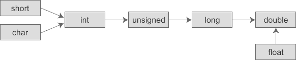
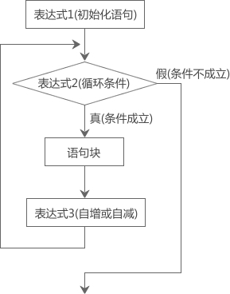
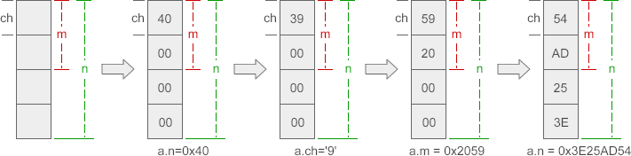
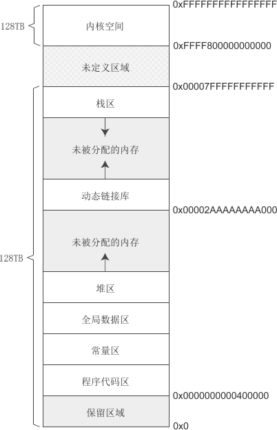
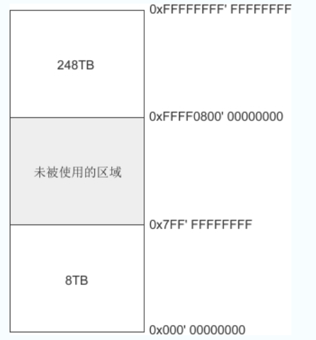
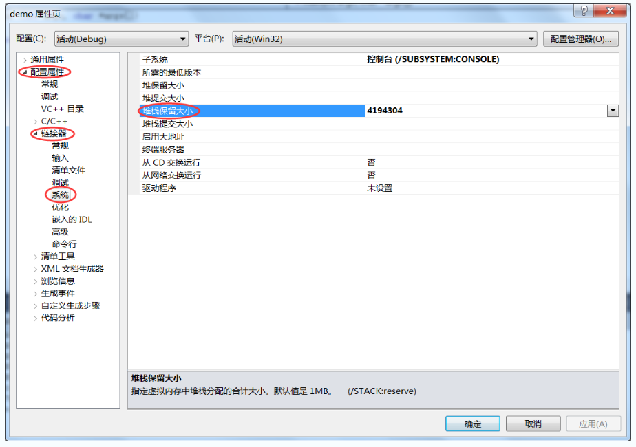
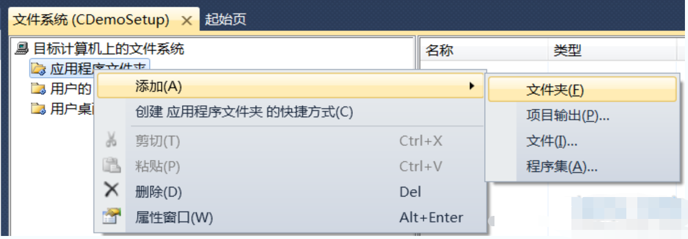

# 第一章 IDE配置

## 第一节 VS code配置及使用

### 一、Windows环境下快速配置

1. **下载编辑器VScode**

- 官网：https://code.visualstudio.com/（点链接时按下Ctrl，不会覆盖当前页面哦`^-^`）
<table style="border:none;text-align:center;width:auto;margin: 0 auto;">
  	<tbody>
  		<tr>
  			<td style="padding: 6px"></td>
  		</tr>
      <tr><td><strong>VS code下载</strong></td></tr>
  	</tbody>
  </table>

- 安装VScode（建议附加任务全部勾选）
<table style="border:none;text-align:center;width:auto;margin: 0 auto;">
	<tbody>
		<tr>
			<td style="padding: 6px"></td>
		</tr>
    <tr><td><strong>VS code安装示例（GIF文件，导出PDF可能无法正常播放）</strong></td></tr>
	</tbody>
</table>


2. **下载编译器MinGW并解压**
- 官网页面：https://www.mingw-w64.org/

- 下载页面：https://sourceforge.net/projects/mingw-w64/files/


  > 你可以进入官网自行寻找
  >
  > 你也可以直接点击为你找好的下载页面

- 下载页面中选择 `x86_64-win32-seh` 下载
<table style="border:none;text-align:center;width:auto;margin: 0 auto;">
	<tbody>
		<tr>
			<td style="padding: 6px"></td>
		</tr>
    <tr><td><strong>MinGW下载说明</strong></td></tr>
	</tbody>
</table>


  > 如果你因为网络环境限制无法下载
  >
  > 不限速下载，请笑纳^-^：https://wwn.lanzouh.com/iLOip031ku6b 密码:1234


- 在C盘中解压文件
<table style="border:none;text-align:center;width:auto;margin: 0 auto;">
	<tbody>
		<tr>
			<td style="padding: 6px"></td>
		</tr>
    <tr><td><strong>MinGW安装示例01（GIF文件，导出PDF可能无法正常播放）</strong></td></tr>
	</tbody>
</table>

  > 理论上你可以在任何地方解压，但注意路径不能包含中文，至于特殊字符请自行测试

3. **将MinGW添加至环境变量**
- 进入mingw64下的bin文件夹，复制当前路径，Win + i唤起系统设置，输入高级系统设置并进入，点击环境变量，选择path，编辑，新建，粘贴路径，按下三个确定
<table style="border:none;text-align:center;width:auto;margin: 0 auto;">
	<tbody>
		<tr>
			<td style="padding: 6px"></td>
		</tr>
    <tr><td><strong>MinGW安装示例02（GIF文件，导出PDF可能无法正常播放）</strong></td></tr>
	</tbody>
</table>

4. **配置VScode插件**
- 打开VScode安装插件 `Chinese` 和 `C/C++` ，等待安装完毕后重启VScode
<table style="border:none;text-align:center;width:auto;margin: 0 auto;">
	<tbody>
		<tr>
			<td style="padding: 6px"></td>
		</tr>
    <tr><td><strong>VS code安装插件示例01（GIF文件，导出PDF可能无法正常播放）</strong></td></tr>
	</tbody>
</table>

- 切换C/C++插件至 `1.8.4` 版本
<table style="border:none;text-align:center;width:auto;margin: 0 auto;">
	<tbody>
		<tr>
			<td style="padding: 6px"></td>
		</tr>
    <tr><td><strong>VS code安装插件示例02</strong></td></tr>
	</tbody>
</table>

  > 因最新版本不会自动生成launch.json文件，给后续优化带来不便，故退回旧版本。

5. **运行代码**
- 新建文件夹，修改为英文名称并进入，右键 `通过Code打开` 若在安装时未勾选相关选项，可能没有这个选项，请自行在VScode内操作打开文件夹

- 新建一个文件，英文命名且扩展名为 `.c` 

- 编写相关代码
  ```c
  #include <stdio.h>
  #include <stdlib.h>
  
  int main(void)
  {
      printf("Hello World!\n");
  
      system("pause");
  
      return 0;
  }
  ```

- VScode菜单栏，点击运行，启动调试，稍等程序运行，输出结果在下方终端，上方调试面板，点击最右边的 `橙色方框` 停止程序运行
<table style="border:none;text-align:center;width:auto;margin: 0 auto;">
	<tbody>
		<tr>
			<td style="padding: 6px"></td>
		</tr>
    <tr><td><strong>VS code运行代码示例（GIF文件，导出PDF可能无法正常播放）</strong></td></tr>
	</tbody>
</table>

6. **调整和优化**
> 请根据自己的需要进行优化
>
> 代码运行后 `.vscode` 文件夹会自动生成在你的源文件目录下
>
> `.vscode` 文件夹下的 `task.json` 和 `launch.json` 用来控制程序的运行和调试

- 将程序运行在外部控制台【推荐】

  - 打开`.vscode` 文件夹下的 `launch.json` 文件，找到 `"externalConsole": false,` 将 `false` 改为 `true` 并保存

<table style="border:none;text-align:center;width:auto;margin: 0 auto;">
	<tbody>
		<tr>
			<td style="padding: 6px"></td>
		</tr>
    <tr><td><strong>launch.json配置说明</strong></td></tr>
	</tbody>
</table>

- 解决中文乱码问题【推荐】

  - 打开`.vscode` 文件夹下的 `task.json` 文件，找到 `"${fileDirname}\\${fileBasenameNoExtension}.exe"` 在后面加上英文 `逗号` 然后回车到下一行，粘贴下面文本 `"-fexec-charset=GBK"` 并保存

<table style="border:none;text-align:center;width:auto;margin: 0 auto;">
<tbody>
<tr>
<td style="padding: 6px"></td>
</tr>
<tr><td><strong>task.json配置说明</strong></td></tr>
</tbody>
</table>


- 收纳生成的 `exe` 可执行文件【可选】

  - 打开`.vscode` 文件夹下的 `task.json` 文件，找到 `"${fileDirname}\\${fileBasenameNoExtension}.exe"` 

  - 修改成 `"${fileDirname}\\coin\\${fileBasenameNoExtension}.exe"` 并保存，同理，`launch.json` 下也有相同的字段，需要你修改

  - 在源文件同目录下新建 `coin` 文件夹，程序运行后，可执行文件将会生成在里面（其中 `coin` 可修改成你喜欢的英文名字）

    > 这样 `.c` 文件一多起来的时候，就不会出现 `.exe` 和 `.c` 相互穿插在目录中^-^
<table style="border:none;text-align:center;width:auto;margin: 0 auto;">
	<tbody>
		<tr>
			<td style="padding: 6px"></td>
		</tr>
    <tr><td><strong>文件归档示例</strong></td></tr>
	</tbody>
</table>

7. **提示**
- 若源代码文件夹含有中文路径，将会无法编译程序。
- 若Windows用户名使用了中文，可能无法运行。

### 二、Mac环境下快速配置
1. **安装Command_Line_Tools_for_Xcode**

打开终端输入gcc，如果没有出现如下页面（clang error提示）就需要安装Command_Line_Tools_for_Xcode；如果有该提示表明系统内已经存在可用的gcc编译器无需重装，此时可以输入gcc -v查看gcc的版本
<table style="border:none;text-align:center;width:auto;margin: 0 auto;">
	<tbody>
		<tr>
			<td style="padding: 6px"></td>
		</tr>
    <tr><td><strong>测试gcc是否安装成功</strong></td></tr>
	</tbody>
</table>


注意下载的时间版本要对应系统版本，不要下载错了 

或者可以先安装HomeBrew，安装后安装lux、FFmpeg，过程中会自动安装Command_Line_Tools_for_Xcode

2. **安装VS Code（最好add code to path）**

首先去官网下载VS Code  https://code.visualstudio.com/?wt.mc_id=vscom_downloads

下载时间网速过慢的话可以将下载地址中的`az764295.vo.msecnd.net`更换为`vscode.cdn.azure.cn`使用国内的镜像服务器加速。

下载完成后打开Finder，进入Downloads文件夹内将下载的VS Code拖动到Applications 文件夹内就完成了安装
add code to path操作需要打开安装好的VS Code使用快捷键shift+command+P打开VS Code命令窗口   --->    输入shell    --->    选择Shell Command：install ‘code’ command in path

<table style="border:none;text-align:center;width:auto;margin: 0 auto;">
	<tbody>
		<tr>
			<td style="padding: 6px"></td>
		</tr>
    <tr><td><strong>设置code to path</strong></td></tr>
	</tbody>
</table>

进行完add code to path后在终端内直接输入code .就可以使用VS Code打开当前路径
<table style="border:none;text-align:center;width:auto;margin: 0 auto;">
	<tbody>
		<tr>
			<td style="padding: 6px"></td>
		</tr>
    <tr><td><strong>测试code to path_01</strong></td></tr>
	</tbody>
</table>

右下角提示安装成功，现在已经暂时可以使用code快捷指令了，但要在重启之后任然可以使用，需要做进一步配置。在终端运行：
```shell
where code
```

终端显示一个文件位置，类似：
```shell
/usr/local/bin/code
```

进入finder，前往刚终端得到的路径的上一级目录，如：``/usr/local/bin/``；找到code文件并双击运行:
<table style="border:none;text-align:center;width:auto;margin: 0 auto;">
	<tbody>
		<tr>
			<td style="padding: 6px"></td>
		</tr>
    <tr><td><strong>code路径</strong></td></tr>
	</tbody>
</table>

得到一个路径，如同：
```shell
/var/folders/xp/1t_w47qx1gn09v60xnw6zsbw0000gn/T/AppTranslocation/9A4FBD64-8EB8-471A-BD59-4407D9BCDFE5/d/Visual\ Studio\ Code.app/Contents/Resources/app/bin/code
```

终端运行下列指令
```shell
vim ~/.zshrc
```

按i进入插入模式，在文件尾部插入：
```text
alias code='/var/folders/xp/1t_w47qx1gn09v60xnw6zsbw0000gn/T/AppTranslocation/9A4FBD64-8EB8-471A-BD59-4407D9BCDFE5/d/Visual\ Studio\ Code.app/Contents/Resources/app/bin/code'
```

其中引号内为路径，换为自己刚运行code得到的路径，编辑完毕按ESC退出编辑模式，再输入：wq保存并关闭文件。

设置完成，重启以验证可用性。
<table style="border:none;text-align:center;width:auto;margin: 0 auto;">
	<tbody>
		<tr>
			<td style="padding: 6px"></td>
		</tr>
    <tr><td><strong>测试code to path_02</strong></td></tr>
	</tbody>
</table>

使用VS Code第一次打开一个目录时都会有一个询问是否信任的选项，直接打钩信任即可

3. **安装VS Code插件（配置C/C++环境）**
- C/C++
- C/C++ Extension Pack
- Code Runner

插件安装完配置Code Runner插件：打开Run in Terminal、Save All Files Before Run两个选项
<table style="border:none;text-align:center;width:auto;margin: 0 auto;">
	<tbody>
		<tr>
			<td style="padding: 6px"></td>
		</tr>
    <tr><td><strong>设置Code Runner</strong></td></tr>
	</tbody>
</table>

编写test.c测试IDE配置是否正确有效
<table style="border:none;text-align:center;width:auto;margin: 0 auto;">
	<tbody>
		<tr>
			<td style="padding: 6px"></td>
		</tr>
    <tr><td><strong>测试IDE配置是否成功</strong></td></tr>
	</tbody>
</table>


### 三、解决VS code下载速度过慢的问题

如果在[VS code官网](https://code.visualstudio.com)下载安装包时下载速度特别慢，可以复制下载地址，将域名替换为以下CDN链接（域名之后的其他路径保持不变）`http://vscode.cdn.azure.cn`

Mac系统可以直接点击这个链接进行下载[VSCode-darwin-universal.zip](http://vscode.cdn.azure.cn/stable/6261075646f055b99068d3688932416f2346dd3b/VSCode-darwin-universal.zip)

### 四、Clangd+CMake+VS code环境配置

**安装WSL2前的shell设置**

[微软官方Win10 下 WSL 的安装方法](https://docs.microsoft.com/zh-cn/windows/wsl/install-win10)

简单来说Win 11 22H2以上版本的系统直接使用管理员权限在power shell中运行下面这一条指令

```shell
wsl --install
```

等到显示`正在安装: 适用于 Linux 的 Windows 子系统`的时候就可以Ctrl C取消运行了，然后去商店或者其他地方安装WSL版本的Linux就可以了【Windows旧版本需要使用旧版本的安装教程，具体步骤参阅 [官方文档](https://learn.microsoft.com/zh-cn/windows/wsl/install-manual)】

**安装WSL Linux**

到Windows商店下载Ubuntu并安装，安装完毕后安装以下软件

- llvm
- clang
- clangd
- lldb（VS Code调试器插件有带，也可以不用装）

​	接下来安装VS Code插件

- [中文语言包](https://marketplace.visualstudio.com/items?itemName=MS-CEINTL.vscode-language-pack-zh-hans)
- [WSL](https://marketplace.visualstudio.com/items?itemName=ms-vscode-remote.remote-wsl)
- [clangd](https://marketplace.visualstudio.com/items?itemName=llvm-vs-code-extensions.vscode-clangd)安装在WSL: Ubuntu中
- [CodeLLDB](https://marketplace.visualstudio.com/items?itemName=vadimcn.vscode-lldb)安装在WSL: Ubuntu中

以上插件安装完成后就可以新建文件测试了，在测试过程中会配置`launch.json`和`tasks.json`配置文件

测试文件代码如下

```c
#include <stdio.h>

int main(void){
    printf("Hello World!\n");

    return 0;
}
```

launch.json配置如下

```json
{
    // 使用 IntelliSense 了解相关属性。 
    // 悬停以查看现有属性的描述。
    // 欲了解更多信息，请访问: https://go.microsoft.com/fwlink/?linkid=830387
    "version": "0.2.0",
    "configurations": [
        {
            "type": "lldb",
            "request": "launch",
            "name": "Debug",
            "program": "${workspaceFolder}/buildfiles/${fileBasenameNoExtension}",  // 需要在当前工作区目录下新建buildfiles文件夹
            "args": [],
            "cwd": "${workspaceFolder}",
            "preLaunchTask": "Build C++",
            "internalConsoleOptions": "neverOpen",
            "console": "integratedTerminal"
        }
    ]
}
```

然后使用快捷键`Ctrl+Shift+p`打开命令窗口输入task选择`配置任务 Tasks:Configure Task`然后选择`使用模板创建`再选择`Others`就成功创建了`tasks.json`配置文件

tasks.json配置如下

```json
{
    // See https://go.microsoft.com/fwlink/?LinkId=733558
    // for the documentation about the tasks.json format
    "version": "2.0.0",
    "tasks": [
        {
            "label": "Build C++",   // 与launch.json中的preLaunchTask的值对应
            "type": "shell",
            "command": "clang",  // 编译器就是clang
            "args": [
                // "--std=c++20",  // 使用C++20的语言标准 C语言程序不需要打开
                "-g",   // 打开调试模式
                "-Wall",    // 打开所有警告
                "-o",   // 生成可执行文件
                "${workspaceFolder}/buildfiles/${fileBasenameNoExtension}",     // 代码路径，与launch.json中的program的值对应
                "${file}"
            ],
            "group": {
                "kind": "build",
                "isDefault": true
            }
        }
    ]
}
```

以上就完成了单文件使用clang编译执行的环境，如果需要多文件编译，需要配置CMake环境

在WSL中安装以下软件

- cmake
- make或者ninja（推荐ninja，比较快）

然后在VS Code中安装插件

- [CMake](https://marketplace.visualstudio.com/items?itemName=twxs.cmake)安装在WSL: Ubuntu中
- [CMake Tools](https://marketplace.visualstudio.com/items?itemName=ms-vscode.cmake-tools)安装在WSL: Ubuntu中

然后编写CMakeLists.txt以及测试文件

目录结构

```bash
.
├── CMakeLists.txt
├── head.h
├── hello.c
└── test.c
```

CMakeLists.txt文件内容

```text
PROJECT(Hello)

add_executable(
    Hello
    head.h
    hello.c
    test.c    
)
```

head.h文件内容

```c
#ifndef __HEAD_H__
#define __HEAD_H__

#include <stdio.h>

void test(void);

#endif
```

hello.c文件内容

```c
#include "head.h"

int main(void){
    test();

    return 0;
}
```

test.c文件内容

```c
#include "head.h"

void test(void){
    printf("Hello World!\n");
}
```

然后使用快捷键`Ctrl+Shift+p`打开命令窗口输入cmake选择`CMake:Configure`然后选择`Clang xxxx`

然后cd到buil文件夹下运行Hello文件测试输出是否正常，正常的情况下就可以重新配置launch.json文件了，此时已经不需要task.json文件了，可以把它删除掉

新配置的launch.json文件内容如下

```json
{
    // 使用 IntelliSense 了解相关属性。 
    // 悬停以查看现有属性的描述。
    // 欲了解更多信息，请访问: https://go.microsoft.com/fwlink/?linkid=830387
    "version": "0.2.0",
    "configurations": [
        {
            "type": "lldb",
            "request": "launch",
            "name": "Debug",
            "program": "${command:cmake.launchTargetPath}",  // cmake启动命令
            "args": [],
            "cwd": "${workspaceFolder}",
            "internalConsoleOptions": "neverOpen",
            "console": "integratedTerminal"
        }
    ]
}
```

然后配置clangd，打开VS Code的设置搜索clangd在Clangd:Arguments中添加以下选项

```txt
--compile-commands-dir=${workspaceFolder}/build
--header-insertion=never
```

然后配置clang-format代码格式化文件（在工作区目录下新建`.clang-format`文件）

```yaml
BasedOnStyle: LLVM
UseTab: Never
IndentWidth: 4
DerivePointerAlignment: false
PointerAlignment: true
AlwaysBreakAfterReturnType: None
AlwaysBreakTemplateDeclarations: true
AlwaysBreakBeforeMultilineStrings: true
AlignOperands: true
AlignAfterOpenBracket: true
AlignConsecutiveBitFields: true
AlignConsecutiveMacros: true
ConstructorInitializerAllOnOneLineOrOnePerLine: true
AllowAllConstructorInitializersOnNextLine: false
BinPackArguments: false
BinPackParameters: false
IncludeBlocks: Regroup
```

还可以配置一些自定义的Code Snippets

C语言的

```json
{
	// Place your snippets for c here. Each snippet is defined under a snippet name and has a prefix, body and 
	// description. The prefix is what is used to trigger the snippet and the body will be expanded and inserted. Possible variables are:
	// $1, $2 for tab stops, $0 for the final cursor position, and ${1:label}, ${2:another} for placeholders. Placeholders with the 
	// same ids are connected.
	// Example:
	// "Print to console": {
	// 	"prefix": "log",
	// 	"body": [
	// 		"console.log('$1');",
	// 		"$2"
	// 	],
	// 	"description": "Log output to console"
	// }

	"cmain": {
		"prefix": "cmain",
		"body": [
			"#include <stdio.h>",
			"\r",
			"int main(void){",
			// "\t${1:/* code */}",
			"\t$1",
			"\r",
			"\treturn 0;",
			"}"
		],
		"description": "新建文件时快速输入C语言main函数"
	}
}
```


### 五、VS code优化使用体验篇（设置 | 插件）

> VS code是一个非常好用的文本编辑器，通过各式各样的插件几乎是万能的，也可以作为好用的IDE，但vscode有很多默认不开启的、以下是推荐开启的一些配置选项和一些好用的插件。

vscode官网：https://code.visualstudio.com/

**推荐设置**
settings.json中的一些基础配置

```json
{
  "files.autoSave": "afterDelay",
  "files.autoGuessEncoding": true,
  "workbench.list.smoothScrolling": true,
  "editor.cursorSmoothCaretAnimation": true,
  "editor.smoothScrolling": true,
  "editor.cursorBlinking": "smooth",
  "editor.mouseWheelZoom": true,
  "editor.formatOnPaste": true,
  "editor.formatOnType": true,
  "editor.formatOnSave": true,
  "editor.wordWrap": "on",
  "editor.guides.bracketPairs": true,
  //"editor.bracketPairColorization.enabled": true, (此设置vscode在较新版本已默认开启)
  "editor.suggest.snippetsPreventQuickSuggestions": false,
  "editor.acceptSuggestionOnEnter": "smart",
  "editor.suggestSelection": "recentlyUsed",
  "window.dialogStyle": "custom",
  "debug.showBreakpointsInOverviewRuler": true,
}
```


**插件**

> 插件种类繁多，对于各式各样的插件，我将我推荐的插件分成了四类，其中基础功能类是我认为在各种地方都很有帮助的插件，几乎可以是必备，其余的插件在很多情况下也很有用，可以按需安装

> **外观类**
>
> **主题**
>
> `One Dark Pro`
> 一款非常推荐的暗色调主题，好看又护眼。
>
> <table style="border:none;text-align:center;width:auto;margin: 0 auto;">
> <tbody>
> 	<tr>
> 		<td style="padding: 6px"></td>
> 	</tr>
> <tr><td><strong>One Dark Pro</strong></td></tr>
> </tbody>
> </table>
>
>
> **图标主题**
>
> `Material Icon Theme`
> 个人正在用的图标主题，好看，类型大而全
>
> <table style="border:none;text-align:center;width:auto;margin: 0 auto;">
> <tbody>
> 	<tr>
> 		<td style="padding: 6px"></td>
> 	</tr>
> <tr><td><strong>Material Icon Theme</strong></td></tr>
> </tbody>
> </table>
>
> `vscode-icons`
> 也是一款不错的图标主题
>
> <table style="border:none;text-align:center;width:auto;margin: 0 auto;">
> <tbody>
> 	<tr>
> 		<td style="padding: 6px"></td>
> 	</tr>
> <tr><td><strong>vscode-icons</strong></td></tr>
> </tbody>
> </table>

> **基础功能类**
>
> `Chinese (Simplified) (简体中文)`
> 【中文语言包】这应该不用多介绍，是vscode的官方中文语言包
>
> <table style="border:none;text-align:center;width:auto;margin: 0 auto;">
	<tbody>
		<tr>
			<td style="padding: 6px"></td>
		</tr>
    <tr><td><strong>Chinese (Simplified) (简体中文)</strong></td></tr>
	</tbody>
</table>
>
> `Error Lens`
> 【错误提示】可以将原先显示的问题显示在对应行右侧并高亮
>
> <table style="border:none;text-align:center;width:auto;margin: 0 auto;">
	<tbody>
		<tr>
			<td style="padding: 6px"></td>
		</tr>
    <tr><td><strong>Error Lens</strong></td></tr>
	</tbody>
</table>
>
> `Path Intellisense`
> 【路径补全】在输入路径时，有智能提示补全
>
> <table style="border:none;text-align:center;width:auto;margin: 0 auto;">
	<tbody>
		<tr>
			<td style="padding: 6px"></td>
		</tr>
    <tr><td><strong>Path Intellisense</strong></td></tr>
	</tbody>
</table>
>
> `Image preview`
> 【图像预览】可以预览引入的图像
>
> <table style="border:none;text-align:center;width:auto;margin: 0 auto;">
	<tbody>
		<tr>
			<td style="padding: 6px"></td>
		</tr>
    <tr><td><strong>Image preview</strong></td></tr>
	</tbody>
</table>
>`Markdown Preview Github Styling`
> markdown文件以GitHub的风格预览
> 
><table style="border:none;text-align:center;width:280px;margin: 0 auto;">
> <tbody>
		<tr>
			<td style="padding: 6px"></td>
		</tr>
	<tr><td><strong>Markdown Preview Github Styling</strong></td></tr>
    </tbody>
	</table>

> **拓展功能类**
>
> `CodeSnap`
> 【代码截图】一款非常好用的代码截图插件
>
> <table style="border:none;text-align:center;width:auto;margin: 0 auto;">
	<tbody>
		<tr>
			<td style="padding: 6px"></td>
		</tr>
    <tr><td><strong>CodeSnap</strong></td></tr>
	</tbody>
</table>
>
> `Prettier - Code formatter`
> 【代码格式化工具】支持超多语言，一键格式化，美化代码格式
>
> <table style="border:none;text-align:center;width:auto;margin: 0 auto;">
	<tbody>
		<tr>
			<td style="padding: 6px"></td>
		</tr>
    <tr><td><strong>Prettier - Code formatter</strong></td></tr>
	</tbody>
</table>
>`GBK to UTF8 for vscode`
> 【文件编码转化】可以将文件在GBK与UTF8编码之间无瑕转换
> 
><table style="border:none;text-align:center;width:auto;margin: 0 auto;">
> <tbody>
		<tr>
			<td style="padding: 6px"></td>
		</tr>
	<tr><td><strong>GBK to UTF8 for vscode</strong></td></tr>
    </tbody>
	</table>

>
> `Hex Editor`
> 用来查看文件的hex或UTF-8编码
>
> <table style="border:none;text-align:center;width:auto;margin: 0 auto;">
	<tbody>
		<tr>
			<td style="padding: 6px"></td>
		</tr>
    <tr><td><strong>Hex Editor</strong></td></tr>
	</tbody>
</table>
>
> `Remote - SSH`
> 【ssh连接】连接远程服务器或虚拟机
>
> <table style="border:none;text-align:center;width:auto;margin: 0 auto;">
	<tbody>
		<tr>
			<td style="padding: 6px"></td>
		</tr>
    <tr><td><strong>Remote - SSH</strong></td></tr>
	</tbody>
</table>
>`Vscode Google Translate`
> 使用谷歌翻译对代码进行翻译
<table style="border:none;text-align:center;width:300px;margin: 0 auto;">
	<tbody>
		<tr>
			<td style="padding: 6px"></td>
		</tr>
    <tr><td><strong>Vscode Google Translate</strong></td></tr>
	</tbody>
</table>

> 
> 修改配置：
>
> ```json
> "vscodeGoogleTranslate.host": "120.0.0.1",       // 如果为空 代理关闭
> "vscodeGoogleTranslate.port": "7890",       // 代理端口
> "vscodeGoogleTranslate.preferredLanguage": "English",       // 翻译默认目标语言
> ```

> **算法练习类**
>
> `Code Runner`
> 【代码运行工具】支持多种语言，语言运行环境需自己配置
> 推荐修改配置：
>
> ```json
> {
> "code-runner.runInTerminal": true,
> "code-runner.saveAllFilesBeforeRun": true,
> "code-runner.saveFileBeforeRun": true
> }
> ```
> <table style="border:none;text-align:center;width:auto;margin: 0 auto;">
	<tbody>
		<tr>
			<td style="padding: 6px"></td>
		</tr>
    <tr><td><strong>Code Runner</strong></td></tr>
	</tbody>
</table>
>`Competitive Programming Helper (cph)`
> 刷算法题时很好用，可以自己设置样例，一键全部运行
<table style="border:none;text-align:center;width:auto;margin: 0 auto;">
	<tbody>
		<tr>
			<td style="padding: 6px"></td>
		</tr>
    <tr><td><strong>Competitive Programming Helper (cph)</strong></td></tr>
	</tbody>
</table>
### 六、VS Code设置代理

```bash
http://127.0.0.1:7890
```

## 第二节、Clion配置及使用

### 一、Clion的安装激活步骤

**下载Clion**
[JetBrains出品的所有开发者工具和产品](https://www.jetbrains.com/zh-cn/products/#type=ide)

到上面JetBrains网站上下载操作系统相对应的版本，下载完成后正常安装即可

安装完成后不要着急打开软件，先下载激活文件，然后将激活文件拷贝到一个不易删除的地方，根据操作系统运行相应的激活脚本文件，激活脚本运行以后到激活网址里面复制相应软件的激活码

激活网址：[JETBRA.IN CHECKER | IPFS](https://3.jetbra.in)

使用激活码进行激活以后即可正常使用了

## 第三节、Visual Studio配置

Microsoft Visual Studio（简称VS）是美国微软公司的开发工具包系列产品。VS是一个基本完整的开发工具集，它包括了整个软件生命周期中所需要的大部分工具，如UML工具、代码管控工具、集成开发环境(IDE)等等,所写的目标代码适用于微软支持的所有平台。Visual Studio是目前最流行的Windows平台应用程序的集成开发环境。

### 一、VS常用快捷键

| **快捷键**        | **含义**       |
| ----------------- | -------------- |
| Ctrl + k,Ctrl + f | 自动格式化代码 |
| Ctrl + k,Ctrl + c | 注释代码       |
| Ctrl + k,Ctrl + u | 取消注释代码   |
| F9                | 设置断点       |
| F5                | 调试运行       |
| Ctrl + F5         | 不调试运行     |
| Ctrl + Shift + b  | 编译，不运行   |
| F10               | next调试       |
| F11               | step调试       |

### 二、VS的C4996错误

由于微软在VS2013中不建议再使用C的传统库函数scanf,strcpy,sprintf等，所以直接使用这些库函数会提示C4996错误

<table style="border:none;text-align:center;width:auto;margin: 0 auto;">
	<tbody>
		<tr>
			<td style="padding: 6px"></td>
		</tr>
    <tr><td><strong>VS2013的C4996错误</strong></td></tr>
	</tbody>
</table>

VS建议采用带`_s`的函数，如`scanf_s`、`strcpy_s`，但这些并不是标准C函数。要想继续使用此函数，需要在源文件中添加以下指令就可以避免这个错误提示：

```c
#define _CRT_SECURE_NO_WARNINGS		//这个宏定义最好要放到.c文件的第一行
#pragma warning(disable:4996)		//或者使用这个
```

### 三、解决提示窗一闪而过

- 方法一：通过`system()`函数解决

在`return 0;`之前 添加`system("pause");`函数调用。（依赖头文件`<stdlib.h>`）

- 方法二：借助VS工具解决

在项目上 ---> 右键 ---> 属性 ---> 配置属性 ---> 连接器 ---> 系统 ---> 子系统 ---> 在下拉框中选择`控制台 (/SUBSYSTEM:CONSOLE)`选项

### 四、快捷导入代码

Visual Studio  –>  工具  –>  代码片段管理器  –>  Visual C++

## 第四节、查找程序所依赖的动态库

Windows平台下，需要相应软件(Depends.exe)

<table style="border:none;text-align:center;width:auto;margin: 0 auto;">
	<tbody>
		<tr>
			<td style="padding: 6px"></td>
			<td style="padding: 6px"></td>
		</tr>
    <tr><td colspan="2"><strong>Depends使用示意</strong></td></tr>
	</tbody>
</table>


# 第二章 Git使用手册

## 第一节 网络代理

```shell
# 开启代理
git config --global http.proxy socks5://127.0.0.1:7890
git config --global https.proxy socks5://127.0.0.1:7890

# 取消代理
git config --global --unset http.proxy
git config --global --unset https.proxy

# curl、Wget代理
# 设置 http proxy
export http_proxy="http://127.0.0.1:7890"
# 设置 https proxy
export https_proxy="http://127.0.0.1:7890"
# 测试curl代理
curl google.com

# 取消curl、Wget代理
unset http_proxy
unset https_proxy
```

## 第二节 配置用户名和邮箱

```shell
# 配置用户名
git config --global user.name "Morax"

#配置邮箱
git config --global user.email "mroj2333@sina.com"

# 使用 --global 修饰后设置的全局的用户,如果设置单个项目的用户,可cd到项目根目录下,执行如下命令:
git config user.name "Your Name"
git config user.email "email@example.com"

# 可查看当前用户信息以及其他的一些信息：
git config --list
```


# 第三章 C语言知识点

## 第一节 知识框架概述

### **一、总体上必须清楚的**

- 程序结构是三种:顺序结构 、选择结构(分支结构)、循环结构。
- 读程序都要从main()入口, 然后从最上面顺序往下读(碰到循环做循环,碰到选择做选择)，有且只有一个main函数。
- 计算机的数据在电脑中保存是以二进制的形式. 数据存放的位置就是 他的地址.
- bit是位 是指为0 或者1。 byte 是指字节, 一个字节 = 八个位.

### **二、易混淆的概念**

- 编译预处理不是C语言的一部分，不占运行时间，不要加分号。C语言编译的程序称为源程序，它以ASCII数值存放在文本文件中。
- `#define PI 3.1415926;`这个写法是错误的，一定不能出现分号。
- 每个C语言程序中main函数是有且只有一个。
- 在函数中不可以再定义函数。
- 算法：可以没有输入，但是一定要有输出。
- break可用于循环结构和switch语句。
- 逗号运算符的级别最低，赋值的级别倒数第二。

### **三、知识难点**

- 指针部分
- 数组部分
- 函数栈帧的创建与销毁
- 可变参数列表

## 第二节 C语言的标准

目前已经公布的三套标准：C89/C90、C99、C11

语言最初由Dennis Ritchie于1969年到1973年在AT&T贝尔实验室里开发出来，主要用于重新实现Unix操作系统。此时，C语言又被称为K&R C。其中，K表示Kernighan的首字母，而R则是Ritchie的首字母。

K&R C语言与后来标准化的C语言有很大差异另外，当时的第一本C语言专业书《The C Programming Language》也并非一个正式的编程语言规范，但被用了许多年。

**C90标准**

由于C语言被各大公司所使用（包括当时处于鼎盛时期的IBM PC），因此到了1989年，C语言由美国国家标准协会（ANSI）进行了标准化，此时C语言又被称为ANSI C。

而仅过一年，ANSI C就被国际标准化组织ISO给采纳了。此时，C语言在ISO中有了一个官方名称——ISO/IEC9899:1990。其中：
- 9899是C语言在ISO标准中的代号，像[C++](http://c.biancheng.net/cplus/)在ISO标准中的代号是14882；
- 而冒号后面的1990表示当前修订好的版本是在1990年发布的。

对于ISO/IEC9899:1990的俗称或简称，有些地方称为C89，有些地方称为C90，或者C89/90。不管怎么称呼，它们都指代这个最初的C语言国际标准。

这个版本的C语言标准作为K&R C的一个超集（即K&R C是此标准C的一个子集），把后来引入的许多非官方特性也一起整合了进去。其中包括了从C++借鉴的函数原型（Function Prototypes），指向void的指针，对国际字符集以及本地语言环境的支持。在此标准中，尽管已经将函数定义的方式改为现在我们常用的那种方式，不过K&R的语法形式仍然兼容。

**C99标准**

在随后的几年里，C语言的标准化委员会又不断地对C语言进行改进，到了1999年，正式发布了ISO/IEC9899:1999，简称为C99标准。

C99标准引入了许多特性，包括内联函数（inline functions）、可变长度的数组、灵活的数组成员（用于结构体）、复合字面量、指定成员的初始化器、对IEEE754浮点数的改进、支持不定参数个数的宏定义，在数据类型上还增加了long long int以及复数类型。

毫不夸张地说，即便到目前为止，很少有C语言编译器是完整支持C99的。像主流的[GCC](http://c.biancheng.net/gcc/)以及Clang编译器都能支持高达90%以上，而微软的Visual Studio 2015中的C编译器只能支持到70%左右。

**C11标准**

2007年，C语言标准委员会又重新开始修订C语言，到了2011年正式发布了ISO/IEC9899:2011，简称为C11标准。

C11标准新引入的特征尽管没C99相对C90引入的那么多，但是这些也都十分有用，比如：字节对齐说明符、泛型机制（generic selection）、对多线程的支持、静态断言、原子操作以及对Unicode的支持。

关于C语言历史与演化进程的详细介绍可参考维基百科：https://en.wikipedia.org/wiki/C_(programming_language)

## 第三节 第一个C语言程序

C语言的源代码文件是一个普通的文本文件，但扩展名必须是`.c`。我们从演示一个简单的程序示例开始，解释该程序的功能。

使用IDE或者文本编辑器新建一个名为`Hello.c`的文件并键入以下代码文本（注意文件名是`Hello`扩展名是`.c`）。

```c
#include <stdio.h>

int main() {
    printf("hello world\n");

    return 0;
}
```

看看自己是否能明白该程序的用途，再认真阅读后面的解释。

**示例解释**

典型的C语言程序结构如下图所示

<table style="border:none;text-align:center;width:auto;margin: 0 auto;">
	<tbody>
		<tr>
			<td style="padding: 6px"></td>
		</tr>
    <tr><td><strong>C语言程序结构</strong></td></tr>
	</tbody>
</table>

**预处理指令**

- `#include`的意思是头文件包含，`#include <stdio.h>`代表包含`stdio.h`这个头文件
- 使用C语言库函数需要提前包含库函数对应的头文件，如这里**使用了`printf()`函数，需要包含`stdio.h`头文件**
- Linux环境下可以通过`man 3 printf`查看`printf()`所需的头文件

> **`#include< >`与`#include ""`的区别：**
>
> - `< >`表示系统直接按系统指定的目录检索
> - `""`表示系统先在`""`指定的路径(没写路径代表当前路径)查找头文件，如果找不到，再按系统指定的目录检索
>
> `stdio.h`是在操作系统的系统目录下：
>
> <table style="border:none;text-align:center;width:auto;margin: 0 auto;">
	<tbody>
		<tr>
			<td style="padding: 6px"></td>
		</tr>
    <tr><td><strong>stdio.h路径示意</strong></td></tr>
	</tbody>
</table>

**`main()`函数**

- 一个完整的C语言程序，是由一个、且只能有一个`main()`函数(又称主函数，必须有)和若干个其他函数结合而成（可选）。
- `main()`函数是C语言程序的入口，程序是从`main()`函数开始执行。

**程序体和代码块**

- 被`{}`包括的代码文本叫代码块，一个代码块内部可以有一条或者多条语句
- C语言每句可执行代码都是"`;`"分号结尾
- 所有的`#`开头的行，都代表预编译指令，预编译指令行结尾是没有分号的
- 所有的可执行语句必须是在代码块里面

**注释**

- `//`叫行注释，注释的内容编译器是忽略的，注释主要的作用是在代码中加一些说明和解释，这样有利于代码的阅读
- `/**/`叫块注释
- 块注释是C语言标准的注释方法
- 行注释是从C++语言借鉴过来的

**`printf()`函数**

- `printf()`是C语言库函数，功能是向标准输出设备输出一个字符串
- `printf(“hello world\n”);`中`\n`的意思是回车换行

**`return()`语句**

- return代表函数执行完毕，返回return代表函数的终止
- 如果`main()`函数定义的时候前面是int，那么return后面就需要写一个整数；如果`main()`函数定义的时候前面是void，那么return后面什么也不需要写
- 在`main()`函数中`return 0;`代表程序执行成功，`return -1;`代表程序执行失败
- `int main()`和`void main()`在C语言中是一样的，但C++语言只接受`int main()`这种定义方式

## 第四节 编译过程

C语言代码编译成可执行程序经过4步：
- 预处理：**宏定义展开、头文件展开、条件编译**等，同时将代码中的注释删除，这里并**不会检查语法**
- 编译：检查语法，将预处理后文件编译**生成汇编文件**
- 汇编：将汇编文件生成**目标文件**(二进制文件)
- 链接：C语言写的程序是需要依赖各种库的，所以编译之后还需要**把库链接到最终的可执行程序中**

<table style="border:none;text-align:center;width:auto;margin: 0 auto;">
	<tbody>
		<tr>
			<td style="padding: 6px"></td>
		</tr>
    <tr><td><strong>C语言程序编译的过程</strong></td></tr>
	</tbody>
</table>
### 一、GCC编译过程

- 分步编译

预处理：`gcc -E hello.c -o hello.i`

编 译：`gcc -S hello.i -o hello.s`

汇 编：`gcc -c hello.s -o hello.o`

链 接：`gcc  hello.o -o hello`

| **选项**   | **含义**                    |
| ---------- | --------------------------- |
| `-E`       | 只进行预处理                |
| `-S`(大写) | 只进行预处理和编译          |
| `-c`(小写) | 只进行预处理、编译和汇编    |
| `-o file`  | 指定生成的输出文件名为 file |

| **文件后缀** | **含义**              |
| ------------ | --------------------- |
| .c           | C 语言文件            |
| .i           | 预处理后的 C 语言文件 |
| .s           | 编译后的汇编文件      |
| .o           | 编译后的目标文件      |

<table style="border:none;text-align:center;width:auto;margin: 0 auto;">
	<tbody>
		<tr>
			<td style="padding: 6px"></td>
		</tr>
    <tr><td><strong>GCC分步编译的过程</strong></td></tr>
	</tbody>
</table>

- 一步编译

`gcc hello.c -o demo`还是会经过：预处理、编译、汇编、链接的过程（只是由编译器自动去完成了）

<table style="border:none;text-align:center;width:auto;margin: 0 auto;">
	<tbody>
		<tr>
			<td style="padding: 6px"></td>
		</tr>
    <tr><td><strong>GCC一步编译的过程</strong></td></tr>
	</tbody>
</table>


## 第五节 调试程序

### 一、Visual Studio调试

- 添加行号
	如果编译器中有行号标示则不用添加，如果没有按以下步骤操作即可：工具 ---> 选项 ---> 文本编辑器 ---> C/C++ ---> 行号 选中该选项编译器中即可出现行号标示。

- 设置断点。
	点击行号旁边的空白处即可在改行设置断点

- F5启动调试

**调试过程中**

- 停止的位置，是尚未执行的指令；
- `逐语句执行一下条 （F11）`：进入函数内部，逐条执行跟踪；
- `逐过程执行一下条 （F10）`：不进入函数内部，逐条执行程序；
- 添加监视：
	调试 ---> 窗口 ---> 监视（输入监视变量名，自动监视变量值的变化）

### 二、GDB调试


- 断点：所谓断点（BreakPoint），可以理解为障碍物，人遇到障碍物不能行走，程序遇到断点就暂停执行。
- 逐语句调试：逐语句，就是每次执行一行语句，如果碰到函数调用，它就会进入到函数里面。
- 逐过程调试：逐过程，碰到函数时，不进入函数，把函数调用当成一条语句执行。
- 跳出当前执行过程：跳出，是当你进入到函数内，跳出可以让你直接执行函数内剩余的语句，直到返回到该函数被调用时的后面的语句处。
- 监视窗口：程序执行完某条语句时，使用监视窗口可以查看程序中变量的具体内容、程序中的内存状态、程序中的寄存器状态等。

#### GDB

GDB（GNU Debugger）包含在 GNU 的 GCC 开发套件中，是基于命令行的、功能强大的程序调试工具。对于一名 Linux 平台下工作的 C/C++ 程序员，GDB 是必不可少的工具。

**安装**：

```bash
yum install gdb -y
```

GDB 主要能够帮忙我们完成下面四个方面的功能：

1. 可以按照自定义的要求运行程序。
2. 支持基于条件表达式的断点。
3. 当程序被停住时，可以检查此时程序中所发生的事情。
4. 动态的修改程序的执行环境。

程序的调试过程主要有：单步执行，跳入函数，跳出函数，设置断点，设置观察点，查看变量。

**简单示例**：

```shell
$gdb programmer     # 启动 gdb
>break main         # 设置断点
>run                # 运行调试程序
>next               # 单步调试
>print var1         # 打印变量值
>list               # 显示当前调试处的源代码
>info b             # 显示当前断点设置情况
```

#### 启动 GDB

对 C/C++ 程序的调试，需要在编译前就加上 -g 选项。-g 选项的作用是在可执行文件中加入源文件信息，所以在调试时必须保证 gdb 能找到源文件。不使用 -g 的话将看不见程序的函数名和变量名，代替它们的全是运行时的内存地址。

- DEBUG 模式编译

```bash
$ gcc -g main.c -o main
```

- 调试执行文件：

```bash
$ gdb main
GNU gdb (GDB) Red Hat Enterprise Linux 7.6.1-115.el7
Copyright (C) 2013 Free Software Foundation, Inc.
License GPLv3+: GNU GPL version 3 or later <http://gnu.org/licenses/gpl.html>
This is free software: you are free to change and redistribute it.
There is NO WARRANTY, to the extent permitted by law.  Type "show copying"
and "show warranty" for details.
This GDB was configured as "x86_64-redhat-linux-gnu".
For bug reporting instructions, please see:
<http://www.gnu.org/software/gdb/bugs/>...
Reading symbols from /root/main...done.
(gdb)
```

**NOTE**：如果没有加 -g 进行编译的话，会出现错误。意思是没能从可执行文件中获得符号表（symbol table）信息，你可以使用 -se file 指令，从指定文件中读取符号表信息，并把它用在可执行文件中。

```bash
No symbol table is loaded.  Use the "file" command.
```

- 调试服务程序：GDB 也可以用于调试服务程序，可以指定服务程序运行时的进程 ID。GBD 会自动 Attach 上去，并开启调试。此时，程序的执行文件应该已经被加入到 PATH 环境变量中。

```bash
$ gdb <program> <PID>
```

#### 交互命令

启动了 GDB 后，就进入到指令行的交互模式，可以通过以下指令完成对程序的调试。

#### 运行程序

- **run [arglist]（r）运行程序**：当遇到断点后，程序会在断点处停止运行，等待用户输入下一步的命令。如果指定了 arglist，则作为参数运行程序。
- **set var 变量名=变量值**：设置运行时参数。
- **continue（c）继续执行**：到下一个断点处（或运行结束）。
- **next（n）单步执行**：当遇到函数调用时，不会进入函数体。
- **step（s）单步执行**：当遇到函数调用时，则进入函数。与 next 的主要区别是，step 遇到自定义函数后，会步进到函数中运行，而 next 则直接调用函数，不会进入到函数体内。
- **until**：当你厌倦了在一个循环体内单步执行时，这个命令可以运行程序直到退出循环体。
- **until n**：运行至 n 行，不仅仅用来跳出循环。
- **return**：强制从当前函数返回。
- **finish**：运行程序，直到当前函数完成返回，并打印函数返回时的堆栈地址和返回值及参数值等信息。
- **call 函数(参数)**：调用有效函数，并传入实参，如：`call gdb_test(55)`。
- **Ctrl-C**：在当前位置停止执行正在执行的程序，断点在当前行。
- **quit（q）**：退出 GDB 调试终端。
- **shell**：使你能不离开 gdb 就执行 UNIX shell 命令。

#### 暂停程序

在 GDB 中，程序有以下几种暂停方式：

- 断点（BreakPoint）
- 观察点（WatchPoint）
- 捕捉点（CatchPoint）
- 信号（Signals）
- 线程停止（Thread Stops）

当已定义好的停止点没有用时，可以使用 delete、clear、disable、enable 这几个命令来进行维护。此外还有 ignore，可以指定程序运行时，忽略停止条件几次。

##### 设置断点

- **break linenum（b n）**：在第 n 行处设置断点。
- **break [file:]function、break [file:]linenum**：在指定源文件的指定函数或行号设置断点，e.g. `b OAGUPDATE.cpp:578`。
- **b fn1 if a＞b**：设置条件断点。
- **txbreak**：在当前函数的退出的点上设置一个临时的断点，只可使用一次。
- **info b** ：显示当前程序的断点设置情况。
- **delete n**：删除第 n 个断点。
- **enable n**：开启第 n 个断点。
- **clear n**：清除第 n 行的断点。
- **delete breakpoints**：清除所有断点。

##### 设置观察点

观察点通常用来观察某个表达式的值是否变化了。如果有变化，马上停住程序。

- **watch**：设置一个监视点，一旦被监视的表达式的数值改变了，停住程序。
- **rwatch**：当表达式被读时，停住程序。
- **awatch**：当表达式的值被读或被写时，停住程序。
- **info watchpoints**：列出当前设置的所有观察点。

##### 设置捕捉点

设置捕捉点来补捉程序运行时的一些事件，e.g. 载入共享库（动态链接库）或是 C++ 的异常。

- **catch**：当时间发生时，停住程序。
- **tcatch**：只生效一次的捕捉点。

Event 列表：


#### 打印信息

- **list [linenum]/[function]（l n/func）**：列出程序的源代码，默认每次显示 10 行。重复执行则输出下边的内容。
- **print（p）**：打印当前程序所有的有效表达式。
- **print func(x)**：将实参 x 传入并调用 func 函数。x 可以使一个数值，也可以是一个有效变量。
- **ptype**：显示变量的类型。
- **display**：在单步运行时非常有用，设置了一个表达式后，将在每次单步执行时，紧接着输出被设置的表达式及值。
- **display list**：查看 display 索引。
- **undisplay**：删除一个 display 设置的变量显示。
- **whatis** ：查询变量或函数。
- **info func**： 查询函数。
- **info locals**：显示当前堆栈页的所有变量。
- **bt**：Backtrace，显示程序堆栈信息。

#### 查询运行信息

- **where/bt**：当前运行的堆栈列表。
- **bt backtrace**：显示当前调用堆栈。
- **up/down**：改变堆栈显示的深度。
- **set args**：指定运行时的参数。
- **show args**：查看设置好的参数。
- **info program**：查看程序的是否在运行，进程号，被暂停的原因。

#### 分割窗口

- **layout**：分割窗口。
- **layout src**：显示源代码窗口。
- **layout asm**：显示反汇编窗口。
- **layout regs**：显示源代码、反汇编、CPU 寄存器窗口。
- **layout split**：显示源代码、反汇编窗口。
- **Ctrl + L**：刷新窗口。

## 第六节 数据类型

程序离不开数据。把数字、字母和文字输入计算机，就是希望它利用这些数据完成某些任务。例如，需要计算一份利息或显示一份葡萄酒商的排序列表。

<table style="border:none;text-align:center;width:auto;margin: 0 auto;">
	<tbody>
		<tr>
			<td style="padding: 6px"></td>
		</tr>
    <tr><td><strong>C语言的数据类型</strong></td></tr>
	</tbody>
</table>
**数据类型的作用**

编译器预算对象（变量）分配的内存空间大小。

### 一、关键字

由ANSI标准定义的C语言关键字共32个:

`auto` `double` `int` `struct` `break` `else` `long` `switch` `case` `enum` 

`register` `typedef` `char` `extern` `return` `union` `const` `float` `short` `unsigned`

`continue` `for` `signed` `void` `default` `goto` `sizeof` `volatile` `do` `if`

`while` `static`

根据关键字的作用，可以将关键字分为数据类型关键字和流程控制关键字两大类。

#### **数据类型关键字**

**基本数据类型（5个）**

- `void`：声明函数无返回值或无参数，声明无类型指针，显式丢弃运算结果
- `char`：字符型类型数据，属于整型数据的一种
- `int`：整型数据，通常为编译器指定的机器字长
- `float`：单精度浮点型数据，属于浮点数据的一种
- `double`：双精度浮点型数据，属于浮点数据的一种

**类型修饰关键字（4个）**

- `short`：修饰int，短整型数据，可省略被修饰的int。
- `long`：修饰int，长整形数据，可省略被修饰的int。
- `signed`：修饰整型数据，有符号数据类型
- `unsigned`：修饰整型数据，无符号数据类型

**复杂类型关键字（5个）**

- `struct`：结构体声明
- `union`：共用体声明
- `enum`：枚举声明
- `typedef`：声明类型别名
- `sizeof`：得到特定类型或特定类型变量的大小

**存储级别关键字（6个）**

- `auto`：指定为自动变量，由编译器自动分配及释放。通常在栈上分配
- `static`：指定为静态变量，分配在静态变量区，修饰函数时，指定函数作用域为文件内部
- `register`：指定为寄存器变量，建议编译器将变量存储到寄存器中使用，也可以修饰函数形参，建议编译器通过寄存器而不是堆栈传递参数
- `extern`：指定对应变量为外部变量，即在另外的目标文件中定义，可以认为是约定由另外文件声明的对象的一个“引用“
- `const`：与volatile合称“cv特性”，指定变量不可被当前线程/进程改变（但有可能被系统或其他线程/进程改变）
- `volatile`：与const合称“cv特性”，指定变量的值有可能会被系统或其他进程/线程改变，强制编译器每次从内存中取得该变量的值

#### **流程控制关键字**

**跳转结构（4个）**

- `return`：用在函数体中，返回特定值（或者是void值，即不返回值）
- `continue`：结束当前循环，开始下一轮循环
- `break`：跳出当前循环或switch结构
- `goto`：无条件跳转语句

**分支结构（5个）**

- `if`：条件语句
- `else`：条件语句否定分支（与if连用）
- `switch`：开关语句（多重分支语句）
- `case`：开关语句中的分支标记
- `default`：开关语句中的“其他”分治，可选。

**循环结构（3个）**

- `for`：for循环结构，for(1;2;3)4;的执行顺序为1->2->4->3->2...循环，其中2为循环条件
- `do`：do循环结构，do 1 while(2);的执行顺序是1->2->1...循环，2为循环条件
- `while`：while循环结构，while(1) 2;的执行顺序是1->2->1...循环，1为循环条件

以上循环语句，当循环条件表达式为真继续循环，为假则跳出循环。

#### 部分关键字详解

##### sizeof关键字

- sizeof不是函数，所以不需要包含任何头文件
- 它的功能是用来求一个变量、类型的大小，单位为字节
- 返回一个`size_t`类型，在32位操作系统下是`unsigned int`，是一个无符号的整数 使用`%u`接收返回值。

**使用方法**

`sizeof(数据类型名)`
`sizeof(int)`

或者

`sizeof(变量名)`
`int a = 20； sizeof(a);`

再或者

`sizeof 数据类型名/变量名`
虽然可以这样，但是不推荐！这种代码阅读性比较差

##### 类型限定符

| **限定符** | **含义**                                                     |
| :--------: | ------------------------------------------------------------ |
|   extern   | 声明一个变量，extern声明的变量没有建立存储空间。 extern int a;//变量在定义的时候创建存储空间 |
|   const    | 定义一个常量，常量的值不能修改。 const int a = 10;           |
|  Volatile  | 防止编译器优化代码                                           |
|  register  | 定义寄存器变量，提高效率。register是建议型的指令，而不是命令型的指令，如果CPU有空闲寄存器，那么register就生效，如果没有空闲寄存器，那么register无效。 |

##### typedef

C语言允许为一个数据类型起一个新的别名，就像给人起“绰号”一样。

起别名的目的不是为了提高程序运行效率，而是为了编码方便。例如有一个结构体的名字是 stu，要想定义一个结构体变量就得这样写：

```c
struct stu stu1;
```

struct 看起来就是多余的，但不写又会报错。如果为 struct stu 起了一个别名 STU，书写起来就简单了：

```c
STU stu1;
```

这种写法更加简练，意义也非常明确，不管是在标准头文件中还是以后的编程实践中，都会大量使用这种别名。

使用关键字 **typedef** 可以为类型起一个新的别名。typedef 的用法一般为：

```c
typedef  oldName  newName;
```

oldName 是类型原来的名字，newName 是类型新的名字。例如：

```c
typedef int INTEGER;
INTEGER a, b;
a = 1;
b = 2;
```

`INTEGER a, b;`等效于`int a, b;`。

typedef 还可以给数组、指针、结构体等类型定义别名。先来看一个给数组类型定义别名的例子：

```c
typedef char ARRAY20[20];
```

表示 ARRAY20 是类型`char [20]`的别名。它是一个长度为 20 的数组类型。接着可以用 ARRAY20 定义数组：

```c
ARRAY20 a1, a2, s1, s2;
```

它等价于：

```c
char a1[20], a2[20], s1[20], s2[20];
```

注意，数组也是有类型的。例如`char a1[20];`定义了一个数组 a1，它的类型就是 char [20]。

又如，为结构体类型定义别名：

```c
typedef struct stu{
    char name[20];
    int age;
    char sex;
} STU;
```

STU 是 struct stu 的别名，可以用 STU 定义结构体变量：

```c
STU body1,body2;
```

它等价于：

```c
struct stu body1, body2;
```


再如，为指针类型定义别名：

```c
typedef int (*PTR_TO_ARR)[4];
```

表示 PTR_TO_ARR 是类型`int * [4]`的别名，它是一个[二维数组](http://c.biancheng.net/c/array/)指针类型。接着可以使用 PTR_TO_ARR 定义二维数组指针：

```c
PTR_TO_ARR p1, p2;
```

按照类似的写法，还可以为函数指针类型定义别名：

```c
typedef int (*PTR_TO_FUNC)(int, int);
PTR_TO_FUNC pfunc;
```

【示例】为指针定义别名。

```c
#include <stdio.h>

typedef char (*PTR_TO_ARR)[30];
typedef int (*PTR_TO_FUNC)(int, int);

int max(int a, int b){
    return a>b ? a : b;
}

char str[3][30] = {
    "http://c.biancheng.net",
    "C语言中文网",
    "C-Language"
};

int main(){
    PTR_TO_ARR parr = str;
    PTR_TO_FUNC pfunc = max;
    int i;
   
    printf("max: %d\n", (*pfunc)(10, 20));
    for(i=0; i<3; i++){
        printf("str[%d]: %s\n", i, *(parr+i));
    }

    return 0;
}
```

运行结果：
```shell
max: 20
str[0]: http://c.biancheng.net
str[1]: C语言中文网
str[2]: C-Language
```

需要强调的是，typedef 是赋予现有类型一个新的名字，而不是创建新的类型。为了“见名知意”，请尽量使用含义明确的标识符，并且尽量大写。

###### **typedef 和 #define 的区别**

typedef 在表现上有时候类似于 #define，但它和宏替换之间存在一个关键性的区别。正确思考这个问题的方法就是把 typedef 看成一种彻底的“封装”类型，声明之后不能再往里面增加别的东西。

1) 可以使用其他类型说明符对宏类型名进行扩展，但对 typedef 所定义的类型名却不能这样做。如下所示：

```c
\#define INTERGE int
unsigned INTERGE n;  //没问题

typedef int INTERGE;
unsigned INTERGE n;  //错误，不能在 INTERGE 前面添加 unsigned
```

2) 在连续定义几个变量的时候，typedef 能够保证定义的所有变量均为同一类型，而 #define 则无法保证。例如：

```c
#define PTR_INT int *
PTR_INT p1, p2;
```

经过宏替换以后，第二行变为：

```c
int *p1, p2;
```

这使得 p1、p2 成为不同的类型：p1 是指向 int 类型的指针，p2 是 int 类型。

相反，在下面的代码中：

```c
typedef int * PTR_INT
PTR_INT p1, p2;
```

p1、p2 类型相同，它们都是指向 int 类型的指针。

##### const

有时候我们希望定义这样一种变量，它的值不能被改变，在整个作用域中都保持固定。例如，用一个变量来表示班级的最大人数，或者表示缓冲区的大小。为了满足这一要求，可以使用`const`关键字对变量加以限定：

```c
const int MaxNum = 100;  //班级的最大人数
```

这样 MaxNum 的值就不能被修改了，任何对 MaxNum 赋值的行为都将引发错误：

```c
MaxNum = 90;  //错误，试图向 const 变量写入数据
```

我们经常将 const 变量称为常量（Constant）。创建常量的格式通常为：

```c
const type name = value;
```

const 和 type 都是用来修饰变量的，它们的位置可以互换，也就是将 type 放在 const 前面：

```c
type const name = value;
```

但我们通常采用第一种方式，不采用第二种方式。另外建议将常量名的首字母大写，以提醒程序员这是个常量。

由于常量一旦被创建后其值就不能再改变，所以常量必须在定义的同时赋值（初始化），后面的任何赋值行为都将引发错误。一如既往，初始化常量可以使用任意形式的表达式，如下所示：

```c
#include <stdio.h>
int getNum(){
    return 100;
}
int main(){
    int n = 90;
    const int MaxNum1 = getNum();  //运行时初始化
    const int MaxNum2 = n;  //运行时初始化
    const int MaxNum3 = 80;  //编译时初始化
    printf("%d, %d, %d\n", MaxNum1, MaxNum2, MaxNum3);
    return 0;
}
```

运行结果：
```shell
100, 90, 80
```

###### **const 和指针**

const 也可以和指针变量一起使用，这样可以限制指针变量本身，也可以限制指针指向的数据。const 和指针一起使用会有几种不同的顺序，如下所示：

```c
const int *p1;
int const *p2;
int * const p3;
```

在最后一种情况下，指针是只读的，也就是 p3 本身的值不能被修改；在前面两种情况下，指针所指向的数据是只读的，也就是 p1、p2 本身的值可以修改（指向不同的数据），但它们指向的数据不能被修改。

当然，指针本身和它指向的数据都有可能是只读的，下面的两种写法能够做到这一点：

```c
const int * const p4;
int const * const p5;
```

const 和指针结合的写法多少有点让初学者摸不着头脑，大家可以这样来记忆：const 离变量名近就是用来修饰指针变量的，离变量名远就是用来修饰指针指向的数据，如果近的和远的都有，那么就同时修饰指针变量以及它指向的数据。

###### **const 和函数形参**

在C语言中，单独定义 const 变量没有明显的优势，完全可以使用`#define`命令代替。const 通常用在函数形参中，如果形参是一个指针，为了防止在函数内部修改指针指向的数据，就可以用 const 来限制。

在C语言标准库中，有很多函数的形参都被 const 限制了，下面是部分函数的原型：

```c
size_t strlen ( const char * str );
int strcmp ( const char * str1, const char * str2 );
char * strcat ( char * destination, const char * source );
char * strcpy ( char * destination, const char * source );
int system (const char* command);
int puts ( const char * str );
int printf ( const char * format, ... );
```

我们自己在定义函数时也可以使用 const 对形参加以限制，例如查找字符串中某个字符出现的次数：

```c
#include <stdio.h>
size_t strnchr(const char *str, char ch){
    int i, n = 0, len = strlen(str);
    for(i=0; i<len; i++){
        if(str[i] == ch){
            n++;
        }
    }
   
    return n;
}
int main(){
    char *str = "http://c.biancheng.net";
    char ch = 't';
    int n = strnchr(str, ch);
    printf("%d\n", n);
    return 0;
}
```

运行结果：
```shell
3
```

根据 strnchr() 的功能可以推断，函数内部要对字符串 str 进行遍历，不应该有修改的动作，用 const 加以限制，不但可以防止由于程序员误操作引起的字符串修改，还可以给用户一个提示，函数不会修改你提供的字符串，请你放心。

###### **const 和非 const 类型转换**

当一个指针变量 str1 被 const 限制时，并且类似`const char *str1`这种形式，说明指针指向的数据不能被修改；如果将 str1 赋值给另外一个未被 const 修饰的指针变量 str2，就有可能发生危险。因为通过 str1 不能修改数据，而赋值后通过 str2 能够修改数据了，意义发生了转变，所以编译器不提倡这种行为，会给出错误或警告。

也就是说，`const char *`和`char *`是不同的类型，不能将`const char *`类型的数据赋值给`char *`类型的变量。但反过来是可以的，编译器允许将`char *`类型的数据赋值给`const char *`类型的变量。

这种限制很容易理解，`char *`指向的数据有读取和写入权限，而`const char *`指向的数据只有读取权限，降低数据的权限不会带来任何问题，但提升数据的权限就有可能发生危险。

C语言标准库中很多函数的参数都被 const 限制了，但我们在以前的编码过程中并没有注意这个问题，经常将非 const 类型的数据传递给 const 类型的形参，这样做从未引发任何副作用，原因就是上面讲到的，将非 const 类型转换为 const 类型是允许的。

下面是一个将 const 类型赋值给非 const 类型的例子：

```c
#include <stdio.h>
void func(char *str){ }
int main(){
    const char *str1 = "c.biancheng.net";
    char *str2 = str1;
    func(str1);
    return 0;
}
```

第7、8行代码分别通过赋值、传参（传参的本质也是赋值）将 const 类型的数据交给了非 const 类型的变量，编译器不会容忍这种行为，会给出警告，甚至直接报错。

### 二、标识符

在编程语言中，标识符是用户编程时使用的名字，变量、常量、函数、语句块都有名字。是用来标识某个实体的一个符号，是对变量名、函数名、标号和其他各种用户定义的对象命名

**命名规则**

- 标识符由字母、数字、下划线组成，并且首字母不能是数字
- 不能把C的关键字作为用户的标识符，例如：if、for、while等。（注：标识符不能和C语言的关键字相同，也不能和用户自定义的函数或C语言库函数同名）
- 标识符长度是由机器上的编译系统决定的，一般的限制为8字符，(注：8字符长度限制是C89标准，C99标准已经扩充长度，其实大部分工业标准都更长)
- 标识符对大小写敏感，即严格区分大小写。一般对变量名用小写，符号常量命名用大写。（注：C语言中字母是区分大小写的，因此score、Score、SCORE分别代表三个不同的标识符）
- 标识符命名应做到"见名知意"，例如，长度（外语：length），求和、总计（外语：sum），圆周率（外语：pi）

### 三、常量

- 在程序运行过程中，其值不能被改变的量
- 常量一般出现在表达式或赋值语句中

**定义语法**

第一种定义方式：使用宏定义【推荐使用这种方式定义】 

`#define 宏名 宏值`
`#define PI 3.1415`

> **定义宏语法**： 
>
> `#define 宏名 宏值`
>
> 【强调】：没有分号结束标记。 

第二种定义方式：使用关键字const进行修饰

`const 类型名 变量名 = 变量值;`
`const int a = 10;	`

> 被const关键字修饰的变量，表示为只读变量。

常见的常量有以下几种：

`“hello”`（字符串常量）、`'A'`（字符常量）、`-10`（整形常量）、`3.1415926`（浮点常量）

==简单来说：常量就是不会变化的数据，不能被修改。==

### 四、变量

- 在程序运行过程中，其值可以改变
- 变量在使用前必须先定义，定义变量前必须有相应的数据类型

**变量定义**

`类型名 变量名 = 变量值`	一般方法
`int r = 3;`

没有变量值的变量定义叫做变量声明

**变量声明**

一种方式是定义变量的时间不赋值，如`int a;`

另一种方式是在上一步的基础上添加关键字extern，如`extern int a;`

另种变量声明方式的区别是：添加了关键字extern的变量声明无法被提升为变量定义

> 1. 变量定义会开辟内存空间,变量声明不会开辟内存空间
> 2. 变量要想使用必须有定义
> 2.1 当编译器编译程序时，在变量使用之前，必须要看到变量定义。如果没有看到变量定义，编译器会自动找寻一个变量声明提升成为定义
> 2.2 如果该变量的声明前有 extern 关键字，无法提升

**声明和定义区别**

- 声明变量不需要建立存储空间
- 定义变量需要建立存储空间

从广义的角度来讲声明中包含着定义，即**定义是声明的一个特例**，所以并非所有的声明都是定义：

- int b它既是声明，同时又是定义
- 对于extern b来讲它只是声明不是定义

一般的情况下，把建立存储空间的声明称之为“定义”，而把不需要建立存储空间的声明称之为“声明”。

**变量特点**

- 变量在编译时为其分配相应的内存空间
- 可以通过其名字和地址访问相应内存

<table style="border:none;text-align:center;width:auto;margin: 0 auto;">
	<tbody>
		<tr>
			<td style="padding: 6px"></td>
		</tr>
	</tbody>
</table>
### 五、整型数据 int


| 类型                     | 格式匹配符 |                      存储大小                       |                          值范围                          |
| :----------------------- | :--------: | :-------------------------------------------------: | :------------------------------------------------------: |
| `int`                    |    `%d`    |                      2或4字节                       | `-32,768`到`32,767` 或 `-2,147,483,648`到`2,147,483,647` |
| `unsigned int`           |    `%u`    |                      2或4字节                       |          `0`到`65,535` 或 `0`到`4,294,967,295`           |
| `short`                  |   `%hd`    |                        2字节                        |                   `-32,768`到`32,767`                    |
| `unsigned short`         |   `%hu`    |                        2字节                        |                      `0`到`65,535`                       |
| `long int`               |   `%ld`    | 4字节(Win32/64:4字节;Linux32:4字节, Linux64:8字节)  |            `-2,147,483,648`到`2,147,483,647`             |
| `unsigned long int`      |   `%lu`    | 4字节(Win32/64:4字节; Linux32:4字节, Linux64:8字节) |                   `0`到`4,294,967,295`                   |
| `long long int`          |   `%lld`   |                        8字节                        |                                                          |
| `unsigned long long int` |   `%llu`   |                        8字节                        |                                                          |


### 六、浮点型数据 float、double

实型变量也可以称为浮点型变量，浮点型变量是用来存储小数数值的。在C语言中， 浮点型变量分为两种： 单精度浮点数(float)、 双精度浮点数(double)， 但是double型变量所表示的浮点数比float型变量更精确。

由于浮点型变量是由有限的存储单元组成的，因此只能提供有限的有效数字。在有效位以外的数字将被舍去，这样可能会产生一些误差。

不以f结尾的常量是double类型，以f结尾的常量(如`3.14f`)是float类型。

| 类型        | 格式匹配符 | 存储大小 | 值范围                   |    精度    |
| :---------- | :--------: | :------: | :----------------------- | :--------: |
| float       |    `%f`    |  4字节   | `1.2E-38`到`3.4E+38`     | 6位有效位  |
| double      |   `%lf`    |  8字节   | `2.3E-308`到`1.7E+308`   | 15位有效位 |
| long double |   `%llf`   |  16字节  | `3.4E-4932`到`1.1E+4932` | 19位有效位 |


### 七、字符型数据char

字符型变量用于存储一个单一字符，在C语言中用`char`表示，其中每个字符变量都会占用1个字节。在给字符型变量赋值时，需要用一对英文半角格式的单引号(`' '`)把字符括起来。

字符变量实际上并不是把该字符本身放到变量的内存单元中去，而是将该字符对应的ASCII编码放到变量的存储单元中。char的本质就是一个1字节大小的整型。

| 类型          | 格式匹配符 | 存储大小 |           值范围            |
| :------------ | :--------: | :------: | :-------------------------: |
| char          |    `%c`    |  1字节   | `-128`到`127` 或 `0`到`255` |
| unsigned char |    `%c`    |  1字节   |         `0`到`255`          |
| signed char   |    `%c`    |  1字节   |        `-128`到`127`        |

**转义字符`\`**

将普通字符转为 特殊意，将特殊字符转为本身意。

| **转义字符** | **含义**                            | **ASCII码值（十进制）** |
| :----------: | ----------------------------------- | :---------------------: |
| <u>`\a`</u>  | 警报                                |           007           |
| <u>`\b`</u>  | 退格(BS) ，将当前位置移到前一列     |           008           |
| <u>`\f`</u>  | 换页(FF)，将当前位置移到下页开头    |           012           |
| <u>`\n`</u>  | 换行(LF) ，将当前位置移到下一行开头 |           010           |
| <u>`\r`</u>  | 回车(CR) ，将当前位置移到本行开头   |           013           |
| <u>`\t`</u>  | 水平制表(HT) （跳到下一个TAB位置）  |           009           |
| <u>`\v`</u>  | 垂直制表(VT)                        |           011           |
|     `\\`     | 代表一个反斜线字符"\"               |           092           |
|     `\'`     | 代表一个单引号（撇号）字符          |           039           |
|     `\"`     | 代表一个双引号字符                  |           034           |
|     `\?`     | 代表一个问号                        |           063           |
|     `\0`     | 数字0                               |           000           |
|    `\ddd`    | 8进制转义字符，d范围0~7             |        3位8进制         |
|    `\xhh`    | 16进制转义字符，h范围0~9，a~f，A~F  |        3位16进制        |

注意：带有下划线标注的为不可打印字符。

### 八、字符串类型

C语言中没有 string ，要想在C语言中使用字符串，就要在头文件里定义`#include<string.h>`（引用）而字符串在c++里的定义是`#include<string>`；在C/C++中使用字符串也就是定义时不一样，其他的都一样。string 是字符串，char是单个的字符。string相当于一个容器，char可以放在里面。string有结束符，char是没有的。string是c++里的，不是c里的。用string存储字符串时，不用设定字符串的长度，而char要设定。还有就是，string有很强很方便的功能，比如可以方便的赋值，方便的比较大小。

在C语言中，字符串实际上是使用空字符`\0`结尾的一维字符数组。因此，`\0`是用于标记字符串的结束。

**空字符（Null character**）又称结束符，缩写`NUL`，是一个数值为`0`的控制字符，`\0`是转义字符，意思是告诉编译器，这不是字符`0`，而是空字符。

下面的声明和初始化创建了一个`RUNOOB` 字符串。由于在数组的末尾存储了空字符`\0`，所以字符数组的大小比单词**RUNOOB**的字符数多一个。

```
char site[7] = {'R', 'U', 'N', 'O', 'O', 'B', '\0'};
```

依据数组初始化规则，您可以把上面的语句写成以下语句：

```
char site[] = "RUNOOB";
```

以下是 C/C++ 中定义的字符串的内存表示：

<table style="border:none;text-align:center;width:auto;margin: 0 auto;">
	<tbody>
		<tr>
			<td style="padding: 6px"></td>
		</tr>
	</tbody>
</table>

其实，您不需要把`null`字符放在字符串常量的末尾。C编译器会在初始化数组时，自动把`\0`放在字符串的末尾。让我们尝试输出上面的字符串：

**实例**

```c
#include <stdio.h>

int main() {
    char site[7] = {'R', 'U', 'N', 'O', 'O', 'B', '\0'};

    printf("字符串site: %s\n", site);

    return 0;
}
```

当上面的代码被编译和执行时，它会产生下列结果：

```
字符串site: RUNOOB
```

#### 字符串常量

- 字符串是内存中一段连续的char空间，以`'\0'`(数字0)结尾。
- 字符串常量是由双引号括起来的字符序列，如`“china”`、`“C program”`，`“$12.5”`等都是合法的字符串常量。

字符串常量与字符常量的不同：

<table style="border:none;text-align:center;width:auto;margin: 0 auto;">
	<tbody>
		<tr>
			<td style="padding: 6px"></td>
		</tr>
	</tbody>
</table>
每个字符串的结尾，编译器会自动的添加一个结束标志位`'\0'`，即 "a" 包含两个字符`'a'`和`’\0’`。

### 九、处理英文字符

前面我们多次提到了字符串，字符串是多个字符的集合，它们由" "包围，例如"http://www.baidu.com"、"岳麓书院"。**字符串中的字符在内存中按照次序、紧挨着排列，整个字符串占用一块连续的内存**。

当然，字符串也可以只包含一个字符，例如"A"、"6"；不过为了操作方便，我们一般使用专门的字符类型来处理。

初学者经常用到的**字符类型是 char**，**它的长度是 1，只能容纳 ASCII 码表中的字符，也就是英文字符**。

**要想处理**汉语、日语、韩语等英文之外的字符，**就得使用其他的字符类型，char 是做不到的**，我们将在下节《C语言处理中文字符》中详细讲解。

#### 字符的表示

- 字符类型由单引号' '包围，
- 字符串由双引号" "包围。

下面的例子演示了如何给 char 类型的变量赋值：

```c
//正确的写法
char a = '1';
char b = '$';
char c = 'X';
char d = ' '; // 空格也是一个字符
//错误的写法
char x = '中'; //char 类型不能包含 ASCII 编码之外的字符
char y = 'Ａ'; //A 是一个全角字符
char z = "t"; //字符类型应该由单引号包围
```

> 说明：
>
> - 在字符集中，全角字符和半角字符**对应的编号**（或者说**编码值**）不同，**是两个字符**；
> - **ASCII 编码只定义了半角字符，没有定义全角字符**。

#### 字符的输出

**输出** char 类型的字符有两种方法，分别是：

- **使用专门的字符输出函数 putchar**；
- **使用通用的格式化输出函数 printf，char 对应的格式控制符是%c**。

请看下面的演示：

```c
#include <stdio.h>
int main() {
char a = '1';
char b = '$';
char c = 'X';
char d = ' ';
//使用 putchar 输出
putchar(a); putchar(d);
putchar(b); putchar(d);
putchar(c); putchar('\n');
//使用 printf 输出
printf("%c %c %c\n", a, b, c);
return 0;
}
```

运行结果：

```shell
1 $ X
1 $ X
```

putchar 函数每次只能输出一个字符，输出多个字符需要调用多次。

#### 字符与整数

我们知道，**计算机在存储字符时并不是真的要存储字符实体，而是存储该字符在字符集中的编号（也可以叫编码值）**。**对于 char 类型来说，它实际上存储的就是字符的 ASCII 码**。

**无论在哪个字符集中，字符编号都是一个整数**；从这个角度考虑，字符类型和整数类型本质上没有什么区别。

- 我们可以给字符类型赋值一个整数，
- 或者以整数的形式输出字符类型。
- 反过来，也可以给整数类型赋值一个字符，
- 或者以字符的形式输出整数类型。

请看下面的例子：

```c
#include <stdio.h>
int main()
{
char a = 'E';
char b = 70;
int c = 71;
int d = 'H';
printf("a: %c, %d\n", a, a);
printf("b: %c, %d\n", b, b);
printf("c: %c, %d\n", c, c);
printf("d: %c, %d\n", d, d);
return 0;
}
```

输出结果：

```shell
a: E, 69
b: F, 70
c: G, 71
d: H, 72
```

**在 ASCII 码表中**，字符 'E'、'F'、'G'、'H' **对应的编号**分别是 69、70、71、72。

a、b、c、d 实际上存储的都是整数：

- 当给 a、d 赋值一个字符时，字符会先转换成 ASCII 码再存储；
- 当给 b、c 赋值一个整数时，不需要任何转换，直接存储就可以；
- 当以 %c 输出 a、b、c、d 时，会根据 ASCII 码表将整数转换成对应的字符；
- 当以 %d 输出 a、b、c、d 时，不需要任何转换，直接输出就可以。

**可以说，是 ASCII 码表将英文字符和整数关联了起来**。

#### 再谈字符串

前面我们讲到了字符串的概念，也讲到了字符串的输出，但是还没有讲**如何用变量存储一个字符串**。其实**在C语言中没有专门的字符串类型，我们只能使用数组或者指针来间接地存储字符串**。

在这里讲字符串很矛盾，虽然我们暂时还没有学到数组和指针，无法从原理上深入分析，但是字符串是常用的，又不得不说一下。所以本节我不会讲解太多，大家只需要死记硬背下面的两种表示形式即可：

```c
char str1[] = "http://www.baidu.com";
char *str2 = "将夜书院";
```

**str1 和 str2 是字符串的名字**，后边的[ ]和前边的*是固定的写法。初学者暂时可以认为这两种存储方式是等价的，它们都可以通过专用的 puts 函数和通用的 printf 函数输出。

完整的字符串演示：

```c
#include <stdio.h>
int main()
{
char web_url[] = "http://www.baidu.com";
char *web_name = "岳麓书院";
puts(web_url);
puts(web_name);
printf("%s\n%s\n", web_url, web_name);
return 0;
}
```

### 十、处理中文字符

大部分C语言教材**对中文字符的处理**讳莫如深，甚至只字不提，导致很多初学者认为C语言只能处理英文，而不支持中文。其实**C语言是一门全球化的编程语言，它支持世界上任何一个国家的语言文化，包括中文、日语、韩语等**。

#### 中文字符的存储

正确地存储中文字符需要解决两个问题。

##### 1) 足够长的数据类型

**char 只能处理 ASCII 编码中的英文字符**，是因为 char 类型太短，只有一个字节，**容纳不下**我大中华几万个汉字，**要想处理中文字符，必须得使用更长的数据类型**。

**一个字符在存储之前会转换成它在字符集中的编号，而这样的编号是一个整数，所以我们可以用整数类型来存储一个字符**，比如 unsigned short、unsigned int、unsigned long 等。

##### 2) 选择包含中文的字符集

**C语言规定**，**对于汉语、日语、韩语等 ASCII 编码之外的单个字符，也就是专门的字符类型，要使用宽字符的编码方式。常见的宽字符编码有 UTF-16 和 UTF-32，它们都是基于 Unicode 字符集的，能够支持全球的语言文化**。

**在真正实现时**，

- **微软编译器**（内嵌于 Visual Studio 或者 Visual C++ 中）**采用 UTF-16 编码，使用 2 个字节存储一个字符，用 unsigned short 类型就可以容纳**。
- **GCC、LLVM/Clang**（内嵌于 Xcode 中）**采用 UTF-32 编码，使用 4 个字节存储字符，用 unsigned int 类型就可以容纳**。

> - 对于**编号较小的字符**，UTF-16 采用两个字节**存储**；
> - 对于**编号较大的字符**，UTF-16 使用四个字节**存储**。
> - 但是，**全球常用的字符**也就几万个，使用两个字节存储足以，只有**极其罕见，或者非常古老的字符**才会用到四个字节。

 

> - **微软编译器使用两个字节来存储 UTF-16 编码的字符，虽然不能囊括所有的 Unicode 字符，但是也足以容纳全球的常见字符了，基本满足了软件开发的需求**。
> - 使用两个字节存储的另外一个好处是可以节省内存，而使用四个字节会浪费 50% 以上的内存。

**你看，不同的编译器可以使用不同的整数类型**。

- 如果**我们的代码**使用 unsigned int **来存储**宽字符，那么在微软编译器下就是一种**浪费**；
- 如果**我们的代码**使用 unsigned short **来存储**宽字符，那么在 GCC、LLVM/Clang 下**就不够**。

**为了解决这个问题，C语言推出了一种新的类型，叫做 wchar_t**。

- w 是 wide 的首字母，
- t 是 type 的首字符，
- **wchar_t** 的意思就是**宽字符类型**。

**wchar_t 的长度由编译器决定**：

- **在微软编译器下，它的长度是 2，等价于 unsigned short**；
- **在GCC、LLVM/Clang 下，它的长度是 4，等价于 unsigned int**。

> **wchar_t 其实是用 typedef 关键字定义的一个别名**，我们会在《C语言**typedef：给类型起一个别名**》一节中深入讲解，大家暂时只需要记住，**wchar_t 在不同的编译器下长度不一样**。

**wchar_t 类型位于 <wchar.h> 头文件中**，它**使得代码在具有良好移植性**的同时，也**节省了不少内存**，以后我们就用它来存储宽字符。

上节我们讲到，单独的字符由单引号' '包围，例如'B'、'@'、'9'等；**但是，这样的字符只能使用 ASCII 编码**，**要想使用宽字符的编码方式，就得加上L前缀**，例如L'A'、L'9'、L'中'、L'国'、L'。'。

> 注意，**加上L前缀后，所有的字符都将成为宽字符，占用 2 个字节或者 4 个字节的内存，包括 ASCII 中的英文字符**。

下面的例子演示了**如何存储宽字符****（注意引入 <wchar.h> 头文件）**：

```c
wchar_t a = L'A'; //英文字符（基本拉丁字符）
wchar_t b = L'9'; //英文数字（阿拉伯数字）
wchar_t c = L'中'; //中文汉字
wchar_t d = L'国'; //中文汉字
wchar_t e = L'。'; //中文标点
wchar_t f = L'ヅ'; //日文片假名
wchar_t g = L'♥'; //特殊符号
wchar_t h = L'༄'; //藏文
```

在以后的编程中，

- 我们将不加L前缀的字符称为**窄字符**，窄字符使用 ASCII 编码，
- 将加上L前缀的字符称为**宽字符，**宽字符使用 UTF-16 或者 UTF-32 编码。

#### 宽字符的输出

**putchar、printf 只能输出不加L前缀的窄字符**，对加了L前缀的宽字符无能为力，**我们必须使用 <wchar.h> 头文件中的宽字符输出函数，它们分别是 putwchar 和 wprintf**：

- putwchar 函数专门用来输出一个宽字符，它和 putchar 的用法类似；
- wprintf 是通用的、格式化的宽字符输出函数，它除了可以输出单个宽字符，还可以输出宽字符串（稍后讲解）。**宽字符对应的格式控制符为%lc**。

**另外，在输出宽字符之前还要使用 setlocale 函数进行本地化设置，告诉程序如何才能正确地处理各个国家的语言文化**。由于大家基础还不够，关于**本地化设置**的内容我们不再展开讲解，请大家先记住这种写法。

如果希望设置为中文简体环境，

- 在 Windows 下请写作：

  ```c
  setlocale(LC_ALL, "zh-CN");
  ```

- 在 Linux 和 Mac OS 下请写作：

  ```c
  setlocale(LC_ALL, "zh_CN");
  ```

**setlocale 函数位于 <locale.h> 头文件中，我们必须引入它**。下面的代码完整地演示了宽字符的输出：

```c
#include <wchar.h>
#include <locale.h>
int main(){
  wchar_t a = L'A'; //英文字符（基本拉丁字符）
  wchar_t b = L'9'; //英文数字（阿拉伯数字）
  wchar_t c = L'中'; //中文汉字
  wchar_t d = L'国'; //中文汉字
  wchar_t e = L'。'; //中文标点
  wchar_t f = L'ヅ'; //日文片假名
  wchar_t g = L'♥'; //特殊符号
  wchar_t h = L'༄'; //藏文
  //将本地环境设置为简体中文
  setlocale(LC_ALL, "zh_CN");
  //使用专门的 putwchar 输出宽字符
  putwchar(a); putwchar(b); putwchar(c); putwchar(d);
  putwchar(e); putwchar(f); putwchar(g); putwchar(h);
  putwchar(L'\n'); //只能使用宽字符
  //使用通用的 wprintf 输出宽字符
  wprintf(
  L"Wide chars: %lc %lc %lc %lc %lc %lc %lc %lc\n", //必须使用宽字符串
  a, b, c, d, e, f, g, h
  );
  return 0;
}
```

运行结果：

```shell
A9中国。ヅ♥༄
Wide chars: A 9 中 国 。 ヅ ♥ ༄
```

#### 宽字符串

**给字符串加上L前缀就变成了宽字符串，它包含的每个字符都是宽字符**，一律采用 UTF-16 或者 UTF-32 编码。输出宽字符串可以使用 <wchar.h> 头文件中的 wprintf 函数，**对应的格式控制符是%ls**。

下面的代码演示了如何使用宽字符串：

```c
#include <wchar.h>
#include <locale.h>
int main(){
  wchar_t web_url[] = L"http://www.baidu.com";
  wchar_t *web_name = L"将夜书院";
  //将本地环境设置为简体中文
  setlocale(LC_ALL, "zh_CN");
  //使用通用的 wprintf 输出宽字符
  wprintf(L"web_url: %ls \nweb_name: %ls\n", web_url, web_name);
  return 0;
}
```

运行结果：

```
web_url: http://www.baidu.com
web_name: 将夜书院
```

其实，不加L前缀的窄字符串也可以处理中文，它和加上了L前缀的宽字符串有什么区别呢？我们将在下节《C语言到底使用什么编码？谁说C语言使用ASCII码，真是荒谬！》中详细讲解。

### 十一、C语言到底使用什么编码？谁说C语言使用ASCII码，真是荒谬！

C语言是 70 年代的产物，那个时候只有 ASCII，各**个国家的字符编码**都还未成熟，所以C语言不可能**从底层支持**GB2312、GBK、Big5、Shift-JIS 等**国家编码**，也不可能支持 Unicode 字符集。

稍微有点C语言基本功的读者可能认为C语言使用 ASCII 编码，字符**在存储时****会转换成**对应的 ASCII 码值，这也是错误的，你被大学老师和教材误导了！**在C语言中，只有 char 类型的窄字符才使用 ASCII 编码，char 类型的窄字符串、wchar_t 类型的宽字符和宽字符串都不使用 ASCII 编码**！

**wchar_t 类型的宽字符和宽字符串使用 UTF-16 或者 UTF-32 编码**，这个在上节已经讲到了，现在只剩下 **char 类型的窄字符串**（下面称为窄字符串）没有讲了，这就是本节的重点。

**对于窄字符串，C语言并没有规定使用哪一种特定的编码，只要选用的编码能够适应当前的环境即可，所以，窄字符串的编码与操作系统和编译器有关**。

**但是，可以肯定的说，在现代计算机中，窄字符串已经不再使用 ASCII 编码了，因为 ASCII 编码只能显示字母、数字等英文字符，对汉语、日语、韩语等其它地区的字符无能为力**。

讨论窄字符串**的编码**要从以下两个方面下手。

#### 源文件使用什么编码

源文件用来保存我们编写的代码，它最终会被**存储到**本地硬盘，或者远程服务器，这个时候就要尽量**压缩文件体积**，以节省**硬盘空间**或者**网络流量**，而代码中**大部分的**字符都是 **ASCII 编码中的字符**，用一个字节足以容纳，所以 UTF-8 编码是一个不错的选择。

**UTF-8 兼容 ASCII**，代码中的**大部分**字符可以用一个字节保存；另外 **UTF-8 基于 Unicode，支持全世界的字符，我们编写的代码可以给全球的程序员使用，真正做到技术无国界**。

常见的 IDE 或者编辑器，

- 例如 Xcode、Sublime Text、Gedit、Vim 等，在创建源文件时一般也默认使用 UTF-8 编码。
- 但是 Visual Studio 是个奇葩，**它默认使用本地编码来创建源文件**。

> 所谓**本地编码**，就是像 GBK、Big5、Shift-JIS 等这样的**国家编码（地区编码）**；**针对不同国家发行的操作系统，默认的本地编码一般不同。简体中文本的 Windows 默认的本地编码是 GBK**。

对于编译器来说，它往往支持**多种编码格式的**源文件。微软编译器、GCC、LLVM/Clang（内嵌于 Xcode 中）都支持 UTF-8 和本地编码的源文件，不过微软编译器还支持 UTF-16 编码的源文件。如果考虑到源文件的通用性，就只能使用 UTF-8 和本地编码了。

#### 窄字符串使用什么编码

前面讲到，**用 puts 或者 printf 可以输出窄字符串**，代码如下：

```c
#include <stdio.h>
int main()
{
  puts("将夜书院");
  printf("http://www.baidu.com");
  return 0;
}
```

"将夜书院"和"http://www.baidu.com"**就是需要被处理的窄字符串，程序运行后，它们会被载入到内存中**。你看，这里面还包含了中文，肯定不能使用 ASCII 编码了。

- **微软编译器使用本地编码来保存这些字符**。不同地区的 Windows 版本默认的本地编码不一样，所以，同样的窄字符串在不同的 Windows 版本下使用的编码也不一样。**对于简体中文版的 Windows，使用的是 GBK 编码**。
- **GCC、LLVM/Clang 编译器使用和源文件相同的编码来保存这些字符**：如果源文件使用的是 UTF-8 编码，那么这些字符也使用 UTF-8 编码；如果源文件使用的是 GBK 编码，那么这些字符也使用 GBK 编码。

**你看，对于代码中需要被处理的窄字符串，不同的编译器差别还是挺大的。不过可以肯定的是，这些字符始终都使用窄字符（多字节字符）编码**。

**正是由于这些字符使用 UTF-8、GBK 等编码，而不是使用 ASCII 编码，所以它们才能包含中文**。

那么，为什么很多初学者会误认为C语言使用 ASCII 编码呢？

不管是**在课堂跟着老师学习**，还是**通过互联网自学**，初学者都是从处理英文开始的，**对于英文来说，使用 GBK、UTF-8、ASCII 都是一样的，GBK、UTF-8 都兼容 ASCII，初学者根本察觉不出用了哪种编码**。

另外，很多大学老师和书籍作者也经常会念叨，字符**在存储时**会被**转换成**对应的 ASCII 码，在读取时又会从 ASCII 码**转换成**对应的字符实体，大家需要熟悉 ASCII 编码，它是C语言处理字符的基础，这从很大程度上给初学者造成一种错误印象：C语言和 ASCII 编码是绑定的，C语言使用 ASCII 编码。

#### 总结

- 对于 char 类型的窄字符，始终使用 ASCII 编码。
- 对于 wchar_t 类型的宽字符和宽字符串，使用 UTF-16 或者 UTF-32 编码，**它们都是基于 Unicode 字符集的**。
- 对于 char 类型**的窄字符串**，微软编译器使用本地编码，GCC、LLVM/Clang 使用和源文件编码相同的编码。
- 另外，**处理**窄字符和处理宽字符**使用的函数**也不一样：
  - **<stdio.h> 头文件中的 putchar、puts、printf 函数只能用来处理窄字符**；
  - **<wchar.h> 头文件中的 putwchar、wprintf 函数只能用来处理宽字符**。

你看，仅仅是**字符的处理**，C语言就能玩出这么多花样，让人捉摸不透，不容易学习。**这是因为，C语言是一种较为底层和古老的语言，既有历史遗留问题，又有贴近计算机底层的特性**。不过，一旦搞明白这些繁杂的底层问题，你的编程内功将精进一个层次，这也许就是学习C语言的乐趣。

#### 【拓展】编码字符集和运行字符集

站在专业的角度讲，**源文件使用的字符集被称为编码字符集，也就是写代码的时候使用的字符集；程序中的字符或者字符串使用的字符集被称为运行字符集，也就是程序运行后使用的字符集**。

- **源文件需要保存到硬盘，或者在网络上传输，使用的编码要尽量节省存储空间，同时要方便跨国交流，所以一般使用 UTF-8，这就是选择编码字符集的标准**。
- **程序中的字符或者字符串，在程序运行后必须被载入到内存，才能进行后续的处理，对于这些字符来说，要尽量选用能够提高处理速度的编码，例如 UTF-16 和 UTF-32 编码就能够快速定位（查找）字符**。
- **编码字符集是站在存储和传输的角度，运行字符集是站在处理或者操作的角度，所以它们并不一定相同**。

## 第七节 格式化输入输出

### 一、数据输出大汇总以及轻量进阶

在C语言中，有三个函数**可以用来在显示器上输出数据**，它们分别是：

- **puts()**：**只能输出字符串，并且输出结束后会自动换行**，
- **putchar()**：**只能输出单个字符**，
- **printf()**：**可以输出各种类型的数据**，

printf() 是最灵活、最复杂、最常用的输出函数，完全可以替代 puts() 和 putchar()，大家一定要掌握。前面的章节中我们已经介绍了 printf() 的基本用法，本节将重点介绍 printf() 的高级用法。

> 对于初学者，这一节的内容可能有些繁杂，如果你希望加快学习进度，尽早写出有趣的代码，也可以跳过这节，后面遇到不懂的 printf() 用法再来回顾。

首先汇总一下前面学到的**格式控制符**：

| 格式控制符                     | 说明                                                         |
| ------------------------------ | ------------------------------------------------------------ |
| %c                             | 输出一个单一的字符                                           |
| %hd、%d、%ld                   | **以十进制、有符号的形式输出** short、int、long 类型的整数   |
| %hu、%u、%lu                   | **以十进制、无符号的形式输出** short、int、long 类型的整数   |
| %ho、%o、%lo                   | **以八进制、不带前缀、无符号的形式输出** short、int、long 类型的整数 |
| %#ho、%#o、%#lo                | **以八进制、带前缀、无符号的形式输出** short、int、long 类型的整数 |
| %hx、%x、%lx%hX、%X、%lX       | **以十六进制**、**不带前缀**、**无符号的形式输出** short、int、long 类型的整数。**如果 x 小写，那么输出的十六进制数字也小写**；**如果 X 大写，那么输出的十六进制数字也大写**。 |
| %#hx、%#x、%#lx%#hX、%#X、%#lX | **以十六进制**、**带前缀**、**无符号的形式输出** short、int、long 类型的整数。**如果 x 小写，那么输出的十六进制数字和前缀都小写；如果 X 大写，那么输出的十六进制数字和前缀都大写**。 |
| %f、%lf                        | **以十进制的形式输出 float、double 类型的小数**              |
| %e、%le%E、%lE                 | **以指数的形式输出 float、double 类型的小数。如果 e 小写，那么输出结果中的 e 也小写；如果 E 大写，那么输出结果中的 E 也大写**。 |
| %g、%lg%G、%lG                 | **以十进制和指数中较短的形式输出 float、double 类型的小数，并且小数部分的最后不会添加多余的 0。如果 g 小写，那么当以指数形式输出时 e 也小写；如果 G 大写，那么当以指数形式输出时 E 也大写**。 |
| %s                             | 输出一个字符串                                               |

#### printf() 的高级用法

通过前面的学习，相信你已经熟悉了 printf() 的基本用法，但是这还不足以把它发挥到极致，printf() 可以有更加炫酷、更加个性、更加整齐的输出形式。

假如现在老师要我们输出一个 4×4 的整数矩阵，为了增强阅读性，数字要对齐，怎么办呢？我们显然可以这样做：

```c
#include <stdio.h>
int main()
{
int a1=20, a2=345, a3=700, a4=22;
int b1=56720, b2=9999, b3=20098, b4=2;
int c1=233, c2=205, c3=1, c4=6666;
int d1=34, d2=0, d3=23, d4=23006783;
printf("%d %d %d %d\n", a1, a2, a3, a4);
printf("%d %d %d %d\n", b1, b2, b3, b4);
printf("%d %d %d %d\n", c1, c2, c3, c4);
printf("%d %d %d %d\n", d1, d2, d3, d4);
return 0;
}　　
```

运行结果：

```shell
20        345       700       22
56720     9999      20098     2
233       205       1         6666
34        0         23        23006783
```

看，这是多么地自虐，要敲那么多空格，还要严格控制空格数，否则输出就会错位。更加恶心的是，如果数字的位数变了，空格的数目也要跟着变。例如，当 a1 的值是 20 时，它后面要敲八个空格；当 a1 的值是 1000 时，它后面就要敲六个空格。每次修改整数的值，都要考虑修改空格的数目，逼死强迫症。

类似的需求随处可见，整齐的格式会更加美观，让人觉得生动有趣。其实，我们大可不必像上面一样，printf() 可以更好的控制输出格式。更改上面的代码：

```c
#include <stdio.h>
int main()
{
int a1=20, a2=345, a3=700, a4=22;
int b1=56720, b2=9999, b3=20098, b4=2;
int c1=233, c2=205, c3=1, c4=6666;
int d1=34, d2=0, d3=23, d4=23006783;
printf("%-9d %-9d %-9d %-9d\n", a1, a2, a3, a4);
printf("%-9d %-9d %-9d %-9d\n", b1, b2, b3, b4);
printf("%-9d %-9d %-9d %-9d\n", c1, c2, c3, c4);
printf("%-9d %-9d %-9d %-9d\n", d1, d2, d3, d4);
return 0;
}
```

输出结果：

```shell
20        345       700       22
56720     9999      20098     2
233       205       1         6666
34        0         23        23006783
```

这样写起来更加方便，即使改变某个数字，也无需修改 printf() 语句，增加或者减少空格数目。

%-9d中，

- d表示以十进制输出，
- 9表示**最少占9个字符的宽度，宽度不足以空格补齐**，
- **-表示左对齐**。

综合起来，%-9d表示以十进制输出，左对齐，宽度最小为9个字符。大家可以亲自试试%9d的输出效果。

printf() 格式控制符的完整形式如下：

```c
%[flag][width][.precision]type
```

> [ ] 表示此处的内容可有可无，是可以省略的。

**1) type 表示输出类型**，比如 %d、%f、%c、%lf，type 就分别对应 d、f、c、lf；再如，%-9d中 type 对应 d。**type 这一项必须有，这意味着输出时必须要知道是什么类型**。

**2) width 表示最小输出宽度，也就是至少占用几个字符的位置**；例如，%-9d中 width 对应 9，表示输出结果最少占用 9 个字符的宽度。当输出结果的宽度不足 width 时，以空格补齐（如果没有指定对齐方式，默认会在左边补齐空格）；当输出结果的宽度超过 width 时，width 不再起作用，按照数据本身的宽度来输出。

下面的代码演示了 width 的用法：

```c
#include <stdio.h>
int main(){
int n = 234;
float f = 9.800000;
char c = '@';
char *str = "http://www.baidu.com";
printf("%10d%12f%4c%8s", n, f, c, str);
return 0;
}　
```

运行结果：

```shell
234    9.800000   @http://www.baidu.com
```

对输出结果的说明：

- n 的指定输出宽度为 10，234 的宽度为 3，所以前边要补上 7 个空格。
- f 的指定输出宽度为 12，9.800000 的宽度为 8，所以前边要补上 4 个空格。
- str 的指定输出宽度为 8，"http://www.baidu.com" 的宽度为 23，超过了 8，所以指定输出宽度不再起作用，而是按照 str 的实际宽度输出。

**3) .precision 表示输出精度，也就是小数的位数**。

- 当小数部分的位数大于 precision 时，会按照四舍五入的原则丢掉多余的数字；
- 当小数部分的位数小于 precision 时，会在后面补 0。

另外，**.precision 也可以用于整数和字符串，但是功能却是相反的**：

- 用于整数时，.precision 表示最小输出宽度。与 width 不同的是，整数的宽度不足时会在左边补 0，而不是补空格。
- 用于字符串时，.precision 表示最大输出宽度，或者说截取字符串。当字符串的长度大于 precision 时，会截掉多余的字符；当字符串的长度小于 precision 时，.precision 就不再起作用。

请看下面的例子：

```c
#include <stdio.h>
int main(){
  int n = 123456;
  double f = 882.923672;
  char *str = "abcdefghi";
  printf("n: %.9d %.4d\n", n, n);
  printf("f: %.2lf %.4lf %.10lf\n", f, f, f);
  printf("str: %.5s %.15s\n", str, str);
  return 0;
}
```

运行结果：

```shell
n: 000123456  123456
f: 882.92  882.9237  882.9236720000
str: abcde  abcdefghi
```

对输出结果的说明：

- 对于 n，.precision 表示最小输出宽度。n 本身的宽度为 6，当 precision 为 9 时，大于 6，要在 n 的前面补 3 个 0；当 precision 为 4 时，小于 6，不再起作用。
- 对于 f，.precision 表示输出精度。f 的小数部分有 6 位数字，当 precision 为 2 或者 4 时，都小于 6，要按照四舍五入的原则截断小数；当 precision 为 10 时，大于 6，要在小数的后面补四个 0。
- 对于 str，.precision 表示最大输出宽度。str 本身的宽度为 9，当 precision 为 5 时，小于 9，要截取 str 的前 5 个字符；当 precision 为 15 时，大于 9，不再起作用。

**4) flag 是标志字符**。例如，%#x中 flag 对应 #，%-9d中 flags 对应-。下表列出了 **printf() 可以用的 flag**：

| 标志字符 | 含  义                                                       |
| -------- | ------------------------------------------------------------ |
| -        | **-表示左对齐。如果没有，就按照默认的对齐方式，默认一般为右对齐**。 |
| +        | **用于整数或者小数，表示输出符号（正负号）。如果没有，那么只有负数才会输出符号**。 |
| 空格     | **用于整数或者小数，输出值为正时冠以空格，为负时冠以负号**。 |
| #        | **对于八进制（%o）和十六进制（%x / %X）整数，# 表示在输出时添加前缀**；八进制的前缀是 0，十六进制的前缀是 0x / 0X。**对于小数（%f / %e / %g），# 表示强迫输出小数点**。如果没有小数部分，默认是不输出小数点的，**加上 # 以后，即使没有小数部分也会带上小数点**。 |

请看下面的例子：

```c
#include <stdio.h>
int main(){
  int m = 192, n = -943;
  float f = 84.342;
  printf("m=%10d, m=%-10d\n", m, m); //演示 - 的用法
  printf("m=%+d, n=%+d\n", m, n); //演示 + 的用法
  printf("m=% d, n=% d\n", m, n); //演示空格的用法
  printf("f=%.0f, f=%#.0f\n", f, f); //演示#的用法
  return 0;
}
```

运行结果：

```shell
m=       192, m=192     
m=+192, n=-943
m= 192, n=-943
f=84, f=84.
```

对输出结果的说明：

- 当以%10d输出 m 时，是右对齐，所以在 192 前面补七个空格；当以%-10d输出 m 时，是左对齐，所以在 192 后面补七个空格。
- m 是正数，以%+d输出时要带上正号；n 是负数，以%+d输出时要带上负号。
- m 是正数，以% d输出时要在前面加空格；n 是负数，以% d输出时要在前面加负号。
- %.0f表示保留 0 位小数，也就是只输出整数部分，不输出小数部分。默认情况下，这种输出形式是不带小数点的，但是如果有了#标志，那么就要在整数的后面“硬加上”一个小数点，以和纯整数区分开。

#### printf() 不能立即输出的问题

**printf() 有一个尴尬的问题，就是有时候不能立即输出**，请看下面的代码：

```c
#include<stdio.h>
#include<unistd.h>
int main()
{
  printf("岳麓书院");
  sleep(5); //程序暂停5秒钟
  printf("http://www.baidu.com\n");
  return 0;
}　
```

这段代码使用了两个 printf() 语句，它们之间有一个 sleep() 函数，该函数的作用是让程序暂停 5 秒，然后再继续执行。**sleep() 是 Linux 和 Mac OS 下特有的函数，不能用于 Windows**。当然，Windows 下也有功能相同的暂停函数，叫做 Sleep()，稍后我们会讲解。

在 Linux 或者 Mac OS 下运行该程序，会发现第一个 printf() 并没有立即输出，而是等待 5 秒以后，和第二个 printf() 一起输出了，请看下面的动图演示：


 我们不妨修改一下代码，在第一个 printf() 的最后添加一个换行符，如下所示：

```c
printf("岳麓书院\n");
```

再次编译并运行程序，发现第一个 printf() 首先输出（程序运行后立即输出），等待 5 秒以后，第二个 printf() 才输出，请看下面的动图演示：


为什么一个换行符\n就能让程序的表现有天壤之别呢？按照通常的逻辑，程序运行后第一个 printf() 应该立即输出，而不是等待 5 秒以后再和第二个 printf() 一起输出，也就是说，第二种情形才符合我们的惯性思维。然而，第一种情形该如何理解呢？

**其实，这一切都是输出缓冲区（缓存）在作怪**！

**从本质上讲，printf() 执行结束以后数据并没有直接输出到显示器上，而是放入了缓冲区，直到遇见换行符/n才将缓冲区中的数据输出到显示器上**。更加深入的内容，我们将在本章的《C语言缓冲区（缓存）详解》中详细讲解。

以上测试的是 Linux 和 Mac OS，我们不妨再测试一下 Windows，请看下面的代码：

```c
#include<stdio.h>
#include<Windows.h>
int main()
{
  printf("岳麓书院");
  Sleep(5000); //程序暂停5秒钟
  printf("http://www.baidu.com\n");
  return 0;
}
```

**在 Windows 下，想让程序暂停可以使用 Windows.h 头文件中的 Sleep() 函数（S要大写），它和 Linux 下的 sleep() 功能相同。不过，sleep() 要求的时间单位是秒，而 Sleep() 要求的时间单位是毫秒，1 秒等于 1000 毫秒**。这段代码中，我们要求程序暂停 5000 毫秒，也即 5 秒。

编译并运行程序，会发现第一个 printf() 首先输出（程序运行后立即输出），等待 5 秒以后，第二个 printf() 才输出，请看下面的动画演示：


在第一个 printf() 的最后添加一个换行符，情况也是一样的，第一个 printf() 从来不会和第二个 printf() 一起输出。

**你看，Windows 和 Linux、Mac OS 的情况又不一样。这是因为，Windows 和 Linux、Mac OS 的缓存机制不同**。更加深入的内容，我们将在本章的《C语言缓冲区（缓存）详解》中详细讲解。

**要想破解 printf() 输出的问题，必须要了解缓存，它能使你对输入输出的认识上升到一个更高的层次，以后不管遇到什么疑难杂症，都能迎刃而解。可以说，输入输出的“命门”就在于缓存**。

#### 总结

对于初学者来说，上面讲到的 printf() 用法已经比较复杂了，基本**满足了实际开发的需求**，相信大家也需要一段时间才能熟悉。但是，受到所学知识的限制，本文也未能讲解 printf() 的所有功能，后续我们还会逐步深入。

printf() 的这些格式规范不是“小把戏”，优美的输出格式随处可见，例如，dos 下的 dir 命令，会整齐地列出当前目录下的文件，这明显使用了右对齐，还指定了宽度。

 　

### 二、在屏幕的任意位置输出字符，开发贪吃蛇游戏的第一步

初学编程的读者，肯定很想编写出一个游戏来秀一下，**贪吃蛇**就是**C语言小游戏**中经典的一个，本教程的目标也是带着大家做出这款游戏，你可以猛击《C语言贪吃蛇游戏演示和说明》了解更多。

**编写游戏的第一步就是搞定光标定位问题**，这样你的程序就可以随心所欲、按任意顺序、在任意位置输出了。但是，C语言本身并不支持该功能，**我们必须使用 Windows 提供的接口，所以要引入 windows.h 头文件**。

> 因为**用到了 Windows 操作系统的功能**，所以本节的代码不能在 Linux 和 Mac OS 下运行。

**所谓 Windows 接口，就是 Windows 这个操作系统本身提供的函数，它们都是以C语言的形式呈现的，只要我们引入了 windows.h 头文件，就可以调用这些函数，使用 Windows 提供的强大功能了**。

> 因为涉及到了 **Windows 编程**，所以本节的内容不**要求大家深入理解，能按照葫芦画瓢就可以**，以后如果**决定专攻** Windows 编程了，**再来深入研究**也不迟。

光标定位需要使用 windows.h 头文件中的SetConsoleCursorPosition函数，它的使用方式为：

```c
SetConsoleCursorPosition(HANDLE hConsoleOutput, COORD  dwCursorPosition);
```

- **hConsoleOutput表示控制台缓冲区句柄**，可通过GetStdHandle(STD_OUTPUT_HANDLE)来获得；
- **dwCursorPosition是光标位置，也就是第几行第几列**，它是 COORD 类型的结构体。

看不懂是吧？嗯，没关系，我知道大部分读者都看不懂，所以，**照着葫芦画瓢**吧。

例如，**将光标定位到控制台的第3行第3列**：

```c
//定义光标位置
COORD coord;
coord.X = 3; //第3行
coord.Y = 3; //第3列
//获取控制台缓冲区句柄，固定写法
HANDLE ConsoleHandle = GetStdHandle(STD_OUTPUT_HANDLE);
//设置光标位置，固定写法
SetConsoleCursorPosition(ConsoleHandle, coord);
```

这样，程序就可以从第3行第3列开始输出了。

将代码补充完整：

```c
#include <stdio.h>
#include <windows.h>
int main(){
  //定义光标位置
  COORD coord;
  coord.X = 3; //第3行
  coord.Y = 3; //第3列
  //获取控制台缓冲区句柄
  HANDLE ConsoleHandle = GetStdHandle(STD_OUTPUT_HANDLE);
  //设置光标位置
  SetConsoleCursorPosition(ConsoleHandle, coord);
  printf("123");
  return 0;
}
```

运行结果：


> 注意：窗口的左上角是第 0 行第 0 列，而不是我们通常所认为的第 1 行第 1 列。编程语言中的很多计数都是从 0 开始的，而不是从 1 开始。

搞定了光标重定位，你就可以将输出顺序打乱了，想在哪里输出就在哪里输出。例如：

```c
#include <stdio.h>
#include <windows.h>
//设置光标位置
void setCursorPosition(int x, int y);
//设置文字颜色
void setColor(int color);
int main(){
  setColor(3);
  setCursorPosition(3, 3);
  puts("★");
  setColor(0XC);
  setCursorPosition(1, 1);
  puts("◆");
  setColor(6);
  setCursorPosition(6, 6);
  puts("■");
  return 0;
}
//自定义的光标定位函数
void setCursorPosition(int x, int y){
  COORD coord;
  coord.X = x;
  coord.Y = y;
  SetConsoleCursorPosition(GetStdHandle(STD_OUTPUT_HANDLE), coord);
}
//自定义的文字颜色函数
void setColor(int color){
	SetConsoleTextAttribute(GetStdHandle(STD_OUTPUT_HANDLE), color) ;
}
```

运行结果：


 可以发现，先输出的字符位置不一定靠前，后输出的字符位置不一定靠后，它们都可以在任意位置。

### 三、使用scanf从键盘输入数据

**程序是人机交互的媒介**，有输出必然也有输入，第三章我们讲解了如何将数据输出到显示器上，本章我们开始讲解**如何从键盘输入数据**。在C语言中，有多个函数**可以从键盘获得用户输入**：

- **scanf()**：和 printf() 类似，**scanf() 可以输入多种类型的数据**。
- **getchar()**、**getche()**、**getch()**：这三个函数**都用于输入单个字符**。
- **gets()**：**获取一行数据，并作为字符串处理**。

scanf() 是最灵活、最复杂、最常用的输入函数，但它不能完全取代其他函数，大家都要有所了解。

本节我们只讲解 scanf()，其它的输入函数将在下节讲解。

#### scanf()函数

scanf 是 scan format 的缩写，意思是格式化扫描，也就是从键盘获得用户输入，和 printf 的功能正好相反。

我们先来看一个例子：

```c
#include <stdio.h>
int main()
{
    int a = 0, b = 0, c = 0, d = 0;
    scanf("%d", &a);  //输入整数并赋值给变量a
    scanf("%d", &b);  //输入整数并赋值给变量b
    printf("a+b=%d\n", a+b);  //计算a+b的值并输出
    scanf("%d %d", &c, &d);  //输入两个整数并分别赋值给c、d
    printf("c*d=%d\n", c*d);  //计算c*d的值并输出
    return 0;
}
```

运行结果：

```shell
12↙
60↙
a+b=72
10 23↙
c*d=230
```

> ↙表示按下回车键。

- 从键盘输入12，**按下回车键，scanf() 就会读取输入数据并赋值给变量 a；本次输入结束**，接着执行下一个 scanf() 函数，再从键盘输入 60，按下回车键，就会将 60 赋值给变量 b，都是同样的道理。
- 第 8 行代码中，**scanf() 有两个以空格分隔的%d，后面还跟着两个变量，这要求我们一次性输入两个整数，并分别赋值给 c 和 d**。**注意"%d %d"之间是有空格的，所以输入数据时也要有空格。对于 scanf()，输入数据的格式要和控制字符串的格式保持一致**。

其实 scanf 和 printf 非常相似，只是功能相反罢了：

```c
scanf("%d %d", &a, &b);  // 获取用户输入的两个整数，分别赋值给变量 a 和 b
printf("%d %d", a, b);  // 将变量 a 和 b 的值在显示器上输出
```

- 它们都有格式控制字符串，都有变量列表。
- 不同的是，**scanf 的变量前要带一个&符号。&称为取地址符，也就是获取变量在内存中的地址**。

在《数据在内存中的存储》一节中讲到，**数据是以二进制的形式保存在内存中的，字节（Byte）是最小的可操作单位。为了便于管理，我们给每个字节分配了一个编号，使用该字节时，只要知道编号就可以**，就像每个学生都有学号，老师会随机抽取学号来让学生回答问题。字节的编号是有顺序的，从 0 开始，接下来是 1、2、3……

下图是 4G 内存中每个字节的编号（以十六进制表示）：

****

**这个编号，就叫做地址（Address）**。int a;会在内存中分配四个字节的空间，**我们将第一个字节的地址称为变量 a 的地址，也就是&a的值**。对于前面讲到的整数、浮点数、字符，都要使用 & 获取它们的地址，**scanf 会根据地址把读取到的数据写入内存**。

我们不妨将变量的地址输出看一下：

```c
#include <stdio.h>
int main()
{
    int a='F';
    int b=12;
    int c=452;
    printf("&a=%p, &b=%p, &c=%p\n", &a, &b, &c);
   
    return 0;
}
```

输出结果：

```shell
&a=0x18ff48, &b=0x18ff44, &c=0x18ff40
```

**%p是一个新的格式控制符，它表示以十六进制的形式（带小写的前缀）输出数据的地址。如果写作%P，那么十六进制的前缀也将变成大写形式**。 


> 注意：**这里看到的地址都是假的，是虚拟地址，并不等于数据在物理内存中的地址**。虚拟地址是现代计算机因内存管理的需要才提出的概念，我们将在《C语言和内存》专题中详细讲解。

再来看一个 scanf 的例子：

```c
#include <stdio.h>
int main()
{
    int a, b, c;
    scanf("%d %d", &a, &b);
    printf("a+b=%d\n", a+b);
    scanf("%d   %d", &a, &b);
    printf("a+b=%d\n", a+b);
    scanf("%d, %d, %d", &a, &b, &c);
    printf("a+b+c=%d\n", a+b+c);
   
    scanf("%d is bigger than %d", &a, &b);
    printf("a-b=%d\n", a-b);
    return 0;
}
```

运行结果：

```shell
10    20↙
a+b=30
100 200↙
a+b=300
56,45,78↙
a+b+c=179
25 is bigger than 11↙
a-b=14
```

- 第一个 scanf() 的**格式控制字符串为"%d %d"，中间有一个空格**，而我们却输入了10  20，**中间有多个空格**。
- 第二个 scanf() 的格式控制字符串为"%d  %d"，**中间有多个空格**，而我们却输入了100 200，**中间只有一个空格**。**这说明 scanf() 对输入数据之间的空格的处理比较宽松，并不要求空格数严格对应，多几个少几个无所谓，只要有空格就行**。
- 第三个 scanf() 的控制字符串为"%d, %d, %d"，**中间以逗号分隔，所以输入的整数也要以逗号分****隔**。
- 第四个 scanf() **要求整数之间以is bigger than分隔**。**用户每次按下回车键，程序就会认为完成了一次输入操作，scanf() 开始读取用户输入的内容，并根据格式控制字符串从中提取有效数据，只要用户输入的内容和格式控制字符串匹配，就能够正确提取**。

**本质上讲，用户输入的内容都是字符串，scanf() 完成的是从字符串中提取有效数据的过程**。

#### 连续输入

在本节第一段示例代码中，我们一个一个地输入变量 a、b、c、d 的值，每输入一个值就按一次回车键。现在我们改变输入方式，将四个变量的值一次性输入，如下所示：

```shell
12 60 10 23↙
a+b=72
c*d=230
```

可以发现，两个 scanf() 都能正确读取。合情合理的猜测是，第一个 scanf() 读取完毕后没有抛弃多余的值，而是将它们保存在了某个地方，下次接着使用。

如果我们多输入一个整数，会怎样呢？

```shell
12 60 10 23 99↙
a+b=72
c*d=230
```

这次我们多输入了一个 99，发现 scanf() 仍然能够正确读取，只是 99 没用罢了。

如果我们少输入一个整数，又会怎样呢？

```shell
12 60 10↙
a+b=72
23↙
c*d=230
```

输入三个整数后，前两个 scanf() 把前两个整数给读取了，剩下一个整数 10，而第三个 scanf() 要求输入两个整数，一个单独的 10 并不能满足要求，所以我们还得继续输入，凑够两个整数以后，第三个 scanf() 才能读取完毕。

**从本质上讲，我们从键盘输入的数据并没有直接交给 scanf()，而是放入了缓冲区中，直到我们按下回车键，scanf() 才到缓冲区中读取数据。如果缓冲区中的数据符合 scanf() 的要求，那么就读取结束；如果不符合要求，那么就继续等待用户输入，或者干脆读取失败**。我们将在本章的《C语言缓冲区（缓存）详解》《结合C语言缓冲区谈scanf()函数》两节中详细讲解缓冲区。

注意，如果缓冲区中的数据不符合 scanf() 的要求，要么继续等待用户输入，要么就干脆读取失败，上面我们演示了“继续等待用户输入”的情形，下面我们对代码稍作修改，演示“读取失败”的情形。

```c
#include <stdio.h>
int main()
{
    int a = 1, b = 2, c = 3, d = 4;  //修改处：给变量赋予不同的初始值
    scanf("%d", &a);
    scanf("%d", &b);
    printf("a=%d, b=%d\n", a, b);
    scanf("%d %d", &c, &d);
    printf("c=%d, d=%d\n", c, d);
   
    return 0;
}
```

运行结果：

```shell
12 60 a10↙
a=12, b=60
c=3, d=4
```

前两个整数被正确读取后，剩下了 a10，而第三个 scanf() 要求输入两个十进制的整数，a10 无论如何也不符合要求，所以只能读取失败。输出结果也证明了这一点，c 和 d 的值并没有被改变。

**这说明 scanf() 不会跳过不符合要求的数据，遇到不符合要求的数据会读取失败，而不是再继续等待用户输入**。

**总而言之，正是由于缓冲区的存在，才使得我们能够多输入一些数据，或者一次性输入所有数据，这可以认为是缓冲区的一点优势。然而，缓冲区也带来了一定的负面影响，甚至会导致很奇怪的行为**，请看下面的代码：

```c
#include <stdio.h>
int main()
{
    int a = 1, b = 2;
    scanf("a=%d", &a);
    scanf("b=%d", &b);
    printf("a=%d, b=%d\n", a, b);
    return 0;
}
```

输入示例：

```shell
a=99↙
a=99, b=2
```

输入a=99，按下回车键，程序竟然运行结束了，只有第一个 scanf() 成功读取了数据，第二个 scanf() 仿佛没有执行一样，根本没有给用户任何机会去输入数据。

如果我们换一种输入方式呢？

```shell
a=99b=200↙
a=99, b=200
```

这样 a 和 b 都能够正确读取了。注意，a=99b=200中间是没有任何空格的。

肯定有好奇的小伙伴又问了，如果a=99b=200两个数据之间有空格又会怎么样呢？我们不妨亲试一下：

```
a=99 b=200↙
a=99, b=2
```

你看，第二个 scanf() 又读取失败了！在前面的例子中，输入的两份数据之前都是有空格的呀，为什么这里不能带空格呢，真是匪夷所思。好吧，这个其实还是跟缓冲区有关系，我将在《结合C语言缓冲区谈scanf()函数》中深入讲解。

**要想破解 scanf() 输入的问题，一定要学习缓冲区，它能使你对输入输出的认识上升到一个更高的层次，以后不管遇到什么疑难杂症，都能迎刃而解。可以说，输入输出的“命门”就在于缓冲区**。

#### 输入其它数据

除了输入整数，scanf() 还可以输入单个字符、字符串、小数等，请看下面的演示：

```c
#include <stdio.h>
int main()
{
    char letter;
    int age;
    char url[30];
    float price;
   
    scanf("%c", &letter);
    scanf("%d", &age);
    scanf("%s", url); //可以加&也可以不加&
    scanf("%f", &price);
   
    printf("26个英文字母的最后一个是 %c。\n", letter);
    printf("C语言中文网已经成立%d年了，网址是 %s，开通VIP会员的价格是%g。\n", age, url, price);
    return 0;
}
```

运行示例：

```shell
z↙
6↙
http://c.biancheng.net↙
159.9↙
26个英文字母的最后一个是 z。
C语言中文网已经成立6年了，网址是 http://c.biancheng.net，开通VIP会员的价格是159.9。
```

scanf() 和 printf() 虽然功能相反，但是格式控制符是一样的，**单个字符**、**整数**、**小数**、**字符串对应的格式控制符分别是 %c、%d、%f、%s**。

##### 对读取字符串的说明

在《C语言处理英文字符》一节中，我们谈到了**字符串的两种定义形式**，它们分别是：

```shell
char str1[] = "http://www.baidu.com";
char *str2 = "C语言中文网";
```

这两种形式其实是有区别的，

- **第一种形式的字符串所在的内存既有读取权限又有写入权限**，
- **第二种形式的字符串所在的内存只有读取权限，没有写入权限**。

**printf()、puts() 等字符串输出函数**只要求字符串有读取权限，而 **scanf()、gets() 等字符串输入函数**要求字符串有写入权限，所以，第一种形式的字符串既可以用于输出函数又可以用于输入函数，而第二种形式的字符串只能用于输出函数。

另外，**对于第一种形式的字符串，在[ ]里面要指明字符串的最大长度，如果不指明，也可以根据=后面的字符串来自动推算**，此处，就是根据"http://www.baidu.com"的长度来推算的。但是在前一个例子中，开始我们只是定义了一个字符串，并没有立即给它赋值，所以没法自动推算，只能手动指明最大长度，这也就是为什么一定要写作char url[30]，而不能写作char url[]的原因。

读者还要注意第 11 行代码，这行代码用来输入字符串。上面我们说过，scanf() 读取数据时需要的是数据的地址，整数、小数、单个字符都要加&取地址符，这很容易理解；但是对于此处的 url 字符串，我们并没有加 &，**这是因为，字符串的名字会自动转换为字符串的地址，所以不用再多此一举加 & 了。当然，你也可以加上，这样虽然不会导致错误，但是编译器会产生警告**，至于为什么，我们将会在《数组和指针绝不等价，数组是另外一种类型》《数组在什么时候会转换为指针》中讲解。

关于字符串，后续章节我们还会专门讲解，**这里只要求大家会模仿，不要彻底理解，也没法彻底理解**。

最后需要注意的一点是，**scanf() 读取字符串时以空格为分隔，遇到空格就认为当前字符串结束了，所以无法读取含有空格的字符串**，请看下面的例子：

```c
#include <stdio.h>
int main()
{
    char author[30], lang[30], url[30];
    scanf("%s %s", author, lang);
    printf("author:%s \nlang: %s\n", author, lang);
    scanf("%s", url);
    printf("url: %s\n", url);
    return 0;
}
```

运行示例：

```
YanChangSheng C-Language↙
author:YanChangSheng
lang: C-Language
http://c.biancheng.net http://biancheng.net↙
url: http://c.biancheng.net
```

- 对于第一个 scanf()，它将空格前边的字符串赋值给 author，将空格后边的字符串赋值给 lang；很显然，第一个字符串遇到空格就结束了，第二个字符串到了本行的末尾结束了。
- 或许第二个 scanf() 更能说明问题，**我们输入了两个网址，但是 scanf() 只读取了一个，就是因为这两个网址以空格为分隔，scanf() 遇到空格就认为字符串结束了，不再继续读取了**。

#### scanf() 格式控制符汇总

| 格式控制符   | 说明                                                         |
| ------------ | ------------------------------------------------------------ |
| %c           | 读取一个单一的字符                                           |
| %hd、%d、%ld | 读取一个十进制整数，并分别赋值给 short、int、long 类型       |
| %ho、%o、%lo | 读取一个八进制整数（可带前缀也可不带），并分别赋值给 short、int、long 类型 |
| %hx、%x、%lx | 读取一个十六进制整数（可带前缀也可不带），并分别赋值给 short、int、long 类型 |
| %hu、%u、%lu | 读取一个无符号整数，并分别赋值给 unsigned short、unsigned int、unsigned long 类型 |
| %f、%lf      | 读取一个十进制形式的小数，并分别赋值给 float、double 类型    |
| %e、%le      | 读取一个指数形式的小数，并分别赋值给 float、double 类型      |
| %g、%lg      | 既可以读取一个十进制形式的小数，也可以读取一个指数形式的小数，并分别赋值给 float、double 类型 |
| %s           | **读取一个字符串（以空白符为结束）**                         |

### 四、输入字符和字符串

C语言有多个函数**可以从键盘获得用户输入**，它们分别是：

- **scanf()**：和 printf() 类似，scanf() **可以输入多种类型的数据**。
- **getchar()**、**getche()**、**getch()**：这三个函数都用于**输入单个字符**。
- **gets()**：**获取一行数据，并作为字符串处理**。

scanf() 是最灵活、最复杂、最常用的输入函数，上节我们已经进行了讲解，本节接着讲解剩下的函数，也就是字符输入函数和字符串输入函数。

#### 输入单个字符

输入单个字符当然可以使用 scanf() 这个通用的输入函数，对应的格式控制符为%c，上节已经讲到了。本节我们重点讲解的是 **getchar()、getche() 和 getch() 这三个专用的字符输入函数，它们具有某些 scanf() 没有的特性，是 scanf() 不能代替的**。

##### 1) getchar()

最容易理解的字符输入函数是 **getchar()，它就是scanf("%c", c)的替代品**，除了更加简洁，没有其它优势了；或者说，getchar() 就是 scanf() 的一个简化版本。

下面的代码演示了 getchar() 的用法：

```c
#include <stdio.h>
int main() {
  char c;
  c = getchar();
  printf("c: %c\n", c);
  return 0;
}
```

输入示例：

```shell
@↙
c: @
```

你也可以将第 4、5 行的语句合并为一个，从而写作：

```c
char c = getchar();
```

##### 2) getche()

**getche() 就比较有意思了，它没有缓冲区，输入一个字符后会立即读取，不用等待用户按下回车键，这是它和 scanf()、getchar() 的最大区别**。请看下面的代码：

```c
#include <conio.h>
#include <stdio.h>
int main() {
  char c = getche();
  printf("c: %c\n", c);
  return 0;
}
```

输入示例：

```shell
@c: @
```

**输入@后，getche() 立即读取完毕，接着继续执行 printf() 将字符输出，所以没有按下回车键程序就运行结束了**。

> 注意，**getche() 位于 conio.h 头文件中，而这个头文件是 Windows 特有的，Linux 和 Mac OS 下没有包含该头文件。换句话说，getche() 并不是标准函数，默认只能在 Windows 下使用，不能在 Linux 和 Mac OS 下使用**。

##### 3) getch()

- **getch() 也没有缓冲区，输入一个字符后会立即读取，不用按下回车键，这一点和 getche() 相同。**
- **getch() 的特别之处是它没有回显，看不到输入的字符。所谓回显，就是在控制台上显示出用户输入的字符；没有回显，就不会显示用户输入的字符，就好像根本没有输入一样**。

回显在大部分情况下是有必要的，它能够与用户及时交互，让用户清楚地看到自己输入的内容。**但在某些特殊情况下，我们却不希望有回显，例如输入密码，有回显是非常危险的，容易被偷窥**。

getch() 使用举例：

```c
#include <stdio.h>
#include <conio.h>
int main()
{
    char c = getch();
    printf("c: %c\n", c);
    return 0;
}
```

**输入@后，getch() 会立即读取完毕，接着继续执行 printf() 将字符输出。但是由于 getch() 没有回显，看不到输入的@字符，所以控制台上最终显示的内容为c: @**。

> 注意，**和 getche() 一样，getch() 也位于 conio.h 头文件中，也不是标准函数，默认只能在 Windows 下使用，不能在 Linux 和 Mac OS 下使用**。

###### 对三个函数的总结

| 函数      | 缓冲区 | 头文件  | 回显 | 适用平台                          |
| --------- | ------ | ------- | ---- | --------------------------------- |
| getchar() | 有     | stdio.h | 有   | Windows、Linux、Mac OS 等所有平台 |
| getche()  | 无     | conio.h | 有   | Windows                           |
| getch()   | 无     | conio.h | 无   | Windows                           |

关于缓冲区，我们将在下节《C语言缓冲区（缓存）详解》中展开讲解。

#### 输入字符串

**输入字符串当然可以使用 scanf() 这个通用的输入函数，对应的格式控制符为%s**，上节已经讲到了；本节我们重点讲解的是 **gets() 这个专用的字符串输入函数，它拥有一个 scanf() 不具备的特性**。

gets() 的使用也很简单，请看下面的代码：

```c
#include <stdio.h>
int main() {
  char author[30], lang[30], url[50];
  gets(author);
  printf("author: %s\n", author);
  gets(lang);
  printf("lang: %s\n", lang);
  gets(url);
  printf("url: %s\n", url);
  return 0;
}
```

运行结果：


**gets() 是有缓冲区的，每次按下回车键，就代表当前输入结束了，gets() 开始从缓冲区中读取内容**，这一点和 scanf() 是一样的。gets() 和 scanf() 的主要区别是：

- **scanf() 读取字符串时以空格为分隔，遇到空格就认为当前字符串结束了，所以无法读取含有空格的字符串**。
- **gets() 认为空格也是字符串的一部分，只有遇到回车键时才认为字符串输入结束，所以，不管输入了多少个空格，只要不按下回车键，对 gets() 来说就是一个完整的字符串**。

也就是说，**gets() 能读取含有空格的字符串，而 scanf() 不能**。

#### 总结

- C语言中常用的**从控制台读取数据的函数**有五个，它们分别是 scanf()、getchar()、getche()、getch() 和 gets()。**其中 scanf()、getchar()、gets() 是标准函数，适用于所有平台；getche() 和 getch() 不是标准函数，只能用于 Windows**。
- scanf() 是通用的输入函数，它可以读取多种类型的数据。
- getchar()、getche() 和 getch() 是专用的字符输入函数，它们在缓冲区和回显方面与 scanf() 有着不同的特性，是 scanf() 不能替代的。
- **gets() 是专用的字符串输入函数，与 scanf() 相比，gets() 的主要优势是可以读取含有空格的字符串**。
- scanf() 可以一次性读取多份类型相同或者不同的数据，getchar()、getche()、getch() 和 gets() 每次只能读取一份特定类型的数据，不能一次性读取多份数据。

### 五、进入缓冲区（缓存）的世界，破解一切与输入输出有关的疑难杂症

缓冲区（Buffer）又称为缓存（Cache），是内存空间的一部分。也就是说，计算机在内存中预留了一定的存储空间，**用来暂时保存**输入或输出的数据，这部分预留的空间就叫做缓冲区（缓存）。

有时候，从键盘输入的内容，或者将要输出到显示器上的内容，**会暂时进入缓冲区，待时机成熟，再一股脑将缓冲区中的所有内容“倒出”，我们才能看到变量的值被刷新，或者屏幕产生变化**。

有时候，用户希望得到最及时的反馈，输入输出的内容就不能进入缓冲区。

**缓冲区是输入输出的“命门”所在，只有学习缓冲区，才能解开前几节遇到的问题。缓冲区是治愈与输入输出有关的大部分疑难杂症的良药，它能使你对输入输出的认识上升到一个更高的层次**。

#### 为什么要引入缓冲区（缓存）

缓冲区是为了

- 让**低速的输入输出设备**和**高速的用户程序**能够**协调工作**，
- 并降低输入输出设备的**读写次数**。

> 用户程序的执行速度可以看做 CPU 的运行速度，如果没有各种硬件的阻碍，理论上它们是同步的。

例如，我们都知道**硬盘的速度**要远低于 **CPU**，它们之间有好几个数量级的差距，当向硬盘写入数据时，程序需要等待，不能做任何事情，就好像卡顿了一样，用户体验非常差。**计算机上绝大多数应用程序都需要和硬件打交道**，例如读写硬盘、向显示器输出、从键盘输入等，**如果每个程序都等待硬件，那么整台计算机也将变得卡顿**。

但是有了缓冲区，**就可以将数据先放入**缓冲区中（**内存的读写速度**也远高于硬盘），**然后程序可以继续往下执行**，等所有的数据都准备好了，再将缓冲区中的所有数据**一次性地**写入硬盘，这样程序就减少了等待的次数，变得流畅起来。

**缓冲区的另外一个好处是可以减少硬件设备的读写次数**。其实**我们的程序并不能直接读写硬件，它必须告诉操作系统，让操作系统内核（Kernel）去调用驱动程序，只有驱动程序才能真正的操作硬件**。

**从用户程序到硬件设备要经过好几层的转换**，每一层的转换都有时间和空间的开销，而且开销不一定小；一旦用户程序**需要密集的**输入输出操作，**这种开销将变得非常大，会成为制约程序性能的瓶颈**。

这个时候，分配缓冲区就是必不可少的。**每次调用读写函数，先将数据放入缓冲区，等数据都准备好了再进行真正的读写操作，这就大大减少了转换的次数**。**实践证明，合理的缓冲区设置能成倍提高程序性能**。

现在你基本明白了吧，

- **缓冲区其实就是一块内存空间，它用在硬件设备和用户程序之间，用来缓存数据，**
- **目的是让快速的 CPU 不必等待慢速的输入输出设备，同时减少操作硬件的次数**。

#### 缓冲区的类型

根据不同的标准，缓冲区可以有不同的分类。

- 根据缓冲区对应的是输入设备还是输出设备，可以分为**输入缓冲区**和**输出缓冲区**。
- **根据数据刷新（也可以称为清空缓冲区，就是将缓冲区中的数据“倒出”）的时机**，可以分为**全缓冲**、**行缓冲**、**不带缓冲**。这种分类才本节要重点讲解的内容。

##### 1) 全缓冲

**在这种情况下，当缓冲区被填满以后才进行真正的输入输出操作**。缓冲区的大小都有限制的，比如 1KB、4MB 等，**数据量达到最大值时就清空缓冲区**。

全缓冲的典型代表是**对硬盘文件的读写**，我们将在《C语言文件操作》一章中深入讲解。

**在实际开发中**，将数据写入文件后，打开文件并不能立即看到内容，只有清空缓冲区，或者关闭文件，或者关闭程序后，才能在文件中看到内容。这种现象，就是缓冲区在作怪。

##### 2) 行缓冲

**在这种情况下，当在输入或者输出的过程中遇到换行符时，才执行真正的输入输出操作**。行缓冲的典型代表就是**标准输入设备（也即键盘）和标准输出设备（也即显示器）**。

① 在讲解 printf() 时，我们**在 Linux 或者 Mac OS 平台测试**了如下的代码：

```c
#include<stdio.h>
#include<unistd.h>
int main()
{
  printf("将夜书院");
  sleep(5); //程序暂停5秒钟
  printf("http://www.baidu.com\n");
  return 0;
}
```

运行程序后，会发现第一个 printf() 并没有立即输出，而是等待 5 秒以后，和第二个 printf() 一起输出了。究其原因，就是 **printf() 带有行缓冲区**，"将夜书院"这几个字符要先放入缓冲区中，而不是立即显示到屏幕上。放入缓冲区以后，程序又暂停了 5 秒，然后执行第二个 printf()，又将"http://www.baidu.com\n"放入了缓冲区。**注意最后的换行符\n，它会使得缓冲区刷新，将缓冲区中的所有内容都输出到显示器上，所以我们才看到两个 printf() 一起输出**。

如果将第一个 printf() 的最后加上换行符\n，也就是写作下面的形式：

```c
printf("将夜书院\n");
```

此时情况又不一样了，第一个 printf() 会先输出，第二个 printf() 等待 5 秒以后才输出。这是因为，第一个 printf() 的最后有换行符\n，它会使得缓冲区刷新，所以立即就输出了，不用等着第二个 printf()。

② **对于 scanf()，不管用户输入多少内容，只要不按下回车键，就不进行真正的读取**。这是因为 **scanf() 是带有行缓冲的，用户输入的内容会先放入缓冲区，直到用户按下回车键，产生换行符\n，才会刷新缓冲区，进行真正的读取**。

scanf() 还有很多与缓冲区有关的奇怪问题，在《使用scanf从键盘输入数据》一节中相信读者也领略到了，但是由于本节篇幅有限，在此就不展开讨论了，下节《结合缓冲区谈scanf()函数》我会用一节的内容来深入讲解。

##### 3) 不带缓冲

**不带缓冲区，数据就没有地方缓存，必须立即进行输入输出**。

getche()、getch() 就不带缓冲区，输入一个字符后立即就执行了，根本不用按下回车键。

**Windows 下的 printf() 也不带缓冲区，不管最后有没有换行符\n，都会立即输出，所以对于类似的输出代码，Windows 和 Linux、Mac OS 会有不同的表现**，这在《C语言数据输出大汇总以及轻量进阶》一节中已经进行了演示。

**错误信息输出函数 perror() 也没有缓冲区**。错误信息必须刻不容缓、立即、马上显示出来，缓冲区将会增加捕获错误的时间，这是毫无理由的。

#### C语言标准的模棱两可

C语言标准规定，输入输出缓冲区要具有以下特征：

- 当且仅当输入输出不涉及交互设备时，它们才可以是全缓冲的。
- 错误显示设备不能带有缓冲区。

> 现代计算机已经没有了专门的错误显示设备，所有的信息都显示到一个屏幕上，这里的错误显示设备只能是计算机的显示器。上面提到的 perror() 其实就是向错误显示设备上输出信息，但是现代计算机已经把显示器作为了错误显示设备，所以 perror() 也是向显示器上输出内容。

**所谓交互设备，就是现代计算机上的显示器和键盘**。**C标准虽然规定它们不能是全缓冲的，但并没有规定它们到底是行缓冲还是不带缓冲，这就导致不同的平台有不同的实现**。

##### 1) 输入设备

scanf()、getchar()、gets() 就是**从输入设备（键盘）上读取内容**。对于输入设备，没有缓冲区将导致非常奇怪的行为，比如，我们本来想输入一个整数 947，没有缓冲区的话，输入 9 就立即读取了，根本没有机会输入 47，所以，没有输入缓冲区是不能接受的。**Windows、Linux、Mac OS 在实现时都给输入设备带上了行缓冲，所以 scanf()、getchar()、gets() 在每个平台下的表现都一致**。

**但是在某些特殊情况下，我们又希望**程序能够立即响应用户按键，**例如在游戏中**，用户按下方向键人物要立即转向，而且越快越好，这肯定就不能带有缓冲区了。**Windows 下特有的 getche() 和 getch() 就是为这种特殊需求而设计的，它们都不带缓冲区**。

##### 2) 输出设备

printf()、puts()、putchar() 就是**向输出设备（显示器）上显示内容**。**对于输出设备，有没有缓冲区其实影响没有那么大**，顶多是晚一会看到内容，不会有功能性的障碍，所以 **Windows 和 Linux、Mac OS 采用了不同的方案**：

- **Windows 平台下，输出设备是不带缓冲区的**；
- **Linux 和 Mac OS 平台下，输出设备带有行缓冲区**。

在讲解 printf() 时，我们在 Windows 平台测试了如下的代码：

```c
#include<stdio.h>
#include<Windows.h>
int main()
{
  printf("将夜书院");
  Sleep(5000); //程序暂停5秒钟
  printf("http://www.baidu.com\n");
  return 0;
}　
```

运行程序后，会发现第一个 printf() 首先输出（程序运行后立即输出），等待 5 秒以后，第二个 printf() 才输出，第一个 printf() 不会等待第二个 printf()，**原因就是 Windows 下的输出设备没有缓冲区，遇到 printf() 立即就输出了，不会有延迟**。

#### 缓冲区的刷新（清空）

所谓刷新缓冲区，就是将缓冲区中的内容送达到目的地。缓冲区的刷新遵循以下的规则：

- **不管是行缓冲还是全缓冲，缓冲区满时会自动刷新**；
- 行缓冲遇到换行符\n时会刷新；
- 关闭文件时会刷新缓冲区；
- 程序关闭时一般也会刷新缓冲区，**这个是由标准库来保障的**；
- **使用特定的函数也可以手动刷新缓冲区**，我们将在《C语言刷新缓冲区》一节中展开讲解。

#### 总结

- 缓冲区位于用户程序和硬件设备之间，用来缓存数据，目的是让快速的 CPU 不必等待慢速的输入输出设备，同时减少操作硬件的次数。
- 对于 **IO 密集型的**网络应用程序，比如网站、数据库、DNS、CDN 等，**缓冲区的设计至关重要**，它能十倍甚至一百倍得提高程序性能。

本节只是引入了缓冲区的概念，给大家打开了一扇大门，其实关于缓冲区还有更多的内容，我们将在《C语言文件操作》一章中再深入讲解。

### 六、结合C语言缓冲区谈scanf函数，那些奇怪的行为其实都有章可循

上节讲到，**scanf() 是从标准输入设备（键盘）读取数据，带有行缓冲区的，这让 scanf() 具有了一些独特的“性格”**，例如,

- 可以连续输入、可以输入多余的数据等。
- 反过来，scanf() 也出现了一些奇怪的行为，例如，有时候两份数据之间有空格会读取失败，而有时候两份数据之间又必须有空格。

**scanf() 的这些特性都是有章可循的，其根源就是行缓冲区**。

**当遇到 scanf() 函数时，程序会先检查输入缓冲区中是否有数据**：

- **如果没有，就等待用户输入**。用户从键盘输入的**每个字符都会**暂时保存到缓冲区，**直到按下回车键，产生换行符\n，输入结束**，scanf() **再从**缓冲区中读取数据，**赋值给变量**。
- **如果有数据，那就看是否符合控制字符串的规则**：
  - 如果**能够匹配整个**控制字符串，那最好了，**直接从**缓冲区中读取**就可以了**，**就不用等待用户输入了**。
  - 如果缓冲区中剩余的**所有数据****只能匹配前半部分控制字符串**，那就等待用户输入剩下的数据。
  - 如果不符合，scanf() 还会**尝试忽略一些空白符，例如空格、制表符、换行符等**：
    - 如果这种尝试成功（**可以忽略一些空白符**），那么再重复以上的匹配过程。
    - 如果这种尝试失败（**不能忽略空白符**），那么只有一种结果，就是读取失败。

你看，**scanf() 并不是直接让用户从键盘输入数据，而是先检查缓冲区，处理缓冲区中的数据**。对于初学者来说，scanf() 检查缓冲区的规则也许有点复杂，下面我们通过几个典型的例子来“细嚼慢咽”。

#### 【实例1】scanf() 连续输入：

```c
#include <stdio.h>
int main()
{
  int a, b, c;
  scanf("%d", &a);
  scanf("%d", &b);
  scanf("%d", &c);
  printf("a=%d, b=%d, c=%d\n", a, b, c);
  return 0;
}
```

运行结果：

```shell
100 200 300↙
a=100, b=200, c=300
```

- **程序执行到**第一个 scanf()，**由于缓冲区中没有数据，所以会等待用户输入**。从键盘输入100 200 300**后按下回车键，输入就结束了，scanf() 开始从缓冲区中读取数据**。
- 第一个 scanf() **的控制字符串是**"%d"，**会匹配到**第一个整数，也就是 100，于是将 100 赋值给变量 a，**并将内部的位置标记移动到 100 以后**，此时缓冲区中剩下 200 300↙。**注意，换行符也是一个字符，也会进入缓冲区**。

> 位置标记是什么？**系统内部有一个专门用来记录 scanf() 读取到哪个位置的标记，随着 scanf() 的读取，该标记会向后移动，下一个 scanf() 就从这个新的位置开始读取**。

- 第二个 scanf() 的控制字符串也是"%d"，需要读取一个整数，而此时缓冲区中的内容是 200 300↙，**开头是一个空格，并不是一个有效的数字，不符合控制字符串的规则。空格是一个空白符，此处是可以忽略的，于是 scanf() 忽略空格后再继续匹配，就得到了数字 200，终于匹配成功了**。
- 到了第三个 scanf()，缓冲区中剩下 300↙，同样会忽略开头的空格，匹配到数字 300。

最终，三个 scanf() 都匹配成功了，缓冲区中只留下了↙。嗯，那就留着吧，已经没用了，等程序运行结束了，会释放缓冲区内存，一切数据都灰飞烟灭了。

#### 【实例2】scanf() 读取失败：

```c
#include <stdio.h>
int main()
{
  int a, b=999;
  char str[30];
  printf("b=%d\n", b);
  scanf("%d", &a);
  scanf("%d", &b);
  scanf("%s", str);
  printf("a=%d, b=%d, str=%s\n", a, b, str);
  return 0;
}
```

运行结果：

```shell
b=999
100 http://www.baidu.com↙
a=100, b=999, str=http://www.baidu.com
```

- 程序执行到第一个 scanf() 时等待用户输入，从键盘输入100 http://www.baidu.com，**按下回车键，scanf() 匹配到 100，赋值给变量a，同时将内部的位置指针移动到 100 后面**。
- 到了第二个 scanf()，缓冲区中有数据，会直接读取。此时缓冲区中的内容为 http://www.baidu.com↙，**即使忽略开头的空格也不是 scanf() 想要的整数，所以匹配失败了，不会给变量 b 赋值，b 的值保持不变，这就是两次输出变量 b 的值相同的原因**。
- **匹配失败意味着不会移动内部的位置指针，此时缓冲区中的内容仍然是http://www.baidu.com↙**。执行到底三个 scanf() 时，它想要一个字符串，这不是正好捡漏吗，把http://www.baidu.com赋值给 str 就好了。

> 注意，**scanf()、gets() 在读取字符串时会忽略换行符，不会把换行符作为字符串的内容**。

#### 【实例3】不能忽略空白符的情形：

```c
#include <stdio.h>
int main()
{
  int a = 1, b = 2;
  scanf("a=%d", &a);
  scanf("b=%d", &b);
  printf("a=%d, b=%d\n", a, b);
  return 0;
}
```

输入示例：

```shell
a=99↙
a=99, b=2
```

输入a=99，按下回车键，程序竟然运行结束了，只有第一个 scanf() 成功读取了数据，第二个 scanf() 仿佛没有执行一样，根本没有给用户任何机会去输入数据。这是为什么呢？

第一个 scanf() 执行完后，将 99 赋值给了 a，**缓冲区中只剩下一个换行符\n；到了第二个 scanf()，发现缓冲区中有内容，但是又不符合控制字符串的格式，于是尝试忽略这个空白符。注意，这个时候的空白符是不能忽略的，所以就没有办法了，只能读取失败了**。

**实测发现，空白符在大部分情况下都可以忽略，前面的两个例子就是这样。但是当控制字符串不是以格式控制符 %d、%c、%f 等开头时，空白符就不能忽略了，它会参与匹配过程，如果匹配失败，就意味着 scanf() 读取失败了**。

本例中，**第二个 scanf() 的开头并不是格式控制符，而是写死的b字符，所以不会忽略换行符，而换行符和b又不匹配，怎么办呢？没办法，只能读取失败了**。

如果我们换一种输入方式呢？

```shell
a=99 b=200↙
a=99, b=2
```

你看，第二个 scanf() 也读取失败了。**执行到第二个 scanf() 时，缓冲区中剩下 b=200↙，开头的空格依然不能忽略，然而又和控制字符串不匹配，所以只能读取失败了**。

两种输入方式都不行，究竟该如何输入呢？**很简单，不要让两份数据之间有空白符**，只能像下面一样输入：

```shell
a=99b=200↙
a=99, b=200
```

这样 a 和 b 都能够正确读取了。注意，a=99b=200中间是没有任何空格的。

最后，我们再修改一下上面的代码，将第二个 scanf() 改成下面的样子：

```c
scanf("%d", &b);
```

运行结果：

```shell
a=100↙
200↙
a=100, b=200
```

**此时，第二个 scanf() 的控制字符串以%d开头，就可以忽略换行符了。忽略换行符以后，缓冲区中就没有内容了，所以会等待用户输入**。输入 200 以后，第二个 scanf() 就匹配成功了，将 200 赋值给变量 b。

那么，为什么**只有当控制字符串以格式控制符开头时，才会忽略换行符**呢？我也觉得这个特性很奇怪，目前还未想明白，也没有资料可查，请读者先记住这个结论。

### 七、清空（刷新）缓冲区，从根本上消除那些奇怪的行为

缓冲区的优点很明显，

- 它加快了程序的运行速度，
- 减少了硬件的读写次数，
- 让整个计算机变得流畅起来；

但是，缓冲区也带来了一些负面影响，经过前面几节的学习相信读者也见识到了。

那么，**该如何消除这些负面影响呢**？思路其实也很简单，**在输入输出之前清空（刷新）缓冲区即可**：

- **对于输出操作，清空缓冲区会使得缓冲区中的所有数据立即显示到屏幕上**；很明显，这些数据没有地方存放了，只能输出了。
- **对于输入操作，清空缓冲区就是丢弃残留字符，让程序直接等待用户输入，避免引发奇怪的行为**。

> 本节的代码用到了一些暂时没有学到的知识，估计很多初学者会不理解，**没关系，那就先记住吧，记不住就复制吧，总之，按照葫芦画瓢就完了**。

#### 清空输出缓冲区

清空输出缓冲区很简单，使用下面的语句即可：

```c
fflush(stdout);
```

fflush() 是一个专门用来清空缓冲区的函数，**stdout 是 standard output 的缩写，表示标准输出设备，也即显示器**。整个语句的意思是，清空标准输出缓冲区，或者说清空显示器的缓冲区。

**Windows 平台下的 printf()、puts()、putchar() 等输出函数都是不带缓冲区的，所以不用清空**，下面的代码演示了**如何在 Linux 和 Mac OS 平台下清空缓冲区**：

```c
#include<stdio.h>
#include<unistd.h>
int main()
{
  printf("百度");
  fflush(stdout); //本次输出结束后立即清空缓冲区
  sleep(5);
  printf("http://www.baidu.com\n");
  return 0;
}
```

程序运行后，第一个 pirntf() 立即输出，等待 5 秒以后，第二个 printf() 才输出，**这就符合我们的惯性思维了**。如果不加fflush(stdout)语句，程序运行后，第一个 printf() 并不会立即输出，而是等待 5 秒以后和第二个 scanf() 一起输出（已在《C语言数据输出大汇总以及轻量进阶》中进行了演示），这有点不符合我们的思维习惯。

#### 清空输入缓冲区

首先，很遗憾地说，**没有一种既简洁明了又适用于所有平台的清空输入缓冲区的方案。只有一种很蹩脚的方案能适用于所有平台，那就是将输入缓冲区中的数据都读取出来，但是却不使用**。

大家不要以为我很轻松地就能说出这句话，我**FQ查阅了很多英文资料，又测试了很多平台和编译器**才敢说的。

我们先说两种通用的方案，虽然它很蹩脚，但是却行之有效。

##### 1) 使用 getchar() 清空缓冲区

**getchar() 是带有缓冲区的，每次从缓冲区中读取一个字符，包括空格、制表符、换行符等空白符，只要我们让 getchar() 不停地读取，直到读完缓冲区中的所有字符，就能达到清空缓冲区的效果**。请看下面的代码：

```c
int c;
while((c = getchar()) != '\n' && c != EOF);
```

该代码不停地使用 getchar() 获取缓冲区中的字符，直到遇见换行符\n或者**到达文件结尾**才停止。由于大家所学知识不足，这段代码暂时无法理解，我也就不细说了，**在实际开发中**，大家按照下面的形式使用即可：

```c
#include <stdio.h>
int main()
{
  int a = 1, b = 2;
  char c;
  scanf("a=%d", &a);
  while((c = getchar()) != '\n' && c != EOF); //在下次读取前清空缓冲区
  scanf("b=%d", &b);
  printf("a=%d, b=%d\n", a, b);
  return 0;
}
```

输入示例：

```shell
a=100↙
b=200↙
a=100, b=200
```

按下第一个回车键后，只有第一个 scanf() 读取成功了，第二个 scanf() 并没有开始读取，等我们再次输入并按下回车键后，第二个 scanf() 才开始读取，**这就符合我们的操作习惯了**。如果没有清空缓冲区的语句，按下第一个回车键后，两个 scanf() 都读取了，只是第二个 scanf() 读取失败了，让人觉得很怪异，这点已在《使用scanf从键盘输入数据》中进行了演示。

改变输入方式，再次尝试一下：

```shell
a=100b=200↙
b=300↙
a=100, b=300
```

你看，第一次输入的多余内容并没有起作用，就是因为它们在第二个 scanf() 之前被清空了。

**这种方案的关键之处在于，getchar() 是带有缓冲区的，并且一切字符通吃，或者说一切字符都会读取，不会忽略**。不过这种方案有个缺点，就是要额外定义一个变量 c，对于有强迫症的读者来说可能有点难受。 

##### 2) 使用 scanf() 清空缓冲区

**scanf() 还有一种高级用法，就是使用类似于正则表达式的通配符，这样它就可以读取所有的字符了，包括空格、换行符、制表符等空白符，不会再忽略它们了。并且，scanf() 还允许把读取到的数据直接丢弃，不用赋值给变量**。

请看下面的语句：

```c
scanf("%*[^\n]"); scanf("%*c");
```

- **第一个 scanf() 将逐个读取缓冲区中\n之前的其它字符**，**% 后面的 \* 表示将读取的这些字符丢弃，遇到\n字符时便停止读取**。
- 此时，缓冲区中尚有一个\n遗留，**第二个 scanf() 再将这个\n读取并丢弃，这里的星号和第一个 scanf() 的星号作用相同**。

**由于所有从键盘的输入都是以回车结束的，而回车会产生一个\n字符**，**所以****将\n连同它之前的字符全部读取并丢弃之后，也就相当于清除了输入缓冲区**。

相信很多读者都不明白这种写法，没关系，下节我们在讲解 scanf() 的高级用法时还会再解释。

我们来演示这种方案的效果：

```c
#include <stdio.h>
int main()
{
  int a = 1, b = 2;
  scanf("a=%d", &a);
  scanf("%*[^\n]"); scanf("%*c"); //在下次读取前清空缓冲区
  scanf("b=%d", &b);
  printf("a=%d, b=%d\n", a, b);
  return 0;
}
```

输入示例 ①：

```shell
a=100↙
b=200↙
a=100, b=200
```

输入示例 ②：

```shell
a=100b=200↙
b=300↙
a=100, b=300
```

**相比使用 getchar()，这种方案不用额外定义一个变量，看起来更加整洁**。

#### 两种不通用、不建议的方案

以上两种清空输入缓冲区的方案是通用的，在任何平台、任何编译器、任何情景下都奏效。除此以外，有些教材和老师可能还讲解过其它的方案，常见的有两种，分别是fflush(stdin)和rewind(stdin)。

##### 1) fflush(stdin)

**fflush(stdin) 常用于 Windows 平台，在 VC 6.0、VS2010 等较老的编译器下确实能够清空缓冲区**。

**C语言标准规定**，当 fflush() 用于 stdout 时，必须要有清空输出缓冲区的作用；**但是C语言标准并没有规定 fflush() 用于 stdin 时的作用，编译器的实现者可以自由决定，所以它的行为是未定义的**。

较老的微软编译器进行了扩展，赋予了 fflush(stdin) 清空输入缓冲区的功能，例如 VC 6.0、VS2010 等；**但是，较新的微软编译器又取消了这种扩展，不再支持 fflush(stdin)，例如 VS2015、VS2017 等，在这些版本的编译器下，fflush() 是无效的**。

较老的 GCC 是不支持 fflush(stdin) 的，**但是最新的 GCC 又开始支持 fflush(stdin) 了**。

**LLVM/Clang 编译器始终不支持 fflush(stdin)**。

总之，**fflush(stdin) 这种不标准的写法只适用于一部分编译器，通用性非常差，所以不建议使用**。如果你由于个人习惯坚持使用，请测试你的编译器是否支持。

##### 2) rewind(stdin)

**rewind() 函数并没有清空缓冲区的功能，但是 rewind(stdin) 偏偏在某些编译器下会导致清空缓冲区的假象，例如 VS2015、LLVM/Clang。在 GCC 下，rewind(stdin) 是没有任何效果的**。

#### 总结

最靠谱、最通用、最有效的清空输入缓冲区的方案就是使用 getchar() 或者 scanf() 将缓冲区中的数据逐个读取出来，其它方案都有或多或少的问题。

### 八、scanf的高级用法，原来scanf还有这么多新技能

在前面几节中，我们演示了如何使用 scanf() 来读取各种各样的数据，汇总了 scanf() 可以使用的格式控制符，然后还讲解了缓冲区，从根本上消除了 scanf() 的那些奇怪行为，至此，很多初学者就认为自己已经完全掌握了 scanf()。其实，这只是 scanf() 的基本用法，每个C语言程序员都应该掌握，如果你想让自己的输入更加炫酷、更加个性化、更加安全，那么还需要学习 **scanf() 的高级用法**，这才是大神和菜鸟的分水岭。

好了，言归正传，我们分三个方面讲解 scanf() 的高级用法。

#### 1) 指定读取长度

还记得**在 printf() 中可以指定最小输出宽度**吗？就是在格式控制符的中间加上一个数字，例如，%10d表示输出的整数至少占用 10 个字符的位置：

- 如果整数的宽度不足 10，那么在左边以空格补齐；
- 如果整数的宽度超过了 10，那么以整数本身的宽度来输出，10 不再起作用。

其实，scanf() 也有类似的用法，也可以在格式控制符的中间加一个数字，**用来表示读取数据的最大长度**，例如：

- %2d表示**最多读取**两位整数；
- %10s表示读取的字符串的**最大长度**为 10，或者说，最多读取 10 个字符。

请看下面的例子：

```c
#include <stdio.h>
int main(){
  int n;
  float f;
  char str[23];
  scanf("%2d", &n);
  scanf("%*[^\n]"); scanf("%*c"); //清空缓冲区
  scanf("%5f", &f);
  scanf("%*[^\n]"); scanf("%*c"); //清空缓冲区
  scanf("%19s", str);
  printf("n=%d, f=%g, str=%s\n", n, f, str);
  return 0;
}
```

输入示例 ①：

```shell
20↙
100.5↙
http://www.baidu.com↙
n=20, f=100.5, str=http://www.baidu.com
```

输入示例 ②：

```shell
8920↙
10.2579↙
http://guojia.abcd.efg↙
n=89, f=10.25, str=http://guojia.abcd.
```

这段代码使用了多个 scanf() 函数连续读取数据，为了避免受到缓冲区中遗留数据的影响，每次读取结束我们都使用scanf("%*[^\n]"); scanf("%*c");来清空缓冲区。

**限制读取数据的长度在实际开发中非常有用**，最典型的一个例子就是读取字符串：我们为字符串分配的内存是有限的，用户输入的字符串过长就存放不了了，就会冲刷掉其它的数据，从而导致程序出错甚至崩溃；如果被黑客发现了这个漏洞，就可以构造栈溢出攻击，改变程序的执行流程，甚至执行自己的恶意代码，这对服务器来说简直是灭顶之灾。

**在用 gets() 函数读取字符串的时候，有一些编译器会提示不安全，建议替换为 gets_s() 函数，就是因为 gets() 不能控制读取到的字符串的长度，风险极高**。

就目前学到的知识而言，虽然 scanf() 可以控制字符串的长度，但是字符串中却不能包含空白符，这是硬伤，所以 scanf() 暂时还无法替代 gets()。不过大家也不要着急，稍后我还会补充 scanf() 的高级用法，届时 scanf() 就可以完全替代 gets()，并且比 gets() 更加智能。

#### 2) 匹配特定的字符

**%s 控制符会匹配除空白符以外的所有字符**，它有两个缺点：

- **%s 不能读取特定的字符**，比如只想读取小写字母，或者十进制数字等，%s 就无能为力；
- **%s 读取到的字符串中不能包含空白符**，有些情况会比较尴尬，例如，无法将多个单词存放到一个字符串中，因为单词之间就是以空格为分隔的，**%s 遇到空格就读取结束了**。

要想解决以上问题，**可以使用 scanf() 的另外一种字符匹配方式，就是%[xxx]，[ ]包围起来的是需要读取的字符集合**。例如，%[abcd]表示只读取字符abcd，遇到其它的字符就读取结束；**注意，这里并不强调字符的顺序，只要字符在 abcd 范围内都可以匹配成功**，所以你可以输入 abcd、dcba、ccdc、bdcca 等。

请看下面的代码：

```c
#include <stdio.h>
int main(){
  char str[30];
  scanf("%[abcd]", str);
  printf("%s\n", str);
  return 0;
}
```

输入示例 ①：

```shell
abcdefgh↙
abcd
```

输入示例 ②：

```shell
baccbaxyz↙
baccba
```

##### 使用连接符

**为了简化字符集合的写法，scanf() 支持使用连字符-来表示一个范围内的字符**，例如 %[a-z]、%[0-9] 等。

连字符左边的字符对应一个 **ASCII 码**，连字符右边的字符也对应一个 **ASCII 码**，位于这两个 ASCII 码范围以内的字符就是要读取的字符。**注意，连字符左边的 ASCII 码要小于右边的，如果反过来，那么它的行为是未定义的**。

常用的连字符举例：

- %[a-z]表示读取 abc...xyz 范围内的字符，**也即小写字母**；
- %[A-Z]表示读取 ABC...XYZ 范围内的字符，**也即大写字母**；
- %[0-9]表示读取 012...789 范围内的字符，**也即十进制数字*****。***

你也可以将它们合并起来，例如：

- %[a-zA-Z]表示读取大写字母和小写字母，也即所有英文字母；
- %[a-z-A-Z0-9]表示读取所有的英文字母和十进制数字；
- %[0-9a-f]表示读取十六进制数字。

请看下面的演示：

```c
#include <stdio.h>
int main(){
  char str[30];
  scanf("%[a-zA-Z]", str); //只读取字母
  printf("%s\n", str);
  return 0;
}
```

输入示例：

```shell
abcXYZ123↙
abcXYZ
```

##### 不匹配某些字符

假如现在有一种需求，就是读取换行符以外的所有字符，或者读取 0~9 以外的所有字符，该怎么实现呢？总不能把剩下的字符都罗列出来吧，一是麻烦，二是不现实。

C语言的开发者们早就考虑到这个问题了，**scanf() 允许我们在%[ ]中直接指定某些不能匹配的字符，具体方法就是在不匹配的字符前面加上^**，例如：

- %[^\n]表示匹配除换行符以外的所有字符，**遇到换行符就停止读取**；
- %[^0-9]表示匹配除十进制数字以外的所有字符，**遇到十进制数字就停止读取**。

请看下面的例子：

```c
#include <stdio.h>
int main(){
  char str1[30], str2[30];
  scanf("%[^0-9]", str1);
  scanf("%*[^\n]"); scanf("%*c"); //清空缓冲区
  scanf("%[^\n]", str2);
  printf("str1=%s \nstr2=%s\n", str1, str2);
  return 0;
}
```

输入示例：

```shell
abcXYZ@#87edf↙
c c++ java python go javascript↙
str1=abcXYZ@#
str2=c c++ java python go javascript
```

**请注意第 6 行代码，它的作用是读取一行字符串，和 gets() 的功能一模一样。你看，scanf() 也能读取带空格的字符串**呀，谁说 scanf() 不能完全取代 gets()，这明显是错误的说法。

**另外，scanf() 还可以指定字符串的最大长度，指定字符串中不能包含哪些字符，这是 gets() 不具备的功能**。

例如，读取一行不能包含十进制数字的字符串，并且长度不能超过 **30**：

```c
#include <stdio.h>
int main(){
  char str[31];
  scanf("%30[^0-9\n]", str);
  printf("str=%s\n", str);
  return 0;
}
```

输入示例 ①：

```shell
http://www.abcd.efg http://guoxue.abcd.xyz↙
str=http://www.abcd.efg http://guo
```

输入示例 ②：

```shell
I have been programming for 8 years.↙
str=I have been programming for
```

总之，scanf() 不仅可以完全替代 gets()，并且比 gets() 的功能更加强大。

#### 3) 丢弃读取到的字符

**在前面的代码中，每个格式控制符都要对应一个变量，把读取到的数据放入对应的变量中**。其实你也可以不这样做，**scanf() 允许把读取到的数据直接丢弃，不往变量中存放，具体方法就是在 % 后面加一个\***，例如：

- %*d表示读取一个整数并丢弃；
- %*[a-z]表示读取小写字母并丢弃；
- %*[^\n]表示将换行符以外的字符全部丢弃。

请看下面的代码演示：

```c
#include <stdio.h>
int main(){
  int n;
  char str[30];
  scanf("%*d %d", &n);
  scanf("%*[a-z]");
  scanf("%[^\n]", str);
  printf("n=%d, str=%s\n", n, str);
  return 0;
}
```

输入示例：

```shell
100 999abcxyzABCXYZ↙
n=999, str=ABCXYZ
```

对结果的分析：整数 100 被第一个 scanf() 中的%*d读取后丢弃了，整数 999 被第%d读取到，并赋值给 n。此时缓冲区中剩下 abcxyzABCXYZ，第二个 scanf() 将 abcxyz 读取并丢弃，剩下的 ABCXYZ 被最后一个 scanf() 读取到并赋值给 str。

大家有没有意识到，**将读取到的字符直接丢弃，这就是在清空输入缓冲区呀**，虽然有点蹩脚，但是行之有效。在《清空（刷新）缓冲区，从根本上消除那些奇怪的行为》一节中，我们已经给出了使用 scanf() 清空缓冲区的方案，就是：

```c
scanf("%*[^\n]"); scanf("%*c");
```

下面我们就来解释一下。

首先需要明白的是，**等到需要清空缓冲区的时候，缓冲区中的最后一个字符一定是换行符\n，因为输入缓冲区是行缓冲模式，用户按下回车键会产生换行符，结束本次输入，然后输入函数开始读取**。

scanf("%*[^\n]");将换行符前面的所有字符清空，scanf("%*c");将最后剩下的换行符清空。

有些网友将这两条语句合并起来，写作：

scanf("%*[^\n]%*c");

这是**错误**的。**合并以后的语句不能清空单个换行符，因为该语句要求换行符前边至少要有一个其它的字符，单个换行符会导致匹配失败**。

#### 总结

scanf() 控制字符串的完整写法为：

```c
%{*} {width} type
```

其中，{ } 表示可有可无。各个部分的具体含义是：

- **type表示读取什么类型的数据**，例如 %d、%s、%[a-z]、%[^\n] 等；**type 必须有**。
- **width表示最大读取宽度，可有可无**。
- ***表示丢弃读取到的数据，可有可无**。

### 九、模拟密码输入（显示星号）

**一个安全的程序在用户输入密码时不应该显示密码本身，而应该回显星号或者点号**，例如`······`或`******`，这在网页、PC软件、ATM机、POS机上经常看到。但是C语言没有提供类似的功能，控制台上只能原样显示用户输入的字符。

**我们完全可以模拟密码输入的效果**，请先看下面的代码：

```c
#include <conio.h>
#include <ctype.h>
#include <stdio.h>
#define PWDLEN 20
void getpwd(char *pwd, int pwdlen);
int main() {
  char pwd[PWDLEN + 1];
  printf("Input password: ");
  getpwd(pwd, PWDLEN);
  printf("The password is: %s\n", pwd);
  return 0;
}
/**
 * 获取用户输入的密码
 * @param pwd char* 保存密码的内存的首地址
 * @param pwdlen int 密码的最大长度
 **/
void getpwd(char *pwd, int pwdlen) {
  char ch = 0;
  int i = 0;
  while (i < pwdlen) {
    ch = getch();
    if (ch == '\r') { // 回车结束输入
      printf("\n");
      break;
    }
    if (ch == '\b' && i > 0) { // 按下删除键
      i--;
      printf("\b \b");
    } else if (isprint(ch)) { // 输入可打印字符
      pwd[i] = ch;
      printf("*");
      i++;
    }
  }
  pwd[i] = 0;
}
```

运行结果：

```shell
Input password: *********
The password is: 123456789
```

代码中定义了一个函数 getpwd()，它有两个参数：

- pwd 为**保存密码的内存的首地址**，
- pwdlen 为密码的最大长度。

函数通过 while 循环来不断读取用户输入的字符，并逐一对它们进行处理：

- 如果用户按下回车键，表示输入结束了，getch() 将会读取到\r；
- 如果用户按下删除键，表示删除前面的字符，getch() 将会读取到\b；
- 如果用户输入可打印字符，那么就读取该字符并回显星号。

while 循环中之所以**使用 getch() 来获取字符，是因为该函数既没有回显也没有缓存，可以立即读取到用户输入的字符，并且不会在屏幕上显示出来**。

从循环条件 i<pwdlen 可以看出，当用户输入的密码超过最大长度时跳出循环，结束输入。

> **用户按下回车键时，getchar() 将读取到\n字符，而 getch() 将读取到\r字符。也就是说，对于不同的字符输入函数，回车键产生的字符不同**，这个细节读者要引起注意。

#### 删除密码的思路

密码保存在字符数组中，当用户按下删除键时，

- 不仅要删除前面的星号，
- 还应该删除字符数组中前面的元素。

需要注意的是，**数组中的元素在内存中是连续分布的，无法直接删除**。上面代码中，我们并没有对数组元素进行任何操作，而是将变量 i 减 1，跳过要删除的字符。这些本该被删除的字符依然留在数组中，它们会被后续输入的字符覆盖掉。

第29行代码中，**我们通过printf("\b \b");来删除前面的星号**。

**\b表示退格，也就是光标向前移动一个位置。退格，输出空格，再退格就能删除前面的星号**。

例如我们输入了密码 123，它在屏幕上显示为：

`***_`

**输出一个退格，光标向前移动一个字符的位置**，变为：

`***`

此时再输出一个空格，星号就会被覆盖掉，变为：

`** _`

**虽然星号被空格替换掉了，但是光标也同时向后移动了一个位置，这样光标和星号之间就有了一个字符的间隔，所以还需要再输出一个退格，消除间隔**。再输出一个退格后变为：

`**_`

函数体最后一行代码也至关重要，**它向字符数组中添加了字符串结束符，决定者密码在何处结束**。

### 十、非阻塞式键盘监听

**所谓键盘监听，就是用户按下某个键时系统做出相应的处理**，本章讲到的输入输出函数也是键盘监听函数的一种，例如 getchar()、getche()、getch() 等。

下面的代码演示了 getche() 函数的使用：

```c
#include <conio.h>
#include <stdio.h>
int main() {
  char ch;
  int i = 0;
  // 循环监听，直到按Esc键退出
  while (ch = getch()) {
    if (ch == 27) {
      break;
    } else {
      printf("Number: %d\n", ++i);
    }
  }
  return 0;
}
```

在 Windows 下的运行结果：

```shell
Number: 1  //按下任意键
Number: 2  //按下任意键
Number: 3  //按下任意键
Number: 4  //按下任意键
Number: 5  //按下Esc键退出
```

这段代码虽然达到了监听键盘的目的，但是每次都必须按下一个键才能执行 getch() 后面的代码，也就是说，**getch() 后面的代码被阻塞了**。

阻塞式键盘监听用于用户输入时一般没有任何问题，用户输入完数据再执行后面的代码往往也符合逻辑。**然而在很多小游戏中**，阻塞式键盘监听会带来很大的麻烦，用户要不停按键游戏才能进行，这简直就是灾难，**所以在小游戏中一般采用非阻塞式键盘监听：用户输入数据后程序可以捕获，用户不输入数据程序也可以继续执行**。

**在 Windows 系统中，conio.h头文件中的kbhit()函数就可以用来实现非阻塞式键盘监听**。

> **conio.h 是 Windows 下特有的头文件，所以 kbhit() 也只适用于 Windows，不适用于 Linux 和 Mac OS**。

**用户每按下一个键，都会将对应的字符放到输入缓冲区中，kbhit() 函数会检测缓冲区中是否有数据，如果有的话就返回非 0 值，没有的话就返回 0 值。但是 kbhit() 不会读取数据，数据仍然留在缓冲区，所以一般情况下我们还要结合输入函数将缓冲区种的数据读出**。

请看下面的例子：

```c
#include <conio.h>
#include <stdio.h>
#include <windows.h>
int main() {
  char ch;
  int i = 0;
  // 循环监听，直到按Esc键退出
  while (1) {
    if (kbhit()) {  // 检测缓冲区中是否有数据
      ch = getch(); // 将缓冲区中的数据以字符的形式读出
      if (ch == 27) {
        break;
      }
    }
    printf("Number: %d\n", ++i);
    Sleep(1000); // 暂停1秒
  }
  return 0;
}
```

运行结果：

```shell
Number: 1
Number: 2
Number: 3
Number: 4
Number: 5  //按下Esc键
```

每次循环，kbhit() 会检测用户是否按下某个键（也就是检测缓冲区中是否有数据），没有的话继续执行后面的语句，有的话就通过 getch() 读取，并判断是否是 Esc，是的话就退出循环，否则继续循环。

## 第八节 运算符和表达式

### 一、常用运算符分类

| **运算符类型** | **作用**                               |
| -------------- | -------------------------------------- |
| 算术运算符     | 用于处理四则运算                       |
| 赋值运算符     | 用于将表达式的值赋给变量               |
| 比较运算符     | 用于表达式的比较，并返回一个真值或假值 |
| 逻辑运算符     | 用于根据表达式的值返回真值或假值       |
| 位运算符       | 用于处理数据的位运算                   |
| sizeof运算符   | 用于求字节数长度                       |

### 二、算术运算符

| **运算符** | **术语**   | **示例**    | **结果**  |
| ---------- | ---------- | ----------- | --------- |
| +          | 正号       | +3          | 3         |
| -          | 负号       | -3          | -3        |
| +          | 加         | 10 + 5      | 15        |
| -          | 减         | 10 - 5      | 5         |
| *          | 乘         | 10 * 5      | 50        |
| /          | 除         | 10 / 5      | 2         |
| %          | 取模(取余) | 10 % 3      | 1         |
| ++         | 前自增     | a=2; b=++a; | a=3; b=3; |
| ++         | 后自增     | a=2; b=a++; | a=3; b=2; |
| --         | 前自减     | a=2; b=--a; | a=1; b=1; |
| --         | 后自减     | a=2; b=a--; | a=1; b=2; |

### 三、赋值运算符

| **运算符** | **术语** | **示例**   | **结果**  |
| ---------- | -------- | ---------- | --------- |
| =          | 赋值     | a=2; b=3;  | a=2; b=3; |
| +=         | 加等于   | a=0; a+=2; | a=2;      |
| -=         | 减等于   | a=5; a-=3; | a=2;      |
| *=         | 乘等于   | a=2; a*=2; | a=4;      |
| /=         | 除等于   | a=4; a/=2; | a=2;      |
| %=         | 模等于   | a=3; a%2;  | a=1;      |

### 四、比较运算符

C 语言的比较运算中， “真”用数字“1”来表示， “假”用数字“0”来表示。

| **运算符** | **术语** | **示例** | **结果** |
| ---------- | -------- | -------- | -------- |
| ==         | 相等于   | 4 == 3   | 0        |
| !=         | 不等于   | 4 != 3   | 1        |
| <          | 小于     | 4 < 3    | 0        |
| >          | 大于     | 4 > 3    | 1        |
| <=         | 小于等于 | 4 <= 3   | 0        |
| >=         | 大于等于 | 4 >= 1   | 1        |

### 五、逻辑运算符

| **运算符** | **术语** | **示例** | **结果**                                                 |
| ---------- | -------- | -------- | -------------------------------------------------------- |
| !          | 非       | !a       | 如果a为假，则!a为真； 如果a为真，则!a为假。              |
| &&         | 与       | a && b   | 如果a和b都为真，则结果为真，否则为假。                   |
| \|\|       | 或       | a \|\| b | 如果a和b有一个为真，则结果为真，二者都为假时，结果为假。 |

### 六、运算符优先级

| **优先级**     | **运算符**     | **名称或含义**           | **使用形式**              | **结合方向** | **说明**   |
| -------------- | -------------- | ------------------------ | ------------------------- | :----------: | ---------- |
| **1**          | **[]**         | 数组下标                 | 数组名[常量表达式]        |    左到右    | --         |
| **()**         | 圆括号         | (表达式）/函数名(形参表) | --                        |              |            |
|                | **.**          | 成员选择（对象）         | 对象.成员名               |              | --         |
|                | **->**         | 成员选择（指针）         | 对象指针->成员名          |              | --         |
|                |                |                          |                           |              |            |
| **2**          | **-**          | 负号运算符               | -表达式                   |    右到左    | 单目运算符 |
| **~**          | 按位取反运算符 | ~表达式                  |                           |              |            |
|                | **++**         | 自增运算符               | ++变量名/变量名++         |              |            |
|                | **--**         | 自减运算符               | --变量名/变量名--         |              |            |
|                | *****          | 取值运算符               | *指针变量                 |              |            |
|                | **&**          | 取地址运算符             | &变量名                   |              |            |
|                | **!**          | 逻辑非运算符             | !表达式                   |              |            |
| **(****类型)** | 强制类型转换   | (数据类型)表达式         | --                        |              |            |
|                | **sizeof**     | 长度运算符               | sizeof(表达式)            |              | --         |
|                |                |                          |                           |              |            |
| **3**          | **/**          | 除                       | 表达式/表达式             |    左到右    | 双目运算符 |
| *****          | 乘             | 表达式*表达式            |                           |              |            |
|                | **%**          | 余数（取模）             | 整型表达式%整型表达式     |              |            |
| **4**          | **+**          | 加                       | 表达式+表达式             |    左到右    | 双目运算符 |
| **-**          | 减             | 表达式-表达式            |                           |              |            |
| **5**          | **<<**         | 左移                     | 变量<<表达式              |    左到右    | 双目运算符 |
| **>>**         | 右移           | 变量>>表达式             |                           |              |            |
| **6**          | **>**          | 大于                     | 表达式>表达式             |    左到右    | 双目运算符 |
| **>=**         | 大于等于       | 表达式>=表达式           |                           |              |            |
|                | **<**          | 小于                     | 表达式<表达式             |              |            |
|                | **<=**         | 小于等于                 | 表达式<=表达式            |              |            |
| **7**          | **==**         | 等于                     | 表达式==表达式            |    左到右    | 双目运算符 |
| **!****=**     | 不等于         | 表达式!= 表达式          |                           |              |            |
|                |                |                          |                           |              |            |
| **8**          | **&**          | 按位与                   | 表达式&表达式             |    左到右    | 双目运算符 |
| **9**          | **^**          | 按位异或                 | 表达式^表达式             |    左到右    | 双目运算符 |
| **10**         | **\|**         | 按位或                   | 表达式\|表达式            |    左到右    | 双目运算符 |
| **11**         | **&&**         | 逻辑与                   | 表达式&&表达式            |    左到右    | 双目运算符 |
| **12**         | **\|\|**       | 逻辑或                   | 表达式\|\|表达式          |    左到右    | 双目运算符 |
|                |                |                          |                           |              |            |
| **13**         | **?:**         | 条件运算符               | 表达式1? 表达式2: 表达式3 |    右到左    | 三目运算符 |
| **14**         | **=**          | 赋值运算符               | 变量=表达式               |    右到左    | --         |
| **/=**         | 除后赋值       | 变量/=表达式             | --                        |              |            |
|                | ***=**         | 乘后赋值                 | 变量*=表达式              |              | --         |
|                | **%=**         | 取模后赋值               | 变量%=表达式              |              | --         |
|                | **+=**         | 加后赋值                 | 变量+=表达式              |              | --         |
|                | **-=**         | 减后赋值                 | 变量-=表达式              |              | --         |
|                | **<<=**        | 左移后赋值               | 变量<<=表达式             |              | --         |
| **>>=**        | 右移后赋值     | 变量>>=表达式            | --                        |              |            |
| **&=**         | 按位与后赋值   | 变量&=表达式             | --                        |              |            |
|                | **^=**         | 按位异或后赋值           | 变量^=表达式              |              | --         |
|                | **\|=**        | 按位或后赋值             | 变量\|=表达式             |              | --         |
|                |                |                          |                           |              |            |
| **15**         | **，**         | 逗号运算符               | 表达式,表达式,…           |    左到右    | --         |

### 七、类型转换

数据有不同的类型，不同类型数据之间进行混合运算时必然涉及到类型的转换问题。

转换的方法有两种：

- **自动转换**(隐式转换)：遵循一定的规则,由编译系统自动完成。
- **强制类型转换**：把表达式的运算结果强制转换成所需的数据类型。

类型转换的原则：占用内存字节数少(值域小)的类型，向占用内存字节数多(值域大)的类型转换，以保证精度不降低。

<table style="border:none;text-align:center;width:auto;margin: 0 auto;">
	<tbody>
		<tr>
			<td style="padding: 6px"></td>
		</tr>
	</tbody>
</table>
#### 自动转换

自动类型转换就是编译器默默地、隐式地、偷偷地进行的数据类型转换，这种转换不需要程序员干预，会自动发生。

1. 将一种类型的数据赋值给另外一种类型的变量时就会发生自动类型转换，例如：
    `float f = 100;` 
    
    100 是 int 类型的数据，需要先转换为 float 类型才能赋值给变量 f。再如：
      `int n = f;`
    
    f 是 float 类型的数据，需要先转换为 int 类型才能赋值给变量 n。
    
    在赋值运算中，赋值号两边的数据类型不同时，需要把右边表达式的类型转换为左边变量的类型，这可能会导致数据失真，或者精度降低；所以说，自动类型转换并不一定是安全的。对于不安全的类型转换，编译器一般会给出警告。

2. 在不同类型的混合运算中，编译器也会自动地转换数据类型，将参与运算的所有数据先转换为同一种类型，然后再进行计算。转换的规则如下：
- 转换按数据长度增加的方向进行，以保证数值不失真，或者精度不降低。例如，int 和 long 参与运算时，先把 int 类型的数据转成 long 类型后再进行运算。
- 所有的浮点运算都是以双精度进行的，即使运算中只有 float 类型，也要先转换为 double 类型，才能进行运算。
- char 和 short 参与运算时，必须先转换成 int 类型。

下图对这种转换规则进行了更加形象地描述：
<table style="border:none;text-align:center;width:auto;margin: 0 auto;">
	<tbody>
		<tr>
			<td style="padding: 6px"></td>
		</tr>
	</tbody>
</table>

> unsigned 也即 unsigned int，此时可以省略 int，只写 unsigned。

自动类型转换示例：

```c
#include <stdio.h>

int main(void){
    float PI = 3.14159;
    int s1, r = 5;
    double s2;
    s1 = r * r * PI;
    s2 = r * r * PI;
    printf("s1=%d, s2=%f\n", s1, s2);

    return 0;
}
```

运行结果：

```bash
s1=78, s2=78.539749
```

在计算表达式`r*r*PI`时，r 和 PI 都被转换成 double 类型，表达式的结果也是 double 类型。但由于 s1 为整型，所以赋值运算的结果仍为整型，舍去了小数部分，导致数据失真。

#### 强制类型转换

自动类型转换是编译器根据代码的上下文环境自行判断的结果，有时候并不是那么“智能”，不能满足所有的需求。如果需要，程序员也可以自己在代码中明确地提出要进行类型转换，这称为强制类型转换。

自动类型转换是编译器默默地、隐式地进行的一种类型转换，不需要在代码中体现出来；强制类型转换是程序员明确提出的、需要通过特定格式的代码来指明的一种类型转换。换句话说，自动类型转换不需要程序员干预，强制类型转换必须有程序员干预。

强制类型转换的格式为：

```c
(type_name) expression
```

`type_name`为新类型名称，`expression`为表达式。例如：

```c
(float) a;  //将变量 a 转换为 float 类型
(int)(x+y);  //把表达式 x+y 的结果转换为 int 整型
(float) 100;  //将数值 100（默认为int类型）转换为 float 类型
```

下面是一个需要强制类型转换的经典例子：

```c
#include <stdio.h>

int main(void){
    int sum = 103;  // 总数
    int count = 7;  // 数目
    double average; // 平均数
    average = (double)sum / count;
    printf("Average is %lf!\n", average);

    return 0;
}
```

运行结果：

```bash
Average is 14.714286!
```

sum 和 count 都是 int 类型，如果不进行干预，那么`sum / count`的运算结果也是 int 类型，小数部分将被丢弃；虽然是 average 是 double 类型，可以接收小数部分，但是心有余力不足，小数部分提前就被“阉割”了，它只能接收到整数部分，这就导致除法运算的结果严重失真。

既然 average 是 double 类型，为何不充分利用，尽量提高运算结果的精度呢？为了达到这个目标，我们只要将 sum 或者 count 其中之一转换为 double 类型即可。上面的代码中，我们将 sum 强制转换为 double 类型，这样`sum / count`的结果也将变成 double 类型，就可以保留小数部分了，average 接收到的值也会更加精确。

在这段代码中，有两点需要注意：

- 对于除法运算，如果除数和被除数都是整数，那么运算结果也是整数，小数部分将被直接丢弃；如果除数和被除数其中有一个是小数，那么运算结果也是小数。
- `( )`的优先级高于`/`，对于表达式`(double) sum / count`，会先执行`(double) sum`，将 sum 转换为 double 类型，然后再进行除法运算，这样运算结果也是 double 类型，能够保留小数部分。注意不要写作`(double) (sum / count)`，这样写运算结果将是 3.000000，仍然不能保留小数部分。

#### 类型转换只是临时性的

无论是自动类型转换还是强制类型转换，都只是为了本次运算而进行的临时性转换，转换的结果也会保存到临时的内存空间，不会改变数据本来的类型或者值。请看下面的例子：

```c
#include <stdio.h>

int main(void){
    double total = 400.8; // 总价
    int count = 5;        // 数目
    double unit;          // 单价
    int total_int = (int)total;
    unit = total / count;
    printf("total=%lf, total_int=%d, unit=%lf\n", total, total_int, unit);

    return 0;
}
```

运行结果：
```bash
total=400.800000, total_int=400, unit=80.160000
```

注意看第 7 行代码，total 变量被转换成了 int 类型才赋值给 total_int 变量，而这种转换并未影响 total 变量本身的类型和值。如果 total 的值变了，那么 total 的输出结果将变为 400.000000；如果 total 的类型变了，那么 unit 的输出结果将变为 80.000000。

#### 自动类型转换 VS 强制类型转换

在C语言中，有些类型既可以自动转换，也可以强制转换，例如 int 到 double，float 到 int 等；而有些类型只能强制转换，不能自动转换，例如以后将要学到的 void * 到 int *，int 到 char * 等。

可以自动转换的类型一定能够强制转换，但是，需要强制转换的类型不一定能够自动转换。现在我们学到的数据类型，既可以自动转换，又可以强制转换，以后我们还会学到一些只能强制转换而不能自动转换的类型。

可以自动进行的类型转换一般风险较低，不会对程序带来严重的后果，例如，int 到 double 没有什么缺点，float 到 int 顶多是数值失真。只能强制进行的类型转换一般风险较高，或者行为匪夷所思，例如，char * 到 int * 就是很奇怪的一种转换，这会导致取得的值也很奇怪，再如，int 到 char * 就是风险极高的一种转换，一般会导致程序崩溃。

使用强制类型转换时，程序员自己要意识到潜在的风险。

## 第九节 程序流程结构

### 一、概述

C语言支持最基本的三种程序运行结构：顺序结构、选择结构、循环结构。

- 顺序结构：程序按顺序执行，不发生跳转。
- 选择结构：依据是否满足条件，有选择的执行相应功能。
- 循环结构：依据条件是否满足，循环多次执行某段代码。

### 二、选择结构

#### if-else语句

前面我们看到的代码都是顺序执行的，也就是先执行第一条语句，然后是第二条、第三条……一直到最后一条语句，这称为顺序结构。

但是对于很多情况，顺序结构的代码是远远不够的，比如一个程序限制了只能成年人使用，儿童因为年龄不够，没有权限使用。这时候程序就需要做出判断，看用户是否是成年人，并给出提示。

在C语言中，使用`if`和`else`关键字对条件进行判断。请先看下面的代码：

```c
#include <stdio.h>

int main(void){
    int age;
    printf("请输入你的年龄：");
    scanf("%d", &age);
    if (age >= 18) {
        printf("恭喜，你已经成年，可以使用该软件！\n");
    } else {
        printf("抱歉，你还未成年，不宜使用该软件！\n");
    }
    return 0;
}
```

可能的运行结果：

```bash
请输入你的年龄：23
恭喜，你已经成年，可以使用该软件！
```

或者：

```bash
请输入你的年龄：16
抱歉，你还未成年，不宜使用该软件！
```

这段代码中，`age>=18`是需要判断的条件，`>=`表示“大于等于”，等价于数学中的`≥`。

如果条件成立，也即 age 大于或者等于 18，那么执行`if`后面的语句（第8行）；如果条件不成立，也即 age 小于 18，那么执行`else`后面的语句（第10行）。

if 和 else 是两个新的关键字，if 意为“如果”，else 意为“否则”，用来对条件进行判断，并根据判断结果执行不同的语句。总结起来，if else的结构为：

```c
if(判断条件){
    语句块1
}else{
    语句块2
}
```

意思是，如果判断条件成立，那么执行语句块1，否则执行语句块2 。其执行过程可表示为下图：
<table style="border:none;text-align:center;width:auto;margin: 0 auto;">
	<tbody>
		<tr>
			<td style="padding: 6px"></td>
		</tr>
	</tbody>
</table>
所谓语句块（Statement Block），就是由`{ }`包围的一个或多个语句的集合。如果语句块中只有一个语句，也可以省略`{ }`，例如：

```c
if (age >= 18) {
  printf("恭喜，你已经成年，可以使用该软件！\n");
} else {
  printf("抱歉，你还未成年，不宜使用该软件！\n");
}
```

由于if else 语句可以根据不同的情况执行不同的代码，所以也叫分支结构或选择结构，上面的代码中，就有两个分支。

求两个数中的较大值：

```c
#include <stdio.h>

int main(void){
    int a, b, max;
    printf("输入两个整数：");
    scanf("%d %d", &a, &b);
    if (a > b)
        max = a;
    else
        max = b;
    printf("%d和%d的较大值是：%d\n", a, b, max);
    return 0;
}
```

运行结果：
```bash
输入两个整数：34 28
34和28的较大值是：34
```

本例中借助变量max，用max来保存较大的值，最后将max输出。

#### 只使用if语句

有的时候，我们需要在满足某种条件时进行一些操作，而不满足条件时就不进行任何操作，这个时候我们可以只使用 if 语句。也就是说，if else 不必同时出现。

单独使用 if 语句的形式为：

```c
if(判断条件){
    语句块
}
```

意思是，如果判断条件成立就执行语句块，否则直接跳过。其执行过程可表示为下图：
<table style="border:none;text-align:center;width:auto;margin: 0 auto;">
	<tbody>
		<tr>
			<td style="padding: 6px"></td>
		</tr>
	</tbody>
</table>
只使用 if 语句来求两个数中的较大值：

```c
#include <stdio.h>

int main(void){
    int a, b, max;
    printf("输入两个整数：");
    scanf("%d %d", &a, &b);
    max = b; // 假设b最大
    if (a > b)
        max = a; // 如果a>b，那么更改max的值
    printf("%d和%d的较大值是：%d\n", a, b, max);
    return 0;
}
```

运行结果：

```bash
输入两个整数：34 28
34和28的较大值是：34
```

本例程序中，输入两个数a、b。把b先赋予变量max，再用 if 语句判别max和b的大小，如max小于b，则把b赋予max。因此max中总是大数，最后输出max的值。

#### 多个if else语句

if else 语句也可以多个同时使用，构成多个分支，形式如下：

```c
if(判断条件1){
    语句块1
} else  if(判断条件2){
    语句块2
}else  if(判断条件3){
    语句块3
}else  if(判断条件m){
    语句块m
}else{
     语句块n
}
```

意思是，从上到下依次检测判断条件，当某个判断条件成立时，则执行其对应的语句块，然后跳到整个 if else 语句之外继续执行其他代码。如果所有判断条件都不成立，则执行语句块n，然后继续执行后续代码。

也就是说，一旦遇到能够成立的判断条件，则不再执行其他的语句块，所以最终只能有一个语句块被执行。

例如，使用多个 if else 语句判断输入的字符的类别：

```c
#include <stdio.h>

int main(void){
    char c;
    printf("Input a character:");
    c = getchar();
    if (c < 32)
        printf("This is a control character\n");
    else if (c >= '0' && c <= '9')
        printf("This is a digit\n");
    else if (c >= 'A' && c <= 'Z')
        printf("This is a capital letter\n");
    else if (c >= 'a' && c <= 'z')
        printf("This is a small letter\n");
    else
        printf("This is an other character\n");
    
    return 0;
}
```

运行结果：

```bash
Input a character:e
This is a small letter
```

本例要求判别键盘输入字符的类别。可以根据输入字符的ASCII码来判别类型。由ASCII码表可知ASCII值小于32的为控制字符。在“0”和“9”之间的为数字，在“A”和“Z”之间为大写字母， 在“a”和“z”之间为小写字母，其余则为其它字符。这是一个多分支选择的问题，用多个 if else 语句编程，判断输入字符ASCII码所在的范围，分别给出不同的输出。例如输入为“e”，输出显示它为小写字符。

在使用 if 语句时还应注意以下两点：

- 在 if 语句中，判断条件必须用括号括起来。
- 语句块由`{ }`包围，但要注意的是在`}`之后不需要再加分号`;`（当然加上也没错）。

#### if语句的嵌套

if 语句也可以嵌套使用，例如：

```c
#include <stdio.h>

int main(void){
    int a, b;
    printf("Input two numbers:");
    scanf("%d %d", &a, &b);
    if (a != b) { //!=表示不等于
        if (a > b)
            printf("a>b\n");
        else
            printf("a<b\n");
    } else {
        printf("a=b\n");
    }
    
    return 0;
}
```

运行结果：

```bash
Input two numbers:12 68
a<b
```

if 语句嵌套时，要注意 if 和 else 的配对问题。C语言规定，else 总是与它前面最近的 if 配对，例如：

```c
if(a!=b)  // ①
if(a>b) printf("a>b\n");  // ②
else printf("a<b\n");  // ③
```

③和②配对，而不是和①配对。

#### 再谈 if 语句的判断条件

if 语句的判断条件中不是必须要包含关系运算符，它可以是赋值表达式，甚至也可以是一个变量，例如：

```c
//情况①
if(b){
    //TODO:
}
//情况②
if(b=5){  //情况①
    //TODO:
}
```

都是允许的。只要整个表达式的值为非0，条件就成立。

上面两种情况都是根据变量 b 的最终值来判断的，如果 b 的值为非0，那么条件成立，否则不成立。

又如，有程序段：

```c
if(a=b)
    printf("%d",a);
else
    printf("a=0");
```

意思是，把 b 的值赋予 a，如果为非0则输出该值，否则输出“a=0”字符串。这种用法在后面的程序中会经常出现。

#### switch case语句

C语言虽然没有限制if else能够处理的分支数量，但当分支过多时，用 if else 处理会不太方便，而且容易出现 if else 配对出错的情况。例如，输入一个整数，输出该整数对应的星期几的英文表示：

```c
#include <stdio.h>

int main(void){
    int a;
    printf("Input integer number:");
    scanf("%d", &a);
    if (a == 1) {
        printf("Monday\n");
    } else if (a == 2) {
        printf("Tuesday\n");
    } else if (a == 3) {
        printf("Wednesday\n");
    } else if (a == 4) {
        printf("Thursday\n");
    } else if (a == 5) {
        printf("Friday\n");
    } else if (a == 6) {
        printf("Saturday\n");
    } else if (a == 7) {
        printf("Sunday\n");
    } else {
        printf("error\n");
    }

    return 0;
}
```

运行结果：
```bash
Input integer number:3
Wednesday
```

对于这种情况，实际开发中一般使用 switch 语句代替，请看下面的代码：

```c
#include <stdio.h>

int main(void){
    int a;
    printf("Input integer number:");
    scanf("%d", &a);
    switch (a) {
    case 1:
        printf("Monday\n");
        break;
    case 2:
        printf("Tuesday\n");
        break;
    case 3:
        printf("Wednesday\n");
        break;
    case 4:
        printf("Thursday\n");
        break;
    case 5:
        printf("Friday\n");
        break;
    case 6:
        printf("Saturday\n");
        break;
    case 7:
        printf("Sunday\n");
        break;
    default:
        printf("error\n");
        break;
    }

    return 0;
}
```

运行结果：

```bash
Input integer number:4↙
Thursday
```

switch 是另外一种选择结构的语句，用来代替简单的、拥有多个分枝的if else 语句，基本格式如下：

```c
switch(表达式){
    case 整型数值1: 语句 1;
    case 整型数值2: 语句 2;
    ......
    case 整型数值n: 语句 n;
    default: 语句 n+1;
}
```

它的执行过程是：

- 首先计算“表达式”的值，假设为 m。
- 从第一个 case 开始，比较“整型数值1”和 m，如果它们相等，就执行冒号后面的所有语句，也就是从“语句1”一直执行到“语句n+1”，而不管后面的 case 是否匹配成功。
- 如果“整型数值1”和 m 不相等，就跳过冒号后面的“语句1”，继续比较第二个 case、第三个 case……一旦发现和某个整型数值相等了，就会执行后面所有的语句。假设 m 和“整型数值5”相等，那么就会从“语句5”一直执行到“语句n+1”。
- 如果直到最后一个“整型数值n”都没有找到相等的值，那么就执行 default 后的“语句 n+1”。

需要重点强调的是，当和某个整型数值匹配成功后，会执行该分支以及后面所有分支的语句。例如：

```c
#include <stdio.h>

int main(void){
    int a;
    printf("Input integer number:");
    scanf("%d", &a);
    switch (a) {
    case 1:
        printf("Monday\n");
    case 2:
        printf("Tuesday\n");
    case 3:
        printf("Wednesday\n");
    case 4:
        printf("Thursday\n");
    case 5:
        printf("Friday\n");
    case 6:
        printf("Saturday\n");
    case 7:
        printf("Sunday\n");
    default:
        printf("error\n");
    }

    return 0;
}
```

运行结果：

```bash
Input integer number:4
Thursday
Friday
Saturday
Sunday
error
```

输入4，发现和第四个分支匹配成功，于是就执行第四个分支以及后面的所有分支。这显然不是我们想要的结果，我们希望只执行第四个分支，而跳过后面的其他分支。为了达到这个目标，必须要在每个分支最后添加`break;`语句。

**break** 是C语言中的一个关键字，专门用于跳出 switch 语句。所谓“跳出”，是指一旦遇到 break，就不再执行 switch 中的任何语句，包括当前分支中的语句和其他分支中的语句；也就是说，整个 switch 执行结束了，接着会执行整个 switch 后面的代码。

使用 break 修改上面的代码：

```c
#include <stdio.h>

int main(void){
    int a;
    printf("Input integer number:");
    scanf("%d", &a);
    switch (a) {
    case 1:
        printf("Monday\n");
        break;
    case 2:
        printf("Tuesday\n");
        break;
    case 3:
        printf("Wednesday\n");
        break;
    case 4:
        printf("Thursday\n");
        break;
    case 5:
        printf("Friday\n");
        break;
    case 6:
        printf("Saturday\n");
        break;
    case 7:
        printf("Sunday\n");
        break;
    default:
        printf("error\n");
        break;
    }

    return 0;
}
```

运行结果：

```bash
Input integer number:4
Thursday
```

由于 default 是最后一个分支，匹配后不会再执行其他分支，所以也可以不添加`break;`语句。

最后需要说明的两点是：

- case 后面必须是一个整数，或者是结果为整数的表达式，但不能包含任何变量。请看下面的例子：

- ```c
  case 10: printf("..."); break;  //正确
  case 8+9: printf("..."); break;  //正确
  case 'A': printf("..."); break;  //正确，字符和整数可以相互转换
  case 'A'+19: printf("..."); break;  //正确，字符和整数可以相互转换
  case 9.5: printf("..."); break;  //错误，不能为小数
  case a: printf("..."); break;    //错误，不能包含变量
  case a+10: printf("..."); break;  //错误，不能包含变量
  ```

- default 不是必须的。当没有 default 时，如果所有 case 都匹配失败，那么就什么都不执行。

#### 条件运算符（三目运算符）

如果希望获得两个数中最大的一个，可以使用 if 语句，例如：

```c
if(a>b){
    max = a;
}else{
    max = b;
}
```

不过，C语言提供了一种更加简单的方法，叫做条件运算符，语法格式为：

```c
表达式1 ? 表达式2 : 表达式3
```

条件运算符是C语言中唯一的一个三目运算符，其求值规则为：如果表达式1的值为真，则以表达式2 的值作为整个条件表达式的值，否则以表达式3的值作为整个条件表达式的值。条件表达式通常用于赋值语句之中。

上面的if else 语句等价于：

```c
max = (a>b) ? a : b;
```

该语句的语义是：如a>b为真，则把a赋予max，否则把b 赋予max。

> 读者可以认为条件运算符是一种简写的 [if else](http://c.biancheng.net/c/if_else/)，完全可以用 if else 来替换。


使用条件表达式时，还应注意以下几点：

- 条件运算符的优先级低于关系运算符和算术运算符，但高于赋值符。因此`max=(a>b) ? a : b;`可以去掉括号而写为`max=a>b ? a : b;`

- 条件运算符?和：是一对运算符，不能分开单独使用。

- 条件运算符的结合方向是自右至左。例如：`a>b ? a : c>d ? c : d;`应理解为：`a>b ? a : ( c>d ? c : d );`

- 这也就是条件表达式嵌套的情形，即其中的表达式又是一个条件表达式。

  

  用条件表达式重新编程，输出两个数中的最大值：

```c
#include <stdio.h>

int main(void){
    int a, b;
    printf("Input two numbers:");
    scanf("%d %d", &a, &b);
    printf("max=%d\n", a > b ? a : b);
    return 0;
}
```

运行结果：

```bash
Input two numbers:23 45
max=45
```

### 三、循环结构

前面讲解了顺序结构和选择结构，本节开始讲解循环结构。所谓循环（Loop），就是重复地执行同一段代码，例如要计算 1+2+3+……+99+100 的值，就要重复进行99次加法运算。

#### while循环

while循环的一般形式为：

```c
while(表达式){
    语句块
}
```

意思是，先计算“表达式”的值，当值为真（非0）时， 执行“语句块”；执行完“语句块”，再次计算表达式的值，如果为真，继续执行“语句块”……这个过程会一直重复，直到表达式的值为假（0），就退出循环，执行 while 后面的代码。

我们通常将“表达式”称为循环条件，把“语句块”称为循环体，整个循环的过程就是不停判断循环条件、并执行循环体代码的过程。

用while 循环计算1加到100的值：

```c
#include <stdio.h>

int main(void){
    int i = 1, sum = 0;
    while (i <= 100) {
        sum += i;
        i++;
    }
    printf("%d\n", sum);
    
    return 0;
}
```

运行结果：

```bash
5050
```

代码分析：

- 程序运行到 while 时，因为 i=1，i<=100 成立，所以会执行循环体；执行结束后 i 的值变为 2，sum 的值变为 1。
- 接下来会继续判断 i<=100是否成立，因为此时 i=2，i<=100 成立，所以继续执行循环体；执行结束后 i 的值变为 3，sum 的值变为3。
- 重复执行步骤 2)。
- 当循环进行到第100次，i 的值变为 101，sum 的值变为5050；因为此时 i<=100 不再成立，所以就退出循环，不再执行循环体，转而执行while循环后面的代码。

while 循环的整体思路是这样的：设置一个带有变量的循环条件，也即一个带有变量的表达式；在循环体中额外添加一条语句，让它能够改变循环条件中变量的值。这样，随着循环的不断执行，循环条件中变量的值也会不断变化，终有一个时刻，循环条件不再成立，整个循环就结束了。

如果循环条件中不包含变量，会发生什么情况呢？

- 循环条件成立时的话，while 循环会一直执行下去，永不结束，成为“死循环”。例如：

  - ```c
    #include <stdio.h>
    
    int main(void){
        while (1) {
            printf("1");
        }
        
        return 0;
    }
    ```

  - 运行程序，会不停地输出“1”，直到用户强制关闭。

- 循环条件不成立的话，while 循环就一次也不会执行。例如：

  - ```c
    #include <stdio.h>
    
    int main(void){
        while (0) {
            printf("1");
        }
        
        return 0;
    }
    ```

  - 运行程序，什么也不会输出。

- 再看一个例子，统计从键盘输入的一行字符的个数：

  - ```c
    #include <stdio.h>
    
    int main(void){
        int n = 0;
        printf("Input a string:");
        while (getchar() != '\n')
            n++;
        printf("Number of characters: %d\n", n);
    
        return 0;
    }
    ```

  - 运行结果：

  - ```bash
    Input a string:c.biancheng.net
    Number of characters: 15
    ```

  - 本例程序中的循环条件为`getchar()!='\n'`，其意义是，只要从键盘输入的字符不是回车就继续循环。循环体`n++;`完成对输入字符个数计数。

#### do-while循环

除了while循环，在C语言中还有一种 do-while 循环。

do-while循环的一般形式为：

```c
do{
语句块
}while(表达式);
```

do-while循环与while循环的不同在于：它会先执行“语句块”，然后再判断表达式是否为真，如果为真则继续循环；如果为假，则终止循环。因此，do-while 循环至少要执行一次“语句块”。

用do-while计算1加到100的值：

```c
#include <stdio.h>

int main(void){
int i = 1, sum = 0;
do {
sum += i;
i++;
} while (i <= 100);
printf("%d\n", sum);

return 0;
}
```

运行结果：
```bash
5050
```

>  注意`while(i<=100);`最后的分号`;`，这个必须要有。

while循环和do-while各有特点，大家可以适当选择，实际编程中使用while循环较多。

#### for循环语句

除了while循环，C语言中还有 for 循环，它的使用更加灵活，完全可以取代while 循环。

上节我们使用 while 循环来计算1加到100的值，代码如下：

```c
#include <stdio.h>

int main(void){
    int i, sum = 0;
    i = 1; // 语句①
    while (i <= 100 /*语句②*/) {
        sum += i;
        i++; // 语句③
    }
    printf("%d\n", sum);

    return 0;
}
```

可以看到，语句①②③被放到了不同的地方，代码结构较为松散。为了让程序更加紧凑，可以使用for 循环来代替，如下所示：

```c
#include <stdio.h>

int main(void){
    int i, sum = 0;
    for (i = 1 /*语句①*/; i <= 100 /*语句②*/; i++ /*语句③*/) {
        sum += i;
    }
    printf("%d\n", sum);

    return 0;
}
```

在 for 循环中，语句①②③被集中到了一起，代码结构一目了然。

for 循环的一般形式为：

```c
for(表达式1; 表达式2; 表达式3){
    语句块
}
```

它的运行过程为：

1. 先执行“表达式1”。

2. 再执行“表达式2”，如果它的值为真（非0），则执行循环体，否则结束循环。

3. 执行完循环体后再执行“表达式3”。

4. 重复执行步骤2和3，直到“表达式2”的值为假，就结束循环。

上面的步骤中，2和3是一次循环，会重复执行，for 语句的主要作用就是不断执行步骤 2和3。

==“表达式1”仅在第一次循环时执行，以后都不会再执行，可以认为这是一个初始化语句。“表达式2”一般是一个关系表达式，决定了是否还要继续下次循环，称为“循环条件”。“表达式3”很多情况下是一个带有自增或自减操作的表达式，以使循环条件逐渐变得“不成立”。==

for循环的执行过程可用下图表示：
<table style="border:none;text-align:center;width:auto;margin: 0 auto;">
	<tbody>
		<tr>
			<td style="padding: 6px"></td>
		</tr>
	</tbody>
</table>

我们再来分析一下“计算从1加到100的和”的代码：

```c
#include <stdio.h>

int main(void){
    int i, sum = 0;
    for (i = 1; i <= 100; i++) {
        sum += i;
    }
    printf("%d\n", sum);

    return 0;
}
```

运行结果：

```bash
5050
```

代码分析：

1. 执行到 for 语句时，先给 i 赋初值1，判断 i<=100 是否成立；因为此时 i=1，i<=100 成立，所以执行循环体。循环体执行结束后（sum的值为1），再计算 i++。

2. 第二次循环时，i 的值为2，i<=100 成立，继续执行循环体。循环体执行结束后（sum的值为3），再计算 i++。

3. 重复执行步骤 2，直到第101次循环，此时 i 的值为101，i<=100 不成立，所以结束循环。

由此我们可以总结出for循环的一般形式：

```c
for(初始化语句; 循环条件; 自增或自减){
    语句块
}
```

#### for循环的循环因子

- 定义在for之外，for循环结束，也能使用。
- 定义在for之内，for循环结束，不能使用。

#### for循环中的三个表达式

for 循环中的“表达式1（初始化条件）”、“表达式2(循环条件)”和“表达式3（自增或自减）”都是可选项，都可以省略（但分号`;`必须保留）。

- 修改“从1加到100的和”的代码，省略“表达式1（初始化条件）”：

  - ```c
    int i = 1, sum = 0;
    for( ; i<=100; i++){
        sum+=i;
    }
    ```

  - 可以看到，将`i=1`移到了 for 循环的外面。

- 省略了“表达式2(循环条件)”，如果不做其它处理就会成为死循环。例如：

  - ```c
    for(i=1; ; i++) sum=sum+i;
    ```

  - 相当于：

  - ```c
    i=1;
    while(1){
        sum=sum+i;
        i++;
    }
    ```

  - 所谓死循环，就是循环条件永远成立，循环会一直进行下去，永不结束。死循环对程序的危害很大，一定要避免。

- 省略了“表达式3(自增或自减)”，就不会修改“表达式2(循环条件)”中的变量，这时可在循环体中加入修改变量的语句。例如：

  - ```c
    for( i=1; i<=100; ){
        sum=sum+i;
        i++;
    } 
    ```

- 省略了“表达式1(初始化语句)”和“表达式3(自增或自减)”。例如：

  - ```c
    for( ; i<=100 ; ){
        sum=sum+i;
        i++;
    }
    ```

  - 相当于：

  - ```c
    while(i<=100){
        sum=sum+i;
        i++;
    }
    ```

- 3个表达式可以同时省略。例如：

  - ```c
    for( ; ; )  语句
    ```

  - 相当于：

  - ```c
    while(1)  语句
    ```

- “表达式1”可以是初始化语句，也可以是其他语句。例如：

  - ```c
    for( sum=0; i<=100; i++ )  sum=sum+i;
    ```

- “表达式1”和“表达式3”可以是一个简单表达式也可以是逗号表达式。

  - ```c
    for( sum=0,i=1; i<=100; i++ )  sum=sum+i;
    ```

  - 或：

  - ```c
    for( i=0,j=100; i<=100; i++,j-- )  k=i+j;
    ```

- “表达式2”一般是关系表达式或逻辑表达式，但也可是数值或字符，只要其值非零，就执行循环体。例如：

  - ```c
    for( i=0; (c=getchar())!='\n'; i+=c );
    ```

  - 又如：

  - ```c
    for( ; (c=getchar())!='\n' ; )
        printf("%c",c);
    ```

#### 循环嵌套

在C语言中，if-else、while、do-while、for 都可以相互嵌套。所谓嵌套（Nest），就是一条语句里面还有另一条语句，例如 for 里面还有 for，while 里面还有 while，或者 for 里面有 while，while 里面有 if-else，这都是允许的。

if-else 的嵌套在《if else语句》一节中已经进行了讲解，本节主要介绍循环结构的嵌套。

示例1：for 嵌套执行的流程

```c
#include <stdio.h>

int main(void){
    int i, j;
    for (i = 1; i <= 4; i++) {     // 外层for循环
        for (j = 1; j <= 4; j++) { // 内层for循环
            printf("i=%d, j=%d\n", i, j);
        }
        printf("\n");
    }

    return 0;
}
```

运行结果：

```bash
i=1, j=1
i=1, j=2
i=1, j=3
i=1, j=4

i=2, j=1
i=2, j=2
i=2, j=3
i=2, j=4

i=3, j=1
i=3, j=2
i=3, j=3
i=3, j=4

i=4, j=1
i=4, j=2
i=4, j=3
i=4, j=4
```

本例是一个简单的for 循环嵌套，外层循环和内层循环交叉执行，外层 for 每执行一次，内层 for 就要执行四次。

在C语言中，代码是顺序、同步执行的，当前代码必须执行完毕后才能执行后面的代码。这就意味着，外层 for 每次循环时，都必须等待内层 for 循环完毕（也就是循环4次）才能进行下次循环。虽然 i 是变量，但是对于内层 for 来说，每次循环时它的值都是固定的。

示例2：输出一个4×4的整数矩阵

```c
#include <stdio.h>

int main(void){
    int i, j;
    for (i = 1; i <= 4; i++){     // 外层for循环
        for (j = 1; j <= 4; j++) { // 内层for循环
            printf("%-4d", i * j);
        }
        printf("\n");
    }

    return 0;
}
```

运行结果：

```bash
1   2   3   4
2   4   6   8
3   6   9   12
4   8   12  16
```

外层 for 第一次循环时，i为1，内层 for 要输出四次 1*j 的值，也就是第一行数据；内层  for 循环结束后执行 printf("\n")，输出换行符；接着执行外层 for 的 i++ 语句。此时外层 for 的第一次循环才算结束。

外层 for 第二次循环时，i为2，内层 for 要输出四次 2*j 的值，也就是第二行的数据；接下来执行 printf("\n") 和 i++，外层 for 的第二次循环才算结束。外层 for 第三次、第四次循环以此类推。

==可以看到，内层 for 每循环一次输出一个数据，而外层 for 每循环一次输出一行数据。==

示例3：输出九九乘法表

```c
#include <stdio.h>

int main(void){
    int i, j;
    for (i = 1; i <= 9; i++) {     // 外层for循环
        for (j = 1; j <= i; j++) { // 内层for循环
            printf("%d*%d=%-2d  ", i, j, i * j);
        }
        printf("\n");
    }

    return 0;
}
```

运行结果：

```bash
1*1=1
2*1=2   2*2=4
3*1=3   3*2=6   3*3=9
4*1=4   4*2=8   4*3=12  4*4=16
5*1=5   5*2=10  5*3=15  5*4=20  5*5=25
6*1=6   6*2=12  6*3=18  6*4=24  6*5=30  6*6=36
7*1=7   7*2=14  7*3=21  7*4=28  7*5=35  7*6=42  7*7=49
8*1=8   8*2=16  8*3=24  8*4=32  8*5=40  8*6=48  8*7=56  8*8=64
9*1=9   9*2=18  9*3=27  9*4=36  9*5=45  9*6=54  9*7=63  9*8=72  9*9=81
```

和示例2一样，内层 for 每循环一次输出一条数据，外层 for 每循环一次输出一行数据。

需要注意的是，内层 for 的结束条件是`j<=i`。外层 for 每循环一次，i 的值就会变化，所以每次开始内层 for 循环时，结束条件是不一样的。具体如下：

- 当 i=1 时，内层 for 的结束条件为 j<=1，只能循环一次，输出第一行。
- 当 i=2 时，内层 for 的结束条件是 j<=2，循环两次，输出第二行。
- 当 i=3 时，内层 for 的结束条件是 j<=3，循环三次，输出第三行。
- 当 i=4、5、6... 时，以此类推。

### 四、跳转语句

使用while或for循环时，如果想提前结束循环（在不满足结束条件的情况下结束循环），可以使用break或continue关键字。

#### break关键字

在《switch case语句》一节中，我们讲到了break，用它来跳出 switch 语句。

当 break 关键字用于 while、for 循环时，会终止循环而执行整个循环语句后面的代码。break 关键字通常和 if 语句一起使用，即满足条件时便跳出循环。

使用while 循环计算1加到100的值：

```c
#include <stdio.h>

int main(void){
    int i = 1, sum = 0;
    while (1) { // 循环条件为死循环
        sum += i;
        i++;
        if (i > 100)
            break;
    }
    printf("%d\n", sum);

    return 0;
}
```

运行结果：

```bash
5050
```

while 循环条件为 1，是一个死循环。当执行到第100次循环的时候，计算完`i++;`后 i 的值为 101，此时 if 语句的条件 i> 100 成立，执行`break;`语句，结束循环。

在多层循环中，一个 break 语句只向外跳一层。例如，输出一个4*4的整数矩阵：

```c
#include <stdio.h>

int main(void){
    int i = 1, j;
    while (1) { // 外层循环
        j = 1;
        while (1) { // 内层循环
            printf("%-4d", i * j);
            j++;
            if (j > 4)
                break; // 跳出内层循环
        }
        printf("\n");
        i++;
        if (i > 4)
            break; // 跳出外层循环
    }

    return 0;
}
```

运行结果：

```bash
1   2   3   4
2   4   6   8
3   6   9   12
4   8   12  16
```

当 j>4 成立时，执行`break;`，跳出内层循环；外层循环依然执行，直到 i>4 成立，跳出外层循环。内层循环共执行了4次，外层循环共执行了1次。

#### continue关键字

continue 语句的作用是跳过循环体中剩余的语句而强制进入下一次循环。continue语句只用在 while、for 循环中，常与 if 条件语句一起使用，判断条件是否成立。

来看一个例子：

``` c
#include <stdio.h>

int main(void){
    char c = 0;
    while (c != '\n') { // 回车键结束循环
        c = getchar();
        if (c == '4' || c == '5') { // 按下的是数字键4或5
            continue;               // 跳过当次循环，进入下次循环
        }
        putchar(c);
    }

    return 0;
}
```

运行结果：

````bash
0123456789
01236789
````

程序遇到while时，变量c的值为`'\0'`，循环条件`c!='\n'`成立，开始第一次循环。getchar() 使程序暂停执行，等待用户输入，直到用户按下回车键才开始读取字符。

本例我们输入的是 0123456789，当读取到4或5时，if 的条件`c=='4'||c=='5'`成立，就执行 continue 语句，结束当前循环，直接进入下一次循环，也就是说`putchar(c);`不会被执行到。而读取到其他数字时，if 的条件不成立，continue 语句不会被执行到，`putchar(c);`就会输出读取到的字符。

==break与continue的对比：break 用来结束所有循环，循环语句不再有执行的机会；continue 用来结束本次循环，直接跳到下一次循环，如果循环条件成立，还会继续循环。==

#### goto语句

C 语言中的 **goto** 语句允许把控制无条件转移到同一函数内的被标记的语句。

**注意：**在任何编程语言中，都不建议使用 goto 语句。因为它使得程序的控制流难以跟踪，使程序难以理解和难以修改。任何使用 goto 语句的程序可以改写成不需要使用 goto 语句的写法。

C 语言中 **goto** 语句的语法：

```c
goto label;
..
.
label: statement;
```

在这里，**label** 可以是任何除 C 关键字以外的纯文本，它可以设置在 C 程序中 **goto** 语句的前面或者后面。

<table style="border:none;text-align:center;width:auto;margin: 0 auto;">
	<tbody>
		<tr>
			<td style="padding: 6px"></td>
		</tr>
	</tbody>
</table>

**流程图**

<table style="border:none;text-align:center;width:auto;margin: 0 auto;">
	<tbody>
		<tr>
			<td style="padding: 6px"></td>
		</tr>
	</tbody>
</table>

**示例1**

```c
#include <stdio.h>

int main(void){
    int c = 1;
    if (c) {
        goto start;
    }

start:
    printf("实例1\n");
    printf("实例2\n");
    printf("实例3\n");
    printf("实例4\n");
    printf("实例5\n");

    return 0;
}
```

运行结果：

```bash
实例1
实例2
实例3
实例4
实例5
```

**示例2**

```c
#include <stdio.h>

int main(void){
    int c = 1;
    if (c) {
        goto start;
    }

    printf("实例1\n");
    printf("实例2\n");
    printf("实例3\n");
start:
    printf("实例4\n");
    printf("实例5\n");

    return 0;
}
```

运行结果：

```bash
实例4
实例5
```

下面是使用goto语句的一个实例：

```c
#include <stdio.h>
#include <stdlib.h>

int main(void){
    char input[10] = {0};
    system("shutdown -s -t 60");
again:
    printf("电脑将在1分钟内关机，如果输入：我是猪，就取消关机!\n请输入:>");
    scanf("%s", input);
    if (0 == strcmp(input, "我是猪")) {
        system("shutdown -a");
    } else {
        goto again;
    }

    return 0;
}
```

而如果不使用goto语句，则可以使用循环：

```c
#include <stdio.h>
#include <stdlib.h>

int main(void){
    char input[10] = {0};
    system("shutdown -s -t 60");
    while (1) {
        printf("电脑将在1分钟内关机，如果输入：我是猪，就取消关机!\n请输入:>");
        scanf("%s", input);
        if (0 == strcmp(input, "我是猪")) {
            system("shutdown -a");
            break;
        }
    }

    return 0;
}
```

goto语言真正适合的场景如下：

```c
for(...)
  for(...)
 {
    for(...)
   {
      if(disaster)
        goto error;
   }
 }
  …
error:
if(disaster)
    // 处理错误情况
```

在这里可以代替多次 break 的跳出

### 五、选择结构和循环结构总结

C语言中常用的编程结构有三种（其它编程语言也是如此），它们分别是：

- **顺序结构**：代码从前往后依次执行，没有任何“拐弯抹角”，不跳过任何一条语句，所有的语句都会被执行到。
- **选择结构**：也叫分支结构。代码会被分成多个部分，程序会根据特定条件（某个表达式的运算结果）来判断到底执行哪一部分。
- **循环结构**：程序会重新执行同一段代码，直到条件不再满足，或者遇到强行跳出语句（break 关键字）。

#### 选择结构

选择结构（分支结构）涉及到的关键字包括 if、else、switch、case、break，还有一个条件运算符`? :`（这是C语言中唯一的一个三目运算符）。其中，if...else 是最基本的结构，switch...case 和`? :`都是由 if...else 演化而来，它们都是为了让程序员书写更加方便。

你可以只使用 if，也可以 if...else 配对使用。另外要善于使用 switch...case 和`? :`，有时候它们看起来更加清爽。

if...else 可以嵌套使用，原则上嵌套的层次（深度）没有限制，但是过多的嵌套层次会让代码结构混乱。

#### 循环结构

C语言中常用的循环结构有while 循环和for 循环，它们都可以用来处理同一个问题，一般可以互相代替。

除了 while 和 for，C语言中还有一个 goto 语句，它也能构成循环结构。不过由于 goto 语句很容易造成代码混乱，维护和阅读困难，饱受诟病，不被推荐，而且 goto 循环完全可以被其他循环取代，所以后来的很多编程语言都取消了 goto 语句，我们也不再讲解。

> 国内很多大学仍然讲解 goto 语句，但也仅仅是完成教材所设定的课程，goto 语句在实际开发中很难见到。

对于 while 和 do-while 循环，循环体中应包括使循环趋于结束的语句。

对于 while 和 do-while 循环，循环变量的初始化操作应该在 while 和 do-while 语句之前完成，而 for 循环可以在内部实现循环变量的初始化。

for 循环是最常用的循环，它的功能强大，一般都可以代替其他循环。

最后还要注意 break 和 continue 关键字用于循环结构时的区别：

- break 用来跳出所有循环，循环语句不再有执行的机会；
- continue 用来结束本次循环，直接跳到下一次循环，如果循环条件成立，还会继续循环。

此外，break 关键字还可以用于跳出 switch...case 语句。所谓“跳出”，是指一旦遇到 break，就不再执行 switch 中的任何语句，包括当前分支中的语句和其他分支中的语句；也就是说，整个 switch 执行结束了，接着会执行整个 switch 后面的代码。

## 第十节 数组和字符串

### 一、概述

数组（Array）就是一些列具有相同类型的数据的集合，这些数据在内存中依次挨着存放，彼此之间没有缝隙。

在程序设计中，为了方便处理数据把具有相同类型的若干变量按有序形式组织起来——称为数组。

数组就是在内存中连续的相同类型的变量空间。同一个数组所有的成员都是相同的数据类型，同时所有的成员在内存中的地址是连续的。

<table style="border:none;text-align:center;width:auto;margin: 0 auto;">
	<tbody>
		<tr>
			<td style="padding: 6px"></td>
		</tr>
	</tbody>
</table>

C语言数组属于构造数据类型。一个数组可以分解为多个数组元素，这些数组元素可以是基本数据类型或是构造类型。因此按数组元素的类型不同，数组又可分为数值数组、字符数组、指针数组、结构数组等各种类别。

通常情况下，数组元素下标的个数也称为维数，根据维数的不同，可将数组分为一维数组、二维数组、三维数组、四维数组等。通常情况下，我们将二维及以上的数组称为多维数组。

#### 数组的概念和定义

我们知道，要想把数据放入内存，必须先要分配内存空间。放入4个整数，就得分配4个`int`类型的内存空间：

```c
int a[4];
```

这样，就在内存中分配了4个`int`类型的内存空间，共 4×4=16 个字节，并为它们起了一个名字，叫`a`。

我们把这样的一组数据的集合称为**数组（Array）**，它所包含的每一个数据叫做数组元素（Element），所包含的数据的个数称为数组长度（Length），例如`int a[4];`就定义了一个长度为4的整型数组，名字是`a`。

数组中的每个元素都有一个序号，这个序号从0开始，而不是从我们熟悉的1开始，称为下标（Index）。使用数组元素时，指明下标即可，形式为：

```c
arrayName[index]
```

arrayName 为数组名称，index 为下标。例如，a[0] 表示第0个元素，a[3] 表示第3个元素。

接下来我们就把第一行的4个整数放入数组：

```c
a[0]=20;
a[1]=345;
a[2]=700;
a[3]=22;
```

这里的0、1、2、3就是数组下标，a[0]、a[1]、a[2]、a[3] 就是数组元素。

在学习过程中，我们经常会使用循环结构将数据放入数组中（也就是为数组元素逐个赋值），然后再使用循环结构输出（也就是依次读取数组元素的值），下面我们就来演示一下如何将 1~10 这十个数字放入数组中：

```c
#include <stdio.h>

int main(void){
    int nums[10];
    int i;

    // 将1~10放入数组中
    for (i = 0; i < 10; i++) {
        nums[i] = (i + 1);
    }

    // 依次输出数组元素
    for (i = 0; i < 10; i++) {
        printf("%d ", nums[i]);
    }

    return 0;
}
```

运行结果：

```bash
1 2 3 4 5 6 7 8 9 10 
```

变量 i 既是数组下标，也是循环条件；将数组下标作为循环条件，达到最后一个元素时就结束循环。数组 nums 的最大下标是 9，也就是不能超过 10，所以我们规定循环的条件是 i<10，一旦 i 达到 10 就得结束循环。

更改上面的代码，让用户输入 10 个数字并放入数组中：

```c
#include <stdio.h>

int main(void){
    int nums[10];
    int i;

    // 从控制台读取用户输入
    for (i = 0; i < 10; i++) {
        scanf("%d", &nums[i]); // 注意取地址符 &，不要遗忘哦
    }

    // 依次输出数组元素
    for (i = 0; i < 10; i++) {
        printf("%d ", nums[i]);
    }

    return 0;
}
```

运行结果：

```c
22 18 928 5 4 82 30 10 666 888↙
22 18 928 5 4 82 30 10 666 888 
```

第 8 行代码中，scanf() 读取数据时需要一个地址（地址用来指明数据的存储位置），而 nums[i] 表示一个具体的数组元素，所以我们要在前边加 & 来获取地址。

最后我们来总结一下数组的定义方式：

```c
dataType  arrayName[length];
```

dataType 为数据类型，arrayName 为数组名称，length 为数组长度。例如：

```c
float m[12];  //定义一个长度为 12 的浮点型数组
char ch[9];  //定义一个长度为 9 的字符型数组
```

需要注意的是：

1. 数组中每个元素的数据类型必须相同，对于`int a[4];`，每个元素都必须为 int。

2. 数组长度 length 最好是整数或者常量表达式，例如 10、20*4 等，这样在所有编译器下都能运行通过；如果 length 中包含了变量，例如 n、4*m 等，在某些编译器下就会报错。

3. 访问数组元素时，下标的取值范围为 0 ≤ index < length，过大或过小都会越界，导致数组溢出，发生不可预测的情况，请大家务必要引起注意。

#### 数组内存是连续的

数组是一个整体，它的内存是连续的；也就是说，数组元素之间是相互挨着的，彼此之间没有一点点缝隙。下图演示了`int a[4];`在内存中的存储情形：

「数组内存是连续的」这一点很重要，所以我使用了一个大标题来强调。连续的内存为指针操作（通过指针来访问数组元素）和内存处理（整块内存的复制、写入等）提供了便利，这使得数组可以作为缓存（临时存储数据的一块内存)使用。大家暂时可能不理解这句话是什么意思，等后边学了指针和内存自然就明白了。

#### 数组的初始化

上面的代码是先定义数组再给数组赋值，我们也可以在定义数组的同时赋值，例如：

```
int a[4] = {20, 345, 700, 22};
```

数组元素的值由`{ }`包围，各个值之间以`,`分隔。

**对于数组的初始化需要注意以下几点：**

- 可以只给部分元素赋值。当`{ }`中值的个数少于元素个数时，只给前面部分元素赋值。例如：

  - ```c
    int a[10]={12, 19, 22 , 993, 344};
    ```

  - 表示只给 a[0]~a[4] 5个元素赋值，而后面 5 个元素自动初始化为 0。

  - 当赋值的元素少于数组总体元素的时候，剩余的元素自动初始化为 0：

    - 对于short、int、long，就是整数 0；
    - 对于char，就是字符 '\0'；
    - 对于float、double，就是小数 0.0。

  - 我们可以通过下面的形式将数组的所有元素初始化为 0：

    ```c
    int nums[10] = {0};
    char str[10] = {0};
    float scores[10] = {0.0};
    ```

  - 由于剩余的元素会自动初始化为 0，所以只需要给第 0 个元素赋值为 0 即可。

- 只能给元素逐个赋值，不能给数组整体赋值。例如给 10 个元素全部赋值为 1，只能写作：

  - ```c
    int a[10] = {1, 1, 1, 1, 1, 1, 1, 1, 1, 1};
    ```

  - 而不能写作：

  - ```c
    int a[10] = 1;
    ```

- 如给全部元素赋值，那么在定义数组时可以不给出数组长度。例如：

  - ```c
    int a[] = {1, 2, 3, 4, 5};
    ```

  - 等价于

  - ```c
    int a[5] = {1, 2, 3, 4, 5};
    ```

  最后，我们借助数组来输出一个 4×4 的矩阵：

```c
#include <stdio.h>

int main(void){
    int a[4] = {20, 345, 700, 22};
    int b[4] = {56720, 9999, 20098, 2};
    int c[4] = {233, 205, 1, 6666};
    int d[4] = {34, 0, 23, 23006783};
    printf("%-9d %-9d %-9d %-9d\n", a[0], a[1], a[2], a[3]);
    printf("%-9d %-9d %-9d %-9d\n", b[0], b[1], b[2], b[3]);
    printf("%-9d %-9d %-9d %-9d\n", c[0], c[1], c[2], c[3]);
    printf("%-9d %-9d %-9d %-9d\n", d[0], d[1], d[2], d[3]);

    return 0;
}
```

### 二、二维数组

二维数组定义的一般形式是：

```c
dataType arrayName[length1][length2];
```

其中，dataType 为数据类型，arrayName 为数组名，length1 为第一维下标的长度，length2 为第二维下标的长度。

我们可以将二维数组看做一个 Excel 表格，有行有列，length1 表示行数，length2 表示列数，要在二维数组中定位某个元素，必须同时指明行和列。例如：

```c
int a[3][4];
```

定义了一个 3 行 4 列的二维数组，共有 3×4=12 个元素，数组名为 a，即：

```bash
a[0][0], a[0][1], a[0][2], a[0][3]
a[1][0], a[1][1], a[1][2], a[1][3]
a[2][0], a[2][1], a[2][2], a[2][3]
```

如果想表示第 2 行第 1 列的元素，应该写作 `a[2][1]`。

也可以将二维数组看成一个坐标系，有 x 轴和 y 轴，要想在一个平面中确定一个点，必须同时知道 x 轴和 y 轴。

二维数组在概念上是二维的，但在内存中是连续存放的；换句话说，二维数组的各个元素是相互挨着的，彼此之间没有缝隙。那么，如何在线性内存中存放二维数组呢？有两种方式：

- 一种是按行排列， 即放完一行之后再放入第二行；
- 另一种是按列排列， 即放完一列之后再放入第二列。

在C语言中，二维数组是按行排列的。也就是先存放 a[0] 行，再存放 a[1] 行，最后存放 a[2] 行；每行中的 4 个元素也是依次存放。数组 a 为 int 类型，每个元素占用 4 个字节，整个数组共占用 4×(3×4)=48 个字节。

你可以这样认为，二维数组是由多个长度相同的一维数组构成的。

【实例1】一个学习小组有 5 个人，每个人有 3 门课程的考试成绩，求该小组各科的平均分和总平均分。

| --     | Math | C    | English |
| ------ | ---- | ---- | ------- |
| 张涛   | 80   | 75   | 92      |
| 王正华 | 61   | 65   | 71      |
| 李丽丽 | 59   | 63   | 70      |
| 赵圈圈 | 85   | 87   | 90      |
| 周梦真 | 76   | 77   | 85      |


对于该题目，可以定义一个二维数组 `a[5][3] `存放 5 个人 3 门课的成绩，定义一个一维数组 v[3] 存放各科平均分，再定义一个变量 average 存放总平均分。最终编程如下：

```c
#include <stdio.h>

int main(void){
    int i, j;    // 二维数组下标
    int sum = 0; // 当前科目的总成绩
    int average; // 总平均分
    int v[3];    // 各科平均分
    int a[5][3]; // 用来保存每个同学各科成绩的二维数组
    printf("Input score:\n");
    for (i = 0; i < 3; i++) {
        for (j = 0; j < 5; j++) {
            scanf("%d", &a[j][i]); // 输入每个同学的各科成绩
            sum += a[j][i];        // 计算当前科目的总成绩
        }
        v[i] = sum / 5; // 当前科目的平均分
        sum = 0;
    }
    average = (v[0] + v[1] + v[2]) / 3;
    printf("Math: %d\nC Languag: %d\nEnglish: %d\n", v[0], v[1], v[2]);
    printf("Total: %d\n", average);

    return 0;
}
```

运行结果：

```bash
Input score:
80 61 59 85 76 75 65 63 87 77 92 71 70 90 85↙
Math: 72
C Languag: 73
English: 81
Total: 75
```

程序使用了一个嵌套循环来读取所有学生所有科目的成绩。在内层循环中依次读入某一门课程的各个学生的成绩，并把这些成绩累加起来，退出内层循环（进入外层循环）后再把该累加成绩除以 5 送入 v[i] 中，这就是该门课程的平均分。外层循环共循环三次，分别求出三门课各自的平均成绩并存放在数组 v 中。所有循环结束后，把 v[0]、v[1]、v[2] 相加除以 3 就可以得到总平均分。

#### 二维数组的初始化（赋值）

二维数组的初始化可以按行分段赋值，也可按行连续赋值。

例如，对于数组 `a[5][3]`，按行分段赋值应该写作：

```
int a[5][3]={ {80,75,92}, {61,65,71}, {59,63,70}, {85,87,90}, {76,77,85} };
```

按行连续赋值应该写作：

```
int a[5][3]={80, 75, 92, 61, 65, 71, 59, 63, 70, 85, 87, 90, 76, 77, 85};
```

这两种赋初值的结果是完全相同的。

【实例2】和“实例1”类似，依然求各科的平均分和总平均分，不过本例要求在初始化数组的时候直接给出成绩。

```c
#include <stdio.h>

int main(void){
    int i, j;    // 二维数组下标
    int sum = 0; // 当前科目的总成绩
    int average; // 总平均分
    int v[3];    // 各科平均分
    int a[5][3] = {
        {80, 75, 92}, {61, 65, 71}, {59, 63, 70}, {85, 87, 90}, {76, 77, 85}};
    for (i = 0; i < 3; i++) {
        for (j = 0; j < 5; j++) {
            sum += a[j][i]; // 计算当前科目的总成绩
        }
        v[i] = sum / 5; // 当前科目的平均分
        sum = 0;
    }
    average = (v[0] + v[1] + v[2]) / 3;
    printf("Math: %d\nC Languag: %d\nEnglish: %d\n", v[0], v[1], v[2]);
    printf("Total: %d\n", average);

    return 0;
}
```

运行结果：

```bash
Math: 72
C Languag: 73
English: 81
Total: 75
```

#### 对于二维数组的初始化还要注意以下几点：

- **可以只对部分元素赋值，未赋值的元素自动取“零”值。**例如：

```c
int a[3][3] = {{1}, {2}, {3}};
```

是对每一行的第一列元素赋值，未赋值的元素的值为 0。赋值后各元素的值为：
```bash
1  0  0
2  0  0
3  0  0
```

再如：

```c
int a[3][3] = {{0,1}, {0,0,2}, {3}};
```

赋值后各元素的值为：
```bash
0  1  0
0  0  2
3  0  0
```

- **如果对全部元素赋值，那么第一维的长度可以不给出。**例如：

```c
int a[3][3] = {1, 2, 3, 4, 5, 6, 7, 8, 9};
```

可以写为：

```c
int a[][3] = {1, 2, 3, 4, 5, 6, 7, 8, 9};
```

- **二维数组可以看作是由一维数组嵌套而成的；如果一个数组的每个元素又是一个数组，那么它就是二维数组。当然，前提是各个元素的类型必须相同。根据这样的分析，一个二维数组也可以分解为多个一维数组，C语言允许这种分解。**

例如，二维数组`a[3][4]`可分解为三个一维数组，它们的数组名分别为 `a[0]`、`a[1]`、`a[2]`。

这三个一维数组可以直接拿来使用。这三个一维数组都有 4 个元素，比如，一维数组 a[0] 的元素为` a[0][0]`、`a[0][1]`、`a[0][2]`、``a[0][3]``。

- **地址合一**

数组的首地址 == 数组的首元素地址 == 数组的首行地址

### 三、判断数组中是否包含某个元素

在实际开发中，经常需要查询数组中的元素。例如，学校为每位同学分配了一个唯一的编号，现在有一个数组，保存了实验班所有同学的编号信息，如果有家长想知道他的孩子是否进入了实验班，只要提供孩子的编号就可以，如果编号和数组中的某个元素相等，就进入了实验班，否则就没进入。

不幸的是，C语言标准库没有提供与数组查询相关的函数，所以我们只能自己编写代码。

#### 对无序数组的查询

所谓无序数组，就是数组元素的排列没有规律。无序数组元素查询的思路也很简单，就是用循环遍历数组中的每个元素，把要查询的值挨个比较一遍。请看下面的代码：

```c
#include <stdio.h>

int main(void){
    int nums[10] = {1, 10, 6, 296, 177, 23, 0, 100, 34, 999};
    int i, num, thisindex = -1;

    printf("Input an integer: ");
    scanf("%d", &num);
    for (i = 0; i < 10; i++) {
        if (nums[i] == num) {
            thisindex = i;
            break;
        }
    }
    if (thisindex < 0) {
        printf("%d isn't  in the array.\n", num);
    } else {
        printf("%d is  in the array, it's index is %d.\n", num, thisindex);
    }

    return 0;
}
```

运行结果：

```bash
Input an integer: 100↙
100 is in the array, it's index is 7.
```

或者

```bash
Input an integer: 28↙
28 isn't in the array.
```

这段代码的作用是让用户输入一个数字，判断该数字是否在数组中，如果在，就打印出下标。

第10~15行代码是关键，它会遍历数组中的每个元素，和用户输入的数字进行比较，如果相等就获取它的下标并跳出循环。

注意：数组下标的取值范围是非负数，当 thisindex >= 0 时，该数字在数组中，当 thisindex < 0 时，该数字不在数组中，所以在定义 thisindex 变量时，必须将其初始化为一个负数。

#### 对有序数组的查询

查询无序数组需要遍历数组中的所有元素，而查询有序数组只需要遍历其中一部分元素。例如有一个长度为 10 的整型数组，它所包含的元素按照从小到大的顺序（升序）排列，假设比较到第 4 个元素时发现它的值大于输入的数字，那么剩下的 5 个元素就没必要再比较了，肯定也大于输入的数字，这样就减少了循环的次数，提高了执行效率。

请看下面的代码：

```c
#include <stdio.h>

int main(void){
    int nums[10] = {0, 1, 6, 10, 23, 34, 100, 177, 296, 999};
    int i, num, thisindex = -1;

    printf("Input an integer: ");
    scanf("%d", &num);
    for (i = 0; i < 10; i++) {
        if (nums[i] == num) {
            thisindex = i;
            break;
        } else if (nums[i] > num) {
            break;
        }
    }
    if (thisindex < 0) {
        printf("%d isn't  in the array.\n", num);
    } else {
        printf("%d is  in the array, it's index is %d.\n", num, thisindex);
    }

    return 0;
}
```

与前面的代码相比，这段代码的改动很小，只增加了一个判断语句，也就是 12~14 行。因为数组元素是升序排列的，所以当 nums[i] > num 时，i 后边的元素也都大于 num 了，num 肯定不在数组中了，就没有必要再继续比较了，终止循环即可。

### 四、冒泡排序

在实际开发中，有很多场景需要我们将数组元素按照从大到小（或者从小到大）的顺序排列，这样在查阅数据时会更加直观，例如：

- 一个保存了班级学号的数组，排序后更容易分区好学生和坏学生；
- 一个保存了商品单价的数组，排序后更容易看出它们的性价比。


对数组元素进行排序的方法有很多种，比如冒泡排序、归并排序、选择排序、插入排序、快速排序等，其中最经典最需要掌握的是「冒泡排序」。

以从小到大排序为例，冒泡排序的整体思想是这样的：

- 从数组头部开始，不断比较相邻的两个元素的大小，让较大的元素逐渐往后移动（交换两个元素的值），直到数组的末尾。经过第一轮的比较，就可以找到最大的元素，并将它移动到最后一个位置。
- 第一轮结束后，继续第二轮。仍然从数组头部开始比较，让较大的元素逐渐往后移动，直到数组的倒数第二个元素为止。经过第二轮的比较，就可以找到次大的元素，并将它放到倒数第二个位置。
- 以此类推，进行 n-1（n 为数组长度）轮“冒泡”后，就可以将所有的元素都排列好。


整个排序过程就好像气泡不断从水里冒出来，最大的先出来，次大的第二出来，最小的最后出来，所以将这种排序方式称为冒泡排序（Bubble Sort）。

下面我们以“3 2 4 1”为例对冒泡排序进行说明。

第一轮 排序过程
3 2 4 1  （最初）
2 3 4 1  （比较3和2，交换）
2 3 4 1  （比较3和4，不交换）
2 3 1 4  （比较4和1，交换）
第一轮结束，最大的数字 4 已经在最后面，因此第二轮排序只需要对前面三个数进行比较。

第二轮 排序过程
2 3 1 4 （第一轮排序结果）
2 3 1 4 （比较2和3，不交换）
2 1 3 4 （比较3和1，交换）
第二轮结束，次大的数字 3 已经排在倒数第二个位置，所以第三轮只需要比较前两个元素。

第三轮 排序过程
2 1 3 4 （第二轮排序结果）
1 2 3 4 （比较2和1，交换）

至此，排序结束。

#### 算法总结及实现

对拥有 n 个元素的数组 R[n] 进行 n-1 轮比较。

第一轮，逐个比较 (R[1], R[2]), (R[2], R[3]), (R[3], R[4]), ……. (R[N-1], R[N])，最大的元素被移动到 R[n] 上。

第二轮，逐个比较 (R[1], R[2]), (R[2], R[3]), (R[3], R[4]), ……. (R[N-2], R[N-1])，次大的元素被移动到 R[n-1] 上。
。。。。。。
以此类推，直到整个数组从小到大排序。

具体的代码实现如下所示：

```c
#include <stdio.h>
#include <string.h>

int main(void){
    int nums[10] = {4, 5, 2, 10, 7, 1, 8, 3, 6, 9};
    int i, j, temp;
    // 冒泡排序算法：进行 n-1 轮比较
    for (i = 0; i < 10 - 1; i++) {
        // 每一轮比较前 n-1-i 个，也就是说，已经排序好的最后 i 个不用比较
        for (j = 0; j < 10 - 1 - i; j++) {
            if (nums[j] > nums[j + 1]) {
                temp = nums[j];
                nums[j] = nums[j + 1];
                nums[j + 1] = temp;
            }
        }
    }

    // 输出排序后的数组
    for (i = 0; i < 10; i++) {
        printf("%d ", nums[i]);
    }
    printf("\n");

    return 0;
}
```

运行结果：

```bash
1 2 3 4 5 6 7 8 9 10
```

#### 优化算法

上面的算法是大部分教材中提供的算法，其中有一点是可以优化的：当比较到第 i 轮的时候，如果剩下的元素已经排序好了，那么就不用再继续比较了，跳出循环即可，这样就减少了比较的次数，提高了执行效率。

未经优化的算法一定会进行 n-1 轮比较，经过优化的算法最多进行 n-1 轮比较，高下立判。

优化后的算法实现如下所示：

```c
#include <stdio.h>
#include <string.h>

int main(void){
    int nums[10] = {4, 5, 2, 10, 7, 1, 8, 3, 6, 9};
    int i, j, temp, isSorted;

    // 优化算法：最多进行 n-1 轮比较
    for (i = 0; i < 10 - 1; i++) {
        isSorted = 1; // 假设剩下的元素已经排序好了
        for (j = 0; j < 10 - 1 - i; j++) {
            if (nums[j] > nums[j + 1]) {
                temp = nums[j];
                nums[j] = nums[j + 1];
                nums[j + 1] = temp;
                isSorted = 0; // 一旦需要交换数组元素，就说明剩下的元素没有排序好
            }
        }
        if (isSorted)
            break; // 如果没有发生交换，说明剩下的元素已经排序好了
    }
    for (i = 0; i < 10; i++) {
        printf("%d ", nums[i]);
    }
    printf("\n");

    return 0;
}
```

我们额外设置了一个变量 isSorted，用它作为标志，值为“真”表示剩下的元素已经排序好了，值为“假”表示剩下的元素还未排序好。

每一轮比较之前，我们预先假设剩下的元素已经排序好了，并将 isSorted 设置为“真”，一旦在比较过程中需要交换元素，就说明假设是错的，剩下的元素没有排序好，于是将 isSorted 的值更改为“假”。

每一轮循环结束后，通过检测 isSorted 的值就知道剩下的元素是否排序好。

### 五、字符串

用来存放字符的数组称为**字符数组**，例如：

```c
char a[10];  //一维字符数组
char b[5][10];  //二维字符数组
char c[20]={'c', '  ', 'p', 'r', 'o', 'g', 'r', 'a','m'};  // 给部分数组元素赋值
char d[]={'c', ' ', 'p', 'r', 'o', 'g', 'r', 'a', 'm' };  //对全体元素赋值时可以省去长度
```

字符数组实际上是一系列字符的集合，也就是**字符串（String）**。在C语言中，没有专门的字符串变量，没有string类型，通常就用一个字符数组来存放一个字符串。

C语言规定，可以将字符串直接赋值给字符数组，例如：

```c
char str[30] = {"c.biancheng.net"};
char str[30] = "c.biancheng.net";  //这种形式更加简洁，实际开发中常用
```

数组第 0 个元素为`'c'`，第 1 个元素为`'.'`，第 2 个元素为`'b'`，后面的元素以此类推。

为了方便，你也可以不指定数组长度，从而写作：

```c
char str[] = {"c.biancheng.net"};
char str[] = "c.biancheng.net";  //这种形式更加简洁，实际开发中常用
```

给字符数组赋值时，我们通常使用这种写法，将字符串一次性地赋值（可以指明数组长度，也可以不指明），而不是一个字符一个字符地赋值，那样做太麻烦了。

这里需要留意一个坑，字符数组只有在定义时才能将整个字符串一次性地赋值给它，一旦定义完了，就只能一个字符一个字符地赋值了。请看下面的例子：

```c
char str[7];
str = "abc123";  //错误
//正确
str[0] = 'a'; str[1] = 'b'; str[2] = 'c';
str[3] = '1'; str[4] = '2'; str[5] = '3';
```

#### 字符数组与字符串区别

- C语言中没有字符串这种数据类型，可以通过char的数组来替代；
- 字符串一定是一个char的数组，但char的数组未必是字符串；
- 数字0(和字符‘\0’等价)结尾的char数组就是一个字符串，但如果char数组没有以数字0结尾，那么就不是一个字符串，只是普通字符数组，所以字符串是一种特殊的char的数组。

#### 字符串的初始化

```c
#include <stdio.h>

// C语言没有字符串类型，通过字符数组模拟
// C语言字符串，以字符‘\0’, 数字0

int main(void){
    // 不指定长度, 没有0结束符，有多少个元素就有多长
    char buf[] = {'a', 'b', 'c'};
    printf("buf = %s\n", buf); // 乱码
  
    // 指定长度，后面没有赋值的元素，自动补0
    char buf2[100] = {'a', 'b', 'c'};
    char buf3[1000] = {'h', 'e', 'l', 'l', 'o', '\0'};
    printf("buf2 = %s\n", buf2);
  
    // 所有元素赋值为0
    char buf4[100] = {0};
    // char buf4[2] = { '1', '2', '3' };//数组越界
    char buf5[50] = {'1', 'a', 'b', '0', '7'};
    printf("buf5 = %s\n", buf5);
    char buf6[50] = {'1', 'a', 'b', 0, '7'};
    printf("buf6 = %s\n", buf6);
    char buf7[50] = {'1', 'a', 'b', '\0', '7'};
    printf("buf7 = %s\n", buf7);
  
    // 使用字符串初始化，编译器自动在后面补0，常用
    char buf8[] = "agjdslgjlsdjg";
  
    //'\0'后面最好不要连着数字，有可能几个数字连起来刚好是一个转义字符
    //'\ddd'八进制字义字符，'\xdd'十六进制转移字符
    // \012相当于\n
    char str[] = "\012abc";
    printf("str == %s\n", str);

    return 0;
}
```

#### 字符串结束标志（划重点）

字符串是一系列连续的字符的组合，要想在内存中定位一个字符串，除了要知道它的开头，还要知道它的结尾。找到字符串的开头很容易，知道它的名字（字符数组名或者字符串名）就可以；然而，如何找到字符串的结尾呢？C语言的解决方案有点奇妙，或者说有点奇葩。

在C语言中，字符串总是以`'\0'`作为结尾，所以`'\0'`也被称为字符串结束标志，或者字符串结束符。

> `'\0'`是 ASCII 码表中的第 0 个字符，英文称为 NUL，中文称为“空字符”。该字符既不能显示，也没有控制功能，输出该字符不会有任何效果，它在C语言中唯一的作用就是作为字符串结束标志。

C语言在处理字符串时，会从前往后逐个扫描字符，一旦遇到`'\0'`就认为到达了字符串的末尾，就结束处理。`'\0'`至关重要，没有`'\0'`就意味着永远也到达不了字符串的结尾。

由`" "`包围的字符串会自动在末尾添加`'\0'`。例如，`"abc123"`从表面看起来只包含了 6 个字符，其实不然，C语言会在最后隐式地添加一个`'\0'`，这个过程是在后台默默地进行的，所以我们感受不到。

下图演示了`"C program"`在内存中的存储情形：


需要注意的是，逐个字符地给数组赋值并不会自动添加`'\0'`，例如：

```c
char str[] = {'a', 'b', 'c'};
```

数组 str 的长度为 3，而不是 4，因为最后没有`'\0'`。

当用字符数组存储字符串时，要特别注意`'\0'`，要为`'\0'`留个位置；这意味着，字符数组的长度至少要比字符串的长度大 1。请看下面的例子：

```c
char str[7] = "abc123";
```

`"abc123"`看起来只包含了 6 个字符，我们却将 str 的长度定义为 7，就是为了能够容纳最后的`'\0'`。如果将 str 的长度定义为 6，它就无法容纳`'\0'`了。

> 当字符串长度大于数组长度时，有些较老或者不严格的编译器并不会报错，甚至连警告都没有，这就为以后的错误埋下了伏笔，读者自己要多多注意。

有些时候，程序的逻辑要求我们必须逐个字符地为数组赋值，这个时候就很容易遗忘字符串结束标志`'\0'`。下面的代码中，我们将 26 个大写英文字符存入字符数组，并以字符串的形式输出：

```c
#include <stdio.h>

int main(void){
    char str[30];
    char c;
    int i;
    for (c = 65, i = 0; c <= 90; c++, i++) {
        str[i] = c;
    }
    printf("%s\n", str);

    return 0;
}
```

在 VS2015 下的运行结果：

```bash
ABCDEFGHIJKLMNOPQRSTUVWXYZ口口口口i口口0 ?
```

`口`表示无法显示的特殊字符。

大写字母在 ASCII 码表中是连续排布的，编码值从 65 开始，到 90 结束，使用循环非常方便。

在很多编译器下，局部变量的初始值是随机的，是垃圾值，而不是我们通常认为的“零”值。局部数组（在函数内部定义的数组，本例中的 str 数组就是在 main() 函数内部定义的）也有这个问题，很多编译器并不会把局部数组的内存都初始化为“零”值，而是放任不管，爱是什么就是什么，所以它们的值也是没有意义的，也是垃圾值。

==在函数内部定义的变量、数组、结构体、共用体等都称为局部数据。在很多编译器下，局部数据的初始值都是随机的、无意义的，而不是我们通常认为的“零”值。这一点非常重要，大家一定要谨记，否则后面会遇到很多奇葩的错误。==

本例中的 str 数组在定义完成以后并没有立即初始化，所以它所包含的元素的值都是随机的，只有很小的概率会是“零”值。循环结束以后，str 的前 26 个元素被赋值了，剩下的 4 个元素的值依然是随机的，不知道是什么。

printf() 输出字符串时，会从第 0 个元素开始往后检索，直到遇见`'\0'`才停止，然后把`'\0'`前面的字符全部输出，这就是 printf() 输出字符串的原理。本例中我们使用 printf() 输出 str，按理说到了第 26 个元素就能检索到`'\0'`，就到达了字符串的末尾，然而事实却不是这样，由于我们并未对最后 4 个元素赋值，所以第 26 个元素不是`'\0'`，第 27 个也不是，第 28 个也不是……可能到了第 50 个元素才遇到`'\0'`，printf() 把这 50 个字符全部输出出来，就是上面的样子，多出来的字符毫无意义，甚至不能显示。

数组总共才 30 个元素，到了第 50 个元素不早就超出数组范围了吗？是的，的确超出范围了！然而，数组后面依然有其它的数据，printf() 也会将这些数据作为字符串输出。

你看，不注意`'\0'`的后果有多严重，不但不能正确处理字符串，甚至还会毁坏其它数据。

要想避免这些问题也很容易，在字符串的最后手动添加`'\0'`即可。修改上面的代码，在循环结束后添加`'\0'`：

```c
#include <stdio.h>

int main(void){
    char str[30];
    char c;
    int i;
    for (c = 65, i = 0; c <= 90; c++, i++) {
        str[i] = c;
    }
    str[i] = 0; // 此处为添加的代码，也可以写作 str[i] = '\0';
    printf("%s\n", str);

    return 0;
}
```

第 10 行为新添加的代码，它让字符串能够正常结束。根据 ASCII 码表，字符`'\0'`的编码值就是 0。

但是，这样的写法貌似有点业余，或者说不够简洁，更加专业的做法是将数组的所有元素都初始化为“零”值，这样才能够从根本上避免问题。再次修改上面的代码：

```c
#include <stdio.h>

int main(void){
    char str[30] = {0}; // 将所有元素都初始化为 0，或者说 '\0'
    char c;
    int i;
    for (c = 65, i = 0; c <= 90; c++, i++) {
        str[i] = c;
    }
    printf("%s\n", str);

    return 0;
}
```

如果只初始化部分数组元素，那么剩余的数组元素也会自动初始化为“零”值，所以我们只需要将 str 的第 0 个元素赋值为 0，剩下的元素就都是 0 了。

#### 字符串长度

所谓字符串长度，就是字符串包含了多少个字符（不包括最后的结束符`'\0'`）。例如`"abc"`的长度是 3，而不是 4。

在C语言中，我们使用`string.h`头文件中的 strlen() 函数来求字符串的长度，它的用法为：

```c
length strlen(strname);
```

strname 是字符串的名字，或者字符数组的名字；length 是使用 strlen() 后得到的字符串长度，是一个整数。

下面是一个完整的例子，它输出字符串“fhsdufghdjkls”的长度：

```c
#include <stdio.h>
#include <string.h> //记得引入该头文件

int main(void){
    char str[] = "fhsdufghdjkls";
        long len = strlen(str);
    printf("The lenth of the string is %ld.\n", len);

    return 0;
}
```

运行结果：

```bash
The lenth of the string is 13.
```

### 六、字符串的输入和输出

#### 字符串的输入

在C语言中，有两个函数可以让用户从键盘上输入字符串，它们分别是：

- scanf()：通过格式控制符`%s`输入字符串。除了字符串，scanf() 还能输入其他类型的数据。
- gets()：直接输入字符串，并且只能输入字符串。

但是，scanf() 和 gets() 是有区别的：

- scanf() 读取字符串时以空格为分隔，遇到空格就认为当前字符串结束了，所以无法读取含有空格的字符串。
- gets() 认为空格也是字符串的一部分，只有遇到回车键时才认为字符串输入结束，所以，不管输入了多少个空格，只要不按下回车键，对 gets() 来说就是一个完整的字符串。换句话说，gets() 用来读取一整行字符串。

请看下面的例子：

```c
#include <stdio.h>

int main(void){
    char str1[30] = {0};
    char str2[30] = {0};
    char str3[30] = {0};

    // gets() 用法
    printf("Input a string: ");
    gets(str1);
    
    // scanf() 用法
    printf("Input a string: ");
    scanf("%s", str2);
    scanf("%s", str3);

    printf("\nstr1: %s\n", str1);
    printf("str2: %s\n", str2);
    printf("str3: %s\n", str3);

    return 0;
}
```

运行结果：

```bash
Input a string: C C++ Java Python↙
Input a string: PHP JavaScript↙

str1: C C++ Java Python
str2: PHP
str3: JavaScript
```

第一次输入的字符串被 gets() 全部读取，并存入 str1 中。第二次输入的字符串，前半部分被第一个 scanf() 读取并存入 str2 中，后半部分被第二个 scanf() 读取并存入 str3 中。

注意，scanf() 在读取数据时需要的是数据的地址，这一点是恒定不变的，所以对于 int、char、float 等类型的变量都要在前边添加`&`以获取它们的地址。但是在本段代码中，我们只给出了字符串的名字，却没有在前边添加`&`，这是为什么呢？因为字符串名字或者数组名字在使用的过程中一般都会转换为地址，所以再添加`&`就是多此一举，甚至会导致错误了。

==就目前学到的知识而言，int、char、float 等类型的变量用于 scanf() 时都要在前面添加`&`，而数组或者字符串用于 scanf() 时不用添加`&`，它们本身就会转换为地址。读者一定要谨记这一点。==

至于数组名字（字符串名字）和地址的转换细节，以及数组名字什么时候会转换为地址，大家暂时“死记硬背”即可。

#### 其实 scanf() 也可以读取带空格的字符串

以上是 scanf() 和 gets() 的一般用法，很多教材也是这样讲解的，所以大部分初学者都认为 scanf() 不能读取包含空格的字符串，不能替代 gets()。其实不然，scanf() 的用法还可以更加复杂和灵活，它不但可以完全替代 gets() 读取一整行字符串，而且比 gets() 的功能更加强大。比如，以下功能都是 gets() 不具备的：

- scanf() 可以控制读取字符的数目；
- scanf() 可以只读取指定的字符；
- scanf() 可以不读取某些字符；
- scanf() 可以把读取到的字符丢弃。

#### 字符串的输出

在C语言中，有两个函数可以在控制台（显示器）上输出字符串，它们分别是：

- puts()：输出字符串并自动换行，该函数只能输出字符串。
- printf()：通过格式控制符`%s`输出字符串，不能自动换行。除了字符串，printf() 还能输出其他类型的数据。

这两个函数相信大家已经非常熟悉了，这里不妨再演示一下，请看下面的代码：

```c
#include <stdio.h>

int main(void){
    char str[] = "hello world!";
    printf("%s\n", str);                      // 通过字符串名字输出
    printf("%s\n", "hello world!");           // 直接输出
    puts(str);                                // 通过字符串名字输出
    puts("hello world!");                     // 直接输出

    return 0;
}
```

运行结果：

```bash
hello world!
hello world!
hello world!
hello world!
```

注意，输出字符串时只需要给出名字，不能带后边的`[ ]`，例如，下面的两种写法都是错误的：

```c
printf("%s\n", str[]);
puts(str[10]);
```

### 七、字符串处理函数

C语言提供了丰富的字符串处理函数，可以对字符串进行输入、输出、合并、修改、比较、转换、复制、搜索等操作，使用这些现成的函数可以大大减轻我们的编程负担。

用于输入输出的字符串函数，例如`printf`、`puts`、`scanf`、`gets`等，使用时要包含头文件`stdio.h`，而使用其它字符串函数要包含头文件`string.h`。

`string.h`是一个专门用来处理字符串的头文件，它包含了很多字符串处理函数，由于篇幅限制，本节只能讲解几个常用的。

#### 连接函数 strcat()

strcat 是 string catenate 的缩写，意思是把两个字符串拼接在一起，语法格式为：

```
strcat(arrayName1, arrayName2);
```

arrayName1、arrayName2 为需要拼接的字符串。

strcat() 将把 arrayName2 连接到 arrayName1 后面，并删除原来 arrayName1 最后的结束标志`'\0'`。这意味着，arrayName1 必须足够长，要能够同时容纳 arrayName1 和 arrayName2，否则会越界（超出范围）。

strcat() 的返回值为 arrayName1 的地址。

下面是一个简单的演示：

```c
#include <stdio.h>
#include <string.h>

int main(void){
    char str1[100] = "The URL is ";
    char str2[60];
    printf("Input a URL: ");
    gets(str2);
    strcat(str1, str2);
    puts(str1);

    return 0;
}
```

运行结果：
```bash
Input a URL: http://www.baidu.com↙
The URL is http://www.baidu.com/
```

#### 复制函数 strcpy()

strcpy 是 string copy 的缩写，意思是字符串复制，也即将字符串从一个地方复制到另外一个地方，语法格式为：

```c
strcpy(arrayName1, arrayName2);
```

strcpy() 会把 arrayName2 中的字符串拷贝到 arrayName1 中，字符串结束标志`'\0'`也一同拷贝。请看下面的例子：

```c
#include <stdio.h>
#include <string.h>

int main(void){
    char str1[50] = "hello world";
    char str2[50] = "Hello World!";
    strcpy(str1, str2);
    printf("str1: %s\n", str1);

    return 0;
}
```

运行结果：
```bash
str1: Hello World!
```

你看，将 str2 复制到 str1 后，str1 中原来的内容就被覆盖了。

另外，strcpy() 要求 arrayName1 要有足够的长度，否则不能全部装入所拷贝的字符串。

#### 比较函数 strcmp()

strcmp 是 string compare 的缩写，意思是字符串比较，语法格式为：

```c
strcmp(arrayName1, arrayName2);
```

arrayName1 和 arrayName2 是需要比较的两个字符串。

字符本身没有大小之分，strcmp() 以各个字符对应的 ASCII 码值进行比较。strcmp() 从两个字符串的第 0 个字符开始比较，如果它们相等，就继续比较下一个字符，直到遇见不同的字符，或者到字符串的末尾。

返回值：若 arrayName1 和 arrayName2 相同，则返回0；若 arrayName1 大于 arrayName2，则返回大于 0 的值；若 arrayName1 小于 arrayName2，则返回小于0 的值。

对4组字符串进行比较：

```c
#include <stdio.h>
#include <string.h>

int main(void){
    char a[] = "aBcDeF";
    char b[] = "AbCdEf";
    char c[] = "aacdef";
    char d[] = "aBcDeF";
    printf("a VS b: %d\n", strcmp(a, b));
    printf("a VS c: %d\n", strcmp(a, c));
    printf("a VS d: %d\n", strcmp(a, d));

    return 0;
}
```

运行结果：

```bash
a VS b: 32
a VS c: -31
a VS d: 0
```

### 八、数组总结

数组（Array）是一系列相同类型的数据的集合，可以是一维的、二维的、多维的；最常用的是一维数组和二维数组，多维数组较少用到。


1. **数组的定义格式**为：

```c
type arrayName[length]
```

type 为数据类型，arrayName 为数组名，length 为数组长度。 需要注意的是：

- 数组长度 length 最好是常量表达式，例如 10、20*4 等，这样在所有编译器下都能运行通过；如果 length 中包含了变量，例如 n、4*m 等，在某些编译器下就会报错。
- 数组是一个整体，它的内存是连续的；也就是说，数组元素之间是相互挨着的，彼此之间没有一点点缝隙。
- 一般情况下，数组名会转换为数组的地址，需要使用地址的地方，直接使用数组名即可。


2. **访问数组元素的格式**为：

```c
arrayName[index]
```

index 为数组下标。注意 index 的值必须大于等于零，并且小于数组长度，否则会发生数组越界，出现意想不到的错误。

3. **可以对数组中的单个元素赋值，也可以整体赋值**，例如：

   ```c
   // 对单个元素赋值
   int a[3];
   a[0] = 3;
   a[1] = 100;
   a[2] = 34;
   // 整体赋值（不指明数组长度）
   float b[] = { 23.3, 100.00, 10, 0.34 };
   // 整体赋值（指明数组长度）
   int m[10] = { 100, 30, 234 };
   // 字符数组赋值
   char str1[] = "http://c.biancheng.net";
   // 将数组所有元素都初始化为0
   int arr[10] = {0};
   char str2[20] = {0};
   ```

4. 字符串是本章的重点内容，大家要特别注意字符串结束标志`'\0'`，各种字符串处理函数在定位字符串时都把`'\0'`作为结尾，没有`'\0'`就到达不了字符串的结尾。

#### 关于查找和排序

学完了数组，有两项内容大家可以深入研究了，分别是查找（Search）和排序（Sort），它们在实际开发中都经常使用，比如：

- 给你 10 个打乱顺序的整数，要能够按照从小到大或者从大到小的顺序输出；
- 给定一个字符串 str1，以及一个子串 str2，要能够判断 str2 是否在 str1 中。

本章我们讲解了最简单的查找和排序算法，分别是顺序查找（遍历数组查找某个元素）和冒泡排序，这些都是最基本的

## 第十一节 函数

函数就是一段封装好的，可以重复使用的代码，它使得我们的程序更加模块化，不需要编写大量重复的代码。

函数可以提前保存起来，并给它起一个独一无二的名字，只要知道它的名字就能使用这段代码。函数还可以接收数据，并根据数据的不同做出不同的操作，最后再把处理结果反馈给我们。

C 程序是由函数组成的，我们写的代码都是由主函数 main()开始执行的。函数是 C 程序的基本模块，是用于完成特定任务的程序代码单元。

从函数定义的角度看，函数可分为系统函数和用户定义函数两种：
- 系统函数，即库函数：这是由编译系统提供的，用户不必自己定义这些函数，可以直接使用它们，如我们常用的打印函数printf()。
- 用户定义函数：用以解决用户的专门需要。

**函数的作用**

- 函数的使用可以省去重复代码的编写，降低代码重复率

- 函数可以让程序更加模块化，从而有利于程序的阅读，修改和完善

  假如我们编写一个实现以下功能的程序：读入一行数字；对数字进行排序；找到它们的平均值；打印出一个柱状图。

  如果我们把这些操作直接写在`main()`里，这样可能会给用户感觉代码会有点凌乱。但，假如我们使用函数，这样可以让程序更加清晰、模块化

这里我们可以这么理解，程序就像公司，公司是由部门组成的，这个部门就类似于C程序的函数。默认情况下，公司就是一个大部门( 只有一个部门的情况下 )，相当于C程序的`main()`函数。如果公司比较小( 程序比较小 )，因为任务少而简单，一个部门即可( `main()`函数 )胜任。但是，如果这个公司很大( 大型应用程序 )，任务多而杂，如果只是一个部门管理( 相当于没有部门，没有分工 )，我们可想而知，公司管理、运营起来会有多混乱，不是说这样不可以运营，只是这样不完美而已，如果根据公司要求分成一个个部门( 根据功能封装一个一个函数 )，招聘由行政部门负责，研发由技术部门负责等，这样就可以分工明确，结构清晰，方便管理，各部门之间还可以相互协调。

### 一、函数的概念

从表面上看，函数在使用时必须带上括号，有必要的话还要传递参数，函数的执行结果也可以赋值给其它变量。例如，`strcmp()`是一个用来比较字符串大小的函数，它的用法如下：

```c
#include <stdio.h>
#include <string.h>

int main(void) {
  char str1[] = "http://www.google.com";
  char str2[] = "http://www.baidu.com";

  // 比较两个字符串大小
  int result = strcmp(str1, str2);
  printf("str1  - str2 = %d\n", result);

  return 0;
}
```

`str1`和 `str2`是传递给 `strcmp()`的参数，`strcmp()`的处理结果赋值给了变量 `result`。

我们不妨设想一下，如果没有`strcmp()`函数，要想比较两个字符串的大小该怎么写呢？请看下面的代码：

```c
#include <stdio.h>
#include <string.h>

int main(void) {
  char str1[] = "http://www.google.com";
  char str2[] = "http://www.baidu.com";
  int result, i;

  // 比较两个字符串大小
  for (i = 0; (result = str1[i] - str2[i]) == 0; i++) {
    if (str1[i] == '\0' || str2[i] == '\0') {
      break;
    }
  }

  printf("str1  - str2 = %d\n", result);

  return 0;
}
```

比较字符串大小是常用的功能，一个程序可能会用到很多次，如果每次都写这样一段重复的代码，不但费时费力、容易出错，而且交给别人时也很麻烦，所以C语言提供了一个功能，允许我们将常用的代码以固定的格式封装（包装）成一个独立的模块，只要知道这个模块的名字就可以重复使用它，这个模块就叫做**函数（Function）**。

函数的本质是一段可以重复使用的代码，这段代码被提前编写好了，放到了指定的文件中，使用时直接调取即可。下面我们就来演示一下如何封装 strcmp() 这个函数。

```c
#include <stdio.h>

// 将比较字符串大小的代码封装成函数，并命名为strcmp_alias
int strcmp_alias(char *s1, char *s2) {
  int i, result;
  for (i = 0; (result = s1[i] - s2[i]) == 0; i++) {
    if (s1[i] == '\0' || s2[i] == '\0') {
      break;
    }
  }

  return result;
}

int main(void) {
  char str1[] = "http://c.biancheng.net";
  char str2[] = "http://www.baidu.com";
  char str3[] = "http://data.biancheng.net";
  // 重复使用strcmp_alias()函数
  int result_1_2 = strcmp_alias(str1, str2);
  int result_1_3 = strcmp_alias(str1, str3);
  printf("str1  - str2 = %d\n", result_1_2);
  printf("str1  - str3 = %d\n", result_1_3);

  return 0;
}
```

为了避免与原有的 strcmp 产生命名冲突，我将新函数命名为 strcmp_alias。

这是我们自己编写的函数，放在了当前源文件中（函数封装和函数使用在同一个源文件中），所以不需要引入头文件；而C语言自带的 strcmp() 放在了其它的源文件中（函数封装和函数使用不在同一个源文件中），并在 string.h 头文件中告诉我们如何使用，所以我们必须引入 string.h 头文件。

我们自己编写的 strcmp_alias() 和原有的 strcmp() 在功能和格式上都是一样的，只是存放的位置不同，所以一个需要引入头文件，一个不需要引入。

本章我们重点讲解的内容就是如何将一段代码封装成函数，以及封装以后如何使用。

#### C语言中的函数和数学中的函数

美国人将函数称为“Function”。Function 除了有“函数”的意思，还有“功能”的意思，中国人将 Function 译为“函数”而不是“功能”，是因为C语言中的函数和数学中的函数在使用形式上有些类似，例如：

- C语言中有 length = strlen(str)
- 数学中有 y = f(x)

你看它们是何其相似，都是通过一定的操作或规则，由一份数据得到另一份数据。

不过从本质上看，将 Function 理解为“功能”或许更恰当，C语言中的函数往往是独立地实现了某项功能。一个程序由多个函数组成，可以理解为「一个程序由多个小的功能叠加而成」。

本教程重在实践，不咬文嚼字，不死扣概念，大家理解即可，不必在此深究。

#### 库函数和自定义函数

C语言在发布时已经为我们封装好了很多函数，它们被分门别类地放到了不同的头文件中（暂时先这样认为），使用函数时引入对应的头文件即可。这些函数都是专家编写的，执行效率极高，并且考虑到了各种边界情况，各位读者请放心使用。

C语言自带的函数称为库函数（Library Function）。库（Library）是编程中的一个基本概念，可以简单地认为它是一系列函数的集合，在磁盘上往往是一个文件夹。C语言自带的库称为标准库（Standard Library），其他公司或个人开发的库称为第三方库（Third-Party Library）。

除了库函数，我们还可以编写自己的函数，拓展程序的功能。自己编写的函数称为自定义函数。自定义函数和库函数在编写和使用方式上完全相同，只是由不同的机构来编写。

#### 参数

函数的一个明显特征就是使用时带括号`( )`，有必要的话，括号中还要包含数据或变量，称为参数（Parameter）。参数是函数需要处理的数据，例如：

- `strlen(str1)`用来计算字符串的长度，`str1`就是参数。
- `puts("C语言中文网")`用来输出字符串，`"C语言中文网"`就是参数。

#### 返回值

既然函数可以处理数据，那就有必要将处理结果告诉我们，所以很多函数都有返回值（Return Value）。所谓返回值，就是函数的执行结果。例如：

```c
char str1[] = "C Language";
int len = strlen(str1);
```

strlen() 的处理结果是字符串 str1 的长度，是一个整数，我们通过 len 变量来接收。

函数返回值有固定的数据类型（int、char、float等），用来接收返回值的变量类型要一致。

### 二、函数定义

函数是一段可以重复使用的代码，用来独立地完成某个功能，它可以接收用户传递的数据，也可以不接收。接收用户数据的函数在定义时要指明参数，不接收用户数据的不需要指明，根据这一点可以将函数分为有参函数和无参函数。

将代码段封装成函数的过程叫做**函数定义**。

#### 函数定义格式

```c
返回类型 函数名(形式参数列表)
{
  数据定义部分;
  执行语句部分;
}
```


#### 函数名、形参、函数体、返回值

**函数名**

理论上是可以随意起名字，最好起的名字见名知意，应该让用户看到这个函数名字就知道这个函数的功能。注意，函数名的后面有个圆换号()，代表这个为函数，不是普通的变量名。

**形参列表**

在定义函数时指定的形参，==在未出现函数调用时，它们并不占内存中的存储单元==，因此称它们是形式参数或虚拟参数，简称形参，表示它们并不是实际存在的数据，所以，形参里的变量不能赋值。

```c
void max(int a = 10, int b = 20) // error, 形参不能赋值
{
}
```

在定义函数时指定的形参，必须是，类型+变量的形式：

```c
// 1: right, 类型+变量
void max(int a, int b)
{
}

// 2: error, 只有类型，没有变量
void max(int, int)
{
}

// 3: error, 只有变量，没有类型
int a, int b;
void max(a, b)
{
}
```

在定义函数时指定的形参，可有可无，根据函数的需要来设计，==如果没有形参，圆括号内容为空，或写一个void关键字==：

```c
// 没形参， 圆括号内容为空
void max()
{
}

// 没形参， 圆括号内容为void关键字
void max(void)
{
}
```

**函数体**

花括号{ }里的内容即为函数体的内容，这里为函数功能实现的过程，这和以前的写代码没太大区别，以前我们把代码写在main()函数里，现在只是把这些写到别的函数里。

**返回值**

函数的返回值是通过函数中的return语句获得的，return后面的值也可以是一个表达式。

1) 尽量保证return语句中表达式的值和函数返回类型是同一类型。

   ```c
   int max() // 函数的返回值为int类型
   {
     int a = 10;
     return a;	// 返回值a为int类型，函数返回类型也是int，匹配
   }
   ```

2) 如果函数返回的类型和return语句中表达式的值不一致，则以函数返回类型为准，即==函数返回类型决定返回值的类型==。对数值型数据，可以自动进行类型转换。

   ```c
   double max() // 函数的返回值为double类型
   {
     int a = 10;
     return a;	// 返回值a为int类型，它会转为double类型再返回
   }
   ```

   ==注意==：如果函数返回的类型和return语句中表达式的值不一致，而它又无法自动进行类型转换，程序则会报错。

3) return语句的另一个作用为中断return所在的执行函数，类似于break中断循环、switch语句一样。

   ```c
   int max()
   {
     return 1;	// 执行到，函数已经被中断，所以下面的return 2无法被执行到
     return 2;	// 没有执行
   }
   ```

4) 如果函数带返回值，return后面必须跟着一个值，如果函数没有返回值，函数名字的前面必须写一个void关键字，这时候，我们写代码时也可以通过return中断函数(也可以不用)，只是这时，return后面不带内容( 分号“；”除外)。

   ```c
   void max()// 最好要有void关键字
   {
     return; // 中断函数，这个可有可无
   }
   ```

#### 无参函数的定义

如果函数不接收用户传递的数据，那么定义时可以不带参数。如下所示：

```c
dataType  functionName(){
    //body
}
```

- dataType 是返回值类型，它可以是C语言中的任意数据类型，例如 int、float、char 等。
- functionName 是函数名，它是标识符的一种，命名规则和标识符相同。函数名后面的括号`( )`不能少。
- body 是函数体，它是函数需要执行的代码，是函数的主体部分。即使只有一个语句，函数体也要由`{ }`包围。
- 如果有返回值，在函数体中使用 return 语句返回。return 出来的数据的类型要和 dataType 一样。

例如，定义一个函数，计算从 1 加到 100 的结果：

```c
int sum() {
  int i, sum = 0;
  for (i = 1; i <= 100; i++) {
    sum += i;
  }
  return sum;
}
```

累加结果保存在变量`sum`中，最后通过`return`语句返回。sum 是 int 型，返回值也是 int 类型，它们一一对应。

`return`是C语言中的一个关键字，只能用在函数中，用来返回处理结果。

将上面的代码补充完整：

```c
#include <stdio.h>

int sum() {
  int i, sum = 0;
  for (i = 1; i <= 100; i++) {
    sum += i;
  }

  return sum;
}

int main(void) {
  int a = sum();
  printf("The sum is %d\n", a);

  return 0;
}
```

运行结果：
```shell
The sum is 5050
```

函数不能嵌套定义，main 也是一个函数定义，所以要将 sum 放在 main 外面。函数必须先定义后使用，所以 sum 要放在 main 前面。

> 注意：main 是函数定义，不是函数调用。当可执行文件加载到内存后，系统从 main 函数开始执行，也就是说，系统会调用我们定义的 main 函数。

#### 有参函数的定义

如果函数需要接收用户传递的数据，那么定义时就要带上参数。如下所示：

```c
dataType  functionName( dataType1 param1, dataType2 param2 ... ){
    //body
}
```

`dataType1 param1, dataType2 param2 ...`是参数列表。函数可以只有一个参数，也可以有多个，多个参数之间由`,`分隔。参数本质上也是变量，定义时要指明类型和名称。与无参函数的定义相比，有参函数的定义仅仅是多了一个参数列表。

数据通过参数传递到函数内部进行处理，处理完成以后再通过返回值告知函数外部。

更改上面的例子，计算从 m 加到 n 的结果：

```c
int sum(int m, int n){
    int i, sum=0;
    for(i=m; i<=n; i++){
        sum+=i;
    }
  
    return sum;
}
```

参数列表中给出的参数可以在函数体中使用，使用方式和普通变量一样。

调用 sum() 函数时，需要给它传递两份数据，一份传递给 m，一份传递给 n。你可以直接传递整数，例如：

```c
int result = sum(1, 100); //1传递给m，100传递给n
```

也可以传递变量：

```c
int begin = 4;
int end = 86;
int result = sum(begin, end); //begin传递给m，end传递给n
```

也可以整数和变量一起传递：

```c
int num = 33;
int result = sum(num, 80); //num传递给m，80传递给n
```

函数定义时给出的参数称为形式参数，简称形参；函数调用时给出的参数（也就是传递的数据）称为实际参数，简称实参。函数调用时，将实参的值传递给形参，相当于一次赋值操作。

原则上讲，实参的类型和数目要与形参保持一致。如果能够进行自动类型转换，或者进行了强制类型转换，那么实参类型也可以不同于形参类型，例如将 int 类型的实参传递给 float 类型的形参就会发生自动类型转换。

将上面的代码补充完整：

```c
#include <stdio.h>

int sum(int m, int n){
    int i, sum=0;
    for(i=m; i<=n; i++){
        sum+=i;
    }
  
    return sum;
}

int main(void){
    int begin = 5, end = 86;
    int result = sum(begin, end);
    printf("The sum from %d to %d is %d\n", begin, end, result);
  
    return 0;
}
```

运行结果：
```shell
The sum from 5 to 86 is 3731
```

定义 sum() 时，参数 m、n 的值都是未知的；调用 sum() 时，将 begin、end 的值分别传递给 m、n，这和给变量赋值的过程是一样的，它等价于：

```c
m = begin;
n = end;
```

#### 无返回值函数

有的函数不需要返回值，或者返回值类型不确定（很少见），那么可以用 void 表示，例如：

```c
void hello(){
    printf ("Hello,world \n");
    //没有返回值就不需要 return 语句
}
```

`void`是C语言中的一个关键字，表示“空类型”或“无类型”，绝大部分情况下也就意味着没有 return 语句。

#### 函数不能嵌套定义

强调一点，C语言不允许函数嵌套定义；也就是说，不能在一个函数中定义另外一个函数，必须在所有函数之外定义另外一个函数。main() 也是一个函数定义，也不能在 main() 函数内部定义新函数。

下面的例子是错误的：

```c
#include <stdio.h>

void func1(){
    printf("http://c.biancheng.net");
    void func2(){
        printf("C语言小白变怪兽");
    }
}

int main(void){
    func1();
  
    return 0;
}
```

有些初学者认为，在 func1() 内部定义 func2()，那么调用 func1() 时也就调用了 func2()，这是错误的。

正确的写法应该是这样的：

```c
#include <stdio.h>

void func2(){
    printf("C语言小白变怪兽");
}

void func1(){
    printf("http://c.biancheng.net");
    func2();
}

int main(void){
    func1();
  
    return 0;
}
```

func1()、func2()、main() 三个函数是平行的，谁也不能位于谁的内部，要想达到「调用 func1() 时也调用 func2()」的目的，必须将 func2() 定义在 func1() 外面，并在 func1() 内部调用 func2()。

> 有些编程语言是允许函数嵌套定义的，例如 [JavaScript](http://c.biancheng.net/js/)，在 [Java](http://c.biancheng.net/java/)Script 中经常会使用函数的嵌套定义。

### 三、形式参数和实际参数

如果把函数比喻成一台机器，那么参数就是原材料，返回值就是最终产品；从一定程度上讲，函数的作用就是根据不同的参数产生不同的返回值。

这一节我们先来讲解C语言函数的参数，下一节再讲解C语言函数的返回值。

C语言函数的参数会出现在两个地方，分别是函数定义处和函数调用处，这两个地方的参数是有区别的。

- 形参出现在函数定义中，在整个函数体内都可以使用，离开该函数则不能使用。
- 实参出现在主调函数中，进入被调函数后，实参也不能使用。
- 实参变量对形参变量的数据传递是“值传递”，即单向传递，只由实参传给形参，而不能由形参传回来给实参。
- 在调用函数时，编译系统临时给形参分配存储单元。调用结束后，形参单元被释放。
- 实参单元与形参单元是不同的单元。调用结束后，形参单元被释放，函数调用结束返回主调函数后则不能再使用该形参变量。实参单元仍保留并维持原值。因此，在执行一个被调用函数时，形参的值如果发生改变，并不会改变主调函数中实参的值。

##### 形参（形式参数）

在函数定义中出现的参数可以看做是一个占位符，它没有数据，只能等到函数被调用时接收传递进来的数据，所以称为**形式参数**，简称**形参**。

##### 实参（实际参数）

函数被调用时给出的参数包含了实实在在的数据，会被函数内部的代码使用，所以称为**实际参数**，简称**实参**。

形参和实参的功能是传递数据，发生函数调用时，实参的值会传递给形参。

#### 形参和实参的区别和联系

1) 形参变量只有在函数被调用时才会分配内存，调用结束后，立刻释放内存，所以形参变量只有在函数内部有效，不能在函数外部使用。

2) 实参可以是常量、变量、表达式、函数等，无论实参是何种类型的数据，在进行函数调用时，它们都必须有确定的值，以便把这些值传送给形参，所以应该提前用赋值、输入等办法使实参获得确定值。

3) 实参和形参在数量上、类型上、顺序上必须严格一致，否则会发生“类型不匹配”的错误。当然，如果能够进行自动类型转换，或者进行了强制类型转换，那么实参类型也可以不同于形参类型。

4) 函数调用中发生的数据传递是单向的，只能把实参的值传递给形参，而不能把形参的值反向地传递给实参；换句话说，一旦完成数据的传递，实参和形参就再也没有瓜葛了，所以，在函数调用过程中，形参的值发生改变并不会影响实参。

请看下面的例子：

```c
#include <stdio.h>

//计算从m加到n的值
int sum(int m, int n) {
    int i;
    for (i = m+1; i <= n; ++i) {
        m += i;
    }
    return m;
}

int main(void) {
    int a, b, total;
    printf("Input two numbers: ");
    scanf("%d %d", &a, &b);
    total = sum(a, b);
    printf("a=%d, b=%d\n", a, b);
    printf("total=%d\n", total);
    return 0;
}
```

运行结果：
```shell
Input two numbers: 1 100↙
a=1, b=100
total=5050
```

在这段代码中，函数定义处的 m、n 是形参，函数调用处的 a、b 是实参。通过 scanf() 可以读取用户输入的数据，并赋值给 a、b，在调用 sum() 函数时，这份数据会传递给形参 m、n。

从运行情况看，输入 a 值为 1，即实参 a 的值为 1，把这个值传递给函数 sum() 后，形参 m 的初始值也为 1，在函数执行过程中，形参 m 的值变为 5050。函数运行结束后，输出实参 a 的值仍为 1，可见实参的值不会随形参的变化而变化。

以上调用 sum() 时是将变量作为函数实参，除此以外，你也可以将常量、表达式、函数返回值作为实参，如下所示：

```c
total = sum(10, 98);  //将常量作为实参
total = sum(a+10, b-3);  //将表达式作为实参
total = sum( pow(2,2), abs(-100) );  //将函数返回值作为实参
```


5) 形参和实参虽然可以同名，但它们之间是相互独立的，互不影响，因为实参在函数外部有效，而形参在函数内部有效。

更改上面的代码，让实参和形参同名：

```c
#include <stdio.h>

//计算从m加到n的值
int sum(int m, int n) {
    int i;
    for (i = m + 1; i <= n; ++i) {
        m += i;
    }
    return m;
}

int main(void) {
    int m, n, total;
    printf("Input two numbers: ");
    scanf("%d %d", &m, &n);
    total = sum(m, n);
    printf("m=%d, n=%d\n", m, n);
    printf("total=%d\n", total);
    return 0;
}
```

运行结果：
```shell
Input two numbers: 1 100
m=1, n=100
total=5050
```

调用 sum() 函数后，函数内部的形参 m 的值已经发生了变化，而函数外部的实参 m 的值依然保持不变，可见它们是相互独立的两个变量，除了传递参数的一瞬间，其它时候是没有瓜葛的。

### 四、函数的返回值

函数的返回值是指函数被调用之后，执行函数体中的代码所得到的结果，这个结果通过 **return** 语句返回。

return 语句的一般形式为：

```c
return 表达式;
```

或者：

```c
return (表达式);
```

有没有`( )`都是正确的，为了简明，一般也不写`( )`。例如：

```c
return max;
return a+b;
return (100+200);
```

#### 对返回值的说明：

1) 没有返回值的函数为空类型，用`void`表示。例如：

```c
void func(){
    printf("http://c.biancheng.net\n");
}
```

一旦函数的返回值类型被定义为 void，就不能再接收它的值了。例如，下面的语句是错误的：

```c
int a = func();
```

为了使程序有良好的可读性并减少出错， 凡不要求返回值的函数都应定义为 void 类型。

2) return 语句可以有多个，可以出现在函数体的任意位置，但是每次调用函数只能有一个 return 语句被执行，所以只有一个返回值（少数的编程语言支持多个返回值，例如Go语言）。例如：

```c
//返回两个整数中较大的一个
int max(int a, int b){
    if(a > b){
        return a;
    }else{
        return b;
    }
}
```

如果`a>b`成立，就执行`return a`，`return b`不会执行；如果不成立，就执行`return b`，`return a`不会执行。

3) 函数一旦遇到 return 语句就立即返回，后面的所有语句都不会被执行到了。从这个角度看，return 语句还有强制结束函数执行的作用。例如：

```c
//返回两个整数中较大的一个
int max(int a, int b){
    return (a>b) ? a : b;
    printf("Function is performed\n");
}
```

第 4 行代码就是多余的，永远没有执行的机会。

下面我们定义了一个判断素数的函数，这个例子更加实用：

```c
#include <stdio.h>
int prime(int n){
    int is_prime = 1, i;
    //n一旦小于0就不符合条件，就没必要执行后面的代码了，所以提前结束函数
    if(n < 0){ return -1; }
    for(i=2; i<n; i++){
        if(n % i == 0){
            is_prime = 0;
            break;
        }
    }
    return is_prime;
}
int main(){
    int num, is_prime;
    scanf("%d", &num);
    is_prime = prime(num);
    if(is_prime < 0){
        printf("%d is a illegal number.\n", num);
    }else if(is_prime > 0){
        printf("%d is a prime number.\n", num);
    }else{
        printf("%d is not a prime number.\n", num);
    }
    return 0;
}
```

prime() 是一个用来求素数的函数。素数是自然数，它的值大于等于零，一旦传递给 prime() 的值小于零就没有意义了，就无法判断是否是素数了，所以一旦检测到参数 n 的值小于 0，就使用 return 语句提前结束函数。

return 语句是提前结束函数的唯一办法。return 后面可以跟一份数据，表示将这份数据返回到函数外面；return 后面也可以不跟任何数据，表示什么也不返回，仅仅用来结束函数。

更改上面的代码，使得 return 后面不跟任何数据：

```c
#include <stdio.h>
void prime(int n){
    int is_prime = 1, i;
    if(n < 0){
        printf("%d is a illegal number.\n", n);
        return;  //return后面不带任何数据
    }
    for(i=2; i<n; i++){
        if(n % i == 0){
            is_prime = 0;
            break;
        }
    }
    if(is_prime > 0){
        printf("%d is a prime number.\n", n);
    }else{
        printf("%d is not a prime number.\n", n);
    }
}
int main(){
    int num;
    scanf("%d", &num);
    prime(num);
    return 0;
}
```

prime() 的返回值是 void，return 后面不能带任何数据，直接写分号即可。

### 五、函数调用

所谓**函数调用（Function Call）**，就是使用已经定义好的函数。函数调用的一般形式为：

```c
functionName(param1, param2, param3 ...);
```

`functionName` 是函数名称，`param1, param2, param3 ...`是实参列表。实参可以是常数、变量、表达式等，多个实参用逗号`,`分隔。

定义函数后，我们需要调用此函数才能执行到这个函数里的代码段。这和`main()`函数不一样，`main()`为编译器设定好自动调用的主函数，无需人为调用，我们都是在`main()`函数里调用别的函数，一个 C 程序里有且只有一个`main()`函数。

**当调用函数时，需要关心5要素**：

- 头文件：包含指定的头文件
- 函数名字：函数名字必须和头文件声明的名字一样
- 功能：需要知道此函数能干嘛后才调用
- 参数：参数类型要匹配
- 返回值：根据需要接收返回值

在C语言中，函数调用的方式有多种，例如：

```c
//函数作为表达式中的一项出现在表达式中
z = max(x, y);
m = n + max(x, y);

//函数作为一个单独的语句
printf("%d", a);
scanf("%d", &b);

//函数作为调用另一个函数时的实参
printf( "%d", max(x, y) );
total( max(x, y), min(m, n) );
```

#### 函数执行流程

查看以下程序代码，并分析函数的执行流程

```c
#include <stdio.h>

void print_test(void) { 
  printf("this is for test\n"); 
}

int main(void) {
  print_test(); // print_test函数的调用

  return 0;
}
```

函数的执行流程为：

1) 进入`main()`函数

2) 调用`print_test()`函数：
   1) 它会在`main()`函数的前寻找有没有一个名字叫“`print_test`”的函数定义；
   2) 如果找到，接着检查函数的参数，这里调用函数时没有传参，函数定义也没有形参，参数类型匹配；
   3) 开始执行`print_test()`函数，这时候，`main()`函数里面的执行会阻塞( 停 )在`print_test()`这一行代码，等待`print_test()`函数的执行。

3) `print_test()`函数执行完( 这里打印一句话 )，`main()`才会继续往下执行，执行到`return 0`, 程序执行完毕。

#### 无参函数调用

如果是调用无参函数，则不能加上“实参”，但括号不能省略。

```c
// 函数的定义
void test(void) {}

int main(void) {
  // 函数的调用
  test();    // right, 圆括号()不能省略
  test(250); // error, 函数定义时没有参数

  return 0;
}
```

#### 有参函数调用

如果实参表列包含多个实参，则各参数间用逗号隔开。

```c
// 函数的定义
void test(int a, int b) {}

int main(void) {
  int p = 10, q = 20;
  test(p, q); // 函数的调用

  return 0;
}
```

实参与形参的个数应相等，类型应匹配(相同或赋值兼容)。实参与形参按顺序对应，一对一地传递数据。

实参可以是常量、变量或表达式，无论实参是何种类型的量，在进行函数调用时，它们都必须具有确定的值，以便把这些值传送给形参。所以，这里的变量是在圆括号( )外面定义好、赋好值的变量。

```c
// 函数的定义
void test(int a, int b) {}

int main(void) {
  // 函数的调用
  int p = 10, q = 20;
  test(p, q);         // right
  test(11, 30 - 10);  // right
  test(int a, int b); // error, 不应该在圆括号里定义变量
  
  return 0;
}
```


#### 函数的嵌套调用

函数不能嵌套定义，但可以嵌套调用，也就是在一个函数的定义或调用过程中允许出现对另外一个函数的调用。

【示例】计算sum = 1! + 2! + 3! + ... + (n-1)! + n!

分析：可以编写两个函数，一个用来计算阶乘，一个用来计算累加的和。

```c
#include <stdio.h>
//求阶乘
long factorial(int n){
    int i;
    long result=1;
    for(i=1; i<=n; i++){
        result *= i;
    }
    return result;
}
// 求累加的和
long sum(long n){
    int i;
    long result = 0;
    for(i=1; i<=n; i++){
        //在定义过程中出现嵌套调用
        result += factorial(i);
    }
    return result;
}
int main(){
    printf("1!+2!+...+9!+10! = %ld\n", sum(10));  //在调用过程中出现嵌套调用
    return 0;
}
```

运行结果：
```shell
1!+2!+...+9!+10! = 4037913
```

sum() 的定义中出现了对 factorial() 的调用，printf() 的调用过程中出现了对 sum() 的调用，而 printf() 又被 main() 调用，它们整体调用关系为：

```shell
main() --> printf() --> sum() --> factorial()
```

如果一个函数 A() 在定义或调用过程中出现了对另外一个函数 B() 的调用，那么我们就称 A() 为主调函数或主函数，称 B() 为被调函数。

当主调函数遇到被调函数时，主调函数会暂停，CPU 转而执行被调函数的代码；被调函数执行完毕后再返回主调函数，主调函数根据刚才的状态继续往下执行。

一个C语言程序的执行过程可以认为是多个函数之间的相互调用过程，它们形成了一个或简单或复杂的调用链条。这个链条的起点是 main()，终点也是 main()。当 main() 调用完了所有的函数，它会返回一个值（例如`return 0;`）来结束自己的生命，从而结束整个程序。

函数是一个可以重复使用的代码块，CPU 会一条一条地挨着执行其中的代码，当遇到函数调用时，CPU 首先要记录下当前代码块中下一条代码的地址（假设地址为 0X1000），然后跳转到另外一个代码块，执行完毕后再回来继续执行 0X1000 处的代码。整个过程相当于 CPU 开了一个小差，暂时放下手中的工作去做点别的事情，做完了再继续刚才的工作。

从上面的分析可以推断出，在所有函数之外进行加减乘除运算、使用 if...else 语句、调用一个函数等都是没有意义的，这些代码位于整个函数调用链条之外，永远都不会被执行到。C语言也禁止出现这种情况，会报语法错误，请看下面的代码：

```c
#include <stdio.h>

int a = 10, b = 20, c;

//错误：不能出现加减乘除运算
c = a + b;

//错误：不能出现对其他函数的调用
printf("c.biancheng.net");

int main(void){
    return 0;
}
```

### 六、函数声明以及函数原型

C语言代码由上到下依次执行，原则上函数定义要出现在函数调用之前，否则就会报错。但在实际开发中，经常会在函数定义之前使用它们，这个时候就需要提前声明。

如果使用用户自己定义的函数，而该函数与调用它的函数（即主调函数）不在同一文件中，或者函数定义的位置在主调函数之后，则必须在调用此函数之前对被调用的函数作声明。

所谓**声明（Declaration）**，就是告诉编译器我要使用这个函数，你现在没有找到它的定义不要紧，请不要报错，稍后我会把定义补上。

函数声明的格式非常简单，相当于去掉函数定义中的函数体，并在最后加上分号`;`，如下所示：

```c
dataType functionName( dataType1 param1, dataType2 param2 ... );
```

也可以不写形参，只写数据类型：

```c
dataType functionName( dataType1, dataType2 ... );
```

==注意==：一个函数只能被定义一次，但可以声明多次。

```c
#include <stdio.h>

int max(int x, int y); // 函数的声明，分号不能省略
// int max(int, int); // 另一种方式

int main(void) {
  int a = 10, b = 25, num_max = 0;
  num_max = max(a, b); // 函数的调用
  printf("num_max = %d\n", num_max);

  return 0;
}

// 函数的定义
int max(int x, int y) { return x > y ? x : y; }
```

函数声明给出了函数名、返回值类型、参数列表（重点是参数类型）等与该函数有关的信息，称为**函数原型（Function Prototype）**。函数原型的作用是告诉编译器与该函数有关的信息，让编译器知道函数的存在，以及存在的形式，即使函数暂时没有定义，编译器也知道如何使用它。

有了函数声明，函数定义就可以出现在任何地方了，甚至是其他文件、静态链接库、动态链接库等。

【实例1】定义一个函数 sum()，计算从 m 加到 n 的和，并将 sum() 的定义放到 main() 后面。

```c
#include <stdio.h>
//函数声明
int sum(int m, int n);  //也可以写作int sum(int, int);
int main(){
    int begin = 5, end = 86;
    int result = sum(begin, end);
    printf("The sum from %d to %d is %d\n", begin, end, result);
    return 0;
}
//函数定义
int sum(int m, int n){
    int i, sum=0;
    for(i=m; i<=n; i++){
        sum+=i;
    }
    return sum;
}
```

我们在 main() 函数中调用了 sum() 函数，编译器在它前面虽然没有发现函数定义，但是发现了函数声明，这样编译器就知道函数怎么使用了，至于函数体到底是什么，暂时可以不用操心，后续再把函数体补上就行。

【实例2】定义两个函数，计算`1! + 2! + 3! + ... + (n-1)! + n!`的和。

```c
#include <stdio.h>
// 函数声明部分
long factorial(int n);  //也可以写作 long factorial(int);
long sum(long n);  //也可以写作 long sum(long);
int main(){
    printf("1!+2!+...+9!+10! = %ld\n", sum(10));
    return 0;
}
//函数定义部分
//求阶乘
long factorial(int n){
    int i;
    long result=1;
    for(i=1; i<=n; i++){
        result *= i;
    }
    return result;
}
// 求累加的和
long sum(long n){
    int i;
    long result = 0;
    for(i=1; i<=n; i++){
        result += factorial(i);
    }
    return result;
}
```

运行结果：
```shell
1!+2!+...+9!+10! = 4037913
```

初学者编写的代码都比较简单，顶多几百行，完全可以放在一个源文件中。对于单个源文件的程序，通常是将函数定义放到 main() 的后面，将函数声明放到 main() 的前面，这样就使得代码结构清晰明了，主次分明。

使用者往往只关心函数的功能和函数的调用形式，很少关心函数的实现细节，将函数定义放在最后，就是尽量屏蔽不重要的信息，凸显关键的信息。将函数声明放到 main() 的前面，在定义函数时也不用关注它们的调用顺序了，哪个函数先定义，哪个函数后定义，都无所谓了。

然而在实际开发中，往往都是几千行、上万行、百万行的代码，将这些代码都放在一个源文件中简直是灾难，不但检索麻烦，而且打开文件也很慢，所以必须将这些代码分散到多个文件中。对于多个文件的程序，通常是将函数定义放到源文件（`.c`文件）中，将函数的声明放到头文件（`.h`文件）中，使用函数时引入对应的头文件就可以，编译器会在链接阶段找到函数体。

前面我们在使用 printf()、puts()、scanf() 等函数时引入了 stdio.h 头文件，很多初学者认为 stdio.h 中包含了函数定义（也就是函数体），只要有了头文件就能运行，其实不然，头文件中包含的都是函数声明，而不是函数定义，函数定义都放在了其它的源文件中，这些源文件已经提前编译好了，并以动态链接库或者静态链接库的形式存在，只有头文件没有系统库的话，在链接阶段就会报错，程序根本不能运行。

除了函数，变量也有定义和声明之分。实际开发过程中，变量定义需要放在源文件（`.c`文件）中，变量声明需要放在头文件（`.h`文件）中，在链接程序时会将它们对应起来。

#### 函数定义和声明的区别

- 定义是指对函数功能的确立，包括指定函数名、函数类型、形参及其类型、函数体等，它是一个完整的、独立的函数单位。
- 声明的作用则是把函数的名字、函数类型以及形参的个数、类型和顺序(注意，不包括函数体)通知编译系统，以便在对包含函数调用的语句进行编译时，据此对其进行对照检查（例如函数名是否正确，实参与形参的类型和个数是否一致）。

### 七、全局变量和局部变量

形参变量要等到函数被调用时才分配内存，调用结束后立即释放内存。这说明形参变量的作用域非常有限，只能在函数内部使用，离开该函数就无效了。所谓作用域（Scope），就是变量的有效范围。

不仅对于形参变量，C语言中所有的变量都有自己的作用域。决定变量作用域的是变量的定义位置。

#### 局部变量

定义在函数内部的变量称为**局部变量（Local Variable）**，它的作用域仅限于函数内部， 离开该函数后就是无效的，再使用就会报错。例如：

```c
int f1(int a){
    int b,c;  //a,b,c仅在函数f1()内有效
    return a+b+c;
}
int main(){
    int m,n;  //m,n仅在函数main()内有效
    return 0;
}
```

几点说明：

1) 在 main 函数中定义的变量也是局部变量，只能在 main 函数中使用；同时，main 函数中也不能使用其它函数中定义的变量。main 函数也是一个函数，与其它函数地位平等。

2) 形参变量、在函数体内定义的变量都是局部变量。实参给形参传值的过程也就是给局部变量赋值的过程。

3) 可以在不同的函数中使用相同的变量名，它们表示不同的数据，分配不同的内存，互不干扰，也不会发生混淆。

4) 在语句块中也可定义变量，它的作用域只限于当前语句块。

#### 全局变量

在所有函数外部定义的变量称为**全局变量（Global Variable）**，它的作用域默认是整个程序，也就是所有的源文件，包括 .c 和 .h 文件。例如：

```c
int a, b;  //全局变量
void func1(){
    //TODO:
}
float x,y;  //全局变量
int func2(){
    //TODO:
}
int main(){
    //TODO:
    return 0;
}
```

a、b、x、y 都是在函数外部定义的全局变量。C语言代码是从前往后依次执行的，由于 x、y 定义在函数 func1() 之后，所以在 func1() 内无效；而 a、b 定义在源程序的开头，所以在 func1()、func2() 和 main() 内都有效。

#### 综合示例

【示例1】输出变量的值：

```c
#include <stdio.h>
int n = 10;  //全局变量
void func1(){
    int n = 20;  //局部变量
    printf("func1 n: %d\n", n);
}
void func2(int n){
    printf("func2 n: %d\n", n);
}
void func3(){
    printf("func3 n: %d\n", n);
}
int main(){
    int n = 30;  //局部变量
    func1();
    func2(n);
    func3();
    //代码块由{}包围
    {
        int n = 40;  //局部变量
        printf("block n: %d\n", n);
    }
    printf("main n: %d\n", n);
    return 0;
}
```

运行结果：
```shell
func1 n: 20
func2 n: 30
func3 n: 10
block n: 40
main n: 30
```

代码中虽然定义了多个同名变量 n，但它们的作用域不同，在内存中的位置（地址）也不同，所以是相互独立的变量，互不影响，不会产生`重复定义（Redefinition）`错误。

1) 对于 func1()，输出结果为 20，显然使用的是函数内部的 n，而不是外部的 n；func2() 也是相同的情况。

当全局变量和局部变量同名时，在局部范围内全局变量被“屏蔽”，不再起作用。或者说，变量的使用遵循就近原则，如果在当前作用域中存在同名变量，就不会向更大的作用域中去寻找变量。

2) func3() 输出 10，使用的是全局变量，因为在 func3() 函数中不存在局部变量 n，所以编译器只能到函数外部，也就是全局作用域中去寻找变量 n。

3) 由`{ }`包围的代码块也拥有独立的作用域，printf() 使用它自己内部的变量 n，输出 40。

4) C语言规定，只能从小的作用域向大的作用域中去寻找变量，而不能反过来，使用更小的作用域中的变量。对于 main() 函数，即使代码块中的 n 离输出语句更近，但它仍然会使用 main() 函数开头定义的 n，所以输出结果是 30。

【示例2】根据长方体的长宽高求它的体积以及三个面的面积。

```c
#include <stdio.h>
int s1, s2, s3;  //面积
int vs(int a, int b, int c){
    int v;  //体积
    v = a * b * c;
    s1 = a * b;
    s2 = b * c;
    s3 = a * c;
    return v;
}
int main(){
    int v, length, width, height;
    printf("Input length, width and height: ");
    scanf("%d %d %d", &length, &width, &height);
    v = vs(length, width, height);
    printf("v=%d, s1=%d, s2=%d, s3=%d\n", v, s1, s2, s3);
    return 0;
}
```

运行结果：
```shell
Input length, width and height: 10 20 30↙
v=6000, s1=200, s2=600, s3=300
```

根据题意，我们希望借助一个函数得到三个值：体积 v 以及三个面的面积 s1、s2、s3。遗憾的是，C语言中的函数只能有一个返回值，我们只能将其中的一份数据，也就是体积 v 放到返回值中，而将面积 s1、s2、s3 设置为全局变量。全局变量的作用域是整个程序，在函数 vs() 中修改 s1、s2、s3 的值，能够影响到包括 main() 在内的其它函数。

### 八、变量的作用域

所谓**作用域（Scope）**，就是变量的有效范围，就是变量可以在哪个范围以内使用。有些变量可以在所有代码文件中使用，有些变量只能在当前的文件中使用，有些变量只能在函数内部使用，有些变量只能在for 循环内部使用。

变量的作用域由变量的定义位置决定，在不同位置定义的变量，它的作用域是不一样的。本节我们只讲解两种变量，一种是只能在函数内部使用的变量，另一种是可以在所有代码文件中使用的变量。

#### 局部变量

`局部变量==在函数内部定义的变量`

在函数内部定义的变量，它的作用域也仅限于函数内部，出了函数就不能使用了，我们将这样的变量称为局部变量（Local Variable）。函数的形参也是局部变量，也只能在函数内部使用。请看下面的例子：

```c
#include <stdio.h>
int sum(int m, int n){
    int i, sum=0;
    //m、n、i、sum 都是局部变量，只能在 sum() 内部使用
    for(i=m; i<=n; i++){
        sum+=i;
    }
    return sum;
}
int main(){
    int begin = 5, end = 86;
    int result = sum(begin, end);
    //begin、end、result 也都是局部变量，只能在 main() 内部使用
    printf("The sum from %d to %d is %d\n", begin, end, result);
    return 0;
}
```

m、n、i、sum 是局部变量，只能在 sum() 内部使用；begin、end、result 也是局部变量，只能在 main() 内部使用。

对局部变量的两点说明：

- main() 也是一个函数，在 main() 内部定义的变量也是局部变量，只能在 main() 函数内部使用。
- 形参也是局部变量，将实参传递给形参的过程，就是用实参给局部变量赋值的过程，它和`a=b; sum=m+n;`这样的赋值没有什么区别。

#### 全局变量

`全局变量==在所有函数外部定义的变量`

C语言允许在所有函数的外部定义变量，这样的变量称为全局变量（Global Variable）。

全局变量的默认作用域是整个程序，也就是所有的代码文件，包括源文件（`.c`文件）和头文件（`.h`文件）。如果给全局变量加上 **static** 关键字，它的作用域就变成了当前文件，在其它文件中就无效了。我们目前编写的代码都是在一个源文件中，所以暂时不用考虑 static 关键字。

【实例】定义一个函数，根据长方体的长宽高求它的体积以及三个面的面积。

```c
#include <stdio.h>
//定义三个全局变量，分别表示三个面的面积
int s1 = 0, s2 = 0, s3 = 0;
int vs(int length, int width, int height){
    int v;  //体积
    v = length * width * height;
    s1 = length * width;
    s2 = width * height;
    s3 = length * height;
    return v;
}
int main(){
    int v = 0;
    v = vs(15, 20, 30);
    printf("v=%d, s1=%d, s2=%d, s3=%d\n", v, s1, s2, s3);
    v = vs(5, 17, 8);
    printf("v=%d, s1=%d, s2=%d, s3=%d\n", v, s1, s2, s3);
    return 0;
}
```

运行结果：
```shell
v=9000, s1=300, s2=600, s3=450
v=680, s1=85, s2=136, s3=40
```

根据题意，我们希望借助一个函数得到四份数据：体积 v 以及三个面的面积 s1、s2、s3。遗憾的是，C语言中的函数只能有一个返回值，我们只能将其中的一份数据（也就是体积 v）放到返回值中，其它三份数据（也就是面积 s1、s2、s3）只能保存到全局变量中。

C语言代码从前往后依次执行，变量在使用之前必须定义或者声明，全局变量 s1、s2、s3 定义在程序开头，所以在 vs() 和 main() 中都有效。

在 vs() 中将求得的面积放到 s1、s2、s3 中，在 main() 中能够顺利取得它们的值，这说明：在一个函数内部修改全局变量的值会影响其它函数，全局变量的值在函数内部被修改后并不会自动恢复，它会一直保留该值，直到下次被修改。

全局变量也是变量，变量只能保存一份数据，一旦数据被修改了，原来的数据就被冲刷掉了，再也无法恢复了，所以不管是全局变量还是局部变量，一旦它的值被修改，这种影响都会一直持续下去，直到再次被修改。

#### 关于变量的命名

每一段可运行的C语言代码都包含了多个作用域，即使最简单的C语言代码也是如此。

```c
int main(){
    return 0;
}
```

这就是最简单的、可运行的C语言代码，它包含了两个作用域，一个是 main() 函数内部的局部作用域，一个是 main() 函数外部的全局作用域。

C语言规定，在同一个作用域中不能出现两个名字相同的变量，否则会产生命名冲突；但是在不同的作用域中，允许出现名字相同的变量，它们的作用范围不同，彼此之间不会产生冲突。这句话有两层含义：

- 不同函数内部可以出现同名的变量，不同函数是不同的局部作用域；
- 函数内部和外部可以出现同名的变量，函数内部是局部作用域，函数外部是全局作用域。


1) 不同函数内部的同名变量是两个完全独立的变量，它们之间没有任何关联，也不会相互影响。请看下面的代码：

```c
#include <stdio.h>
void func_a(){
    int n = 100;
    printf("func_a: n = %d\n", n);
    n = 86;
    printf("func_a: n = %d\n", n);
}
void func_b(){
    int n = 29;
    printf("func_b: n = %d\n", n);
    func_a(); //调用func_a()
    printf("func_b: n = %d\n", n);
}
int main(){
    func_b();
    return 0;
}
```

运行结果：
```shell
func_b: n = 29
func_a: n = 100
func_a: n = 86
func_b: n = 29
```

func_a() 和 func_b() 内部都定义了一个变量 n，在 func_b() 中，n 的初始值是 29，调用 func_a() 后，n 值还是 29，这说明 func_b() 内部的 n 并没有影响 func_a() 内部的 n。这两个 n 是完全不同的变量，彼此之间根本“不认识”，只是起了个相同的名字而已，这就好像明星撞衫，北京和云南都有叫李红的，赶巧了而已。

2) 函数内部的局部变量和函数外部的全局变量同名时，在当前函数这个局部作用域中，全局变量会被“屏蔽”，不再起作用。也就是说，在函数内部使用的是局部变量，而不是全局变量。

变量的使用遵循就近原则，如果在当前的局部作用域中找到了同名变量，就不会再去更大的全局作用域中查找。另外，只能从小的作用域向大的作用域中去寻找变量，而不能反过来，使用更小的作用域中的变量。

下面我们通过一个具体的例子来说明：

```c
#include <stdio.h>
int n = 10;  //全局变量
void func1(){
    int n = 20;  //局部变量
    printf("func1 n: %d\n", n);
}
void func2(int n){
    printf("func2 n: %d\n", n);
}
void func3(){
    printf("func3 n: %d\n", n);
}
int main(){
    int n = 30;  //局部变量
    func1();
    func2(n);
    func3();
    printf("main n: %d\n", n);
   
    return 0;
}
```

运行结果：
```shell
func1 n: 20
func2 n: 30
func3 n: 10
main n: 30
```

代码中虽然定义了多个同名变量 n，但它们的作用域不同，所有不会产生命名冲突。

下面是对输出结果的分析：

- 对于 func1()，输出结果为 20，显然使用的是 func1() 内部的 n，而不是外部的 n。
- 调用 func2() 时，会把 main() 中的实参 n 传递给 func2() 中的形参 n，此时形参 n 的值变为 30。形参 n 也是局部变量，所以就使用它了。
- func3() 输出 10，使用的是全局变量，因为在 func3() 中不存在局部变量 n，所以编译器只能到函数外部，也就是全局作用域中去寻找变量 n。
- main() 中 printf() 语句输出 30，说明使用的是 main() 中的 n，而不是外部的 n。

### 九、块级变量

`块级变量==在代码块内部定义的变量`

所谓代码块，就是由`{ }`包围起来的代码。代码块在C语言中随处可见，例如函数体、选择结构、循环结构等。不包含代码块的C语言程序根本不能运行，即使最简单的C语言程序（上节已经进行了展示）也要包含代码块。

C语言允许在代码块内部定义变量，这样的变量具有块级作用域；换句话说，在代码块内部定义的变量只能在代码块内部使用，出了代码块就无效了。

上节我们已经讲解了函数，在函数内部定义的变量叫做局部变量，这节我们接着讲解选择结构和循环结构。

【实例1】定义一个函数 gcd()，求两个整数的最大公约数。

```c
#include <stdio.h>
//函数声明
int gcd(int a, int b);  //也可以写作 int gcd(int, int);
int main(){
    printf("The greatest common divisor is %d\n", gcd(100, 60));
    return 0;
}
//函数定义
int gcd(int a, int b){
    //若a<b，那么交换两变量的值
    if(a < b){
        int temp1 = a;  //块级变量
        a = b;
        b = temp1;
    }
   
    //求最大公约数
    while(b!=0){
        int temp2 = b;  //块级变量
        b = a % b;
        a = temp2;
    }
   
    return a;
}
```

运行结果：
```shell
The greatest common divisor is 20
```

读者暂时不用理解 gcd() 函数的思路，只需要关注 temp1 和 temp2 这两个变量，它们都是在代码块内部定义的块级变量，temp1 的作用域是 if 内部，temp2 的作用域是 while 内部。

#### 在for循环条件里面定义变量

遵循C99标准的编译器允许在 for 循环条件里面定义新变量，这样的变量也是块级变量，它的作用域仅限于 for 循环内部。例如，计算从 m 累加到 n 的和：

```c
#include <stdio.h>
int sum(int m, int n);
int main(){
    printf("The sum from 1 to 100 is %d\n", sum(1, 100));
    return 0;
}
int sum(int m, int n){
    int sum = 0;
    for(int i=m; i<=n; i++){  //i是块级变量
        sum += i;
    }
    return sum;
}
```

变量 i 定义在循环条件里面，所以是一个块级变量，它的作用域就是当前 for 循环，出了 for 循环就无效了。

如果一个变量只在 for 循环内部使用，就可以将它定义在循环条件里面，这样做可以避免在函数开头定义过多的变量，使得代码结构更加清晰，所以我鼓励大家这样做，当然，前提是你的编译器支持。

【实例2】定义一个函数 strchar()，查看给定的字符是否位于某个字符串中。

```c
#include <stdio.h>
#include <string.h>
int strchar(char *str, char c);
int main(){
    char url[] = "http://c.biancheng.net";
    char letter = 'c';
    if(strchar(url, letter) >= 0){
        printf("The letter is in the string.\n");
    }else{
        printf("The letter is not in the string.\n");
    }
    return 0;
}
int strchar(char *str, char c){
    for(int i=0,len=strlen(str); i<len; i++){  //i和len都是块级变量
        if(str[i] == c){
            return i;
        }
    }
   
    return -1;
}
```

循环条件里面可以定义一个或者多个变量，这段代码我们就定义了两个变量，分别是 i 和 len，它们都是块级变量，作用域都是当前 for 循环。

#### 单独的代码块

C语言还允许出现单独的代码块，它也是一个作用域。请看下面的代码：

```c
#include <stdio.h>
int main(){
    int n = 22;  //编号①
    //由{ }包围的代码块
    {
        int n = 40;  //编号②
        printf("block n: %d\n", n);
    }
    printf("main n: %d\n", n);
   
    return 0;
}
```

运行结果：
```shell
block n: 40
main n: 22
```

这里有两个 n，它们位于不同的作用域，不会产生命名冲突。{ } 的作用域比 main() 更小，{ } 内部的 printf() 使用的是编号为②的 n，main() 内部的 printf() 使用的是编号为①的 n。

#### 再谈作用域

每个C语言程序都包含了多个作用域，不同的作用域中可以出现同名的变量，C语言会按照从小到大的顺序、一层一层地去父级作用域中查找变量，如果在最顶层的全局作用域中还未找到这个变量，那么就会报错。

下面我们通过具体的代码来演示：

```c
#include <stdio.h>
int m = 13;
int n = 10;
void func1(){
    int n = 20;
    {
        int n = 822;
        printf("block1 n: %d\n", n);
    }
    printf("func1 n: %d\n", n);
}
void func2(int n){
    for(int i=0; i<10; i++){
        if(i % 5 == 0){
            printf("if m: %d\n", m);
        }else{
            int n = i % 4;
            if(n<2 && n>0){
                printf("else m: %d\n", m);
            }
        }
    }
    printf("func2 n: %d\n", n);
}
void func3(){
    printf("func3 n: %d\n", n);
}
int main(){
    int n = 30;
    func1();
    func2(n);
    func3();
    printf("main n: %d\n", n);
   
    return 0;
}
```

下图展示了这段代码的作用域：


蓝色表示作用域的名称，红色表示作用域中的变量，global 表示全局作用域。在灰色背景的作用域中，我们使用到了 m 变量，而该变量位于全局作用域中，所以得穿越好几层作用域才能找到 m。

### 十、递归函数

一个函数在它的函数体内调用它自身称为**递归调用**，这种函数称为**递归函数**。执行递归函数将反复调用其自身，每调用一次就进入新的一层，当最内层的函数执行完毕后，再一层一层地由里到外退出。

> 递归函数不是C语言的专利，[Java](http://c.biancheng.net/java/)、[C#](http://c.biancheng.net/csharp/)、[JavaScript](http://c.biancheng.net/js/)、[PHP](http://c.biancheng.net/php/) 等其他编程语言也都支持递归函数。

下面我们通过一个求阶乘的例子，看看递归函数到底是如何运作的。阶乘 n! 的计算公式如下：


根据公式编写如下的代码：

```c
#include <stdio.h>
//求n的阶乘
long factorial(int n) {
    if (n == 0 || n == 1) {
        return 1;
    }
    else {
        return factorial(n - 1) * n;  // 递归调用
    }
}
int main() {
    int a;
    printf("Input a number: ");
    scanf("%d", &a);
    printf("Factorial(%d) = %ld\n", a, factorial(a));
    return 0;
}
```

运行结果：
```shell
Input a number: 5↙
Factorial(5) = 120
```

factorial() 就是一个典型的递归函数。调用 factorial() 后即进入函数体，只有当 `n==0` 或 `n==1` 时函数才会执行结束，否则就一直调用它自身。

由于每次调用的实参为 n-1，即把 n-1 的值赋给形参 n，所以每次递归实参的值都减 1，直到最后 n-1 的值为 1 时再作递归调用，形参 n 的值也为1，递归就终止了，会逐层退出。

==要想理解递归函数，重点是理解它是如何逐层进入，又是如何逐层退出的，下面我们以 5! 为例进行讲解。==

#### 递归的进入

1) 求 5!，即调用 factorial(5)。当进入 factorial() 函数体后，由于形参 n 的值为 5，不等于 0 或 1，所以执行`factorial(n-1) * n`，也即执行`factorial(4) * 5`。为了求得这个表达式的结果，必须先调用 factorial(4)，并暂停其他操作。换句话说，在得到 factorial(4) 的结果之前，不能进行其他操作。这就是第一次递归。

2) 调用 factorial(4) 时，实参为 4，形参 n 也为 4，不等于 0 或 1，会继续执行`factorial(n-1) * n`，也即执行`factorial(3) * 4`。为了求得这个表达式的结果，又必须先调用 factorial(3)。这就是第二次递归。

3) 以此类推，进行四次递归调用后，实参的值为 1，会调用 factorial(1)。此时能够直接得到常量 1 的值，并把结果 return，就不需要再次调用 factorial() 函数了，递归就结束了。

下表列出了逐层进入的过程

| 层次/层数 | 实参/形参 | 调用形式     | 需要计算的表达式 | 需要等待的结果      |
| --------- | --------- | ------------ | ---------------- | ------------------- |
| 1         | n=5       | factorial(5) | factorial(4) * 5 | factorial(4) 的结果 |
| 2         | n=4       | factorial(4) | factorial(3) * 4 | factorial(3) 的结果 |
| 3         | n=3       | factorial(3) | factorial(2) * 3 | factorial(2) 的结果 |
| 4         | n=2       | factorial(2) | factorial(1) * 2 | factorial(1) 的结果 |
| 5         | n=1       | factorial(1) | 1                | 无                  |

#### 递归的退出

当递归进入到最内层的时候，递归就结束了，就开始逐层退出了，也就是逐层执行 return 语句。

1) n 的值为 1 时达到最内层，此时 return 出去的结果为 1，也即 factorial(1) 的调用结果为 1。

2) 有了 factorial(1) 的结果，就可以返回上一层计算`factorial(1) * 2`的值了。此时得到的值为 2，return 出去的结果也为 2，也即 factorial(2) 的调用结果为 2。

3) 以此类推，当得到 factorial(4) 的调用结果后，就可以返回最顶层。经计算，factorial(4) 的结果为 24，那么表达式`factorial(4) * 5`的结果为 120，此时 return 得到的结果也为 120，也即 factorial(5) 的调用结果为 120，这样就得到了 5! 的值。

下表列出了逐层退出的过程

| 层次/层数 | 调用形式     | 需要计算的表达式 | 从内层递归得到的结果 （内层函数的返回值） | 表达式的值 （当次调用的结果） |
| --------- | ------------ | ---------------- | ----------------------------------------- | ----------------------------- |
| 5         | factorial(1) | 1                | 无                                        | 1                             |
| 4         | factorial(2) | factorial(1) * 2 | factorial(1) 的返回值，也就是 1           | 2                             |
| 3         | factorial(3) | factorial(2) * 3 | factorial(2) 的返回值，也就是 2           | 6                             |
| 2         | factorial(4) | factorial(3) * 4 | factorial(3) 的返回值，也就是 6           | 24                            |
| 1         | factorial(5) | factorial(4) * 5 | factorial(4) 的返回值，也就是 24          | 120                           |


至此，我们已经对递归函数 factorial() 的进入和退出流程做了深入的讲解，把看似复杂的调用细节逐一呈献给大家，即使你是初学者，相信你也能解开谜团。

#### 递归的条件

每一个递归函数都应该只进行有限次的递归调用，否则它就会进入死胡同，永远也不能退出了，这样的程序是没有意义的。

要想让递归函数逐层进入再逐层退出，需要解决两个方面的问题：

- 存在限制条件，当符合这个条件时递归便不再继续。对于 factorial()，当形参 n 等于 0 或 1 时，递归就结束了。
- 每次递归调用之后越来越接近这个限制条件。对于 factorial()，每次递归调用的实参为 n - 1，这会使得形参 n 的值逐渐减小，越来越趋近于 1 或 0。

#### 更多关于递归函数的内容

factorial() 是最简单的一种递归形式——尾递归，也就是递归调用位于函数体的结尾处。除了尾递归，还有更加烧脑的两种递归形式，分别是中间递归和多层递归：

- 中间递归：发生递归调用的位置在函数体的中间；
- 多层递归：在一个函数里面多次调用自己。

递归函数也只是一种解决问题的技巧，它和其它技巧一样，也存在某些缺陷，具体来说就是：递归函数的时间开销和内存开销都非常大，极端情况下会导致程序崩溃。

### 十一、main函数与exit函数

在main函数中调用exit和return结果是一样的，但在子函数中调用return只是代表子函数终止了，在子函数中调用exit，那么程序终止。

```c
#include <stdio.h>
#include <stdlib.h>

void fun(void) {
  printf("fun\n");
  // return;
  exit(0);
}

int main(void) {
  fun();
  while (1)
    ;

  return 0;
}
```

### 十二、忽略语法细节，从整体上理解函数

从整体上看，C语言代码是由一个一个的函数构成的，除了定义和说明类的语句（例如变量定义、宏定义、类型定义等）可以放在函数外面，所有具有运算或逻辑处理能力的语句（例如加减乘除、if else、for、函数调用等）都要放在函数内部。

例如，下面的代码就是错误的：

```c
#include <stdio.h>
int a = 10;
int b = a + 20;
int main(){
    return 0;
}
```

`int b = a + 20;`是具有运算功能的语句，要放在函数内部。

但是下面的代码就是正确的：

```c
#include <stdio.h>
int a = 10;
int b = 10 + 20;
int main(){
    return 0;
}
```

`int b = 10 + 20;`在编译时会被优化成`int b = 30;`，消除加法运算。

在所有的函数中，main() 是入口函数，有且只能有一个，C语言程序就是从这里开始运行的。

C语言不但提供了丰富的库函数，还允许用户定义自己的函数。每个函数都是一个可以重复使用的模块，通过模块间的相互调用，有条不紊地实现复杂的功能。可以说，C程序的全部工作都是由各式各样的函数完成的，函数就好比一个一个的零件，组合在一起构成一台强大的机器。

标准C语言（ANSI C）共定义了15 个头文件，称为“C标准库”，所有的编译器都必须支持，如何正确并熟练的使用这些标准库，可以反映出一个程序员的水平。

- 合格程序员：<stdio.h>、<ctype.h>、<stdlib.h>、<string.h>
- 熟练程序员：<assert.h>、<limits.h>、<stddef.h>、<time.h>
- 优秀程序员：<float.h>、<math.h>、<error.h>、<locale.h>、<setjmp.h>、<signal.h>、<stdarg.h>

以上各类函数不仅数量众多，而且有的还需要硬件知识才能使用，初学者要想全部掌握得需要一个较长的学习过程。我的建议是先掌握一些最基本、最常用的函数，在实践过程中再逐步深入。由于课时关系，本教程只介绍了很少一部分库函数，其余部分读者可根据需要查阅C语言函数手册，网址是 [http://www.cplusplus.com](http://www.cplusplus.com/reference/clibrary/)。

还应该指出的是，C语言中所有的函数定义，包括主函数 main() 在内，都是平行的。也就是说，在一个函数的函数体内，不能再定义另一个函数，即不能嵌套定义。但是函数之间允许相互调用，也允许嵌套调用。习惯上把调用者称为主调函数，被调用者称为被调函数。函数还可以自己调用自己，称为递归调用。

==main() 函数是主函数，它可以调用其它函数，而不允许被其它函数调用。因此，C程序的执行总是从 main() 函数开始，完成对其它函数的调用后再返回到 main() 函数，最后由 main() 函数结束整个程序。==

### 函数参考手册

最后再补充一点，函数原型给出了使用该函数的所有细节，当我们不知道如何使用某个函数时，需要查找的是它的原型，而不是它的定义，我们往往不关心它的实现。

## 第十二节 预处理命令

在编译和链接之前，还需要对源文件进行一些文本方面的操作，比如文本替换、文件包含、删除部分代码等，这个过程叫做预处理，由预处理程序完成。

较之其他编程语言，C/C++ 语言更依赖预处理器，所以在阅读或开发 C/C++ 程序过程中，可能会接触大量的预处理指令，比如 #include、#define 等。

### 一、C语言预处理命令是什么？

前面各章中，已经多次使用过#include命令。**使用库函数之前，应该用#include引入对应的头文件**。这种**以#号开头的命令称为预处理命令**。

C语言源文件要经过编译、链接才能生成可执行程序：

- 编译（Compile）会将源文件（.c文件）转换为目标文件。
  - 对于 VC/VS，目标文件后缀为**.obj**；
  - 对于GCC，目标文件后缀为**.o**。

> **编译是针对单个源文件的，一次编译操作只能编译一个源文件，如果程序中有多个源文件，就需要多次编译操作**。

-  **链接（Link）是针对多个文件的，它会将编译生成的多个目标文件以及系统中的库、组件等合并成一个可执行程序**。

关于编译和链接的过程、目标文件和可执行文件的结构、.h 文件和 .c 文件的区别，我们将在《C语言多文件编程》专题中讲解。

**在实际开发中**，有时候在编译之前还需要对源文件进行简单的处理。例如，我们希望自己的程序在 Windows 和 Linux 下都能够运行，那么就要在 Windows 下使用 VS 编译一遍，然后在 Linux 下使用 GCC 编译一遍。**但是现在有个问题，**

- **程序中要实现的某个功能在 VS 和 GCC 下使用的函数不同**（假设 VS 下使用 a()，GCC 下使用 b()），
- VS 下的函数在 GCC 下**不能编译通过**，GCC 下的函数在 VS 下**也不能编译通过**

怎么办呢？

**这就需要在编译之前先对源文件进行处理**：

- 如果检测到是 VS，就保留 a() 删除 b()；
- 如果检测到是 GCC，就保留 b() 删除 a()。

这些在编译之前对源文件进行简单加工的过程，就称为**预处理**（即预先处理、提前处理）。

**预处理主要是处理以#开头的命令**，例如#include <stdio.h>等。**预处理命令要放在所有函数之外，而且一般都放在源文件的前面**。

预处理是C语言的一个重要功能，由**预处理程序**完成。当对一个源文件进行编译时，**系统将自动调用预处理程序对**源程序中的预处理部分作处理，处理完毕自动进入对源程序的编译。

**编译器会将预处理的结果保存到和源文件同名的.i文件中**，例如 main.c 的预处理结果在 main.i 中。**和.c一样，.i也是文本文件，可以用编辑器打开直接查看内容**。

C语言提供了**多种预处理功能**，如**宏定义**、**文件包含**、**条件编译**等，合理地使用它们会**使编写的程序便于阅读、修改、移植和调试，也有利于模块化程序设计**。

#### 实例

下面我们举个例子来说明预处理命令的实际用途。假如现在要开发一个C语言程序，让它暂停 5 秒以后再输出内容，**并且要求跨平台，在 Windows 和 Linux 下都能运行**，怎么办呢？

这个**程序的难点在于**，**不同平台下的暂停函数和头文件都不一样**：

- Windows 平台下的暂停函数的原型是void Sleep(DWORD dwMilliseconds)（注意 S 是大写的），参数的单位是“毫秒”，位于 <windows.h> 头文件。
- Linux 平台下暂停函数的原型是unsigned int sleep (unsigned int seconds)，参数的单位是“秒”，位于 <unistd.h> 头文件。

**不同的平台下必须调用不同的函数，并引入不同的头文件，否则就会导致编译错误**，因为 Windows 平台下没有 sleep() 函数，也没有 <unistd.h> 头文件，反之亦然。这就要求我们在编译之前，也就是预处理阶段来解决这个问题。请看下面的代码：

```c
#include <stdio.h>
 
//不同的平台下引入不同的头文件
#if _WIN32  //识别windows平台
#include <windows.h>
#elif __linux__  //识别linux平台
#include <unistd.h>
#endif
 
int main() {
    //不同的平台下调用不同的函数
    #if _WIN32  //识别windows平台
    Sleep(5000);
    #elif __linux__  //识别linux平台
    sleep(5);
    #endif
 
    puts("http://www.baidu.com/");
 
    return 0;
}
```

**#if、#elif、#endif 就是预处理命令，它们都是在编译之前由预处理程序来执行的**。这里我们不讨论细节，只从整体上来理解。

- 对于 Windows 平台，预处理以后的代码变成：

```c
#include <stdio.h>
#include <windows.h>
 
int main() {
    Sleep(5000);
    puts("http://www.baidu.com/");
 
    return 0;
}
```

- 对于 Linux 平台，预处理以后的代码变成：

```c
#include <stdio.h>
#include <unistd.h>
 
int main() {
    sleep(5);
    puts("http://www.baidu.com/");
 
    return 0;
}
```

你看，在不同的平台下，编译之前（预处理之后）的源代码都是不一样的。**这就是预处理阶段的工作，它把代码当成普通文本，根据设定的条件进行一些简单的文本替换，将替换以后的结果再交给编译器处理**。

### 二、#include的用法详解（文件包含命令）

\#include叫做文件包含命令，用来引入对应的头文件（.h文件）。#include 也是C语言预处理命令的一种。

\#include 的处理过程很简单，就是将头文件的内容**插入到**该命令所在的位置，**从而把头文件和当前源文件连接成一个源文件**，这与**复制粘贴**的效果相同。

\#include 的用法有两种，如下所示：

```c
#include <stdHeader.h>
#include "myHeader.h"
```

**使用尖括号< >和双引号" "的区别在于头文件的搜索路径不同**：

- **使用尖括号< >，编译器会到系统路径下查找头文件**；
- **而使用双引号" "，编译器首先在当前目录下查找头文件，如果没有找到，再到系统路径下查找**。

也就是说，使用双引号比使用尖括号多了一个查找路径，它的功能更为强大。

前面我们一直使用尖括号来引入标准头文件，现在我们也可以使用双引号了，如下所示：

```c
#include "stdio.h"
#include "stdlib.h"
```

- stdio.h 和 stdlib.h 都是标准头文件，它们存放于系统路径下，所以使用尖括号和双引号都能够成功引入；
- **而我们自己编写的头文件，一般存放于当前项目的路径下，所以不能使用尖括号，只能使用双引号**。

**当然，你也可以把当前项目所在的目录添加到系统路径，这样就可以使用尖括号了，但是一般没人这么做，纯粹多此一举，费力不讨好**。

> 关于**系统路径**和**当前路径**，还有更多的细节需要读者了解，我们将在《细说C语言头文件的路径》一文中深入探讨。

在以后的编程中，大家既可以使用尖括号来引入标准头文件，也可以使用双引号来引入标准头文件；不过，我个人的习惯是使用尖括号来引入标准头文件，使用双引号来引入自定义头文件（自己编写的头文件），这样一眼就能看出头文件的区别。

关于 #include 用法的注意事项：

- **一个 #include 命令只能包含一个头文件，多个头文件需要多个 #include 命令**。
- 同一个头文件可以被多次引入，多次引入的效果和一次引入的效果相同，因为**头文件在代码层面有防止重复引入的机制**，具体细节我们将在《防止C语言头文件被重复包含》一文中深入探讨。
- 文件包含允许嵌套，也就是说在一个被包含的文件中又可以包含另一个文件。

#### #include 用法举例

我们早就学会使用 #include 引入标准头文件了，但是如何使用 #include 引入自定义的头文件呢？下面我们就通过一个例子来简单地演示一下。

本例中需要创建三个文件，分别是 main.c、my.c 和 my.h，如下图所示：


my.c 所包含的代码：

```c
//计算从m加到n的和
int sum(int m, int n) {
    int i, sum = 0;
    for (i = m; i <= n; i++) {
        sum += i;
    }
    return sum;
}
```

my.h 所包含的代码：

```c
//声明函数
int sum(int m, int n);
```

main.c 所包含的代码：

```c
#include <stdio.h>
#include "my.h"
 
int main() {
    printf("%d\n", sum(1, 100));
    return 0;
}
```

我们在 my.c 中定义了 sum() 函数，在 my.h 中声明了 sum() 函数，这可能与很多初学者的认知发生了冲突：函数不是在头文件中定义的吗？为什么头文件中只有声明？

「在头文件中定义定义函数和全局变量」这种认知是原则性的错误！不管是标准头文件，还是自定义头文件，都只能包含变量和函数的声明，不能包含定义，否则在多次引入时会引起重复定义错误。

此外，可能还有初学者会问，main.c 只是引入了 my.h，没有引入 my.c，程序在编译时应该找不到函数定义呀，然而当我们亲自去运行程序的时候，却发现运行结果是正确的，这是怎么回事呢？

**C语言多文件编程**涉及到很多细节，需要深入理解编译和链接的原理，本节我们仅做演示，不做更多讲解，有兴趣的读者请阅读《C语言多文件编程》，届时你将解开以上各种谜团。

### 三、宏定义

**宏（Macro）是预处理命令的一种，它允许用一个标识符来表示一个字符串**。先看一个例子：

```c
#include <stdio.h>
#define N 100
int main(){
    int sum = 20 + N;
    printf("%d\n", sum);
    return 0;
}
```

运行结果：120

该示例中的语句int sum = 20 + N;，**N被100代替了**。

**#define N 100就是宏定义，N为宏名，100是宏的内容**。**在预处理阶段，对程序中所有出现的“宏名”，预处理器都会用宏定义中的字符串去代换，这称为“宏替换”或“宏展开”**。

宏定义是由源程序中的宏定义命令#define完成的，宏替换是由预处理程序完成的。宏定义的一般形式为：

```c
#define 宏名 字符串
```

\#表示这是一条预处理命令，所有的预处理命令都以 # 开头。define是预处理命令。**宏名是标识符的一种，命名规则和标识符相同**。**字符串可以是数字、表达式、if 语句、函数等**。

> **这里所说的字符串是一般意义上的字符序列，不要和C语言中的字符串等同，它不需要双引号**。

程序中反复使用的表达式就可以使用宏定义，例如：

```c
#define M (n*n+3*n)
```

它的作用是**指定标识符M来表示(y\*y+3\*y)这个表达式**。在编写代码时，所有出现 (y*y+3*y) 的地方都可以用 M 来表示，而对源程序编译时，将先由预处理程序进行宏代替，即用 (y*y+3*y) 去替换所有的宏名 M，然后再进行编译。

将上面的例子补充完整：

```c
#include <stdio.h>
#define M (n*n+3*n)
int main(){
    int sum, n;
    printf("Input a number: ");
    scanf("%d", &n);
    sum = 3*M+4*M+5*M;
    printf("sum=%d\n", sum);
    return 0;
}
```

运行结果：

```shell
Input a number: 10↙
sum=1560
```

程序的开头首先定义了一个宏 M，它表示 (n*n+3*n) 这个表达式。在 9 行代码中使用了宏 M，预处理程序将它展开为下面的语句：

```c
sum=3*(n*n+3*n)+4*(n*n+3*n)+5*(n*n+3*n);
```

**需要注意的是，在宏定义中表达式(n\*n+3\*n)两边的括号不能少，否则在宏展开以后可能会产生歧义**。下面是一个反面的例子：

```c
#define M n*n+3*n
```

在宏展开后将得到下述语句：

```c
s=3*n*n+3*n+4*n*3n2+3n+4n2+3n+5n2+3n
```

这显然是不正确的。所以**进行宏定义时要注意，应该保证在宏替换之后不发生歧义**。

#### 对宏定义的几点说明

1) **宏定义是用宏名来表示一个字符串，在宏展开时又以该字符串取代宏名，这只是一种简单粗暴的替换**。字符串中可以含任何字符，它可以是常数、表达式、if 语句、函数等，**预处理程序对它不作任何检查，如有错误，只能在编译已被宏展开后的源程序时发现**。

2) **宏定义不是说明或语句，在行末不必加分号，如加上分号则连分号也一起替换**。

3) **宏定义必须写在函数之外，其作用域为宏定义命令起到源程序结束。如要终止其作用域可使用#undef命令**。例如：

```c
#define PI 3.14159
int main(){
    // Code
    return 0;
}
#undef PI
void func(){
    // Code
}
```

表示 PI 只在 main() 函数中有效，在 func() 中无效。

4) **代码中的宏名如果被引号包围，那么预处理程序不对其作宏代替**，例如：

```c
#include <stdio.h>
#define OK 100
int main(){
    printf("OK\n");
    return 0;
}
```

运行结果：OK

该例中定义宏名 OK 表示 100，**但在 printf 语句中 OK 被引号括起来，因此不作宏替换，而作为字符串处理**。

5) **宏定义允许嵌套，在宏定义的字符串中可以使用已经定义的宏名，在宏展开时由预处理程序层层代换**。例如：

```c
#define PI 3.1415926
#define S PI*y*y    /* PI是已定义的宏名*/
```

对语句：

```c
printf("%f", S);
```

在宏代换后变为：

```c
printf("%f", 3.1415926*y*y);
```

6) **习惯上宏名用大写字母表示，以便于与变量区别**。但也允许用小写字母。

7) **可用宏定义表示数据类型，使书写方便**。例如：

```c
#define UINT unsigned int
```

在程序中可用 UINT 作变量说明：

```c
UINT a, b;
```

应注意**用宏定义表示数据类型**和**用 typedef 定义数据说明符**的区别。

- **宏定义只是简单的字符串替换，由预处理器来处理；**
- **而 typedef 是在编译阶段由编译器处理的，它并不是简单的字符串替换，而给原有的数据类型起一个新的名字，将它作为一种新的数据类型**。

请看下面的例子：

```c
#define PIN1 int *
typedef int *PIN2;  //也可以写作typedef int (*PIN2);
```

从形式上看这两者相似， 但在实际使用中却不相同。

下面用 PIN1，PIN2 说明变量时就可以看出它们的区别：

```c
PIN1 a, b;
```

在宏代换后变成：

```c
int * a, b;
```

表示 a 是指向整型的指针变量，而 b 是整型变量。然而：

```c
PIN2 a,b;
```

表示 a、b 都是指向整型的指针变量。**因为 PIN2 是一个新的、完整的数据类型**。由这个例子可见，**宏定义虽然也可表示数据类型， 但毕竟只是简单的字符串替换。在使用时要格外小心，以避出错**。

### 四、带参数宏定义

**C语言允许宏带有参数**。在**宏定义中的参数**称为“形式参数”，在**宏调用中的参数**称为“实际参数”，这点和函数有些类似。

**对带参数的宏，在展开过程中不仅要进行字符串替换，还要用实参去替换形参**。

带参宏定义的一般形式为：

```c
#define 宏名(形参列表) 字符串
```

**在字符串中可以含有各个形参**。

带参宏调用的一般形式为：

```c
宏名(实参列表);
```

例如：

```c
#define M(y) y*y+3*y  //宏定义
// Code
k=M(5);  //宏调用
```

**在宏展开时，用实参 5 去代替形参 y**，经预处理程序展开后的语句为k=5*5+3*5。

【示例】输出两个数中较大的数。

```c
#include <stdio.h>
#define MAX(a,b) (a>b) ? a : b
int main(){
    int x , y, max;
    printf("input two numbers: ");
    scanf("%d %d", &x, &y);
    max = MAX(x, y);
    printf("max=%d\n", max);
    return 0;
}
```

运行结果：

```shell
input two numbers: 10 20
max=20
```

程序第 2 行**定义了一个带参数的宏，用宏名MAX表示条件表达式(a>b) ? a : b，形参 a、b 均出现在条件表达式中**。程序第 7 行max = MAX(x, y)为**宏调用**，实参 x、y 将用来代替形参 a、b。宏展开后该语句为：

```c
max=(x>y) ? x : y;
```

#### 对带参宏定义的说明

1) **带参宏定义中，形参之间可以出现空格，但是宏名和形参列表之间不能有空格出现**。例如把：

```c
#define MAX(a,b) (a>b)?a:b
```

写为：

```c
#define MAX (a,b) (a>b)?a:b
```

将被认为是无参宏定义，宏名 MAX 代表字符串(a,b) (a>b)?a:b。宏展开时，宏调用语句：

```c
max = MAX(x,y);　　
```

将变为：

```c
max = (a,b)(a>b)?a:b(x,y);
```

这显然是错误的。

2) **在带参宏定义中，不会为形式参数分配内存，因此不必指明数据类型。而在宏调用中，实参包含了具体的数据，要用它们去替换形参，因此实参必须要指明数据类型**。

这一点和函数是不同的：

- 在函数中，形参和实参是两个不同的变量，都有自己的作用域，调用时要把实参的值传递给形参；
- 而在带参数的宏中，**只是符号的替换，不存在值传递的问题**。

【示例】输入 n，输出 (n+1)^2 的值。

```c
#include <stdio.h>
#define SQ(y) (y)*(y)
int main(){
    int a, sq;
    printf("input a number: ");
    scanf("%d", &a);
    sq = SQ(a+1);
    printf("sq=%d\n", sq);
    return 0;
}
```

运行结果：

```shell
input a number: 9
sq=100
```

第 2 行为宏定义，形参为 y。第 7 行宏调用中实参为 a+1，是一个表达式，在宏展开时，用 a+1 代换 y，再用 (y)*(y) 代换 SQ，得到如下语句：

```c
sq=(a+1)*(a+1);
```

这与函数的调用是不同的，

- **函数调用时要把实参表达式的值求出来再传递给形参**，
- **而宏展开中对实参表达式不作计算，直接按照原样替换**。

3) **在宏定义中，字符串内的形参通常要用括号括起来以避免出错**。例如上面的宏定义中 (y)*(y) 表达式的 y 都用括号括起来，因此结果是正确的。如果去掉括号，把程序改为以下形式：

```c
#include <stdio.h>
#define SQ(y) y*y
int main(){
    int a, sq;
    printf("input a number: ");
    scanf("%d", &a);
    sq = SQ(a+1);
    printf("sq=%d\n", sq);
    return 0;
}
```

运行结果为：

```shell
input a number: 9
sq=19
```

同样输入 9，但结果却是不一样的。问题在哪里呢？**这是由于宏展开只是简单的符号替换的过程，没有任何其它的处理**。宏替换后将得到以下语句：

```c
sq=a+1*a+1;
```

由于 a 为 9，故 sq 的值为 19。这显然与题意相违，**因此参数两边的括号是不能少的。即使在参数两边加括号还是不够的**，请看下面程序：

```c
#include <stdio.h>
#define SQ(y) (y)*(y)
int main(){
    int a,sq;
    printf("input a number: ");
    scanf("%d", &a);
    sq = 200 / SQ(a+1);
    printf("sq=%d\n", sq);
    return 0;
}
```

与前面的代码相比，只是把宏调用语句改*sq = 200/SQ(a+1);*

运行程序后，如果仍然输入 9，那么我们希望的结果为 2。但实际情况并非如此：

```shell
input a number: 9
sq=200
```

为什么会得这样的结果呢？分析宏调用语句，在宏展开之后变为：

```c
sq=200/(a+1)*(a+1);
```

a 为 9 时，由于“/”和“*”运算符优先级和结合性相同，所以先计算 200/(9+1)，结果为 20，再计算 20*(9+1)，最后得到 200。

**为了得到正确答案，应该在宏定义中的整个字符串外加括号**：

```c
#include <stdio.h>
#define SQ(y) ((y)*(y))
int main(){
    int a,sq;
    printf("input a number: ");
    scanf("%d", &a);
    sq = 200 / SQ(a+1);
    printf("sq=%d\n", sq);
    return 0;
}
```

由此可见，**对于带参宏定义不仅要在参数两侧加括号，还应该在整个字符串外加括号**。

### 五、带参宏定义和函数的区别

带参数的宏和函数很相似，但有本质上的区别：

- **宏展开仅仅是字符串的替换，不会对表达式进行计算；宏在编译之前就被处理掉了，它没有机会参与编译，也不会占用内存。**
- **而函数是一段可以重复使用的代码，会被编译，会给它分配内存，每次调用函数，就是执行这块内存中的代码**。

【示例①】用函数计算平方值。

```c
#include <stdio.h>
int SQ(int y){
	return ((y)*(y));
}
int main(){
  int i=1;
  while(i<=5){
  printf("%d^2 = %d\n", (i-1), SQ(i++));
  }
  return 0;
}　　
```

运行结果：

```shell
1^2 = 1
2^2 = 4
3^2 = 9
4^2 = 16
5^2 = 25
```

【示例②】用宏计算平方值。

```c
#include <stdio.h>
#define SQ(y) ((y)*(y))
int main(){
  int i=1;
  while(i<=5){
  	printf("%d^2 = %d\n", i, SQ(i++));
  }
  return 0;
}　
```

在 VS2010 和 C-Free 5.0 下的运行结果：

```shell
3^2 = 1
5^2 = 9
7^2 = 25
```

- 在示例①中，先把实参 i 传递给形参 y，然后再自增 1，这样每循环一次 i 的值增加 1，所以最终要循环 5  次。
- 在示例②中，宏调用只是简单的字符串替换，SQ(i++) 会被替换为 ((i++)*(i++))，这样每循环一次 i 的值增加 2，所以最终只循环 3  次。

由此可见，宏和函数只是在形式上相似，本质上是完全不同的。

**带参数的宏也可以用来定义多个语句，在宏调用时，把这些语句又替换到源程序中**，请看下面的例子：

```c
#include <stdio.h>
#define SSSV(s1, s2, s3, v) s1 = length * width; s2 = length * height; s3 = width * height; v = width * length * height;
int main(){
  int length = 3, width = 4, height = 5, sa, sb, sc, vv;
  SSSV(sa, sb, sc, vv);
  printf("sa=%d, sb=%d, sc=%d, vv=%d\n", sa, sb, sc, vv);
  return 0;
}　
```

运行结果：

```shell
sa=12, sb=15, sc=20, vv=60
```

### 六、宏参数的字符串化和宏参数的连接

在宏定义中，有时还会用到**#和##两个符号，它们能够对宏参数进行操作**。

**#用来将宏参数转换为字符串，也就是在宏参数的开头和末尾添加引号**。例如有如下宏定义：

```c
#define STR(s) #s
```

那么：

```c
printf("%s", STR(www.baidu.com));
printf("%s", STR("www.baidu.com"));
```

分别被展开为：

```c
printf("%s", "www.baidu.com");
printf("%s", "\"www.baidu.com\"");
```

可以发现，**即使给宏参数“传递”的数据中包含引号，使用#仍然会在两头添加新的引号，而原来的引号会被转义**。

将上面的例子补充完整：

```c
#include <stdio.h>
#define STR(s) #s
int main() {
    printf("%s\n", STR(www.baidu.com));
    printf("%s\n", STR("www.baidu.com"));
    return 0;
}
```

运行结果：

```shell
www.baidu.com
"www.baidu.com"
```

#### ##的用法

**##称为连接符，用来将宏参数或其他的串连接起来**。例如有如下的宏定义：

```c
#define CON1(a, b) a##e##b
#define CON2(a, b) a##b##00
```

那么：

```c
printf("%f\n", CON1(8.5, 2));
printf("%d\n", CON2(12, 34));
```

将被展开为：

```c
printf("%f\n", 8.5e2);
printf("%d\n", 123400);
```

将上面的例子补充完整：

```c
#include <stdio.h>
#define CON1(a, b) a##e##b
#define CON2(a, b) a##b##00
int main() {
    printf("%f\n", CON1(8.5, 2));
    printf("%d\n", CON2(12, 34));
    return 0;
}
```

运行结果：

```shell
850.000000
123400
```

### 七、C语言中几个预定义宏

顾名思义，**预定义宏就是已经预先定义好的宏，我们可以直接使用，无需再重新定义**。

ANSI C 规定了以下几个预定义宏，它们在各个编译器下都可以使用：

- **__LINE__**：表示当前源代码的行号；
- **__FILE__**：表示当前源文件的名称；
- **__DATE__**：表示当前的编译日期；
- **__TIME__**：表示当前的编译时间；
- **__STDC__**：当要求程序严格遵循ANSI C标准时该标识被赋值为1；
- **__cplusplus**：当编写C++程序时该标识符被定义。

预定义宏演示：

```c
#include <stdio.h>
#include <stdlib.h>
int main() {
    printf("Date : %s\n", __DATE__);
    printf("Time : %s\n", __TIME__);
    printf("File : %s\n", __FILE__);
    printf("Line : %d\n", __LINE__);
    system("pause");
    return 0;
}
```

VS下的输出结果：

 

### 八、条件编译详解

假如现在**要开发一个C语言程序**，让它输出红色的文字，**并且要求跨平台，在 Windows 和 Linux 下都能运行**，怎么办呢？

这个程序的难点在于，**不同平台下控制文字颜色的代码不一样，我们必须要能够识别出不同的平台**。

**Windows 有专有的宏_WIN32，Linux 有专有的宏__linux__**，以现有的知识，我们很容易就想到了 if else，请看下面的代码：

```c
#include <stdio.h>
int main(){
    if(_WIN32){
        system("color 0c");
        printf("http://www.baidu.com\n");
    }else if(__linux__){
        printf("\033[22;31mhttp://www.baidu.com\n\033[22;30m");
    }else{
        printf("http://www.baidu.com\n");
    }
    return 0;
}
```

但这段代码是错误的，在 Windows 下提示 __linux__ **是未定义的标识符**，在 Linux 下提示 _Win32 **是未定义的标识符**。对上面的代码进行改进：

```c
#include <stdio.h>
int main(){
    #if _WIN32
        system("color 0c");
        printf("http://www.baidu.com\n");
    #elif __linux__
        printf("\033[22;31mhttp://www.baidu.com\n\033[22;30m");
    #else
        printf("http://www.baidu.com\n");
    #endif
    return 0;
}
```

**#if、#elif、#else 和 #endif 都是预处理命令**，整段代码的意思是：如果宏 _WIN32 的值为真，**就保留**第 4、5 行代码，**删除**第 7、9 行代码；如果宏 __linux__ 的值为真，**就保留**第 7 行代码；如果所有的宏都为假，**就保留**第 9 行代码。

**这些操作都是在预处理阶段完成的，多余的代码以及所有的宏都不会参与编译，不仅保证了代码的正确性，还减小了编译后文件的体积**。

**这种能够根据不同情况编译不同代码、产生不同目标文件的机制，称为条件编译。条件编译是预处理程序的功能，不是编译器的功能**。

条件编译有多种形式，下面一一讲解。

#### #if 命令

\#if 命令的完整格式为：


它的意思是：如**常量**“表达式1”的值**为真（非0）**，就对“程序段1”进行编译，否则就计算“表达式2”，结果为真的话就对“程序段2”进行编译，为假的话就继续往下匹配，直到遇到值为真的表达式，或者遇到 #else。这一点和 if else 非常类似。

需要注意的是，**#if 命令要求判断条件为“整型常量表达式”**，**也就是说，表达式中不能包含变量，而且结果必须是整数**；而 if 后面的表达式没有限制，只要符合语法就行。这是 #if 和 if 的一个重要区别。

**#elif 和 #else 也可以省略**，如下所示：

```c
#include <stdio.h>
int main(){
    #if _WIN32
        printf("This is Windows!\n");
    #else
        printf("Unknown platform!\n");
    #endif
    
    #if __linux__
        printf("This is Linux!\n");
    #endif
    return 0;
}
```

#### #ifdef 命令

\#ifdef 命令的格式为：


它的意思是，**如果当前的宏已被定义过，则对“程序段1”进行编译，否则对“程序段2”进行编译**。

**也可以省略 #else**：


**VS/VC 有两种编译模式，Debug 和 Release。**

- **在学习过程中，我们通常使用 Debug 模式，这样便于程序的调试；**
- **而最终发布的程序，要使用 Release 模式，这样编译器会进行很多优化，提高程序运行效率，删除冗余信息**。

**为了能够清楚地看到当前程序的编译模式**，我们不妨在程序中增加提示，请看下面的代码：

```c
#include <stdio.h>
#include <stdlib.h>
int main(){
    #ifdef _DEBUG
        printf("正在使用 Debug 模式编译程序...\n");
    #else
        printf("正在使用 Release 模式编译程序...\n");
    #endif
    system("pause");
    return 0;
}
```

当以 Debug 模式编译程序时，宏 _DEBUG 会被定义，**预处器****会保留**第 5 行代码，**删除**第 7 行代码。**反之会删除**第 5 行，**保留**第 7 行。　　

#### #ifndef 命令

\#ifndef 命令的格式为：


**与 #ifdef 相比，仅仅是将 #ifdef 改为了 #ifndef。它的意思是，如果当前的宏未被定义，则对“程序段1”进行编译，否则对“程序段2”进行编译，这与 #ifdef 的功能正好相反**。

#### 区别

最后需要注意的是，

- **#if 后面跟的是“整型常量表达式”，**
- **而 #ifdef 和 #ifndef 后面跟的只能是一个宏名，不能是其他的**。

例如，下面的形式只能用于 #if：

```c
#include <stdio.h>
#define NUM 10
int main(){
    #if NUM == 10 || NUM == 20
        printf("NUM: %d\n", NUM);
    #else
        printf("NUM Error\n");
    #endif
    return 0;
}
```

运行结果：NUM: 10

再如，两个宏都存在时编译代码A，否则编译代码B：

```c
#include <stdio.h>
#define NUM1 10
#define NUM2 20
int main(){
    #if (defined NUM1 && defined NUM2)
        //代码A
        printf("NUM1: %d, NUM2: %d\n", NUM1, NUM2);
    #else
        //代码B
        printf("Error\n");
    #endif
    return 0;
}
```

运行结果：NUM1: 10, NUM2: 20

**#ifdef 可以认为是 #if defined 的缩写**。　

### 九、#error命令，阻止程序编译

**#error 指令用于在编译期间产生错误信息，并阻止程序的编译**，其形式如下：

```c
#error error_message
```

例如，我们的程序针对Linux编写，不保证兼容Windows，那么可以这样做：

```c
#ifdef WIN32
#error This programme cannot compile at Windows Platform
#endif
```

WIN32 是Windows下的预定义宏。当用户在Windows下编译该程序时，由于定义了WIN32这个宏，**所以会执行#error命令，提示用户发生了编译错误**，错误信息是：

```c
This programme cannot compile at Windows Platform
```

**这和发生语法错误的效果是一样的，程序编译失败**。请看下面的截图：


**需要注意的是：报错信息不需要加引号" "，如果加上，引号会被一起输出**。例如将上面的#error命令改为：　　

```c
#error "This programme cannot compile at Windows Platform"
```

那么错误信息如下：


再如，当我们**希望以C++的方式来编译程序时**，可以这样做：

```c
#ifndef __cplusplus
#error 当前程序必须以C++方式编译
#endif
```

### 十、预处理指令总结

**预处理指令是以#号开头的代码行**，**# 号必须是该行除了任何空白字符外的第一个字符**。# 后是指令关键字，**在关键字和 # 号之间允许存在任意个数的空白字符**，整行语句构成了一条预处理指令，**该指令将在编译器进行编译之前对源代码做某些转换**。

下面是本章涉及到的部分预处理指令：

| 指令     | 说明                                                      |
| -------- | --------------------------------------------------------- |
| #        | 空指令，无任何效果                                        |
| #include | 包含一个源代码文件                                        |
| #define  | 定义宏                                                    |
| #undef   | 取消已定义的宏                                            |
| #if      | 如果给定条件为真，**则编译**下面代码                      |
| #ifdef   | 如果宏已经定义，**则编译**下面代码                        |
| #ifndef  | 如果宏没有定义，**则编译**下面代码                        |
| #elif    | 如果前面的#if给定条件不为真，当前条件为真，则编译下面代码 |
| #endif   | 结束一个#if……#else条件编译块                              |

预处理功能是C语言特有的功能，它是在对源程序正式编译前由预处理程序完成的，程序员在程序中用预处理命令来调用这些功能。

宏定义可以带有参数，**宏调用时是以实参代换形参，而不是“值传送”**。

**为了避免宏代换时发生错误，宏定义中的字符串应加括号，字符串中出现的形式参数两边也应加括号**。

文件包含是预处理的一个重要功能，它可用来把多个源文件连接成一个源文件进行编译，结果将生成一个目标文件。

**条件编译允许只编译源程序中满足条件的程序段，使生成的目标程序较短，从而减少了内存的开销并提高了程序的效率**。

使用预处理功能便于程序的修改、阅读、移植和调试，也便于实现模块化程序设计。

## 第十三节 指针

没学指针就是没学C语言！指针是C语言的精华，也是C语言的难点，破解C语言指针，会让你的C语言水平突飞猛进。

所谓指针，也就是内存的地址；所谓指针变量，也就是保存了内存地址的变量。不过，人们往往不会区分两者的概念，而是混淆在一起使用，在必要的情况下，大家也要注意区分。

### 一、指针是什么

计算机中所有的数据都必须放在内存中，不同类型的数据占用的字节数不一样，例如 int 占用 4 个字节，char 占用 1 个字节。为了正确地访问这些数据，必须为每个字节都编上号码，就像门牌号、身份证号一样，每个字节的编号是唯一的，根据编号可以准确地找到某个字节。

下图是 4G 内存中每个字节的编号（以十六进制表示）：


我们将内存中字节的编号称为地址（Address）或指针（Pointer）。地址从 0 开始依次增加，对于 32 位环境，程序能够使用的内存为 4GB，最小的地址为 0，最大的地址为 0XFFFFFFFF。

下面的代码演示了如何输出一个地址：

```c
#include <stdio.h>
int main(){
    int a = 100;
    char str[20] = "c.biancheng.net";
    printf("%#X, %#X\n", &a, str);
    return 0;
}
```

运行结果：
0X28FF3C, 0X28FF10

`%#X`表示以十六进制形式输出，并附带前缀`0X`。a 是一个变量，用来存放整数，需要在前面加`&`来获得它的地址；str 本身就表示字符串的首地址，不需要加`&`。

> C语言中有一个控制符`%p`，专门用来以十六进制形式输出地址，不过 %p 的输出格式并不统一，有的编译器带`0x`前缀，有的不带，所以此处我们并没有采用。

#### 一切都是地址

C语言用变量来存储数据，用函数来定义一段可以重复使用的代码，它们最终都要放到内存中才能供 CPU 使用。

数据和代码都以二进制的形式存储在内存中，计算机无法从格式上区分某块内存到底存储的是数据还是代码。当程序被加载到内存后，操作系统会给不同的内存块指定不同的权限，拥有读取和执行权限的内存块就是代码，而拥有读取和写入权限（也可能只有读取权限）的内存块就是数据。

CPU 只能通过地址来取得内存中的代码和数据，程序在执行过程中会告知 CPU 要执行的代码以及要读写的数据的地址。如果程序不小心出错，或者开发者有意为之，在 CPU 要写入数据时给它一个代码区域的地址，就会发生内存访问错误。这种内存访问错误会被硬件和操作系统拦截，强制程序崩溃，程序员没有挽救的机会。

CPU 访问内存时需要的是地址，而不是变量名和函数名！变量名和函数名只是地址的一种助记符，当源文件被编译和链接成可执行程序后，它们都会被替换成地址。编译和链接过程的一项重要任务就是找到这些名称所对应的地址。

假设变量 a、b、c 在内存中的地址分别是 0X1000、0X2000、0X3000，那么加法运算`c = a + b;`将会被转换成类似下面的形式：

```c
0X3000 = (0X1000) + (0X2000);
```

`( )`表示取值操作，整个表达式的意思是，取出地址 0X1000 和 0X2000 上的值，将它们相加，把相加的结果赋值给地址为 0X3000 的内存

变量名和函数名为我们提供了方便，让我们在编写代码的过程中可以使用易于阅读和理解的英文字符串，不用直接面对二进制地址，那场景简直让人崩溃。

需要注意的是，虽然变量名、函数名、字符串名和数组名在本质上是一样的，它们都是地址的助记符，但在编写代码的过程中，我们认为变量名表示的是数据本身，而函数名、字符串名和数组名表示的是代码块或数据块的首地址。

关于程序内存、编译链接、可执行文件的结构以及如何找到名称对应的地址，我们将在《C语言内存精讲》和《C语言多文件编程》专题中深入探讨。

### 二、指针变量的定义和使用

数据在内存中的地址也称为指针，如果一个变量存储了一份数据的指针，我们就称它为**指针变量**。

在C语言中，允许用一个变量来存放指针，这种变量称为指针变量。指针变量的值就是某份数据的地址，这样的一份数据可以是数组、字符串、函数，也可以是另外的一个普通变量或指针变量。

现在假设有一个 char 类型的变量 c，它存储了字符 'K'（ASCII码为十进制数 75），并占用了地址为 0X11A 的内存（地址通常用十六进制表示）。另外有一个指针变量 p，它的值为 0X11A，正好等于变量 c 的地址，这种情况我们就称 p 指向了 c，或者说 p 是指向变量 c 的指针。


#### 定义指针变量

定义指针变量与定义普通变量非常类似，不过要在变量名前面加星号`*`，格式为：

```c
datatype *name;
```

或者

```c
datatype *name = value;
```

`*`表示这是一个指针变量，`datatype`表示该指针变量所指向的数据的类型 。例如：

```c
int *p1;
```

p1 是一个指向 int 类型数据的指针变量，至于 p1 究竟指向哪一份数据，应该由赋予它的值决定。再如：

```c
int a = 100;
int *p_a = &a;
```

在定义指针变量 p_a 的同时对它进行初始化，并将变量 a 的地址赋予它，此时 p_a 就指向了 a。值得注意的是，p_a 需要的一个地址，a 前面必须要加取地址符`&`，否则是不对的。

和普通变量一样，指针变量也可以被多次写入，只要你想，随时都能够改变指针变量的值，请看下面的代码：

```c
//定义普通变量
float a = 99.5, b = 10.6;
char c = '@', d = '#';
//定义指针变量
float *p1 = &a;
char *p2 = &c;
//修改指针变量的值
p1 = &b;
p2 = &d;
```

`*`是一个特殊符号，表明一个变量是指针变量，定义 p1、p2 时必须带`*`。而给 p1、p2 赋值时，因为已经知道了它是一个指针变量，就没必要多此一举再带上`*`，后边可以像使用普通变量一样来使用指针变量。也就是说，定义指针变量时必须带`*`，给指针变量赋值时不能带`*`。

假设变量 a、b、c、d 的地址分别为 0X1000、0X1004、0X2000、0X2004，下面的示意图很好地反映了 p1、p2 指向的变化：


需要强调的是，p1、p2 的类型分别是`float*`和`char*`，而不是`float`和`char`，它们是完全不同的数据类型，读者要引起注意。

指针变量也可以连续定义，例如：

```c
int *a, *b, *c;  //a、b、c 的类型都是 int*
```

注意每个变量前面都要带`*`。如果写成下面的形式，那么只有 a 是指针变量，b、c 都是类型为 int 的普通变量：

```c
int *a, b, c;
```

#### 通过指针变量取得数据

指针变量存储了数据的地址，通过指针变量能够获得该地址上的数据，格式为：

```c
*pointer;
```

这里的`*`称为指针运算符，用来取得某个地址上的数据，请看下面的例子：

```c
#include <stdio.h>
int main(){
    int a = 15;
    int *p = &a;
    printf("%d, %d\n", a, *p);  //两种方式都可以输出a的值
    return 0;
}
```

运行结果：
```shell
15, 15
```

假设 a 的地址是 0X1000，p 指向 a 后，p 本身的值也会变为 0X1000，*p 表示获取地址 0X1000 上的数据，也即变量 a 的值。从运行结果看，*p 和 a 是等价的。

上节我们说过，CPU 读写数据必须要知道数据在内存中的地址，普通变量和指针变量都是地址的助记符，虽然通过 *p 和 a 获取到的数据一样，但它们的运行过程稍有不同：a 只需要一次运算就能够取得数据，而 *p 要经过两次运算，多了一层“间接”。

假设变量 a、p 的地址分别为 0X1000、0XF0A0，它们的指向关系如下图所示：


程序被编译和链接后，a、p 被替换成相应的地址。使用 *p 的话，要先通过地址 0XF0A0 取得变量 p 本身的值，这个值是变量 a 的地址，然后再通过这个值取得变量 a 的数据，前后共有两次运算；而使用 a 的话，可以通过地址 0X1000 直接取得它的数据，只需要一步运算。

也就是说，使用指针是间接获取数据，使用变量名是直接获取数据，前者比后者的代价要高。

指针除了可以获取内存上的数据，也可以修改内存上的数据，例如：

```c
#include <stdio.h>
int main(){
    int a = 15, b = 99, c = 222;
    int *p = &a;  //定义指针变量
    *p = b;  //通过指针变量修改内存上的数据
    c = *p;  //通过指针变量获取内存上的数据
    printf("%d, %d, %d, %d\n", a, b, c, *p);
    return 0;
}
```

运行结果：
```shell
99, 99, 99, 99
```

*p 代表的是 a 中的数据，它等价于 a，可以将另外的一份数据赋值给它，也可以将它赋值给另外的一个变量。

`*`在不同的场景下有不同的作用：`*`可以用在指针变量的定义中，表明这是一个指针变量，以和普通变量区分开；使用指针变量时在前面加`*`表示获取指针指向的数据，或者说表示的是指针指向的数据本身。

也就是说，定义指针变量时的`*`和使用指针变量时的`*`意义完全不同。以下面的语句为例：

```c
int *p = &a;
*p = 100;
```

第1行代码中`*`用来指明 p 是一个指针变量，第2行代码中`*`用来获取指针指向的数据。

需要注意的是，给指针变量本身赋值时不能加`*`。修改上面的语句：

```c
int *p;
p = &a;
*p = 100;
```

第2行代码中的 p 前面就不能加`*`。

指针变量也可以出现在普通变量能出现的任何表达式中，例如：

```c
int x, y, *px = &x, *py = &y;
y = *px + 5;  //表示把x的内容加5并赋给y，*px+5相当于(*px)+5
y = ++*px;  //px的内容加上1之后赋给y，++*px相当于++(*px)
y = *px++;  //相当于y=*(px++)
py = px;  //把一个指针的值赋给另一个指针
```


【示例】通过指针交换两个变量的值。

```c
#include <stdio.h>
int main(){
    int a = 100, b = 999, temp;
    int *pa = &a, *pb = &b;
    printf("a=%d, b=%d\n", a, b);
    /*****开始交换*****/
    temp = *pa;  //将a的值先保存起来
    *pa = *pb;  //将b的值交给a
    *pb = temp;  //再将保存起来的a的值交给b
    /*****结束交换*****/
    printf("a=%d, b=%d\n", a, b);
    return 0;
}
```

运行结果：
```shell
a=100, b=999
a=999, b=100
```

从运行结果可以看出，a、b 的值已经发生了交换。需要注意的是临时变量 temp，它的作用特别重要，因为执行`*pa = *pb;`语句后 a 的值会被 b 的值覆盖，如果不先将 a 的值保存起来以后就找不到了。

#### 关于 * 和 & 的谜题

假设有一个 int 类型的变量 a，pa 是指向它的指针，那么`*&a`和`&*pa`分别是什么意思呢？

`*&a`可以理解为`*(&a)`，`&a`表示取变量 a 的地址（等价于 pa），`*(&a)`表示取这个地址上的数据（等价于 *pa），绕来绕去，又回到了原点，`*&a`仍然等价于 a。

`&*pa`可以理解为`&(*pa)`，`*pa`表示取得 pa 指向的数据（等价于 a），`&(*pa)`表示数据的地址（等价于 &a），所以`&*pa`等价于 pa。

#### 对星号`*`的总结

在我们目前所学到的语法中，星号`*`主要有三种用途：

- 表示乘法，例如`int a = 3, b = 5, c;  c = a * b;`，这是最容易理解的。
- 表示定义一个指针变量，以和普通变量区分开，例如`int a = 100;  int *p = &a;`。
- 表示获取指针指向的数据，是一种间接操作，例如`int a, b, *p = &a;  *p = 100;  b = *p;`。

### 三、指针变量的运算

指针变量保存的是地址，而地址本质上是一个整数，所以指针变量可以进行部分运算，例如加法、减法、比较等，请看下面的代码：

```c
#include <stdio.h>
int main(){
    int    a = 10,   *pa = &a, *paa = &a;
    double b = 99.9, *pb = &b;
    char   c = '@',  *pc = &c;
    //最初的值
    printf("&a=%#X, &b=%#X, &c=%#X\n", &a, &b, &c);
    printf("pa=%#X, pb=%#X, pc=%#X\n", pa, pb, pc);
    //加法运算
    pa++; pb++; pc++;
    printf("pa=%#X, pb=%#X, pc=%#X\n", pa, pb, pc);
    //减法运算
    pa -= 2; pb -= 2; pc -= 2;
    printf("pa=%#X, pb=%#X, pc=%#X\n", pa, pb, pc);
    //比较运算
    if(pa == paa){
        printf("%d\n", *paa);
    }else{
        printf("%d\n", *pa);
    }
    return 0;
}
```

运行结果：

```shell
&a=0X28FF44, &b=0X28FF30, &c=0X28FF2B
pa=0X28FF44, pb=0X28FF30, pc=0X28FF2B
pa=0X28FF48, pb=0X28FF38, pc=0X28FF2C
pa=0X28FF40, pb=0X28FF28, pc=0X28FF2A
2686784
```

从运算结果可以看出：pa、pb、pc 每次加 1，它们的地址分别增加 4、8、1，正好是 int、double、char 类型的长度；减 2 时，地址分别减少 8、16、2，正好是 int、double、char 类型长度的 2 倍。

这很奇怪，指针变量加减运算的结果跟数据类型的长度有关，而不是简单地加 1 或减 1，这是为什么呢？

以 a 和 pa 为例，a 的类型为 int，占用 4 个字节，pa 是指向 a 的指针，如下图所示：

刚开始的时候，pa 指向 a 的开头，通过 *pa 读取数据时，从 pa 指向的位置向后移动 4 个字节，把这 4 个字节的内容作为要获取的数据，这 4 个字节也正好是变量 a 占用的内存。

如果`pa++;`使得地址加 1 的话，就会变成如下图所示的指向关系：

这个时候 pa 指向整数 a 的中间，*pa 使用的是红色虚线画出的 4 个字节，其中前 3 个是变量 a 的，后面 1 个是其它数据的，把它们“搅和”在一起显然没有实际的意义，取得的数据也会非常怪异。

如果`pa++;`使得地址加 4 的话，正好能够完全跳过整数 a，指向它后面的内存，如下图所示：

我们知道，数组中的所有元素在内存中是连续排列的，如果一个指针指向了数组中的某个元素，那么加 1 就表示指向下一个元素，减 1 就表示指向上一个元素，这样指针的加减运算就具有了现实的意义。

不过C语言并没有规定变量的存储方式，如果连续定义多个变量，它们有可能是挨着的，也有可能是分散的，这取决于变量的类型、编译器的实现以及具体的编译模式，所以对于指向普通变量的指针，我们往往不进行加减运算，虽然编译器并不会报错，但这样做没有意义，因为不知道它后面指向的是什么数据。

下面的例子是一个反面教材，警告读者不要尝试通过指针获取下一个变量的地址：

```c
#include <stdio.h>
int main(){
    int a = 1, b = 2, c = 3;
    int *p = &c;
    int i;
    for(i=0; i<8; i++){
        printf("%d, ", *(p+i) );
    }
    return 0;
}
```

在 VS2010 Debug 模式下的运行结果为：

```shell
3, -858993460, -858993460, 2, -858993460, -858993460, 1, -858993460,
```

可以发现，变量 a、b、c 并不挨着，它们中间还参杂了别的辅助数据。

指针变量除了可以参与加减运算，还可以参与比较运算。当对指针变量进行比较运算时，比较的是指针变量本身的值，也就是数据的地址。如果地址相等，那么两个指针就指向同一份数据，否则就指向不同的数据。

上面的代码（第一个例子）在比较 pa 和 paa 的值时，pa 已经指向了 a 的上一份数据，所以它们不相等。而 a 的上一份数据又不知道是什么，所以会导致 printf() 输出一个没有意义的数，这正好印证了上面的观点，不要对指向普通变量的指针进行加减运算。

另外需要说明的是，不能对指针变量进行乘法、除法、取余等其他运算，除了会发生语法错误，也没有实际的含义。

### 四、数组指针

数组指针就是指向数组的指针，数组（Array）是一系列具有相同类型的数据的集合，每一份数据叫做一个数组元素（Element）。数组中的所有元素在内存中是连续排列的，整个数组占用的是一块内存。以`int arr[] = { 99, 15, 100, 888, 252 };`为例，该数组在内存中的分布如下图所示：


定义数组时，要给出数组名和数组长度，数组名可以认为是一个指针，它指向数组的第 0 个元素。在C语言中，我们将第 0 个元素的地址称为数组的首地址。以上面的数组为例，下图是 arr 的指向：


> 数组名的本意是表示整个数组，也就是表示多份数据的集合，但在使用过程中经常会转换为指向数组第 0 个元素的指针，所以上面使用了“认为”一词，表示数组名和数组首地址并不总是等价。初学者可以暂时忽略这个细节，把数组名当做指向第 0 个元素的指针使用即可。

下面的例子演示了如何以指针的方式遍历数组元素：

```c
#include <stdio.h>
int main(){
    int arr[] = { 99, 15, 100, 888, 252 };
    int len = sizeof(arr) / sizeof(int);  //求数组长度
    int i;
    for(i=0; i<len; i++){
        printf("%d  ", *(arr+i) );  //*(arr+i)等价于arr[i]
    }
    printf("\n");
    return 0;
}
```

运行结果：
```shell
99 15 100 888 252
```

第 5 行代码用来求数组的长度，sizeof(arr) 会获得整个数组所占用的字节数，sizeof(int) 会获得一个数组元素所占用的字节数，它们相除的结果就是数组包含的元素个数，也即数组长度。

第 8 行代码中我们使用了`*(arr+i)`这个表达式，arr 是数组名，指向数组的第 0 个元素，表示数组首地址， arr+i 指向数组的第 i 个元素，*(arr+i) 表示取第 i 个元素的数据，它等价于 arr[i]。

> arr 是`int*`类型的指针，每次加 1 时它自身的值会增加 sizeof(int)，加 i 时自身的值会增加 sizeof(int) * i。

我们也可以定义一个指向数组的指针，例如：

```c
int arr[] = { 99, 15, 100, 888, 252 };
int *p = arr;
```

arr 本身就是一个指针，可以直接赋值给指针变量 p。arr 是数组第 0 个元素的地址，所以`int *p = arr;`也可以写作`int *p = &arr[0];`。也就是说，arr、p、&arr[0] 这三种写法都是等价的，它们都指向数组第 0 个元素，或者说指向数组的开头。

> 再强调一遍，“arr 本身就是一个指针”这种表述并不准确，严格来说应该是“arr 被转换成了一个指针”。这里请大家先忽略这个细节。

如果一个指针指向了数组，我们就称它为数组指针（Array Pointer）。

数组指针指向的是数组中的一个具体元素，而不是整个数组，所以数组指针的类型和数组元素的类型有关，上面的例子中，p 指向的数组元素是 int 类型，所以 p 的类型必须也是`int *`。

反过来想，p 并不知道它指向的是一个数组，p 只知道它指向的是一个整数，究竟如何使用 p 取决于程序员的编码。

更改上面的代码，使用数组指针来遍历数组元素：

```c
#include <stdio.h>
int main(){
    int arr[] = { 99, 15, 100, 888, 252 };
    int i, *p = arr, len = sizeof(arr) / sizeof(int);
    for(i=0; i<len; i++){
        printf("%d  ", *(p+i) );
    }
    printf("\n");
    return 0;
}
```

数组在内存中只是数组元素的简单排列，没有开始和结束标志，在求数组的长度时不能使用`sizeof(p) / sizeof(int)`，因为 p 只是一个指向 int 类型的指针，编译器并不知道它指向的到底是一个整数还是一系列整数（数组），所以 sizeof(p) 求得的是 p 这个指针变量本身所占用的字节数，而不是整个数组占用的字节数。

也就是说，根据数组指针不能逆推出整个数组元素的个数，以及数组从哪里开始、到哪里结束等信息。不像字符串，数组本身也没有特定的结束标志，如果不知道数组的长度，那么就无法遍历整个数组。

上节我们讲到，对指针变量进行加法和减法运算时，是根据数据类型的长度来计算的。如果一个指针变量 p 指向了数组的开头，那么 p+i 就指向数组的第 i 个元素；如果 p 指向了数组的第 n 个元素，那么 p+i 就是指向第 n+i 个元素；而不管 p 指向了数组的第几个元素，p+1 总是指向下一个元素，p-1 也总是指向上一个元素。

更改上面的代码，让 p 指向数组中的第二个元素：

```c
#include <stdio.h>
int main(){
    int arr[] = { 99, 15, 100, 888, 252 };
    int *p = &arr[2];  //也可以写作 int *p = arr + 2;
    printf("%d, %d, %d, %d, %d\n", *(p-2), *(p-1), *p, *(p+1), *(p+2) );
    return 0;
}
```

运行结果：
```shell
99, 15, 100, 888, 252
```

引入数组指针后，我们就有两种方案来访问数组元素了，一种是使用下标，另外一种是使用指针。

##### 1) 使用下标

也就是采用 arr[i] 的形式访问数组元素。如果 p 是指向数组 arr 的指针，那么也可以使用 p[i] 来访问数组元素，它等价于 arr[i]。

##### 2) 使用指针

也就是使用 *(p+i) 的形式访问数组元素。另外数组名本身也是指针，也可以使用 *(arr+i) 来访问数组元素，它等价于 *(p+i)。

不管是数组名还是数组指针，都可以使用上面的两种方式来访问数组元素。不同的是，数组名是常量，它的值不能改变，而数组指针是变量（除非特别指明它是常量），它的值可以任意改变。也就是说，数组名只能指向数组的开头，而数组指针可以先指向数组开头，再指向其他元素。

更改上面的代码，借助自增运算符来遍历数组元素：

```c
#include <stdio.h>
int main(){
    int arr[] = { 99, 15, 100, 888, 252 };
    int i, *p = arr, len = sizeof(arr) / sizeof(int);
    for(i=0; i<len; i++){
        printf("%d  ", *p++ );
    }
    printf("\n");
    return 0;
}
```

运行结果：
```shell
99 15 100 888 252
```

第 8 行代码中，*p++ 应该理解为 *(p++)，每次循环都会改变 p 的值（p++ 使得 p 自身的值增加），以使 p 指向下一个数组元素。该语句不能写为 *arr++，因为 arr 是常量，而 arr++ 会改变它的值，这显然是错误的。

#### 关于数组指针的谜题

假设 p 是指向数组 arr 中第 n 个元素的指针，那么 *p++、*++p、(*p)++ 分别是什么意思呢？

*p++ 等价于 *(p++)，表示先取得第 n 个元素的值，再将 p 指向下一个元素，上面已经进行了详细讲解。

*++p 等价于 *(++p)，会先进行 ++p 运算，使得 p 的值增加，指向下一个元素，整体上相当于 *(p+1)，所以会获得第 n+1 个数组元素的值。

(*p)++ 就非常简单了，会先取得第 n 个元素的值，再对该元素的值加 1。假设 p 指向第 0  个元素，并且第 0 个元素的值为 99，执行完该语句后，第 0  个元素的值就会变为 100。

### 五、字符串指针

字符串指针就是指向字符串的指针，C语言中没有特定的字符串类型，我们通常是将字符串放在一个字符数组中，这里不妨再来演示一下：

```c
#include <stdio.h>
#include <string.h>
int main(){
    char str[] = "http://c.biancheng.net";
    int len = strlen(str), i;
    //直接输出字符串
    printf("%s\n", str);
    //每次输出一个字符
    for(i=0; i<len; i++){
        printf("%c", str[i]);
    }
    printf("\n");
    return 0;
}
```

运行结果：
```shell
http://c.biancheng.net
http://c.biancheng.net
```

字符数组归根结底还是一个数组，上节讲到的关于指针和数组的规则同样也适用于字符数组。更改上面的代码，使用指针的方式来输出字符串：

```c
#include <stdio.h>
#include <string.h>
int main(){
    char str[] = "http://c.biancheng.net";
    char *pstr = str;
    int len = strlen(str), i;
    //使用*(pstr+i)
    for(i=0; i<len; i++){
        printf("%c", *(pstr+i));
    }
    printf("\n");
    //使用pstr[i]
    for(i=0; i<len; i++){
        printf("%c", pstr[i]);
    }
    printf("\n");
    //使用*(str+i)
    for(i=0; i<len; i++){
        printf("%c", *(str+i));
    }
    printf("\n");
    return 0;
}
```

运行结果：
```shell
http://c.biancheng.net
http://c.biancheng.net
http://c.biancheng.net
```

除了字符数组，C语言还支持另外一种表示字符串的方法，就是直接使用一个指针指向字符串，例如：

```c
char *str = "http://c.biancheng.net";
```

或者：

```c
char *str;
str = "http://c.biancheng.net";
```

字符串中的所有字符在内存中是连续排列的，str 指向的是字符串的第 0 个字符；我们通常将第 0  个字符的地址称为字符串的首地址。字符串中每个字符的类型都是`char`，所以 str 的类型也必须是`char *`。

下面的例子演示了如何输出这种字符串：

```c
#include <stdio.h>
#include <string.h>
int main(){
    char *str = "http://c.biancheng.net";
    int len = strlen(str), i;
   
    //直接输出字符串
    printf("%s\n", str);
    //使用*(str+i)
    for(i=0; i<len; i++){
        printf("%c", *(str+i));
    }
    printf("\n");
    //使用str[i]
    for(i=0; i<len; i++){
        printf("%c", str[i]);
    }
    printf("\n");
    return 0;
}
```

运行结果：
```shell
http://c.biancheng.net
http://c.biancheng.net
http://c.biancheng.net
```

这一切看起来和字符数组是多么地相似，它们都可以使用`%s`输出整个字符串，都可以使用`*`或`[ ]`获取单个字符，这两种表示字符串的方式是不是就没有区别了呢？

有！它们最根本的区别是在内存中的存储区域不一样，字符数组存储在全局数据区或栈区，第二种形式的字符串存储在常量区。全局数据区和栈区的字符串（也包括其他数据）有读取和写入的权限，而常量区的字符串（也包括其他数据）只有读取权限，没有写入权限。

> 关于全局数据区、栈区、常量区以及其他的内存分区，请参考《C语言内存精讲》专题中详细讲解，相信你必将有所顿悟，从根本上理解C语言。

内存权限的不同导致的一个明显结果就是，字符数组在定义后可以读取和修改每个字符，而对于第二种形式的字符串，一旦被定义后就只能读取不能修改，任何对它的赋值都是错误的。

我们将第二种形式的字符串称为字符串常量，意思很明显，常量只能读取不能写入。请看下面的演示：

```c
#include <stdio.h>
int main(){
    char *str = "Hello World!";
    str = "I love C!";  //正确
    str[3] = 'P';  //错误
    return 0;
}
```

这段代码能够正常编译和链接，但在运行时会出现段错误（Segment Fault）或者写入位置错误。

第4行代码是正确的，可以更改指针变量本身的指向；第5行代码是错误的，不能修改字符串中的字符。

#### 到底使用字符数组还是字符串常量

在编程过程中如果只涉及到对字符串的读取，那么字符数组和字符串常量都能够满足要求；如果有写入（修改）操作，那么只能使用字符数组，不能使用字符串常量。

获取用户输入的字符串就是一个典型的写入操作，只能使用字符数组，不能使用字符串常量，请看下面的代码：

```c
#include <stdio.h>
int main(){
    char str[30];
    gets(str);
    printf("%s\n", str);
    return 0;
}
```

运行结果：
```shell
C C++ Java Python JavaScript
C C++ Java Python JavaScript
```

最后我们来总结一下，C语言有两种表示字符串的方法，一种是字符数组，另一种是字符串常量，它们在内存中的存储位置不同，使得字符数组可以读取和修改，而字符串常量只能读取不能修改。

### 六、指针变量作为函数参数

在C语言中，函数的参数不仅可以是整数、小数、字符等具体的数据，还可以是指向它们的指针。用指针变量作函数参数可以将函数外部的地址传递到函数内部，使得在函数内部可以操作函数外部的数据，并且这些数据不会随着函数的结束而被销毁。

像数组、字符串、动态分配的内存等都是一系列数据的集合，没有办法通过一个参数全部传入函数内部，只能传递它们的指针，在函数内部通过指针来影响这些数据集合。

有的时候，对于整数、小数、字符等基本类型数据的操作也必须要借助指针，一个典型的例子就是交换两个变量的值。

有些初学者可能会使用下面的方法来交换两个变量的值：

```c
#include <stdio.h>
void swap(int a, int b){
    int temp;  //临时变量
    temp = a;
    a = b;
    b = temp;
}
int main(){
    int a = 66, b = 99;
    swap(a, b);
    printf("a = %d, b = %d\n", a, b);
    return 0;
}
```

运行结果：
```shell
a = 66, b = 99
```

从结果可以看出，a、b 的值并没有发生改变，交换失败。这是因为 swap() 函数内部的 a、b 和 main() 函数内部的 a、b 是不同的变量，占用不同的内存，它们除了名字一样，没有其他任何关系，swap() 交换的是它内部 a、b 的值，不会影响它外部（main() 内部） a、b 的值。

改用指针变量作参数后就很容易解决上面的问题：

```c
#include <stdio.h>
void swap(int *p1, int *p2){
    int temp;  //临时变量
    temp = *p1;
    *p1 = *p2;
    *p2 = temp;
}
int main(){
    int a = 66, b = 99;
    swap(&a, &b);
    printf("a = %d, b = %d\n", a, b);
    return 0;
}
```

运行结果：
```shell
a = 99, b = 66
```

调用 swap() 函数时，将变量 a、b 的地址分别赋值给 p1、p2，这样 *p1、*p2 代表的就是变量 a、b 本身，交换 *p1、*p2 的值也就是交换 a、b 的值。函数运行结束后虽然会将 p1、p2 销毁，但它对外部 a、b 造成的影响是“持久化”的，不会随着函数的结束而“恢复原样”。

需要注意的是临时变量 temp，它的作用特别重要，因为执行`*p1 = *p2;`语句后 a 的值会被 b 的值覆盖，如果不先将 a 的值保存起来以后就找不到了。

这就好比拿来一瓶可乐和一瓶雪碧，要想把可乐倒进雪碧瓶、把雪碧倒进可乐瓶里面，就必须先找一个杯子，将两者之一先倒进杯子里面，再从杯子倒进瓶子里面。这里的杯子，就是一个“临时变量”，虽然只是倒倒手，但是也不可或缺。


#### 用数组作函数参数

数组是一系列数据的集合，无法通过参数将它们一次性传递到函数内部，如果希望在函数内部操作数组，必须传递数组指针。下面的例子定义了一个函数 max()，用来查找数组中值最大的元素：

```c
#include <stdio.h>
int max(int *intArr, int len){
    int i, maxValue = intArr[0];  //假设第0个元素是最大值
    for(i=1; i<len; i++){
        if(maxValue < intArr[i]){
            maxValue = intArr[i];
        }
    }
   
    return maxValue;
}
int main(){
    int nums[6], i;
    int len = sizeof(nums)/sizeof(int);
    //读取用户输入的数据并赋值给数组元素
    for(i=0; i<len; i++){
        scanf("%d", nums+i);
    }
    printf("Max value is %d!\n", max(nums, len));
    return 0;
}
```

运行结果：
```shell
12 55 30 8 93 27↙
Max value is 93!
```

参数 intArr 仅仅是一个数组指针，在函数内部无法通过这个指针获得数组长度，必须将数组长度作为函数参数传递到函数内部。数组 nums 的每个元素都是整数，scanf() 在读取用户输入的整数时，要求给出存储它的内存的地址，`nums+i`就是第 i 个数组元素的地址。

用数组做函数参数时，参数也能够以“真正”的数组形式给出。例如对于上面的 max() 函数，它的参数可以写成下面的形式：

```c
int max(int intArr[6], int len){
    int i, maxValue = intArr[0];  //假设第0个元素是最大值
    for(i=1; i<len; i++){
        if(maxValue < intArr[i]){
            maxValue = intArr[i];
        }
    }
    return maxValue;
}
```

`int intArr[6]`好像定义了一个拥有 6 个元素的数组，调用 max() 时可以将数组的所有元素“一股脑”传递进来。

读者也可以省略数组长度，把形参简写为下面的形式：

```c
int max(int intArr[], int len){
    int i, maxValue = intArr[0];  //假设第0个元素是最大值
    for(i=1; i<len; i++){
        if(maxValue < intArr[i]){
            maxValue = intArr[i];
        }
    }
    return maxValue;
}
```

`int intArr[]`虽然定义了一个数组，但没有指定数组长度，好像可以接受任意长度的数组。

实际上这两种形式的数组定义都是假象，不管是`int intArr[6]`还是`int intArr[]`都不会创建一个数组出来，编译器也不会为它们分配内存，实际的数组是不存在的，它们最终还是会转换为`int *intArr`这样的指针。这就意味着，两种形式都不能将数组的所有元素“一股脑”传递进来，大家还得规规矩矩使用数组指针。

`int intArr[6]`这种形式只能说明函数期望用户传递的数组有 6 个元素，并不意味着数组只能有 6 个元素，真正传递的数组可以有少于或多于 6 个的元素。

需要强调的是，不管使用哪种方式传递数组，都不能在函数内部求得数组长度，因为 intArr 仅仅是一个指针，而不是真正的数组，所以必须要额外增加一个参数来传递数组长度。

C语言为什么不允许直接传递数组的所有元素，而必须传递数组指针呢？

==参数的传递本质上是一次赋值的过程，赋值就是对内存进行拷贝。所谓内存拷贝，是指将一块内存上的数据复制到另一块内存上。==

对于像 int、float、char 等基本类型的数据，它们占用的内存往往只有几个字节，对它们进行内存拷贝非常快速。而数组是一系列数据的集合，数据的数量没有限制，可能很少，也可能成千上万，对它们进行内存拷贝有可能是一个漫长的过程，会严重拖慢程序的效率，为了防止技艺不佳的程序员写出低效的代码，C语言没有从语法上支持数据集合的直接赋值。

除了C语言，C++、Java、Python等其它语言也禁止对大块内存进行拷贝，在底层都使用类似指针的方式来实现。

### 七、指针作为函数返回值

C语言允许函数的返回值是一个指针（地址），我们将这样的函数称为指针函数。下面的例子定义了一个函数 strlong()，用来返回两个字符串中较长的一个：

```
#include <stdio.h>
#include <string.h>
char *strlong(char *str1, char *str2){
    if(strlen(str1) >= strlen(str2)){
        return str1;
    }else{
        return str2;
    }
}
int main(){
    char str1[30], str2[30], *str;
    gets(str1);
    gets(str2);
    str = strlong(str1, str2);
    printf("Longer string: %s\n", str);
    return 0;
}
```

运行结果：

```shell
C Language↙
c.biancheng.net↙
Longer string: c.biancheng.net
```

用指针作为函数返回值时需要注意的一点是，函数运行结束后会销毁在它内部定义的所有局部数据，包括局部变量、局部数组和形式参数，函数返回的指针请尽量不要指向这些数据，C语言没有任何机制来保证这些数据会一直有效，它们在后续使用过程中可能会引发运行时错误。请看下面的例子：

```c
#include <stdio.h>
int *func(){
    int n = 100;
    return &n;
}
int main(){
    int *p = func(), n;
    n = *p;
    printf("value = %d\n", n);
    return 0;
}
```

运行结果：

```shell
value = 100
```

n 是 func() 内部的局部变量，func() 返回了指向 n 的指针，根据上面的观点，func() 运行结束后 n 将被销毁，使用 *p 应该获取不到 n 的值。但是从运行结果来看，我们的推理好像是错误的，func() 运行结束后 *p 依然可以获取局部变量 n 的值，这个上面的观点不是相悖吗？

为了进一步看清问题的本质，不妨将上面的代码稍作修改，在第9~10行之间增加一个函数调用，看看会有什么效果：

```c
#include <stdio.h>
int *func(){
    int n = 100;
    return &n;
}
int main(){
    int *p = func(), n;
    printf("c.biancheng.net\n");
    n = *p;
    printf("value = %d\n", n);
    return 0;
}
```

运行结果：

```shell
c.biancheng.net
value = -2
```

可以看到，现在 p 指向的数据已经不是原来 n 的值了，它变成了一个毫无意义的甚至有些怪异的值。与前面的代码相比，该段代码仅仅是在 *p 之前增加了一个函数调用，这一细节的不同却导致运行结果有天壤之别，究竟是为什么呢？

前面我们说函数运行结束后会销毁所有的局部数据，这个观点并没错，大部分C语言教材也都强调了这一点。但是，这里所谓的销毁并不是将局部数据所占用的内存全部抹掉，而是程序放弃对它的使用权限，弃之不理，后面的代码可以随意使用这块内存。对于上面的两个例子，func() 运行结束后 n 的内存依然保持原样，值还是 100，如果使用及时也能够得到正确的数据，如果有其它函数被调用就会覆盖这块内存，得到的数据就失去了意义。

> 关于函数调用的原理以及函数如何占用内存的更多细节，可以参考《C语言内存精讲》专题中深入探讨，相信你必将有所顿悟，解开心中的谜团。

第一个例子在调用其他函数之前使用 *p 抢先获得了 n 的值并将它保存起来，第二个例子显然没有抓住机会，有其他函数被调用后才使用 *p 获取数据，这个时候已经晚了，内存已经被后来的函数覆盖了，而覆盖它的究竟是一份什么样的数据我们无从推断（一般是一个没有意义甚至有些怪异的值）。

### 八、二级指针

二级指针就是指向指针的指针，指针可以指向一份普通类型的数据，例如 int、double、char 等，也可以指向一份指针类型的数据，例如 int *、double *、char * 等。

如果一个指针指向的是另外一个指针，我们就称它为**二级指针**，或者指**向指针的指针**。

假设有一个 int 类型的变量 a，p1是指向 a 的指针变量，p2 又是指向 p1 的指针变量，它们的关系如下图所示：


将这种关系转换为C语言代码：

```c
int a =100;
int *p1 = &a;
int **p2 = &p1;
```

指针变量也是一种变量，也会占用存储空间，也可以使用`&`获取它的地址。C语言不限制指针的级数，每增加一级指针，在定义指针变量时就得增加一个星号`*`。p1 是一级指针，指向普通类型的数据，定义时有一个`*`；p2 是二级指针，指向一级指针 p1，定义时有两个`*`。

如果我们希望再定义一个三级指针 p3，让它指向 p2，那么可以这样写：

```c
int ***p3 = &p2;
```

四级指针也是类似的道理：

```c
int ****p4 = &p3;
```

实际开发中会经常使用一级指针和二级指针，几乎用不到高级指针。

想要获取指针指向的数据时，一级指针加一个`*`，二级指针加两个`*`，三级指针加三个`*`，以此类推，请看代码：

```c
#include <stdio.h>
int main(){
    int a =100;
    int *p1 = &a;
    int **p2 = &p1;
    int ***p3 = &p2;
    printf("%d, %d, %d, %d\n", a, *p1, **p2, ***p3);
    printf("&p2 = %#X, p3 = %#X\n", &p2, p3);
    printf("&p1 = %#X, p2 = %#X, *p3 = %#X\n", &p1, p2, *p3);
    printf(" &a = %#X, p1 = %#X, *p2 = %#X, **p3 = %#X\n", &a, p1, *p2, **p3);
    return 0;
}
```

运行结果：

```shell
100, 100, 100, 100
&p2 = 0X28FF3C, p3 = 0X28FF3C
&p1 = 0X28FF40, p2 = 0X28FF40, *p3 = 0X28FF40
 &a = 0X28FF44, p1 = 0X28FF44, *p2 = 0X28FF44, **p3 = 0X28FF44
```

以三级指针 p3 为例来分析上面的代码。`***p3`等价于`*(*(*p3))`。*p3 得到的是 p2 的值，也即 p1 的地址；*(*p3) 得到的是 p1 的值，也即 a 的地址；经过三次“取值”操作后，*(*(*p3)) 得到的才是 a 的值。

假设 a、p1、p2、p3 的地址分别是 0X00A0、0X1000、0X2000、0X3000，它们之间的关系可以用下图来描述：


方框里面是变量本身的值，方框下面是变量的地址。

### 九、指针数组

如果一个数组中的所有元素保存的都是指针，那么我们就称它为指针数组。指针数组的定义形式一般为：

```c
dataType *arrayName[length];
```

`[ ]`的优先级高于`*`，该定义形式应该理解为：

```c
dataType *(arrayName[length]);
```

括号里面说明`arrayName`是一个数组，包含了`length`个元素，括号外面说明每个元素的类型为`dataType *`。

除了每个元素的数据类型不同，指针数组和普通数组在其他方面都是一样的，下面是一个简单的例子：

```c
#include <stdio.h>
int main(){
    int a = 16, b = 932, c = 100;
    //定义一个指针数组
    int *arr[3] = {&a, &b, &c};//也可以不指定长度，直接写作 int *arr[]
    //定义一个指向指针数组的指针
    int **parr = arr;
    printf("%d, %d, %d\n", *arr[0], *arr[1], *arr[2]);
    printf("%d, %d, %d\n", **(parr+0), **(parr+1), **(parr+2));
    return 0;
}
```

运行结果：
```shell
16, 932, 100
16, 932, 100
```

arr 是一个指针数组，它包含了 3 个元素，每个元素都是一个指针，在定义 arr 的同时，我们使用变量 a、b、c 的地址对它进行了初始化，这和普通数组是多么地类似。

parr 是指向数组 arr 的指针，确切地说是指向 arr 第 0 个元素的指针，它的定义形式应该理解为`int *(*parr)`，括号中的`*`表示 parr 是一个指针，括号外面的`int *`表示 parr 指向的数据的类型。arr 第 0 个元素的类型为 int *，所以在定义 parr 时要加两个 *。

第一个 printf() 语句中，arr[i] 表示获取第 i 个元素的值，该元素是一个指针，还需要在前面增加一个 * 才能取得它指向的数据，也即 *arr[i] 的形式。

第二个 printf() 语句中，parr+i 表示第 i 个元素的地址，*(parr+i) 表示获取第 i 个元素的值（该元素是一个指针），**(parr+i) 表示获取第 i 个元素指向的数据。

指针数组还可以和字符串数组结合使用，请看下面的例子：

```c
#include <stdio.h>
int main(){
    char *str[3] = {
        "c.biancheng.net",
        "C语言中文网",
        "C Language"
    };
    printf("%s\n%s\n%s\n", str[0], str[1], str[2]);
    return 0;
}
```

运行结果：
```shell
c.biancheng.net
C语言中文网
C Language
```

需要注意的是，字符数组 str 中存放的是字符串的首地址，不是字符串本身，字符串本身位于其他的内存区域，和字符数组是分开的。

也只有当指针数组中每个元素的类型都是`char *`时，才能像上面那样给指针数组赋值，其他类型不行。

为了便于理解，可以将上面的字符串数组改成下面的形式，它们都是等价的。

```c
#include <stdio.h>
int main(){
    char *str0 = "c.biancheng.net";
    char *str1 = "C语言中文网";
    char *str2 = "C Language";
    char *str[3] = {str0, str1, str2};
    printf("%s\n%s\n%s\n", str[0], str[1], str[2]);
    return 0;
}
```

### 十、二维数组指针

二维数组在概念上是二维的，有行和列，但在内存中所有的数组元素都是连续排列的，它们之间没有“缝隙”。以下面的二维数组 a 为例：

```c
int a[3][4] = { {0, 1, 2, 3}, {4, 5, 6, 7}, {8, 9, 10, 11} };
```

从概念上理解，a 的分布像一个矩阵：

```shell
0   1   2   3
4   5   6   7
8   9  10  11
```

但在内存中，a 的分布是一维线性的，整个数组占用一块连续的内存：


C语言中的二维数组是按行排列的，也就是先存放 a[0] 行，再存放 a[1] 行，最后存放 a[2] 行；每行中的 4 个元素也是依次存放。数组 a 为 int 类型，每个元素占用 4 个字节，整个数组共占用 4×(3×4) = 48 个字节。

C语言允许把一个二维数组分解成多个一维数组来处理。对于数组 a，它可以分解成三个一维数组，即 a[0]、a[1]、a[2]。每一个一维数组又包含了 4 个元素，例如 a[0] 包含 `a[0][0]`、`a[0][1]`、`a[0][2]`、`a[0][3]`。

假设数组 a 中第 0 个元素的地址为 1000，那么每个一维数组的首地址如下图所示：


为了更好的理解指针和二维数组的关系，我们先来定义一个指向 a 的指针变量 p：

```c
int (*p)[4] = a;
```

括号中的`*`表明 p 是一个指针，它指向一个数组，数组的类型为`int [4]`，这正是 a 所包含的每个一维数组的类型。

`[ ]`的优先级高于`*`，`( )`是必须要加的，如果赤裸裸地写作`int *p[4]`，那么应该理解为`int *(p[4])`，p 就成了一个指针数组，而不是二维数组指针，这在《C语言指针数组》中已经讲到。

对指针进行加法（减法）运算时，它前进（后退）的步长与它指向的数据类型有关，p 指向的数据类型是`int [4]`，那么`p+1`就前进 4×4 = 16 个字节，`p-1`就后退 16 个字节，这正好是数组 a 所包含的每个一维数组的长度。也就是说，`p+1`会使得指针指向二维数组的下一行，`p-1`会使得指针指向数组的上一行。

数组名 a 在表达式中也会被转换为和 p 等价的指针！

下面我们就来探索一下如何使用指针 p 来访问二维数组中的每个元素。按照上面的定义：

1) `p`指向数组 a 的开头，也即第 0 行；`p+1`前进一行，指向第 1 行。

2) `*(p+1)`表示取地址上的数据，也就是整个第 1 行数据。注意是一行数据，是多个数据，不是第 1 行中的第 0 个元素，下面的运行结果有力地证明了这一点：

```c
#include <stdio.h>
int main(){
    int a[3][4] = { {0, 1, 2, 3}, {4, 5, 6, 7}, {8, 9, 10, 11} };
    int (*p)[4] = a;
    printf("%d\n", sizeof(*(p+1)));
    return 0;
}
```

运行结果：
```shell
16
```

3) `*(p+1)+1`表示第 1 行第 1 个元素的地址。如何理解呢？

`*(p+1)`单独使用时表示的是第 1 行数据，放在表达式中会被转换为第 1 行数据的首地址，也就是第 1 行第 0 个元素的地址，因为使用整行数据没有实际的含义，编译器遇到这种情况都会转换为指向该行第 0 个元素的指针；就像一维数组的名字，在定义时或者和 sizeof、& 一起使用时才表示整个数组，出现在表达式中就会被转换为指向数组第 0 个元素的指针。

4) `*(*(p+1)+1)`表示第 1 行第 1 个元素的值。很明显，增加一个 * 表示取地址上的数据。

根据上面的结论，可以很容易推出以下的等价关系：

```c
a+i == p+i
a[i] == p[i] == *(a+i) == *(p+i)
a[i][j] == p[i][j] == *(a[i]+j) == *(p[i]+j) == *(*(a+i)+j) == *(*(p+i)+j)
```

【实例】使用指针遍历二维数组。

```c
#include <stdio.h>
int main(){
    int a[3][4]={0,1,2,3,4,5,6,7,8,9,10,11};
    int(*p)[4];
    int i,j;
    p=a;
    for(i=0; i<3; i++){
        for(j=0; j<4; j++) printf("%2d  ",*(*(p+i)+j));
        printf("\n");
    }
    return 0;
}
```

运行结果：

```shell
 0   1   2   3
 4   5   6   7
 8   9  10  11
```

#### 指针数组和二维数组指针的区别

指针数组和二维数组指针在定义时非常相似，只是括号的位置不同：

```c
int *(p1[5]);  //指针数组，可以去掉括号直接写作 
int *p1[5];int (*p2)[5];  //二维数组指针，不能去掉括号
```

指针数组和二维数组指针有着本质上的区别：指针数组是一个数组，只是每个元素保存的都是指针，以上面的 p1 为例，在32位环境下它占用 4×5 = 20 个字节的内存。二维数组指针是一个指针，它指向一个二维数组，以上面的 p2 为例，它占用 4 个字节的内存。

### 十一、函数指针

一个函数总是占用一段连续的内存区域，函数名在表达式中有时也会被转换为该函数所在内存区域的首地址，这和数组名非常类似。我们可以把函数的这个首地址（或称入口地址）赋予一个指针变量，使指针变量指向函数所在的内存区域，然后通过指针变量就可以找到并调用该函数。这种指针就是函数指针。

函数指针的定义形式为：

```c
returnType (*pointerName)(param list);
```

returnType 为函数返回值类型，pointerName 为指针名称，param list 为函数参数列表。参数列表中可以同时给出参数的类型和名称，也可以只给出参数的类型，省略参数的名称，这一点和函数原型非常类似。

注意`( )`的优先级高于`*`，第一个括号不能省略，如果写作`returnType *pointerName(param list);`就成了函数原型，它表明函数的返回值类型为`returnType *`。

【实例】用指针来实现对函数的调用。

```c
#include <stdio.h>

//返回两个数中较大的一个
int max(int a, int b){
    return a>b ? a : b;
}

int main(){
    int x, y, maxval;
    //定义函数指针
    int (*pmax)(int, int) = max;  //也可以写作int (*pmax)(int a, int b)
    printf("Input two numbers:");
    scanf("%d %d", &x, &y);
    maxval = (*pmax)(x, y);
    printf("Max value: %d\n", maxval);
    return 0;
}
```

运行结果：
```shell
Input two numbers:10 50↙
Max value: 50
```

第 14 行代码对函数进行了调用。pmax 是一个函数指针，在前面加 * 就表示对它指向的函数进行调用。注意`( )`的优先级高于`*`，第一个括号不能省略。

### 十二、指针的总结

指针（Pointer）就是内存的地址，C语言允许用一个变量来存放指针，这种变量称为指针变量。指针变量可以存放基本类型数据的地址，也可以存放数组、函数以及其他指针变量的地址。

程序在运行过程中需要的是数据和指令的地址，变量名、函数名、字符串名和数组名在本质上是一样的，它们都是地址的助记符：在编写代码的过程中，我们认为变量名表示的是数据本身，而函数名、字符串名和数组名表示的是代码块或数据块的首地址；程序被编译和链接后，这些名字都会消失，取而代之的是它们对应的地址。

常见指针变量的定义

| 定  义       | 含  义                                                       |
| ------------ | ------------------------------------------------------------ |
| int *p;      | p 可以指向 int 类型的数据，也可以指向类似 int arr[n] 的数组。 |
| int **p;     | p 为二级指针，指向 int * 类型的数据。                        |
| int *p[n];   | p 为指针数组。[ ] 的优先级高于 *，所以应该理解为 int *(p[n]); |
| int (*p)[n]; | p 为[二维数组](http://c.biancheng.net/c/array/)指针。        |
| int *p();    | p 是一个函数，它的返回值类型为 int *。                       |
| int (*p)();  | p 是一个函数指针，指向原型为 int func() 的函数。             |


1) 指针变量可以进行加减运算，例如`p++`、`p+i`、`p-=i`。指针变量的加减运算并不是简单的加上或减去一个整数，而是跟指针指向的数据类型有关。

2) 给指针变量赋值时，要将一份数据的地址赋给它，不能直接赋给一个整数，例如`int *p = 1000;`是没有意义的，使用过程中一般会导致程序崩溃。

3) 使用指针变量之前一定要初始化，否则就不能确定指针指向哪里，如果它指向的内存没有使用权限，程序就崩溃了。对于暂时没有指向的指针，建议赋值`NULL`。

4) 两个指针变量可以相减。如果两个指针变量指向同一个数组中的某个元素，那么相减的结果就是两个指针之间相差的元素个数。

5) 数组也是有类型的，数组名的本意是表示一组类型相同的数据。在定义数组时，或者和 sizeof、& 运算符一起使用时数组名才表示整个数组，表达式中的数组名会被转换为一个指向数组的指针。

## 第十四节 结构体

C语言结构体（Struct）从本质上讲是一种自定义的数据类型，只不过这种数据类型比较复杂，是由 int、char、float 等基本类型组成的。你可以认为结构体是一种聚合类型。

在实际开发中，我们可以将一组类型不同的、但是用来描述同一件事物的变量放到结构体中。例如，在校学生有姓名、年龄、身高、成绩等属性，学了结构体后，我们就不需要再定义多个变量了，将它们都放到结构体中即可。

前面的教程中我们讲解了数组（Array），它是一组具有相同类型的数据的集合。但在实际的编程过程中，我们往往还需要一组类型不同的数据，例如对于学生信息登记表，姓名为字符串，学号为整数，年龄为整数，所在的学习小组为字符，成绩为小数，因为数据类型不同，显然不能用一个数组来存放。

在C语言中，可以使用**结构体（Struct）**来存放一组不同类型的数据。结构体的定义形式为：

```c
struct 结构体名{
  结构体所包含的变量或数组
};
```

结构体是一种集合，它里面包含了多个变量或数组，它们的类型可以相同，也可以不同，每个这样的变量或数组都称为结构体的**成员（Member）**。请看下面的一个例子：

```c
struct stu{
    char *name;  //姓名
    int num;  //学号
    int age;  //年龄
    char group;  //所在学习小组
    float score;  //成绩
};
```

stu 为结构体名，它包含了 5 个成员，分别是 name、num、age、group、score。结构体成员的定义方式与变量和数组的定义方式相同，只是不能初始化。

> 注意大括号后面的分号`;`不能少，这是一条完整的语句。

结构体也是一种数据类型，它由程序员自己定义，可以包含多个其他类型的数据。

像 int、float、char 等是由C语言本身提供的数据类型，不能再进行分拆，我们称之为基本数据类型；而结构体可以包含多个基本类型的数据，也可以包含其他的结构体，我们将它称为复杂数据类型或构造数据类型。

#### 结构体变量

既然结构体是一种数据类型，那么就可以用它来定义变量。例如：

```c
struct stu stu1, stu2;
```

定义了两个变量 stu1 和 stu2，它们都是 stu 类型，都由 5 个成员组成。注意关键字`struct`不能少。

stu 就像一个“模板”，定义出来的变量都具有相同的性质。也可以将结构体比作“图纸”，将结构体变量比作“零件”，根据同一张图纸生产出来的零件的特性都是一样的。

你也可以在定义结构体的同时定义结构体变量：

```c
struct stu{
    char *name;  //姓名
    int num;  //学号
    int age;  //年龄
    char group;  //所在学习小组
    float score;  //成绩
} stu1, stu2;
```

将变量放在结构体定义的最后即可。

如果只需要 stu1、stu2 两个变量，后面不需要再使用结构体名定义其他变量，那么在定义时也可以不给出结构体名，如下所示：

```c
struct{  //没有写 stu
    char *name;  //姓名
    int num;  //学号
    int age;  //年龄
    char group;  //所在学习小组
    float score;  //成绩
} stu1, stu2;
```

这样做书写简单，但是因为没有结构体名，后面就没法用该结构体定义新的变量。

理论上讲结构体的各个成员在内存中是连续存储的，和数组非常类似，例如上面的结构体变量 stu1、stu2 的内存分布如下图所示，共占用 4+4+4+1+4 = 17 个字节。


但是在编译器的具体实现中，各个成员之间可能会存在缝隙，对于 stu1、stu2，成员变量 group 和 score 之间就存在 3 个字节的空白填充（见下图）。这样算来，stu1、stu2 其实占用了 17 + 3 = 20 个字节。


#### 成员的获取和赋值

结构体和数组类似，也是一组数据的集合，整体使用没有太大的意义。数组使用下标`[ ]`获取单个元素，结构体使用点号`.`获取单个成员。获取结构体成员的一般格式为：

```c
结构体变量名.成员名;
```

通过这种方式可以获取成员的值，也可以给成员赋值：

```c
#include <stdio.h>
int main(){
    struct{
        char *name;  //姓名
        int num;  //学号
        int age;  //年龄
        char group;  //所在小组
        float score;  //成绩
    } stu1;
    //给结构体成员赋值
    stu1.name = "Tom";
    stu1.num = 12;
    stu1.age = 18;
    stu1.group = 'A';
    stu1.score = 136.5;
    //读取结构体成员的值
    printf("%s的学号是%d，年龄是%d，在%c组，今年的成绩是%.1f！\n", stu1.name, stu1.num, stu1.age, stu1.group, stu1.score);
    return 0;
}
```

运行结果：

```shell
Tom的学号是12，年龄是18，在A组，今年的成绩是136.5！
```

除了可以对成员进行逐一赋值，也可以在定义时整体赋值，例如：

```c
struct{
    char *name;  //姓名
    int num;  //学号
    int age;  //年龄
    char group;  //所在小组
    float score;  //成绩
} stu1, stu2 = { "Tom", 12, 18, 'A', 136.5 };
```

不过整体赋值仅限于定义结构体变量的时候，在使用过程中只能对成员逐一赋值，这和数组的赋值非常类似。

==需要注意的是，结构体是一种自定义的数据类型，是创建变量的模板，不占用内存空间；结构体变量才包含了实实在在的数据，需要内存空间来存储。==

### 一、结构体数组

所谓结构体数组，是指数组中的每个元素都是一个结构体。在实际应用中，C语言结构体数组常被用来表示一个拥有相同数据结构的群体，比如一个班的学生、一个车间的职工等。

在C语言中，定义结构体数组和定义结构体变量的方式类似，请看下面的例子：

```c
struct stu{
    char *name;  //姓名
    int num;  //学号
    int age;  //年龄
    char group;  //所在小组 
    float score;  //成绩
}class[5];
```

表示一个班级有5个学生。

结构体数组在定义的同时也可以初始化，例如：

```c
struct stu{
    char *name;  //姓名
    int num;  //学号
    int age;  //年龄
    char group;  //所在小组 
    float score;  //成绩
}class[5] = {
    {"Li ping", 5, 18, 'C', 145.0},
    {"Zhang ping", 4, 19, 'A', 130.5},
    {"He fang", 1, 18, 'A', 148.5},
    {"Cheng ling", 2, 17, 'F', 139.0},
    {"Wang ming", 3, 17, 'B', 144.5}
};
```

当对数组中全部元素赋值时，也可不给出数组长度，例如：

```c
struct stu{
    char *name;  //姓名
    int num;  //学号
    int age;  //年龄
    char group;  //所在小组 
    float score;  //成绩
}class[] = {
    {"Li ping", 5, 18, 'C', 145.0},
    {"Zhang ping", 4, 19, 'A', 130.5},
    {"He fang", 1, 18, 'A', 148.5},
    {"Cheng ling", 2, 17, 'F', 139.0},
    {"Wang ming", 3, 17, 'B', 144.5}
};
```


结构体数组的使用也很简单，例如，获取 Wang ming 的成绩：

```c
class[4].score;
```

修改 Li ping 的学习小组：

```c
class[0].group = 'B';
```


【示例】计算全班学生的总成绩、平均成绩和以及 140 分以下的人数。

```c
#include <stdio.h>
struct{
    char *name;  //姓名
    int num;  //学号
    int age;  //年龄
    char group;  //所在小组
    float score;  //成绩
}class[] = {
    {"Li ping", 5, 18, 'C', 145.0},
    {"Zhang ping", 4, 19, 'A', 130.5},
    {"He fang", 1, 18, 'A', 148.5},
    {"Cheng ling", 2, 17, 'F', 139.0},
    {"Wang ming", 3, 17, 'B', 144.5}
};
int main(){
    int i, num_140 = 0;
    float sum = 0;
    for(i=0; i<5; i++){
        sum += class[i].score;
        if(class[i].score < 140) num_140++;
    }
    printf("sum=%.2f\naverage=%.2f\nnum_140=%d\n", sum, sum/5, num_140);
    return 0;
}
```

运行结果：

```shell
sum=707.50
average=141.50
num_140=2
```

### 二、结构体指针

当一个指针变量指向结构体时，我们就称它为**结构体指针**。C语言结构体指针的定义形式一般为：

```c
struct 结构体名 *变量名;
```

下面是一个定义结构体指针的实例：

```c
//结构体
struct stu{
    char *name;  //姓名
    int num;  //学号
    int age;  //年龄
    char group;  //所在小组
    float score;  //成绩
} stu1 = { "Tom", 12, 18, 'A', 136.5 };
//结构体指针
struct stu *pstu = &stu1;
```

也可以在定义结构体的同时定义结构体指针：

```c
struct stu{
    char *name;  //姓名
    int num;  //学号
    int age;  //年龄
    char group;  //所在小组
    float score;  //成绩
} stu1 = { "Tom", 12, 18, 'A', 136.5 }, *pstu = &stu1;
```

注意，结构体变量名和数组名不同，数组名在表达式中会被转换为数组指针，而结构体变量名不会，无论在任何表达式中它表示的都是整个集合本身，要想取得结构体变量的地址，必须在前面加`&`，所以给 pstu 赋值只能写作：

```c
struct stu *pstu = &stu1;
```

而不能写作：

```c
struct stu *pstu = stu1;
```

还应该注意，结构体和结构体变量是两个不同的概念：结构体是一种数据类型，是一种创建变量的模板，编译器不会为它分配内存空间，就像 int、float、char 这些关键字本身不占用内存一样；结构体变量才包含实实在在的数据，才需要内存来存储。下面的写法是错误的，不可能去取一个结构体名的地址，也不能将它赋值给其他变量：

```c
struct stu *pstu = &stu;
struct stu *pstu = stu;
```

#### 获取结构体成员

通过结构体指针可以获取结构体成员，一般形式为：

```c
(*pointer).memberName
```

或者：

```c
pointer->memberName
```

第一种写法中，`.`的优先级高于`*`，`(*pointer)`两边的括号不能少。如果去掉括号写作`*pointer.memberName`，那么就等效于`*(pointer.memberName)`，这样意义就完全不对了。

第二种写法中，`->`是一个新的运算符，习惯称它为“箭头”，有了它，可以通过结构体指针直接取得结构体成员；这也是`->`在C语言中的唯一用途。

上面的两种写法是等效的，我们通常采用后面的写法，这样更加直观。

【示例】结构体指针的使用。

```c
#include <stdio.h>
int main(){
    struct{
        char *name;  //姓名
        int num;  //学号
        int age;  //年龄
        char group;  //所在小组
        float score;  //成绩
    } stu1 = { "Tom", 12, 18, 'A', 136.5 }, *pstu = &stu1;
    //读取结构体成员的值
    printf("%s的学号是%d，年龄是%d，在%c组，今年的成绩是%.1f！\n", (*pstu).name, (*pstu).num, (*pstu).age, (*pstu).group, (*pstu).score);
    printf("%s的学号是%d，年龄是%d，在%c组，今年的成绩是%.1f！\n", pstu->name, pstu->num, pstu->age, pstu->group, pstu->score);
    return 0;
}
```

运行结果：
Tom的学号是12，年龄是18，在A组，今年的成绩是136.5！
Tom的学号是12，年龄是18，在A组，今年的成绩是136.5！

【示例】结构体数组指针的使用。

```c
#include <stdio.h>
struct stu{
    char *name;  //姓名
    int num;  //学号
    int age;  //年龄
    char group;  //所在小组
    float score;  //成绩
}stus[] = {
    {"Zhou ping", 5, 18, 'C', 145.0},
    {"Zhang ping", 4, 19, 'A', 130.5},
    {"Liu fang", 1, 18, 'A', 148.5},
    {"Cheng ling", 2, 17, 'F', 139.0},
    {"Wang ming", 3, 17, 'B', 144.5}
}, *ps;
int main(){
    //求数组长度
    int len = sizeof(stus) / sizeof(struct stu);
    printf("Name\t\tNum\tAge\tGroup\tScore\t\n");
    for(ps=stus; ps<stus+len; ps++){
        printf("%s\t%d\t%d\t%c\t%.1f\n", ps->name, ps->num, ps->age, ps->group, ps->score);
    }
    return 0;
}
```

运行结果：

```shell
Name            Num     Age     Group   Score
Zhou ping       5       18      C       145.0
Zhang ping      4       19      A       130.5
Liu fang        1       18      A       148.5
Cheng ling      2       17      F       139.0
Wang ming       3       17      B       144.5
```

#### 结构体指针作为函数参数

结构体变量名代表的是整个集合本身，作为函数参数时传递的整个集合，也就是所有成员，而不是像数组一样被编译器转换成一个指针。如果结构体成员较多，尤其是成员为数组时，传送的时间和空间开销会很大，影响程序的运行效率。所以最好的办法就是使用结构体指针，这时由实参传向形参的只是一个地址，非常快速。

【示例】计算全班学生的总成绩、平均成绩和以及 140 分以下的人数。

```c
#include <stdio.h>
struct stu{
    char *name;  //姓名
    int num;  //学号
    int age;  //年龄
    char group;  //所在小组
    float score;  //成绩
}stus[] = {
    {"Li ping", 5, 18, 'C', 145.0},
    {"Zhang ping", 4, 19, 'A', 130.5},
    {"He fang", 1, 18, 'A', 148.5},
    {"Cheng ling", 2, 17, 'F', 139.0},
    {"Wang ming", 3, 17, 'B', 144.5}
};
void average(struct stu *ps, int len);
int main(){
    int len = sizeof(stus) / sizeof(struct stu);
    average(stus, len);
    return 0;
}
void average(struct stu *ps, int len){
    int i, num_140 = 0;
    float average, sum = 0;
    for(i=0; i<len; i++){
        sum += (ps + i) -> score;
        if((ps + i)->score < 140) num_140++;
    }
    printf("sum=%.2f\naverage=%.2f\nnum_140=%d\n", sum, sum/5, num_140);
}
```

运行结果：

```shell
sum=707.50
average=141.50
num_140=2
```

### 三、枚举类型

在实际编程中，有些数据的取值往往是有限的，只能是非常少量的整数，并且最好为每个值都取一个名字，以方便在后续代码中使用，比如一个星期只有七天，一年只有十二个月，一个班每周有六门课程等。

以每周七天为例，我们可以使用`#define`命令来给每天指定一个名字：

```c
#include <stdio.h>
#define Mon 1
#define Tues 2
#define Wed 3
#define Thurs 4
#define Fri 5
#define Sat 6
#define Sun 7
int main(){
    int day;
    scanf("%d", &day);
    switch(day){
        case Mon: puts("Monday"); break;
        case Tues: puts("Tuesday"); break;
        case Wed: puts("Wednesday"); break;
        case Thurs: puts("Thursday"); break;
        case Fri: puts("Friday"); break;
        case Sat: puts("Saturday"); break;
        case Sun: puts("Sunday"); break;
        default: puts("Error!");
    }
    return 0;
}
```

运行结果：

```shell
5↙
Friday
```

`#define`命令虽然能解决问题，但也带来了不小的副作用，导致宏名过多，代码松散，看起来总有点不舒服。C语言提供了一种**枚举（Enum）类型**，能够列出所有可能的取值，并给它们取一个名字。

枚举类型的定义形式为：

```c
enum typeName{ valueName1, valueName2, valueName3, ...... };
```

`enum`是一个新的关键字，专门用来定义枚举类型，这也是它在C语言中的唯一用途；`typeName`是枚举类型的名字；`valueName1, valueName2, valueName3, ......`是每个值对应的名字的列表。注意最后的`;`不能少。

例如，列出一个星期有几天：

```c
enum week{ Mon, Tues, Wed, Thurs, Fri, Sat, Sun };
```

可以看到，我们仅仅给出了名字，却没有给出名字对应的值，这是因为枚举值默认从 0 开始，往后逐个加 1（递增）；也就是说，week 中的 Mon、Tues ...... Sun 对应的值分别为 0、1 ...... 6。

我们也可以给每个名字都指定一个值：

```c
enum week{ Mon = 1, Tues = 2, Wed = 3, Thurs = 4, Fri = 5, Sat = 6, Sun = 7 };
```

更为简单的方法是只给第一个名字指定值：

```c
enum week{ Mon = 1, Tues, Wed, Thurs, Fri, Sat, Sun };
```

这样枚举值就从 1 开始递增，跟上面的写法是等效的。

枚举是一种类型，通过它可以定义枚举变量：

```c
enum week a, b, c;
```

也可以在定义枚举类型的同时定义变量：

```c
enum week{ Mon = 1, Tues, Wed, Thurs, Fri, Sat, Sun } a, b, c;
```

有了枚举变量，就可以把列表中的值赋给它：

```c
enum week{ Mon = 1, Tues, Wed, Thurs, Fri, Sat, Sun };enum week a = Mon, b = Wed, c = Sat;
```

或者：

```c
enum week{ Mon = 1, Tues, Wed, Thurs, Fri, Sat, Sun } a = Mon, b = Wed, c = Sat;
```

【示例】判断用户输入的是星期几。

```c
#include <stdio.h>
int main(){
    enum week{ Mon = 1, Tues, Wed, Thurs, Fri, Sat, Sun } day;
    scanf("%d", &day);
    switch(day){
        case Mon: puts("Monday"); break;
        case Tues: puts("Tuesday"); break;
        case Wed: puts("Wednesday"); break;
        case Thurs: puts("Thursday"); break;
        case Fri: puts("Friday"); break;
        case Sat: puts("Saturday"); break;
        case Sun: puts("Sunday"); break;
        default: puts("Error!");
    }
    return 0;
}
```

运行结果：

```shell
4↙
Thursday
```

需要注意的两点是：

1) 枚举列表中的 Mon、Tues、Wed 这些标识符的作用范围是全局的（严格来说是 main() 函数内部），不能再定义与它们名字相同的变量。

2) Mon、Tues、Wed 等都是常量，不能对它们赋值，只能将它们的值赋给其他的变量。

枚举和宏其实非常类似：宏在预处理阶段将名字替换成对应的值，枚举在编译阶段将名字替换成对应的值。我们可以将枚举理解为编译阶段的宏。

对于上面的代码，在编译的某个时刻会变成类似下面的样子：

```c
#include <stdio.h>
int main(){
    enum week{ Mon = 1, Tues, Wed, Thurs, Fri, Sat, Sun } day;
    scanf("%d", &day);
    switch(day){
        case 1: puts("Monday"); break;
        case 2: puts("Tuesday"); break;
        case 3: puts("Wednesday"); break;
        case 4: puts("Thursday"); break;
        case 5: puts("Friday"); break;
        case 6: puts("Saturday"); break;
        case 7: puts("Sunday"); break;
        default: puts("Error!");
    }
    return 0;
}
```

Mon、Tues、Wed 这些名字都被替换成了对应的数字。这意味着，Mon、Tues、Wed 等都不是变量，它们不占用数据区（常量区、全局数据区、栈区和堆区）的内存，而是直接被编译到命令里面，放到代码区，所以不能用`&`取得它们的地址。这就是枚举的本质。

> 关于程序在内存中的分区以及各个分区的作用，可以参考《C语言内存精讲》专题中的《Linux下C语言程序的内存布局（内存模型）》一节中详细讲解。

我们在《C语言switch case语句》一节中讲过，case 关键字后面必须是一个整数，或者是结果为整数的表达式，但不能包含任何变量，正是由于 Mon、Tues、Wed 这些名字最终会被替换成一个整数，所以它们才能放在 case 后面。

枚举类型变量需要存放的是一个整数，我猜测它的长度和 int 应该相同，下面来验证一下：

```c
#include <stdio.h>
int main(){
    enum week{ Mon = 1, Tues, Wed, Thurs, Fri, Sat, Sun } day = Mon;
    printf("%d, %d, %d, %d, %d\n", sizeof(enum week), sizeof(day), sizeof(Mon), sizeof(Wed), sizeof(int) );
    return 0;
}
```

运行结果：

```shell
4, 4, 4, 4, 4
```

### 四、共用体

通过前面的讲解，我们知道结构体（Struct）是一种构造类型或复杂类型，它可以包含多个类型不同的成员。在C语言中，还有另外一种和结构体非常类似的语法，叫做**共用体（Union）**，它的定义格式为：

```c
union 共用体名{
  成员列表
};
```

> 共用体有时也被称为联合或者联合体，这也是 Union 这个单词的本意。

结构体和共用体的区别在于：结构体的各个成员会占用不同的内存，互相之间没有影响；而共用体的所有成员占用同一段内存，修改一个成员会影响其余所有成员。

结构体占用的内存大于等于所有成员占用的内存的总和（成员之间可能会存在缝隙），共用体占用的内存等于最长的成员占用的内存。共用体使用了内存覆盖技术，同一时刻只能保存一个成员的值，如果对新的成员赋值，就会把原来成员的值覆盖掉。

共用体也是一种自定义类型，可以通过它来创建变量，例如：

```c
union data{
    int n;
    char ch;
    double f;
};
union data a, b, c;
```

上面是先定义共用体，再创建变量，也可以在定义共用体的同时创建变量：

```c
union data{
    int n;
    char ch;
    double f;
} a, b, c;
```

如果不再定义新的变量，也可以将共用体的名字省略：

```c
union{
    int n;
    char ch;
    double f;
} a, b, c;
```

共用体 data 中，成员 f 占用的内存最多，为 8 个字节，所以 data 类型的变量（也就是 a、b、c）也占用 8 个字节的内存，请看下面的演示：

```c
#include <stdio.h>

union data{
    int n;
    char ch;
    short m;
};

int main(){
    union data a;
    printf("%d, %d\n", sizeof(a), sizeof(union data) );
    a.n = 0x40;
    printf("%X, %c, %hX\n", a.n, a.ch, a.m);
    a.ch = '9';
    printf("%X, %c, %hX\n", a.n, a.ch, a.m);
    a.m = 0x2059;
    printf("%X, %c, %hX\n", a.n, a.ch, a.m);
    a.n = 0x3E25AD54;
    printf("%X, %c, %hX\n", a.n, a.ch, a.m);
   
    return 0;
}
```

运行结果：

```shell
4, 4
40, @, 40
39, 9, 39
2059, Y, 2059
3E25AD54, T, AD54
```

这段代码不但验证了共用体的长度，还说明共用体成员之间会相互影响，修改一个成员的值会影响其他成员。

要想理解上面的输出结果，弄清成员之间究竟是如何相互影响的，就得了解各个成员在内存中的分布。以上面的 data 为例，各个成员在内存中的分布如下：

成员 n、ch、m 在内存中“对齐”到一头，对 ch 赋值修改的是前一个字节，对 m 赋值修改的是前两个字节，对 n 赋值修改的是全部字节。也就是说，ch、m 会影响到 n 的一部分数据，而 n 会影响到 ch、m 的全部数据。

上图是在绝大多数 PC 机上的内存分布情况，如果是 51 单片机，情况就会有所不同：

为什么不同的机器会有不同的分布情况呢？这跟机器的存储模式有关。

**大端小端及判别方式**

大端和小端是指数据在内存中的存储模式，它由 CPU 决定：

1) 大端模式（Big-endian）是指将数据的低位（比如 1234 中的 34 就是低位）放在内存的高地址上，而数据的高位（比如 1234 中的 12 就是高位）放在内存的低地址上。这种存储模式有点儿类似于把数据当作字符串顺序处理，地址由小到大增加，而数据从高位往低位存放。

2) 小端模式（Little-endian）是指将数据的低位放在内存的低地址上，而数据的高位放在内存的高地址上。这种存储模式将地址的高低和数据的大小结合起来，高地址存放数值较大的部分，低地址存放数值较小的部分，这和我们的思维习惯是一致，比较容易理解。

**为什么有大小端模式之分**

计算机中的数据是以字节（Byte）为单位存储的，每个字节都有不同的地址。现代 CPU 的位数（可以理解为一次能处理的数据的位数）都超过了 8 位（一个字节），PC机、服务器的 CPU 基本都是 64 位的，嵌入式系统或单片机系统仍然在使用 32 位和 16 位的 CPU。

对于一次能处理多个字节的CPU，必然存在着如何安排多个字节的问题，也就是大端和小端模式。以 int 类型的 0x12345678 为例，它占用 4 个字节，如果是小端模式（Little-endian），那么在内存中的分布情况为（假设从地址 0x 4000 开始存放）：

| 内存地址 | 0x4000 | 0x4001 | 0x4002 | 0x4003 |
| -------- | ------ | ------ | ------ | ------ |
| 存放内容 | 0x78   | 0x56   | 0x34   | 0x12   |


如果是大端模式（Big-endian），那么分布情况正好相反：

| 内存地址 | 0x4000 | 0x4001 | 0x4002 | 0x4003 |
| -------- | ------ | ------ | ------ | ------ |
| 存放内容 | 0x12   | 0x34   | 0x56   | 0x78   |


我们的 PC 机上使用的是 X86 结构的 CPU，它是小端模式；51 单片机是大端模式；很多 ARM、DSP 也是小端模式（部分 ARM 处理器还可以由硬件来选择是大端模式还是小端模式）。


借助共用体，我们可以检测 CPU 是大端模式还是小端模式，请看代码：

```c
#include <stdio.h>
int main(){
    union{
        int n;
        char ch;
    } data;

    data.n = 0x00000001;  //也可以直接写作 data.n = 1;
    if(data.ch == 1){
        printf("Little-endian\n");
    }else{
        printf("Big-endian\n");
    }
    return 0;
}
```

在PC机上的运行结果：

```shell
Little-endian
```

共用体的各个成员是共用一段内存的。1 是数据的低位，如果 1 被存储在 data 的低字节，就是小端模式，这个时候 data.ch 的值也是 1。如果 1 被存储在 data 的高字节，就是大端模式，这个时候 data.ch 的值就是 0。

#### 共用体的应用

共用体在一般的编程中应用较少，在单片机中应用较多。对于 PC 机，经常使用到的一个实例是： 现有一张关于学生信息和教师信息的表格。学生信息包括姓名、编号、性别、职业、分数，教师的信息包括姓名、编号、性别、职业、教学科目。请看下面的表格：

| Name        | Num  | Sex  | Profession | Score / Course |
| ----------- | ---- | ---- | ---------- | -------------- |
| HanXiaoXiao | 501  | f    | s          | 89.5           |
| YanWeiMin   | 1011 | m    | t          | math           |
| LiuZhenTao  | 109  | f    | t          | English        |
| ZhaoFeiYan  | 982  | m    | s          | 95.0           |


f 和 m 分别表示女性和男性，s 表示学生，t 表示教师。可以看出，学生和教师所包含的数据是不同的。现在要求把这些信息放在同一个表格中，并设计程序输入人员信息然后输出。

如果把每个人的信息都看作一个结构体变量的话，那么教师和学生的前 4 个成员变量是一样的，第 5 个成员变量可能是 score 或者 course。当第 4 个成员变量的值是 s 的时候，第 5 个成员变量就是 score；当第 4 个成员变量的值是 t 的时候，第 5 个成员变量就是 course。

经过上面的分析，我们可以设计一个包含共用体的结构体，请看下面的代码：

```c
#include <stdio.h>
#include <stdlib.h>

#define TOTAL 4  //人员总数

struct{
    char name[20];
    int num;
    char sex;
    char profession;
    union{
        float score;
        char course[20];
    } sc;
} bodys[TOTAL];

int main(){
    int i;
    //输入人员信息
    for(i=0; i<TOTAL; i++){
        printf("Input info: ");
        scanf("%s %d %c %c", bodys[i].name, &(bodys[i].num), &(bodys[i].sex), &(bodys[i].profession));
        if(bodys[i].profession == 's'){  //如果是学生
            scanf("%f", &bodys[i].sc.score);
        }else{  //如果是老师
            scanf("%s", bodys[i].sc.course);
        }
        fflush(stdin);
    }

    //输出人员信息
    printf("\nName\t\tNum\tSex\tProfession\tScore / Course\n");
    for(i=0; i<TOTAL; i++){
        if(bodys[i].profession == 's'){  //如果是学生
            printf("%s\t%d\t%c\t%c\t\t%f\n", bodys[i].name, bodys[i].num, bodys[i].sex, bodys[i].profession, bodys[i].sc.score);
        }else{  //如果是老师
            printf("%s\t%d\t%c\t%c\t\t%s\n", bodys[i].name, bodys[i].num, bodys[i].sex, bodys[i].profession, bodys[i].sc.course);
        }
    }
    return 0;
}
```

运行结果：

```shell
Input info: HanXiaoXiao 501 f s 89.5↙
Input info: YanWeiMin 1011 m t math↙
Input info: LiuZhenTao 109 f t English↙
Input info: ZhaoFeiYan 982 m s 95.0↙

Name            Num     Sex     Profession      Score / Course
HanXiaoXiao     501     f       s               89.500000
YanWeiMin       1011    m       t               math
LiuZhenTao      109     f       t               English
ZhaoFeiYan      982     m       s               95.000000
```


## 第十五节 位运算

### 一、位域（位段）

有些数据在存储时并不需要占用一个完整的字节，只需要占用一个或几个二进制位即可。例如开关只有通电和断电两种状态，用 0 和 1 表示足以，也就是用一个二进位。正是基于这种考虑，C语言又提供了一种叫做位域的数据结构。

在结构体定义时，我们可以指定某个成员变量所占用的二进制位数（Bit），这就是位域。请看下面的例子：

```c
struct bs{
    unsigned m;
    unsigned n: 4;
    unsigned char ch: 6;
};
```

`:`后面的数字用来限定成员变量占用的位数。成员 m 没有限制，根据数据类型即可推算出它占用 4 个字节（Byte）的内存。成员 n、ch 被`:`后面的数字限制，不能再根据数据类型计算长度，它们分别占用 4、6 位（Bit）的内存。

n、ch 的取值范围非常有限，数据稍微大些就会发生溢出，请看下面的例子：

```c
#include <stdio.h>

int main(){
    struct bs{
        unsigned m;
        unsigned n: 4;
        unsigned char ch: 6;
    } a = { 0xad, 0xE, '$'};
    //第一次输出
    printf("%#x, %#x, %c\n", a.m, a.n, a.ch);
    //更改值后再次输出
    a.m = 0xb8901c;
    a.n = 0x2d;
    a.ch = 'z';
    printf("%#x, %#x, %c\n", a.m, a.n, a.ch);

    return 0;
}
```

运行结果：

```shell
0xad, 0xe, $
0xb8901c, 0xd, :
```

对于 n 和 ch，第一次输出的数据是完整的，第二次输出的数据是残缺的。

第一次输出时，n、ch 的值分别是 0xE、0x24（'$' 对应的 ASCII 码为 0x24），换算成二进制是 1110、10 0100，都没有超出限定的位数，能够正常输出。

第二次输出时，n、ch 的值变为 0x2d、0x7a（'z' 对应的 ASCII 码为 0x7a），换算成二进制分别是 10 1101、111 1010，都超出了限定的位数。超出部分被直接截去，剩下 1101、11 1010，换算成十六进制为 0xd、0x3a（0x3a 对应的字符是 :）。

==C语言标准规定，位域的宽度不能超过它所依附的数据类型的长度。通俗地讲，成员变量都是有类型的，这个类型限制了成员变量的最大长度，`:`后面的数字不能超过这个长度。==

例如上面的 bs，n 的类型是 unsigned int，长度为 4 个字节，共计 32 位，那么 n 后面的数字就不能超过 32；ch 的类型是 unsigned char，长度为 1 个字节，共计 8 位，那么 ch 后面的数字就不能超过 8。

我们可以这样认为，位域技术就是在成员变量所占用的内存中选出一部分位宽来存储数据。

==C语言标准还规定，只有有限的几种数据类型可以用于位域。在 ANSI C 中，这几种数据类型是 int、signed int 和 unsigned int（int 默认就是 signed int）；到了 C99，_Bool 也被支持了。==

> 关于C语言标准以及 ANSI C 和 C99 的区别，我们已在《C语言的三套标准》中进行了讲解。

但编译器在具体实现时都进行了扩展，额外支持了 char、signed char、unsigned char 以及 enum 类型，所以上面的代码虽然不符合C语言标准，但它依然能够被编译器支持。

#### 位域的存储

C语言标准并没有规定位域的具体存储方式，不同的编译器有不同的实现，但它们都尽量压缩存储空间。

位域的具体存储规则如下：

1) 当相邻成员的类型相同时，如果它们的位宽之和小于类型的 sizeof 大小，那么后面的成员紧邻前一个成员存储，直到不能容纳为止；如果它们的位宽之和大于类型的 sizeof 大小，那么后面的成员将从新的存储单元开始，其偏移量为类型大小的整数倍。

以下面的位域 bs 为例：

```c
#include <stdio.h>

int main(){
    struct bs{
        unsigned m: 6;
        unsigned n: 12;
        unsigned p: 4;
    };
    printf("%d\n", sizeof(struct bs));

    return 0;
}
```

运行结果：

```shell
4
```

m、n、p 的类型都是 unsigned int，sizeof 的结果为 4 个字节（Byte），也即 32 个位（Bit）。m、n、p 的位宽之和为 6+12+4 = 22，小于 32，所以它们会挨着存储，中间没有缝隙。

> sizeof(struct bs) 的大小之所以为 4，而不是 3，是因为要将内存对齐到 4 个字节，以便提高存取效率，这将在《C语言内存精讲》专题的《C语言内存对齐，提高寻址效率》一节中详细讲解。

如果将成员 m 的位宽改为 22，那么输出结果将会是 8，因为 22+12 = 34，大于 32，n 会从新的位置开始存储，相对 m 的偏移量是 sizeof(unsigned int)，也即 4 个字节。

如果再将成员 p 的位宽也改为 22，那么输出结果将会是 12，三个成员都不会挨着存储。

2) 当相邻成员的类型不同时，不同的编译器有不同的实现方案，[GCC](http://c.biancheng.net/gcc/) 会压缩存储，而 VC/VS 不会。

请看下面的位域 bs：

```c
#include <stdio.h>

int main(){
    struct bs{
        unsigned m: 12;
        unsigned char ch: 4;
        unsigned p: 4;
    };
    printf("%d\n", sizeof(struct bs));

    return 0;
}
```

在 GCC 下的运行结果为 4，三个成员挨着存储；在 VC/VS 下的运行结果为 12，三个成员按照各自的类型存储（与不指定位宽时的存储方式相同）。

> m 、ch、p 的长度分别是 4、1、4 个字节，共计占用 9 个字节内存，为什么在 VC/VS 下的输出结果却是 12 呢？这个疑问将在《C语言和内存》专题的《C语言内存对齐，提高寻址效率》一节中为您解开。

3) 如果成员之间穿插着非位域成员，那么不会进行压缩。例如对于下面的 bs：

```c
struct bs{
    unsigned m: 12;
    unsigned ch;
    unsigned p: 4;
};
```

在各个编译器下 sizeof 的结果都是 12。

通过上面的分析，我们发现位域成员往往不占用完整的字节，有时候也不处于字节的开头位置，因此使用`&`获取位域成员的地址是没有意义的，C语言也禁止这样做。地址是字节（Byte）的编号，而不是位（Bit）的编号。

#### 无名位域

位域成员可以没有名称，只给出数据类型和位宽，如下所示：

```c
struct bs{
    int m: 12;
    int  : 20;  //该位域成员不能使用
    int n: 4;
};
```

无名位域一般用来作填充或者调整成员位置。因为没有名称，无名位域不能使用。

上面的例子中，如果没有位宽为 20 的无名成员，m、n 将会挨着存储，sizeof(struct bs) 的结果为 4；有了这 20 位作为填充，m、n 将分开存储，sizeof(struct bs) 的结果为 8。

### 二、位运算

所谓**位运算**，就是对一个比特（Bit）位进行操作。比特（Bit）是一个电子元器件，8个比特构成一个字节（Byte），它已经是粒度最小的可操作单元了。

C语言提供了六种位运算符：

| 运算符 | &      | \|     | ^        | ~    | <<   | >>   |
| ------ | ------ | ------ | -------- | ---- | ---- | ---- |
| 说明   | 按位与 | 按位或 | 按位异或 | 取反 | 左移 | 右移 |

#### 按位与运算（&）

一个比特（Bit）位只有 0 和 1 两个取值，只有参与`&`运算的两个位都为 1 时，结果才为 1，否则为 0。例如`1&1`为 1，`0&0`为 0，`1&0`也为 0，这和逻辑运算符`&&`非常类似。

C语言中不能直接使用二进制，`&`两边的操作数可以是十进制、八进制、十六进制，它们在内存中最终都是以二进制形式存储，`&`就是对这些内存中的二进制位进行运算。其他的位运算符也是相同的道理。

例如，`9 & 5`可以转换成如下的运算：

```shell
  0000 0000 -- 0000 0000 -- 0000 0000 -- 0000 1001  （9 在内存中的存储）
& 0000 0000 -- 0000 0000 -- 0000 0000 -- 0000 0101  （5 在内存中的存储）
---------------------------------------------------------------------
  0000 0000 -- 0000 0000 -- 0000 0000 -- 0000 0001  （1 在内存中的存储）
```

也就是说，按位与运算会对参与运算的两个数的所有二进制位进行`&`运算，`9 & 5`的结果为 1。

又如，`-9 & 5`可以转换成如下的运算：

```shell
  1111 1111 -- 1111 1111 -- 1111 1111 -- 1111 0111  （-9 在内存中的存储）
& 0000 0000 -- 0000 0000 -- 0000 0000 -- 0000 0101 （5 在内存中的存储）
---------------------------------------------------------------------
  0000 0000 -- 0000 0000 -- 0000 0000 -- 0000 0101 （5 在内存中的存储）
```

`-9 & 5`的结果是 5。

再强调一遍，`&`是根据内存中的二进制位进行运算的，而不是数据的二进制形式；其他位运算符也一样。以`-9&5`为例，-9 的在内存中的存储和 -9 的二进制形式截然不同：

```shell
 1111 1111 -- 1111 1111 -- 1111 1111 -- 1111 0111 （-9 在内存中的存储）
-0000 0000 -- 0000 0000 -- 0000 0000 -- 0000 1001  （-9 的二进制形式，前面多余的 0 可以抹掉）
```

按位与运算通常用来对某些位清 0，或者保留某些位。例如要把 n 的高 16 位清 0 ，保留低 16 位，可以进行`n & 0XFFFF`运算（0XFFFF 在内存中的存储形式为 0000 0000 -- 0000 0000 -- 1111 1111 -- 1111 1111）。

【实例】对上面的分析进行检验。

```c
#include <stdio.h>
int main(){
    int n = 0X8FA6002D;
    printf("%d, %d, %X\n", 9 & 5, -9 & 5, n & 0XFFFF);
    return 0;
}
```

运行结果：

```shell
1, 5, 2D
```

#### 按位或运算（|）

参与`|`运算的两个二进制位有一个为 1 时，结果就为 1，两个都为 0 时结果才为 0。例如`1|1`为1，`0|0`为0，`1|0`为1，这和逻辑运算中的`||`非常类似。

例如，`9 | 5`可以转换成如下的运算：

```shell
   0000 0000 -- 0000 0000 -- 0000 0000 -- 0000 1001  （9 在内存中的存储）
|  0000 0000 -- 0000 0000 -- 0000 0000 -- 0000 0101  （5 在内存中的存储）
---------------------------------------------------------------------
  0000 0000 -- 0000 0000 -- 0000 0000 -- 0000 1101  （13 在内存中的存储）
```

`9 | 5`的结果为 13。

又如，`-9 | 5`可以转换成如下的运算：

```shell
  1111 1111 -- 1111 1111 -- 1111 1111 -- 1111 0111  （-9 在内存中的存储）
|  0000 0000 -- 0000 0000 -- 0000 0000 -- 0000 0101 （5 在内存中的存储）
---------------------------------------------------------------------
  1111 1111 -- 1111 1111 -- 1111 1111 -- 1111 0111  （-9 在内存中的存储）
```

`-9 | 5`的结果是 -9。

按位或运算可以用来将某些位置 1，或者保留某些位。例如要把 n 的高 16 位置 1，保留低 16 位，可以进行`n | 0XFFFF0000`运算（0XFFFF0000 在内存中的存储形式为 1111 1111 -- 1111 1111 -- 0000 0000 -- 0000 0000）。

【实例】对上面的分析进行校验。

```c
#include <stdio.h>
int main(){
    int n = 0X2D;
    printf("%d, %d, %X\n", 9 | 5, -9 | 5, n | 0XFFFF0000);
    return 0;
}
```

运行结果：

```shell
13, -9, FFFF002D
```

#### 按位异或运算（^）

参与`^`运算两个二进制位不同时，结果为 1，相同时结果为 0。例如`0^1`为1，`0^0`为0，`1^1`为0。

例如，`9 ^ 5`可以转换成如下的运算：

```shell
   0000 0000 -- 0000 0000 -- 0000 0000 -- 0000 1001  （9 在内存中的存储）
^  0000 0000 -- 0000 0000 -- 0000 0000 -- 0000 0101  （5 在内存中的存储）
---------------------------------------------------------------------
  0000 0000 -- 0000 0000 -- 0000 0000 -- 0000 1100  （12 在内存中的存储）
```

`9 ^ 5`的结果为 12。

又如，`-9 ^ 5`可以转换成如下的运算：

```shell
   1111 1111 -- 1111 1111 -- 1111 1111 -- 1111 0111  （-9 在内存中的存储）
^  0000 0000 -- 0000 0000 -- 0000 0000 -- 0000 0101 （5 在内存中的存储）
---------------------------------------------------------------------
  1111 1111 -- 1111 1111 -- 1111 1111 -- 1111 0010  （-14 在内存中的存储）
```

`-9 ^ 5`的结果是 -14。

按位异或运算可以用来将某些二进制位反转。例如要把 n 的高 16 位反转，保留低 16 位，可以进行n ^ 0XFFFF0000运算（0XFFFF0000 在内存中的存储形式为 1111 1111 -- 1111 1111 -- 0000 0000 -- 0000 0000）。

【实例】对上面的分析进行校验。

```c
#include <stdio.h>
int main(){
    unsigned n = 0X0A07002D;
    printf("%d, %d, %X\n", 9 ^ 5, -9 ^ 5, n ^ 0XFFFF0000);
    return 0;
}
```

运行结果：

```shell
12, -14, F5F8002D
```

#### 取反运算（~）

取反运算符`~`为单目运算符，右结合性，作用是对参与运算的二进制位取反。例如`~1`为0，`~0`为1，这和逻辑运算中的`!`非常类似。。

例如，`~9`可以转换为如下的运算：

```shell
~ 0000 0000 -- 0000 0000 -- 0000 0000 -- 0000 1001  （9 在内存中的存储）
---------------------------------------------------------------------
  1111 1111 -- 1111 1111 -- 1111 1111 -- 1111 0110  （-10 在内存中的存储）
```

所以`~9`的结果为 -10。

例如，`~-9`可以转换为如下的运算：

```shell
~ 1111 1111 -- 1111 1111 -- 1111 1111 -- 1111 0111  （-9 在内存中的存储）
---------------------------------------------------------------------
  0000 0000 -- 0000 0000 -- 0000 0000 -- 0000 1000  （8 在内存中的存储）
```

所以`~-9`的结果为 8。

【实例】对上面的分析进行校验。

```c
#include <stdio.h>
int main(){
    printf("%d, %d\n", ~9, ~-9 );
    return 0;
}
```

运行结果：

```shell
-10, 8
```

#### 左移运算（<<）

左移运算符`<<`用来把操作数的各个二进制位全部左移若干位，高位丢弃，低位补0。

例如，`9<<3`可以转换为如下的运算：

```shell
<< 0000 0000 -- 0000 0000 -- 0000 0000 -- 0000 1001  （9 在内存中的存储）
---------------------------------------------------------------------
   0000 0000 -- 0000 0000 -- 0000 0000 -- 0100 1000  （72 在内存中的存储）
```

所以`9<<3`的结果为 72。

又如，`(-9)<<3`可以转换为如下的运算：

```shell
<< 1111 1111 -- 1111 1111 -- 1111 1111 -- 1111 0111  （-9 在内存中的存储）
---------------------------------------------------------------------
   1111 1111 -- 1111 1111 -- 1111 1111 -- 1011 1000  （-72 在内存中的存储）
```

所以(-9)<<3的结果为 -72

如果数据较小，被丢弃的高位不包含 1，那么左移 n 位相当于乘以 2 的 n 次方。

【实例】对上面的结果进行校验。

```c
#include <stdio.h>
int main(){
    printf("%d, %d\n", 9<<3, (-9)<<3 );
    return 0;
}
```

运行结果：

```shell
72, -72
```

#### 右移运算（>>）

右移运算符`>>`用来把操作数的各个二进制位全部右移若干位，低位丢弃，高位补 0 或 1。如果数据的最高位是 0，那么就补 0；如果最高位是 1，那么就补 1。

例如，`9>>3`可以转换为如下的运算：

```shell
>> 0000 0000 -- 0000 0000 -- 0000 0000 -- 0000 1001  （9 在内存中的存储）
---------------------------------------------------------------------
   0000 0000 -- 0000 0000 -- 0000 0000 -- 0000 0001  （1 在内存中的存储）
```

所以`9>>3`的结果为 1。

又如，`(-9)>>3`可以转换为如下的运算：

```shell
>> 1111 1111 -- 1111 1111 -- 1111 1111 -- 1111 0111  （-9 在内存中的存储）
---------------------------------------------------------------------
   1111 1111 -- 1111 1111 -- 1111 1111 -- 1111 1110  （-2 在内存中的存储）
```

所以`(-9)>>3`的结果为 -2

如果被丢弃的低位不包含 1，那么右移 n 位相当于除以 2 的 n 次方（但被移除的位中经常会包含 1）。

【实例】对上面的结果进行校验。

```c
#include <stdio.h>
int main(){
    printf("%d, %d\n", 9>>3, (-9)>>3 );
    return 0;
}
```

运行结果：

```shell
1, -2
```

## 第十六节 文件操作

### 一、文件概述

我们对文件的概念已经非常熟悉了，比如常见的 Word 文档、txt 文件、源文件等。**文件是数据源的一种，最主要的作用是保存数据**。

**在操作系统中，为了统一对各种硬件的操作，简化接口，不同的硬件设备也都被看成一个文件。对这些文件的操作，等同于对磁盘上普通文件的操作**。例如，

- 通常把显示器称为标准输出文件，printf 就是向这个文件**输出**，
- 把键盘称为标准输入文件，scanf 就是从这个文件**获取**数据。

| 文件   | 硬件设备                                                     |
| ------ | ------------------------------------------------------------ |
| stdin  | 标准输入文件，一般指键盘；scanf()、getchar() 等函数默认从 stdin 获取输入。 |
| stdout | 标准输出文件，一般指显示器；printf()、**putchar()** 等函数默认向 stdout 输出数据。 |
| stderr | 标准错误文件，一般指显示器；**perror() 等函数默认向 stderr 输出数据**（后续会讲到）。 |
| stdprn | **标准打印文件，一般指打印机。**                             |

> 我们不去探讨**硬件设备是如何被映射成文件的**，大家只需要记住，**在C语言中硬件设备可以看成文件，有些输入输出函数不需要你指明到底读写哪个文件，系统已经为它们设置了默认的文件，当然你也可以更改**，例如让 printf 向磁盘上的文件输出数据。

**操作文件的正确流程**为：打开文件 --> 读写文件 --> 关闭文件。文件在进行读写操作之前要先打开，使用完毕要关闭。

- **所谓打开文件，就是获取文件的有关信息**，例如**文件名**、**文件状态**、**当前读写位置**等，**这些信息会被保存到一个 FILE 类型的结构体变量中**。
- **关闭文件就是断开与文件之间的联系，释放结构体变量，同时禁止再对该文件进行操作**。

在C语言中，文件有多种**读写方式**，

- 可以一个字符一个字符地读取，
- 也可以读取一整行，
- 还可以读取若干个字节。

**文件的读写位置**也非常灵活，可以**从文件开头读取**，也可以**从中间位置读取**。

#### 文件流

所有的文件（保存在磁盘）都要载入内存才能处理，所有的数据必须写入文件（磁盘）才不会丢失。**数据在文件和内存之间传递的过程叫做文件流**，类似水从一个地方流动到另一个地方。数据从文件**复制到**内存的过程叫做输入流，从内存**保存到**文件的过程叫做输出流。

文件是数据源的一种，除了**文件**，还有**数据库**、**网络**、**键盘**等；

- **数据传递到内存也就是保存到C语言的变量（例如整数、字符串、数组、缓冲区等）**。我们把数据在数据源和**程序（内存）**之间传递的过程叫做数据流(Data Stream)。
- 相应的，数据从数据源到程序（内存）的过程叫做输入流(Input Stream)，
- 从程序（内存）到数据源的过程叫做输出流(Output Stream)。

输入输出（Input output，IO）是指**程序（内存）**与**外部设备（键盘、显示器、磁盘、其他计算机等）**进行交互的操作。几乎所有的程序都有输入与输出操作，如从键盘上读取数据，从本地或网络上的文件读取数据或写入数据等。通过输入和输出操作可以从外界接收信息，或者是把信息传递给外界。

我们可以说，**打开文件就是打开了一个流**。

### 二、文件的打开与关闭

**在C语言中，文件操作都是由库函数来完成的**，这节介绍文件的打开和关闭。

#### 文件的打开(fopen函数)

fopen() 函数用来打开一个文件，它的原型为：

```c
FILE *fopen(char *filename, char *mode);
```

filename为文件名（包括文件路径），**mode为打开方式**，**它们都是字符串**。**fopen() 会获取文件信息，包括文件名、文件状态、当前读写位置等，并将这些信息保存到一个FILE类型的结构体变量中，然后将该变量的地址返回**。

> **FILE是在stdio.h头文件中定义的一个结构体，用来保存文件信息**。

如果希望接收 fopen() 的返回值，就需要定义一个 FILE 类型的指针。例如：

```c
FILE *fp = fopen("demo.txt", "r");
```

表示以“只读”方式打开当前目录下的 demo.txt 文件，并使 fp 指向该文件，**这样就可以通过 fp 来操作 demo.txt 了**。fp 通常被称为文件指针。又如：

```c
FILE *fp = fopen("D:\\demo.txt","rb");
```

表示以二进制方式打开 D 盘下的 demo.txt 文件，允许读和写。

打开方式(mode)有多种，见下表：

| 打开方式 | 说明                                                         |
| -------- | ------------------------------------------------------------ |
| r        | 以只读方式打开文件，只允许读取，不允许写入。**该文件必须存在**。 |
| r+       | **以读/写方式打开**文件，允许读取和写入。**该文件必须存在**。 |
| rb+      | **以读/写方式打开**一个二进制文件，允许读/写数据。           |
| rt+      | 以读/写方式打开一个文本文件，允许读和写。                    |
| w        | 以只写方式打开文件，**若文件存在则长度清为0，即该文件内容消失，若不存在则创建该文件**。 |
| w+       | 以读/写方式打开文件，**若文件存在则文件长度清为零，即该文件内容会消失。若文件不存在则建立该文件**。 |
| a        | 以追加的方式打开**只写文件**。**若文件不存在，则会建立该文件，如果文件存在，写入的数据会被加到文件尾，即文件原先的内容会被保留（EOF符保留)**。 |
| a+       | 以追加方式打开可读/写的文件。若文件不存在，则会建立该文件，如果文件存在，则写入的数据会被加到文件尾后，即文件原先的内容会被保留（原来的EOF符 不保留)。 |
| wb       | 以只写方式打开**或新建**一个二进制文件，**只允许写数据**。   |
| wb+      | 以读/写方式打开或建立一个二进制文件，允许读和写。            |
| wt+      | 以读/写方式打开**或建立**一个文本文件，**允许读写**。        |
| at+      | 以读/写方式打开一个文本文件，允许读或在文本末追加数据。      |
| ab+      | 以读/写方式打开一个二进制文件，允许读或在文件末追加数据。    |

文本文件和二进制文件的区别请查看：C语言fopen()打开文本文件与二进制文件的区别

#### 几点说明

1) 文件打开方式由r、w、a、t、b、+ 六个字符拼成，各字符的含义是：

- r(read)：读
- w(write)：写
- a(append)：**追加**
- t(text)：文本文件，**可省略不写**
- b(banary)：二进制文件
- +：**读和写**

2) **如果没有“b”字符，文件以文本方式打开**。

3) **凡用“r”打开一个文件时，该文件必须已经存在**。

4) **在打开一个文件时，如果出错，fopen将返回一个空指针值NULL。在程序中可以用这一信息来判别是否完成打开文件的工作，并作相应的处理**。因此常用以下程序段打开文件：

```c
if( (fp=fopen("D:\\demo.txt","rb") == NULL ){
  printf("Error on open D:\\demo.txt file!");
  getch();
  exit(1);
}
```

这段程序的意义是，如果返回的指针为空，表示不能打开D盘根目录下的 demo.txt 文件，并给出提示信息“error on open D:\\demo.txt file!”。第3行getch()的功能是从键盘输入一个字符，但不在屏幕上显示。**在这里，该行的作用是等待，只有当用户从键盘敲任一键时，程序才继续执行，因此用户可利用这个等待时间阅读出错提示。敲键后执行exit(1)退出程序**。

5) - 把一个文本文件读入内存时，**要将ASCII码转换成二进制码**，
   - 而把文件以文本方式写入磁盘时，**也要把二进制码转换成ASCII码**，

因此**文本文件的读写****要花费较多的转换时间**。**对二进制文件的读写不存在这种转换**。

6) 标准输入文件 stdin（键盘）、标准输出文件 stdout（显示器）、标准错误文件 stderr（显示器）**是由系统打开的，可直接使用**。

#### 文件关闭（fclose函数）

文件一旦使用完毕，应该用fclose()函数把文件关闭，以释放相关资源，避免数据丢失。fclose() 的原型为：

```c
int fclose(FILE *fp);
```

fp 为文件指针。例如：

```c
fclose(fp);
```

**文件正常关闭时，fclose() 的返回值为0，如果返回非零值则表示有错误发生**。

### 三、文本文件与二进制文件的区别

在学习C语言fopen()函数后，知道它的第二个参数是标志字符串。如果字符串中出现'b'，则表明是以打开二进制(binary)文件，否则是打开文本文件。

#### 文本文件和二进制文件的本质区别

文件可以分为两类：二进制文件和**字符（文本）文件**。

- **从物理上讲**二进制文件和字符文件没有区别，**都是以二进制的形式保存在磁盘上**。
- 但是**它们在文件的组织形式上不一样**，**二进制文件有文件头(File Header)，用以表明文件的大小、类型等信息，程序在处理二进制文件时一般会先分析文件头，判断文件是否合法，也就是说，文件头后面的数据才是程序真正要处理的****；字符文件没有文件头，第一个字节就是要显示的内容**。拿 BMP 文件举例，其头部的长度较为固定，前2字节用来记录文件为BMP格式，接下来的8个字节用来记录文件长度，再接下来的4字节用来记录 BMP 文件头的长度。
- **文本文件是基于字符编码的**，常见的编码方式有 ASCII、UNICODE、UTF-8 等；指定编码方式后，每个字节（也可以是每两个、三个字节）所表示的字符是一样的，**任何程序都可以正确读取**。**二进制文件是自定义编码的，也就是说，你可以根据具体程序指定每个字节（或者每两个、三个字节）代表什么意思**。例如，**A 程序是**图像编辑器，**指定** 01001111 代表红色，**B 程序是**视频播放器，它把 01001111 **理解为**快进，显然是不对的。所以，**字符文件是通用的，任何程序只要按照对应的编码方式打开都可以正确显示，二进制文件只有特定的程序才能处理**。
- 文本文件和二进制文件都可以在屏幕上显示，但是二进制文件的内容无法读懂，大部分是乱码。

#### fopen中的文本文件和二进制文件

在C语言中，二进制方式很简单，

- 读文件时，**会原封不动的**读出文件的全部內容，
- 写的時候，也是把內存缓冲区的內容**原封不动的**写到文件中。

而对文本文件的处理就不一样了。

- Windows 和 DOS 下的文本文件以CRLF(0X0D 0X0A)作为换行符，而**C语言本身**以LF(0X0A)作为换行符，所以以文本**方式**写入数据时，会将LF(0X0A)**替换为**CRLF(0X0D 0X0A)，**而读取数据时又会替换回来**。(CR(0X0D)表示回车符，也就是 '\r'；CL(0X0A)表示换行符，也就是 '\n')。
- **在Linux和其他一些系统中，文本文件的换行符就是LF(0X0A)，与C语言的换行符一样。所以也就沒有了文本方式和二进制方式的区分，使不使用'b'标志都是一样的**。这是由于不同操作系统对文本文件换行符的定义，和C语言中换行符的定义有所不同而造成的。**在Windows下，C语言的输入输出函数会自动进行 CRLF 和 LF 的转换，而Linux等就不必了**。
- 另外，**以文本方式打开时，遇到结束符CTRLZ(0x1A)就认为文件已经结束**。所以，**若使用文本方式打开二进制文件，就很容易出现文件读不完整，或內容不对的错误**。**即使是用文本方式打开文本文件，也要谨慎使用，比如复制文件，就不应该使用文本方式**。

综上所述：**二进制和文本模式的区别就在于对换行符和一些非可见字符的转化上，如非必要，是使用二进制读取会比较安全一些**。

### 四、以字符形式读写

文件在C语言中，读写文件比较灵活

- 既可以每次读写一个字符，
- 也可以读写一个字符串，
- 甚至是任意字节的数据（数据块）。

本节介绍以字符形式读写文件。

以字符形式读写文件时，每次可以从文件中读取一个字符，或者向文件中写入一个字符。主要使用两个函数：fgetc()和fputc()。

#### 字符读取函数 fgetc

**fgetc 是 file get char 的缩写，意思是从指定的文件中读取一个字符**。它的原型为：

```c
int fgetc (FILE *fp);
```

fp 为文件指针。**fgetc() 读取成功时返回读取到的字符，读取到文件末尾或读取失败时返回EOF**。

**EOF 是 end of file 的缩写，表示文件末尾，是在 stdio.h 中定义的宏，它的值是一个负数，往往是 -1。返回值类型之所以为 int，就是为了容纳这个负数（char不能是负数）**。

> EOF 不绝对是 -1，也可以是其他负数，**这要看编译器的实现**。

fgetc() 使用举例：

```c
char ch;
FILE *fp = fopen("D:\\demo.txt", "r+");
ch = fgetc(fp);
```

表示从D:\\demo.txt文件中读取一个字符，并保存到变量ch中。

**在文件内部有一个位置指针，用来指向当前读写到的位置，也就是读写到第几个字节。在文件打开时，该指针总是指向文件的第一个字节**。使用fgetc 函数后，该指针会向后移动一个字节，**所以可以连续多次使用fgetc读取多个字符**。

注意：这个文件内部的位置指针与C语言中的指针不是一回事。**位置指针仅仅是一个标志，表示文件读写到的位置，也就是读写到第几个字节，它不表示地址。文件每读写一次，位置指针就会移动一次，它不需要你在程序中定义和赋值，而是由系统自动设置，对用户是透明的**。

【示例】在屏幕上显示 D:\\demo.txt 文件的内容。

```c
#include <stdio.h>
int main() {
  FILE *fp;
  char ch;
  // 如果文件不存在，给出提示并退出
  if ((fp = fopen("D:\\demo.txt", "rt")) == NULL) {
    printf("Cannot open file, press any key to exit!");
    getch();
    exit(1);
  }
  // 每次读取一个字节，直到读取完毕
  while ((ch = fgetc(fp)) != EOF) {
    putchar(ch);
  }
  putchar('\n'); // 输出换行符
  fclose(fp);
  return 0;
}
```

在D盘下创建demo.txt文件，输入任意内容并保存，运行程序，就会看到刚才输入的内容全部都显示在屏幕上。

该程序的功能是从文件中逐个读取字符，在屏幕上显示，直到读取完毕。

程序第14行是关键，while 循环的条件为(ch=fgetc(fp)) != EOF。fget() 每次从位置指针所在的位置读取一个字符，并保存到变量 ch，位置指针向后移动一个字节。当文件指针移动到文件末尾时，fget() 就无法读取字符了，于是返回 EOF，表示文件读取结束了。

#### 对EOF的说明

**EOF 本来表示文件末尾，意味着读取结束，但是很多函数在读取出错时也返回 EOF，那么当返回EOF时，到底是文件读取完毕了还是读取出错了？我们可以借助 stdio.h 中的两个函数来判断，分别是 feof() 和 ferror()**。

feof() 函数**用来判断文件内部指针是否指向了文件末尾**，它的原型是：

```c
int feof ( FILE * fp );
```

当指向文件末尾时返回非零值，否则返回零值。

ferror() 函数**用来判断文件操作是否出错**，它的原型是：

```c
int ferror ( FILE *fp );
```

出错时返回非零值，否则返回零值。

**需要说明的是，文件出错是非常少见的情况**，上面的示例基本能够保证将文件内的数据读取完毕。如果追求完美，也可以加上判断并给出提示：

```c
#include <stdio.h>
int main() {
  FILE *fp;
  char ch;
  // 如果文件不存在，给出提示并退出
  if ((fp = fopen("D:\\demo.txt", "rt")) == NULL) {
    printf("Cannot open file, press any key to exit!");
    getch();
    exit(1);
  }
  // 每次读取一个字节，直到读取完毕
  while ((ch = fgetc(fp)) != EOF) {
    putchar(ch);
  }
  putchar('\n'); // 输出换行符
  if (ferror(fp)) {
    puts("读取出错");
  } else {
    puts("读取成功");
  }
  fclose(fp);
  return 0;
}
```

这样，不管是出错还是正常读取，都能够做到心中有数。

#### 字符写入函数fputc

**fputc 是 file output char 的意思**，所以，**是向指定的文件中写入一个字符**。调用的形式为：

```c
int fputc ( int ch, FILE *fp );
```

ch 为要写入的字符，fp 为文件指针。**fputc() 写入成功时返回写入的字符，失败时返回EOF，返回值类型为 int 也是为了容纳这个负数**。

例如：

```c
fputc('a', fp);
```

或者

```c
char ch = 'a';
fputc(ch, fp);
```

表示把字符 'a' 写入fp所指向的文件中。

##### 两点说明

1) 被写入的文件可以用写、读写、追加**方式打开**，用写或读写方式打开一个已存在的文件时将清除原有的文件内容，并将写入的字符放在文件开头。如需保留原有文件内容，并把写入的字符放在文件末尾，就必须以追加方式打开文件。**不管以何种方式打开，被写入的文件若不存在时则创建该文件**。

2) 每写入一个字符，文件内部位置指针向后移动一个字节。

【示例】从键盘输入一行字符，写入文件。

```c
#include <stdio.h>
int main() {
  FILE *fp;
  char ch;
  // 判断文件是否成功打开
  if ((fp = fopen("D:\\demo.txt", "wt+")) == NULL) {
    printf("Cannot open file, press any key to exit!\n");
    getch();
    exit(1);
  }
  printf("Input a string:\n");
  // 每次从键盘读取一个字符并写入文件
  while ((ch = getchar()) != '\n') {
    fputc(ch, fp);
  }
  fclose(fp);
  return 0;
}
```

运行程序，输入一行字符并按回车键结束，打开D盘下的demo.txt文件，就可以看到刚才输入的内容。

程序每次从键盘读取一个字符并写入文件，直到按下回车键，while 条件不成立，结束读取。

### 五、以字符串的形式读写文件

fgetc() 和 fputc() 函数每次只能读写一个**字符**，**速度较慢**；**实际开发中**往往是每次读写一个**字符串**或者一个**数据块**，**这样能明显提高效率**。

#### 读字符串函数fgets

fgets() 函数用来从指定的文件中读取一个字符串，**并保存到字符数组中**，它的原型为：

```c
char *fgets ( char *str, int n, FILE *fp );
```

- str 为字符数组，
- **n 为要读取的字符数目**，
- fp 为文件指针。
- 返回值：
  - 读取成功时返回字符数组首地址，也即 str；
  - 读取失败时返回 NULL；**如果开始读取时文件内部指针已经指向了文件末尾，那么将读取不到任何字符，也返回 NULL**。

注意，**读取到的字符串会在末尾自动添加 '\0'，n 个字符也包括 '\0'。也就是说，实际只读取到了 n-1 个字符**，如果希望读取 100 个字符，n 的值应该为 101。例如：

```c
#define N 101
char str[N];
FILE *fp = fopen("D:\\demo.txt", "r");
fgets(str, N, fp);
```

表示从 D:\\demo.txt 中读取100个字符，并保存到字符数组str中。

需要重点说明的是，在读取到 n-1 个字符之前**如果出现了换行，或者读到了文件末尾，则读取结束**。这就意味着，**不管n的值多大，fgets() 最多只能读取一行数据，不能跨行**。**在C语言中，没有按行读取文件的函数，我们可以借助 fgets()，将n的值设置地足够大，每次就可以读取到一行数据**。

【示例】**一行一行地读取文件**。

```c
#include <stdio.h>
#include <stdlib.h>
#define N 100
int main() {
  FILE *fp;
  char str[N + 1];
  if ((fp = fopen("d:\\demo.txt", "rt")) == NULL) {
    printf("Cannot open file, press any key to exit!\n");
    getch();
    exit(1);
  }
  while (fgets(str, N, fp) != NULL) {
    printf("%s", str);
  }
  fclose(fp);
  system("pause");
  return 0;
```

**fgets() 遇到换行时，会将换行符一并读取到当前字符串。该示例的输出结果之所以和 demo.txt 保持一致，该换行的地方换行，就是因为 fgets() 能够读取到换行符。而 gets() 不一样，它会忽略换行符**。

#### 写字符串函数fputs

fputs() 函数用来向指定的文件写入一个字符串，它的原型为：

```
int fputs( char *str, FILE *fp );
```

- str 为要写入的字符串，
- fp 为文件指针。
- **写入成功返回非负数，失败返回EOF**。

例如：

```c
char *str = "http://www.baidu.com";
FILE *fp = fopen("D:\\demo.txt", "at+");
fputs(str, fp);
```

表示把把字符串 str 写入到 D:\\demo.txt 文件中。

### 六、以数据块的形式读写文件

fgets() 有局限性

- **每次最多只能从文件中读取一行内容**，
- 因为 **fgets 遇到换行符就结束读取**。

如果希望**读取多行内容**，需要使用 **fread 函数**；相应地写入函数为 **fwrite**。

**fread()** 函数用来从指定文件中**读取块数据**。所谓块数据，也就是若干个字节的数据，可以是一个字符，可以是一个字符串，可以是多行数据，并没有什么限制。

- fread() 的原型为：

  ```c
  size_t fread ( void *ptr, size_t size, size_t count, FILE *fp );
  ```

- fwrite() 函数用来向文件中写入块数据，它的原型为：

  ```c
  size_t fwrite ( void * ptr, size_t size, size_t count, FILE *fp );
  ```

对参数的说明：

- **ptr 为内存区块的指针，它可以是数组、变量、结构体等**。

  - fread() 中的 ptr 用来存放读取到的数据，
  - fwrite() 中的 ptr 用来存放要写入的数据。

- size：表示**每个**数据块的字节数。

- count：表示要读写的数据块**的块数**。

- fp：表示文件指针。

- **理论上，每次读写 size\*count 个字节的数据**。

- **size_t 是在 stddef.h 头文件中使用 typedef 定义的数据类型，表示无符号整数，也即非负数，常用来表示数量**。

- 返回值：

  **返回成功读写的块数，也即 count**

  。如果返回值小于 count：

  - 对于 fwrite() 来说，肯定发生了写入错误，**可以用 ferror() 函数检测**。
  - 对于 fread() 来说，可能读到了文件末尾，可能发生了错误，**可以用 ferror() 或 feof() 检测**。

【示例】从键盘输入一个数组，将数组写入文件再读取出来。

```c
#include <stdio.h>
#define N 5
int main() {
  // 从键盘输入的数据放入a，从文件读取的数据放入b
  int a[N], b[N];
  int i, size = sizeof(int);
  FILE *fp;
  if ((fp = fopen("D:\\demo.txt", "rb+")) == NULL) {
    printf("Cannot open file, press any key to exit!\n");
    getch();
    exit(1);
  }
  // 从键盘输入数据 并保存到数组a
  for (i = 0; i < N; i++) {
    scanf("%d", &a[i]);
  }
  // 将数组a的内容写入到文件
  fwrite(a, size, N, fp);
  // 将文件中的位置指针重新定位到文件开头
  rewind(fp);
  // 从文件读取内容并保存到数组b
  fread(b, size, N, fp);
  // 在屏幕上显示数组b的内容
  for (i = 0; i < N; i++) {
    printf("%d ", b[i]);
  }
  printf("\n");
  fclose(fp);
  return 0;
}
```

运行结果：

```shell
23 409 500 100 222↙``23 409 500 100 222
```

- **fwrite()/fread() 函数直接操作字节，建议使用二进制方式打开文件**。请阅读《C语言中文本文件与二进制文件的区别》了解更多。
- **打开 D:\\demo.txt，发现文件内容根本无法阅读。这是因为我们使用"rb+"方式打开文件，数据以二进制形式写入文件，一般无法阅读**。
- 数据写入完毕后，位置指针在文件的末尾，要想读取数据，必须将文件指针移动到文件开头，这就是rewind(fp);的作用。更多关于rewind函数的内容请点击：C语言rewind函数。

> **文件的后缀不一定是 .txt，它可以是任意的，你可以自己命名**，例如 demo.ddd、demo.doc、demo.diy 等。

【示例】从键盘输入两个学生数据，写入一个文件中，再读出这两个学生的数据显示在屏幕上。

```c
#include <stdio.h>
#define N 2
struct stu {
  char name[10]; // 姓名
  int num;       // 学号
  int age;       // 年龄
  float score;   // 成绩
} boya[N], boyb[N], *pa, *pb;
int main() {
  FILE *fp;
  int i;
  pa = boya;
  pb = boyb;
  if ((fp = fopen("d:\\demo.txt", "wb+")) == NULL) {
    printf("Cannot open file, press any key to exit!\n");
    getch();
    exit(1);
  }
  // 从键盘输入数据
  printf("Input data:\n");
  for (i = 0; i < N; i++, pa++) {
    scanf("%s %d %d %f", pa->name, &pa->num, &pa->age, &pa->score);
  }
  // 将数组 boya 的数据写入文件
  fwrite(boya, sizeof(struct stu), N, fp);
  // 将文件指针重置到文件开头
  rewind(fp);
  // 从文件读取数据并保存到数据 boyb
  fread(boyb, sizeof(struct stu), N, fp);
  // 输出数组 boyb 中的数据
  for (i = 0; i < N; i++, pb++) {
    printf("%s %d %d %f\n", pb->name, pb->num, pb->age, pb->score);
  }
  fclose(fp);
  return 0;
}
```

运行结果：

```shell
Input data:
Tom 2 15 90.5↙
Hua 1 14 99↙
Tom  2  15  90.500000
Hua  1  14  99.000000
```

### 七、rewind()函数：将文件指针重新指向文件开头

头文件：`#include <stdio.h>`

rewind()函数用于

- 将**文件指针**重新指向文件的开头，
- **同时清除和文件流相关的错误和eof标记**，

相当于调用fseek(stream, 0, SEEK_SET)，其原型如下：

```c
void rewind(FILE * stream);　
```

**【参数】stream为已打开文件的指针**。

注意：准确的说，这里的指针不是文件指针stream，而是**文件内部的位置指针**，随着对文件的读写，文件的位置指针（指向当前读写字节）向后移动。而文件指针是指向整个文件，如果不重新赋值文件指针不会改变。

文件指针FILE *stream中，包含一个**读写位置指针char \*_nextc，它指向下一次文件读写的位置**。其结构如下：

```c
typedef struct {
  int _fd;      // 文件号
  int _cleft;   // 缓冲区中剩下的字节数
  int _mode;    // 文件操作模式
  char *_nextc; // 下一个字节的位置
  char *_buff;  // 文件缓冲区位置
} FILE;
```

- **每当进行一次读写后，该指针自动指向下一次读写的位置**。
- 当文件刚打开或创建时，该指针指向文件的开始位置。
- **可以用函数ftell()获得当前的位置指针，也可以用rewind()/fseek()函数改变位置指针，使其指向需要读写的位置**。

【实例】读取文件的数据后再回到开头重新读取。

```c
#include <iostream.h>
#include <stdio.h>
void main(void) {
  FILE *stream;
  long l;
  float fp;
  char s[81];
  char c;
  stream = fopen("fscanf.txt", "w+");
  if (stream == NULL) /*打开文件失败*/
  {
    printf("the file is opeaned error!\n");
  } else /*成功则输出信息*/
  {
    fprintf(stream, "%s %ld %f %c", "a_string", 6500, 3.1415, 'x');
    fseek(stream, 0L, SEEK_SET); /*定位文件读写指针*/
    fscanf(stream, "%s", s);
    printf("%ld\n", ftell(stream));
    fscanf(stream, "%ld", &l);
    printf("%ld\n", ftell(stream));
    fscanf(stream, "%f", &fp);
    printf("%ld\n", ftell(stream));
    fscanf(stream, " %c", &c);
    printf("%ld\n", ftell(stream));
    rewind(stream); /*指向文件开头*/
    fscanf(stream, "%s", s);
    printf("%s\n", s);
    fclose(stream); /*关闭流*/
  }
}
```

运行结果：

```
8
13
22
24
a_string
```

- 程序先创建一个文件写入一些数据，
- 然后使用feeek函数定位文件指针到文件开头逐个读取数据，
- 读取完毕后使用rewind函数将文件的读/写指针重新定位到文件的开头，
- 再次读取时发现读取的是开头的字符a_string。

又如，把一个文件的内容显示在屏幕上，并同时复制到另一个文件。

```c
#include "stdio.h"
void main() {
  FILE *fp1, *fp2;
  fp1 = fopen("file1.c", "r"); // 源文件
  fp2 = fopen("file2.c", "w"); // 复制到file2.c
  while (!feof(fp1))
    putchar(fgetc(fp1)); // 显示到屏幕上
  rewind(fp1);           // fp回到开始位置
  while (!feof(fp1))
    fputc(fgetc(fp1), fp2);
  fclose(fp1);
  fclose(fp2);
}
```

### 八、格式化读写文件

fscanf() 和 fprintf() 函数与前面使用的 scanf() 和 printf() 功能相似，都是格式化读写函数，两者的区别在于 **fscanf() 和 fprintf() 的读写对象不是键盘和显示器，而是磁盘文件**。

这两个函数的原型为：

```c
int fscanf ( FILE *fp, char * format, ... );
int fprintf ( FILE *fp, char * format, ... );
```

- fp 为文件指针，
- format 为格式控制字符串，
- ... 表示参数列表。

与 scanf() 和 printf() 相比，它们仅仅多了一个 fp 参数。例如：

```c
FILE *fp;
int i, j;
char *str, ch;
fscanf(fp, "%d %s", &i, str);
fprintf(fp,"%d %c", j, ch);
```

- fprintf() 返回成功写入的字符的个数，失败则返回负数。
- fscanf() 返回参数列表中被成功赋值的参数个数。

【示例】用 fscanf 和 fprintf 函数来完成对学生信息的读写。

```c
#include <stdio.h>
#define N 2
struct stu {
  char name[10];
  int num;
  int age;
  float score;
} boya[N], boyb[N], *pa, *pb;
int main() {
  FILE *fp;
  int i;
  pa = boya;
  pb = boyb;
  if ((fp = fopen("D:\\demo.txt", "wt+")) == NULL) {
    printf("Cannot open file, press any key exit!");
    getch();
    exit(1);
  }
  // 从键盘读入数据，保存到boya
  printf("Input data:\n");
  for (i = 0; i < N; i++, pa++) {
    scanf("%s %d %d %f", pa->name, &pa->num, &pa->age, &pa->score);
  }
  pa = boya;
  // 将boya中的数据写入到文件
  for (i = 0; i < N; i++, pa++) {
    fprintf(fp, "%s %d %d %f\n", pa->name, pa->num, pa->age, pa->score);
  }
  // 重置文件指针
  rewind(fp);
  // 从文件中读取数据，保存到boyb
  for (i = 0; i < N; i++, pb++) {
    fscanf(fp, "%s %d %d %f\n", pb->name, &pb->num, &pb->age, &pb->score);
  }
  pb = boyb;
  // 将boyb中的数据输出到显示器
  for (i = 0; i < N; i++, pb++) {
    printf("%s %d %d %f\n", pb->name, pb->num, pb->age, pb->score);
  }
  fclose(fp);
  return 0;
}

```

运行结果：

```
Input data:
Tom 2 15 90.5↙
Hua 1 14 99↙
Tom  2  15  90.500000
Hua  1  14  99.000000
```

打开 D:\\demo.txt，发现文件的内容是可以阅读的，格式非常清晰。用 fprintf() 和 fscanf() 函数读写配置文件、日志文件会非常方便，不但程序能够识别，用户也可以看懂，可以手动修改。

- 如果将 fp 设置为 stdin，那么 fscanf() 函数将会从键盘读取数据，与 scanf 的作用相同；
- 设置为 stdout，那么 fprintf() 函数将会向显示器输出内容，与 printf 的作用相同。

例如：

```c
#include <stdio.h>
int main() {
  int a, b, sum;
  fprintf(stdout, "Input two numbers: ");
  fscanf(stdin, "%d %d", &a, &b);
  sum = a + b;
  fprintf(stdout, "sum=%d\n", sum);
  return 0;
}
```

运行结果：

```shell
Input two numbers: 10 20↙
sum=30
```

### 九、文件的随机读写

- 前面介绍的文件读写函数都是**顺序读写**，即读写文件只能从头开始，依次读写各个数据。
- 但**在实际开发中**经常需要读写文件的中间部分，要解决这个问题，就得先移动**文件内部的位置指针**，再进行读写。这种读写方式称为**随机读写**，也就是说从文件的任意位置开始读写。

实现随机读写的关键是要**按要求移动位置指针**，这称为**文件的定位**。

#### 文件定位函数rewind和fseek

移动文件内部位置指针的函数主要有两个，即

- rewind() ，rewind() 用来将位置指针移动到文件开头，前面已经多次使用过，它的原型为：

  ```c
  void rewind ( FILE *fp );
  ```

- fseek()，fseek() 用来将位置指针移动到任意位置，它的原型为：

  ```c
  int fseek ( FILE *fp, long offset, int origin );
  ```

参数说明：

- fp 为文件指针，也就是被移动的文件。
- **offset 为偏移量，也就是要移动的字节数。之所以为 long 类型，是希望移动的范围更大，能处理的文件更大**。
- **origin 为起始位置，也就是从何处开始计算偏移量**。C语言规定的起始位置有三种，分别为**文件开头**、**当前位置**和**文件末尾**，每个位置都用**对应的常量**来表示：

| 起始点   | 常量名   | 常量值 |
| -------- | -------- | ------ |
| 文件开头 | SEEK_SET | 0      |
| 当前位置 | SEEK_CUR | 1      |
| 文件末尾 | SEEK_END | 2      |

例如，把位置指针移动到离文件开头100个字节处：

```c
fseek(fp, 100, 0);
```

> 值得说明的是，**fseek() 一般用于二进制文件，在文本文件中由于要进行转换，计算的位置有时会出错**。

#### 文件的随机读写

在移动位置指针之后，就可以用前面介绍的任何一种读写函数进行读写了。**由于是二进制文件，因此常用 fread() 和 fwrite() 读写**。

【示例】从键盘输入三组学生信息，保存到文件中，然后读取第二个学生的信息。

```c
#include <stdio.h>
#define N 3
struct stu {
  char name[10]; // 姓名
  int num;       // 学号
  int age;       // 年龄
  float score;   // 成绩
} boys[N], boy, *pboys;
int main() {
  FILE *fp;
  int i;
  pboys = boys;
  if ((fp = fopen("d:\\demo.txt", "wb+")) == NULL) {
    printf("Cannot open file, press any key to exit!\n");
    getch();
    exit(1);
  }
  printf("Input data:\n");
  for (i = 0; i < N; i++, pboys++) {
    scanf("%s %d %d %f", pboys->name, &pboys->num, &pboys->age, &pboys->score);
  }
  fwrite(boys, sizeof(struct stu), N, fp); // 写入三条学生信息
  fseek(fp, sizeof(struct stu), SEEK_SET); // 移动位置指针
  fread(&boy, sizeof(struct stu), 1, fp);  // 读取一条学生信息
  printf("%s %d %d %f\n", boy.name, boy.num, boy.age, boy.score);
  fclose(fp);
  return 0;
}
```

运行结果：

```shell
Input data:
Tom 2 15 90.5↙
Hua 1 14 99↙
Zhao 10 16 95.5↙
Hua  1  14 99.000000
```

### 十、C语言实现文件复制功能

**文件的复制**是常用的功能，要求写一段代码，让用户输入要复制的文件以及新建的文件，然后对文件进行复制。能够复制的文件包括文本文件和二进制文件，你可以复制1G的电影，也可以复制1Byte的txt文档。

实现文件复制的主要思路是：

- 开辟一个缓冲区，
- 不断从原文件中读取内容到缓冲区，
- 每读取完一次就将缓冲区中的内容写入到新建的文件，
- 直到把原文件的内容读取完。

这里有两个关键的问题需要解决：

- 开辟多大的缓冲区合适？缓冲区过小会造成读写次数的增加，过大也不能明显提高效率。目前大部分**磁盘的扇区**都是4K对齐的，如果读写的数据不是4K的整数倍，就会跨扇区读取，降低效率，所以我们开辟4K的缓冲区。
- **缓冲区中的数据是没有结束标志的，如果缓冲区填充不满，如何确定写入的字节数？最好的办法就是每次读取都能返回读取到的字节数**。

fread() 的原型为：

```c
size_t fread ( void *ptr, size_t size, size_t count, FILE *fp );
```

- **它返回成功读写的块数，该值小于等于 count**。
- **如果我们让参数 size 等于1，那么返回的就是读取的字节数**。

> 注意：**fopen()一定要以二进制的形式打开文件，不能以文本形式打开，否则系统会对文件进行一些处理，如果是文本文件，像.txt等，可能没有问题，但如果是其他格式的文件，像.mp4, .rmvb, .jpg等，复制后就会出错，无法读取**。

代码实现：

```c
#include <stdio.h>
#include <stdlib.h>
int copyFile(char *fileRead, char *fileWrite);
int main() {
  char fileRead[100];  // 要复制的文件名
  char fileWrite[100]; // 复制后的文件名
  // 获取用户输入
  printf("要复制的文件：");
  scanf("%s", fileRead);
  printf("将文件复制到：");
  scanf("%s", fileWrite);
  // 进行复制操作
  if (copyFile(fileRead, fileWrite)) {
    printf("恭喜你，文件复制成功！\n");
  } else {
    printf("文件复制失败！\n");
  }
  return 0;
}
/**
 * 文件复制函数
 * @param fileRead 要复制的文件
 * @param fileWrite 复制后文件的保存路径
 * @return int 1: 复制成功；2: 复制失败
 **/
int copyFile(char *fileRead, char *fileWrite) {
  FILE *fpRead;                             // 指向要复制的文件
  FILE *fpWrite;                            // 指向复制后的文件
  int bufferLen = 1024 * 4;                 // 缓冲区长度
  char *buffer = (char *)malloc(bufferLen); // 开辟缓存
  int readCount;                            // 实际读取的字节数
  if ((fpRead = fopen(fileRead, "rb")) == NULL ||
      (fpWrite = fopen(fileWrite, "wb")) == NULL) {
    printf("Cannot open file, press any key to exit!\n");
    getch();
    exit(1);
  }
  // 不断从fileRead读取内容，放在缓冲区，再将缓冲区的内容写入fileWrite
  while ((readCount = fread(buffer, 1, bufferLen, fpRead)) > 0) {
    fwrite(buffer, readCount, 1, fpWrite);
  }
  free(buffer);
  fclose(fpRead);
  fclose(fpWrite);
  return 1;
}
```

运行结果：

```shell
要复制的文件：d://1.mp4
将文件复制到：d://2.mp4
恭喜你，文件复制成功！
```

如果文件不存在，会给出提示，并终止程序：

```shell
要复制的文件：d://123.mp4
将文件复制到：d://333.mp4
d://biancheng.txt: No such file or directory
```

第38行是文件复制的核心代码。通过fread()函数，**每次**从 fileRead 文件中读取 bufferLen 个字节，放到缓冲区，再通过fwrite()函数将缓冲区的内容写入fileWrite文件。

正常情况下，每次会读取bufferLen个字节，即readCount=bufferLen；如果文件大小不足bufferLen个字节，或者读取到文件末尾，实际读取到的字节就会小于bufferLen，即readCount<bufferLen。**所以通过fwrite()写入文件时，应该以readCount为准**。

### 十一、FILE结构体以及缓冲区深入探讨

在C语言中，用一个指针变量指向一个文件，这个指针称为**文件指针**。**通过文件指针就可对它所指的文件进行各种操作**。

定义文件指针的一般形式为：

```c
FILE *fp;
```

**这里的FILE，实际上是在stdio.h中定义的一个结构体**，该结构体中含有**文件名**、**文件状态**和**文件当前位置**等信息，fopen 返回的就是FILE类型的指针。

> 注意：**FILE是文件缓冲区的结构，fp也是指向文件缓冲区的指针**。

**不同编译器 stdio.h 头文件中对 FILE 的定义略有差异**，这里以标准C举例说明：

```c
typedef struct _iobuf {
  int cnt; // 剩余的字符，如果是输入缓冲区，那么就表示缓冲区中还有多少个字符未被读取
  char *ptr;  // 下一个要被读取的字符的地址
  char *base; // 缓冲区基地址
  int flag;   // 读写状态标志位
  int fd;     // 文件描述符
  // 其他成员
} FILE;
```

下面说一下如何控制缓冲区。

我们知道，**当我们从键盘输入数据的时候，数据并不是直接被我们得到，而是放在了缓冲区中，然后我们从缓冲区中得到我们想要的数据** 。如果我们通过setbuf()或setvbuf()函数将缓冲区设置10个字节的大小，而我们从键盘输入了20个字节大小的数据，这样我们输入的前10个数据会放在缓冲区中，因为我们设置的缓冲区的大小只能够装下10个字节大小的数据，装不下20个字节大小的数据。那么剩下的那10个字节大小的数据怎么办呢？**暂时放在了输入流中**。请看下图：


上面的箭头表示的区域就相当是一个输入流，红色的地方相当于一个开关，这个开关可以控制往深绿色区域（标注的是缓冲区）里放进去的数据，输入20个字节的数据只往缓冲区中放进去了10个字节，**剩下的10个字节的数据就被停留在了输入流里！等待下去往缓冲区中放入**！接下来系统是如何来控制这个缓冲区呢？

再说一下 FILE 结构体中几个相关成员的含义：

```c
cnt  // 剩余的字符，如果是输入缓冲区，那么就表示缓冲区中还有多少个字符未被读取
ptr  // 下一个要被读取的字符的地址
base  // 缓冲区基地址
```

在上面我们向缓冲区中放入了10个字节大小的数据，FILE结构体中的 cnt 变为了10 ，说明此时缓冲区中有10个字节大小的数据可以读，同时我们假设缓冲区的基地址也就是 base 是0x00428e60 ，它是不变的 ，而此时 ptr 的值也为0x00428e60 ，表示从0x00428e60这个位置开始读取数据，当我们从缓冲区中读取5个数据的时候，cnt 变为了5 ，表示缓冲区还有5个数据可以读，ptr 则变为了0x00428e65，表示下次应该从这个位置开始读取缓冲区中的数据 ，如果接下来我们再读取5个数据的时候，cnt 则变为了0 ，表示缓冲区中已经没有任何数据了，ptr 变为了0x00428e6a，表示下次应该从这个位置开始从缓冲区中读取数据，但是此时缓冲区中已经没有任何数据了，所以要将输入流中的剩下的那10个数据放进来，这样缓冲区中又有了10个数据，此时 cnt 变为了10 ，注意了刚才我们讲到 ptr 的值是0x00428e6a ，而当缓冲区中重新放进来数据的时候这个 ptr 的值变为了0x00428e60 ，**这是因为当缓冲区中没有任何数据的时候要将 ptr 这个值进行一下刷新，使其指向缓冲区的基地址也就是0x0042e860这个值！因为下次要从这个位置开始读取数据**！

> 在这里有点需要说明：**当我们从键盘输入字符串的时候需要敲一下回车键才能够将这个字符串送入到缓冲区中****，那么敲入的这个回车键(\r)会被转换为一个换行符\n，这个换行符\n也会被存储在缓冲区中并且被当成一个字符来计算**！比如我们在键盘上敲下了123456这个字符串，然后敲一下回车键（\r）将这个字符串送入了缓冲区中，那么此时缓冲区中的字节个数是7 ，而不是6。

**缓冲区的刷新就是将指针 ptr 变为缓冲区的基地址 ，同时 cnt 的值变为0 ，因为缓冲区刷新后里面是没有数据的**！

### 十二、setvbuf()函数：设置文件流的缓冲区

头文件：`#include <stdio.h>`

**函数setvbuf()用来设定文件流的缓冲区**，其原型为：

```c
int setvbuf(FILE * stream, char * buf, int type, unsigned size);　
```

参数：

- stream为文件流指针，
- buf为缓冲区首地址，
- **type为缓冲区类型**，参数类型type说明如下：
  - **_IOFBF (满缓冲)**：当缓冲区为空时，从流读入数据。或当缓冲区满时，向流写入数据。
  - **_IOLBF (行缓冲)**：每次从流中读入一行数据或向流中写入—行数据。
  - **_IONBF (无缓冲)**：直接从流中读入数据或直接向流中写入数据，而没有缓冲区。
- **size为缓冲区内字节的数量**。

- 【返回值】成功返回0，失败返回非0。

该函数涉及流和缓冲区的知识，请参考C语言流和缓冲区（缓存）专题。

**如果您只是想简单的操作缓冲区，还可以使用setbuf()函数。**

setbuf()和setvbuf()函数的实际意义在于：用户打开一个文件后，可以建立自己的文件缓冲区，而不必使用fopen()函数打开文件时设定的默认缓冲区。**这样就可以让用户自己来控制缓冲区**，包括改变缓冲区大小、定时刷新缓冲区、改变缓冲区类型、删除流中默认的缓冲区、为不带缓冲区的流开辟缓冲区等。

> 说明：**在打开文件流后，读取内容之前**，调用setvbuf()可以用来设置文件流的缓冲区（而且必须是这样）。

【实例】**为文件设置特殊类型缓冲区**。

```c
#include <stdio.h>
int main(void) {
  FILE *input, *output;
  char bufr[512];
  input = fopen("file.in", "w+"); /*打开文件*/
  output = fopen("file.out", "w");
  if (setvbuf(input, bufr, _IOFBF, 512) != 0) /*失败*/
  {
    printf("failed to set up buffer for input file\n");
  } else {
    printf("buffer set up for input file\n");
  }
  if (setvbuf(output, NULL, _IOLBF, 132) != 0) /*为流指定特殊的缓冲区*/
  {
    printf("failed to set up buffer for output file\n");
  } else {
    printf("buffer set up for output file\n");
  }
  fclose(input);
  fclose(output);
  return 0;
}
```

运行结果：

```shell
Buffer set up for input file
Buffer set up for output file
```

程序先打开两个文件，分别设置缓冲区，根据返回值判定是否成功，最后使用fclose函数关闭这两个文件。

### 十三、setbuf()函数：把缓冲区与流相关联

头文件：`#include <stdio.h>`

**函数setbuf()用于将指定缓冲区与特定的文件流相关联，实现操作缓冲区时直接操作文件流的功能**。其原型如下：

```c
void setbuf(FILE * stream, char * buf);　
```

【参数】：

- stream为文件流指针，
- buf为缓冲区的起始地址。

该函数涉及流和缓冲区的知识，请参考C语言流和缓冲区（缓存）专题。

**如果参数buf 为NULL 指针，则为无缓冲**，setbuf()相当于调用setvbuf(stream, buf, buf ? _IOFBF : _IONBF, BUFSIZE)，请参考C语言setvbuf()函数。

setbuf()和setvbuf()函数的实际意义在于：用户打开一个文件后，可以建立自己的文件缓冲区，而不必使用fopen()函数打开文件时设定的默认缓冲区。这样就可以让用户自己来控制缓冲区，包括改变缓冲区大小、定时刷新缓冲区、改变缓冲区类型、删除流中默认的缓冲区、为不带缓冲区的流开辟缓冲区等。

> 说明：在打开文件流后，读取内容之前，可以调用setbuf()来设置文件流的缓冲区（而且必须是这样）。

【实例】**观察缓冲区与流关联后的影响**。

```c
#include <stdio.h>
char outbuf[BUFSIZ];
int main(void) {
  setbuf(stdout, outbuf); // 把缓冲区与流相连
  puts("This is a test of buffered output.\n");
  puts(outbuf);
  fflush(stdout); // 刷新
  puts(outbuf);   // 输出
  return 0;
}
```

输出结果：

```shell
This is a test of buffered output..
This is a test of buffered output..
This is a test of buffered output..
This is a test of buffered output..
```

- 程序先把outbuf与输出流相连，
- 然后输出一个字符串，这时因为缓冲区已经与流相连，所以outbuf中也保存着这个字符串，
- 紧接着puts函数又输出一遍，所以现在outbuf中保存着两个一样的字符串。
- 刷新输出流之后，
- 再次puts，则又输出两个字符串。

### 十四、获取文件大小（长度）

**实际开发中**，有时候需要先获取文件大小再进行下一步操作。**C语言没有提供**获取文件大小的函数，**要想实现该功能，必须自己编写函数**。

#### ftell()函数

**ftell() 函数用来获取文件内部指针（位置指针）距离文件开头的字节数**，它的原型为：

```c
long int ftell ( FILE * fp );
```

> 注意：**fp 要以二进制方式打开，如果以文本方式打开，函数的返回值可能没有意义**。

- 先使用 fseek() 将文件内部指针定位到文件末尾，
- 再使用 ftell() 返回内部指针距离文件开头的字节数，这个返回值就等于文件的大小。

请看下面的代码：

```c
long fsize(FILE *fp) {
  fseek(fp, 0, SEEK_END);
  return ftell(fp);
}
```

**这段代码并不健壮**，它移动了文件内部指针，可能会导致接下来的文件操作错误。例如：

```c
long size = fsize(fp);
fread(buffer, 1, 1, fp);
```

fread() 函数将永远读取不到内容。

**所以，获取到文件大小后还需要恢复文件内部指针**，请看下面的代码：

```c
long fsize(FILE *fp) {
  long n;
  fpos_t fpos;        // 当前位置
  fgetpos(fp, &fpos); // 获取当前位置
  fseek(fp, 0, SEEK_END);
  n = ftell(fp);
  fsetpos(fp, &fpos); // 恢复之前的位置
  return n;
}
```

- **fpos_t 是在 stdio.h 中定义的结构体，用来保存文件的内部指针**。
- fgetpos() 用来获取文件内部指针，
- fsetpos() 用来设置文件内部指针。

完整的示例：

```c
#include <conio.h>
#include <stdio.h>
#include <stdlib.h>
long fsize(FILE *fp);
int main() {
  long size = 0;
  FILE *fp = NULL;
  char filename[30] = "D:\\1.mp4";
  if ((fp = fopen(filename, "rb")) == NULL) { // 以二进制方式打开文件
    printf("Failed to open %s...", filename);
    getch();
    exit(EXIT_SUCCESS);
  }
  printf("%ld\n", fsize(fp));
  return 0;
}
long fsize(FILE *fp) {
  long n;
  fpos_t fpos;        // 当前位置
  fgetpos(fp, &fpos); // 获取当前位置
  fseek(fp, 0, SEEK_END);
  n = ftell(fp);
  fsetpos(fp, &fpos); // 恢复之前的位置
  return n;
}
```

### 十五、插入、删除、更改文件内容

- 我们平时所见的文件，例如 txt、doc、mp4 等，**文 件内容是按照从头到尾的顺序依次存储在**磁盘上的，就像排起一条长长的队伍，称为**顺序文件**。
- 除了顺序文件，还有**索引文件**、**散列文件**等，**一般用于特殊领域**，例如**数据库**、**高效文件系统**等。

**顺序文件的存储结构决定了它能够高效读取内容，但不能够随意插入、删除和修改内容**。例如在文件开头插入100个字节的数据，那么原来文件的所有内容都要向后移动100个字节，这不仅是非常低效的操作，而且还可能覆盖其他文件。**因此C语言没有提供插入、删除、修改文件内容的函数，要想实现这些功能，只能自己编写函数**。

以插入数据为例，假设原来文件的大小为 1000 字节，现在要求在500字节处插入用户输入的字符串，那么可以这样来实现：

- **创建一个临时文件**，将后面500字节的内容复制到临时文件；
- 将原来**文件的内部指针**调整到500字节处，写入字符串；
- 再将临时文件中的内容写入到原来的文件（假设字符串的长度为100，那么此时文件内部指针在600字节处）。

删除数据时，也是类似的思路。假设原来文件大小为1000字节，名称为 demo.mp4，现在要求在500字节处往后删除100字节的数据，那么可以这样来实现：

- **创建一个临时文件**，先将前500字节的数据复制到临时文件，再将600字节之后的所有内容复制到临时文件；
-  删除原来的文件，并创建一个新文件，命名为 demo.mp4；
- 将临时文件中的所有数据复制到 demo.mp4。

修改数据时，如果**新数据**和**旧数据**长度相同，那么设置好内部指针，直接写入即可；如果新数据比旧数据长，相当于增加新内容，思路和插入数据类似；如果新数据比旧数据短，相当于减少内容，思路和删除数据类似。**实际开发中**，我们往往会保持新旧数据长度一致，以减少编程的工作量，所以我们不再讨论新旧数据长度不同的情况。

总起来说，本节重点讨论数据的插入和删除。

#### 文件复制函数

**在**数据的插入删除**过程中**，**需要多次**复制文件内容，我**们有必要将该功能实现为一个函数**，如下所示：

```c
/**
 * 文件复制函数
 * @param fSource 要复制的原文件
 * @param offsetSource 原文件的位置偏移（相对文件开头），也就是从哪里开始复制
 * @param len 要复制的内容长度，小于0表示复制offsetSource后边的所有内容
 * @param fTarget 目标文件，也就是将文件复制到哪里
 * @param offsetTarget 目标文件的位置偏移，也就是复制到目标文件的什么位置
 * @return 成功复制的字节数
 **/
long fcopy(FILE *fSource, long offsetSource, long len, FILE *fTarget,
           long offsetTarget) {
  int bufferLen = 1024 * 4;                 // 缓冲区长度
  char *buffer = (char *)malloc(bufferLen); // 开辟缓存
  int readCount;   // 每次调用fread()读取的字节数
  long nBytes = 0; // 总共复制了多少个字节
  int n = 0;       // 需要调用多少次fread()函数
  int i;           // 循环控制变量
  fseek(fSource, offsetSource, SEEK_SET);
  fseek(fTarget, offsetTarget, SEEK_SET);
  if (len < 0) { // 复制所有内容
    while ((readCount = fread(buffer, 1, bufferLen, fSource)) > 0) {
      nBytes += readCount;
      fwrite(buffer, readCount, 1, fTarget);
    }
  } else { // 复制len个字节的内容
    n = (int)ceil((double)((double)len / bufferLen));
    for (i = 1; i <= n; i++) {
      if (len - nBytes < bufferLen) {
        bufferLen = len - nBytes;
      }
      readCount = fread(buffer, 1, bufferLen, fSource);
      fwrite(buffer, readCount, 1, fTarget);
      nBytes += readCount;
    }
  }
  fflush(fTarget);
  free(buffer);
  return nBytes;
}
```

该函数可以将原文件任意位置的任意长度的内容复制到目标文件的任意位置，非常灵活。如果希望实现《C语言实现文件复制功能(包括文本文件和二进制文件)》一节中的功能，那么可以像这面这样调用：

```c
fcopy(fSource, 0, -1, fTarget, 0);
```

#### 文件内容插入函数

请先看代码：

```c
/**
 * 向文件中插入内容
 * @param fp 要插入内容的文件
 * @param buffer 缓冲区，也就是要插入的内容
 * @param offset 偏移量（相对文件开头），也就是从哪里开始插入
 * @param len 要插入的内容长度
 * @return 成功插入的字节数
 **/
int finsert(FILE *fp, long offset, void *buffer, int len) {
  long fileSize = fsize(fp);
  FILE *fpTemp;                                     // 临时文件
  if (offset > fileSize || offset < 0 || len < 0) { // 插入错误
    return -1;
  }
  if (offset == fileSize) { // 在文件末尾插入
    fseek(fp, offset, SEEK_SET);
    if (!fwrite(buffer, len, 1, fp)) {
      return -1;
    }
  }
  if (offset < fileSize) { // 从开头或者中间位置插入
    fpTemp = tmpfile();
    fcopy(fp, 0, offset, fpTemp, 0);
    fwrite(buffer, len, 1, fpTemp);
    fcopy(fp, offset, -1, fpTemp, offset + len);
    freopen(FILENAME, "wb+", fp);
    fcopy(fpTemp, 0, -1, fp, 0);
    fclose(fpTemp);
  }
  return 0;
}
```

代码说明：

-  fsize() 是在《C语言获取文件大小（长度）》自定义的函数，用来获取文件大小（以字节计）。
- 第17行判断数据的插入位置，如果是在文件末尾，就非常简单了，直接用 fwrite() 写入即可。
-  如果从文件开头或中间插入，就得创建临时文件。
- tmpfile() 函数用来创建一个临时的二进制文件，可以读取和写入数据，相当于 fopen() 函数以"wb+"方式打开文件。该临时文件不会和当前已存在的任何文件重名，并且会在调用 fclose() 后或程序结束后自动删除。

#### 文件内容删除函数

请看下面的代码：

```c
int fdelete(FILE *fp, long offset, int len) {
  long fileSize = getFileSize(fp);
  FILE *fpTemp;
  if (offset > fileSize || offset < 0 || len < 0) { // 错误
    return -1;
  }
  fpTemp = tmpfile();
  fcopy(fp, 0, offset, fpTemp, 0); // 将前offset字节的数据复制到临时文件
  fcopy(fp, offset + len, -1, fpTemp,
        offset); // 将offset+len之后的所有内容都复制到临时文件
  freopen(FILENAME, "wb+", fp); // 重新打开文件
  fcopy(fpTemp, 0, -1, fp, 0);
  fclose(fpTemp);
  return 0;
}
```

- 文件第4~6行用来判断传入的参数是否合法。
- freopen() 以"w+"方式打开文件时，如果有同名的文件存在，那么先将文件内容删除，作为一个新文件对待。

## 第十七节 内存精讲

### 一、一个程序在计算机中到底是如何运行的？

在《载入内存，让程序运行起来》一节中讲到，

- **程序是保存在硬盘中的**，
- **要载入内存才能运行**，
- **CPU也被设计为只能从内存中读取数据和指令**。

对于CPU来说，

- 内存仅仅是一个存放指令和数据的地方，
- **并不能在内存中完成计算功能**，

例如要计算 a = b + c，必须将 a、b、c **都读取到CPU内部才能进行加法运算**。

为了了解具体的运算过程，我们不妨先来看一下**CPU的结构**。

**CPU是一个复杂的计算机部件，它内部又包含很多小零件**，如下图所示：


**运算单元**是CPU的大脑，负责加减乘除、比较、位移等运算工作，**每种运算都有对应的电路支持，速度很快**。

**寄存器(Register)**是CPU内部**非常小、非常快速的存储部件**，它的容量很有限，

- 对于32位的CPU，每个寄存器一般能存储32位（4个字节）的数据，
- 对于64位的CPU，每个寄存器一般能存储64位（8个字节）的数据。

为了完成各种复杂的功能，现代CPU都内置了几十个甚至上百个的寄存器，嵌入式系统功能单一，寄存器数量较少。

**我们经常听说多少位的CPU，指的就是寄存器的的位数**。现在个人电脑使用的CPU已经进入了64位时代，例如 Intel 的 Core i3、i5、i7 等。

**寄存器在程序的执行过程中至关重要，不可或缺**，它们可以用来完成**数学运算**、**控制循环次数**、**控制程序的执行流程**、**标记CPU运行状态**等。例如，

- **EIP（Extern Instruction Pointer ）寄存器的值是下一条指令的地址**，CPU执行完当前指令后，会根据 EIP 的值找到下一条指令，**改变 EIP 的值，就会改变程序的执行流程**；
- **CR3 寄存器保存着当前进程页目录的物理地址**，**切换进程就会改变 CR3 的值**，这将在《MMU部件以及对内存权限的控制》中讲解；
- **EBP、ESP 寄存器用来指向栈的底部和顶部，函数调用会改变 EBP 和 ESP 的值**，这将在《栈的概念以及栈溢出》中讲解。

那么，在CPU内部为什么又要设置**缓存**呢？**虽然内存的读取速度已经很快了，但是和CPU比起来，还是有很大差距的**，不是一个数量级的，如果每次都从内存中读取数据，**会严重拖慢CPU的运行速度，CPU经常处于等待状态，无事可做**。**在CPU内部设置一个缓存，可以将使用频繁的数据暂时读取到缓存，需要同一地址上的数据时，就不用大老远地再去访问内存，直接从缓存中读取即可**。

> 大家在**购买CPU**时，也会经常关心**缓存容量**，例如 Intel Core i7 3770K 的三级缓存为 8MB，二级缓存为 256KB，一级缓存为 32KB。**容量越大，CPU越强悍**。

**缓存的容量是有限的**，CPU只能从缓存中读取到部分数据，对于使用不是很频繁的数据，会绕过缓存，直接到内存中读取。所以**不是每次都能从缓存中得到数据，这就是缓存的命中率，能够从缓存中读取就命中，否则就没命中**。关于缓存的命中率又是一门学问，哪些数据保留在缓存，哪些数据不保留，都有复杂的算法。

**CPU指令**
**要想让CPU工作，必须借助特定的指令**，例如

- add 用于**加法运算**，
- sub 用于**除法运算**，
- cmp 用于**比较两个数的大小**，

这称为**CPU的指令集（Instruction Set）**。我们的**C语言代码最终也会编译成一条一条的CPU指令**。不同型号的CPU支持的指令集会有所差异，但绝大部分是相同的。

我们以**C语言中的加法**为例来演示**CPU指令的使用**。假设有下面的**C语言代码**：

```c
int a = 0X14, b = 0XAE, c;
c = a + b;
```

> 举例说明：
> 定义x：int x = 0x23;
> 这句话的意思跟定义成int x = 35一样的。**编译器在接收到0x23时就把它当做十六进制数来处理**。
> 简单来说，**表示0x后面的值为十六进制**。

在VS2010 Debug模式下**生成的CPU指令**为：

```c
mov  ptr[a], 0X14
mov  ptr[b], 0XAE
mov  eax, ptr[a]
add  eax, ptr[b]
mov  ptr[c], eax
```

mov 和 add 都是CPU指令：

1. mov 用来将一个数值移动到一个存储位置。这个数值可以是一个常数，也可以在内存或者寄存器上；这个存储位置可以是寄存器或者内存。
2. add 用来将两个数值相加，这两个数值可以在寄存器或者内存中，add 会将相加的结果放在第一个数所在的位置。

详细解释如下：

- 第一条指令中，**`ptr[a]`表示变量a的地址，`0X14`是一个数值，`mov ptr[a], 0X14`表示把数值 `0X14` 移动到 `ptr[a]` 指向的内存，也就是给变量a赋值**。
- 第二条指令与此类似。
- 第三条指令中，**eax是寄存器的名字，该寄存器常用在加法运算中，用来保存某个加数或运算结果，`mov eax, ptr[a]`表示把变量 a 的值移动到寄存器eax中**。
- 第四条指令`add eax, ptr[b]`表示把 `eax` 和 `ptr[b]` 中的数值相加，并把结果放在 `eax` 中。
- 第五条指令表示把寄存器 eax 的值移动到变量 c 中，此时 exa 中的值为 a、b 相加的和。

总起来讲：第一二条指令给变量 a、b 赋值，第三四条指令完成加法运算，第五条指令将运算结果赋值给变量 c。

> 实际上，上面的代码是**汇编语言**，不是**CPU指令**，**汇编语言还要经过简单的转换才能成为CPU指令**；为了更加容易地说明问题，这些语句也没有严格遵守汇编的语法。有兴趣的同学可以自行学习汇编语言，这里不再展开讲解。

本节我们讲解了CPU的简单构造以及CPU指令，重点是让大家认识**寄存器这个小而快速的存储部件，它在程序运行过程中起着至关重要的作用，CPU就是用它来记录程序的运行状态，然后根据它的值再决定下一步的操作**。

### 二、虚拟内存到底是什么？为什么我们在C语言中看到的地址是假的？

**在C语言中，指针变量的值就是一个内存地址**，&运算符的作用也是取变量的内存地址，请看下面的代码：

```c
#include <stdio.h>
#include <stdlib.h>
int a = 1, b = 255;
int main(){
    int *pa = &a;
    printf("pa = %#X, &b = %#X\n", pa, &b);
    system("pause");
    return 0;
}
```

> 在C语言的printf函数打印格式中，
> %X是以十六进制打印，并且a~f打印出来的是大写的A、B、C、D、E、F
> 如果是%#X，则会在打印的十六进制结果前面加上0X

结果为：

```shell
pa = 0X402000, &b = 0X402004
```

代码中的 a、b 是**全局变量，它们的内存地址在链接时就已经决定了**，**以后再也不能改变，该程序无论在何时运行，结果都是一样的**。

那么问题来了，如果**物理内存**中的这两个地址被其他程序占用了怎么办，我们的程序岂不是无法运行了？

幸运的是，**这些内存地址都是假的，不是真实的物理内存地址，而是虚拟地址**。**虚拟地址通过CPU的转换才能对应到物理地址**，而且**每次程序运行时，操作系统都会重新安排虚拟地址和物理地址的对应关系，哪一段物理内存空闲就使用哪一段**。如下图所示：


**虚拟地址**
虚拟地址的整个想法是这样的：**把程序给出的地址看做是一种虚拟地址（Virtual Address）**，然后通过某些映射的方法，将这个虚拟地址转换成实际的物理地址。这样，只要我们能够妥善地控制这个虚拟地址到物理地址的映射过程，**就可以保证程序每次运行时都可以使用相同的地址**。

例如，上面代码中变量 a 的地址是 0X402000，第一次运行时它对应的物理内存地址可能是 0X12ED90AA，第二次运行时可能又对应 0XED90，而我们的程序不需要关心这些，这些繁杂的内存管理工作交给操作系统处理即可。

让我们回到**程序的运行本质**上来。**用户程序**在运行时不希望介入到**这些复杂的内存管理过程**中，作为普通的程序，**它需要的是一个简单的执行环境，有自己的内存，有自己的CPU，好像整个程序占有整个计算机而不用关心其他的程序**。

- 除了**在编程时可以使用固定的内存地址**，给程序员带来方便外，
- 使用虚拟地址还能够**使不同程序的地址空间相互隔离**，提高内存使用效率。

**使不同程序的地址空间相互隔离**
如果所有程序都直接使用物理内存，那么**程序所使用的地址空间**不是相互隔离的。**恶意程序可以很容易改写其他程序的内存数据，以达到破坏的目的**；有些非恶意、但是有 Bug 的程序也可能会不小心修改其他程序的数据，导致其他程序崩溃。

这对于**需要安全稳定的计算机环境的用户**来说是不能容忍的，用户希望他在使用计算机的时候，其中一个任务失败了，至少不会影响其他任务。

使用了虚拟地址后，程序A和程序B虽然都可以访问同一个地址，但它们对应的物理地址是不同的，**无论如何操作，都不会修改对方的内存**。

**提高内存使用效率**
**使用虚拟地址后，操作系统会更多地介入到内存管理工作中，这使得控制内存权限成为可能**。例如，

- 我们希望**保存数据的内存**没有执行权限，**保存代码的内存**没有修改权限，**操作系统占用的内存**普通程序没有读取权限等。
- 另外，**当物理内存不足时，操作系统能够更加灵活地控制换入换出的粒度**，磁盘 I/O 是非常耗时的工作，这能够从很大程度上提高程序性能。

以上两点我们将在《**内存分页机制**》和《**内存分页机制的实现**》中进行详细讲解。

**中间层思想**
在计算机中，**为了让操作更加直观、易于理解、增强用户体验**，**开发者**经常会使用一件法宝——**增加中间层，即使用一种间接的方式来屏蔽复杂的底层细节，只给用户提供简单的接口**。虚拟地址是使用中间层的一个典型例子。

实际上，计算机的整个发展过程就是不断引入新的中间层：

- **计算机的早期，程序都是直接运行在硬件之上，自己负责硬件的管理工作**；程序员也使用二进制进行编程，需要处理各种边界条件和安全问题。
- 后来人们不能忍受了，于是开发出了**操作系统，让它来管理各种硬件**，同时发明了汇编语言，减轻程序员的负担。
- 随着软件规模的不断增大，使用汇编语言编程开始变得捉襟见肘，不仅**学习成本高**，**开发效率也很低**，于是C语言诞生了。**C语言编译器先将C代码翻译为汇编代码，再由汇编器将汇编代码翻译成机器指令**。
- 随着计算机的发展，硬件越来越强大，软件越来越复杂，人们又不满足于使用C语言了，于是 C++、Java、C#、PHP 等**现代化的编程语言**诞生了。

### 三、虚拟地址空间以及编译模式

**所谓虚拟地址空间，就是程序可以使用的虚拟地址的有效范围**。虚拟地址和物理地址的映射关系由操作系统决定，相应地，**虚拟地址空间的大小也由操作系统决定，但还会受到编译模式的影响**。

这节我们先讲解CPU，再讲解编译模式，让大家了解**编译器是如何配合CPU来提高程序运行速度的**。

**CPU的数据处理能力**
CPU是计算机的核心，决定了计算机的**数据处理能力**和**寻址能力**，也即决定了**计算机的性能**。**CPU一次（一个时钟内）能处理的数据的大小**由**寄存器的位数**和**数据总线的宽度(也即有多少根数据总线)**决定，我们通常所说的**多少位的CPU，除了可以理解为寄存器的位数，也可以理解数据总线的宽度，通常情况下它们是相等的**。

> **数据总线位于主板之上，不在CPU中，也不由CPU决定**，严格来讲，这里应该说**CPU能够支持的数据总线的最大根数，也即能够支持的最大数据处理能力**，为了表达方便，本文才使用“CPU的数据总线”这一说法。

数据总线和主频都是CPU的重要指标：**数据总线**决定了**CPU单次**的数据处理能力，**主频**决定了**CPU单位时间内的数据处理次数**，**它们的乘积就是CPU单位时间内的数据处理量**。

我们常常听说，**CPU主频**在计算机的发展过程中飞速提升，从最初的几十 KHz，到后来的几百 MHz，再到现在的 4GHz，终于因为**硅晶体的物理特性**很难再提升，**只能向多核方向发展**。在这个过程中，CPU的数据总线宽度也在成倍增长，从早期的8位、16位，到后来的32位，现在我们计算机大部分都在使用64位CPU。

需要注意的是，**数据总线**和**地址总线**不是一回事，**数据总线用于在CPU和内存之间传输数据**，**地址总线用于在内存上定位数据**，它们之间没有必然的联系，宽度并不一定相等。实际情况是，地址总线的宽度往往随着数据总线的宽度而增长，以访问更大的内存。

------

- **16位CPU**:早期的CPU是16位的，**一次能处理 16Bit（2个字节）的数据**。这个时候计算机产业还处在早期，个人电脑也没有进入千家万户，也没有提出虚拟地址的概念，程序还是直接运行在物理内存上，操作系统对内存的管理非常简陋，程序员轻易就能编写一个恶意程序去修改其他程序的内存。学过汇编的同学应该知道，典型的16位处理器是 Intel 8086，它的数据总线有16**根**，地址总线有20**根**，**寻址能力为** 220=1𝑀𝐵220=1MB。
- **32位CPU**:随着计算机产业的进步，出现了**32位的CPU，一次能处理 32Bit（4个字节）的数据**。这个时候就提出了虚拟地址的概念，并被应用到CPU和操作系统中，由它们共同完成虚拟地址和物理地址的映射，**这使得程序编写更加容易，运行更加安全**。典型的32位处理器是 Intel 的 80386 和 Intel Pentium 4（奔腾4）：**80386 的数据总线和地址总线宽度都是32位，寻址能力达4GB；Pentium 4的地址总线宽度是36位，理论寻址能力达64GB**。
- **64位CPU**:现代计算机都使用**64位的CPU，它们一次能处理64Bit（8个字节）的数据**。典型的64位处理器是 Intel 的 Core i3、i5、i7 等，**它们的地址总线宽度为 40~50 位左右**。64位CPU的出现使个人电脑再次发生了质的飞跃。

**实际支持的物理内存**
**CPU支持的物理内存只是理论上的数据，实际应用中还会受到操作系统的限制**，例如，Win7 64位家庭版**最大仅支持**8GB或16GB的物理内存，Win7 64位专业版或企业版**能够支持到**192GB的物理内存。

Windows Server 2003 数据中心版专为大型企业或国家机构而设计，可以处理海量数据，分为32位版和64位版，32位版**最高支持**512GB的物理内存，**这显然超出了32位CPU的寻址能力，可以通过两次寻址来实现**。

**编译模式**
为了兼容不同的平台，现代编译器大都提供两种编译模式：32位模式和64位模式。
**32位编译模式**
**在32位模式下，一个指针或地址占用4个字节的内存，共有32位，理论上能够访问的虚拟内存空间大小为** 2^32 = 0X100000000 Bytes，**即4GB**，**有效虚拟地址范围是 0 ~ 0XFFFFFFFF**。

也就是说，**对于32位的编译模式，不管实际物理内存有多大，程序能够访问的有效虚拟地址空间的范围就是0 ~ 0XFFFFFFFF，也即虚拟地址空间的大小是 4GB。换句话说，程序能够使用的最大内存为 4GB，跟物理内存没有关系**。

如果**程序需要的内存**大于物理内存，或者内存中剩余的空间不足以容纳当前程序，那么操作系统会将内存中暂时用不到的一部分数据写入到磁盘，等需要的时候再读取回来，这在《载入内存，让程序运行起来》中已经讲到。**而我们的程序只管使用 4GB 的内存，不用关心硬件资源够不够**。

如果物理内存大于 4GB，例如目前很多PC机都配备了8GB的内存，**那么程序也无能为力，它只能够使用其中的 4GB**。
**64位编译模式**
**在64位编译模式下，一个指针或地址占用8个字节的内存，共有64位**，理论上**能够访问的虚拟内存空间大小**为 2^64。这是一个很大的值，几乎是无限的，**就目前的技术来讲，不但物理内存不可能达到这么大，CPU的寻址能力也没有这么大**，实现**64位长的虚拟地址**只会增加系统的复杂度和地址转换的成本，带不来任何好处，所以 Windows 和 Linux **都对虚拟地址进行了限制，仅使用虚拟地址的低48位（6个字节）**，总的虚拟地址空间大小为 2^48 = 256TB。

需要注意的是：

- **32位的操作系统只能运行32位的程序（也即以32位模式编译的程序），64位操作系统可以同时运行32位的程序（为了向前兼容，保留已有的大量的32位应用程序）和64位的程序（也即以64位模式编译的程序)**。
- **64位的CPU运行64位的程序才能发挥它的最大性能，运行32位的程序会白白浪费一部分资源**。

目前计算机可以说已经进入了64位的时代，之所以还要提供32位编译模式，是为了兼容一些老的硬件平台和操作系统，或者某些场合下32位的环境已经足够，使用64位环境会增大成本，例如嵌入式系统、单片机、工控等。

> 这里所说的32位环境是指：**32位的CPU** + 32位的操作系统 + **32位的程序**。

另外需要说明的是，32位环境拥有非常经典的设计，易于理解，适合教学，现有的很多资料都是以32位环境为基础进行讲解的。本教程也是如此，除非特别指明，否则都是针对32位环境。相比于32位环境，64位环境的设计思路并没有发生质的变化，理解了32环境很容易向64位环境迁移。

**开启64位编译模式**
以 VS2010 为例，创建工程后默认是32位的，如下图所示：

“Win32”表示32位编译模式。如果要以64位的方式编译，就需要新增编译模式，如下图所示：

选择**“配置管理器”**，弹出如下的对话框：

在“活动解决方案平台”下选择“新建”，弹出下面的对话框：

在下拉菜单中选择“x64”，即可新增64位编译模式。现在，我们就可以在两种编译模式之间进行切换了：

将下面的代码复制到源文件中：

```c
#include <stdio.h>
#include <stdlib.h>
int a;
int main(){
    int *p = &a;
    printf("%#X, %d\n", p, sizeof(int*));
    system("pause");
    return 0;
}
```

在 Win32 编译模式下的结果：

在 x64 编译模式下的结果：


### 四、C语言内存对齐，提高寻址效率

**计算机内存是以字节（Byte）为单位划分的，理论上CPU可以访问任意编号的字节，但实际情况并非如此**。

**CPU 通过地址总线来访问内存，一次能处理几个字节的数据，就命令地址总线读取几个字节的数据**。32 位的 CPU **一次可以处理**4个字节的数据，那么**每次就从内存读取4个字节的数据**；**少了浪费主频，多了没有用**。64位的处理器也是这个道理，每次读取8个字节。

以**32位的CPU为例，实际寻址的步长为4个字节，也就是只对编号为 4 的倍数的内存寻址，例如 0、4、8、12、1000 等，而不会对编号为 1、3、11、1001 的内存寻址**。如下图所示：


**这样做可以以最快的速度寻址**：

- 不遗漏一个字节，
- 也不重复对一个字节寻址。

**对于程序来说，**

- **一个变量最好位于一个寻址步长的范围内，这样一次就可以读取到变量的值；**
- **如果跨步长存储，就需要读取两次，然后再拼接数据，效率显然降低了**。

例如，

- 一个 int 类型的数据，如果地址为 8，**那么很好办**，**对**编号为 8 的内存**寻址一次就可以**。
- 如果编号为 10，**就比较麻烦，CPU需要先对**编号为 8 **的内存寻址，读取4个字节，得到该数据的前半部分**，然后**再对**编号为 12 **的内存寻址，读取4个字节，得到该数据的后半部分**，**再将这两部分拼接起来，才能取得数据的值**。

**将一个数据尽量放在一个步长之内，避免跨步长存储，这称为内存对齐**。在32位编译模式下，默认以4字节对齐；在64位编译模式下，默认以8字节对齐。

**为了提高存取效率，编译器会自动进行内存对齐**，请看下面的代码：

```c
#include <stdio.h>
#include <stdlib.h>
struct{
    int a;
    char b;
    int c;
}t={ 10, 'C', 20 };
int main(){
    printf("length: %d\n", sizeof(t));
    printf("&a: %X\n&b: %X\n&c: %X\n", &t.a, &t.b, &t.c);
    system("pause");
    return 0;
}
```

在32位编译模式下的运行结果(这里输出的指针地址应该是以字节为单位的字节编号)：

```shell
length: 12
&a: B69030
&b: B69034
&c: B69038
```

- 如果不考虑内存对齐，结构体变量 t 所占内存应该为 4+1+4 = 9 个字节。
- 考虑到内存对齐，虽然成员 b 只占用1个字节，但**它所在的寻址步长内**还剩下 3 个字节的空间，**放不下(如果能放下，就放)**一个 int 型的变量了，**所以要把成员 c 放到下一个寻址步长**。剩下的这3个字节，**作为内存填充浪费掉了**。

请看下图：　　


 

 **编译器之所以要**内存对齐，**是为了更加高效的存取成员 c**，而**代价就是浪费了3个字节的空间**。

**除了结构体，变量也会进行内存对齐**，请看下面的代码：

```c
#include <stdio.h>
#include <stdlib.h>
int m;
char c;
int n;
int main(){
    printf("&m: %X\n&c: %X\n&n: %X\n", &m, &c, &n);
    system("pause");
    return 0;
}
```

在VS下运行：　　

```shell
&m: D6A138
&c: D6A13C
&n: D6A140
```

可见**它们的地址都是4的整数倍，并相互挨着**。

经过笔者测试，

- **对于全局变量**，**GCC**在 Debug 和 Release 模式下都会进行内存对齐，而**VS**只有在 Release 模式下才会进行对齐。
- **而对于局部变量**，GCC和VS都不会进行对齐，不管是Debug模式还是Release模式。

#### 改变对齐方式

**内存对齐虽然和硬件有关，但是决定对齐方式的是编译器**，如果你的硬件是64位的，却以32位的方式编译，那么还是会按照4个字节对齐。**对齐方式可以通过编译器参数修改**，以VS2010为例，更改对齐方式的步骤为：项目 --> 属性 --> C/C++ --> 代码生成 --> 结构成员对齐，如下图所示：


最后需要说明的是：**内存对齐不是C语言的特性，它属于计算机的运行原理**，C++、Java、Python等其他编程语言同样也会有内存对齐的问题。

### 五、内存分页机制，完成虚拟地址的映射

关于**虚拟地址**和**物理地址**的映射有很多思路，我们可以假设**以程序为单位，把一段与程序运行所需要的同等大小的虚拟空间映射到某段物理空间**。

例如程序A需要 10MB 内存，虚拟地址的范围是从 0X00000000 到 0X00A00000，假设它被映射到一段同等大小的物理内存，地址范围从 0X00100000 到 0X00B00000，即**虚拟空间中的每一个字节对应于物理空间中的每一个字节**。

程序运行时，它们的对应关系如下图所示：


当程序A需要访问 0X00001000 时，系统会将这个虚拟地址转换成实际的物理地址 0X00101000，访问 0X002E0000 时，转换成 0X003E0000，以此类推。

这种**以整个程序为单位的方法**很好地解决了不同程序地址不隔离的问题，同时也能够在程序中使用固定的地址。

##### 地址隔离

如上图所示，程序A和程序B分别被映射到了两块不同的物理内存，**它们之间没有任何重叠**，如果程序A访问的虚拟地址超出了 0X00A00000 这个范围，**系统就会判断**这是一个非法的访问，拒绝这个请求，并将这个错误报告给用户，通常的做法就是强制关闭程序。

##### 程序可以使用固定的内存地址

虚拟内存无论被映射到物理内存的哪一个区域，对于程序员来说都是透明的，我们不需要关心物理地址的变化，只需要按照从地址 0X00000000 到 0X00A00000 来编写程序、放置变量即可，程序不再需要重定位。

##### 内存使用效率问题

**以程序为单位**对虚拟内存进行映射时，**如果物理内存不足，被换入换出到磁盘的是整个程序**，这样**势必会导致大量的磁盘读写操作**，**严重影响运行速度**，所以这种方法还是**显得粗糙，粒度比较大**。

#### 内存分页机制

我们知道，**当一个程序运行时，在某个时间段内，它只是频繁地用到了一小部分数据，也就是说，程序的很多数据其实在一个时间段内都不会被用到**。

以整个程序为单位进行映射，不仅会将**暂时用不到的**数据从磁盘中读取到内存，也会**将过多的数据一次性写入磁盘**，这会严重降低程序的运行效率。

现代计算机都使用**分页（Paging）的方式**对虚拟地址空间和物理地址空间**进行分割和映射**，**以减小换入换出的粒度**，提高程序运行效率。

分页（Paging）的思想是指把地址空间**人为地分成**大小相等（并且固定）的若干份，这样的一份称为一页，就像一本书由很多页面组成，**每个页面的大小相等**。**如此，就能够以页为单位对内存进行换入换出**：

- 当程序运行时，只需要将必要的数据从磁盘读取到内存，暂时用不到的数据先留在磁盘中，什么时候用到什么时候读取。
- 当物理内存不足时，只需要将原来程序的部分数据写入磁盘，腾出足够的空间即可，不用把整个程序都写入磁盘。

##### 关于页的大小

**页的大小是固定的，由硬件决定，或硬件支持多种大小的页，由操作系统选择决定页的大小**。比如 Intel Pentium 系列处理器支持 4KB 或 4MB 的页大小，那么操作系统可以选择每页大小为 4KB，也可以选择每页大小为 4MB，**但是在同一时刻只能选择一种大小，所以对整个系统来说，也就是固定大小的**。

目前几乎所有PC上的操作系统都是用 4KB 大小的页。假设我们使用的PC机是32位的，那么虚拟地址空间总共有 4GB，按照 4KB 每页分的话，总共有 2^32 / 2^12 = 2^20 = 1M = 1048576 个页；物理内存也是同样的分法。

##### 根据页进行映射

下面我们通过一个简单的例子来说明**虚拟地址是如何根据页来映射到物理地址的**，请先看下图：

 

 

 图1：虚拟空间、物理空间和磁盘之间的页映射关系

程序1和程序2的虚拟空间都有8个页，为了方便说明问题，我们假设每页大小为 1KB，那么虚拟地址空间就是 8KB。假设计算机有13条地址线，即拥有 2^13 的物理寻址能力，那么理论上物理空间可以多达 8KB。但是出于种种原因，购买内存的资金不够，只买得起 6KB 的内存，所以物理空间真正有效的只是前 6KB。

当我们把程序的虚拟空间按页分隔后，把常用的数据和代码页加载到内存中，把不常用的暂时留在磁盘中，当需要用到的时候再从磁盘中读取。上图中，我们假设有两个程序 Program 1 和 Program 2，它们的部分虚拟页面被映射到物理页面，比如 Program 1 的 VP0、VP1 和 VP7 分别被映射到 PP0、PP2 和 PP3；而有部分却留在磁盘中，比如 VP2、VP3 分别位于磁盘的 DP0、DP1中；另外还有一些页面如 VP4、VP5、VP6 可能尚未被用到或者访问到，它们暂时处于未使用状态。

> 这里，我们把虚拟空间的页叫做**虚拟页（VP，Virtual Page）**，把物理内存中的页叫做**物理页（PP，Physical Page）**，把磁盘中的页叫做**磁盘页（DP，Disk Page）**。

图中的线表示映射关系，可以看到，Program 1 和 Program 2 **中的有些虚拟页被映射到同一个物理页，这样可以实现内存共享**。

Program 1 的 VP2、VP3 不在内存中，但是当进程需要用到这两个页的时候，**硬件会捕获到这个消息**，就是所谓的**页错误（Page Fault）**，**然后操作系统接管进程，负责将** VP2 和 PV3 从磁盘中读取出来并且装入内存，然后将内存中的这两个页与 VP2、VP3 之间建立映射关系。

### 六、内存分页机制的实现（虚拟地址和物理地址的映射）

**现代操作系统都使用分页机制来管理内存**，这**使得每个程序都拥有自己的地址空间**。每当程序使用虚拟地址进行读写时，都必须转换为实际的物理地址，才能真正在内存条上定位数据。如下图所示：


**内存地址的转换**是通过一种叫做**页表（Page Table）的机制**来完成的，这是本节要讲解的重点，即：

- 页表是什么？为什么要采用页表机制，而不采用其他机制？
- 虚拟地址如何通过页表转换为物理地址？

#### 直接使用数组转换

最容易想到的**映射方案**是使用数组：**每个数组元素保存一个物理地址，而把虚拟地址作为数组下标**，这样就能够很容易地完成映射，并且效率不低。如下图所示：


但是这样的数组有 2^32 **个**元素，每个元素大小为4个字节，总共占用16GB的内存，显现是不现实的！

#### 使用一级页表

既然**内存是分页的**，只要我们**能够定位到数据所在的页，以及它在页内的偏移(也就是距离页开头的字节数），就能够转换为物理地址**。例如，一个 int 类型的值保存在第 12 页，页内偏移为 240，那么对应的物理地址就是 2^12 * 12 + 240 = 49392。

> 2^12 为一个页的大小，也就是4K。

虚拟地址空间大小为 4G**B**(**4GB，4G,byte**=4G**个**字节，即2^32**个**字节)，总共包含 2^32 / 2^12 = 2^20 = 1K * 1K  = 1M = 1048576 **个**页面，我们可以定义一个这样的数组：它包含 **2^20 = 1M 个**元素，每个元素的值为**页面编号（也就是位于第几个页面）**，长度为4字节，整个数组共占用4M**B**的内存空间。这样的数组就称为**页表（Page Table）**，**它记录了地址空间中所有页的编号**。

**虚拟地址(它是一个地址，指第几个字节)长度为32位**，我们不妨**进行一下切割**，将高20位作为**页表数组的下标**，低12位作为**页内偏移**。如下图所示：


为什么要这样切割呢？

- 因为页表数组共有 **2^20 = 1M** 个元素，**使用虚拟地址的高20位作为下标，正好能够访问数组中的所有元素**；
- 并且，一个页面的大小为 **2^12 = 4K**B(**4K个字节**)，**使用虚拟地址的低12位恰好能够表示所有偏移**。

注意，**表示页面编号只需要 20 位**，而页表数组的每个元素的长度却为 4 字节，即 32 位，**多出 32 - 20 = 12 位。这 12 位也有很大的用处，可以用来表示当前页的相关属性**，例如**是否有读写权限**、**是否已经分配物理内存**、**是否被换出到硬盘**等。

例如一个虚拟地址 **0X**A010BA01，它的高20位是 **0X**A010B，**所以需要访问**页表数组的第 0XA010B 个元素，**才能找到数据所在的物理页面**。假设页表数组第 0XA010B 个元素的值为 0X0F70AAA0，**它的高20位为 0X0F70A，那么就可以确定数据位于第 0X0F70A 个物理页面**。再来看虚拟地址，它的低12位是 0XA01，所以页内偏移也是 0XA01。**有了页面索引和页内偏移，就可以算出物理地址了**。经过计算，最终的物理地址为 0X0F70A *** 2^12** + 0XA01 = 0X0F70A000 + 0XA01 = 0X0F70AA01。

这种思路所形成的映射关系如下图所示：


可以发现，

- 有的页被映射到物理内存，
- 有的被映射到硬盘，

**不同的映射方式可以由页表数组元素的低12位来控制**。

使用这种方案，**不管程序占用多大的内存，都要为页表数组分配4M的内存空间（页表数组也必须放在物理内存中）**，因为虚拟地址空间中的高1G或2G是被系统占用的，**必须保证较大的数组下标有效**。

现在硬件很便宜了，内存容量大了，很多电脑都配备4G或8G的内存，**页表数组占用4M内存**或许不觉得多，但在32位系统刚刚发布的时候，内存还是很紧缺的资源，很多电脑才配备100M甚至几十兆的内存，4M内存就显得有点大了，**所以还得对上面的方案进行改进，压缩页表数组所占用的内存**。

#### 使用两级页表

上面的页表共有 2^20 = 2^10 * 2^10 **个**元素，为了压缩页表的存储空间，可以将上面的页表分拆成 **2^10 = 1K = 1024** 个小的页表，这样每个页表只包含 **2^10 = 1K = 1024** 个元素，占用 2^10 * 4 = 4KB 的内存，**也即一个页面的大小**。**这 1024 个小的页表，可以存储在不同的物理页，它们之间可以是不连续的**。

那么问题来了，既然这些小的页表**分散存储****，位于不同的物理页，该如何定位它们呢**？也就是**如何记录它们的编号（也即在物理内存中位于第几个页面）**。

**1024 个页表有 1024 个索引**，所以不能用一个指针指向它们，**必须将这些索引再保存到一个额外的数组中。这个额外的数组有1024个元素，每个元素记录一个页表所在物理页的编号，长度为4个字节，总共占用4KB的内存**。我们将这个额外的数组称为**页目录（Page Directory），因为它的每一个元素对应一个页表**。

如此，

- **只要使用一个指针来记住页目录的地址即可**，等到进行地址转换时，可以根据这个指针找到页目录，
- 再根据页目录找到页表，
- 最后找到物理地址，

前后共经过3次间接转换。

那么，**如何根据虚拟地址找到页目录和页表中相应的元素**呢？

我们不妨**将虚拟地址分割为三分部**，

- **高10位作为页目录中元素的下标(位于第几个小页表中)**，
- **中间10位作为页表中元素的下标(位于小页表中的几个页中)**，
- **最后12位作为页内偏移**，

如下图所示：


前面我们说过，**知道了物理页的索引和页内偏移就可以转换为物理地址了**，**在这种方案中，页内偏移可以从虚拟地址的低12位得到，但是物理页索引却保存在 1024 个分散的小页表中，所以就必须先根据页目录找到对应的页表，再根据页表找到物理页索引**。

例如一个虚拟地址 0011000101  1010001100  111100001010，它的高10位为 0011000101，对应页目录中的第 0011000101 个元素，假设该元素的高20位为 0XF012A，也即对应的页表在物理内存中的编号为 0XF012A，**这样就找到了页表**。虚拟地址中间10位为 1010001100，它对应页表中的第 1010001100 个元素，假设该元素的高20位为 0X00D20，也即物理页的索引为 0X00D20。**通过计算，最终的物理地址为** 0X00D20 * 2^12 + 111100001010 = 0X00D20F0A。

**这种思路所形成的映射关系**如下图所示：


> 图中的点状虚线说明了最终的映射关系。图中没有考虑映射到硬盘的情况。

采用这样的两级页表的一个明显优点是，

- **如果程序占用的内存较少，分散的小页表的个数就会远远少于1024个，只会占用很少的一部分存储空间（远远小于4M）**。
- 在极少数的情况下，程序占用的内存非常大，布满了4G的虚拟地址空间，这样小页表的数量可能接近甚至等于1024，**再加上页目录占用的存储空间**，总共是 4MB+4KB，比上面使用一级页表的方案仅仅多出4KB的内存。这是可以容忍的，因为很少出现如此极端的情况。

也就是说，**使用两级页表后，页表占用的内存空间不固定，它和程序本身占用的内存空间成正比**，从整体上来看，会比使用一级页表占用的内存少得多。

#### 使用多级页表

对于64位环境，虚拟地址空间达到 256TB，使用二级页表占用的存储空间依然不小，**所以会更加细化，从而使用三级页表甚至多级页表，这样就会有多个页目录，虚拟地址也会被分割成多个部分**，思路和上面是一样的，不再赘述。

### 七、MMU部件以及对内存权限的控制

通过页表完成虚拟地址和物理地址的映射时，**要经过多次转换，还要进行计算**，如果由操作系统来完成这项工作，**那将会成倍降低程序的性能，得不偿失**，所以**这种方式是不现实的**。

#### MMU

**在CPU内部，有一个部件叫做MMU（Memory Management Unit，内存管理单元），由它来负责将虚拟地址映射为物理地址**，如下图所示：


在页映射模式下，CPU 发出的是**虚拟地址，也就是我们在程序中看到的地址**，这个地址会先交给 MMU，**经过 MMU 转换以后**才能变成了物理地址。

即便是这样，MMU也要访问好几次内存，性能依然堪忧，所以**在MMU内部又增加了一个缓存，专门用来存储页目录和页表**。MMU内部的缓存有限，当页表过大时，也只能将部分常用页表加载到缓存，但这已经足够了，因为**经过算法的巧妙设计**，可以将缓存的命中率提高到 90%，剩下的10%的情况无法命中，再去物理内存中加载页表。

**有了硬件的直接支持**，使用虚拟地址和使用物理地址相比，损失的性能已经很小，在可接受的范围内。

**MMU 只是通过页表来完成虚拟地址到物理地址的映射，但不会构建页表，构建页表是操作系统的任务**。在程序加载到内存以及程序运行过程中，操作系统会不断更新程序对应的页表，并将页目录的物理地址保存到 CR3 寄存器。MMU 向缓存中加载页表时，会根据 CR3 寄存器找到页目录，再找到页表，**最终通过软件和硬件的结合来完成内存映射**。

> **CR3 是CPU内部的一个寄存器，专门用来保存页目录的物理地址**。

**每个程序在运行时都有自己的一套页表，切换程序时，只要改变 CR3 寄存器的值就能够切换到对应的页表。**

#### 对内存权限的控制

MMU 除了能够完成虚拟地址到物理地址的映射，**还能够对内存权限进行控制**。上节《内存分页机制的实现（虚拟地址和物理地址的映射）》讲到，在页表数组中，每个元素占用4个字节，也即32位，我们使用高20位来表示物理页编号，**还剩下低12位，这12位就用来对内存进行控制**，例如，是映射到**物理内存**还是映射到**磁盘**，程序有没有访问权限，当前页面有没有执行权限等。

操作系统在构建页表时将内存权限定义好，当MMU对虚拟地址进行映射时，**首先检查低12位，看当前程序是否有权限使用**，**如果有，就完成映射，如果没有，就产生一个异常，并交给操作系统处理**。操作系统在处理这种**内存错误**时一般比较粗暴，会直接终止程序的执行。

请看下面的代码：

```c
#include <stdio.h>
int main() {
    char *str = (char*)0XFFF00000;  //使用数值表示一个明确的地址
    printf("%s\n", str);
    return 0;
}
```

这段代码不会产生编译和链接错误，**但在运行程序时，为了输出字符串，printf() 需要访问虚拟地址为0XFFFF00000 的内存，但是该虚拟地址是被操作系统占用的（下节会讲解），程序没有权限访问，会被强制关闭**，如下图所示：


 而在Linux下，会产生**段错误（Segment Fault）**，相信大家在编程过程中会经常见到这种经典的内存错误。

### 八、Linux下C语言程序的内存布局（内存模型）

在《虚拟地址空间以及编译模式》一节中讲到，**虚拟地址空间**在32位环境下的大小为 4GB，在64位环境下的大小为 256TB，那么，

- **一个C语言程序的内存**在整个地址空间中**是如何分布的呢**？
- **数据**在哪里？
- **代码**在哪里？
- 为什么要这样分布？

这些就是本节要讲解的内容。

**程序内存在地址空间中的分布情况称为内存模型（Memory Model）**。**内存模型由操作系统构建**，在Linux和Windows下有所差异，**并且会受到编译模式的影响**，本节我们讲解Linux下32位环境和64位环境的内存模型。

#### 内核空间和用户空间

对于32位环境，**理论上程序可以拥有** 4GB 的**虚拟地址空间**，我们在C语言中使用到的变量、函数、字符串等都会对应内存中的一块区域。

但是，在这 4GB 的地址空间中，要拿出一部分给操作系统内核使用，应用程序无法直接访问这一段内存，这一部分内存地址被称为**内核空间（Kernel Space）**。

Windows 在默认情况下会将高地址的 2GB 空间分配给内核（也可以配置为1GB），而 Linux 默认情况下会将高地址的 1GB 空间分配给内核。也就是说，应用程序只能使用剩下的 2GB 或 3GB 的地址空间，称为**用户空间（User Space）**。

#### Linux下32位环境的用户空间内存分布情况

我们暂时不关心内核空间的内存分布情况，下图是**Linux下32位环境的一种经典内存模型**：


 对**各个内存分区**的说明：

| 内存分区                | 说明                                                         |
| ----------------------- | ------------------------------------------------------------ |
| 程序代码区(code)        | **存放函数体的二进制代码**。一个C语言程序由多个函数构成，**C语言程序的执行就是函数之间的相互调用**。 |
| 常量区(constant)        | **存放一般的常量、字符串常量等。这块内存只有读取权限，没有写入权限，因此它们的值在程序运行期间不能改变。** |
| 全局数据区(global data) | **存放全局变量、静态变量等。这块内存有读写权限，因此它们的值在程序运行期间可以任意改变**。 |
| 堆区(heap)              | **一般由程序员分配和释放，若程序员不释放，程序运行结束时由操作系统回收**。malloc()、calloc()、free() 等函数操作的就是这块内存，这也是本章要讲解的重点。  注意：这里所说的堆区与数据结构中的堆不是一个概念，堆区的分配方式倒是类似于链表。 |
| 动态链接库              | **用于在程序运行期间加载和卸载动态链接库**。                 |
| 栈区(stack)             | **存放函数的参数值、局部变量的值等**，其操作方式类似于数据结构中的栈。 |

在这些内存分区中（暂时不讨论动态链接库），程序代码区用来保存指令，常量区、全局数据区、堆、栈都用来保存数据。对内存的研究，重点是对数据分区的研究。

**程序代码区、常量区、全局数据区在程序加载到内存后就分配好了，并且在程序运行期间一直存在，不能销毁也不能增加（大小已被固定），只能等到程序运行结束后由操作系统收回，所以全局变量、字符串常量等在程序的任何地方都能访问，因为它们的内存一直都在**。

> **常量区和全局数据区有时也被合称为静态数据区，意思是这段内存专门用来保存数据，在程序运行期间一直存在**。

**函数被调用时，会将参数、局部变量、返回地址等与函数相关的信息压入栈中，函数执行结束后，这些信息都将被销毁。所以局部变量、参数只在当前函数中有效，不能传递到函数外部，因为它们的内存不在了**。

常量区、全局数据区、栈上的内存由系统自动分配和释放，不能由程序员控制。程序员唯一能控制的内存区域就是堆（Heap）：它是一块巨大的内存空间，常常占据整个虚拟空间的绝大部分，在这片空间中，程序可以申请一块内存，并自由地使用（放入任何数据）。堆内存在程序主动释放之前会一直存在，不随函数的结束而失效。在函数内部产生的数据只要放到堆中，就可以在函数外部使用。

#### 一个实例

为了加深对**内存布局**的理解，请大家看下面一段代码：

```c
#include <stdio.h>
char *str1 = "www.baidu.com";  //字符串在常量区，str1在全局数据区
int n;  //全局数据区
char* func(){
    char *str = "岳麓书院";  //字符串在常量区，str在栈区
    return str;
}
int main(){
    int a;  //栈区
    char *str2 = "01234";  //字符串在常量区，str2在栈区
    char  arr[20] = "56789";  //字符串和arr都在栈区
    char *pstr = func();  //栈区
    int b;  //栈区
    printf("str1: %#X\npstr: %#X\nstr2: %#X\n", str1, pstr, str2);
    puts("--------------");
    printf("&str1: %#X\n   &n: %#X\n", &str1, &n);
    puts("--------------");
    printf("  &a: %#X\n arr: %#X\n  &b: %#X\n", &a, arr, &b);
    puts("--------------");
    printf("n: %d\na :%d\nb: %d\n", n, a, b);
    puts("--------------");
    printf("%s\n", pstr);
    return 0;
}
```

运行结果： 

```shell
str1: 0X117B30
pstr: 0X117B40
str2: 0X117B4C
--------------
&str1: 0X11A000
   &n: 0X11A59C
--------------
  &a: 0X53FAE8
 arr: 0X53FAC0
  &b: 0X53FAA8
--------------
n: 0
a :-858993460
b: -858993460
--------------
```

对代码的说明：

1) **全局变量的内存在编译时就已经分配好了，它的默认初始值是 0（它所占用的每一个字节都是0值），局部变量的内存在函数调用时分配，它默认初始值是不确定的，由编译器决定，一般是垃圾值**，这在《详细分析一个函数进栈出栈的例子》中会详细讲解。

2) 函**数 func() 中的局部字符串常量"岳麓书院"也被存储到常量区，不会随着 func() 的运行结束而销毁，所以最后依然能够输出**。

3) **字符数组 arr[20] 在栈区分配内存，字符串"56789"就保存在这块内存中，而不是在常量区**，大家要注意区分。

#### Linux下64位环境的用户空间内存分布情况

在64位环境下，**虚拟地址空间**大小为 256TB，Linux 将高 128TB 的空间分配给**内核**使用，而将低 128TB 的空间分配给**用户程序**使用。如下图所示：



《虚拟地址空间以及编译模式》一节中讲到，在64位环境下，虚拟地址虽然占用64位，**但只有最低48位有效**。这里需要补充的一点是，**任何虚拟地址的48位至63位必须与47位一致**。

上图中，**用户空间地址的47位是0，所以高16位也是0**，换算成十六进制形式，最高的四个数都是0；**内核空间地址的47位是1，所以高16位也是1**，换算成十六进制形式，最高的四个数都是1。**这样中间的一部分地址正好空出来，也就是图中的“未定义区域”，这部分内存无论如何也访问不到**。

### 九、Windows下C语言程序的内存布局（内存模型）

在32位环境下，Windows 默认会将高地址的 2GB 空间分配给**内核**（也可以配置为1GB），而将剩下的 2GB 空间分配给**用户程序**。

**不像 Linux，Windows 是闭源的，有版权保护，资料较少，不好深入研究每一个细节，至今仍有一些内部原理不被大家知晓**。关于 **Windows 地址空间的内存分布**，**官网上**只给出了简单的说明：

- 对于32位程序，**内核**占用较高的 2GB，剩下的 2GB 分配给**用户程序**；
- 对于64位程序，**内核**占用最高的 248TB，**用户程序**占用最低的 8TB。

下图是**一个典型的 Windows 32位程序的内存分布**：


可以看到，**Windows 的地址空间被分配给了各种 exe、dll 文件、堆、栈**。其中 exe 文件一般位于 0x00400000 起始的地址；一部分 DLL 位于 0x10000000 起始的地址，如运行库 dll；还有一部分 DLL 位于接近 0x80000000 的位置，如系统 dll，Ntdll.dll、Kernel32.dll。

栈的位置则在 0x00030000 和 exe 文件后面都有分布，可能有读者奇怪**为什么 Windows 需要这么多栈呢**？我们知道，**每个线程的栈都是独立的，所以一个进程中有多少个线程，就有多少个对应的栈，对于 Windows 来说，每个线程默认的栈大小是 1MB**。

**在分配完上面这些地址以后，Windows 的地址空间已经是支离破碎了。当程序向系统申请堆空间时，只好从这些剩下的还有没被占用的地址上分配**。

Windows 64位程序的地址空间分布情况如下图所示：



由于官方资料不足，我们不再深入讲解 Windows 64 位程序的具体内存分布。

### 十、用户模式和内核模式

首先我们要解释一个概念——**进程（Process）**。简单来说，一个可执行程序就是一个进程，前面我们使用C语言编译生成的程序，运行后就是一个进程。**进程最显著的特点就是拥有独立的地址空间**。

严格来说，

- **程序是存储在磁盘上的一个文件，是指令和数据的集合，是一个静态的概念**；
- **进程是程序加载到内存运行后一系列的活动，是一个动态的概念**。

前面我们在讲解地址空间时，一直说“程序的地址空间”，这其实是不严谨的，**应该说“进程的地址空间”。一个进程对应一个地址空间，而一个程序可能会创建多个进程**。

#### 内核模式和用户模式

内核空间存放的是操作系统内核代码和数据，**是被所有程序共享的**，在程序中修改内核空间中的数据不仅会影响操作系统本身的稳定性，还会影响其他程序，这是非常危险的行为，**所以操作系统禁止用户程序直接访问内核空间**。

**要想访问内核空间，必须借助操作系统提供的 API 函数**，执行内核提供的代码，让内核自己来访问，这样才能保证内核空间的数据不会被随意修改，才能保证操作系统本身和其他程序的稳定性。

**用户程序调用系统 API 函数**称为**系统调用（System Call）**；**发生系统调用时会暂停用户程序，转而执行内核代码（内核也是程序），访问内核空间，这称为内核模式（Kernel Mode）**。

用户空间保存的是应用程序的代码和数据，**是程序私有的，其他程序一般无法访问**。当执行应用程序自己的代码时，称为用户模式（User Mode）。

计算机会经常在内核模式和用户模式**之间切换**：

- 当运行在用户模式的应用程序**需要输入输出、申请内存等比较底层的操作时，就必须调用操作系统提供的 API 函数，从而进入内核模式**；
- 操作完成后，继续执行应用程序的代码，就又回到了用户模式。

总结：

- 用户模式就是执行应用程度代码，访问用户空间；
- 内核模式就是执行内核代码，访问内核空间（当然也有权限访问用户空间）。

#### 为什么要区分两种模式

我们知道，内核最主要的任务是管理硬件，包括显示器、键盘、鼠标、内存、硬盘等，**并且内核也提供了接口（也就是函数），供上层程序使用**。当程序要进行输入输出、分配内存、响应鼠标**等与硬件有关的操作时**，必须要使用内核提供的接口。**但是用户程序是非常不安全的，内核对用户程序也是充分不信任的，当程序调用内核接口时，内核要做各种校验，以防止出错**。

从 Intel 80386 开始，出于**安全性**和**稳定性**的考虑，CPU 可以运行在 ring0 ~ ring3 四个不同的权限级别，也对数据提供相应的四个保护级别。不过 Linux 和 Windows 只利用了其中的两个运行级别：

- 一个是内核模式，对应 ring0 级，操作系统的核心部分和设备驱动都运行在该模式下。
- 另一个是用户模式，对应 ring3 级，**操作系统的用户接口部分**（例如 **Windows API**）以及所有的用户程序都运行在该级别。

#### 为什么内核和用户程序要共用地址空间

既然内核也是一个应用程序，为何不让它拥有独立的4GB地址空间，而是要和用户程序共享、占用有限的内存呢？

- **让内核拥有完全独立的地址空间，就是让内核处于一个独立的进程中，这样每次进行系统调用都需要切换进程。切换进程的消耗是巨大的，不仅需要寄存器进栈出栈，还会使CPU中的数据缓存失效、MMU中的页表缓存失效，这将导致内存的访问在一段时间内相当低效**。
- 而让内核和用户程序共享地址空间，**发生系统调用时进行的是模式切换，模式切换仅仅需要寄存器进栈出栈，不会导致缓存失效**；现代CPU也都提供了**快速进出内核模式的指令**，与**进程切换**比起来，效率大大提高了。

### 十一、栈（Stack）是什么？栈溢出又是怎么回事？

在《C语言程序的内存布局（内存模型）》中我们讲到，程序的虚拟地址空间分为多个区域，**栈（Stack）是其中地址较高的一个区域**。栈（Stack）可以存放**函数参数**、**局部变量**、**局部数组**等作用范围在函数内部的数据，它的用途就是完成函数的调用。

栈内存由系统自动分配和释放：发生函数调用时就为函数运行时用到的数据分配内存，函数调用结束后就将之前分配的内存全部销毁。所以局部变量、参数只在当前函数中有效，不能传递到函数外部。

#### 栈的概念

在计算机中，栈可以理解为一个特殊的容器，用户可以将数据依次放入栈中，然后再将数据按照相反的顺序从栈中取出。也就是说，先放入的数据最后才能取出，而最后放入的数据必须先取出。这称为先进后出（First In Last Out）原则。

放入数据常称为**入栈或压栈（Push）**，取出数据常称为**出栈或弹出（Pop）**。如下图所示：


 可以发现，栈底始终不动，出栈入栈只是在移动栈顶，当栈中没有数据时，栈顶和栈底重合。

**从本质上来讲，栈是一段连续的内存，需要同时记录栈底和栈顶，才能对当前的栈进行定位**。在现代计算机中，通常**使用****ebp寄存器指向栈底**，而**使用esp寄存器指向栈顶**。随着数据的进栈出栈，esp 的值会不断变化，进栈时 esp 的值减小，出栈时 esp 的值增大。

> ebp 和 esp 都是CPU中的寄存器：**ebp 是 Extend Base Pointer 的缩写，通常用来指向栈底**；**esp 是 Extend Stack Pointer 的缩写，通常用来指向栈顶**。

如下图所示是一个栈的实例：


#### 栈的大小以及栈溢出

**对每个程序来说，栈能使用的内存是有限的，一般是 1M~8M，**这在编译时就已经决定了，程序运行期间不能再改变**。如果程序使用的栈内存超出最大值，就会发生栈溢出（Stack Overflow）错误。

> **一个程序可以包含多个线程，每个线程都有自己的栈，严格来说，栈的最大值是针对线程来说的，而不是针对程序**。

**栈内存的大小和编译器有关，编译器会为栈内存指定一个最大值，在 VC/VS 下，默认是 1M，在 C-Free 下，默认是 2M，在 Linux GCC 下，默认是 8M**。

当然，我们也可以通过参数来修改栈内存的大小。以 VS2010 为例，在工程名处右击，会弹出一个菜单，选择“属性”，会出现一个对话框，如下图所示：



该图中，我们将栈内存设置为 4M。提示：栈也经常被称为堆栈，而堆依然称为堆，所以堆栈这个概念并不包含堆，大家要注意区分。

当程序使用的栈内存大于默认值（或者修改后的值）时，就会发生栈溢出（Stack Overflow）错误。使用 VS2010 并切换到 Debug 模式，运行如下的代码：

```c
int main(){
    char str[1024*1024*2] = {0};
    return 0;
}
```

局部字符数组 str 存储在栈上，占用 2M 的内存，超出了默认值 1M，**所以会发生栈溢出错误**，如下图所示：


### 十二、一个函数在栈上到底是怎样的？

函数的调用和栈是分不开的，没有栈就没有函数调用，本节就来讲解函数在栈上是如何被调用的。

#### 栈帧/活动记录

当发生函数调用时，会将**函数运行需要的信息**全部压入栈中，**这常常被称为栈帧（Stack Frame）或活动记录（Activate Record）**。活动记录一般包括以下几个方面的内容：

1) **函数的返回地址**，也就是函数执行完成后从哪里开始继续执行后面的代码。例如：

```c
int a, b, c;
func(1, 2);
c = a + b;
```

站在C语言的角度看，func() 函数执行完成后，会继续执行c=a+b;语句，那么返回地址就是该语句在内存中的位置。

> 注意：C语言代码最终会被编译为机器指令，**确切地说，返回地址应该是下一条指令的地址**，这里之所以说是下一条C语言语句的地址，仅仅是为了更加直观地说明问题。

2) **参数和局部变量**。有些编译器，或者编译器在开启优化选项的情况下，会通过寄存器来传递参数，而不是将参数压入栈中，我们暂时不考虑这种情况。

3) **编译器自动生成的临时数据**。例如，**当函数返回值的长度较大（比如占用40个字节）时，会先将返回值压入栈中，然后再交给函数调用者**。

> **当返回值的长度较小（char、int、long 等）时，不会被压入栈中，而是先将返回值放入寄存器，再传递给函数调用者**。

4) **一些需要保存的寄存器**，例如 ebp、ebx、esi、edi 等。**之所以要保存寄存器的值，是为了在函数退出时能够恢复到函数调用之前的场景，继续执行上层函数**。

下图是一个函数调用的实例：


上图是在Windows下使用VS2010 Debug模式编译时一个函数所使用的栈内存，可以发现，**理论上** ebp 寄存器应该指向栈底，**但在实际应用中，它却指向了**old ebp。

> 在寄存器名字前面添加“old”，表示函数调用之前该寄存器的值。

当发生函数调用时：

- 实参、返回地址、ebp 寄存器首先入栈；
- 然后再分配一块内存供局部变量、返回值等使用，这块内存一般比较大，足以容纳所有数据，并且会有冗余；
- 最后将其他寄存器的值压入栈中。

需要注意的是，不同编译器在不同编译模式下所产生的**函数栈**并不完全相同，例如在VS2010下选择Release模式，编译器会进行大量优化，函数栈的样貌荡然无存，不具有教学意义，所以本教程以VS2010 Debug模式为例进行分析。

#### 关于数据的定位

**由于 esp 的值会随着数据的入栈而不断变化，要想根据 esp 找到参数、局部变量等数据是比较困难的，所以在实现上是根据 ebp 来定位栈内数据的。ebp 的值是固定的，数据相对 ebp 的偏移也是固定的，ebp 的值加上偏移量就是数据的地址**。例如一个函数的定义如下：

```c
void func(int a, int b){
    float f = 28.5;
    int n = 100;
    //TODO:
}
```

调用形式为：

```c
func(15, 92);
```

那么**函数的活动记录**如下图所示：


 这里我们假设两个局部变量挨着，并且第一个变量和 old ebp 也挨着（实际上它们之间有4个字节的空白），如此，第一个参数的地址是 ebp+12，第二个参数的地址是 ebp+8，第一个局部变量的地址是 ebp-4，第二个局部变量的地址是 ebp-8。

### 十三、函数调用惯例(Calling Convention)

我们知道，一个C程序由若干个函数组成，C程序的执行实际上就是函数之间的相互调用。请看下面的代码：

```c
#include <stdio.h>
void funcA(int m, int n){
    printf("funcA被调用\n");
}
void funcB(float a, float b){
    funcA(100, 200);
    printf("funcB被调用\n");
}
int main(){
    funcB(19.9, 28.5);
    printf("main被调用\n");
    return 0;
}
```

main() 调用了 funcB()，funcB() 又调用了 funcA()。对于main() 调用 funcB()，我们称 main() 是**调用方**，funcB() 是**被调用方**；同理，对于 funcB() 调用 funcA()，funcB() 是调用方，funcA() 是被调用方。

**函数的参数（实参）由调用方压入栈中供被调用方使用，它们之间要有一致的约定**。例如，参数是从左到右入栈还是从右到左入栈，**如果双方理解不一致，被调用方使用参数时就会出错**。

以 funcB() 为例，假设 main() 函数先将 19.9 入栈，后将 28.5 入栈，但是 funcB() 在使用这些实参时却认为 28.5 先入栈，19.9 后入栈，那么就一定会产生混乱，误以为19.9 是传递给 b、28.5 是传递给 a 的。

所以，**函数调用方和被调用方必须遵守同样的约定，理解要一致，这称为调用惯例（Calling Convention）**。

一个调用惯例一般规定以下两方面的内容：

1) **函数参数的传递方式**，是通过栈传递还是通过寄存器传递（这里我们只讲解通过栈传递的情况）。

2) **函数参数的传递顺序**，是从左到右入栈还是从右到左入栈。

3) **参数弹出方式。函数调用结束后需要将压入栈中的参数全部弹出，以使得栈在函数调用前后保持一致**。**这个弹出的工作可以由调用方来完成，也可以由被调用方来完成**。

4) **函数名修饰方式。函数名在编译时会被修改，调用惯例可以决定如何修改函数名**。

**在C语言中，存在多种调用惯例，可以在函数声明或函数定义时指定**，例如：

```c
#include <stdio.h>
int __cdecl max(int m, int n);
int main(){
    int a = max(10, 20);
    printf("a = %d\n", a);
    return 0;
}
int __cdecl max(int m, int n){
    int max = m>n ? m : n;
    return max;
}
```

**函数调用惯例在函数声明和函数定义时都可以指定**，语法格式为：

返回值类型  **调用惯例** 函数名(函数参数)

在函数声明处**是为调用方指定**调用惯例，而在函数定义处**是为被调用方（也就是函数本身）指定**调用惯例。

**__cdecl是C语言默认的调用惯例**，在平时编程中，我们其实很少去指定调用惯例，这个时候就使用默认的 __cdecl。

> 注意：**__cdecl 并不是标准关键字，上面的写法在 VC/VS 下有效，但是在 GCC 下，要使用 __attribute__((cdecl))**。

除了 cdecl，还有其他调用惯例，请看下表：

| 调用惯例 | 参数传递方式                                           | 参数出栈方式         | 名字修饰                                                     |
| -------- | ------------------------------------------------------ | -------------------- | ------------------------------------------------------------ |
| cdecl    | 按照从右到左的顺序入栈                                 | 调用方               | 下划线+函数名，如函数 max() 的修饰名为 _max                  |
| stdcall  | 按照从右到左的顺序入栈                                 | 函数本身（被调用方） | 下划线+函数名+@+参数的字节数，如函数 int max(int m, int n) 的修饰名为 _max_@8 |
| fastcall | 将部分参数放入寄存器，剩下的参数按照从右到左的顺序入栈 | 函数本身（被调用方） | @+函数名+@+参数的字节数                                      |
| pascal   | 按照从左到右的顺序入栈                                 | 函数本身（被调用方） | 较为复杂，这里不再展开讨论                                   |

### 十四、用一个实例来深入剖析函数进栈出栈的过程

前面我们只是讲解了一个**函数的活动记录**是什么样子的，相信大家对**函数的详细调用过程**的认识还不是太清晰，这节我们就以 VS2010 Debug 模式为例来深入分析一下。

请看下面的代码：

```c
void func(int a, int b){
    int p =12, q = 345;
}
int main(){
    func(90, 26);
    return 0;
}
```

函数使用默认的调用惯例 cdecl，即参数从右到左入栈，由调用方负责将参数出栈。函数的进栈出栈过程如下图所示：


#### 函数进栈

步骤①到⑥是函数进栈过程：

1) **main() 是主函数，也需要进栈**，如步骤①所示。

2) 在步骤②中，执行语句func(90, 26);，先将实参 90、26 压入栈中，再将返回地址压入栈中，**这些工作都由 main() 函数（调用方）完成。这个时候 ebp 的值并没有变，仅仅是改变 esp 的指向**。

3) **到了步骤③，就开始执行 func() 的函数体了**。首先将原来 ebp 寄存器的值压入栈中（也即图中的 old ebp），并将 esp 的值赋给 ebp，**这样 ebp 就从 main() 函数的栈底指向了 func() 函数的栈底，完成了函数栈的切换**。**由于此时 esp 和ebp 的值相等，所以它们也就指向了同一个位置**。

4) **为局部变量、返回值等预留足够的内存，如步骤④所示**。**由于栈内存在函数调用之前就已经分配好了，所以这里并不是真的分配内存，而是将 esp 的值减去一个整数，例如 esp - 0XC0，就是预留 0XC0 字节的内存**。

5) **将 ebp、esi、edi 寄存器的值依次压入栈中**。

6) **将局部变量的值放入预留好的内存中**。注意，第一个变量和 old ebp 之间有4个字节的空白，变量之间也有若干字节的空白。

为什么要留出这么多的空白，岂不是浪费内存吗？**这是因为我们使用Debug模式生成程序，留出多余的内存，方便加入调试信息**；以Release模式生成程序时，内存将会变得更加紧凑，空白也被消除。

至此，func() 函数的活动记录就构造完成了。**可以发现，在函数的实际调用过程中，形参是不存在的，不会占用内存空间，内存中只有实参，而且是在执行函数体代码之前、由调用方压入栈中的**。

##### 未初始化的局部变量的值为什么是垃圾值

**为局部变量分配内存时，仅仅是将 esp 的值减去一个整数，预留出足够的空白内存，不同的编译器在不同的模式下会对这片空白内存进行不同的处理，可能会初始化为一个固定的值，也可能不进行初始化**。

例如在VS2010 Debug模式下，会将预留出来的内存初始化为 0XCCCCCCCC，**如果不对局部变量赋值，它们的内存就不会改变**，输出时的结果就是 0XCCCCCCCC，请看下面的代码：

```c
#include <stdio.h>
#include <stdlib.h>
int main(){
    int m, n;
    printf("%#X, %#X\n", m, n);
    system("pause");
    return 0;
}
```

运行结果：0XCCCCCCCC, 0XCCCCCCCC

**虽然编译器对空白内存进行了初始化，但这个值对我们来说一般没有意义，所以我们可以认为它是垃圾值、是随机的**。

#### 函数出栈

步骤⑦到⑨是函数 func() 出栈过程：

7) 函数 func() 执行完成后开始出栈，首先将 edi、esi、ebx 寄存器的值出栈。

8) **将局部变量、返回值等数据出栈时，直接将 ebp 的值赋给 esp，这样 ebp 和 esp 就指向了同一个位置**。

9) **接下来将 old ebp 出栈，并赋值给现在的 ebp，此时 ebp 就指向了 func() 调用之前的位置，即 main() 活动记录的 old ebp 位置，如步骤⑨所示**。

**这一步很关键，保证了还原到函数调用之前的情况，这也是每次调用函数时都必须将 old ebp 压入栈中的原因**。

最后根据返回地址找到下一条指令的位置，并将返回地址和实参都出栈，**此时 esp 就指向了 main() 活动记录的栈顶， 这意味着 func() 完全出栈了，栈被还原到了 func() 被调用之前的情况**。

##### 遗留的错误认知

经过上面的分析可以发现，**函数出栈只是在增加 esp 寄存器的值，使它指向上一个数据，并没有销毁之前的数据**。前面我们讲局部变量在函数运行结束后立即被销毁其实是错误的，这只是为了让大家更容易理解，对局部变量的作用范围有一个清晰的认识。

**栈上的数据只有在后续函数继续入栈时才能被覆盖掉，这就意味着，只要时机合适，在函数外部依然能够取得局部变量的值**。请看下面的代码：

```c
#include <stdio.h>
int *p;
void func(int m, int n){
    int a = 18, b = 100;
    p = &a;
}
int main(){
    int n;
    func(10, 20);
    n = *p;
    printf("n = %d\n", n);
    return 0;
}
```

运行结果：n = 18

在 func() 中，将局部变量 a 的地址赋给 p，在 main() 函数中调用 func()，**函数刚刚调用结束，还没有其他函数入栈，局部变量 a 所在的内存没有被覆盖掉，所以通过语句n = \*p;能够取得它的值**。

### 十五、栈溢出攻击的原理是什么？

我们先来看下面的一个例子：

```c
#include <stdio.h>
int main(){
    char str[10] = {0};
    gets(str);
    printf("str: %s\n", str);
    return 0;
}
```

在 main() 函数内部定义一个字符数组，**并通过 gets() 为它赋值**。

在VS2010 Debug模式下运行程序，当输入的字符不超过10个时，可以正确输出，但是当输入的字符过多时，就会出现运行时错误。例如输入"12345678901234567890"，就会出现下面的错误：


   这是为什么呢？我们不妨先来看一下 **main() 函数的栈**：


局部数组也是在栈上分配内存，当输入"12345678901234567890" 时，**会发生数组溢出**，**占用**“4字节空白内存”、“old ebp”和“返回地址”**所在的内存****，并将原有的数据覆盖掉**，这样当 main() 函数执行完成后，**会取得一个错误的返回地址，该地址上的指令是不确定的，或者根本就没有指令，所以程序在返回时出错**。

**C语言不会对数组溢出做检测**，这是一个典型的**由于数组溢出导致覆盖了函数返回地址**的例子，我们将这样的错误称为**“栈溢出错误”**。

> **注意：这里所说的“栈溢出”是指栈上的某个数据过大，覆盖了其他的数据**，和《栈的概念以及栈溢出》一节中提到的栈溢出不是一回事。

**局部数组在栈上分配内存，并且不对数组溢出做检测，这是导致栈溢出的根源**。除了上面讲到的 gets() 函数，strcpy()、scanf() 等**能够向数组写入数据**的函数都有导致栈溢出的风险。

下面是使用 strcpy() 函数导致栈溢出的例子：

```
#include <stdio.h>
#include <string.h>
int main(){
    char *str1 = "这里是岳麓书院";
    char str2[6] = {0};
    strcpy(str2, str1);
    printf("str: %s\n", str2);
    return 0;
}
```

**将 str1 复制到 str2，显然超出了 str2 的接受范围，会发生溢出，覆盖返回地址，导致 main() 函数返回时出错**。

栈溢出一般不会产生严重的后果，**但是如果有用户精心构造栈溢出，让返回地址指向恶意代码，那就比较危险了，这就是常说的栈溢出攻击**。

### 十六、C语言动态内存分配

**在进程的地址空间中，代码区、常量区、全局数据区的内存在程序启动时就已经分配好了，它们大小固定，不能由程序员分配和释放，只能等到程序运行结束由操作系统回收。这称为静态内存分配**。

**栈区和堆区**的内存**在程序运行期间可以根据实际需求来分配和释放，不用在程序刚启动时就备足所有内存**。这称为**动态内存分配**。

- 使用静态内存的优点是**速度快，省去了向操作系统申请内存的时间**，缺点就是**不灵活，缺乏表现力**，例如不能控制数据的作用范围，不能使用较大的内存。
- 而使用动态内存**可以让程序对内存的管理更加灵活和高效，需要内存就立即分配，而且需要多少就分配多少**，从几个字节到几个GB不等；**不需要时就立即回收，再分配给其他程序使用**。

#### 栈和堆的区别

栈区和堆区**的管理模式**有所不同：

- 栈区内存**由系统**分配和释放，不受程序员控制；
- 堆区内存**完全由程序员**掌控，想分配多少就分配多少，想什么时候释放就什么时候释放，非常灵活。

**程序启动时**会为栈区分配一块大小适当的内存，对于一般的函数调用这已经足够了，**函数进栈出栈只是 ebp、esp 寄存器指向的变换，或者是向已有的内存中写入数据，不涉及内存的分配和释放**。**当函数中有较大的局部数组时，比如 1024\*10 个元素，编译器就会在函数代码中插入针对栈的动态内存分配函数，这样函数被调用时才分配内存，不调用就不分配**。

我们经常听说“**栈内存的分配效率要高于堆**”就是这个道理，**因为大部分情况下并没有真的分配栈内存，仅仅是对已有内存的操作**。

#### 动态内存分配函数

堆（Heap）是唯一由程序员控制的内存区域，我们常说的动态内存分配也是在这个区域。**在堆上分配和释放内存需要用到C语言标准库中的几个函数**：

- malloc()
- calloc()
- realloc()
- free()。

这几个函数的具体用法在C标准库中已经进行了讲解，这里不再赘述，仅作简单的对比，并给出一个综合示例。

##### 1) malloc()

原型：**void\*** malloc (**size_t** size);

作用：在堆区**分配 size 字节的**内存空间。

**返回值：成功返回分配的内存地址，失败则返回NULL**。

注意：分配内存在动态存储区（堆区），手动分配，手动释放，**申请时空间可能有也可能没有，需要自行判断，由于返回的是void\*，建议手动强制类型转换**。

##### 2) calloc()

原型：**void\*** calloc(**size_t** n, **size_t** size);

功能：**在堆区分配 n\*size 字节的连续空间**。

**返回值：成功返回分配的内存地址，失败则返回NULL**。

注意：**calloc() 函数是对 malloc() 函数的简单封装**，参数不同，使用时务必小心，**第一参数是第二参数的单元个数，第二参数是单位的字节数**。

##### 3) realloc()

原型：**void\*** realloc(**void \***ptr, **size_t** size);

功能：**对 ptr 指向的内存重新分配 size 大小的空间，size 可比原来的大或者小，还可以不变（如果你无聊的话）**。

**返回值：成功返回更改后的内存地址，失败则返回NULL**。

##### 4) free()

原型：**void** free(**void\*** ptr);

**功能：释放由 malloc()、calloc()、realloc() 申请的内存空间**。

##### 几点注意

1) 每个内存分配函数必须有相应的 free 函数，释放后不能再次使用被释放的内存。

2) **在分配内存时最好不要直接用数字指定内存空间的大小，这样不利于程序的移植。因为在不同的操作系统中，同一数据类型的长度可能不一样。为了解决这个问题，C语言提供了一个判断数据类型长度的操作符，就是 sizeof**。

3) **free(p) 并不能改变指针 p 的值，p 依然指向以前的内存，为了防止再次使用该内存，建议将 p 的值手动置为 NULL**。

**sizeof 是一个单目操作符，不是函数，用以获取数据类型的长度时必须加括号**，例如 sizeof(int)、sizeof(char) 等。

最后是一个综合的示例：

```c
#include <stdio.h>
#include <stdlib.h>
#define  N  (5)
#define  N1 (7)
#define  N2 (3)
int main()
{
    int *ip;
    int *large_ip;
    int *small_ip;
    if((ip = (int*)malloc(N * sizeof(int))) == NULL)
    {
        printf("memory allocated failed!\n");
        exit(1);
    }
    int i;
    for(i = 0; i < N; i++)
    {
        ip[i] = i;
        printf("ip[%d] = %d\t", i, ip[i]);
    }
    printf("\n");
    if((large_ip = (int* )realloc(ip, N1 * sizeof(int))) == NULL)
    {
        printf("memory allocated failed!\n");
        exit(1);
    }
    for(i = N; i < N1; i++)
        large_ip[i] = 9;
    for(i = 0; i < N1; i++)
        printf("large_ip[%d] = %d\t", i, large_ip[i]);
    printf("\n");
    if((small_ip = (int*)realloc(large_ip, N2 * sizeof(int))) == NULL)
    {
        printf("memory allocated failed!\n");
        exit(1);
    }
    for(i = 0; i < N2; i++)
        printf("small_ip[%d] = %d\t", i, small_ip[i]);
    printf("\n");
    free(small_ip);
    small_ip = NULL;
    system("pause");
    return 0;
}
```

运行结果：

```shell
ip[0] = 0    ip[1] = 1    ip[2] = 2    ip[3] = 3    ip[4] = 4
large_ip[0] = 0    large_ip[1] = 1    large_ip[2] = 2    large_ip[3] = 3    large_ip[4] = 4    large_ip[5] = 9    large_ip[6] = 9
small_ip[0] = 0    small_ip[1] = 1    small_ip[2] = 2
```

代码说明：

1) 代码看似很长，其实较为简单，首先分配一个包含5个整型的内存区域，分别赋值0到4；再用realloc函数扩大内存区域以容纳7个整型数，对额外的两个整数赋值为9；**最后再用realloc函数缩小内存区域，直接输出结果（****因为realloc函数会自动复制数据**）。

2) **这次把分配函数与验证返回值验证写在了一起，为的是书写方便，考虑到优先级问题添加了适当的括号，这种写法较为常用，注意学习使用**。

3) 本例free函数只用释放small_ip指针即可，如函数介绍中注意里提到的，另外两个指针已被系统回收，不能再次使用。

### 十七、malloc函数背后的实现原理——内存池

相对于栈而言，堆这片内存面临着一个稍微复杂的行为模式：在任意时刻，程序可能发出请求，要么**申请一段内存**，要么**释放一段已经申请过的内存**，而且申请的大小从几个字节到几个GB都有可能，我们不能假设程序一次申请多少堆空间，因此，**堆的管理显得较为复杂**。

那么，使用 malloc() 在堆上分配内存到底是如何实现的呢？

- 一种做法是把 malloc() 的内存管理交给系统内核去做，既然内核管理着进程的地址空间，那么如果它提供一个系统调用，可以让 malloc() 使用这个系统调用去申请内存，不就可以了吗？**当然这是一种理论上的做法，但实际上这样做的性能比较差，因为每次程序申请或者释放堆空间都要进行系统调用。我们知道系统调用的性能开销是比较大的，当程序对堆的操作比较频繁时，这样做的结果会严重影响程序的性能**。
- 比较好的做法就是 malloc() 向操作系统申请一块适当大小的堆空间，然后由 malloc() 自己管理这块空间。malloc() 相当于**向操作系统“批发”了**一块较大的内存空间，**然后“零售”给程序用**。当全部“售完”或程序有大量的内存需求时，再根据实际需求向操作系统“进货”。

当然 malloc() 在向程序零售堆空间时，必须管理它批发来的堆空间，不能把同一块地址出售两次，导致地址的冲突。于是 malloc() 需要一个算法来管理堆空间，这个算法就是**堆的分配算法**。

#### malloc()和free()的分配算法

在程序运行过程中，堆内存从低地址向高地址连续分配，随着内存的释放，会出现不连续的空闲区域，如下图所示：


带阴影的方框是已被分配的内存，白色方框是**空闲内存**或**已被释放的内存**。程序需要内存时，malloc() 首先遍历空闲区域，看是否有大小合适的内存块，如果有，就分配，**如果没有，就向操作系统申请（发生系统调用）**。为了保证分配给程序的内存的连续性，malloc() 只会在一个空闲区域中分配，而不能将多个空闲区域联合起来。

内存块（包括已分配和空闲的）的结构类似于链表，**它们之间通过指针连接在一起**。在实际应用中，**一个内存块的结构**如下图所示：


 next 是指针，指向下一个内存块，used 用来表示当前内存块是否已被使用。这样，整个堆区就会形成如下图所示的链表：


 现在假设需要为程序分配100个字节的内存，当搜索到图中第一个空闲区域（大小为200个字节）时，发现满足条件，那么就在这里分配。这时候 malloc() 会把第一个空闲区域拆分成两部分，一部分交给程序使用

，剩下的部分任然空闲，如下图所示：


仍然以图3为例，**当程序释放掉第三个内存块时，就会形成新的空闲区域，free() 会将第二、三、四个连续的空闲区域合并为一个**，如下图所示：

 

**可以看到，malloc() 和 free() 所做的工作主要是对已有内存块的分拆和合并，并没有频繁地向操作系统申请内存，这大大提高了内存分配的效率**。

另外，由于单向链表只能向一个方向搜索，在合并或拆分内存块时不方便，所以**大部分 malloc() 实现都会在内存块中增加一个 pre 指针指向上一个内存块，构成双向链表**，如下图所示：


链表是一种经典的堆内存管理方式，经常被用在教学中，很多C语言教程都会提到“**栈内存的分配类似于数据结构中的栈，而堆内存的分配却类似于数据结构中的链表”**就是源于此。

**链表式内存管理**虽然思路简单，容易理解，但存在很多问题，例如：

- 一旦链表中的 pre 或 next 指针被破坏，整个堆就无法工作，而这些数据恰恰很容易被越界读写所接触到。
- 小的空闲区域往往不容易再次分配，形成很多内存碎片。
- 经常分配和释放内存会造成链表过长，增加遍历的时间。

针对链表的缺点，后来人们提出了位图和对象池的管理方式，**而现在的 malloc() 往往采用多种方式复合而成，不同大小的内存块往往采用不同的措施，以保证内存分配的安全和效率**。

#### 内存池

不管具体的分配算法是怎样的，为了减少系统调用，减少物理内存碎片，malloc() 的整体思想是先向操作系统申请一块大小适当的内存，然后自己管理，这就是内存池（Memory Pool）。

内存池的研究重点不是向操作系统申请内存，而是对已申请到的内存的管理，这涉及到非常复杂的算法，是一个永远也研究不完的课题，除了**C标准库自带的 malloc()**，还有一些**第三方的实现，比如 Goolge 的 tcmalloc 和 jemalloc**。

我们知道，C/C++是编译型语言，没有内存回收机制，程序员需要自己释放不需要的内存，这在给程序带来了很大灵活性的同时，也带来了不少风险，例如C/C++程序经常会发生内存泄露，程序刚开始运行时占用内存很少，随着时间的推移，内存使用不断增加，导致整个计算机运行缓慢。

内存泄露的问题往往难于调试和发现，或者只有在特定条件下才会复现，这给代码修改带来了不少障碍。**为了提高程序的稳定性和健壮性，后来的 Java、Python、C#、JavaScript、PHP 等使用了虚拟机机制的非编译型语言都加入了垃圾内存自动回收机制，这样程序员就不需要管理内存了，系统会自动识别不再使用的内存并把它们释放掉，避免内存泄露**。可以说，这些高级语言在底层都实现了自己的内存池，也即有自己的内存管理机制。

#### 池化技术

在计算机中，有很多使用“池”这种技术的地方，除了内存池，还有连接池、线程池、对象池等。以服务器上的线程池为例，它的主要思想是：先启动若干数量的线程，让它们处于睡眠状态，当接收到客户端的请求时，唤醒池中某个睡眠的线程，让它来处理客户端的请求，当处理完这个请求，线程又进入睡眠状态。

**所谓“池化技术”，就是程序先向系统申请过量的资源，然后自己管理，以备不时之需。之所以要申请过量的资源，是因为每次申请该资源都有较大的开销，不如提前申请好了，这样使用时就会变得非常快捷，大大提高程序运行效率**。

### 十八、C语言野指针以及非法内存操作

如果一个指针**指向的内存没有访问权限**，或者**指向一块已经释放掉的内存**，那么**就无法对该指针进行操作**，这样的指针称为**野指针（Wild Pointer）**。

#### 指向没有访问权限的内存

请看下面的代码：

```c
#include <stdio.h>
int main(){
    char *str;
    gets(str);
    puts(str);
    return 0;
}
```

在GCC下运行，输入一个字符串后会提示段错误（Segment Fault）。在VS下运行，输入一个字符串后会提示类似下面的错误：


 这是因为，**str 是局部变量，它的值是不确定的，是随机的，不知道指向哪块内存**。**一般情况下，这块内存要么没有访问权限，要么还没有分配，当 gets() 函数试图将读取到的字符串写入这块内存时，必然会发生错误**。

当然，如果足够幸运的话，str 也可能恰好指向一段分配好的、并且有读写权限的内存，程序就运行成功了，但这是小概率事件，一般不会发生。

#### 指向释放掉的内存

请继续看下面的代码：

```c
#include <stdio.h>
#include <stdlib.h>
#include <string.h>
int main(){
    char *str = (char*)malloc(20*sizeof(char));
    strcpy(str, "岳麓书院");
    puts(str);
    free(str);
    if(str){
        puts(str);
    }
    return 0;
}
```

运行程序，第一次输出岳麓书院，第二次输出的是乱码或者什么也不输出。这是因为，**free() 只是释放掉了动态分配的内存，但并未改变 str 的值，str 的值不是 NULL，它仍然指向被释放掉的内存**，所以会执行 if 语句里面的 puts() 函数。但由于此时的内存已经被释放掉了，原来的字符串已经不在了，所以输出的数据是未知的。

这就提醒我们，**使用 free() 释放内存的同时要将指针置为NULL，否则下次就无法判断指向的内存是否有效**。

还有一种情况是函数外部指针指向函数内部的变量、数组等，请看下面的代码：

```c
#include <stdio.h>
void func(char **pp);
int main(){
    char *pstr;
    func(&pstr);
    puts(pstr);
    return 0;
}
void func(char **pp){
    char arr[] = "岳麓书院";
    *pp = arr;
}
```

arr 数组在栈上分配内存，字符串"岳麓书院"就存储在这里，func() 函数运行结束后，这块内存被释放掉，但是函数外部的 pstr 仍然指向这里，所以执行puts(pstr);时，输出结果是未知的。

#### 规避野指针

要想规避野指针，就要养成良好的编程习惯：

1) 指针变量如果暂时不需要赋值，一定要初始化为NULL，因为**任何指针变量刚被创建时不会自动成为NULL指针，它的缺省值是随机的**。

2) 当指针指向的内存被释放掉时，要将指针的值设置为 NULL，因为 **free() 只是释放掉了内存，并为改变指针的值**。

### 十九、C语言内存泄露（内存丢失）

**使用 malloc()、calloc()、realloc() 动态分配的内存，如果没有指针指向它，就无法进行任何操作，这段内存会一直被程序占用，直到程序运行结束由操作系统回收**。

请看下面的代码：

```c
#include <stdio.h>
#include <stdlib.h>
int main(){
    char *p = (char*)malloc(100 * sizeof(char));
    p = (char*)malloc(50 * sizeof(char));
    free(p);
    p = NULL;
    return 0;
}
```

该程序中，第一次分配 100 字节的内存，并将 p 指向它；第二次分配 50 字节的内存，依然使用 p 指向它。

这就导致了一个问题，第一次分配的 100 字节的内存没有指针指向它了，而且我们也不知道这块内存的地址，所以就再也无法找回了，也没法释放了，这块内存就成了垃圾内存，虽然毫无用处，但依然占用资源，唯一的办法就是等程序运行结束后由操作系统回收。

这就是**内存泄露（Memory Leak**）**，可以理解为程序和内存失去了联系，再也无法对它进行任何操作**。

内存泄漏形象的比喻是“操作系统可提供给所有程序使用的内存空间正在被某个程序榨干”，最终结果是程序运行时间越长，占用内存空间越来越多，最终用尽全部内存空间，整个系统崩溃。

再来看一种内存泄露的情况：

```c
int *pOld = (int*) malloc( sizeof(int) );
int *pNew = (int*) malloc( sizeof(int) );
```

这两段代码分别创建了一块内存，并且将内存的地址传给了指针 pOld 和 pNew。此时指针 pOld 和 pNew 分别指向两块内存。

如果接下来进行这样的操作：

```c
pOld=pNew;
```

pOld 指针就指向了 pNew 指向的内存地址，这时候再进行释放内存操作：

```c
free(pOld);
```

此时释放的 pOld 所指向的内存空间就是原来 pNew 指向的，于是这块空间被释放掉了。但是 pOld 原来指向的那块内存空间还没有被释放，不过因为没有指针指向这块内存，所以这块内存就造成了丢失。

另外，你不应该进行类似这面这样的操作：

```c
malloc( 100 * sizeof(int) );
```

**这样的操作没有意义，因为没有指针指向分配的内存，无法使用，而且无法通过 free() 释放掉，造成了内存泄露**。

#### 最后的总结

- free() 函数的用处在于实时地回收内存，如果程序很简单，程序结束之前也不会使用过多的内存，不会降低系统的性能，那么也可以不用写 free() 函数。当程序结束后，操作系统会释放内存。
- 但是如果**在开发大型程序时**不写 free() 函数，后果是很严重的。这是因为很可能在程序中要重复一万次分配10MB的内存，如果每次进行分配内存后都使用 free() 函数去释放用完的内存空间， 那么这个程序只需要使用10MB内存就可以运行。但是如果不使用 free() 函数，那么程序就要使用100GB 的内存！**这其中包括绝大部分的虚拟内存，而由于虚拟内存的操作需要读写磁盘，因此，这样会极大地影响到系统的性能，系统因此可能崩溃**。
- 因此，在程序中使用 malloc() 分配内存时都对应地写出一个 free() 函数是一个良好的编程习惯。这不但体现在处理大型程序时的必要性，并能在一定程度上体现程序优美的风格和健壮性。

### 二十、C语言变量的存储类别和生存期

我们知道，**变量是有数据类型的，用以说明它占用多大的内存空间，可以进行什么样的操作**。

除了数据类型，变量还有一个属性，称为“存储类别”。**存储类别就是变量在内存中的存放区域**。在进程的地址空间中，常量区、全局数据区和栈区可以用来存放变量的值。

- 常量区和全局数据区的内存**在程序启动时就已经由操作系统分配好**，占用的空间固定，程序运行期间不再改变，程序运行结束后才由操作系统释放；它可以存放全局变量、静态变量、一般常量和字符串常量。
- 栈区的内存**在程序运行期间由系统根据需要来分配**（使用到变量才分配内存；如果定义了变量但没有执行到该代码，也不会分配内存），占用的空间实时改变，使用完毕后立即释放，不必等到程序运行结束；它可以存放局部变量、函数参数等。

**我们可以通过C语言中的关键字来控制变量的存放区域**。C语言共有 4 个关键字用来指明变量的存储类别：

- auto（自动的）
- static（静态的）
- register（寄存器的）
- extern（外部的）

**知道了变量的存储类别，就可以知道变量的生存期**。通俗地讲，**生存期指的是在程序运行过程中，变量从创建到销毁的一段时间，生存期的长短取决于变量的存储类别，也就是它所在的内存区域**。

本节我们只讲解 auto、static 和 register 三个关键字，extern将在**模块化开发中**讲解。

#### auto 变量

auto 是自动或默认的意思，很少用到，因为**所有的变量默认就是 auto 的**。也就是说，定义变量时加不加 auto 都一样，所以一般把它省略，不必多次一举。

例如：

```c
int n = 10;
```

与

```c
auto int n = 10;
```

的效果完全一样。

#### static 变量

static 声明的变量称为**静态变量**，**不管它是全局的还是局部的，都存储在静态数据区（全局变量本来就存储在静态数据区，即使不加 static）**。

- 静态数据区的数据在程序启动时就会初始化，直到程序运行结束；
- 对于代码块中的静态局部变量，即使代码块执行结束，也不会销毁。

注意：**静态数据区的变量只能初始化（定义）一次，以后只能改变它的值，不能再被初始化，即使有这样的语句，也无效**。

请看下面的代码：

```c
#include <stdio.h>
#include <stdlib.h>
int main ()
{
    int result, i;
    for(i = 1; i<=100; i++){
        result = sum(i);
    }
    printf("1+2+3+...+99+100 = %d\n", result);
    system("pause");
    return 0;
}
int sum(int n){
    // 也可以不赋初值 0，静态数据区的变量默认初始化为 0
    static int result = 0;
    result += n;
    return result;
}
```

运行结果：

```shell
1+2+3+...+99+100 = 5050
```

我们在 sum() 中定义了一个静态局部变量 result，它存储在静态数据区，sum() 函数执行结束也不会销毁，下次调用继续有效。**静态数据区的变量只能初始化一次，第一次调用 sum() 时已经对 result 进行了初始化，所以再次调用时就不会初始化了，也就是说 static int result = 0; 语句无效**。

**静态局部变量虽然存储在静态数据区，但是它的作用域仅限于定义它的代码块，sum() 中的 result 在函数外无效，与 main() 中的 result 不冲突，除了变量名一样，没有任何关系**。

#### register 变量

**一般情况下，变量的值是存储在内存中的，CPU 每次使用数据都要从内存中读取。如果有一些变量使用非常频繁，从内存中读取就会消耗很多时间**，例如 for 循环中的增量控制：

```c
int i;
for(i=0; i<1000; i++){
    // Some Code
}
```

执行这段代码，CPU 为了获得 i，会读取 1000 次内存。

为了解决这个问题，**可以将使用频繁的变量放在CPU的通用寄存器中，这样使用该变量时就不必访问内存，直接从寄存器中读取，大大提高程序的运行效率**。

**不过寄存器的数量是有限的，通常是把使用最频繁的变量定义为 register 的**。

来看一个计算 π 的近似值的例子，求解的一个近似公式如下：


 为了提高精度，循环的次数越多越好，**可以将循环的增量控制定义为寄存器变量**，如下所示：

```c
#include <stdio.h>
#include <conio.h>
int main()
{
    register int i = 0;  // 寄存器变量
    double sign = 1.0, res = 0, ad = 1.0;
    for(i=1; i<=100000000; i++)
    {
        res += ad;
        sign=-sign;
        ad=sign/(2*i+1);
    }
    res *= 4;
    printf("pi is %f", res);
    getch();
    return 0;
}
```

运行结果：

```shell
pi is 3.141593
```

关于寄存器变量有以下事项需要注意：

- **为寄存器变量分配寄存器是动态完成的，因此，只有局部变量和形式参数才能定义为寄存器变量**。
- 局部静态变量不能定义为寄存器变量，因为**一个变量只能声明为一种存储类别**。
- **寄存器的长度一般和机器的字长一致，只有较短的类型如 int、char、short 等才适合定义为寄存器变量，诸如 double 等较大的类型，不推荐将其定义为寄存器类型**。
- **CPU的寄存器数目有限，即使定义了寄存器变量，编译器可能并不真正为其分配寄存器，而是将其当做普通的auto变量来对待，为其分配栈内存。当然，有些优秀的编译器，能自动识别使用频繁的变量，如循环控制变量等，在有可用的寄存器时，即使没有使用 register 关键字，也自动为其分配寄存器，无须由程序员来指定**。

## 第十八节 多文件编程

多文件编程又叫做分文件编程，多文件编程就是把多个头文件（`.h`文件）和源文件（`.c`文件）组合在一起构成一个程序，这是C语言的重点，也是C语言的难点。C语言头文件的编写是其中的重点内容，有很多细节需要注意，有的甚至会让你感觉奇怪。

多文件编程既涉及到了内存，也涉及到了编译原理，市面上的绝大部分资料对此也语焉不详，所以很多初学者对此都非常困惑。

学会了多文件编程，你就可以使用C语言来开发中大型项目了，对初学者来说，这简直是跨域了一大步。

### 一、从extern关键字开始谈多文件编程

在前面的教程中，我们都是将所有的代码写到一个源文件里面，对于小程序，代码不过几百行，这或许无可厚非，但当程序膨胀代码到几千行甚至上万行后，**就应该考虑将代码分散到多个文件中，否则代码的阅读和维护将成为一件痛苦的事情**。

本节我们就来演示一下**多文件编程**。在下面的例子中，我们创建了两个源文件 main.c 和 module.c：

- module.c 是**整个程序的一个模块**，我们在其中定义了一个全局变量和一个函数；
- main.c 是**程序的主模块（主文件）**，它使用到了 module.c 中的变量和函数。

module.c 源码：

```c
#include <stdio.h>
int m = 100;
void func(){
    printf("Multiple file programming!\n");
}
```

main.c 源码：

```c
#include <stdio.h>
extern void func();
extern int m;
int n = 200;
int main(){
    func();
    printf("m = %d, n = %d\n", m, n);
    return 0;
}
```

**在 Visual Studio 中**，将两个源文件都添加到工程中，点击“运行（Run）”按钮就可以运行程序。

**在 Linux GCC 中**，可以使用下面的命令来编译和运行程序：

```bash
$gcc main.c module.c
$./a.out
```

程序最终的运行结果为：

```bash
Multiple file programming!
m = 100, n = 200
```

m 和 n 是在所有函数之外定义的**全局变量（Global Variable），它的作用域默认是整个程序，也就是所有的代码文件，包括.c和.h文件**。

> 如果你一直在编写单个源文件的程序，那么请注意，**全局变量的作用范围不是从变量定义处到该文件结束，在其他文件中也有效**。

这里需要重点理解的是 **extern 关键字，它用来声明一个变量或函数**。

#### extern 关键字

我们知道

- **C语言代码是由上到下依次执行的**，不管是**变量**还是**函数**，**原则上都要先定义再使用，否则就会报错**。
- **但在实际开发中，经常会在函数或变量定义之前就使用它们，这个时候就需要提前声明**。

**所谓声明（Declaration），就是告诉编译器我要使用这个变量或函数，你现在没有找到它的定义不要紧，请不要报错，稍后我会把定义补上**。

例如，我们知道**使用 printf()、puts()、scanf()、getchar() 等函数要引入 stdio.h 这个头文件**，很多初学者认为 stdio.h 中包含了函数定义（也就是函数体），只要有了头文件程序就能运行。**其实不然，头文件中包含的都是函数声明，而不是函数定义，函数定义都在系统库中，只有头文件没有系统库在链接时就会报错，程序根本不能运行**。

1) **函数的声明**

在《C语言函数的调用》一节中我们讲到了函数声明，那时并没有使用 extern 关键字，这是因为，**函数的定义有函数体，函数的声明没有函数体，编译器很容易区分定义和声明，所以对于函数声明来说，有没有 extern 都是一样的**。

总结起来，函数声明有四种形式：

```c
//不使用 extern
datatype function( datatype1 name1, datatype2 name2, ... );
datatype function( datatype1, datatype2, ... );
 
//使用 extern
extern datatype function( datatype1 name1, datatype2 name2, ... );
extern datatype function( datatype1, datatype2, ... );
```

2) **变量的声明**

**变量和函数不同，编译器只能根据 extern 来区分，有 extern 才是声明，没有 extern 就是定义**。

**变量的定义有两种形式，**

- **你可以在定义的同时初始化，**
- **也可以不初始化**

```c
datatype name = value;
datatype name;
```

而**变量的声明只有一种形式，就是使用 extern 关键字**：

```c
extern datatype name;
```

**另外，变量也可以在声明的同时初始化**，格式为：

```c
extern datatype name = value;
```

**这种似是而非的方式是不被推荐的，有的编译器也会给出警告**，我们不再深入讨论，也建议各位读者把定义和声明分开，尽量不要这样写。

- extern 是“外部”的意思，很多教材讲到，**extern 用来声明一个外部（其他文件中）的变量或函数，也就是说，变量或函数的定义在其他文件中**。
- **不过我认为这样讲不妥，因为除了定义在外部，定义在当前文件中也是正确的**。例如，将 module.c 中的int m = 100;移动到 main.c 中的任意位置都是可以的。所以我认为，**extern 是用来声明的，不管具体的定义是在当前文件内部还是外部，都是正确的**。　

### 二、那些被IDE隐藏了的过程

对于平常**应用程序的开发**，很少有人会关注**编译和链接的过程**，因为**我们使用的工具**一般都是流行的集成开发环境（IDE），比如 Visual Studio、Dev C++、C-Free 等。**这些功能强大的 IDE 通常将编译和链接合并到一起，也就是构建（Build）或运行（Run）**。即使在 Linux 下使用命令行来编译一个源文件，简单的一句$gcc demo.c也包含了非常复杂的过程。

虽然 **IDE 提供的默认配置、编译和链接参数**对于大部分应用程序来说已经足够使用了，但是作为学习者，我们还是要刨根问底，弄清**从源代码生成可执行文件的内部机理**，不要被 IDE 提供的强大功能所迷惑。

C语言经典的“Hello World”小程序几乎是每个程序员闭着眼睛都能写出来的，基本成了入门教程和开发环境的默认标准，代码如下：

```c
#include <stdio.h>
int main(){
    printf("Hello World\n");
    return 0;
}
```

- 如果在 Windows 下使用 Visual Studio 来编译，那么可以直接点击运行（Run）按钮或者构建（Build）按钮，**在工程目录下就会看到生成的 .exe 程序**。
- 如果在 Linux 下使用 GCC 来编译，使用最简单的$gcc demo.c命令，就可以**在当前目录下看到** **a.out**。

事实上，**从源代码生成可执行文件**可以分为**四个步骤**，分别是

- **预处理（Preprocessing）**
- **编译（Compilation）**
- **汇编（Assembly）**
- **链接（Linking）**

下图是 GCC 生成 a.out 的过程：


#### 预处理（Preprocessing）

**预处理过程主要是处理那些源文件和头文件中以#开头的命令**，比如 #include、#define、#ifdef 等。预处理的规则一般如下：

- 将所有的#define删除，并展开所有的宏定义。
- 处理所有条件编译命令，比如 #if、#ifdef、#elif、#else、#endif 等。
- 处理#include命令，将被包含文件的内容**插入到该命令所在的位置，这与复制粘贴的效果一样**。注意，这个过程是递归进行的，也就是说被包含的文件可能还会包含其他的文件。
- 删除所有的注释//和/* ... */。
- **添加行号和文件名标识，便于在调试和出错时给出具体的代码位置**。
- **保留所有的#pragma命令，因为编译器需要使用它们**。

**预处理的结果是生成.i文件**。**.i文件也是包含C语言代码的源文件**，只不过所有的宏已经被展开，所有包含的文件已经被插入到当前文件中。当你无法判断宏定义是否正确，或者文件包含是否有效时，可以查看.i文件来确定问题。

- 在 GCC 中，可以通过下面的命令生成.i文件：

```bash
$gcc -E demo.c -o demo.i
```

**-E表示只进行预编译**。

- 在 Visual Studio 中，**在当前工程的属性面板中**将“预处理到文件”设置为“是”，如下图所示：


 然后点击“运行（Run）”或者“构建（Build）”按钮，就能在当前工程目录中看到 demo.i 。

#### 编译（Compilation）

**编译就是把预处理完的文件进行一系列的词法分析、语法分析、语义分析以及优化后生成相应的汇编代码文件**。编译是**整个程序构建**的核心部分，也是最复杂的部分之一，涉及到的算法较多，我们并不打算深入讨论，有兴趣的读者请查看《编译原理》。

- 在 GCC 中，可以使用下面的命令**生成.s文件**：

```bash
$gcc -S demo.i -o demo.s
```

或者

```bash
$gcc -S demo.c -o demo.s
```

- **在 Visual Studio 中，不用进行任何设置就可以在工程目录下看到 demo.asm 文件**。

#### 汇编（Assembly）

**汇编的过程就是将汇编代码转换成可以执行的机器指令。大部分汇编语句对应一条机器指令，有的汇编语句对应多条机器指令**，我们在《C语言和内存》中的《一个程序在计算机中到底是如何运行的》一节对汇编语言进行了简单的解释。

**汇编过程相对于编译来说比较简单，没有复杂的语法，也没有语义，也不需要做指令优化，只是根据汇编语句和机器指令的对照表一一翻译就可以了**。

**汇编的结果是产生目标文件**，

- 在 GCC 下的后缀为**.o**
- 在 Visual Studio 下的后缀为**.obj**

#### 链接（Linking）

- **目标文件已经是二进制文件**
- **与可执行文件的组织形式类似，只是有些函数和全局变量的地址还未找到，程序不能执行。**
- **链接的作用就是找到这些目标地址，将所有的目标文件组织成一个可以执行的二进制文件**。

#### 总结

- **预处理和汇编的过程都比较简单**，有了上面的介绍，相信大家很容易理解。
- 编译的过程最为复杂，可以细分为**词法分析**、**语法分析**、**语义分析**和**指令优化**，这里涉及到诸多算法以及正则表达式，我们并不打算深入分析，也没必要，有兴趣的读者请自行查阅《编译原理》。
- 而**目标文件的结构**、**可执行文件的结构**、**链接的过程**是我们要重点研究的，**它能够让我们明白多文件编程以及模块化开发的原理，这是大型项目开发的基石**。
- 最后需要说明的是：**汇编的过程非常简单，仅仅是查表翻译，我们通常把它作为编译过程的一部分，不再单独提及**。这样，源文件经过预处理、编译和链接就生成了可执行文件。

### 三、目标文件和可执行文件里面都有什么

编译器编译源代码(由于汇编比较简单，这里汇编包含在编译中)后生成的文件叫做**目标文件（Object File）**，例如 Visual Studio 下的**.obj**，或者 GCC 下的**.o**。

- **从文件结构上来讲，目标文件已经是二进制文件，它与可执行文件的组织形式非常类似，只是有些变量和函数的地址还未确定，程序不能执行。链接的一个重要作用就是找到这些变量和函数的地址**。
- 另外需要明确的是：**编译是针对单个源文件的，有几个源文件就会生成几个目标文件，并且在生成过程中不受其他源文件的影响。也就是说，不管当前工程中有多少个源文件，编译器每次只编译一个源文件、生成一个目标文件**。

#### Windows和Linux下的文件格式

现在PC平台上流行的**可执行文件格式**主要是

- **Windows 下的 PE（Portable Executable）**
- **Linux 下的 ELF（Executable Linkable Format）**

它们都是 COFF（Common File Format）格式的变种。

COFF 是 Unix V3首先提出的规范，微软在此基础上制定了 PE 格式标准，并将它用于 Windows。后来 Unix V4 又在 COFF 的基础上引入了 ELF 格式，被 Linux 广泛使用。这也就是为什么 Windows 和 Linux 上的可执行文件如此相似的主要原因，因为它们都是源于同一种可执行文件格式 COFF。

- **从广义上讲，目标文件与可执行文件的存储格式几乎是一样的**，我们可以将它们看成是同一种类型的文件，在 Windows 下，将它们统称为 PE 文件，在 Linux 下，将它们统称为 ELF文件。
- 另外，**动态链接库（DLL，Dynamic Linking Library）（Windows 下的.dll和 Linux 下的.so）和静态链接库（Static Linking Library）（Windows 下的.lib和 Linux 下的.a）也是按照可执行文件的格式存储的。静态链接库稍有不同，它是把多个目标文件捆绑在一起形成一个文件，再加上一些索引，你可以简单地把它理解为一个包含了很多目标文件的包**。

其他不太常见的可执行文件格式还有 Intel/Microsoft 的 OMF（Object Module Format）、Unix a.out、MS-DOS .COM 等。

在 Linux 的 ELF 标准中，主要包含以下四类文件：

| 文件类型                           | 说明                                                         | 实例                                                         |
| ---------------------------------- | ------------------------------------------------------------ | ------------------------------------------------------------ |
| 可重定位文件（Relocatable File）   | 这类文件**包含了代码和数据，可以被用来==链接==成为==可执行文件或动态链接库==。静态链接库其实也是可重定位文件**。 | Linux 下的 **.o** 和 **.a**，Windows 下的 **.obj(目标文件)**和 **.lib(静态链接库)**。 |
| 可执行文件（Executable File）      | 这类文件**包含了可以直接执行的程序**。                       | Windows 下的 **.exe**，**Linux 下的可执行文件没有固定的后缀，一般不写**。 |
| 共享目标文件（Shared Object File） | 这种文件**包含了代码和数据**，**可以在以下两种情况下使用：一种是链接器可以使用这种文件跟其他的可重定位文件和共享目标文件==链接，产生新的目标文件==；第二种是==动态连接器可以将几个共享目标文件与可执行文件结合，作为进程的一部分来运行==**。 | Linux 下的 **.so**，Windows 下的 **.dll(动态链接库)**。      |
| 核心转储文件（Core Dump File）     | **当进程意外终止时，系统可以将该进程的地址空间的内容以及其他信息保存到核心转储文件**。 | Linux 下的 core dump。                                       |

#### 目标文件的组织形式

**从整体上看**，编译生成的目标文件**被划分成了多个部分，每个部分叫做一个段（Section）**。下图是 Linux GCC 生成的目标文件的格式：


**段名大都以.作为前缀，表示这些名字是系统保留的**。下面是对各个部分的说明： 

| 段  名             | 说  明                                                       |
| ------------------ | ------------------------------------------------------------ |
| ELF Header         | **文件头，描述了整个目标文件的属性**，包括**是否可执行**、**是动态链接**还是**静态链接**、**入口地址是什么**、**目标硬件**、**目标操作系统**、**段表偏移**等信息。 |
| .text              | **代码段，存放编译后的机器指令，也即各个函数的二进制代码**。一个C语言程序由多个函数构成，C语言程序的执行就是函数之间的相互调用。 |
| .data              | **数据段，存放全局变量和静态变量**。                         |
| .rodata            | **只读数据段，存放一般的常量、字符串常量等**。               |
| .rel.text.rel.data | **重定位段**，**包含了==目标文件中需要重定位==的全局符号以及重定位入口**，我们将在《符号——链接的粘合剂》一节中讲解。 |
| .comment           | **注释信息段，存放的是编译器的版本信息**，比如“GCC:(GUN) 4.2.0”。 |
| .debug             | **调试信息**。                                               |
| .line              | **调试时的行号表，即源代码行号与编译后指令的对应表**。       |
| Section Table      | **段表，描述了 ELF 文件包含的所有段的信息**，比如**段的名字**、**段的长度**、**在文件中的偏移**、**读写权限**以及**其他属性**。可以说，**ELF 文件的段结构是由段表来决定的，编译器、链接器和装载器都是依靠段表来定位和访问各个段的**。 |
| .strtab            | **字符串表，保存了 ==ELF 文件用到的==字符串**，比如**变量名**、**函数名**、**段名**等。因为**字符串的长度往往是不定的，所以用固定的结构来表示它比较困难，常见的做法就是把字符串集中起来存放到一个表中，然后使用字符串在表中的偏移来引用字符串**。 |
| .symtab            | **符号表，保存了全局变量名、局部变量名、函数名等在字符串表中的偏移**。 |

除了这些**系统保留的段名**，**应用程序也可以使用其它名字定义自己的段**，比如**可以在 ELF 文件中插入一个叫做music的段来保存 MP3 音乐**。**应用程序自定义的的段不建议使用.作为前缀，否则容易和系统保留段发生冲突**。

#### 可执行文件的组织形式

可执行文件的组织形式和目标文件**非常类似，也被划分成多个部分**，如下图所示：


图中左半部分是可执行文件的结构：带阴影的是**可执行文件增加的一些段**，另外**可执行文件删除了可重定位段（.rel.text和.rel.data）以及段表（Section Table）**。

总体来说，目标文件包含了10个左右的段，而可执行文件包含了将近30个左右的段，上面的两张图只列出了一些关键段，剩下的段都隐藏在“Other Data（其他数据）”。

图中右半部分是**进程的地址空间**，这在《Linux下C语言程序的内存布局（内存模型）》一节已经进行了详细讲解。

不同颜色的箭头表明了**可执行文件应该被加载到地址空间的哪一个区域**，可以发现，**操作系统并不是为每个段都分配一个区域，而是将多个具有相同权限的段合并在一起，加载到同一个区域**。

- **站在文件结构的角度**，可执行文件包含了众多的段（Section），每个段都有不同的作用；
- **站在加载和执行的角度**，所有的段都是数据，操作系统只关心数据的权限，只要把相同权限的数据加载到同一个内存区域，程序就能正确执行。

常见的**数据权限**无外乎三种：

- **只读**（例如 .rodata 只读数据段）
- **读写**（例如 .data 数据段）
- **读取和执行**（例如 .text 代码段）

我们**将一块连续的、具有相同权限的数据称为一个 Segment，一个 Segment 由多个权限相同的 Section 构成**。

不巧的是，“Segment”也被翻译为“段”，但**这里的段（Segment）是针对加载和执行的过程**。

在 Linux 下，相信很多读者都遇到过一种叫做**Segment fault（段错误）的错误，这种错误发生在程序执行期间，在编译和链接时无法检测，一般都是代码的权限不足导致的**。例如：

```c
#include <stdio.h>
char *str = "www.baidu.com";
int main(){
    str[1] = '@';
    return 0;
}
```

程序执行到 6 行时就会出现“Segment fault（段错误）”，这是因为**字符串 str 保存在地址空间的常量区，只能读取，不能写入，而修改字符串显然是越权操作**。

- 在目标文件中，段表（Section Table）用来描述各个 Section 的信息，包括它的名字、长度、在文件中的偏移、读写权限等，**通过段表可以详细地了解目标文件的结构**。
- 而在可执行文件中，段表被删除了，取代它的是程序头表（Program Header Table）；**程序头表用来描述各个 Segment 的信息**，包括**它的类型**、**偏移**、**在进程虚拟地址空间中的起始地址**、**物理装载地址**、**长度**、**权限**等。**操作系统就是根据程序头表将可执行文件加载到内存，并为各个 Segment 分配内存空间、确定起止地址**。

也就是说，**可执行文件不再关注具体的文件结构，而是关注程序的加载和执行过程**。

由于**可执行文件在加载时实际上是被映射的虚拟地址空间**，所以**可执行文件很多时候又被叫做映像文件（Image）**。

#### 段（Section）的合并

编译器生成的是目标文件，而我们最终需要的是可执行文件，**链接（Linking）的作用就是将多个目标文件合并成一个可执行文件**。

**在链接过程中，链接器会将多个目标文件中的代码段、数据段、调试信息等合并成可执行文件中的一个段。段的合并仅仅是一个简单的叠加过程**，如下图所示：


- 除了合并有用的段（例如代码段、数据段等）
- 链接器还会删除多余的段（例如重定位段、段表等）
- 增加其他段（例如程序头表等）。

### 四、到底什么是链接，它起到了什么作用

几十年以前，计算机刚刚诞生，人们**编写程序**时，将所有的代码都写在同一个源文件中，经过长期的积累，程序包含了数百万行的代码，以至于人们无法**维护这个程序**了。于是人们开始寻找新的方法，迫切地希望**将程序源代码分散到多个文件中，一个文件一个模块，以便更好地阅读和维护**，这个时候，**链接器**就粉墨登场了。

#### 一切都是地址

我们知道，

- **数据是保存在内存中的，对于计算机硬件来说，必须知道它的地址才能使用**。
- **变量名、函数名等仅仅是地址的一种助记符，目的是在编程时更加方便地使用数据，**
- **当源文件被编译成可执行文件后，这些标识符都不存在了，它们被替换成了数据的地址**。

假设变量 a、b、c 的地址分别为 0X1000、0X1004、0X1008，加法运算的机器指令为 1010，赋值运算的机器指令为 1110，那么在C语言中实现加法运算的代码为：

```c
c = a + b;
```

生成可执行文件后的机器码为：

```c
1010  0X1000  0X1004  //将两个数据相加的值保存在一个临时区域
1110  0X1008  //将临时区域中的数据复制到地址为0X1008的内存中
```

**编译器和链接器的一项重要任务就是将助记符替换成地址**。

#### 汇编语言的诞生

**任何程序的执行，最终都要依靠计算机硬件来完成**。**现代计算机硬件都是大规模集成电路，它只认识高低两个电平（电压），高电平一般为 5V，用1表示，低电平一般为 0V，用0表示**。也就是说，在计算机底层，没有**文字**、**数字**、**图像**、**视频**等丰富多彩的可视化元素，**只有 0 和 1 两个二进制数字，这就是机器语言**。

计算机刚刚诞生的时候没有编程语言，人们直接使用机器语言（二进制）编程。现在假设有一种**跳转指令，它的二进制形式为** 0001，如果需要执行地址为 1010 的代码，那么可以这样写：

```c
0001 1010
```

> 所谓跳转，就是在执行当前代码块时转而执行其他的代码块。从本质上讲，C语言中的函数就是一个代码块，当发生函数调用时，就会执行其他的代码块，这个过程就是通过跳转指令来完成的。

那么现在问题来了，**程序并不是一写好就永远不变化的，它可能会经常被修改**。比如我们在地址 1010 之前**插入了**其他指令，那么原来的代码**就得往后移动**，上面的跳转指令的跳转地址也得相应地调整。

在这个过程中，程序员需要人工重新计算每个子程序或者跳转的目标地址，**这种重新计算各个目标地址的过程叫做重定位（Relocation）**。**每次程序修改时，这些位置都要重新计算，十分繁琐又耗时，并且很容易出错**。

如果**程序包含了多个源文件**，就很可能会有**跨文件的跳转**，这种**人工重定位的方式在程序拥有多个模块时会导致更加严重的问题**。

没办法，这种黑暗的程序员生活是没办法容忍的，于是先驱们发明了**汇编语言（Assembly）**，这相比机器语言来说是个很大的进步。

**汇编语言使用接近人类的各种符号和标记来帮助记忆**，比如用jmp表示跳转指令，用func表示一个子程序（C语言中的函数就是一个子程序）**的起始地址**，**这种符号的方法使得人们从具体的机器指令和二进制地址中解放出来**。

将上面的机器指令使用汇编代码来书写：

```c
jmp func
```

这样，不管在 func 之前增加或者减少了多少条指令导致 func 的地址发生了变化，**汇编器在每次汇编程序的时候会重新计算 func 这个符号的地址，然后把所有使用到 func 的地方修正为新的地址，整个过程不需要人工参与**。对于一个有成千上百个类似的符号的程序，人们终于摆脱了这种低级的繁琐的**计算地址的工作**，用一句政治口号来说就是“极大地解放了生产力”。

**符号（Symbol）这个概念**随着汇编语言的普及被广泛接受，**它用来表示一个地址，这个地址可能是一段子程序（后来发展为函数）的起始地址，也可以是一个变量的地址**。

#### C语言的诞生

**汇编语言的主要作用是为机器指令提供了助记符，大部分汇编代码和机器指令是一一对应的**，这在汇编被发明的初期确实令程序员非常欣喜。

后来随着软件规模的日渐庞大，代码量开始疯长，汇编语言的缺点逐渐暴露出来。

- 汇编虽然提供了多种符号，**但它依然非常接近计算机硬件**，程序员要考虑很多**细节问题**和**边界问题**，
- 并且**不利于模块化开发**，

所以后来人们发明了C语言。

C语言是比汇编更加高级的编程语言，极大地提高了开发效率，以加法为例，C语言只需要一条语句，汇编却需要四五条。

#### 模块化开发

现代软件的规模往往都很大，动辄数百万行代码，程序员需要把它们分散到成百上千个模块中。**这些模块之间相互依赖又相互独立，原则上每个模块都可以单独开发、编译、测试，改变一个模块中的代码不需要编译整个程序**。

> 在C语言中，一个模块可以认为是一个源文件（.c 文件）。

**在程序被分隔成多个模块后，需要解决的一个重要问题是如何将这些模块组合成一个单一的可执行程序**。在C语言中，**模块之间的依赖关系**主要有两种：

- 一种是**模块间的函数调用**，
- 另外一种是**模块间的变量访问**。

**函数调用需要知道函数的首地址，变量访问需要知道变量的地址，所以这两种方式可以归结为一种，那就是模块间的符号引用**。

**模块间依靠符号来“通信”**类似于拼图版，定义符号的模块多出一个区域，引用符号的模块刚好少了那一块区域，两者刚好完美组合。如下图所示：


这种**通过符号将多个模块拼接为一个独立的程序的过程就叫做链接（Linking）**。

### 五、符号——链接的粘合剂

**链接（Linking）就是通过符号将各个模块组合成一个独立的程序的过程**。

- 链接的主要内容就是**把各个模块之间的相互引用部分处理好，使得各个模块能够正确地衔接**。
- 链接器所做的主要工作跟前面提到的“人工调整地址”本质上没有什么两样，只不过现代的高级语言拥有诸多的特性，使得编译器和链接器更为复杂，功能更为强大，**但从原理上来讲，无非是找到符号的地址，或者把指令中使用到的地址加以修正**。这个过程称为**符号决议（Symbol Resolution）或者重定位（Relocation）**。

对于简单的C语言程序，**链接过程**如下图所示。

- 每个模块的源文件（.c 和 .h）先被编译成目标文件，
- 再和**系统库**一起链接成可执行文件。

**库（Library）其实是一组目标文件的包，是将一些最常用的代码编译成目标文件后打包存放**。


系统库这个概念比较模糊，专业一点应该叫做**运行时库（Runtime Library）**。**“运行时”就是程序运行期间**，“运行时库”包含了程序运行期间所需要的基本函数，是程序运行不可或缺的，例如**输入输出函数** printf()、scanf()，**内存管理函数** malloc()、free() 等。

链接过程并没有想象中的复杂，它还是一个比较容易理解的概念。

假设一个程序有两个模块 main.c 和 module.c，我们在 module.c 中定义了函数 func()，并在 main.c 中进行了多次调用，**当所有模块被编译成一个可执行文件后，每一处对 func() 函数的调用都会被替换为一个绝对地址。但由于每个模块都是单独编译的，编译器在处理 main.c 时并不知道 func() 的地址，所以需要把这些调用 func() 的指令的目标地址搁置，等到最后链接的时候再由链接器将这些地址修正**。

- 如果没有链接器，我们必须手工修正 func() 的地址。当 module.c 被修改并重新编译时，func() 的地址极有可能改变，那么在 main.c 中所有使用到 func() 函数的地方，都要全部重新调整地址。这些繁琐的工作将成为程序员的噩梦。
- **有了链接器，我们可以直接调用其他模块中的函数而无需知道它们的地址，因为在链接的时候，链接器会根据符号 func 自动去 module.c 模块查找 func 的地址，然后将 main.c 模块中所有使用到 func 的指令重新修正，让它们的目标地址成为真正的 func() 函数的地址**。

这种

- **在程序运行之前确定**符号地址的过程叫做**静态链接（Static Linking）**；
- 如果**需要等到程序运行期间再确定**符号地址，就叫做**动态链接（Dynamic Linking）**。

Windows 下的 **.dll** 或者 Linux 下的 **.so** **必须要嵌入到可执行程序、作为可执行程序的一部分运行，它们所包含的符号的地址就是在程序运行期间确定的**，所以称为**动态链接库（Dynamic Linking Library）**。

**变量和函数一样，都是符号，都需要确定它的地址**。例如在 a.c 中有一个 int 类型的全局变量 var，现在需要在 b.c 中对它赋值 42，对应的C语言代码是：

```c
var = 42;
```

对应的汇编代码为：

```
mov 0x2a, var
```

**mov 用来将一份数据移动到一个存储位置，这里表示将 0x2a 移动到 var 符号所代表的位置，也就是对 var 变量赋值**。

当被编译成目标文件后，得到如下的机器指令：

```
c705 00000000 0000002a
```

**由于在编译时不知道变量 var 的地址**，**编译器将这条 mov 指令的目标地址设置为 0，等到将目标文件 a.o 和 b.o 链接起来的时候，再由链接器对其进行修正**。

假设生成可执行文件后变量 var 的地址为 0x1100，那么上面的机器指令就变为：

```
c705 00001100 0000002a
```

这种**地址修正的过程**就是前面提到的**重定位**，**每个需要被修正的地方叫做一个重定位入口（Relocation Entry）**。**重定位所做的工作就是给程序中每个这样的绝对地址引用的位置“打补丁”，使它们指向正确的地址**。

#### 符号的概念

**函数和变量在本质上是一样的，都是地址的助记符**，在链接过程中，它们被称为符号（Symbol）。**链接器的一个重要任务就是找到符号的地址，并对每个重定位入口进行修正**。

**我们可以将符号看做是链接中的粘合剂，整个链接过程正是基于符号才能正确完成**。

在《目标文件里面有什么，它是如何组织的》一节中讲到，目标文件被分成了多个部分，其中有一个叫做符号表（Symbol Value），它的段名是.symtab。**符号表记录了当前目标文件用到的所有符号**，包括：

1. **全局符号**，也就是函数和全局变量，**它们可以被其他目标文件引用**。
2. **外部符号（External Symbol）**，也就是**在当前文件中使用到、却没有在当前文件中定义的全局符号**。
3. **局部符号，也就是局部变量。它们只在函数内部可见，对链接过程没有作用，所以链接器往往也忽略它们**。
4. **段名，这种符号往往由编译器产生，它的值就是该段的起始地址**，比如.text、.data等。

**对链接来说，最值得关注的是全局符号，也就是上面的第一类和第二类，其它符号都是次要的**。

所有的符号都保存在符号表.symtab中，**它一个结构体数组，每个数组元素都包含了一个符号的信息，包括符号名、符号在段中的偏移、符号大小（符号所占用的字节数）、符号类型等**。

> 确切地说，真正的符号名字是保存在字符串表.strtab中的，符号表仅仅保存了当前符号在字符串表中的偏移。

#### 符号决议（Symbol Resolution）

- **当要进行链接时，链接器首先扫描所有的目标文件，获得各个段的长度、属性、位置等信息，并将目标文件中的所有（符号表中的）符号收集起来，统一放到一个全局符号表**。
- 在这一步中，链接器**会将目标文件中的各个段合并到可执行文件**，并计算出合并后的各个段的长度、位置、虚拟地址等。
- 在目标文件的符号表中，保存了各个符号在段内的偏移，**生成可执行文件后，原来各个段（Section）起始位置的虚拟地址就确定了下来，这样，使用起始地址加上偏移量就能够得到符号的地址（在进程中的虚拟地址）**。这种**计算符号地址的过程**被称为**符号决议（Symbol Resolution）**。
- **重定位表.rel.text和.rel.data中保存了需要重定位的全局符号以及重定位入口**，**完成了符号决议，链接器会根据重定位表调整代码中的地址，使它指向正确的内存位置**。

至此，可执行文件就生成了，链接器完成了它的使命。

#### 全局变量和局部变量

在《C语言和内存》中的《Linux下C语言程序的内存布局（内存模型）》一节讲到，当程序被加载到内存后，全局变量要在数据区（全局数据区）分配内存，局部变量要在栈上分配内存。

- **数据区在程序运行期间一直存在，全局变量的位置不会改变，地址也是固定的，所以在链接时就能够计算出全局变量的地址**。
- 而栈区内存会随着函数的调用不断被分配和释放，**局部变量的地址不能预先计算，必须等到发生函数调用时才能确定，所以链接过程会忽略局部变量**。

关于局部变量的定位，在《一个函数在栈上到底是怎样的》中已经进行了讲解，**就是 ebp 加上偏移量，这在编译阶段就能给出计算公式（一条简单的语句），程序运行后，只要执行这条语句，就能够得到局部变量的地址**。

总结起来，**链接的一项重要任务就是确定函数和全局变量的地址，并对每一个重定位入口进行修正**。

### 六、强符号和弱符号

我们**在编写代码的过程中**经常会遇到一种叫做**符号重复定义（Multiple Definition）的错误，这是因为在多个源文件中定义了名字相同的全局变量，并且都将它们初始化了**。

例如，在 a.c 中定义了全局变量 global：

```c
int global = 10;
```

在 b.c 中又对 global 进行了定义：

```c
int global = 20;
```

那么**在链接时就会出现下面的错误**：

```shell
b.o: multiple definition of `global`
a.o: first defined here
```

这种**符号的定义**可以被称为强符号。

**在C语言中，**

- **编译器默认函数和初始化了的全局变量为强符号（Strong Symbol），**
- **未初始化的全局变量为弱符号（Weak Symbol）。**

**强符号之所以强，是因为它们拥有确切的数据，变量有值，函数有函数体；弱符号之所以弱，是因为它们还未被初始化，没有确切的数据**。

**链接器会按照如下的规则处理**被多次定义的强符号和弱符号：

1.  **不允许强符号被多次定义，也即不同的目标文件中不能有同名的强符号**；**如果有多个强符号，那么链接器会报符号重复定义错误**。
2. **如果一个符号在某个目标文件中是强符号，在其他文件中是弱符号，那么选择强符号**。
3. **如果一个符号在所有的目标文件中都是弱符号，那么选择其中占用空间最大的一个**。比如目标文件 a.o 定义全局变量 global 为 int 类型，占用4个字节，目标文件 b.o 定义 global 为 double 类型，占用8个字节，那么被链接后，符号 global 占用8个字节。**请尽量不要使用多个不同类型的弱符号，否则有时候很难发现程序错误**。

**在 GCC 中，可以通过__attribute__((weak))来强制定义任何一个符号为弱符号**。假设现在有下面的一段代码：

```c
extern int ext;
int weak1;
int strong = 100;
__attribute__((weak)) int weak2 = 2;
int main(void){
    return 0;
}
```

- weak1 和 weak2 是弱符号，
- strong 和 main 是强符号，
- **而 ext 既非强符号也非弱符号，它是一个对外部变量的引用（使用）**。

为了加深理解，我们不妨再来看一个**多文件编程**的例子。

main.c 源码：

```c
#include <stdio.h>
//弱符号
__attribute__((weak)) int a = 20;
__attribute__((weak)) void func(){
    printf("C Language\n");
}
int main(){
    printf("a = %d\n", a);
    func();
    return 0;
}
```

module.c 源码：

```c
#include <stdio.h>
//强符号
int a = 9999;
void func(){
    printf("www.baidu.com\n");
}
```

在 GCC 中，使用下面的命令来运行程序：　　

```shell
$gcc main.c module.c
$./a.out
a = 9999
www.baidu.com
```

在 main.c 中，a 和 func 都是弱符号，在 module.c 中，a 和 func 都是强符号，**强符号会覆盖弱符号，所以链接器最终会使用 module.c 中的符号，输出结果也印证了这一点**。

**需要注意的是，__attribute__((weak))只对链接器有效，对编译器不起作用，编译器不区分强符号和弱符号，只要在一个源文件中定义两个相同的符号，不管它们是强是弱，都会报“重复定义”错误**。请看下面代码：

```c
#include <stdio.h>
__attribute__((weak)) int a = 20;
int a = 9999;
int main(){
    printf("a = %d\n", a);
    return 0;
}
```

这段代码在编译阶段就会报错，编译器会认为变量 a 被定义了两次，属于重复定义。

**弱符号对于库来说十分有用，我们在开发库时，可以将某些符号定义为弱符号，这样就能够被用户定义的强符号覆盖，从而使得程序可以使用自定义版本的函数，增加了很大的灵活性**。

### 七、强引用和弱引用

**所谓引用（Reference），是指对符号的使用**。在下面的代码中：

```c
int a = 100, b = 200, c;
c = a + b;
```

第一行是**符号定义**，第二行是**符号引用**。

- 目前我们所看到的**符号引用**，**在所有目标文件被链接成可执行文件时，它们的地址都要被找到，如果没有符号定义，链接器就会报符号未定义错误，这种被称为强引用（Strong Reference）**。
- 与之相对应的还有一种**弱引用（Weak Reference）****，如果符号有定义，就使用它对应的地址，如果没有定义，也不报错**。

**链接器处理**强引用和弱引用的过程几乎是一样的，**只是对于未定义的弱引用，链接器不认为它是一个错误，一般默认其为 0（地址为 0），或者是一个特殊的值，以便程序代码能够识别**。

**在变量声明或函数声明的前面加上__attribute__((weak))就会使符号变为弱引用**。比如下面这段代码：

```c
#include <stdio.h>
__attribute__((weak)) extern int a;
__attribute__((weak)) extern void func();  //也可以不写extern
int main(){
    printf("&a: %d, func: %d\n", &a, func);
    printf("a = %d\n", a);
    func();
    return 0;
}
```

- **我们可以将它编译成一个可执行文件，GCC 并不会报链接错误**。
- **但是当程序运行时**，输出&a: 0, func: 0**后就会发生段错误（Segment Fault），这是因为符号 a 和 func 的地址都为 0，这个地址是禁止访问的**。

一个改进的例子是：

```c
#include <stdio.h>
__attribute__((weak)) extern int a;
__attribute__((weak)) extern void func();
int main(){
    printf("&a: %d, func: %d\n", &a, func);
    if(&a){
        printf("a = %d\n", a);
    }else{
        printf("a is undefined!\n");
    }
    if(func){
        func();
    }else{
        printf("func() is undefined!\n");
    }
    return 0;
}
```

运行结果：

```shell
&a: 0, func: 0
a is undefined!
func() is undefined!
```

代码中需要判断的是地址，不是值，所以变量 a 前面需要加&；**而函数名本身就表示地址**，所以 func 前边不需要&。

**弱引用和强引用非常利于程序的模块化开发，我们可以将程序的扩展模块定义为弱引用，当我们将扩展模块和程序链接在一起时，程序就可以正常使用；如果我们去掉了某些模块，那么程序也可以正常链接，只是缺少了某些功能，这使得程序的功能更加容易裁剪和组合**。

### 八、模块化编程中的头文件

前面我们在演示多文件编程时创建了 main.c 和 module.c 两个源文件，并在 module.c 中定义了一个函数和一个全局变量，然后在 main.c 中进行了声明。

不过**实际开发中**很少这样做，

- 一般是将函数和变量的声明放到头文件，
- 再在当前源文件中 #include 进来。
- **如果变量的值是固定的，最好使用宏来代替**。

下面的例子是改进后的代码。

main.c 源码：

```c
#include <stdio.h>
#include "module.h"
int main(){
    printf("a = %d\n", a);
    func();
    printf("OS: %s\n", OS);
    return 0;
}
```

module.c 源码：

```c
#include <stdio.h>
int a = 100;
void func(){
    printf("www.baidu.com\n");
}
```

module.h 源码：

```c
#define OS "Windows 7"
 
extern int a;
extern void func();
```

- 在 Visual Studio 中，将上面的文件全部添加到工程，点击“运行（Run）”就可以看到输出结果。
- 在 GCC 中，使用下面的命令来编译和运行：

```shell
$gcc main.c module.c
$./a.out
```

程序最终的输出结果为：

```shell
a = 100
www.baidu.com
OS: Windows 7
```

- **.c和.h文件都是源文件**，除了**后缀不一样便于区分外和管理**外，其他的都是相同的，在.c中编写的代码同样也可以写在.h中，包括函数定义、变量定义、预处理等。

- 但是，

  **.h 和 .c 在项目中承担的角色不一样**：

  - **.c 文件主要负责实现，也就是定义函数和变量**；
  - **.h 文件主要负责声明（包括变量声明和函数声明）、宏定义、类型定义等**。

​    **这些不是C语法规定的内容，而是约定成俗的规范，或者说是长期形成的事实标准。**

根据这份**规范**，头文件可以包含如下的内容：

- 可以**声明函数**，但不可以定义函数。
- 可以**声明变量**，但不可以定义变量。
- 可以**定义宏**，包括**带参的宏**和**不带参的宏**。
- **结构体的定义**、**自定义数据类型一般也放在头文件中**。

**在项目开发中**，我们**可以将一组相关的**变量和函数定义在一个 .c 文件中，**并用一个同名的** .h 文件（头文件）进行声明，其他模块如果需要使用某个变量或函数，那么引入这个头文件就可以。

这样做的另外一个好处是**可以保护版权**，我们在**发布**相关模块之前，可以将它们都编译成目标文件，或者**打包成静态库**，**只要向用户提供头文件，用户就可以将这些模块链接到自己的程序中**。

### 九、标准库以及标准头文件

源文件通过编译可以生成目标文件（例如 GCC 下的 **.o** 和 Visual Studio 下的 **.obj**），**并提供一个头文件向外暴露接口**，除了**保护版权**，还可以**将散乱的文件打包，便于发布和使用**。

**实际上我们一般不直接向用户提供目标文件，而是将多个相关的目标文件打包成一个静态链接库（Static Link Library）**，例如 Linux 下的 **.a** 和 Windows 下的 **.lib**。

**打包静态库的过程很容易理解，就是将多个目标文件捆绑在一起形成一个新的文件，然后再加上一些索引，方便链接器找到**，这和**压缩文件的过程**非常类似。

**C语言在发布的时候**已经**将标准库打包到了静态库，并提供了相应的头文件**，例如 **stdio.h**、**stdlib.h**、**string.h**等。

**Linux 一般将静态库和头文件放在/lib和/user/lib目录下，C语言标准库的名字是libc.a**，大家**可以通过locate命令来查找它的路径**：

```bash
$ locate libc.a
/usr/lib/x86_64-redhat-linux6E/lib64/libc.a
 
$ locate stdio.h
/usr/include/stdio.h
/usr/include/bits/stdio.h
/usr/include/c++/4.8.2/tr1/stdio.h
/usr/lib/x86_64-redhat-linux6E/include/stdio.h
/usr/lib/x86_64-redhat-linux6E/include/bits/stdio.h
```

**在 Windows 下，标准库由 IDE 携带**，如果你使用的是 Visual Studio，那么

- **在安装目录下的\VC\include文件夹中会看到很多头文件**，包括我们常用的 stdio.h、stdlib.h 等；
- **在\VC\lib文件夹中有很多 .lib 文件，这就是链接器要用到的静态库**。

大家也可以在**当前工程的属性面板（在工程名处单击鼠标右键选择“属性”）**中查看路径：


**ANSI C 标准共定义了 15 个头文件，称为“C标准库”，所有的编译器都必须支持，如何正确并熟练的使用这些标准库，可以反映出一个程序员的水平**：

- 合格程序员：<stdio.h>、<ctype.h>、<stdlib.h>、<string.h>
- 熟练程序员：<assert.h>、<limits.h>、<stddef.h>、<time.h>
- 优秀程序员：<float.h>、<math.h>、<error.h>、<locale.h>、<setjmp.h>、<signal.h>、<stdarg.h>

> C语言共有两套标准，也就是 ANSI C 和 C99。ANSI C 是较早的标准，各种编译器都能很好的支持，C99 是后来的标准，编译器对它的支持不尽相同，请大家阅读《C语言的发展及其版本》了解更多细节。

**除了C标准库，编译器一般也会附带自己的库，以增加功能，方便用户开发，争夺市场份额**。**这些库中的每一个函数都在对应的头文件中声明，可以通过 #include 预处理命令导入，编译时会被合并到当前文件**。

### 十、细说头文件的路径

我们常说，

- **引入编译器自带的头文件（包括标准头文件）用尖括号**，
- **引入程序自定义的头文件用双引号**，

例如：

```c
#include <stdio.h>  //引入标准头文件
#include "myFile.h"  //引入自定义的头文件
```

- **使用尖括号< >，编译器会到系统路径下查找头文件**；
- **而使用双引号" "，编译器首先在当前\**目录\**下查找头文件，如果没有找到，再到系统路径下查找**。

**也就是说，使用双引号比使用尖括号多了一个查找路径，它的功能更为强大**，我们完全可以使用双引号来包含标准头文件，例如：

```c
#include "stdio.h"
#include "stdlib.h"
```

那么，这里所说的**“系统路径”**和**“当前路径”**是什么意思呢？

#### 绝对路径和相对路径

**理论上讲，我们可以将头文件放在磁盘上的任意位置，只要带路径包含进来就可以**。以 Windows 为例，在 D 盘下创建一个自定义的文件夹，名字为abc，它里面有一个头文件叫做xyz.h，那么在程序开头使用#include "D:\\abc\xyz.h"就能够引入该头文件。

现在不妨假设 xyz.h 中有一个宏定义和一个变量：

```c
#define NAME "将夜书院"
int age = 2;
```

> 我们不鼓励在头文件中定义变量，否则多次引入后会出现重复定义错误，这里仅是一个演示案例，并不规范。

下面的代码会输出头文件中的宏和变量：

```c
#include<stdio.h>
#include "D:\\abc\xyz.h"
int main(){
    printf("%s已经 %d 岁了！\n", NAME, age);
    return 0;
}
```

运行结果：

```shell
将夜书院已经 2 岁了！
```

##### 绝对路径

**像D:\\abc\xyz.h这种从盘符开始、完整地描述文件位置的路径就是绝对路径（Absolute Path）**。

**绝对路径从文件系统的“根部”开始查找文件**：

- **在 Windows 下，根部就是 C、D、E 这样的盘符**，例如D:\\a.h、E:\images\123.jpg、E:/videos/me.mp4、D://abc/xyz.h等，**分隔符可以是正斜杠/也可以是反斜杠\，盘符后面的斜杠可以有一个也可以有两个**。
- **Linux 没有盘符，根部就是/**，例如/home/xxx/abc.h、/user/include/module.h等，**分隔符只能是正斜杠/，比 Windows 简洁很多**。

**为了增强代码的可移植性，引入头文件时请尽量使用正斜杠/**。

##### 相对路径

**相对路径（relative path）是从当前目录（文件夹）开始查找文件**；**当前目录是指需要引入头文件的源文件所在的目录**，这也是本文开头提到的**“当前路径”**。

**以 Windows 为例**，

- 假设在E:/cDemo/中有源文件 main.c 和头文件 xyz.h，那么在 main.c 中使用#include "**.**/xyz.h"语句就可以引入 xyz.h，其中./表示当前目录，也即E:/cDemo/。
- 如果将 xyz.h 移动到E:/cDemo/include/（main.c 所在目录的下级目录），**那么包含语句就应该修改为#include "./include/xyz.h"；对于 main.c 来说，此时的“当前目录”依然是E:/cDemo/**。
- 如果将 xyz.h 移动到E:/（main.c 所在目录的上级目录），**那么包含语句就应该修改为#include "./../xyz.h"，其中../表示上级目录。./../xyz.h的意思是，在当前目录的上级目录中查找 xyz.h 文件**。
- 如果将 xyz.h 移动到E:/include目录，**那么包含语句就应该修改为#include "./../include/xyz.h"**。

**需要注意的是，我们可以将./省略，此时默认从当前目录开始查找**，例如

- \#include "xyz.h"、
- \#include "include/xyz.h"、
- \#include "../xyz.h"、
- \#include "../include/xyz.h"。

**上面介绍的相对路径的写法同样适用于 Linux**，请大家亲自测试，这里不再赘述。

**在实际开发中，我们都是将头文件放在当前工程目录下，非常建议大家使用相对路径，这样即使后来改变了工程所在目录，也无需修改包含语句，因为源文件的相对位置没有改变**。

#### 系统路径

在上节《C语言标准库以及标准头文件》中讲到，

- **Windows 下的C语言标准库由 IDE 自己携带**，
- **Linux 下的C语言标准库一般在固定的路径下**，

总起来说，**标准库不在工程目录下，要使用绝对路径才能引入头文件，这样每次切换平台或者 IDE 都要修改包含路径，非常不方便**。

为了让头文件更加具有实践意义，**Windows 下的 IDE 都可以为****静态库和头文件****设置默认目录**。以 Visual Studio 为例，在当前工程名处单击鼠标右键，选择“属性”，在弹出的对话框中就可以看到已经设置好的路径，如下图所示：


**这些已经设置好的路径就是本文开头提到的“系统路径”**。

- 当**使用相对路径的方式引入头文件**时，
  - **如果使用< >，那么“相对”的就是系统路径**，也就是说，**编译器会直接在这些系统路径下查找头文件**；
  - **如果使用" "，那么首先“相对”的是当前路径，然后“相对”的才是系统路径**，也就是说，**编译器首先在当前路径下查找头文件，找不到的话才会继续在系统路径下查找**。
- **而使用绝对路径的方式引入头文件时，< >和" "没有任何区别，因为头文件路径已经写死了（从根部开始查找），不需要“相对”任何路径**。

总起来说，**相对路径要有“相对”的目标，这个目标可以是当前路径，也可以是系统路径，< >和" "决定了到底相对哪个目标**。

### 十一、防止头文件被重复包含

**头文件包含命令 #include 的效果与直接复制粘贴头文件内容的效果是一样的**，预处理器实际上也是这样做的，它会读取头文件的内容，然后输出到 #include 命令所在的位置。

头文件包含是一个递归（循环）的过程，如果被包含的头文件中还包含了其他的头文件，**预处理器会**继续将它们也包含进来；这个过程会一直持续下去，直到不再包含任何头文件，这与递归的过程颇为相似。

**递归包含会导致一个问题，就是重复引入同一个源文件**。例如在某个自定义头文件 xyz.h 中声明了一个 FILE 类型的指针，以使得所有的模块都能使用它，如下所示：

```c
extern FILE *fp;
```

FILE 是在 stdio.h 中自定义的一个类型（本质上是一个结构体），要想使用它，必须包含 stdio.h，因此 xyz.h 中完整的代码应该是这样的：

```c
#include <stdio.h>
extern FILE *fp;
```

现在假设**程序的主模块 main.c** 中需要使用 fp 变量和 printf() 函数，那么就需要同时引入 xyz.h 和 stdio.h：

```c
#include <stdio.h>
#include "xyz.h"
int main(){
    if( (fp = fopen("demo.txt", "r")) == NULL ){
        printf("File open failed!\n");
    }
    //TODO:
    return 0;
}
```

这样一来，**对于 main.c 这个模块，stdio.h 就被包含了两次。stdio.h 中除了有函数声明，还有宏定义、类型定义、结构体定义等，它们都会出现两次，如果不做任何处理，不仅会出现重复定义错误，而且不符合编程规范**。

有人说，既然已经知道 xyz.h 中包含了 stdio.h，那么在 main.c 中不再包含 stdio.h 不就可以了吗？是的，确实如此，这样做就不会出现任何问题！

现在我们不妨换一种场景，假设 xyz1.h 中定义了类型 RYPE1，xyz2.h 中定义了类型 TYPE2，并且它们都包含了 stdio.h，如果主模块需要同时使用 TYPE1 和 TYPE2，就必须将 xyz1.h 和 xyz2.h 都包含进来，这样也会导致 stdio.h 被重复包含，并且无法回避，上面的方案解决不了问题。

实际上，**头文件的交叉包含**是非常普遍的现象，不仅我们自己创建的头文件是这样，标准头文件也是如此。例如，**标准头文件 limits.h 中定义了一些与数据类型相关的宏（最大值、最小值、一个字节所包含的比特位等）**，stdlib.h 就包含了它。

我们必须找到一种**行之有效的方案**，使得头文件可以被包含多次，但效果与只包含一次相同。

**在实际开发中，我们往往使用宏保护来解决这个问题**。例如，在 xyz.h 中可以添加如下的宏定义：

```c
#ifndef _XYZ_H
#define _XYZ_H
/* 头文件内容 */
#endif
```

- **第一次包含头文件，会定义宏 _XYZ_H，并执行“头文件内容”部分的代码**；
- **第二次包含时因为已经定义了宏 _XYZ_H，不会重复执行“头文件内容”部分的代码**。

也就是说，头文件只在第一次包含时起作用，再次包含无效。

标准头文件也是这样做的，例如在 Visual Studio 2010 中，stdio.h 就有如下的宏定义：

```c
#ifndef _INC_STDIO
#define _INC_STDIO
/* 头文件内容 */
#endif
```

这种**宏保护方案**使得程序员可以“任性”地引入当前模块需要的所有头文件，不用操心这些头文件中是否包含了其他的头文件。

### 十二、static变量和函数

我们知道，**全局变量和函数的作用域默认是整个程序，也就是所有的源文件**，这给**程序的模块化开发**带来了很大方便，让我们能够在模块 A 中调用模块 B 中定义的变量和函数，而不用把所有的代码都集中到一个模块。

**但这有时候也会引发命名冲突的问题**，例如在 a.c 中定义了一个变量 n，在 b.c 中又定义了一次，**链接时就会发生重复定义错误，原因很简单，变量只能定义一次**。

如果两个文件都是我们自己编写的或者其中一个是，遇到这样的情况还比较好处理，修改变量的名字即可；如果两个文件都是其他程序员编写的，或者是第三方的库，修改起来就颇费精力了。

**实际开发中，我们通常将不需要被其他模块调用的全局变量或函数用 static 关键字来修饰，static 能够将全局变量和函数的作用域限制在当前文件中，在其他文件中无效**。下面我们通过一个实例来演示。

module.c 源码：

```c
#include <stdio.h>
static int n = 999;
static void say(){
    printf("Hello World!\n");
}
```

main.c 源码：

```c
#include <stdio.h>
int n = 100;
void say(){
    printf("http://www.baidu.com\n");
}
int main(){
    say();
    printf("n = %d\n", n);
    return 0;
}
```

运行结果：

```shell
http://www.baidu.com
n = 100
```

我们在 module.c 中定义了变量 n 和函数 say()，**它们都被 static 修饰，所以只在 module.c 中有效，在 main.c 中是不可见的**。从输出结果也可以看出，main.c 使用了自己的变量和函数，而没有使用 module.c 中的。

**使用 static 修饰的变量或函数的作用域仅限于当前模块，对其他模块隐藏，利用这一特性可以在不同的文件中定义同名的变量或函数，而不必担心命名冲突**。

#### static 局部变量

static 除了可以修饰全局变量，还可以修饰局部变量，被 static 修饰的变量统称为静态变量（Static Variable）。

**不管是全局变量还是局部变量，只要被 static 修饰，都会存储在全局数据区（全局变量本来就存储在全局数据区，即使不加 static）**。

**全局数据区的数据在程序启动时就被初始化，一直到程序运行结束才会被操作系统回收内存；对于函数中的静态局部变量，即使函数调用结束，内存也不会销毁**。

注意：**全局数据区的变量只能被初始化（定义）一次，以后只能改变它的值，不能再被初始化，即使有这样的语句，也无效**。

请看下面的代码：

```c
#include <stdio.h>
int func(){
    // 也可以不赋初值 0，静态数据区的变量默认初始化为 0
    static int n = 0;
    n++;
    printf("Function is called %d times.\n", n);
    return n;
}
int main(){
    int i, n = 0;
    for(i = 1; i<=5; i++){
        func();
    }
    printf("n = %d\n", n);
    return 0;
}
```

运行结果：

```shell
Function is called 1 times.
Function is called 2 times.
Function is called 3 times.
Function is called 4 times.
Function is called 5 times.
n = 0
```

我们在 func() 中定义了一个静态局部变量 n，它存储在全局数据区，func() 函数执行结束不会被销毁，下次调用继续有效。全局数据区的变量只能初始化一次，第一次调用 func() 时已经对 n 进行了初始化，所以再次调用时就不会重复初始化了，也就是说static int result = 0;语句无效。

**静态局部变量虽然存储在全局数据区，但是它的作用域仅限于函数内部**，sum() 中的 n 在函数外无效，与 main() 中的 n 不冲突，除了变量名一样，没有任何关系。

总结起来，static 变量主要有两个作用：

- **隐藏:**程序有多个模块时，将**全局**变量或函数**的作用范围限制在当前模块，对其他模块隐藏。**
- **保持变量内容的持久化:**将**局部**变量**存储到全局数据区，使它不会随着函数调用结束而被销毁**。

### 十三、一个比较规范的C语言多文件编程的例子

学习完C语言的基本课程，很多老师都会**布置一个大作业**，让同学们编写出**学生信息管理系统**。学生信息管理系统可以用来管理班级学生，对学生信息（包括姓名、性别、年龄、成绩等）进行增加、删除、更改、查询等操作。

**该系统**主要有两种**实现方案**：

- 第一种将学生信息直接保存在二进制文件中，当需要查询或者更新时，要能够使用文件操作函数精确定位学生信息；
- 第二种使用数据结构中的链表，将学生信息暂时缓存在链表，如果有变化，才更新到文件。

本节我们以第一种方案为例，搭建起学生信息管理系统的框架，将前面几节的知识综合运用起来。

创建一个文件夹，命名为 StuInfo，并添加以下几个文件：


 可以看到，

- 我们将所有的头文件放在了 include 目录，
- 将所有的源文件放在了 module 目录，
- 而 main.c 作为主模块，直接放在了 StuInfo 目录。

下面是对各个文件的说明：

1) **main.c**

程序主模块，执行入口，会调用其他模块中的函数。

2) **stu.c 和 stu.h**

该模块包含了程序的大部分代码，实现了对学生信息的增删改查操作。

3) **tools.c 和 tools.h**

包含了一些通用的函数，比如文件复制、获取文件大小、数据插入、数据删除等与文件操作有关的函数（在《C语言文件操作》一章已经对它们进行了实现），这些函数不仅可以用于当前项目，也可以不加修改地移植到其他项目，通用性很强，不妨将它们称为工具型函数。

4) **vars.c 和 vars.h**

定义了一些全局变量。比如文件指针 fp、学生总数、文件长度等。

5) **config.h**

配置文件，几乎都是宏定义，比如规定了学号的最大值、姓名的最大长度、成绩的最大值、文件路径等。

下面给出了每个文件包含的简略代码。由于本节仅仅是演示，所以下面的代码不完整，我们将在《C语言项目实践》中讲解学生信息管理系统的具体编码。

main.c 源码：

```c
#include <stdio.h>
#include <stdlib.h>
#include "./include/config.h"
#include "./include/stu.h"
#include "./include/vars.h"
int main(){
    init();
    //addStuInfo();
    //deleteStuInfo();
    //findStuByID();
    //findStuByName();
    fclose(fp);
    return 0;
}
```

stu.c 源码：

```c
#include <stdio.h>
#include <stdlib.h>
#include <string.h>
#include "../include/config.h"
#include "../include/stu.h"
#include "../include/tools.h"
#include "../include/vars.h"
//初始化
void init(){
    //打开文件
    if( (fp=fopen(FILENAME, "rb+")) == NULL && (fp=fopen(FILENAME, "wb+")) == NULL ){
        pause("Error on open %s file!", FILENAME);
        exit(EXIT_FAILURE);
    }
    //获取文件长度
    fileSize = getFileSize(fp);
}
//添加学生信息
void addStuInfo(){
    //finsert(fp, nPreEleCount*stuSize, &stu, stuSize);
    pause("提示：添加成功！按任意键返回...");
}
//删除学生信息
void deleteStuInfo(){
    //fdelete(fp, index*stuSize, stuSize);
    pause("提示：删除成功，按任意键返回...");
}
//修改学生信息
void alterStuInfo(){
    //fwrite(&stu, stuSize, 1, fp);
    pause("提示：修改成功，按任意键返回...");
}
//根据学号查询学生信息
void findStuByID(){
    pause("错误：该学生信息不存在，查询失败！按任意键返回...");
}
//根据姓名查询学生信息
void findStuByName(){
    pause("错误：没有查询到相关记录！按任意键返回...");
}
//根据成绩查询学生信息
void findStuByScores(){
    pause("错误：没有查询到相关记录！按任意键返回...");
}
//显示所有学生信息
void showAllStu(){
    pause("\n共有%d条学生信息，按任意键返回...", n);
}
```

stu.h 源码：

```c
#ifndef _STU_H
#define _STU_H
//学生信息结构体
typedef struct _STU{
    int id;  //学号
    char name[20];  //姓名
    char sex[4];  //性别
    int age;  //年龄
    float math;  //数学成绩
    float cn;  //语文成绩
    float en;  //英语成绩
}STU;
//初始化
extern void init();
//学生信息增删改查
extern void addStuInfo();
extern void deleteStuInfo();
extern void alterStuInfo();
extern void findStuByID();
extern void findStuByName();
extern void findStuByScores();
extern void showAllStu();
#endif
```

tools.c 源码：

```c
#include <stdio.h>
#include <stdlib.h>
#include <math.h>
#include <conio.h>
#include <stdarg.h>
//获取文件大小（以字节计）
long getFileSize(FILE *fp){
    long fsize;
    //TODO:
    return fsize;
}
//文件复制函数
long fcopy(FILE *fSource, long offsetSource, long len, FILE *fTarget, long offsetTarget){
    long nBytes = 0;  //总共复制了多少个字节
    //TODO:
    return nBytes;
}
//向文件中插入内容
int finsert(FILE *fp, long offset, void *buffer, int len){
    //TODO:
    return 0;
}
//从文件中删除内容
int fdelete(FILE *fp, long offset, int len){
    //TODO:
    return 0;
}
//暂停程序
void pause(const char *str, ...){
    va_list vl;
    char buf[500] = {0};
    va_start(vl, str);
    vsnprintf(buf, 500, str, vl);
    va_end(vl);
    printf(buf);
    getch();
    printf("\n");
}
```

tools.h 源码：

```c
#ifndef _TOOLS_H
#define _TOOLS_H
extern long getFileSize(FILE *fp);  //获取文件大小
extern long fcopy(FILE *fSource, long offsetSource, long len, FILE *fTarget, long offsetTarget);  //文件内容复制
extern int finsert(FILE *fp, long offset, void *buffer, int len);  //向文件中插入数据
extern int fdelete(FILE *fp, long offset, int len);  //删除文件内容
extern void pause(const char *str, ...);  //暂停程序
#endif
```

vars.c 源码：

```c
FILE *fp = NULL;  //文件指针
int stuCount = 0;  //总共有多少条学生信息
long fileSize = 0;  //文件长度（占用的字节数）
```

vars.h 源码：

```c
#ifndef _VARS_H
#define _VARS_H
extern FILE *fp;
extern int stuCount;
extern long fileSize;
#endif
```

config.h 源码：

```c
#ifndef _CONFIG_H
#define _CONFIG_H
#define FILENAME "stu.data"  //保存学生信息的文件名称（含路径）
#define MAX_STU_ID 99  //学号的最大值
#define MAX_STU_NAME 10  //姓名的最大长度
#define MAX_STU_AGE 100  //年龄的最大值
#define MAX_STU_MATH 150  //数学成绩的最大值
#define MAX_STU_EN 150  //英语成绩的最大值
#define MAX_STU_CN 150  //语文成绩的最大值
#endif
```

# 函数速查手册

## system()

### Windows环境下的`system()`函数

被包含于C标准库 - `<stdlib.h>`

**函数原型**
```c
int system(const char *command);
```

**函数功能**
发出一个DOS命令

**函数参数**

- `command`：命令参数，如：`pause`、`cmd`、`calc`、`mspaint`、`notepad`等是打开对应名称的应用程序，下文有列出一些DOS常用命令

**函数返回值**

- 成功：`0`
- 失败： 任意数字

**函数实例**

```c
#include <stdio.h>
#include <stdlib.h>

int main(void) {
    // system("calc");  //windows平台
    system("ls"); // Linux平台
    
    return 0;
}
```

**常用DOS命令**
`system("cls");`:清屏 等于在DOS上使用cls命令

下面列出常用的DOS命令,都可以用system函数调用:
`ASSOC`  显示或修改文件扩展名关联。
`AT`    计划在计算机上运行的命令和程序。
`ATTRIB`  显示或更改文件属性。
`BREAK`  设置或清除扩展式 CTRL+C 检查。
`CACLS`  显示或修改文件的访问控制列表(ACLs)。
`CALL`   从另一个批处理程序调用这一个。
`CD`    显示当前目录的名称或将其更改。
`CHCP`   显示或设置活动代码页数。
`CHDIR`  显示当前目录的名称或将其更改。
`CHKDSK`  检查磁盘并显示状态报告。
`CHKNTFS` 显示或修改启动时间磁盘检查。
`CLS`   清除屏幕。
`CMD`   打开另一个 Windows 命令解释程序窗口。
`COLOR`  设置默认控制台前景和背景颜色。
`COMP`   比较两个或两套文件的内容。
`COMPACT` 显示或更改 NTFS 分区上文件的压缩。
`CONVERT` 将 FAT 卷转换成 NTFS。您不能转换当前驱动器。
`COPY`   将至少一个文件复制到另一个位置。
`DATE`   显示或设置日期。
`DEL`   删除至少一个文件。
`DIR`   显示一个目录中的文件和子目录。
`DISKCOMP` 比较两个软盘的内容。
`DISKCOPY` 将一个软盘的内容复制到另一个软盘。
`DOSKEY`  编辑命令行、调用 Windows 命令并创建宏。
`ECHO`   显示消息，或将命令回显打开或关上。
`ENDLOCAL` 结束批文件中环境更改的本地化。
`ERASE`  删除至少一个文件。
`EXIT`   退出 CMD.EXE 程序(命令解释程序)。
`FC`    比较两个或两套文件，并显示不同处。
`FIND`   在文件中搜索文字字符串。
`FINDSTR` 在文件中搜索字符串。
`FOR`   为一套文件中的每个文件运行一个指定的命令
`FORMAT`  格式化磁盘，以便跟 Windows 使用。
`FTYPE`  显示或修改用于文件扩展名关联的文件类型。
`GOTO`   将 Windows 命令解释程序指向批处理程序中某个标明的行。
`GRAFTABL` 启用 Windows 来以图像模式显示扩展字符集。
`HELP`   提供 Windows 命令的帮助信息。
`IF`    执行批处理程序中的条件性处理。
`LABEL`  创建、更改或删除磁盘的卷标。
`MD`    创建目录。
`MKDIR`  创建目录。
`MODE`   配置系统设备。
`MORE`   一次显示一个结果屏幕。
`MOVE`   将文件从一个目录移到另一个目录。
`PATH`   显示或设置可执行文件的搜索路径。
`PAUSE`  暂停批文件的处理并显示消息。
`POPD`   还原 PUSHD 保存的当前目录的上一个值。
`PRINT`  打印文本文件。
`PROMPT`  更改 Windows 命令提示符。
`PUSHD`  保存当前目录，然后对其进行更改。
`RD`    删除目录。
`RECOVER` 从有问题的磁盘恢复可读信息。
`REM`   记录批文件或 CONFIG.SYS 中的注释。
`REN`   重命名文件。
`RENAME`  重命名文件。
`REPLACE` 替换文件。
`RMDIR`  删除目录。
`SET`   显示、设置或删除 Windows 环境变量。
`SETLOCAL` 开始批文件中环境更改的本地化。
`SHIFT`  更换批文件中可替换参数的位置。
`SORT`   对输入进行分类。
`START`  启动另一个窗口来运行指定的程序或命令。
`SUBST`  将路径跟一个驱动器号关联。
`TIME`   显示或设置系统时间。
`TITLE`  设置 CMD.EXE 会话的窗口标题。
`TREE`   以图形模式显示驱动器或路径的目录结构。
`TYPE`   显示文本文件的内容。
`VER`   显示 Windows 版本。
`VERIFY`  告诉 Windows 是否验证文件是否已正确写入磁盘。
`VOL`   显示磁盘卷标和序列号。
`XCOPY`  复制文件和目录树。

以上DOS命令大小写均可

### Linux环境下的`system()`函数

被包含于C标准库 - `<stdlib.h>`

**函数原型**

```c
int system(const char *string);
```

**函数功能**
执行shell命令

`system()`会调用`fork()`产生子进程，由子进程来调用`/bin/sh-c string`来执行参数string字符串所代表的命令，此命令执行完后随即返回原调用的进程。在调用`system()`期间SIGCHLD信号会被暂时搁置，SIGINT和SIGQUIT信号则会被忽略。

**在编写具有SUID/SGID权限的程序时请勿使用system()，system()会继承环境变量，通过环境变量可能会造成系统安全的问题。**

**函数参数**

- `command`：命令参数，如：`pause`、`cmd`、`calc`、`mspaint`、`notepad`等是打开对应名称的应用程序，更多DOS常用命令可以参阅`system()`函数手册后半部分

**函数返回值**

- 如果执行成功：返回子Shell的终止状态
- 如果`fork()`失败：返回`-1:出现错误`
- 如果`exec()`失败：表示不能执行Shell,返回值相当于Shell执行了exit(127)
- 如果`system()`在调用/bin/sh时失败则返回127，其他失败原因返回-1。若参数string为空指针(NULL)，则返回非零值>0。如果system()调用成功则最后会返回执行shell命令后的返回值，但是此返回值也有可能为system()调用/bin/sh失败所返回的127，因此最好能再检查errno来确认执行成功。

**函数实例**

```c
#include <stdlib.h>

int main(void){
    system(“ls - al /etc/passwd/ etc/ hadow”);

    return 0;
}
```

让我们编译并运行上面的程序，这将产生类似于以下的结果：
```bash
-rw-r--r-- 1 root root 705 Sep 3 13 :52 /etc/passwd
-r-------- 1 root root 572 Sep 2 15 :34 /etc/shado
```

**System与exec的区别**

- `system()`和`exec()`都可以执行进程外的命令，system是在原进程上开辟了一个新的进程，但是exec是用新进程(命令)覆盖了原有的进程
- `system()`和`exec()`都有能产生返回值，system的返回值并不影响原有进程，但是exec的返回值影响了原进程

## printf()

被包含于C标准库 - `<stdio.h>`

**函数原型**

```c
int printf(const char *format, ...);
```

**函数功能**
在输出格式 format 的控制下，将其参数进行格式化，并在标准输出设备（显示器、控制台等）上打印出来。

**函数参数**

- `format`:是格式控制字符串，包含了两种类型的对象：普通字符和转换说明。在输出时，普通字符将原样不动地复制到标准输出，转换说明并不直接输出而是用于控制 printf 中参数的转换和打印。每个转换说明都由一个百分号字符（%）开始，以转换说明结束，从而说明输出数据的类型、宽度、精度等。

  printf 的格式控制字符串 format 中的转换说明组成如下，其中 [] 中的部分是可选的：`%[flags][width][.precision][length]specifier`，即：`%[标志][最小宽度][.精度][类型长度]说明符` 。

  **附加参数** -- 根据不同的 format 字符串，函数可能需要一系列的附加参数，每个参数包含了一个要被插入的值，替换了 format 参数中指定的每个 % 标签。参数的个数应与 % 标签的个数相同。

**函数返回值**

- 成功：返回所打印的字符总数
- 失败：返回一个负数

**转换说明详解**

说明符（specifier）用于规定输出数据的类型，含义如下：

| 说明符（specifier） | 对应数据类型 | 描述                                                         |
| :-----------------: | :----------: | ------------------------------------------------------------ |
|        d / i        |     int      | 输出类型为有符号的十进制整数，i 是老式写法                   |
|          o          | unsigned int | 输出类型为无符号八进制整数（没有前导 0）                     |
|          u          | unsigned int | 输出类型为无符号十进制整数                                   |
|        x / X        | unsigned int | 输出类型为无符号十六进制整数，x 对应的是 abcdef，X 对应的是 ABCDEF（没有前导 0x 或者 0X） |
|       f / lf        |    double    | 输出类型为十进制表示的浮点数，默认精度为6（lf 在 C99 开始加入标准，意思和 f 相同） |
|        e / E        |    double    | 输出类型为科学计数法表示的数，此处 "e" 的大小写代表在输出时用的 “e” 的大小写，默认浮点数精度为6 |
|          g          |    double    | 根据数值不同自动选择 %f 或 %e，%e 格式在指数小于-4或指数大于等于精度时用使用 |
|          G          |    double    | 根据数值不同自动选择 %f 或 %E，%E 格式在指数小于-4或指数大于等于精度时用使用 |
|          c          |     char     | 输出类型为字符型。可以把输入的数字按照ASCII码相应转换为对应的字符 |
|          s          |    char *    | 输出类型为字符串。输出字符串中的字符直至遇到字符串中的空字符（字符串以 '\0‘ 结尾，这个 '\0' 即空字符）或者已打印了由精度指定的字符数 |
|          p          |    void *    | 以16进制形式输出指针                                         |
|          %          |  不转换参数  | 不进行转换，输出字符‘%’（百分号）本身                        |
|          n          |    int *     | 到此字符之前为止，一共输出的字符个数，不输出文本             |

**附加格式**

|     **字符**      | **含义**                                                     |
| :---------------: | ------------------------------------------------------------ |
|     l(字母l)      | 附加在d,u,x,o前面，表示长整数                                |
|         -         | 左对齐                                                       |
|  m(代表一个整数)  | 数据最小宽度                                                 |
|     0(数字0)      | 将输出的前面补上0直到占满指定列宽为止不可以搭配使用-         |
| m.n(代表一个整数) | m指域宽，即对应的输出项在输出设备上所占的字符数。n指精度，用于说明输出的实型数的小数位数。对数值型的来说，未指定n时，隐含的精度为n=6位。 |

**函数实例**

```c
#include <stdio.h>
int main(void) {
    int a = 100;
    printf("a = %d\n", a); // 格式化输出一个字符串
    printf("%p\n", &a);    // 输出变量a在内存中的地址编号
    printf("%%d\n");
    char c = 'a';
    putchar(c); // putchar只有一个参数，就是要输出的char
    long a2 = 100;
    printf("%ld, %lx, %lo\n", a2, a2, a2);
    long long a3 = 1000;
    printf("%lld, %llx, %llo\n", a3, a3, a3);
    int abc = 10;
    printf("abc = '%6d'\n", abc);
    printf("abc = '%-6d'\n", abc);
    printf("abc = '%06d'\n", abc);
    printf("abc = '%-06d'\n", abc);
    double d = 12.3;
    printf("d = \' %-10.3lf \'\n", d);
    return 0;
}
```

## scanf()

被包含于C标准库 - `<stdio.h>`

**函数原型**

```c
int scanf(const char * restrict format,...);
```

**函数功能**
从标准输入流(标准输入设备，一般指向键盘)中读内容的通用子程序，可以说明的格式读入多个字符，并保存在对应地址的变量中。

**函数参数**

- `format`:格式字符串，它指定了输入的格式，并按照格式说明符解析输入对应位置的信息并存储于可变参数列表中对应的指针所指位置。每一个指针要求非空，并且与字符串中的格式符一一顺次对应。

**函数返回值**

- **scanf函数返回成功读入的数据项数，读入数据时遇到了“文件结束”则返回EOF。**

  如：

  ```
  scanf``(``"%d %d"``,&a,&b);
  ```

  函数返回值为int型。如果a和b都被成功读入，那么scanf的返回值就是2；

  如果只有a被成功读入，返回值为1；

  如果a读取失败，返回值为0；

  如果遇到错误或遇到end of file，返回值为EOF。end of file为Ctrl+z 或者Ctrl+d。

- &是寻址操作符，&a表示对象a在内存中的地址，是一个右值。变量a，b的地址是在编译阶段分配的（存储顺序由编译器决定）。

> **注意问题**
>
> （1）在高版本的 Visual Studio 编译器中，scanf 被认为是不安全的，被弃用，应当使用scanf_s代替 scanf。
>
> （2） 对于字符串数组或字符串指针变量，由于数组名可以转换为数组和指针变量名本身就是地址，因此使用scanf()函数时，不需要在它们前面加上"&"操作符。
>
> （3） 可以在格式化字符串中的"%"各格式化规定符之间加入一个整数，表示任何读操作中的最大位数。
>
> （4） scanf函数中没有类似printf的精度控制。
>
> 如： `scanf("%5.2f",&a);` 是非法的。不能企图用此语句输入小数为2位的实数。
>
> （5） scanf中要求给出变量地址，如给出变量名则会出错
>
> 如` scanf("%d",a);`是非法的，应改为`scanf("%d",&a);`才是合法的。
>
> （6） 在输入多个数值数据时，若格式控制串中没有非格式字符作输入数据之间的间隔,则可用空格，TAB或回车作间隔。
>
> C编译在碰到空格，TAB，回车或非法数据(如对“%d”输入“12A”时，A即为非法数据)时即认为该数据结束。
>
> （7） 在输入字符数据(%c)时，若格式控制串中无非格式字符，则认为所有输入的字符均为有效字符。
>
> 例如：
>
> ```c
> scanf("%c%c%c",&a,&b,&c);
> ```
>
> 输入为：
>
> ```bash
> d e f
> ```
>
> 则把'd'赋予a, ' '（空格）赋予b,'e'赋予c。因为%c 只要求读入一个[字符](https://baike.baidu.com/item/字符?fromModule=lemma_inlink)，后面不需要用空格作为两个字符的间隔，因此把' '作为下一个字符送给b。
>
> 只有当输入为：def（字符间无空格） 时，才能把'd'赋于a,'e'赋予b,'f'赋予c。 如果在格式控制中加入空格作为间隔，
>
> 如
>
> ```c
> scanf("%c %c %c",&a,&b,&c);
> ```
>
> 则输入时各数据之间可加空格。
>
> 我们用一些例子来说明一些规则:
>
> ```c
> #include <stdio.h>
> int main(void) {
>     char a, b;
>     printf("input character a,b\n");
>     scanf("%c%c", &a, &b); /*注意两个%c之间没有任何符号*/
>     printf("%c%c\n", a, b);
>     return 0;
> }
> ```
>
> 由于scanf函数"%c%c"中没有空格，输入M N，结果输出只有M。而输入改为MN时则可输出MN两字符，见下面的输入运行情况： input character a,b
>
> 输入：
>
>  ```bash
> 
>  ```
>
> 屏幕显示：
>
> ```c
> #include <stdio.h>
> 
> int main(void) {
>     char a, b;
>     printf("input character a,b\n");
>     scanf("%c %c", &a, &b); /*注意两个%c之间的空格*/
>     printf("\n%c%c\n", a, b);
> 
>     return 0;
> }
> ```
>
> 本例表示scanf格式控制串"%c %c"之间有空格时， 输入的数据之间可以有空格间隔。
>
> （8） 如果格式控制串中有非格式字符则输入时也要输入该非格式字符。
>
> 例如：
>
> ```c
> scanf("%d,%d,%d",&a,&b,&c);
> ```
>
> 其中用非格式符“ , ”作间隔符，故输入时应为：
>
> ```bash
> 5,6,7
> ```
>
> 又如：
>
> ```c
> scanf("a=%d,b=%d,c=%d",&a,&b,&c);
> ```
>
> 则输入应为
>
> ```bash
> a=5,b=6,c=7
> ```
>
> 如输入的数据与输出的类型不一致时，虽然编译能够通过，但结果将不正确。
>
> ```c
> #include <stdio.h>
> 
> int main(void) {
>     int a;
>     printf("input a number");
>     scanf("%d", &a);
>     printf("%ld", a);
> 
>     return 0;
> }
> ```
>
> 由于输入数据类型为整型， 而输出语句的格式串中说明为长整型，因此输出结果和输入数据不符。输出并不是输入的值。
>
> 如将`scanf("%d",&a); `语句改为 `scanf("%ld",&a);`
>
> 输入数据为长整型，输入输出数据才相等。
>
> - **问题一**
>
> 如何让scanf()函数正确接受有空格的字符串？如: I love you!
>
> ```c
> #include <stdio.h>
> 
> int main(void) {
>     char str[80];
>     scanf("%s", str);
>     printf("%s", str);
> 
>     return 0;
> }
> ```
>
> 输入：
>
> ```bash
> I love you!
> ```
>
> 输出：
>
> ```bash
> I
> ```
>
> 上述程序并不能达到预期目的。因为scanf扫描到"I"后面的空格就认为对str的扫描结束（空格没有被扫描），并忽略后面的" love you!"。值得注意的是，我们改动一下上面的程序来验证一下：
>
> ```c
> #include <stdio.h>
> #include <windows.h>
> 
> int main(void) {
>     char str[80], str1[80], str2[80];
>     scanf("%s", str); /*此处输入:I love you!*/
>     printf("%s\n", str);
>     Sleep(5000); /*这里等待5秒，告诉你程序运行到什么地方*/
> 
>     /**
>      *不是sleep(5)
>      *1，函数名是Sleep不是sleep。
>      *2，Windows API中，unsigned Sleep(unsigned)应该是毫秒ms.
>      */
> 
>     scanf("%s", str1); /*这两句无需你再输入,是对stdin流再扫描*/
>     scanf("%s", str2); /*这两句无需你再输入,是对stdin流再扫描*/
>     printf("%s\n", str1);
>     printf("%s\n", str2);
> 
>     return 0;
> }
> ```
>
> 输入：
>
> ```bash
> I love you!
> ```
>
> 输出：
>
> ```bash
> I
> love
> you!
> ```
>
> 好了，原因知道了，所以结论是：残留的信息 love you是存在于stdin流中，而不是在键盘缓冲区中。那么scanf()函数能不能完成这个任务？回答是：能！别忘了scanf()函数还有一个 %[] 格式控制符（如果对%[]不了解的请查看本文的上篇）,请看下面的程序：
>
> ```c
> #include <stdio.h>
> 
> int main(void) {
>     char str[50];
>     scanf("%[^\n]", str); /*scanf("%s",string);不能接收空格符*/
>     printf("%s\n", str);
>     return 0;
> }
> ```
>
> - **问题二**
>
> 键盘缓冲区残余信息问题
>
> ```c
> #include <stdio.h>
> 
> int main(void) {
>     int a;
>     char c;
>     while (c != 'N') {
>         scanf("%d", &a);
>         scanf("%c", &c);
>         printf("a=%dc=%c\n", a, c); /*printf("c=%d\n",c);*/
>     }
>     return 0;
> }
> ```
>
> scanf("%c", &c);这句不能正常接收字符,什么原因呢？我们用printf("c = %d\n", c);将C用int表示出来，启用printf("c = %d\n", c);这一句，看看scanf()函数赋给C到底是什么，结果是c=10 ,ASCII值为10是什么？换行即\n.对了，我们每击打一下"Enter"键，向键盘缓冲区发去一个“回车”(\r),一个“换行"(\n),在这里\r被scanf()函数处理掉了（姑且这么认为吧^_^），而\n被scanf()函数“错误”地赋给了c.解决办法：可以在两个scanf()函数之间加getchar()，但是要视具体scanf()语句加那个，这里就不分析了，读者自己去摸索吧。
>
> ```c
> #include <stdio.h>
> 
> int main(void){
>     int a;
>     char c;
>     while (c != 'N') {
>         scanf("%d", &a);
>         fflush(stdin);
>         scanf("%c", &c);
>         fflush(stdin);
>         printf("a=%dc=%c\n", a, c);
>     }
>     return 0;
> }
> ```
>
> 这里再给一个用“空格符”来处理缓冲区残余信息的示例：
>
> 版本1：运行出错的程序
>
> ```c
> #include <stdio.h>
> 
> int main(void){
>     int i;
>     char j;
>     for (i = 0; i < 10; ++i)
>         scanf("%c", &j); /*这里%前没有空格*/
>     printf("%c", j);     /*在输入十个字符之后*/
>     return 0;
> }
> ```
>
> 版本2：使用了空格控制符后
>
> ```c
> #include <stdio.h>
> 
> int main(void){
>     int i;
>     char j;
>     for (i = 0; i < 10; ++i) {
>         scanf(" %c", &j); /*注意这里%前有个空格*/
>         printf("%c", j); /*在输入十个字符之后，验证打印出来的字符是否是自己输入的最后一个字符（即输入的第十个字符）*/
>     }
>     return 0;
> }
> ```
>
> 接着，我们运行看看，首先，运行第一个版本（错误的程序）
>
> 我们输入：
>
> ```bash
> 0 1 2 3 4 5 6 7 8 9
> ```
>
> 结果是一个空字符
>
> 再运行第二个版本（正确的程序）
>
> 同样输入：
>
> ```bash
> 0 1 2 3 4 5 6 7 8 9
> ```
>
> 这一次就显示字符9，故此程序正确。
>
> 那么为什么第二个程序就正确呢，原因何在，在%前面加一个空格就这么有用，答案是肯定的，就是%前面的空格在起作用，读者看看此文章的前面部分，在scanf的使用过程中应注意的问题中已经指出：“scanf()的格式控制串可以使用空白字符或其它非空白字符，使用空白字符会使scanf()函数在读操作中略去输入中的零个或多个空白字符。”
>
> 所以在%前面加上了空格（空格属于空白字符，此外还有像制表符，在输入过程中，将略去输入中的一个或多个空白字符，所以我们输入的0 1 2 3 4 5 6 7 8 9这些字符中的空白字符就被略去了，字符9也就正确的打印出来了，这样子解释，相信大家都看明白勒吧！
>
> - **问题三**
>
> 输入类型与格式化字符串不匹配导致stdin流的阻塞。
>
> ```c
> #include <stdio.h>
> 
> int main(void){
>     int a = 0, b = 0, c = 0, ret = 0;
>     ret = scanf("%d%d%d", &a, &b, &c);
>     printf("第一次读入数量：%d\n", ret);
>     ret = scanf("%d%d%d", &a, &b, &c);
>     printf("第二次读入数量：%d\n", ret);
>     return 0;
> }
> ```
>
> 我们定义了a，b，c三个变量来接受输入的内容，定义了变量ret来接收scanf函数的返回值。
>
> 正确输入的话：
>
> <table style="border:none;text-align:center;width:auto;margin: 0 auto;">
> 	<tbody>
> 		<tr>
> 			<td style="padding: 6px"></td>
> 		</tr>
> 	</tbody>
> </table>
>
>
> 但是当输入内容与格式换字符串不匹配时，结果会令人大跌眼镜（仔细分析会对scanf函数和stdin流有更深入的哦）：
>
> <table style="border:none;text-align:center;width:auto;margin: 0 auto;">
> 	<tbody>
> 		<tr>
> 			<td style="padding: 6px"></td>
> 		</tr>
> 	</tbody>
> </table>
>
>
> 执行到第一个scanf时，当输入字符’b’的时候与ret=scanf("%d%d%d",&a,&b,&c);中的格式化字符串不匹配，stdin流被阻塞，scanf函数不在读取后面的部分，直接将1返回，表示只将stdin流中的1读入到了变量a中。
>
> 执行到第二个scanf时，字符’b’还是与格式化字符串不匹配，stdin流仍然被阻塞，所以没有提示输入，scanf函数将0返回。
>
> 将代码作如下修改，可以有力的证明上述结论。
>
> ```c
> #include <stdio.h>
> 
> int main(void){
>     int a = 0, b = 0, c = 0, ret = 0;
>     ret = scanf("%d%d%d", &a, &b, &c);
>     printf("第一次读入数量：%d\n", ret);
>     ret = scanf("%c%d%d", &a, &b, &c);
>     printf("第二次读入数量：%d\n", ret);
>     return 0;
> }
> ```
>
> 当把第二个scanf函数内的格式化字符串改为”%c%d%d”时，运行结果如下：
>
> <table style="border:none;text-align:center;width:auto;margin: 0 auto;">
> 	<tbody>
> 		<tr>
> 			<td style="padding: 6px"></td>
> 		</tr>
> 	</tbody>
> </table>
>
>
> 执行到第一个scanf函数时，由于输入’b’的原因scanf函数直接返回1，stdin流阻塞。
>
> 执行到第二个scanf函数时，字符’b’与格式化字符串”%c%d%d”中的%c匹配，stdin流终于疏通，在输入6，则将变量a，b，c分别赋值为98(‘b’的ASCII码)、2、6，scanf函数返回3。
>
> 有上述问题可知，当使用scanf函数时，如果遇到一些匪夷所思的问题，在scanf函数后正确使用fflush(stdin);，清空输入缓冲区，可以解决很多问题。以本题为例：
>
> ```c
> #include <stdio.h>
> 
> int main(void){
>     int a = 0, b = 0, c = 0, ret = 0;
>     ret = scanf("%d%d%d", &a, &b, &c);
>     fflush(stdin);
>     printf("第一次读入数量：%d\n", ret);
>     ret = scanf("%d%d%d", &a, &b, &c);
>     fflush(stdin);
>     printf("第二次读入数量：%d\n", ret);
>     return 0;
> }
> ```
>
> 运行结果：
>
> <table style="border:none;text-align:center;width:auto;margin: 0 auto;">
> 	<tbody>
> 		<tr>
> 			<td style="padding: 6px"></td>
> 		</tr>
> 	</tbody>
> </table>
>
>
> 问题解决。
>
> - **问题四**
>
> 如何处理scanf()函数误输入造成程序死锁或出错
>
> ```c
> #include <stdio.h>
> 
> int main(void){
>     int a, b, c;
>     scanf("%d,%d", &a, &b);
>     c = a + b; /*计算a+b*/
>     printf("%d+%d=%d", a, b, c);
>     return 0;
> }
> ```
>
> 如上程序，如果正确输入a,b的值，那么没什么问题，但是，你不能保证使用者每一次都能正确输入，一旦输入了错误的类型，你的程序不是死锁，就是得到一个错误的结果,呵呵，这可能所有人都遇到过的问题吧？解决方法：scanf()函数执行成功时的返回值是成功读取的变量数,也就是说，你这个scanf()函数有几个变量，如果scanf()函数全部正常读取，它就返回几。但这里还要注意另一个问题，如果输入了非法数据，键盘缓冲区就可能还个有残余信息问题。正确的例程：
>
> ```c
> #include <stdio.h>
> 
> int main(void){
>     int a, b, c;
>     while (scanf("%d%d", &a, &b) != 2) {
>         fflush(stdin);
>         c = a + b;
>         printf("%d+%d=%d", a, b, c);
>     }
>     return 0;
> }
> ```
>
> **补充**
>
> fflush(stdin)这个方法在GCC下不可用。（在VC6.0下可以）
>
> 以下是 C99 对fflush函数的定义：
>
> `int fflush(FILE *stream);`
>
> 如果stream指向输出流或者更新流（update stream），并且这个更新流执行的操作不是输入，那么fflush函数将把任何未被写入的数据写入stream指向的文件（如标准输出文件stdout）。否则，fflush函数的行为是不确定的。
>
> C和C++的标准里从来没有定义过`fflush(stdin)`。
>
> fflush（NULL）清空所有输出流和上面提到的更新流。如果发生写错误，fflush函数会给那些流打上错误标记，并且返回EOF，否则返回0。
>
> 由此可知，如果 stream 指向输入流（如 stdin），那么 fflush 函数的行为是不确定的。故而使用fflush(stdin) 是不正确的，至少是移植性不好的。
>
> 可采用如下方法：
>
> 方法一：
>
> ```c
> /*此函数可以和scanf函数一起使用，但使用%c输入时要注意，即此函数只能用于缓冲区非空的情况*/
> #include <stdio.h>
> 
> void flush(){
>     char c;
>     while ((c = getchar()) != '\n' && c != EOF);
> }
> int main(void){
>     int a, b, c; /*计算a+b*/
>     while (scanf("%d%d", &a, &b) != 2) {
>         flush();
>         c = a + b;
>         printf("%d+%d=%d", a, b, c);
>     }
>     return 0;
> }
> ```
>
> 方法二：
>
> 使用`getchar()`代替`fflush(stdin)`
>
> 程序示例：
>
> ```c
> #include <stdio.h>
> 
> int main(void){
>     int i, c;
>     while (1) {
>         printf("Pleaseinputaninteger:");
>         scanf("%d", &i);
>         if (feof(stdin) || ferror(stdin)) {
>             // 如果用户输入文件结束标志（或文件已被读完），或者发生读写错误，则退出循环
>             // dosomething
>             break;
>         }
>         // 没有发生错误，清空输入流。通过while循环把输入流中的余留数据“吃”掉
>         while ((c = getchar()) != '\n' && c != EOF);
>         // 可直接将这句代码当成fflush(stdin)的替代，直接运行可清除输入缓存流
>         // 使用scanf("%*[^\n]");也可以清空输入流，不过会残留\n字符。
>         printf("%d\n", i);
>     }
>     return 0;
> }
> ```
>

## putchar()

被包含于C标准库 - `<stdio.h>`

**函数原型**

```c
int putchar(int char);
```

**函数功能**
把参数 char 指定的字符（一个无符号字符）写入到标准输出 stdout 中。其输出可以是一个字符，可以是介于0~127之间的一个十进制整型数（包含0和127），也可以是用char定义好的一个字符型变量。

**函数参数**

- `char`:要被写入的字符。该字符以其对应的 int 值进行传递。

**函数返回值**

该函数以无符号 char 强制转换为 int 的形式返回写入的字符。

- 当输出正确的时候，返回输出字符转换为的unsigned int 值；

- 当输出错误的时候，返回 EOF（End of file）文件结束符

**函数实例**

```c
#include <stdio.h>

int main(void){
    char a, b, c;
    a = 'T';
    b = 'M';
    c = 'D';
    putchar(a);
    putchar(b);
    putchar(c);
    putchar('\n');
    putchar(a);
    putchar('\n');
    putchar(b);
    putchar('\n');
    putchar(c);
    putchar('\n');

    return 0;
}
```

让我们编译并运行上面的程序，这将产生类似于以下的结果：

```bash
TMD
T
M
D
```

## getchar()

被包含于C标准库 - `<stdio.h>`

**函数原型**

```c
int getchar(void);
```

**函数功能**
从标准输入 stdin 获取一个字符（一个无符号字符）。这等同于**getc**带有 stdin 作为参数。

**函数参数**

- 无参数

**函数返回值**

该函数以无符号 char 强制转换为 int 的形式返回读取的字符，如果到达文件末尾或发生读错误，则返回 EOF。

**函数实例**

```c
#include <stdio.h>

int main(void){
    char c;
    printf("请输入字符：");
    c = getchar();
    printf("输入的字符：");
    putchar(c);
    return (0);
}
```

让我们编译并运行上面的程序，这将产生类似于以下的结果：

```bash
请输入字符：a
输入的字符：a
```

## sleep()

Windows下被包含于C标准库 - `<windows.h>`

Linux下被包含于C标准库 - `<unistd.h>`（GCC编译器版本不同使用的头文件可能不同）

**函数原型**

```c
unsigned sleep(unsigned seconds);
```

**函数功能**
执行挂起一段时间。

**函数参数**

- Windows下以毫秒为单位，如果想让程序滞留1秒的话，应该是`Sleep(1000);`
- Linux下以秒为单位，如果想让程序滞留1秒的话，应该是`sleep(1);`
- Windows下函数名称s应为大写

## time()

被包含于C标准库 - `<time.h>`

**函数原型**

```c
time_t time(time_t * timer);
```

**函数功能**
获取当前的系统时间，返回的结果是一个time_t类型，其实就是一个大整数，其值表示从CUT（Coordinated Universal Time）时间1970年1月1日00:00:00（称为UNIX系统的Epoch时间）到当前时刻的秒数。然后调用[localtime](https://baike.baidu.com/item/localtime?fromModule=lemma_inlink)将time_t所表示的CUT时间转换为本地时间（我们是+8区，比UTC多8个小时）并转成struct tm类型，该类型的各数据成员分别表示年月日时分秒。

**函数参数**

- time()函数有两种使用方式：

  (1) t1=time(NULL)或t1=time(0)
  将空指针传递给time()函数，并将time()返回值赋给变量t1

  (2) time(&t2);
  将变量t2的地址作为实参传递给time()函数，函数自动把结果传递给t2，不需要额外的赋值语句。

**函数返回值**

- 成功：返回秒数

- 失败：返回((time_t)-1)值，错误原因存于error中

**函数实例**

```c
#include <stdio.h>
#include <time.h>

int main(void){
  time_t t1,t2; //分别声明两种使用方式的赋值对象

  t1=time(0);   //第一种使用方式
  time(&t2);    //第二种使用方式

  printf("t1=%ld\n",t1);
  printf("t2=%ld",t2);

  return 0;
}
```

## rand()

被包含于C标准库 - `<stdlib.h>`

**函数原型**

```c
int rand(void);
```

**函数说明**

rand()函数用来产生随机数，但是，rand()的内部实现是用线性同余法实现的，是伪随机数，由于周期较长，因此在一定范围内可以看成是随机的。

rand()会返回一个范围在0到RAND_MAX（32767）之间的伪随机数（整数）。

在调用rand()函数之前，可以使用srand()函数设置随机数种子，如果没有设置随机数种子，rand()函数在调用时，自动设计随机数种子为1。随机种子相同，每次产生的随机数也会相同。

**函数实例**

使用rand()函数产生1-100以内的随机整数：

```c
int number1 = rand() % 100;
```

## srand()

被包含于C标准库 - `<stdlib.h>`

**函数原型**

```c
void srand (usigned int seed);
```

**函数说明**

srand()用来设置rand()产生随机数时的随机数种子。参数seed是整数，通常可以利用time(0)或geypid(0)的返回值作为seed。

**函数实例**

使用rand()和srand()产生1-100以内的随机整数：

```c
srand(time(0));
int number1 = rand() % 100;
```

**使用rand()和srand()产生指定范围内的随机整数的方法**

“模除+加法”的方法

因为，对于任意数，`0`<=`rand()%(n-m+1)`<=`n-m`

因此，`0+m`<=`rand()%(n-m+1)+m`<=`n-m+m`

因此，如要产生[m,n]范围内的随机数num，可用：

```c
int num=rand()%(n-m+1)+m;
```

其中的`rand()%(n-m+1)+m`算是一个公式，记录一下方便以后查阅。

比如产生10~30的随机整数：

```c
srand((int)time(0));
int a = rand() % (21)+10;
```

## gets()

被包含于C标准库 - `<stdio.h>`

**函数原型**

```c
char *gets(char *s);
```

**函数功能**
从标准输入读入字符，并保存到s指定的内存空间，直到出现换行符或读到文件结尾为止。

**函数参数**

- `s`：字符串首地址

**函数返回值**

- 成功：读入的字符串

- 失败：`NULL`

**`gets(str)`与`scanf(“%s”,str)`的区别**：

- `gets(str)`允许输入的字符串含有空格
- `scanf(“%s”,str)`不允许含有空格

注意：由于`scanf()`和`gets()`无法知道字符串s大小，必须遇到换行符或读到文件结尾为止才接收输入，因此容易导致字符数组越界(缓冲区溢出)的情况。

**函数实例**

```c
char str[100];
printf("请输入str: ");
gets(str);
printf("str = %s\n", str);
```

## fgets()

被包含于C标准库 - `<stdio.h>`

**函数原型**

```c
char *fgets(char *s, int size, FILE *stream);
```

**函数功能**
从stream指定的文件内读入字符，保存到s所指定的内存空间，直到出现换行字符、读到文件结尾或是已读了size - 1个字符为止，最后会自动加上字符 '\0' 作为字符串结束。

**函数参数**

- `s`：字符串
- `size`：指定最大读取字符串的长度（size - 1）
- `stream`：文件指针，如果读键盘输入的字符串，固定写为stdin

**函数返回值**

- 成功：成功读取的字符串

- 读到文件尾或出错：`NULL`

**其他说明**：

fgets()在读取一个用户通过键盘输入的字符串的时候，同时把用户输入的回车也做为字符串的一部分。通过scanf和gets输入一个字符串的时候，不包含结尾的“\n”，但通过fgets结尾多了“\n”。fgets()函数是安全的，不存在缓冲区溢出的问题。

**函数实例**	

```c
char str[100];
printf("请输入str: ");
fgets(str, sizeof(str), stdin);
printf("str = \"%s\"\n", str);
```

## puts()

被包含于C标准库 - `<stdio.h>`

**函数原型**

```c
int puts(const char *s);
```

**函数功能**
标准设备输出s字符串，在输出完成后自动输出一个'\n'。

**函数参数**

- `s`:字符串首地址

**函数返回值**

- 成功：非负数
- 失败：-1

**函数实例**

```c
#include <stdio.h>

int main(void){
    printf("hello world");
    puts("hello world");

    return 0;
}
```

## fputs()

被包含于C标准库 - `<stdio.h>`

**函数原型**

```c
int fputs(const char * str, FILE * stream);
```

**函数功能**
将str所指定的字符串写入到stream指定的文件中， 字符串结束符 '\0' 不写入文件。

**函数参数**

- `str`:字符串
- `stream`：文件指针，如果把字符串输出到屏幕，固定写为stdout

**函数返回值**

- 成功：0
- 失败：-1

fputs()是puts()的文件操作版本，但fputs()不会自动输出一个'\n'。

**函数实例**

```c
printf("hello world");
puts("hello world");
fputs("hello world", stdout);
```

## strlen()

被包含于C标准库 - `<string.h>`

**函数原型**

```c
size_t strlen(const char *s);
```

**函数功能**
计算指定指定字符串s的长度，不包含字符串结束符‘\0’

**函数参数**

- `s`:字符串首地址

**函数返回值**

- 字符串s的长度，size_t为unsigned int类型

**函数实例**

```c
char str[] = "abc\0defg";
int n = strlen(str);
printf("n = %d\n", n);
```

## strstr()

被包含于C标准库 - `<string.h>`

**函数原型**

```c
char *strstr(const char *haystack, const char *needle);
```

**函数功能**
在字符串`haystack`中查找第一次出现字符串`needle`的位置，不包含终止符`'\0'`。

**函数参数**

- `haystack`:要被检索的C字符串
- `needle`:在`haystack`字符串内要搜索的小字符串。

**函数返回值**

- 成功：返回在`haystack`中第一次出现`needle`字符串的位置（返回的是一个地址值）
- 失败：`NULL`

**函数实例**
```c
#include <stdio.h>
#include <string.h>

int main()
{
    const char haystack[20] = "RUNOOB";
    const char needle[10] = "NOOB";
    char *ret;
    
    ret = strstr(haystack, needle);

		printf("子字符串是： %s\n在原串中的起始位置是：%p\n", ret, ret);
    
    return(0);
}
```

让我们编译并运行上面的程序，这将产生类似于以下的结果：
```bash
子字符串是：NOOB
在原串中的起始位置是：0x7ffeea9e8a12
```


## sscanf()

被包含于C标准库 - `<stdio.h>`

**函数原型**
```c
int sscanf(const char *str, const char *format, ...);
```

**函数功能**
从`str`指定的字符串读取数据，并根据参数`format`字符串来转换并格式化数据。

**函数参数**

- `str`：指定的字符串首地址
- `format`：字符串格式，用法和函数`scanf()`一样
  - format格式

| **格式**  | **作用**                           |
| :-------- | ---------------------------------- |
| `%*s或%*d` | 跳过数据                           |
| `%[width]s` | 读指定宽度的数据                   |
| `%[a-z]`    | 匹配a到z中任意字符(尽可能多的匹配) |
| `%[aBc]`    | 匹配a、B、c中一员，贪婪性          |
| `%[^a]`     | 匹配非a的任意字符，贪婪性          |
| `%[^a-z]`   | 表示读取除a-z以外的所有字符        |

**函数返回值**

- 成功：返回参数数目
- 失败： `-1`

**函数实例**

```c
// 1. 跳过数据
void test01() {
    char buf[1024] = {0};
    // 跳过前面的数字
    // 匹配第一个字符是否是数字，如果是，则跳过
    // 如果不是则停止匹配
    sscanf("123456aaaa", "%*d%s", buf);
    printf("buf:%s\n", buf);
}

// 2. 读取指定宽度数据
void test02() {
    char buf[1024] = {0};
    // 跳过前面的数字
    sscanf("123456aaaa", "%7s", buf);
    printf("buf:%s\n", buf);
}

// 3. 匹配a-z中任意字符
void test03() {
    char buf[1024] = {0};
    // 跳过前面的数字
    // 先匹配第一个字符，判断字符是否是a-z中的字符，如果是匹配
    // 如果不是停止匹配
    sscanf("abcdefg123456", "%[a-z]", buf);
    printf("buf:%s\n", buf);
}

// 4. 匹配aBc中的任何一个
void test04() {
    char buf[1024] = {0};
    // 跳过前面的数字
    // 先匹配第一个字符是否是aBc中的一个，如果是，则匹配，如果不是则停止匹配
    sscanf("abcdefg123456", "%[aBc]", buf);
    printf("buf:%s\n", buf);
}

// 5. 匹配非a的任意字符
void test05() {
    char buf[1024] = {0};
    // 跳过前面的数字
    // 先匹配第一个字符是否是aBc中的一个，如果是，则匹配，如果不是则停止匹配
    sscanf("bcdefag123456", "%[^a]", buf);
    printf("buf:%s\n", buf);
}

// 6. 匹配非a-z中的任意字符
void test06() {
    char buf[1024] = {0};
    // 跳过前面的数字
    // 先匹配第一个字符是否是aBc中的一个，如果是，则匹配，如果不是则停止匹配
    sscanf("123456ABCDbcdefag", "%[^a-z]", buf);
    printf("buf:%s\n", buf);
}
```


## fgets()

被包含于C标准库 - `<stdio.h>`

**函数原型**

```c
char *fgets(char *s, int size, FILE *stream);
```

**函数功能**
从`stream`指定的文件内读入字符，保存到`s`所指定的内存空间，直到出现换行字符、读到文件结尾或是已读了`size - 1`个字符为止，最后会自动加上字符`'\0'`作为字符串结束。

**函数参数**

- `s`：字符串
- `size`：指定最大读取字符串的长度`（size - 1）`
- `stream`：文件指针，如果读键盘输入的字符串，固定写为`stdin`

**函数返回值**

- 成功：成功读取的字符串
- 读到文件尾或出错：`NULL`


## fseek()

被包含于C标准库 - `<stdio.h>`

**函数原型**

```c
int fseek(FILE *stream, long offset, int whence);
```

**函数功能**

移动文件流（文件光标）的读写位置。

函数**参数**

- `stream`：已经打开的文件指针
- `offset`：根据`whence`来移动的位移数（偏移量），可以是正数，也可以负数，如果正数，则相对于`whence`往右移动，如果是负数，则相对于`whence`往左移动。如果向前移动的字节数超过了文件开头则出错返回，如果向后移动的字节数超过了文件末尾，再次写入时将增大文件尺寸。

`whence`：取值如下：

- `SEEK_SET`：从文件开头移动`offset`个字节
- `SEEK_CUR`：从当前位置移动`offset`个字节
- `SEEK_END`：从文件末尾移动`offset`个字节

**函数返回值**

- 成功：`0`
- 失败：`-1`


## ftell()

被包含于C标准库 - `<stdio.h>`

**函数原型**

```c
long ftell(FILE *stream);
```

**函数功能**

获取文件流（文件光标）的读写位置。

**函数参数**

- `stream`：已经打开的文件指针

**函数返回值**

- 成功：当前文件流（文件光标）的读写位置
- 失败：`-1`


## rewind()

被包含于C标准库 - `<stdio.h>`

**函数原型**

```c
void rewind(FILE *stream);
```

**函数功能**

把文件流（文件光标）的读写位置移动到文件开头。

**函数参数**

- `stream`：已经打开的文件指针

**函数返回值**

无返回值

**函数实例**
下面的实例是C库函数`fseek()`、`ftell()`、`rewind()`的应用场景

```c
#include <stdio.h>

int main(void) {
    typedef struct Stu {
        char name[50];
        int id;
    } Stu;

    // 假如已经往文件写入 3 个结构体 
  	//fwrite(s, sizeof(Stu), 3, fp);

    Stu s[3];
    Stu tmp;
    int ret = 0;

    // 文件光标读写位置从开头往右移动 2 个结构体的位置 fseek(fp, 2 *
    // sizeof(Stu), SEEK_SET);

    // 读第 3 个结构体 ret = fread(&tmp, sizeof(Stu), 1, fp); if (ret == 1) {
    // printf("[tmp]%s, %d\n", tmp.name, tmp.id); }

    // 把文件光标移动到文件开头 
  	//fseek(fp, 0, SEEK_SET); rewind(fp);

    ret = fread(s, sizeof(Stu), 3, fp);
    printf("ret = %d\n", ret);

    int i = 0;
    for (i = 0; i < 3; i++) {
        printf("s === %s, %d\n", s[i].name, s[i].id);
    }

    return 0;
}
```

# 附录A 补充知识

## CPU内部结构与寄存器

**64位和32位系统区别**
- 寄存器是CPU内部最基本的存储单元
- CPU对外是通过总线(地址、控制、数据)来和外部设备交互的，总线的宽度是8位，同时CPU的寄存器也是8位，那么这个CPU就叫8位CPU
- 如果总线是32位，寄存器也是32位的，那么这个CPU就是32位CPU
- 有一种CPU内部的寄存器是32位的，但总线是16位，准32为CPU
- 所有的64位CPU兼容32位的指令，32位要兼容16位的指令，所以在64位的CPU上是可以识别32位的指令
- 在64位的CPU构架上运行了64位的软件操作系统，那么这个系统是64位
- 在64位的CPU构架上，运行了32位的软件操作系统，那么这个系统就是32位
- 64位的软件不能运行在32位的CPU之上

**寄存器名字**

| **8位** | **16位** | **32位** | **64位** |
| :-----: | :------: | :------: | :------: |
|    A    |    AX    |   EAX    |   RAX    |
|    B    |    BX    |   EBX    |   RBX    |
|    C    |    CX    |   ECX    |   RCX    |
|    D    |    DX    |   EDX    |   RDX    |

**寄存器、缓存、内存三者关系**

按与CPU远近来分，离得最近的是寄存器，然后缓存(CPU缓存)，最后内存。

CPU计算时，先预先把要用的数据从硬盘读到内存，然后再把即将要用的数据读到寄存器。于是 CPU <---> 寄存器 <---> 内存，这就是它们之间的信息交换。

那为什么有缓存呢？因为如果经常操作内存中的同一址地的数据，就会影响速度。于是就在寄存器与内存之间设置一个缓存。

因为从缓存提取的速度远高于内存。当然缓存的价格肯定远远高于内存，不然的话，机器里就没有内存的存在。
由此可以看出，从远近来看：CPU <---> 寄存器 <---> 缓存 <---> 内存。

## 汇编语言

**VS中C语言嵌套汇编代码**

```c
#include <stdio.h>

int main(void) {
    // 定义整型变量a, b, c
    int a;
    int b;
    int c;
  
    __asm {
        mov a, 3 // 3的值放在a对应内存的位置
        mov b, 4 // 4的值放在b对应内存的位置
        mov eax, a // 把a内存的值放在eax寄存器
        add eax, b // eax和b相加，结果放在eax
        mov c, eax // eax的值放在c中
    }
  
    printf("%d\n", c); // 把c的值输出
  
    return 0;          // 成功完成
}
```

**VS反汇编**

```c
#include <stdio.h>

int main() {
    // 定义整型变量a, b, c
    int a;
    int b;
    int c;

    a = 3;
    b = 4;
    c = a + b;

    printf("%d\n", c); // 把c的值输出

    return 0;          // 成功完成
}
```

<table style="border:none;text-align:center;width:auto;margin: 0 auto;">
	<tbody>
		<tr>
			<td style="padding: 6px"></td>
			<td style="padding: 6px"></td>
			<td style="padding: 6px"></td>
		</tr>
    <tr>
      <td><strong>1.设置断点F9</strong></td>
      <td><strong>2.选择反汇编按钮</strong></td>
      <td><strong>3.根据汇编代码分析程序</strong></td>
    </tr>
	</tbody>
</table>
## 进制

进制也就是进位制，是人们规定的一种进位方法。 对于任何一种进制—X进制，就表示某一位置上的数运算时是逢X进一位。 十进制是逢十进一，十六进制是逢十六进一，二进制就是逢二进一，以此类推，x进制就是逢x进位。

| **十进制** | **二进制** | **八进制** | **十六进制** |
| ---------- | ---------- | ---------- | ------------ |
| 0          | 0          | 0          | 0            |
| 1          | 1          | 1          | 1            |
| 2          | 10         | 2          | 2            |
| 3          | 11         | 3          | 3            |
| 4          | 100        | 4          | 4            |
| 5          | 101        | 5          | 5            |
| 6          | 110        | 6          | 6            |
| 7          | 111        | 7          | 7            |
| 8          | 1000       | 10         | 8            |
| 9          | 1001       | 11         | 9            |
| 10         | 1010       | 12         | A            |
| 11         | 1011       | 13         | B            |
| 12         | 1100       | 14         | C            |
| 13         | 1101       | 15         | D            |
| 14         | 1110       | 16         | E            |
| 15         | 1111       | 17         | F            |
| 16         | 10000      | 20         | 10           |

### **二进制**

二进制是计算技术中广泛采用的一种数制。二进制数据是用0和1两个数码来表示的数。它的基数为2，进位规则是“逢二进一”，借位规则是“借一当二”。

当前的计算机系统使用的基本上是二进制系统，数据在计算机中主要是以补码的形式存储的。

| **术语**     | **含义**                                                     |
| ------------ | ------------------------------------------------------------ |
| bit(比特)    | 一个二进制代表一位，一个位只能表示0或1两种状态。数据传输是习惯以“位”（bit）为单位。 |
| Byte(字节)   | 一个字节为8个二进制，称为8位，计算机中存储的最小单位是字节。数据存储是习惯以“字节”（Byte）为单位。 |
| WORD(双字节) | 2个字节，16位                                                |
| DWORD        | 两个WORD，4个字节，32位                                      |
| 1b           | 1bit，1位                                                    |
| 1B           | 1Byte,1字节，8位                                             |
| 1k，1K       | 1024                                                         |
| 1M(1兆)      | 1024k, 1024*1024                                             |
| 1G           | 1024M                                                        |
| 1T           | 1024G                                                        |
| 1Kb(千位)    | 1024bit,1024位                                               |
| 1KB(千字节)  | 1024Byte，1024字节                                           |
| 1Mb(兆位)    | 1024Kb = 1024 * 1024bit                                      |
| 1MB(兆字节)  | 1024KB = 1024 * 1024Byte                                     |

**十进制转化二进制的方法**

用十进制数除以2，分别取余数和商数，商数为0的时候，将余数倒着数就是转化后的结果。

<table style="border:none;text-align:center;width:auto;margin: 0 auto;">
	<tbody>
		<tr>
			<td style="padding: 6px"></td>
		</tr>
	</tbody>
</table>
**十进制的小数转换成二进制**

小数部分和2相乘，取整数，不足1取0，每次相乘都是小数部分，顺序看取整后的数就是转化后的结果。

<table style="border:none;text-align:center;width:auto;margin: 0 auto;">
	<tbody>
		<tr>
			<td style="padding: 6px"></td>
		</tr>
	</tbody>
</table>
### 八进制

八进制，Octal，缩写OCT或O，一种以8为基数的计数法，采用0，1，2，3，4，5，6，7八个数字，逢八进1。一些编程语言中常常以数字0开始表明该数字是八进制。

八进制的数和二进制数可以按位对应（八进制一位对应二进制三位），因此常应用在计算机语言中。

**八进制转二进制**

按421码将每个八进制位展开

**二进制转八进制**

自右向左，每3位一组，按421码转换 高位不足三位补0

<table style="border:none;text-align:center;width:auto;margin: 0 auto;">
	<tbody>
		<tr>
			<td style="padding: 6px"></td>
		</tr>
	</tbody>
</table>
**十进制转化八进制的方法**

用十进制数除以8，分别取余数和商数，商数为0的时候，将余数倒着数就是转化后的结果。

<table style="border:none;text-align:center;width:auto;margin: 0 auto;">
	<tbody>
		<tr>
			<td style="padding: 6px"></td>
		</tr>
	</tbody>
</table>
### 十六进制

十六进制（英文名称：Hexadecimal），同我们日常生活中的表示法不一样，它由0-9，A-F组成，字母不区分大小写。与10进制的对应关系是：0-9对应0-9，A-F对应10-15。

十六进制的数和二进制数可以按位对应（十六进制一位对应二进制四位），因此常应用在计算机语言中。

**二进制转十六进制**

自右向左，每4位一组，按8421码转换 高位不足三位补0

<table style="border:none;text-align:center;width:auto;margin: 0 auto;">
	<tbody>
		<tr>
			<td style="padding: 6px"></td>
		</tr>
	</tbody>
</table>
**十进制转化十六进制**

用十进制数除以16，分别取余数和商数，商数为0的时候，将余数倒着数就是转化后的结果

<table style="border:none;text-align:center;width:auto;margin: 0 auto;">
	<tbody>
		<tr>
			<td style="padding: 6px"></td>
		</tr>
	</tbody>
</table>
### C语言如何表示相应进制数

| 进制类型 | 格式匹配符 | 进制说明                  |
| :------: | :--------: | ------------------------- |
|  十进制  | `%d`或`%u` | 以正常数字1-9开头，如123  |
|  八进制  | `%o`或`%O` | 以数字0开头，如0123       |
| 十六进制 | `%x`或`%X` | 以0x开头，如0x123         |
|  二进制  |     -      | C语言不能直接书写二进制数 |

## 计算机内存数值存储方式

### 原码

一个数的原码(原始的二进制码)有如下特点：

- 最高位做为符号位，0表示正,为1表示负
- 其它数值部分就是数值本身绝对值的二进制数
- 负数的原码是在其绝对值的基础上，最高位变为1

下面数值以1字节的大小描述：

| **十进制数** | **原码**  |
| :----------: | :-------: |
|     +15      | 0000 1111 |
|     -15      | 1000 1111 |
|      +0      | 0000 0000 |
|      -0      | 1000 0000 |

原码表示法简单易懂，与带符号数本身转换方便，只要符号还原即可，但当两个正数相减或不同符号数相加时，必须比较两个数哪个绝对值大，才能决定谁减谁，才能确定结果是正还是负，所以原码不便于加减运算。

### 反码

- 对于正数，反码与原码相同
- 对于负数，符号位不变，其它部分取反(1变0,0变1)

| **十进制数** | **反码**  |
| :----------: | :-------: |
|     +15      | 0000 1111 |
|     -15      | 1111 0000 |
|      +0      | 0000 0000 |
|      -0      | 1111 1111 |

反码运算也不方便，通常用来作为求补码的中间过渡。

### 补码

==**在计算机系统中，数值一律用补码来存储。**==

补码特点：

- 对于正数，原码、反码、补码相同
- 对于负数，其补码为它的反码加1
- 补码符号位不动，其他位求反，最后整个数加1，得到原码

| **十进制数** | **补码**  |
| ------------ | --------- |
| +15          | 0000 1111 |
| -15          | 1111 0001 |
| +0           | 0000 0000 |
| -0           | 0000 0000 |

### 补码的意义

示例1：用8位二进制数分别表示+0和-0

| **十进制数** | **原码**  |
| :----------: | :-------: |
|      +0      | 0000 0000 |
|      -0      | 1000 0000 |
| **十进制数** | **反码**  |
|      +0      | 0000 0000 |
|      -0      | 1111 1111 |

不管以原码方式存储，还是以反码方式存储，0也有两种表示形式。为什么同样一个0有两种不同的表示方法呢？

但是如果以补码方式存储，补码统一了零的编码：

| **十进制数** |                        **补码**                        |
| :----------: | :----------------------------------------------------: |
|      +0      |                       0000 0000                        |
|      -0      | 10000 0000 由于只用8位描述，最高位1丢弃，变为0000 0000 |

示例2：计算9-6的结果

以原码方式相加：

| **十进制数** | **原码**  |
| :----------: | :-------: |
|      9       | 0000 1001 |
|      -6      | 1000 0110 |

<table style="border:none;text-align:center;width:auto;margin: 0 auto;">
	<tbody>
		<tr>
			<td style="padding: 6px"></td>
		</tr>
	</tbody>
</table>
结果为-15，不正确。

以补码方式相加：

| **十进制数** | **补码**  |
| :----------: | :-------: |
|      9       | 0000 1001 |
|      -6      | 1111 1010 |

<table style="border:none;text-align:center;width:auto;margin: 0 auto;">
	<tbody>
		<tr>
			<td style="padding: 6px"></td>
		</tr>
	</tbody>
</table>
最高位的1溢出,剩余8位二进制表示的是3，正确。

**在计算机系统中，数值一律用补码来存储**，主要原因是：

- 统一了零的编码
- 将符号位和其它位统一处理
- 将减法运算转变为加法运算

两个用补码表示的数相加时，如果最高位(符号位)有进位，则进位被舍弃

### 数值溢出

当超过一个数据类型能够存放最大的范围时，数值会溢出。

有符号位最高位溢出的区别：符号位溢出会导致数的正负发生改变，但最高位的溢出会导致最高位丢失。

| **数据类型**  | **占用空间** |      **取值范围**      |
| ------------- | :----------: | :--------------------: |
| char          |    1字节     | -128到 127(-27 ~ 27-1) |
| unsigned char |    1字节     |   0 到 255(0 ~ 28-1)   |

```c
#include <stdio.h>

int main() {
    char ch;
    // 符号位溢出会导致数的正负发生改变
    ch = 0x7f + 2; // 127+2
    printf("%d\n", ch);
    //	0111 1111
    //+2后 1000 0001，这是负数补码，其原码为 1111 1111，结果为-127
    // 最高位的溢出会导致最高位丢失
    unsigned char ch2;
    ch2 = 0xff + 1; // 255+1
    printf("%u\n", ch2);
    //	  1111 1111
    //+1后 10000 0000， char只有8位最高位的溢出，结果为0000 0000，十进制为0
    ch2 = 0xff + 2; // 255+1
    printf("%u\n", ch2);
    //	  1111 1111
    //+1后 10000 0001， char只有8位最高位的溢出，结果为0000 0001，十进制为1
    return 0;
}
```


## ASCII码对照表

ASCII（American Standard Code for Information Interchange，美国信息互换标准代码）是一套基于拉丁字母的字符编码，共收录了 128 个字符，用一个字节就可以存储，它等同于国际标准&nbsp;ISO/IEC 646。

ASCII 编码于 1967 年第一次发布，最后一次更新是在 1986 年，迄今为止共收录了 128 个字符，包含了基本的拉丁字母（英文字母）、阿拉伯数字（也就是 1234567890）、标点符号（,.!等）、特殊符号（@#$%^&amp;等）以及一些具有控制功能的字符（往往不会显示出来）。

ASCII 编码是美国人给自己设计的，他们并没有考虑欧洲那些扩展的拉丁字母，也没有考虑韩语和日语，我大中华几万个汉字更是不可能被重视。计算机也是美国人发明的，起初使用的就是 ASCII 码，只能显示英文字符。各个国家为了让本国公民也能正常使用计算机，开始效仿 ASCII 开发自己的字符编码，例如 ISO/IEC 8859（欧洲字符集）、shift_Jis（日语字符集）、GBK（中文字符集）等，想深入了解这些字符编码的读者请<span class="btn-more-info" keyword="各国字符编码" type="more">猛击这里</span>。


<div id="arc-body"><style type="text/css">
table tr.bg-ctrl{
}</style>
<table>
<caption>
ASCII 编码一览表</caption>
<tbody>
<tr>
<th>
二进制</th>
<th>
十进制</th>
<th>
十六进制</th>
<th>
字符/缩写</th>
<th>
解释</th>
</tr>
<tr class="bg-ctrl">
<td>
00000000</td>
<td>
0</td>
<td>
00</td>
<td>
NUL (NULL)</td>
<td>
空字符</td>
</tr>
<tr class="bg-ctrl">
<td>
00000001</td>
<td>
1</td>
<td>
01</td>
<td>
SOH (Start Of Headling)</td>
<td>
标题开始</td>
</tr>
<tr class="bg-ctrl">
<td>
00000010</td>
<td>
2</td>
<td>
02</td>
<td>
STX (Start Of Text)</td>
<td>
正文开始</td>
</tr>
<tr class="bg-ctrl">
<td>
00000011</td>
<td>
3</td>
<td>
03</td>
<td>
ETX (End Of Text)</td>
<td>
正文结束</td>
</tr>
<tr class="bg-ctrl">
<td>
00000100</td>
<td>
4</td>
<td>
04</td>
<td>
EOT (End Of Transmission)</td>
<td>
传输结束</td>
</tr>
<tr class="bg-ctrl">
<td>
00000101</td>
<td>
5</td>
<td>
05</td>
<td>
ENQ (Enquiry)</td>
<td>
请求</td>
</tr>
<tr class="bg-ctrl">
<td>
00000110</td>
<td>
6</td>
<td>
06</td>
<td>
ACK (Acknowledge)</td>
<td>
回应/响应/收到通知</td>
</tr>
<tr class="bg-ctrl">
<td>
00000111</td>
<td>
7</td>
<td>
07</td>
<td>
BEL (Bell)</td>
<td>
响铃</td>
</tr>
<tr class="bg-ctrl">
<td>
00001000</td>
<td>
8</td>
<td>
08</td>
<td>
BS (Backspace)</td>
<td>
退格</td>
</tr>
<tr class="bg-ctrl">
<td>
00001001</td>
<td>
9</td>
<td>
09</td>
<td>
HT (Horizontal Tab)</td>
<td>
水平制表符</td>
</tr>
<tr class="bg-ctrl">
<td>
00001010</td>
<td>
10</td>
<td>
0A</td>
<td>
LF/NL(Line Feed/New Line)</td>
<td>
换行键</td>
</tr>
<tr class="bg-ctrl">
<td>
00001011</td>
<td>
11</td>
<td>
0B</td>
<td>
VT (Vertical Tab)</td>
<td>
垂直制表符</td>
</tr>
<tr class="bg-ctrl">
<td>
00001100</td>
<td>
12</td>
<td>
0C</td>
<td>
FF/NP (Form Feed/New Page)</td>
<td>
换页键</td>
</tr>
<tr class="bg-ctrl">
<td>
00001101</td>
<td>
13</td>
<td>
0D</td>
<td>
CR (Carriage Return)</td>
<td>
回车键</td>
</tr>
<tr class="bg-ctrl">
<td>
00001110</td>
<td>
14</td>
<td>
0E</td>
<td>
SO (Shift Out)</td>
<td>
不用切换</td>
</tr>
<tr class="bg-ctrl">
<td>
00001111</td>
<td>
15</td>
<td>
0F</td>
<td>
SI (Shift In)</td>
<td>
启用切换</td>
</tr>
<tr class="bg-ctrl">
<td>
00010000</td>
<td>
16</td>
<td>
10</td>
<td>
DLE (Data Link Escape)</td>
<td>
数据链路转义</td>
</tr>
<tr class="bg-ctrl">
<td>
00010001</td>
<td>
17</td>
<td>
11</td>
<td>
DC1/XON<br>
(Device Control 1/Transmission On)</td>
<td>
设备控制1/传输开始</td>
</tr>
<tr class="bg-ctrl">
<td>
00010010</td>
<td>
18</td>
<td>
12</td>
<td>
DC2 (Device Control 2)</td>
<td>
设备控制2</td>
</tr>
<tr class="bg-ctrl">
<td>
00010011</td>
<td>
19</td>
<td>
13</td>
<td>
DC3/XOFF<br>
(Device Control 3/Transmission Off)</td>
<td>
设备控制3/传输中断</td>
</tr>
<tr class="bg-ctrl">
<td>
00010100</td>
<td>
20</td>
<td>
14</td>
<td>
DC4 (Device Control 4)</td>
<td>
设备控制4</td>
</tr>
<tr class="bg-ctrl">
<td>
00010101</td>
<td>
21</td>
<td>
15</td>
<td>
NAK (Negative Acknowledge)</td>
<td>
无响应/非正常响应/拒绝接收</td>
</tr>
<tr class="bg-ctrl">
<td>
00010110</td>
<td>
22</td>
<td>
16</td>
<td>
SYN (Synchronous Idle)</td>
<td>
同步空闲</td>
</tr>
<tr class="bg-ctrl">
<td>
00010111</td>
<td>
23</td>
<td>
17</td>
<td>
ETB (End of Transmission Block)</td>
<td>
传输块结束/块传输终止</td>
</tr>
<tr class="bg-ctrl">
<td>
00011000</td>
<td>
24</td>
<td>
18</td>
<td>
CAN (Cancel)</td>
<td>
取消</td>
</tr>
<tr class="bg-ctrl">
<td>
00011001</td>
<td>
25</td>
<td>
19</td>
<td>
EM (End of Medium)</td>
<td>
已到介质末端/介质存储已满/介质中断</td>
</tr>
<tr class="bg-ctrl">
<td>
00011010</td>
<td>
26</td>
<td>
1A</td>
<td>
SUB (Substitute)</td>
<td>
替补/替换</td>
</tr>
<tr class="bg-ctrl">
<td>
00011011</td>
<td>
27</td>
<td>
1B</td>
<td>
ESC (Escape)</td>
<td>
逃离/取消</td>
</tr>
<tr class="bg-ctrl">
<td>
00011100</td>
<td>
28</td>
<td>
1C</td>
<td>
FS (File Separator)</td>
<td>
文件分割符</td>
</tr>
<tr class="bg-ctrl">
<td>
00011101</td>
<td>
29</td>
<td>
1D</td>
<td>
GS (Group Separator)</td>
<td>
组分隔符/分组符</td>
</tr>
<tr class="bg-ctrl">
<td>
00011110</td>
<td>
30</td>
<td>
1E</td>
<td>
RS (Record Separator)</td>
<td>
记录分离符</td>
</tr>
<tr class="bg-ctrl">
<td>
00011111</td>
<td>
31</td>
<td>
1F</td>
<td>
US (Unit Separator)</td>
<td>
单元分隔符</td>
</tr>
<tr>
<td>
00100000</td>
<td>
32</td>
<td>
20</td>
<td>
(Space)</td>
<td>
空格</td>
</tr>
<tr>
<td>
00100001</td>
<td>
33</td>
<td>
21</td>
<td>
!</td>
<td>
&nbsp;</td>
</tr>
<tr>
<td>
00100010</td>
<td>
34</td>
<td>
22</td>
<td>
"</td>
<td>
&nbsp;</td>
</tr>
<tr>
<td>
00100011</td>
<td>
35</td>
<td>
23</td>
<td>
#</td>
<td>
&nbsp;</td>
</tr>
<tr>
<td>
00100100</td>
<td>
36</td>
<td>
24</td>
<td>
$</td>
<td>
&nbsp;</td>
</tr>
<tr>
<td>
00100101</td>
<td>
37</td>
<td>
25</td>
<td>
%</td>
<td>
&nbsp;</td>
</tr>
<tr>
<td>
00100110</td>
<td>
38</td>
<td>
26</td>
<td>
&amp;</td>
<td>
&nbsp;</td>
</tr>
<tr>
<td>
00100111</td>
<td>
39</td>
<td>
27</td>
<td>
'</td>
<td>
&nbsp;</td>
</tr>
<tr>
<td>
00101000</td>
<td>
40</td>
<td>
28</td>
<td>
(</td>
<td>
&nbsp;</td>
</tr>
<tr>
<td>
00101001</td>
<td>
41</td>
<td>
29</td>
<td>
)</td>
<td>
&nbsp;</td>
</tr>
<tr>
<td>
00101010</td>
<td>
42</td>
<td>
2A</td>
<td>
*</td>
<td>
&nbsp;</td>
</tr>
<tr>
<td>
00101011</td>
<td>
43</td>
<td>
2B</td>
<td>
+</td>
<td>
&nbsp;</td>
</tr>
<tr>
<td>
00101100</td>
<td>
44</td>
<td>
2C</td>
<td>
,</td>
<td>
&nbsp;</td>
</tr>
<tr>
<td>
00101101</td>
<td>
45</td>
<td>
2D</td>
<td>
-</td>
<td>
&nbsp;</td>
</tr>
<tr>
<td>
00101110</td>
<td>
46</td>
<td>
2E</td>
<td>
.</td>
<td>
&nbsp;</td>
</tr>
<tr>
<td>
00101111</td>
<td>
47</td>
<td>
2F</td>
<td>
/</td>
<td>
&nbsp;</td>
</tr>
<tr>
<td>
00110000</td>
<td>
48</td>
<td>
30</td>
<td>
0</td>
<td>
&nbsp;</td>
</tr>
<tr>
<td>
00110001</td>
<td>
49</td>
<td>
31</td>
<td>
1</td>
<td>
&nbsp;</td>
</tr>
<tr>
<td>
00110010</td>
<td>
50</td>
<td>
32</td>
<td>
2</td>
<td>
&nbsp;</td>
</tr>
<tr>
<td>
00110011</td>
<td>
51</td>
<td>
33</td>
<td>
3</td>
<td>
&nbsp;</td>
</tr>
<tr>
<td>
00110100</td>
<td>
52</td>
<td>
34</td>
<td>
4</td>
<td>
&nbsp;</td>
</tr>
<tr>
<td>
00110101</td>
<td>
53</td>
<td>
35</td>
<td>
5</td>
<td>
&nbsp;</td>
</tr>
<tr>
<td>
00110110</td>
<td>
54</td>
<td>
36</td>
<td>
6</td>
<td>
&nbsp;</td>
</tr>
<tr>
<td>
00110111</td>
<td>
55</td>
<td>
37</td>
<td>
7</td>
<td>
&nbsp;</td>
</tr>
<tr>
<td>
00111000</td>
<td>
56</td>
<td>
38</td>
<td>
8</td>
<td>
&nbsp;</td>
</tr>
<tr>
<td>
00111001</td>
<td>
57</td>
<td>
39</td>
<td>
9</td>
<td>
&nbsp;</td>
</tr>
<tr>
<td>
00111010</td>
<td>
58</td>
<td>
3A</td>
<td>
:</td>
<td>
&nbsp;</td>
</tr>
<tr>
<td>
00111011</td>
<td>
59</td>
<td>
3B</td>
<td>
;</td>
<td>
&nbsp;</td>
</tr>
<tr>
<td>
00111100</td>
<td>
60</td>
<td>
3C</td>
<td>
&lt;</td>
<td>
&nbsp;</td>
</tr>
<tr>
<td>
00111101</td>
<td>
61</td>
<td>
3D</td>
<td>
=</td>
<td>
&nbsp;</td>
</tr>
<tr>
<td>
00111110</td>
<td>
62</td>
<td>
3E</td>
<td>
&gt;</td>
<td>
&nbsp;</td>
</tr>
<tr>
<td>
00111111</td>
<td>
63</td>
<td>
3F</td>
<td>
?</td>
<td>
&nbsp;</td>
</tr>
<tr>
<td>
01000000</td>
<td>
64</td>
<td>
40</td>
<td>
@</td>
<td>
&nbsp;</td>
</tr>
<tr>
<td>
01000001</td>
<td>
65</td>
<td>
41</td>
<td>
A</td>
<td>
&nbsp;</td>
</tr>
<tr>
<td>
01000010</td>
<td>
66</td>
<td>
42</td>
<td>
B</td>
<td>
&nbsp;</td>
</tr>
<tr>
<td>
01000011</td>
<td>
67</td>
<td>
43</td>
<td>
C</td>
<td>
&nbsp;</td>
</tr>
<tr>
<td>
01000100</td>
<td>
68</td>
<td>
44</td>
<td>
D</td>
<td>
&nbsp;</td>
</tr>
<tr>
<td>
01000101</td>
<td>
69</td>
<td>
45</td>
<td>
E</td>
<td>
&nbsp;</td>
</tr>
<tr>
<td>
01000110</td>
<td>
70</td>
<td>
46</td>
<td>
F</td>
<td>
&nbsp;</td>
</tr>
<tr>
<td>
01000111</td>
<td>
71</td>
<td>
47</td>
<td>
G</td>
<td>
&nbsp;</td>
</tr>
<tr>
<td>
01001000</td>
<td>
72</td>
<td>
48</td>
<td>
H</td>
<td>
&nbsp;</td>
</tr>
<tr>
<td>
01001001</td>
<td>
73</td>
<td>
49</td>
<td>
I</td>
<td>
&nbsp;</td>
</tr>
<tr>
<td>
01001010</td>
<td>
74</td>
<td>
4A</td>
<td>
J</td>
<td>
&nbsp;</td>
</tr>
<tr>
<td>
01001011</td>
<td>
75</td>
<td>
4B</td>
<td>
K</td>
<td>
&nbsp;</td>
</tr>
<tr>
<td>
01001100</td>
<td>
76</td>
<td>
4C</td>
<td>
L</td>
<td>
&nbsp;</td>
</tr>
<tr>
<td>
01001101</td>
<td>
77</td>
<td>
4D</td>
<td>
M</td>
<td>
&nbsp;</td>
</tr>
<tr>
<td>
01001110</td>
<td>
78</td>
<td>
4E</td>
<td>
N</td>
<td>
&nbsp;</td>
</tr>
<tr>
<td>
01001111</td>
<td>
79</td>
<td>
4F</td>
<td>
O</td>
<td>
&nbsp;</td>
</tr>
<tr>
<td>
01010000</td>
<td>
80</td>
<td>
50</td>
<td>
P</td>
<td>
&nbsp;</td>
</tr>
<tr>
<td>
01010001</td>
<td>
81</td>
<td>
51</td>
<td>
Q</td>
<td>
&nbsp;</td>
</tr>
<tr>
<td>
01010010</td>
<td>
82</td>
<td>
52</td>
<td>
R</td>
<td>
&nbsp;</td>
</tr>
<tr>
<td>
01010011</td>
<td>
83</td>
<td>
53</td>
<td>
S</td>
<td>
&nbsp;</td>
</tr>
<tr>
<td>
01010100</td>
<td>
84</td>
<td>
54</td>
<td>
T</td>
<td>
&nbsp;</td>
</tr>
<tr>
<td>
01010101</td>
<td>
85</td>
<td>
55</td>
<td>
U</td>
<td>
&nbsp;</td>
</tr>
<tr>
<td>
01010110</td>
<td>
86</td>
<td>
56</td>
<td>
V</td>
<td>
&nbsp;</td>
</tr>
<tr>
<td>
01010111</td>
<td>
87</td>
<td>
57</td>
<td>
W</td>
<td>
&nbsp;</td>
</tr>
<tr>
<td>
01011000</td>
<td>
88</td>
<td>
58</td>
<td>
X</td>
<td>
&nbsp;</td>
</tr>
<tr>
<td>
01011001</td>
<td>
89</td>
<td>
59</td>
<td>
Y</td>
<td>
&nbsp;</td>
</tr>
<tr>
<td>
01011010</td>
<td>
90</td>
<td>
5A</td>
<td>
Z</td>
<td>
&nbsp;</td>
</tr>
<tr>
<td>
01011011</td>
<td>
91</td>
<td>
5B</td>
<td>
[</td>
<td>
&nbsp;</td>
</tr>
<tr>
<td>
01011100</td>
<td>
92</td>
<td>
5C</td>
<td>
\</td>
<td>
&nbsp;</td>
</tr>
<tr>
<td>
01011101</td>
<td>
93</td>
<td>
5D</td>
<td>
]</td>
<td>
&nbsp;</td>
</tr>
<tr>
<td>
01011110</td>
<td>
94</td>
<td>
5E</td>
<td>
^</td>
<td>
&nbsp;</td>
</tr>
<tr>
<td>
01011111</td>
<td>
95</td>
<td>
5F</td>
<td>
_</td>
<td>
&nbsp;</td>
</tr>
<tr>
<td>
01100000</td>
<td>
96</td>
<td>
60</td>
<td>
`</td>
<td>
&nbsp;</td>
</tr>
<tr>
<td>
01100001</td>
<td>
97</td>
<td>
61</td>
<td>
a</td>
<td>
&nbsp;</td>
</tr>
<tr>
<td>
01100010</td>
<td>
98</td>
<td>
62</td>
<td>
b</td>
<td>
&nbsp;</td>
</tr>
<tr>
<td>
01100011</td>
<td>
99</td>
<td>
63</td>
<td>
c</td>
<td>
&nbsp;</td>
</tr>
<tr>
<td>
01100100</td>
<td>
100</td>
<td>
64</td>
<td>
d</td>
<td>
&nbsp;</td>
</tr>
<tr>
<td>
01100101</td>
<td>
101</td>
<td>
65</td>
<td>
e</td>
<td>
&nbsp;</td>
</tr>
<tr>
<td>
01100110</td>
<td>
102</td>
<td>
66</td>
<td>
f</td>
<td>
&nbsp;</td>
</tr>
<tr>
<td>
01100111</td>
<td>
103</td>
<td>
67</td>
<td>
g</td>
<td>
&nbsp;</td>
</tr>
<tr>
<td>
01101000</td>
<td>
104</td>
<td>
68</td>
<td>
h</td>
<td>
&nbsp;</td>
</tr>
<tr>
<td>
01101001</td>
<td>
105</td>
<td>
69</td>
<td>
i</td>
<td>
&nbsp;</td>
</tr>
<tr>
<td>
01101010</td>
<td>
106</td>
<td>
6A</td>
<td>
j</td>
<td>
&nbsp;</td>
</tr>
<tr>
<td>
01101011</td>
<td>
107</td>
<td>
6B</td>
<td>
k</td>
<td>
&nbsp;</td>
</tr>
<tr>
<td>
01101100</td>
<td>
108</td>
<td>
6C</td>
<td>
l</td>
<td>
&nbsp;</td>
</tr>
<tr>
<td>
01101101</td>
<td>
109</td>
<td>
6D</td>
<td>
m</td>
<td>
&nbsp;</td>
</tr>
<tr>
<td>
01101110</td>
<td>
110</td>
<td>
6E</td>
<td>
n</td>
<td>
&nbsp;</td>
</tr>
<tr>
<td>
01101111</td>
<td>
111</td>
<td>
6F</td>
<td>
o</td>
<td>
&nbsp;</td>
</tr>
<tr>
<td>
01110000</td>
<td>
112</td>
<td>
70</td>
<td>
p</td>
<td>
&nbsp;</td>
</tr>
<tr>
<td>
01110001</td>
<td>
113</td>
<td>
71</td>
<td>
q</td>
<td>
&nbsp;</td>
</tr>
<tr>
<td>
01110010</td>
<td>
114</td>
<td>
72</td>
<td>
r</td>
<td>
&nbsp;</td>
</tr>
<tr>
<td>
01110011</td>
<td>
115</td>
<td>
73</td>
<td>
s</td>
<td>
&nbsp;</td>
</tr>
<tr>
<td>
01110100</td>
<td>
116</td>
<td>
74</td>
<td>
t</td>
<td>
&nbsp;</td>
</tr>
<tr>
<td>
01110101</td>
<td>
117</td>
<td>
75</td>
<td>
u</td>
<td>
&nbsp;</td>
</tr>
<tr>
<td>
01110110</td>
<td>
118</td>
<td>
76</td>
<td>
v</td>
<td>
&nbsp;</td>
</tr>
<tr>
<td>
01110111</td>
<td>
119</td>
<td>
77</td>
<td>
w</td>
<td>
&nbsp;</td>
</tr>
<tr>
<td>
01111000</td>
<td>
120</td>
<td>
78</td>
<td>
x</td>
<td>
&nbsp;</td>
</tr>
<tr>
<td>
01111001</td>
<td>
121</td>
<td>
79</td>
<td>
y</td>
<td>
&nbsp;</td>
</tr>
<tr>
<td>
01111010</td>
<td>
122</td>
<td>
7A</td>
<td>
z</td>
<td>
&nbsp;</td>
</tr>
<tr>
<td>
01111011</td>
<td>
123</td>
<td>
7B</td>
<td>
{</td>
<td>
&nbsp;</td>
</tr>
<tr>
<td>
01111100</td>
<td>
124</td>
<td>
7C</td>
<td>
|</td>
<td>
&nbsp;</td>
</tr>
<tr>
<td>
01111101</td>
<td>
125</td>
<td>
7D</td>
<td>
}</td>
<td>
&nbsp;</td>
</tr>
<tr>
<td>
01111110</td>
<td>
126</td>
<td>
7E</td>
<td>
~</td>
<td>
&nbsp;</td>
</tr>
<tr class="bg-ctrl">
<td>
01111111</td>
<td>
127</td>
<td>
7F</td>
<td>
DEL (Delete)</td>
<td>
删除</td>
</tr>
</tbody>
</table>

### 对控制字符的解释
ASCII 编码中第 0~31 个字符（开头的 32 个字符）以及第 127 个字符（最后一个字符）都是不可见的（无法显示），但是它们都具有一些特殊功能，所以称为<span style="color:#008000;">控制字符（&nbsp;Control Character）</span>或者<span style="color:#008000;">功能码（Function Code）</span>。

这 33 个控制字符大都与通信、数据存储以及老式设备有关，有些在现代电脑中的含义已经改变了。
<blockquote>
有些控制符需要一定的计算机功底才能理解，初学者可以跳过，选择容易的理解即可。</blockquote>
下面列出了部分控制字符的具体功能：

- **NUL (0)**

NULL，空字符。空字符起初本意可以看作为 NOP（中文意为空操作，就是啥都不做的意思），此位置可以忽略一个字符。

之所以有这个空字符，主要是用于计算机早期的记录信息的纸带，此处留个 NUL 字符，意思是先占这个位置，以待后用，比如你哪天想起来了，在这个位置在放一个别的啥字符之类的。

后来呢，NUL 被用于C语言中，表示字符串的结束，当一个字符串中间出现 NUL 时，就意味着这个是一个字符串的结尾了。这样就方便按照自己需求去定义字符串，多长都行，当然只要你内存放得下，然后最后加一个\0，即空字符，意思是当前字符串到此结束。


- **SOH (1)**
Start Of Heading，标题开始。如果信息沟通交流主要以命令和消息的形式的话，SOH 就可以用于标记每个消息的开始。

1963年，最开始 ASCII 标准中，把此字符定义为 Start of Message，后来又改为现在的 Start Of Heading。

现在，这个 SOH 常见于主从（master-slave）模式的 RS232 的通信中，一个主设备，以 SOH 开头，和从设备进行通信。这样方便从设备在数据传输出现错误的时候，在下一次通信之前，去实现重新同步（resynchronize）。如果没有一个清晰的类似于 SOH 这样的标记，去标记每个命令的起始或开头的话，那么重新同步，就很难实现了。


- **STX (2) 和 ETX (3)**
STX 表示 Start Of Text，意思是“文本开始”；ETX 表示 End Of Text，意思是“文本结束”。

通过某种通讯协议去传输的一个数据（包），称为一帧的话，常会包含一个帧头，包含了寻址信息，即你是要发给谁，要发送到目的地是哪里，其后跟着真正要发送的数据内容。

而 STX，就用于标记这个数据内容的开始。接下来是要传输的数据，最后是 ETX，表明数据的结束。

而中间具体传输的数据内容，ASCII 并没有去定义，它和你所用的传输协议有关。
<table>
<tbody>
<tr>
<th colspan="2">
帧头</th>
<th colspan="3">
数据或文本内容</th>
</tr>
<tr>
<td>
SOH（表明帧头开始）</td>
<td>
......（帧头信息，比如包含了目的地址，表明你发送给谁等等）</td>
<td>
STX（表明数据开始）</td>
<td>
......（真正要传输的数据）</td>
<td>
ETX（表明数据结束</td>
</tr>
</tbody>
</table>
- **BEL (7)**

BELl，响铃。在 ASCII 编码中，BEL 是个比较有意思的东西。BEL 用一个可以听得见的声音来吸引人们的注意，既可以用于计算机，也可以用于周边设备（比如打印机）。

注意，BEL 不是声卡或者喇叭发出的声音，而是蜂鸣器发出的声音，主要用于报警，比如硬件出现故障时就会听到这个声音，有的计算机操作系统正常启动也会听到这个声音。蜂鸣器没有直接安装到主板上，而是需要连接到主板上的一种外设，现代很多计算机都不安装蜂鸣器了，即使输出 BEL 也听不到声音，这个时候 BEL 就没有任何作用了。


- **BS (8)**

BackSpace，退格键。退格键的功能，随着时间变化，意义也变得不同了。

退格键起初的意思是，在打印机和电传打字机上，往回移动一格光标，以起到强调该字符的作用。比如你想要打印一个 a，然后加上退格键后，就成了 aBS^。在机械类打字机上，此方法能够起到实际的强调字符的作用，但是对于后来的 CTR 下时期来说，就无法起到对应效果了。

而现代所用的退格键，不仅仅表示光标往回移动了一格，同时也删除了移动后该位置的字符。


- **HT (9)**

Horizontal Tab，水平制表符，相当于 Table/Tab 键。

水平制表符的作用是用于布局，它控制输出设备前进到下一个表格去处理。而制表符 Table/Tab 的宽度也是灵活不固定的，只不过在多数设备上制表符 Tab 都预定义为 4 个空格的宽度。

水平制表符 HT 不仅能减少数据输入者的工作量，对于格式化好的文字来说，还能够减少存储空间，因为一个Tab键，就代替了 4 个空格。


- **LF (10)**

Line Feed，直译为“给打印机等喂一行”，也就是“换行”的意思。LF 是 ASCII 编码中常被误用的字符之一。

LF 的最原始的含义是，移动打印机的头到下一行。而另外一个 ASCII 字符，CR（Carriage Return）才是将打印机的头移到最左边，即一行的开始（行首）。很多串口协议和 MS-DOS 及 Windows 操作系统，也都是这么实现的。

而C语言和 Unix 操作系统将 LF 的含义重新定义为“新行”，即 LF 和 CR 的组合效果，也就是回车且换行的意思。

从程序的角度出发，C语言和 Unix 对 LF 的定义显得更加自然，而 MS-DOS 的实现更接近于 LF 的本意。

现在人们常将 LF 用做“新行（newline）”的功能，大多数文本编辑软件也都可以处理单个 LF 或者 CR/LF 的组合了。


- **VT (11)**

Vertical Tab，垂直制表符。它类似于水平制表符 Tab，目的是为了减少布局中的工作，同时也减少了格式化字符时所需要存储字符的空间。VT 控制符用于跳到下一个标记行。

说实话，还真没看到有些地方需要用 VT，因为一般在换行的时候都是用 LF 代替 VT 了。


- **FF (12)**

Form Feed，换页。设计换页键，是用来控制打印机行为的。当打印机收到此键码的时候，打印机移动到下一页。

不同的设备的终端对此控制符所表现的行为各不同，有些会清除屏幕，有些只是显示<code>^L</code>字符，有些只是新换一行而已。例如，Unix/Linux 下的 Bash Shell 和 Tcsh 就把 FF 看做是一个清空屏幕的命令。


- **CR (13)**

Carriage return，回车，表示机器的滑动部分（或者底座）返回。

CR 回车的原意是让打印头回到左边界，并没有移动到下一行的意思。随着时间的流逝，后来人们把 CR 的意思弄成了 Enter 键，用于示意输入完毕。

在数据以屏幕显示的情况下，人们按下 Enter 的同时，也希望把光标移动到下一行，因此C语言和 Unix 重新定义了 CR 的含义，将其表示为移动到下一行。当输入 CR 时，系统也常常隐式地将其转换为LF。


- **SO (14) 和 SI (15)**

SO，Shift Out，不用切换；SI，Shift In，启用切换。

早在 1960s 年代，设计 ASCII 编码的美国人就已经想到了，ASCII 编码不仅仅能用于英文，也要能用于外文字符集，这很重要，定义 Shift In 和 Shift Out 正是考虑到了这点。

最开始，其意为在西里尔语和拉丁语之间切换。西里尔语 ASCII（也即 KOI-7 编码）将 Shift 作为一个普通字符，而拉丁语 ASCII（也就是我们通常所说的 ASCII）用 Shift 去改变打印机的字体，它们完全是两种含义。

在拉丁语 ASCII 中，SO 用于产生双倍宽度的字符（类似于全角），而用 SI 打印压缩的字体（类似于半角）。


- **DLE (16)**

Data Link Escape，数据链路转义。

有时候我们需要在通信过程中发送一些控制字符，但是总有一些情况下，这些控制字符被看成了普通的数据流，而没有起到对应的控制效果，ASCII 编码引入 DLE 来解决这类问题。

如果数据流中检测到了 DLE，数据接收端会对数据流中接下来的字符另作处理。但是具体如何处理，ASCII 规范中并没有定义，只是弄了个 DLE 去打断正常的数据流，告诉接下来的数据要特殊对待。

- **DC1 (17)**

Device Control 1，或者 XON – Transmission on。

这个 ASCII 控制符尽管原先定义为 DC1， 但是现在常表示为 XON，用于串行通信中的软件流控制。其主要作用为，在通信被控制符 XOFF 中断之后，重新开始信息传输。

用过串行终端的人应该还记得，当有时候数据出错了，按 Ctrl+Q（等价于XON）有时候可以起到重新传输的效果。这是因为，此 Ctrl+Q 键盘序列实际上就是产生 XON 控制符，它可以将那些由于终端或者主机方面，由于偶尔出现的错误的 XOFF 控制符而中断的通信解锁，使其正常通信。


- **DC3 (19)**

Device Control 3，或者 XOFF（Transmission off，传输中断）。

- **EM (25)**

End of Medium，已到介质末端，介质存储已满。

EM 用于，当数据存储到达串行存储介质末尾的时候，就像磁带或磁头滚动到介质末尾一样。其用于表述数据的逻辑终点，即不必非要是物理上的达到数据载体的末尾。


- **FS(28)**

File Separator，文件分隔符。FS 是个很有意思的控制字符，它可以让我们看到 1960s 年代的计算机是如何组织的。

我们现在习惯于随机访问一些存储介质，比如 RAM、磁盘等，但是在设计 ASCII 编码的那个年代，大部分数据还是顺序的、串行的，而不是随机访问的。此处所说的串行，不仅仅指的是串行通信，还指的是顺序存储介质，比如穿孔卡片、纸带、磁带等。

在串行通信的时代，设计这么一个用于表示文件分隔的控制字符，用于分割两个单独的文件，是一件很明智的事情。

- **GS(29)**

Group Separator，分组符。

ASCII 定义控制字符的原因之一就是考虑到了数据存储。

大部分情况下，数据库的建立都和表有关，表包含了多条记录。同一个表中的所有记录属于同一类型，不同的表中的记录属于不同的类型。

而分组符 GS 就是用来分隔串行数据存储系统中的不同的组。值得注意的是，当时还没有使用 Excel 表格，ASCII 时代的人把它叫做组。


- **RS(30)**

Record Separator，记录分隔符，用于分隔一个组或表中的多条记录。


- **US(31)**

Unit Separator，单元分隔符。

在 ASCII 定义中，数据库中所存储的最小的数据项叫做单元（Unit）。而现在我们称其字段（Field）。单元分隔符 US 用于分割串行数据存储环境下的不同单元。

现在的数据库实现都要求大部分类型都拥有固定的长度，尽管有时候可能用不到，但是对于每一个字段，却都要分配足够大的空间，用于存放最大可能的数据。

这种做法的弊端就是占用了大量的存储空间，而 US 控制符允许字段具有可变的长度。在 1960s 年代，数据存储空间很有限，用 US 将不同单元分隔开，能节省很多空间。


- **DEL (127)**

Delete，删除。

有人也许会问，为何 ASCII 编码中其它控制字符的值都很小（即 0~31），而 DEL 的值却很大呢（为 127）？

这是由于这个特殊的字符是为纸带而定义的。在那个年代，绝大多数的纸带都是用7个孔洞去编码数据的。而 127 这个值所对应的二进制值为111 1111（所有 7 个比特位都是1），将 DEL 用在现存的纸带上时，所有的洞就都被穿孔了，就把已经存在的数据都擦除掉了，就起到了删除的作用。

也有人将 ASCII 编码分成两部分：
- 前 128 个字符称为基本 ASCII，包含常见字符；
- 后 128 个字符称为扩展 ASCII，包含一些特殊字符。

## GB2312编码和GBK编码，将中文存储到计算机

**计算机是一种改变世界的发明**，很快就从美国传到了全球各地，得到了所有国家的认可，**成为了一种不可替代的工具**。计算机在广泛流行的过程中遇到的一个棘手问题就是**字符编码**，计算机是美国人发明的，它使用的是 **ASCII 编码，只能显示英文字符，对汉语、韩语、日语、法语、德语等其它国家的字符无能为力**。

**为了让本国公民也能使用上计算机，各个国家（地区）也开始效仿 ASCII，开发了自己的字符编码。这些字符编码和 ASCII 一样，只考虑本国的语言文化，不兼容其它国家的文字**。这样做的后果就是，一台计算机上必须安装多套字符编码，否则就不能正确地**跨国传递数据**，例如在中国编写的文本文件，拿到日本的电脑上就无法打开，或者打开后是一堆乱码。

下表列出了**常见的字符编码**：

| 字符编码     | 说明                                                         |
| ------------ | ------------------------------------------------------------ |
| ISO/IEC 8859 | **欧洲字符集**，支持丹麦语、荷兰语、德语、意大利语、拉丁语、挪威语、葡萄牙语、西班牙语，瑞典语等，1987 年首次发布。ASCII 编码只包含了*本的拉丁字母，没有包含欧洲很多国家所用到的一些扩展的拉丁字母，比如一些重音字母，带音标的字母等，ISO/IEC 8859 主要是在 ASCII 的*础上增加了这些衍生的拉丁字母。 |
| Shift_Jis    | **日语字符集**，包含了全角及半角拉丁字母、平假名、片假名、符号及日语汉字，1978 年首次发布。 |
| Big5         | **繁体中文字符集**，1984 年发布，通行于台湾、香港等地区，收录了 13053 个中文字、408个普通字符以及 33 个控制字符。 |
| GB2312       | **简体中文字符集**，1980 年发布，共收录了 6763 个汉字，其中一级汉字 3755 个，二级汉字 3008 个；同时收录了包括拉丁字母、希腊字母、日文平假名及片假名字母、俄语西里尔字母在内的 682 个字符。 |
| GBK          | **中文字符集**，是在 GB2312 的*础上进行的扩展，1995 年发布。GB2312 收录的汉字虽然覆盖了中国大陆 99.75% 的使用频率，满足了*本的输入输出要求，但是对于人名、古汉语等方面出现的罕用字（例如***的“*”就没有被 GB2312 收录），GB2312 并不能处理，所以后来又对 GBK 进行了一次扩展，形成了一种新的字符集，就是 GBK。GBK 共收录了 21886 个汉字和图形符号，包括 GB2312 中的全部汉字、非汉字符号，以及 BIG5 中的全部繁体字，还有一些生僻字。 |
| GB18030      | **中文字符集**，是对 GBK 和 GB2312 的又一次扩展，2000 年发布。GB18030 共收录 70244 个汉字，支持中国国内少数民族的文字，以及日语韩语中的汉字。 |

由于 ASCII 先入为主，已经使用了十来年了，现有的很多软件和文档都是*于 ASCII 的，**所以后来的这些字符编码都是在 ASCII\*础上进行的扩展，它们都兼容 ASCII**，以支持既有的软件和文档。

**兼容 ASCII 的含义是，原来 ASCII 中已经包含的字符，在国家编码（地区编码）中的位置不变（也就是编码值不变），只是在这些字符的后面增添了新的字符**。

### 如何存储

**标准 ASCII 编码共包含了 128 个字符，用一个字节就足以存储（实际上用一个字节中较低的 7 个比特位（Bit）足以表示（27 = 128），所以还会空闲下一个比特位，它就被浪费了）**，而日文、中文、韩文等包含的字符非常多，有成千上万个，一个字节肯定是不够的（**一个字节最多存储 28 = 256 个字符**），所以要进行扩展，用两个、三个甚至四个字节来表示。

**在制定字符编码时还要考虑内存利用率的问题。我们经常使用的字符，其编码值一般都比较小**，例如字母和数字都是 ASCII 编码，其编码值不会超过 127，用一个字节存储足以，如果硬要用多个字节存储，就会浪费很多内存空间。

为了达到「**既能存储本国字符，又能节省内存**」的目的，Shift-Jis、Big5、GB2312 等都**采用变长的编码方式**：

- **对于原来的 ASCII 编码部分，用一个字节存储足以**；
- **对于本国的常用字符（例如汉字、标点符号等），一般用两个字节存储**；
- **对于偏远地区，或者极少使用的字符（例如藏文、蒙古文等），才使用三个甚至四个字节存储**。

总起来说，

- **越常用的字符占用的内存越少**
- **越罕见的字符占用的内存越多**

### 具体讲一下中文编码方案

GB2312 --> GBK --> GB18030 是中文编码的三套方案，出现的时间从早到晚，收录的字符数目依次增加，**并且向下兼容**。GB2312 和 GBK 收录的字符数目较少，用 1~2个字节存储；GB18030 收录的字符最多，用1、2、4 个字节存储。

1) 从整体上讲，GB2312 和 GBK 的编码方式一致，具体为：

- **对于 ASCII 字符，使用一个字节存储，并且该字节的最高位是 0，这和 ASCII 编码是一致的，所以说 GB2312 完全兼容 ASCII**。
- **对于中国的字符，使用两个字节存储，并且规定每个字节的最高位都是 1**。

例如，

- 对于字母A，它**在内存中存储为 01000001**；
- 对于汉字中，它在内存中存储为 **11010110 11010000**。

**由于单字节和双字节的最高位不一样，所以字符处理软件很容易区分一个字符到底用了几个字节**。

2) GB18030 **为了容纳更多的字符**，并且**要区分两个字节和四个字节**，所以修改了编码方案，具体为：

- **对于 ASCII 字符，使用一个字节存储，并且该字节的最高位是 0，这和 ASCII、GB2312、GBK 编码是一致的。**
- **对于常用的中文字符，使用两个字节存储，并且规定第一个字节的最高位是 1，第二个字节的高位最多只能有一个连续的 0（第二个字节的最高位可以是 1 也可以是 0，但是当它是 0 时，次高位就不能是 0 了）。注意对比 GB2312 和 GBK，它们要求两个字节的最高位为都必须为 1。**
- **对于罕见的字符，使用四个字节存储，并且规定第一个和第三个字节的最高位是 1，第二个和第四个字节的高位必须有两个连续的 0**。

例如，

- 对于字母A，它在内存中存储为 **0**1000001；
- 对于汉字中，它在内存中存储为 **1**1010110 **1**1010000；
- 对于藏文གྱུ，它在内存中的存储为 **1**0000001 **00**110010 **1**1101111 **00**110000。

**字符处理软件在处理文本时，从左往右依次扫描每个字节**：

- **如果遇到的字节的最高位是 0，那么就会断定该字符只占用了一个字节；**
- **如果遇到的字节的最高位是 1，那么该字符可能占用了两个字节，也可能占用了四个字节，不能妄下断论，所以还要继续往后扫描：**
  - **如果第二个字节的高位有两个连续的 0，那么就会断定该字符占用了四个字节；**
  - **如果第二个字节的高位没有连续的 0，那么就会断定该字符占用了两个字节**。

可见，当字符占用两个或者四个字节时，GB18030 编码要检测两次，**处理效率**比 GB2312 和 GBK 都低。

### GBK 编码最牛掰

GBK 于 1995 年发布，这一年也是互联网爆发的元年，国人使用电脑越来越多，也许是 GBK 这头猪正好站在风口上，它就飞起来了，后来的中文版 Windows 都将 GBK 作为默认的中文编码方案。

注意，这里我说 GBK 是默认的中文编码方案，并没有说 Windows 默认支持 GBK。Windows 在内核层面使用的是 Unicode 字符集（严格来说是 UTF-16 编码），但是它也给用户留出了选择的余地，如果用户不希望使用 Unicode，而是希望使用中文编码方案，那么这个时候 Windows 默认使用 GBK（当然，你可以选择使用 GB2312 或者 GB18030，不过一般没有这个必要）。

> 下节我们会讲解 Unicode 字符集和 UTF-16 编码方案。

**实际上，中文版 Windows 下的很多程序默认使用的就是 GBK 编码，例如用记事本程序创建一个 txt 文档、在 cmd 或者控制台程序（最常见的C语言程序）中显示汉字、用 Visual Studio 创建的源文件等，使用的都是 GBK 编码**。

可以说，GBK 编码在中文版的 Windows 中大行其道。

## Unicode字符集，将全世界的文字存储到计算机

ASCII、GB2312、GBK、Shift_Jis、ISO/IEC 8859 等**地区编码**都是各个国家为了自己的**语言文化**开发的，**不具有通用性**，在一种编码下开发的软件或者编写的文档，拿到另一种编码下就会失效，必须提前使用程序转码，非常麻烦。

人们迫切希望**有一种编码能够统一世界各地的字符，计算机只要安装了这一种字编码，就能支持使用世界上所有的文字，再也不会出现乱码，再也不需要转码了**，这对**计算机的数据传递**来说是多么的方便呀！

就在这种呼吁下，Unicode 诞生了。**Unicode 也称为统一码、万国码**；看名字就知道，**Unicode 希望统一所有国家的字符编码**。

Unicode 于 1994 年正式公布第一个版本，现在的规模**可以容纳 100 多万个符号**，是一个很大的集合。

> 有兴趣的读取可以转到 https://unicode-table.com/cn/ 查看 **Unicode 包含的所有字符**，以及各个国家的字符是如何分布的。
>
> 这个网站不太稳定，随时可能无法访问，不要问我为什么，访问不了也不要找我，没有比它更好的网站了。

Windows、Linux、Mac OS **等常见操作系统都已经从底层（内核层面）开始支持 Unicode**，大部分的**网页**和**软件**也使用 Unicode，Unicode 是大势所趋。

不过**由于历史原因**，目前的计算机仍然安装了 ASCII 编码以及 GB2312、GBK、Big5、Shift-JIS 等地区编码，以支持不使用 Unicode 的软件或者文档。**内核在处理字符时，一般会将地区编码先转换为 Unicode，再进行下一步处理**。

### Unicode 字符集是如何存储的

本节我们多次说 **Unicode 是一套字符集，而不是一套字符编码**，它们之间究竟有什么区别呢？

严格来说，字符集和字符编码不是一个概念：

- **字符集定义了字符和二进制的对应关系，为每个字符分配了唯一的编号**。可以将字符集理解成一个很大的表格，它列出了所有字符和二进制的对应关系，**计算机显示文字或者存储文字，就是一个查表的过程**。
- 而**字符编码规定了如何将字符的编号存储到计算机中**。如果使用了类似 GB2312 和 GBK 的**变长存储方案（不同的字符占用的字节数不一样）**，那么**为了区分****一个字符到底使用了几个字节，就不能将字符的编号直接存储到计算机中，字符编号在存储之前必须要经过转换，在读取时还要再逆向转换一次，这套转换方案就叫做字符编码**。

有的字符集在制定时就考虑到了编码的问题，是和编码结合在一起的，例如 ASCII、GB2312、GBK、BIG5 等，所以无论称作字符集还是字符编码都无所谓，也不好区分两者的概念。**而有的字符集只管制定字符的编号，至于怎么存储，那是字符编码的事情，Unicode 就是一个典型的例子，它只是定义了全球文字的唯一编号，我们还需要UTF-8、UTF-16、UTF-32 这几种编码方案将 Unicode 存储到计算机中**。

**Unicode 可以使用的编码方案**有三种，分别是：

- **UFT-8**：一种变长的编码方案，使用 1~6 个字节来存储；
- **UFT-32**：一种固定长度的编码方案，不管**字符编号大小**，始终使用 4 个字节来存储；
- **UTF-16**：介于 UTF-8 和 UTF-32 之间，使用 2 个或者 4 个字节来存储，长度既固定又可变。

**UTF 是 Unicode Transformation Format 的缩写，意思是“Unicode转换格式”，后面的数字表明至少使用多少个比特位（Bit）来存储字符**。

#### 1) UTF-8

UTF-8 的**编码规则**很简单：

- **如果只有一个字节，那么最高的比特位为 0，这样可以兼容 ASCII；**
- **如果有多个字节，那么第一个字节从最高位开始，连续有几个比特位的值为 1，就使用几个字节编码，剩下的字节均以 10 开头**。

具体的表现形式为(个人的理解，编码形式中蓝色的位是固定的，其它的位用来放置字符编号二进制位的各个位，恰好能放下的就是需要几个字节编码)：

- **0**xxxxxxx：**单字节编码形式，这和 ASCII 编码完全一样，因此 UTF-8 是兼容 ASCII 的**；
- **110**xxxxx **10**xxxxxx：双字节编码形式（第一个字节有两个连续的 1）；
- **1110**xxxx **10**xxxxxx **10**xxxxxx：三字节编码形式（第一个字节有三个连续的 1）；
- **11110**xxx **10**xxxxxx **10**xxxxxx **10**xxxxxx：四字节编码形式（第一个字节有四个连续的 1）。

**xxx 就用来存储 Unicode 中的字符编号**。下面是一些字符的 UTF-8 编码实例（绿色部分表示本来的 Unicode **编号**）：

| 字符                     | 字母N    | 符号æ             | 中文⻬                     |
| ------------------------ | -------- | ----------------- | -------------------------- |
| Unicode 编号（二进制）   | 01001110 | 11100110          | 00101110 11101100          |
| Unicode 编号（十六进制） | 4E       | E6                | 2E EC                      |
| UTF-8 编码（二进制）     | 01001110 | 11000011 10100110 | 11100010 10111011 10101100 |
| UTF-8 编码（十六进制）   | 4E       | C3 A6             | E2 BB AC                   |

- 对于常用的字符，它的 **Unicode 编号范围**是 0 ~ FFFF，用 1~3 个字节足以存储，
- 只有及其罕见，或者只有少数地区使用的字符才需要 4~6个字节存储。

#### 2) UTF-32

UTF-32 是固定长度的编码，始终占用 4 个字节，**足以容纳所有的 Unicode 字符，所以直接存储 Unicode 编号即可，不需要任何编码转换。浪费了空间，提高了效率**。

#### 3) UTF-16

UFT-16 比较奇葩，它使用 2 个或者 4 个字节来存储。

- 对于 **Unicode 编号范围**在 0 ~ FFFF 之间的字符，UTF-16 使用两个字节存储，并且**直接存储 Unicode 编号，不用进行编码转换**，这跟 UTF-32 非常类似。
- 对于 **Unicode 编号范围**在 10000~10FFFF 之间的字符，UTF-16 使用四个字节存储，具体来说就是：将**字符编号的所有比特位**分成两部分，较高的一些比特位用一个**值介于** D800~DBFF 之间的**双字节存储**，较低的一些比特位（剩下的比特位）用一个**值介于** DC00~DFFF 之间的**双字节存储**。

如果你不理解什么意思，请看下面的表格：

| **Unicode 编号范围**（十六进制） | **具体的 Unicode 编号**（二进制） | UTF-16 编码                         | 编码后的字节数 |
| -------------------------------- | --------------------------------- | ----------------------------------- | -------------- |
| 0000 0000 ~ 0000 FFFF            | xxxxxxxx xxxxxxxx                 | xxxxxxxx xxxxxxxx                   | 2              |
| 0001 0000---0010 FFFF            | yyyy yyyy yyxx xxxx xxxx          | 110110yy yyyyyyyy 110111xx xxxxxxxx | 4              |

**位于 D800~0xDFFF 之间的 Unicode 编码(两个字节)是特别为四字节的 UTF-16 编码预留的，所以不应该在这个范围内指定任何字符(否则的话，扫描的话，无法区分这两个字节是单独为一个字符2字节编码的，还是作为一个字符4字节编码的一部分而出现的)。如果你真的去查看** **Unicode 字符集，会发现这个区间内确实没有收录任何字符**。

**UTF-16 要求在制定 Unicode 字符集时必须考虑到编码问题，所以真正的 Unicode 字符集也不是随意编排字符的**。

### 对比以上三种编码方案

首先，**只有 UTF-8 兼容 ASCII，UTF-32 和 UTF-16 都不兼容 ASCII，因为它们没有单字节编码**。

-  

  UTF-8：

  - **UTF-8使用尽量少的字节来存储一个字符，不但能够节省存储空间，而且在网络传输时也能节省流量**，所以很多纯文本类型的文件（例如各种编程语言的源文件、各种日志文件和配置文件等）以及绝大多数的网页（例如百度、新浪、163等）都采用 UTF-8 编码。
  - **UTF-8 的缺点是效率低，不但在存储和读取时都要经过转换，而且在处理字符串时也非常麻烦**。例如，要在一个 UTF-8 编码的字符串中**找到第 10 个字符**，**就得从头开始一个一个地检索字符**，这是一个很耗时的过程，因为 **UTF-8 编码的字符串中每个字符占用的字节数不一样，如果不从头遍历每个字符，就不知道第 10 个字符位于第几个字节处，就无法定位**。不过，随着**算法的逐年精进**，UTF-8 字符串的**定位效率**也越来越高了，往往不再是槽点了。

- UTF-32：

  - **UTF-32是“以空间换效率”**，正好弥补了 UTF-8 的缺点，**UTF-32 的优势就是效率高**：**UTF-32 在存储和读取字符时不需要任何转换，在处理字符串时也能最快速地定位字符**。例如，在一个 UTF-32 编码的字符串中**查找第 10 个字符**，很容易计算出它位于第 37 个字节处，直接获取就行，不用再逐个遍历字符了，没有比这更快的定位字符的方法了。
  - 但是，**UTF-32 的缺点也很明显，就是太占用存储空间了，在网络传输时也会消耗很多流量**。我们平常使用的字符编码值一般都比较小，用一两个字节存储足以，用四个字节简直是暴殄天物，甚至说是不能容忍的，所以 UTF-32 在应用上不如 UTF-8 和 UTF-16 广泛。

-  

  UTF-16：

  - **UTF-16 可以看做是 UTF-8 和 UTF-32 的折中方案，它平衡了存储空间和处理效率的矛盾**。对于常用的字符，用两个字节**存储**足以，这个时候 UTF-16 是不需要转换的，直接存储字符的编码值即可。
  - **Windows 内核**、.NET Framework、Cocoa、**Java String 内部采用的都是 UTF-16 编码**。UTF-16 是幕后的功臣，我们**在编辑**源代码和文档**时都是站在前台**，所以一般感受不到，**其实很多文本在后台处理时都已经转换成了 UTF-16 编码**。不过，**UNIX 家族的操作系统（Linux、Mac OS、iOS 等）内核都采用 UTF-8 编码**，我们就不去争论谁好谁坏了。

### 宽字符和窄字符（多字节字符）

- **有的编码方式采用 1~n 个字节存储，是变长的**，例如 UTF-8、GB2312、GBK 等；如果一个字符使用了这种编码方式，我们就将它称为**多字节字符，或者窄字符**。
- **有的编码方式是固定长度的，不管字符编号大小，始终采用 n 个字节存储**，例如 UTF-32、UTF-16 等；如果一个字符使用了这种编码方式，我们就将它称为**宽字符**。

**Unicode 字符集可以使用窄字符的方式存储，也可以使用宽字符的方式存储**；

- GB2312、GBK、Shift-JIS 等国家编码一般都使用窄字符的方式存储；
- ASCII 只有一个字节，无所谓窄字符和宽字符。

## 程序安装是怎么回事？

我们知道，大部分软件都需要先安装才能使用，例如 QQ、360、迅雷等，要先从网上下载一个**安装包**，然后安装到计算机的C盘或者D盘等。大部分程序还会在开始菜单或者桌面上生成一个快捷方式，用户只要点击快捷方式，就可以启动软件。

那么，一个程序为什么要安装呢？下载后直接使用不可以吗？下面我们就来分析一下。

**不同的操作系统，安装软件的方法虽然不一样，但基本原理是相同的，主要的思想就是将程序的二进制可执行文件拷贝到某个目录，设置一些路径。如果程序运行时需要一些库，将这些库拷贝到系统目录即可**。

程序的安装基本上要经过下面四个步骤：

- **将程序的可执行文件从安装包所在的位置，拷贝到要安装的目录**。安装程序的时候，程序会给用户指定一个默认的安装目录，如果用户需要，也可以自定义安装，改变安装目录。**一般所谓的“绿色软件”到此就安装结束了，可以使用了**。

- **如果有必要，可以向系统目录拷贝一些动态链接库（DLL）**。（可选操作）**有的程序，比如大型游戏，可能需要很多动态链接库（DLL）的支持，这时候程序可能会将这些 DLL 拷贝到系统库的默认目录**，Win7 下一般拷贝到C:\\Windows\System32\（读者不妨打开该目录，会看到很多 DLL 文件）。**有些程序用到的 DLL 文件不是系统必需的，只能由程序自己使用，这样放在系统目录里就不太合适，安装的软件多了，就会造成系统臃肿，所以这些 DLL 会被拷贝到程序的安装目录**。

- **向系统注册表中写入相应的设置项，注册程序或者库的安装信息**。（可选操作）安装前，用户可能会对软件做一些设置，安装时，这些设置就会被写入注册表。另外，当安装程序将 DLL 文件拷贝到系统目录时，一些 DLL 还需要向系统注册，告诉系统我在这里，不然使用的时候可能会找不到。

- **在开始菜单或者桌面上为程序创建快捷方式**。（可选操作）创建快捷方式主要是为了用户使用方便，**有了快捷方式，就不用再到安装目录去启动程序了**。

由此可见，**程序在安装前后并没有什么区别，只不过是进行了一些设置，有的设置是程序运行所必须的，有的是为了让用户更加方便**。

## 制作安装包，让用户安装程序

经过多年的发展，**Windows 安装包的制作技术**已经非常成熟，有不少**现成的工具**，**无需我们自己编写代码**，例如 Inno Setup、NSIS、Advanced Installer、Setup Factory、Smart Install Maker、Nullsoft、InstallShield，Advanced Installer 等。

**软件安装的过程大部分是文件拷贝的过程，如果不需要写入注册表，不需要向不同的目录拷贝DLL，那么使用 WinRAR 也可以制作简单的安装包**，大家可以自行谷歌或百度。这里我们教大家**使用 VS2010 制作安装包**。

启动VS2010，选择文件 --> 新建 --> 项目，或者使用Ctrl+Shift+N组合键，弹出如下对话框：


选择Visual Studio Installer --> 安装项目，并填写项目名称和保存位置，点击“确定”按钮，项目就创建好了，如下图所示：


在应用程序文件夹处单击鼠标右键选择添加 --> 文件夹，如下图所示：



 我们不妨将文件夹命名为 CDemo。**这个文件夹就是程序安装后所在安装路径下生成的、包含程序相关组件的文件夹**。例如，用户选择将程序安装到 D:\Program Files\ 目录，那么安装时会先在该目录创建一个名称为 CDemo 的新文件夹，再将程序的所有组件拷贝到 CDemo 中，最终程序的所有文件是在 D:\Program Files\CDemo\ 目录下。

接下来，向 CDemo 文件夹中添加程序要用到的所有文件，如下图所示：


添加好以后如下图所示：


- demo.exe 是我们编译好的可执行文件，
- demo.ico 和 uninstall.ico 是图标，用来创建快捷方式。**程序图标必须是.ico格式**，可以通过 jpg、png 等常见图片格式在线转换。

> 制作安装包之前，可以将程序使用到的所有文件都拷贝到一个目录下，这样就可以一次性添加到 CDemo。

#### 实现卸载功能

如果要实现卸载功能的话，还需要将C:\Windows\System32\msiexec.exe也添加到 CDemo 中。

#### 添加快捷方式

**快捷方式存在于两个地方，分别是桌面和开始菜单**，用户的“程序”菜单用来存放开始菜单中的快捷方式，用户桌面用来存放桌面上的快捷方式。

在"demo.exe"上单击鼠标右键选择创建demo.exe的快捷方式，如下图所示：


 用鼠标单击生成的快捷方式，在右侧会弹出属性面板，如下图所示：


 Name 表示快捷方式的名称，一般是程序名；Description 表示对快捷方式的说明，也就是鼠标悬浮时显示的文本；Target 表示快捷方式指向哪个可执行程序；Icon 表示图标，可以按照下图所示的方式添加：


 

按照同样的方式为 msiexec.exe 也生成快捷方式，并将 Name 设置为“卸载CDemo”，将 Description 设置为“卸载CDemo程序”，将 Icon 设置为“uninstall.ico”。

在用户的“程序”菜单下新建文件夹 CDemo，将两个快捷方式剪切粘贴到该文件夹下。然后再为 demo.exe 创建快捷方式，并剪切粘贴到用户桌面下。

这样，程序安装后在桌面和开始菜单中都有快捷方式，都可以启动了。

#### 实现卸载功能

上面我们虽然添加了系统自带的卸载程序，并为卸载程序创建了快捷方式，但目前依然无法实现卸载功能，因为还不知道要卸载哪个程序。

在项目名称CDemoSetup上单击鼠标右键，会看到右侧出现一个属性面板，如下图所示：


 ProductCode 是产品代码，即产品ID，我们需要将它告诉卸载程序。每个程序的ID都不同，有了它，卸载程序才知道卸载哪一个软件。本例中，程序ID为{F61A9A34-29C4-45D2-9555-1D4E1D256FDF}。

在卸载程序 msiexec.exe 的快捷方式上单击鼠标右键，在右侧属性面板中，将 Arguments 的值设置为/x{F61A9A34-29C4-45D2-9555-1D4E1D256FDF}，如下图所示：


 这样，卸载程序就知道卸载哪个软件了。

#### 选择系统必备

在项目名称 CDemoSetup 上点击鼠标右键，选择“属性”，弹出如下的对话框：


点击“系统必备”，弹出如下对话框：


**可以在这里选择程序需要的系统组件**。我们的程序不需要任何组件，所以将创建用于安装系统必备组件的安装程序前面的对勾取消，然后点击“确定”按钮，就设置完成了。

至此，我们的安装包就编辑完成了，**生成项目后，可以在Debug目录下看到 CDemoSetup.msi 文件，这就是我们制作好的安装包，双击运行，就可以安装我们的程序了**。

安装完成后，就可以在开始菜单和桌面上看到快捷方式了，如下图所示：


 

 

## 整数在内存中是如何存储的，为什么它堪称天才般的设计

　　加法和减法是计算机中最基本的运算，计算机时时刻刻都离不开它们，所以它们得由硬件直接支持。为了提高加减法的运算效率，硬件电路需要设计地足够精简。

　　对于有符号数，内存要区分符号位和数值位，对于人脑来说，很容易辨别，但是对于计算机而言，就要设计专门的电路，这无疑增加了硬件的复杂性，增加了计算的时间。要是能把符号位和数值位等同起来，让它们一起参与运算，不再加以区分，这样硬件电路就变得简单了起来。

　　另外，加法和减法也可以合并为一种运算，就是加法运算，因为减去一个数相当于加上这个数的相反数，例如：5 - 3等价于 5 + (-3)，10 - (-9)等价于10+9.

　　相反数是指数值相同，符号不同的两个数，例如，10和-10就是一堆相反数，-98和98也是一对相反数。如果能够实现上面的两个目标，那么只要设计一种简单的、不用区分符号位和数值位的加法电路，就能同时实现加法和减法运算，并且非常高效。实际上，这两个目标都已经实现了，真正的计算机硬件电路就是如此简单。

　　然而，简化硬件电路是**有代价的**，这个代价就是**有符号数在存储和读取时都要进行转化**。那么，这个转换过程究竟是怎样的呢？接下来我们就详细地讲解一下。

　　首先，请记住如下几个概念。

　　(1)原码

　　将一个整数转换成二进制形式，就是其原码。例如short a = 6；a的原码就是0000 0000 0000 0110;更改a的值a = -18，此时a的原码就是1000 0000 0001 0010。

　　通俗的理解，原码就是一个整数本来的二进制形式

　　(2)反码

　　谈到反码，需要将正数和负数区别对待，因为它们的反码不一样。

　　对于正数，它的反码就是其原码（原码和反码相同）；负数的反码就是将原码中除符号位以外的所有位（数值位）取反，也就是0变成1,1变成0.。例如short a = 6，a的原码和反码都是0000 0000 0000 0110；更改a的值a = -18，此时a的反码是 1111 1111 1110 1101.

　　(3)补码

　　正数和负数的补码也不一样，也要区别对待。

　　对于正数，它的补码就是其原码（原码、反码、补码都相同）；负数的补码是其反码加 1。例如`short a = 6;`，a 的原码、反码、补码都是`0000 0000 0000 0110`；更改 a 的值`a = -18;`，此时 a 的补码是`1111 1111 1110 1110`。

　　可以认为，补码是在反码的基础上打了一个补丁，进行了一下修正，所以叫“补码”。

　　原码、反码、补码的概念只对负数有实际意义，对于正数，它们都一样。

　　最后我们总结一下 6 和 -18 从原码到补码的转换过程：

 

　　

　　在计算机内存中，整数一律采用补码的形式来存储。这意味着，当读取整数时还要采用逆向的转换，也就是将补码转换为原码。将补码转换为原码也很简单：先减去 1，再将数值位取反即可。

　　**补码到底是如何简化电路的**

　　假设 6 和 18 都是 short 类型的，现在我们要计算 6 - 18 的结果，根据运算规则，它等价于 6 + (-18)。

　　如果采用原码计算，那么运算过程为：

　　　　6 - 18 = 6 + (-18)
　　= [0000 0000 0000 0110]原 + [1000 0000 0001 0010]原
　　= [1000 0000 0001 1000]原
　　= -24

　　直接用原码表示整数，让符号位也参与运算，对于类似上面的减法来说，结果显然是不正确的。

　　于是人们开始继续探索，不断试错，后来设计出了反码。下面就演示了反码运算的过程：

　　　　6 - 18 = 6 + (-18)
　　= [0000 0000 0000 0110]反 + [1111 1111 1110 1101]反
　　= [1111 1111 1111 0011]反
　　= [1000 0000 0000 1100]原
　　= -12

　　这样一来，计算结果就正确了。

　　然而，这样还不算万事大吉，我们不妨将减数和被减数交换一下位置，也就是计算 18 - 6 的结果：

　　　　18 - 6 = 18 + (-6)
　　= [0000 0000 0001 0010]反 + [1111 1111 1111 1001]反
　　= [**1** 0000 0000 0000 1011]反
　　= [0000 0000 0000 1011]反
　　= [0000 0000 0000 1011]原
　　= 11　

　　按照反码计算的结果是 11，而真实的结果应该是 12 才对，它们相差了 1。

　　加粗的 **1** 是加法运算过程中的进位，它溢出了，内存容纳不了了，所以直接截掉。

　　6 - 18 的结果正确，18 - 6 的结果就不正确，相差 1。按照反码来计算，是不是小数减去大数正确，大数减去小数就不对了，始终相差 1 呢？我们不妨再看两个例子，分别是 5 - 13 和 13 - 5。

　　5 - 13 的运算过程为：

　　　　5 - 13 = 5 + (-13)
　　= [0000 0000 0000 0101]原 + [1000 0000 0000 1101]原
　　= [0000 0000 0000 0101]反 + [1111 1111 1111 0010]反
　　= [1111 1111 1111 0111]反
　　= [1000 0000 0000 1000]原
　　= -8

　　13 - 5 的运算过程为：

　　　　13 - 5 = 13 + (-5)
　　= [0000 0000 0000 1101]原 + [1000 0000 0000 0101]原
　　= [0000 0000 0000 1101]反 + [1111 1111 1111 1010]反
　　= [**1** 0000 0000 0000 0111]反 
　　= [0000 0000 0000 0111]反
　　= [0000 0000 0000 0111]原
　　= 7

　　这足以证明，刚才的猜想是正确的：小数减去大数不会有问题，而大数减去小数的就不对了，结果始终相差 1。

　　相差的这个 1 要进行纠正，但是又不能影响小数减去大数，怎么办呢？于是人们又绞尽脑汁设计出了补码，给反码打了一个“补丁”，终于把相差的 1 给纠正过来了。

　　下面演示了按照补码计算的过程：

　　　　6 - 18 = 6 + (-18)
　　= [0000 0000 0000 0110]补 + [1111 1111 1110 1110]补
　　= [1111 1111 1111 0100]补
　　= [1111 1111 1111 0011]反
　　= [1000 0000 0000 1100]原
　　= -12

　　　　18 - 6 = 18 + (-6)
　　= [0000 0000 0001 0010]补 + [1111 1111 1111 1010]补
　　= [**1** 0000 0000 0000 1100]补
　　= [0000 0000 0000 1100]补
　　= [0000 0000 0000 1100]反
　　= [0000 0000 0000 1100]原
　　= 12

　　　　5 - 13 = 5 + (-13)
　　= [0000 0000 0000 0101]补 + [1111 1111 1111 0011]补
　　= [1111 1111 1111 1000]补
　　= [1000 1111 1111 0111]反
　　= [1000 0000 0000 1000]原
　　= -8

　　　　13 - 5 = 13 + (-5)
　　= [0000 0000 0000 1101]补 + [1111 1111 1111 1011]补
　　= [**1** 0000 0000 0000 1000]补 
　　= [0000 0000 0000 1000]补
　　= [0000 0000 0000 1000]反
　　= [0000 0000 0000 1000]原
　　= 8

　　你看，采用补码的形式正好把相差的 1 纠正过来，也没有影响到小数减去大数，这个“补丁”真是巧妙。

　　小数减去大数，结果为负数，之前（负数从反码转换为补码要加 1）加上的 1，后来（负数从补码转换为反码要减 1）还要减去，正好抵消掉，所以不会受影响。

　　而大数减去小数，结果为正数，之前（负数从反码转换为补码要加 1）加上的 1，后来（正数的补码和反码相同，从补码转换为反码不用减 1）就没有再减去，不能抵消掉，这就相当于给计算结果多加了一个 1。

　　补码这种天才般的设计，一举达成了本文开头提到的两个目标，简化了硬件电路。

## 随机数生成教程，C语言rand和srand用法详解

在实际编程中，我们经常需要生成随机数，例如，贪吃蛇游戏中在随机的位置出现食物，扑克牌游戏中随机发牌。

在C语言中，我们一般使用 <stdlib.h> 头文件中的 rand() 函数来生成随机数，它的用法为：

```c
int rand (void);
```

void 表示不需要传递参数。

> C语言中还有一个 random() 函数可以获取随机数，但是 random() 不是标准函数，不能在 VC/VS 等编译器通过，所以比较少用。

rand() 会随机生成一个位于 0 ~ RAND_MAX 之间的整数。

RAND_MAX 是 <stdlib.h> 头文件中的一个宏，它用来指明 rand() 所能返回的随机数的最大值。C语言标准并没有规定 RAND_MAX 的具体数值，只是规定它的值至少为 32767。在实际编程中，我们也不需要知道 RAND_MAX 的具体值，把它当做一个很大的数来对待即可。

下面是一个随机数生成的实例：

```c
#include <stdio.h>
#include <stdlib.h>
int main(){
    int a = rand();
    printf("%d\n",a);
    return 0;
}
```

运行结果举例：
```shell
193
```

### 随机数的本质

多次运行上面的代码，你会发现每次产生的随机数都一样，这是怎么回事呢？为什么随机数并不随机呢？

实际上，rand() 函数产生的随机数是伪随机数，是根据一个数值按照某个公式推算出来的，这个数值我们称之为“种子”。种子和随机数之间的关系是一种正态分布，如下图所示：


种子在每次启动计算机时是随机的，但是一旦计算机启动以后它就不再变化了；也就是说，每次启动计算机以后，种子就是定值了，所以根据公式推算出来的结果（也就是生成的随机数）就是固定的。

### 重新播种

我们可以通过 srand() 函数来重新“播种”，这样种子就会发生改变。srand() 的用法为：

```c
void srand (unsigned int seed);
```

它需要一个 unsigned int 类型的参数。在实际开发中，我们可以用时间作为参数，只要每次播种的时间不同，那么生成的种子就不同，最终的随机数也就不同。

使用 <time.h> 头文件中的 time() 函数即可得到当前的时间（精确到秒），就像下面这样：

```c
srand((unsigned)time(NULL));
```

有兴趣的读者请[猛击这里](http://www.cplusplus.com/reference/ctime/time/)自行研究 time() 函数的用法，本节我们不再过多讲解。

对上面的代码进行修改，生成随机数之前先进行播种：

```c
#include <stdio.h>
#include <stdlib.h>
#include <time.h>
int main() {
    int a;
    srand((unsigned)time(NULL));
    a = rand();
    printf("%d\n", a);
    return 0;
}
```

多次运行程序，会发现每次生成的随机数都不一样了。但是，这些随机数会有逐渐增大或者逐渐减小的趋势，这是因为我们以时间为种子，时间是逐渐增大的，结合上面的正态分布图，很容易推断出随机数也会逐渐增大或者减小。

### 生成一定范围内的随机数

在实际开发中，我们往往需要一定范围内的随机数，过大或者过小都不符合要求，那么，如何产生一定范围的随机数呢？我们可以利用取模的方法：

```c
int a = rand() % 10;    //产生0~9的随机数，注意10会被整除
```

如果要规定上下限：

```c
int a = rand() % 51 + 13;    //产生13~63的随机数
```

分析：取模即取余，`rand()%51+13`我们可以看成两部分：`rand()%51`是产生 0~50 的随机数，后面`+13`保证 a 最小只能是 13，最大就是 50+13=63。

最后给出产生 13~63 范围内随机数的完整代码：

```c
#include <stdio.h>
#include <stdlib.h>
#include <time.h>
int main(){
    int a;
    srand((unsigned)time(NULL));
    a = rand() % 51 + 13;
    printf("%d\n",a);
    return 0;
}
```

### 连续生成随机数

有时候我们需要一组随机数（多个随机数），该怎么生成呢？很容易想到的一种解决方案是使用循环，每次循环都重新播种，请看下面的代码：

```c
#include <stdio.h>
#include <stdlib.h>
#include <time.h>
int main() {
    int a, i;
    //使用for循环生成10个随机数
    for (i = 0; i < 10; i++) {
        srand((unsigned)time(NULL));
        a = rand();
        printf("%d ", a);
    }
    return 0;
}
```

运行结果举例：
```shell
8 8 8 8 8 8 8 8 8 8
```

运行结果非常奇怪，每次循环我们都重新播种了呀，为什么生成的随机数都一样呢？

这是因为，for 循环运行速度非常快，在一秒之内就运行完成了，而 time() 函数得到的时间只能精确到秒，所以每次循环得到的时间都是一样的，这样一来，种子也就是一样的，随机数也就一样了。

那么，该如何解决呢？难道就没有办法连续生成随机数了吗？当然有，我们将在《C语言连续生成多个随机数》一节中给出一种巧妙的解决方案。
